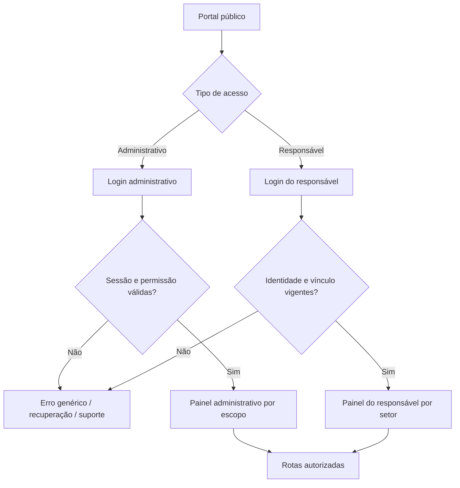
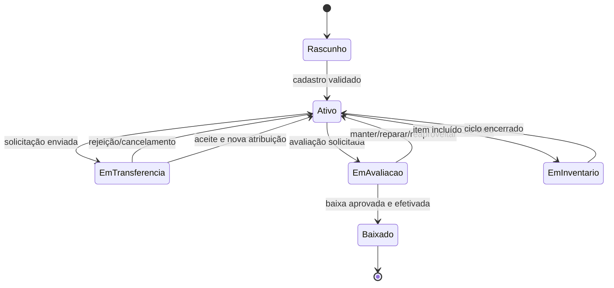
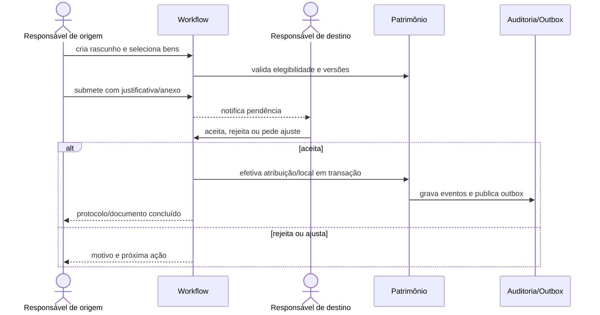
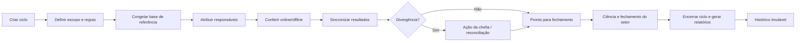
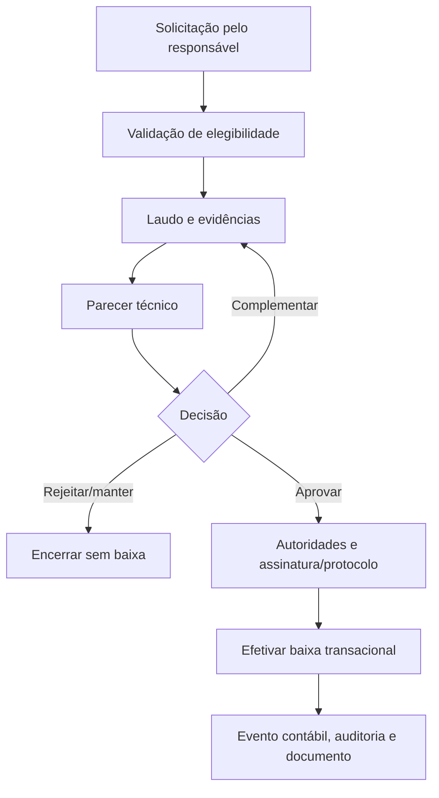
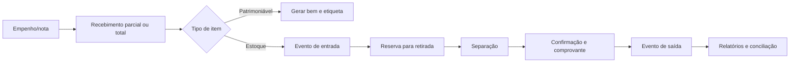
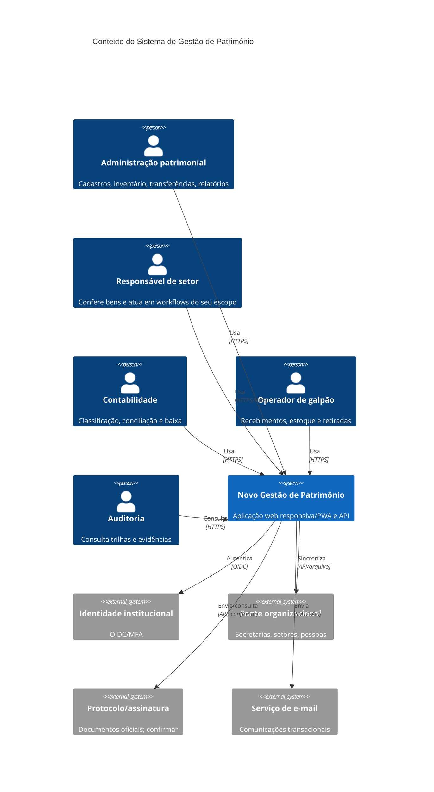
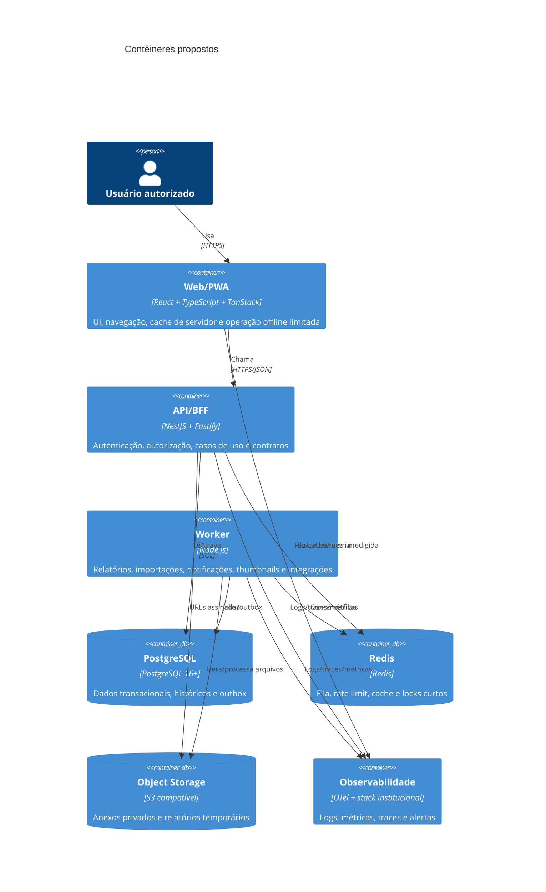
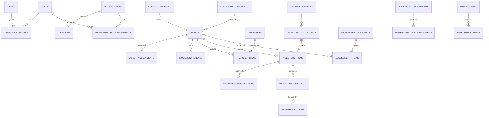
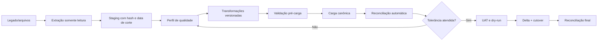

# PLANO DE 30 DIAS — MODERNIZAÇÃO DO SISTEMA DE GESTÃO DE PATRIMÔNIO

**Arquivo:** `PLANO_30_DIAS_GESTAO_PATRIMONIO.md`
**Versão do plano:** 1.0
**Data de elaboração:** 28 de julho de 2026
**Horizonte:** 30 dias úteis de execução intensiva
**Público-alvo:** desenvolvedores júnior/pleno, tech lead, QA, UX, DevOps, segurança, DBA e representantes do negócio
**Objetivo:** reconstruir o sistema de gestão patrimonial com paridade funcional certificável, segurança, acessibilidade, desempenho e capacidade de evolução

## Aviso obrigatório sobre o nível de evidência

**Limitação da evidência:** as páginas públicas de entrada e o código-fonte React do ZIP anexado foram inspecionados. O ambiente de análise disponível não permitiu submeter o formulário do legado autenticado nem percorrer telas protegidas. Por isso, este documento classifica cada item como confirmado em página pública, confirmado no código React, inferido pelo domínio/rotas ou proposto. **A afirmação de “100% de paridade” somente poderá ser aceita após walkthrough autenticado, matriz de paridade completa, reconciliação de relatórios e UAT assinada por usuários do negócio.**

Credenciais fornecidas para acesso e quaisquer credenciais/dados pessoais encontrados no ZIP **não são reproduzidos neste documento**. O protótipo contém indícios de exposição de dados sensíveis no cliente; a contenção e rotação desses dados é tratada como prioridade de segurança no Dia 1.

## Como usar este plano

1. Execute os dias em sequência; somente avance quando todos os critérios de aceite do dia estiverem satisfeitos ou houver exceção formal registrada.
2. Use a matriz de paridade como fonte de rastreabilidade entre legado, requisito, código, teste, relatório e aceite do negócio.
3. Crie uma branch curta por entrega, mantenha pull requests pequenos e vincule cada alteração aos IDs de requisito e risco deste documento.
4. Registre evidências ao final de cada tarefa: commit, pull request, teste, captura redigida, relatório, log de CI ou ata de validação.
5. Não use dados pessoais reais em desenvolvimento; prefira factories sintéticas e ambientes segregados.
6. Qualquer regra divergente descoberta no legado deve atualizar este documento, o contrato, o teste e a matriz de paridade no mesmo ciclo.

## Legenda de classificação

| Código | Significado | Como validar |
| --- | --- | --- |
| CONF-PUB | Confirmado em página pública | Captura da página pública, URL e data de acesso |
| CONF-COD | Confirmado no código React do ZIP | Arquivo/rota/função do ZIP e revisão técnica |
| CONF-AMBOS | Confirmado por página pública e código React | Evidência pública mais evidência no protótipo |
| INFERIDO | Inferido pelo domínio/rotas; validar no legado autenticado | Walkthrough autenticado e validação do dono do processo |
| PROPOSTO | Proposto para o novo sistema | Aprovação de produto/arquitetura e teste de valor |

## Definition of Done global

- [ ] Requisito e regra de negócio possuem ID, fonte, owner e critério de aceite.
- [ ] Código passa em lint, typecheck, testes, build, SCA e secret scan.
- [ ] Autorização é validada no backend e há teste de acesso horizontal/vertical.
- [ ] Tela possui estados de carregamento, vazio, erro, indisponibilidade e falta de permissão.
- [ ] Fluxo crítico é navegável por teclado e sem bloqueadores WCAG 2.2 AA.
- [ ] Mutação produz auditoria e telemetria sem registrar segredo ou PII desnecessária.
- [ ] Contrato OpenAPI e cliente gerado estão sincronizados.
- [ ] Migração/relatório tem reconciliação reproduzível quando aplicável.
- [ ] Documentação e runbook foram atualizados.
- [ ] Aceite funcional foi registrado por usuário autorizado do negócio.

# 1. SEÇÃO 1 — ANÁLISE DO SISTEMA ATUAL

## 1.1 Escopo, método e fontes de evidência

A análise usa triangulação de evidências: páginas públicas do legado, estrutura e comportamento do protótipo React, nomenclatura das rotas, descrições presentes no código e padrões conhecidos do domínio patrimonial. Itens não observados no ambiente autenticado são tratados como hipóteses de trabalho, nunca como fatos consumados.

| Fonte | Conteúdo observado | Confiabilidade | Limitação |
| --- | --- | --- | --- |
| Página pública principal | Dois acessos: Administrativo e Responsáveis do Patrimônio; menções a transferência, avaliação, troca de responsabilidade e inventário | Alta para o conteúdo exibido | Não mostra menus internos |
| Login administrativo | Acesso restrito, usuário, senha e botão de entrada | Alta para a tela pública | Formulário não pôde ser submetido pelo ambiente de análise |
| Login do responsável | Usuário, senha, entrada e recuperação de senha | Alta para a tela pública | Sem acesso às telas protegidas |
| ZIP React | 123 arquivos; 110 em `src`; 41 rotas TSX; 15,577 linhas TS/TSX/CSS | Alta para o código recebido | Protótipo incompleto e não equivale ao legado |
| Entrevistas/walkthrough | Previstos no Dia 1 | Necessários para certificação | Ainda não executados neste documento |

### 1.1.1 Endpoints públicos observados

- Portal público: `https://admgestaodepatrimonio.santanadeparnaiba.sp.gov.br/`
- Login administrativo: `https://admgestaodepatrimonio.santanadeparnaiba.sp.gov.br/adm/login.php`
- Login do responsável: `https://admgestaodepatrimonio.santanadeparnaiba.sp.gov.br/usuarios/index.html`
- Data de referência da inspeção: **28 de julho de 2026**.

### 1.1.2 Protocolo de descoberta autenticada obrigatório

- [ ] **DESC-01:** Solicitar autorização formal e contas de teste para cada papel real.
- [ ] **DESC-02:** Criar massa sintética para operações de criação, transferência, baixa e cancelamento.
- [ ] **DESC-03:** Registrar menu, URL, título, permissões, campos, ações, estados e mensagens de cada tela.
- [ ] **DESC-04:** Executar caminho feliz, validações, erro, cancelamento, reabertura e concorrência.
- [ ] **DESC-05:** Gerar todos os relatórios e exportações com filtros conhecidos.
- [ ] **DESC-06:** Identificar integrações por chamadas de rede, documentos e comportamento, sem interceptar segredos.
- [ ] **DESC-07:** Entrevistar pelo menos um usuário por área e capturar regras não visíveis.
- [ ] **DESC-08:** Relacionar cada evidência à matriz de paridade e obter assinatura do dono do processo.

## 1.2 Mapeamento completo dos módulos identificados

| ID | Módulo | Público | Evidência | Entrada/rota |
| --- | --- | --- | --- | --- |
| MOD-01 | Portal de entrada e seleção de perfil | Todos os usuários | Confirmado por página pública e código React | Página pública do legado; rota React `/` |
| MOD-02 | Autenticação administrativa | Administradores, contabilidade, chefia, galpão e auditoria | Confirmado por página pública e código React | Legado `/adm/login.php`; React `/login` |
| MOD-03 | Autenticação do responsável de patrimônio | Responsáveis de setor e substitutos vigentes | Confirmado por página pública e código React | Legado `/usuarios/index.html`; React `/responsavel-login` e `/set-password` |
| MOD-04 | Usuários, perfis, permissões e escopos | Administrador de segurança e gestores autorizados | Confirmado no código React do ZIP | React `/adm/locais/cadastro-usuarios` e `/adm/contabilidade/usuarios` |
| MOD-05 | Painel administrativo | Administração patrimonial, contabilidade e gestão | Confirmado no código React do ZIP | React `/adm` |
| MOD-06 | Explorador de patrimônios | Administração, contabilidade, chefia e auditoria | Confirmado no código React do ZIP | React `/adm/explorar` |
| MOD-07 | Base organizacional de secretarias, setores e locais | Administração patrimonial e gestores de cadastro | Confirmado no código React do ZIP | React `/adm/base` |
| MOD-08 | Buscas e demonstrativos de responsáveis | Contabilidade e administração autorizada | Confirmado no código React do ZIP | React `/adm/buscas` |
| MOD-09 | Chefia — tratamento de bens não localizados | Chefias e administração patrimonial | Confirmado no código React do ZIP | React `/chefia` |
| MOD-10 | Etiquetas patrimoniais | Administração patrimonial, inventaristas e galpão | Confirmado no código React do ZIP | React `/adm/etiqueta` |
| MOD-11 | Monitoramento de inventário por setor | Coordenação de inventário e secretarias | Confirmado no código React do ZIP | React `/adm/inventario/monitoramento` |
| MOD-12 | Inventário do responsável | Responsável de setor e equipe delegada | Confirmado por página pública e código React | React `/responsavel/inventario` e `/inventario/lista` |
| MOD-13 | Conferência histórica | Administração, auditoria e responsáveis autorizados | Confirmado no código React do ZIP | React `/inventario/conferencia` |
| MOD-14 | Transferência de bens pelo solicitante | Responsáveis de origem e usuários autorizados | Confirmado por página pública e código React | React `/inventario/transferir` e `/responsavel/transferencia` |
| MOD-15 | Aceite de transferências pendentes | Responsável de destino e aprovadores | Confirmado por página pública e código React | React `/responsavel/transferencias-pendentes` |
| MOD-16 | Gestão administrativa de transferências | Administração patrimonial e contabilidade | Confirmado no código React do ZIP | React `/adm/inventario/transferencias` |
| MOD-17 | Transferências especializadas de merenda | Unidades de alimentação, galpão e administração | Confirmado no código React do ZIP | React `/adm/inventario/merenda` |
| MOD-18 | Avaliação de bens e baixa | Responsáveis, comissão, secretaria e contabilidade | Confirmado por página pública e código React | React `/responsavel/avaliacao` |
| MOD-19 | Troca de responsabilidade | Responsável atual, substituto, chefia e administração | Confirmado por página pública e código React | React `/responsavel/troca-responsabilidade` |
| MOD-20 | Portarias e atos de designação | Responsáveis, administração e chefias | Confirmado por página pública e código React | React `/responsavel/portaria` e `/adm/locais/portaria` |
| MOD-21 | Fichas de locais e termos | Administração, responsáveis e auditoria | Confirmado no código React do ZIP | React `/adm/locais/fichas` |
| MOD-22 | Bens do setor | Responsáveis, chefias e administração | Confirmado no código React do ZIP | React `/locais/bens-setor` |
| MOD-23 | Painel do setor | Responsável e chefia da unidade | Confirmado no código React do ZIP | React `/painel-setor` |
| MOD-24 | Painel do responsável | Responsável de patrimônio | Confirmado no código React do ZIP | React `/responsavel` |
| MOD-25 | Painel e indicadores do galpão | Operadores e gestores do galpão | Confirmado no código React do ZIP | React `/adm/galpao/graficos` |
| MOD-26 | Retiradas do galpão | Operador de galpão e recebedor autorizado | Confirmado no código React do ZIP | React `/adm/galpao/retiradas` |
| MOD-27 | Gerenciamento de retiradas e PDF | Gestor do galpão e auditoria | Confirmado no código React do ZIP | React `/adm/galpao/retiradas/gerenciar` |
| MOD-28 | Notas, empenhos, recebimentos e entrada patrimonial | Galpão, patrimônio e contabilidade | Confirmado no código React do ZIP | React `/adm/galpao/empenhos` |
| MOD-29 | Captura e envio de fotos | Inventaristas, responsáveis e administração | Confirmado no código React do ZIP | React `/adm/fotos/capturar` |
| MOD-30 | Canvas e composição visual de fotos | Administração patrimonial e equipe de documentação | Confirmado no código React do ZIP | React `/adm/fotos/canvas` |
| MOD-31 | Painel de e-mails e comunicações | Administração e usuários com permissão de comunicação | Confirmado no código React do ZIP | React `/adm/painel-emails` |
| MOD-32 | Assistente de IA para consulta patrimonial | Usuários autorizados, com escopo preservado | Confirmado no código React do ZIP | React `/adm/ia` |
| MOD-33 | Tutorial, ajuda contextual e central de conhecimento | Todos os perfis | Confirmado no código React do ZIP | React `/responsavel/tutorial` |
| MOD-34 | Cadastro mestre de bens patrimoniais | Administração patrimonial e contabilidade | Inferido pelo domínio/rotas; validar no legado autenticado | A confirmar no legado; necessário para paridade funcional |
| MOD-35 | Categorias, classificações e contas contábeis | Contabilidade e administração patrimonial | Inferido pelo domínio/rotas; validar no legado autenticado | A confirmar no legado; parcialmente visível em filtros do protótipo |
| MOD-36 | Histórico, auditoria e linha do tempo | Auditoria, administração e suporte autorizado | Proposto para o novo sistema | Componente transversal do novo sistema |
| MOD-37 | Central de relatórios e exportações | Perfis autorizados conforme relatório | Proposto para o novo sistema | Nova rota `/relatorios` e jobs de exportação |
| MOD-38 | Notificações, calendário e tarefas | Todos os perfis | Proposto para o novo sistema | Centro de notificações e agenda no novo sistema |
| MOD-39 | Administração e configurações do sistema | Administrador funcional e administrador técnico | Proposto para o novo sistema | Nova rota `/admin/configuracoes` |
| MOD-40 | Busca global e navegação inteligente | Todos os perfis conforme escopo | Proposto para o novo sistema | Command palette e rota `/buscar` |
| MOD-41 | Integrações e interoperabilidade | Administração técnica e sistemas externos autorizados | Inferido pelo domínio/rotas; validar no legado autenticado | APIs, filas e conectores; sistemas exatos devem ser confirmados |

## 1.3 Detalhamento funcional por módulo

### 1.3.1 MOD-01 — Portal de entrada e seleção de perfil

| Atributo | Definição |
| --- | --- |
| Público principal | Todos os usuários |
| Nível de evidência | Confirmado por página pública e código React |
| Entrada/rota conhecida | Página pública do legado; rota React `/` |
| Responsável sugerido | Product Owner do domínio + líder técnico do módulo |
| Prioridade de paridade | Alta |

#### Propósito

Direcionar o usuário ao contexto administrativo ou ao portal do responsável, preservando identidade visual, ajuda e avisos institucionais.

#### Funcionalidades identificadas ou requeridas

- **RF-MOD-01-01:** Exibir opções de acesso Administrativo e Responsável.
- **RF-MOD-01-02:** Explicar resumidamente o escopo de cada perfil.
- **RF-MOD-01-03:** Direcionar para o login correto.
- **RF-MOD-01-04:** Disponibilizar versão, política de privacidade, acessibilidade e canal de suporte.
- **RF-MOD-01-05:** Detectar sessão válida e sugerir continuidade sem expor dados.

#### Regras de negócio observadas/inferidas

- **RN-MOD-01-01:** A seleção de perfil não concede autorização.
- **RN-MOD-01-02:** Uma sessão válida deve redirecionar apenas para escopo permitido.
- **RN-MOD-01-03:** Informações públicas não devem revelar nomes de usuários, setores sensíveis ou dados patrimoniais.

#### Relatórios e exportações associados

- **REL-MOD-01-01:** Telemetria agregada de escolha de perfil e falhas de navegação, sem PII.

#### Requisitos não funcionais do módulo

- **RNF-MOD-01-01:** Tempo de resposta p95 menor que 800 ms para consultas paginadas usuais e menor que 2 s para relatórios síncronos permitidos.
- **RNF-MOD-01-02:** Navegação completa por teclado, foco visível, nomes acessíveis e contraste compatível com WCAG 2.2 nível AA.
- **RNF-MOD-01-03:** Responsividade validada em 360 px, 768 px, 1024 px e 1440 px sem perda funcional.
- **RNF-MOD-01-04:** Autorização aplicada no backend, além de ocultação de controles no frontend; nenhuma regra crítica depende apenas da interface.
- **RNF-MOD-01-05:** Toda mutação relevante produz evento de auditoria imutável com ator, escopo, data/hora, origem e resumo das alterações.
- **RNF-MOD-01-06:** Estados de carregamento, vazio, erro, indisponibilidade e ausência de permissão são explícitos e testáveis.

#### Critérios de paridade e melhoria

- [ ] **AC-MOD-01-01:** Todos os campos, ações, mensagens e transições equivalentes do legado para **Portal de entrada e seleção de perfil** estão mapeados e testados.
- [ ] **AC-MOD-01-02:** O novo fluxo produz o mesmo resultado de negócio ou um resultado aprovado como superior, sem perda de regra.
- [ ] **AC-MOD-01-03:** Permissões foram comparadas por papel e escopo, incluindo negações.
- [ ] **AC-MOD-01-04:** Relatórios e totais reconciliam com amostra oficial ou regra documentada.
- [ ] **AC-MOD-01-05:** Fluxo é utilizável em desktop e 360 px sem perda de função.
- [ ] **AC-MOD-01-06:** Acessibilidade por teclado, foco, mensagens e contraste foi verificada.
- [ ] **AC-MOD-01-07:** Erros e indisponibilidades oferecem recuperação segura.
- [ ] **AC-MOD-01-08:** UAT foi assinada pelo dono do processo e evidência anexada à matriz.

#### Cenários mínimos de teste

##### CT-MOD-01-01 — Caminho feliz com dados válidos e usuário autorizado.

- **Pré-condição:** usuário de teste com perfil e escopo explicitamente definidos para Portal de entrada e seleção de perfil.
- **Dados:** massa sintética criada por factory; nenhuma credencial ou PII copiada do legado.
- **Ação:** executar caminho feliz com dados válidos e usuário autorizado. no fluxo principal e por chamada direta de API quando aplicável.
- **Resultado esperado:** regra, autorização, persistência, mensagem e auditoria concordam com o contrato.
- **Evidência:** ID da execução, log correlacionado, captura redigida e referência ao commit/build.
- **Automação:** unitário para invariantes, integração para API/dados e E2E apenas para a jornada crítica.

##### CT-MOD-01-02 — Negação por perfil, secretaria, setor ou vínculo de responsabilidade incompatível.

- **Pré-condição:** usuário de teste com perfil e escopo explicitamente definidos para Portal de entrada e seleção de perfil.
- **Dados:** massa sintética criada por factory; nenhuma credencial ou PII copiada do legado.
- **Ação:** executar negação por perfil, secretaria, setor ou vínculo de responsabilidade incompatível. no fluxo principal e por chamada direta de API quando aplicável.
- **Resultado esperado:** regra, autorização, persistência, mensagem e auditoria concordam com o contrato.
- **Evidência:** ID da execução, log correlacionado, captura redigida e referência ao commit/build.
- **Automação:** unitário para invariantes, integração para API/dados e E2E apenas para a jornada crítica.

##### CT-MOD-01-03 — Validações de obrigatoriedade, formato, duplicidade e transição de estado inválida.

- **Pré-condição:** usuário de teste com perfil e escopo explicitamente definidos para Portal de entrada e seleção de perfil.
- **Dados:** massa sintética criada por factory; nenhuma credencial ou PII copiada do legado.
- **Ação:** executar validações de obrigatoriedade, formato, duplicidade e transição de estado inválida. no fluxo principal e por chamada direta de API quando aplicável.
- **Resultado esperado:** regra, autorização, persistência, mensagem e auditoria concordam com o contrato.
- **Evidência:** ID da execução, log correlacionado, captura redigida e referência ao commit/build.
- **Automação:** unitário para invariantes, integração para API/dados e E2E apenas para a jornada crítica.

##### CT-MOD-01-04 — Concorrência entre dois usuários alterando o mesmo registro; exibir conflito e impedir sobrescrita silenciosa.

- **Pré-condição:** usuário de teste com perfil e escopo explicitamente definidos para Portal de entrada e seleção de perfil.
- **Dados:** massa sintética criada por factory; nenhuma credencial ou PII copiada do legado.
- **Ação:** executar concorrência entre dois usuários alterando o mesmo registro; exibir conflito e impedir sobrescrita silenciosa. no fluxo principal e por chamada direta de API quando aplicável.
- **Resultado esperado:** regra, autorização, persistência, mensagem e auditoria concordam com o contrato.
- **Evidência:** ID da execução, log correlacionado, captura redigida e referência ao commit/build.
- **Automação:** unitário para invariantes, integração para API/dados e E2E apenas para a jornada crítica.

##### CT-MOD-01-05 — Rede lenta, timeout, indisponibilidade parcial e repetição idempotente da requisição.

- **Pré-condição:** usuário de teste com perfil e escopo explicitamente definidos para Portal de entrada e seleção de perfil.
- **Dados:** massa sintética criada por factory; nenhuma credencial ou PII copiada do legado.
- **Ação:** executar rede lenta, timeout, indisponibilidade parcial e repetição idempotente da requisição. no fluxo principal e por chamada direta de API quando aplicável.
- **Resultado esperado:** regra, autorização, persistência, mensagem e auditoria concordam com o contrato.
- **Evidência:** ID da execução, log correlacionado, captura redigida e referência ao commit/build.
- **Automação:** unitário para invariantes, integração para API/dados e E2E apenas para a jornada crítica.

##### CT-MOD-01-06 — Acessibilidade por teclado e leitor de tela nos principais controles e mensagens.

- **Pré-condição:** usuário de teste com perfil e escopo explicitamente definidos para Portal de entrada e seleção de perfil.
- **Dados:** massa sintética criada por factory; nenhuma credencial ou PII copiada do legado.
- **Ação:** executar acessibilidade por teclado e leitor de tela nos principais controles e mensagens. no fluxo principal e por chamada direta de API quando aplicável.
- **Resultado esperado:** regra, autorização, persistência, mensagem e auditoria concordam com o contrato.
- **Evidência:** ID da execução, log correlacionado, captura redigida e referência ao commit/build.
- **Automação:** unitário para invariantes, integração para API/dados e E2E apenas para a jornada crítica.

### 1.3.2 MOD-02 — Autenticação administrativa

| Atributo | Definição |
| --- | --- |
| Público principal | Administradores, contabilidade, chefia, galpão e auditoria |
| Nível de evidência | Confirmado por página pública e código React |
| Entrada/rota conhecida | Legado `/adm/login.php`; React `/login` |
| Responsável sugerido | Product Owner do domínio + líder técnico do módulo |
| Prioridade de paridade | Alta |

#### Propósito

Autenticar profissionais internos com sessão segura, política de senha institucional e integração futura com identidade corporativa.

#### Funcionalidades identificadas ou requeridas

- **RF-MOD-02-01:** Login.
- **RF-MOD-02-02:** Logout global.
- **RF-MOD-02-03:** Renovação segura de sessão.
- **RF-MOD-02-04:** MFA conforme risco.
- **RF-MOD-02-05:** Bloqueio progressivo e proteção contra força bruta.
- **RF-MOD-02-06:** Recuperação/primeiro acesso.
- **RF-MOD-02-07:** Exibição de sessões ativas e revogação.

#### Regras de negócio observadas/inferidas

- **RN-MOD-02-01:** Credenciais nunca ficam em bundle, localStorage ou logs.
- **RN-MOD-02-02:** Cookie de sessão deve ser HttpOnly, Secure e SameSite.
- **RN-MOD-02-03:** Autenticação deve ocorrer no servidor.
- **RN-MOD-02-04:** Falhas não revelam se o usuário existe.
- **RN-MOD-02-05:** Acesso administrativo exige perfil ativo e escopo vigente.

#### Relatórios e exportações associados

- **REL-MOD-02-01:** Tentativas, bloqueios, sessões revogadas e eventos de autenticação para segurança.

#### Requisitos não funcionais do módulo

- **RNF-MOD-02-01:** Tempo de resposta p95 menor que 800 ms para consultas paginadas usuais e menor que 2 s para relatórios síncronos permitidos.
- **RNF-MOD-02-02:** Navegação completa por teclado, foco visível, nomes acessíveis e contraste compatível com WCAG 2.2 nível AA.
- **RNF-MOD-02-03:** Responsividade validada em 360 px, 768 px, 1024 px e 1440 px sem perda funcional.
- **RNF-MOD-02-04:** Autorização aplicada no backend, além de ocultação de controles no frontend; nenhuma regra crítica depende apenas da interface.
- **RNF-MOD-02-05:** Toda mutação relevante produz evento de auditoria imutável com ator, escopo, data/hora, origem e resumo das alterações.
- **RNF-MOD-02-06:** Estados de carregamento, vazio, erro, indisponibilidade e ausência de permissão são explícitos e testáveis.

#### Critérios de paridade e melhoria

- [ ] **AC-MOD-02-01:** Todos os campos, ações, mensagens e transições equivalentes do legado para **Autenticação administrativa** estão mapeados e testados.
- [ ] **AC-MOD-02-02:** O novo fluxo produz o mesmo resultado de negócio ou um resultado aprovado como superior, sem perda de regra.
- [ ] **AC-MOD-02-03:** Permissões foram comparadas por papel e escopo, incluindo negações.
- [ ] **AC-MOD-02-04:** Relatórios e totais reconciliam com amostra oficial ou regra documentada.
- [ ] **AC-MOD-02-05:** Fluxo é utilizável em desktop e 360 px sem perda de função.
- [ ] **AC-MOD-02-06:** Acessibilidade por teclado, foco, mensagens e contraste foi verificada.
- [ ] **AC-MOD-02-07:** Erros e indisponibilidades oferecem recuperação segura.
- [ ] **AC-MOD-02-08:** UAT foi assinada pelo dono do processo e evidência anexada à matriz.

#### Cenários mínimos de teste

##### CT-MOD-02-01 — Caminho feliz com dados válidos e usuário autorizado.

- **Pré-condição:** usuário de teste com perfil e escopo explicitamente definidos para Autenticação administrativa.
- **Dados:** massa sintética criada por factory; nenhuma credencial ou PII copiada do legado.
- **Ação:** executar caminho feliz com dados válidos e usuário autorizado. no fluxo principal e por chamada direta de API quando aplicável.
- **Resultado esperado:** regra, autorização, persistência, mensagem e auditoria concordam com o contrato.
- **Evidência:** ID da execução, log correlacionado, captura redigida e referência ao commit/build.
- **Automação:** unitário para invariantes, integração para API/dados e E2E apenas para a jornada crítica.

##### CT-MOD-02-02 — Negação por perfil, secretaria, setor ou vínculo de responsabilidade incompatível.

- **Pré-condição:** usuário de teste com perfil e escopo explicitamente definidos para Autenticação administrativa.
- **Dados:** massa sintética criada por factory; nenhuma credencial ou PII copiada do legado.
- **Ação:** executar negação por perfil, secretaria, setor ou vínculo de responsabilidade incompatível. no fluxo principal e por chamada direta de API quando aplicável.
- **Resultado esperado:** regra, autorização, persistência, mensagem e auditoria concordam com o contrato.
- **Evidência:** ID da execução, log correlacionado, captura redigida e referência ao commit/build.
- **Automação:** unitário para invariantes, integração para API/dados e E2E apenas para a jornada crítica.

##### CT-MOD-02-03 — Validações de obrigatoriedade, formato, duplicidade e transição de estado inválida.

- **Pré-condição:** usuário de teste com perfil e escopo explicitamente definidos para Autenticação administrativa.
- **Dados:** massa sintética criada por factory; nenhuma credencial ou PII copiada do legado.
- **Ação:** executar validações de obrigatoriedade, formato, duplicidade e transição de estado inválida. no fluxo principal e por chamada direta de API quando aplicável.
- **Resultado esperado:** regra, autorização, persistência, mensagem e auditoria concordam com o contrato.
- **Evidência:** ID da execução, log correlacionado, captura redigida e referência ao commit/build.
- **Automação:** unitário para invariantes, integração para API/dados e E2E apenas para a jornada crítica.

##### CT-MOD-02-04 — Concorrência entre dois usuários alterando o mesmo registro; exibir conflito e impedir sobrescrita silenciosa.

- **Pré-condição:** usuário de teste com perfil e escopo explicitamente definidos para Autenticação administrativa.
- **Dados:** massa sintética criada por factory; nenhuma credencial ou PII copiada do legado.
- **Ação:** executar concorrência entre dois usuários alterando o mesmo registro; exibir conflito e impedir sobrescrita silenciosa. no fluxo principal e por chamada direta de API quando aplicável.
- **Resultado esperado:** regra, autorização, persistência, mensagem e auditoria concordam com o contrato.
- **Evidência:** ID da execução, log correlacionado, captura redigida e referência ao commit/build.
- **Automação:** unitário para invariantes, integração para API/dados e E2E apenas para a jornada crítica.

##### CT-MOD-02-05 — Rede lenta, timeout, indisponibilidade parcial e repetição idempotente da requisição.

- **Pré-condição:** usuário de teste com perfil e escopo explicitamente definidos para Autenticação administrativa.
- **Dados:** massa sintética criada por factory; nenhuma credencial ou PII copiada do legado.
- **Ação:** executar rede lenta, timeout, indisponibilidade parcial e repetição idempotente da requisição. no fluxo principal e por chamada direta de API quando aplicável.
- **Resultado esperado:** regra, autorização, persistência, mensagem e auditoria concordam com o contrato.
- **Evidência:** ID da execução, log correlacionado, captura redigida e referência ao commit/build.
- **Automação:** unitário para invariantes, integração para API/dados e E2E apenas para a jornada crítica.

##### CT-MOD-02-06 — Acessibilidade por teclado e leitor de tela nos principais controles e mensagens.

- **Pré-condição:** usuário de teste com perfil e escopo explicitamente definidos para Autenticação administrativa.
- **Dados:** massa sintética criada por factory; nenhuma credencial ou PII copiada do legado.
- **Ação:** executar acessibilidade por teclado e leitor de tela nos principais controles e mensagens. no fluxo principal e por chamada direta de API quando aplicável.
- **Resultado esperado:** regra, autorização, persistência, mensagem e auditoria concordam com o contrato.
- **Evidência:** ID da execução, log correlacionado, captura redigida e referência ao commit/build.
- **Automação:** unitário para invariantes, integração para API/dados e E2E apenas para a jornada crítica.

### 1.3.3 MOD-03 — Autenticação do responsável de patrimônio

| Atributo | Definição |
| --- | --- |
| Público principal | Responsáveis de setor e substitutos vigentes |
| Nível de evidência | Confirmado por página pública e código React |
| Entrada/rota conhecida | Legado `/usuarios/index.html`; React `/responsavel-login` e `/set-password` |
| Responsável sugerido | Product Owner do domínio + líder técnico do módulo |
| Prioridade de paridade | Alta |

#### Propósito

Permitir acesso de responsáveis ao inventário e aos fluxos de sua unidade, com primeiro acesso e recuperação de senha seguros.

#### Funcionalidades identificadas ou requeridas

- **RF-MOD-03-01:** Login por identidade institucional.
- **RF-MOD-03-02:** Primeiro acesso.
- **RF-MOD-03-03:** Redefinição de senha.
- **RF-MOD-03-04:** Recuperação assistida.
- **RF-MOD-03-05:** Aceite de termos e aviso de privacidade.
- **RF-MOD-03-06:** Encerramento de sessão.
- **RF-MOD-03-07:** Bloqueio por vínculo expirado.

#### Regras de negócio observadas/inferidas

- **RN-MOD-03-01:** O vínculo ativo com setor define o escopo.
- **RN-MOD-03-02:** Mudança de responsabilidade invalida ou reduz o escopo imediatamente.
- **RN-MOD-03-03:** Nenhuma senha temporária pode ser consultável por administradores.
- **RN-MOD-03-04:** Recuperação exige canal verificado e token de uso único.

#### Relatórios e exportações associados

- **REL-MOD-03-01:** Acessos por unidade, falhas e contas sem vínculo válido.

#### Requisitos não funcionais do módulo

- **RNF-MOD-03-01:** Tempo de resposta p95 menor que 800 ms para consultas paginadas usuais e menor que 2 s para relatórios síncronos permitidos.
- **RNF-MOD-03-02:** Navegação completa por teclado, foco visível, nomes acessíveis e contraste compatível com WCAG 2.2 nível AA.
- **RNF-MOD-03-03:** Responsividade validada em 360 px, 768 px, 1024 px e 1440 px sem perda funcional.
- **RNF-MOD-03-04:** Autorização aplicada no backend, além de ocultação de controles no frontend; nenhuma regra crítica depende apenas da interface.
- **RNF-MOD-03-05:** Toda mutação relevante produz evento de auditoria imutável com ator, escopo, data/hora, origem e resumo das alterações.
- **RNF-MOD-03-06:** Estados de carregamento, vazio, erro, indisponibilidade e ausência de permissão são explícitos e testáveis.

#### Critérios de paridade e melhoria

- [ ] **AC-MOD-03-01:** Todos os campos, ações, mensagens e transições equivalentes do legado para **Autenticação do responsável de patrimônio** estão mapeados e testados.
- [ ] **AC-MOD-03-02:** O novo fluxo produz o mesmo resultado de negócio ou um resultado aprovado como superior, sem perda de regra.
- [ ] **AC-MOD-03-03:** Permissões foram comparadas por papel e escopo, incluindo negações.
- [ ] **AC-MOD-03-04:** Relatórios e totais reconciliam com amostra oficial ou regra documentada.
- [ ] **AC-MOD-03-05:** Fluxo é utilizável em desktop e 360 px sem perda de função.
- [ ] **AC-MOD-03-06:** Acessibilidade por teclado, foco, mensagens e contraste foi verificada.
- [ ] **AC-MOD-03-07:** Erros e indisponibilidades oferecem recuperação segura.
- [ ] **AC-MOD-03-08:** UAT foi assinada pelo dono do processo e evidência anexada à matriz.

#### Cenários mínimos de teste

##### CT-MOD-03-01 — Caminho feliz com dados válidos e usuário autorizado.

- **Pré-condição:** usuário de teste com perfil e escopo explicitamente definidos para Autenticação do responsável de patrimônio.
- **Dados:** massa sintética criada por factory; nenhuma credencial ou PII copiada do legado.
- **Ação:** executar caminho feliz com dados válidos e usuário autorizado. no fluxo principal e por chamada direta de API quando aplicável.
- **Resultado esperado:** regra, autorização, persistência, mensagem e auditoria concordam com o contrato.
- **Evidência:** ID da execução, log correlacionado, captura redigida e referência ao commit/build.
- **Automação:** unitário para invariantes, integração para API/dados e E2E apenas para a jornada crítica.

##### CT-MOD-03-02 — Negação por perfil, secretaria, setor ou vínculo de responsabilidade incompatível.

- **Pré-condição:** usuário de teste com perfil e escopo explicitamente definidos para Autenticação do responsável de patrimônio.
- **Dados:** massa sintética criada por factory; nenhuma credencial ou PII copiada do legado.
- **Ação:** executar negação por perfil, secretaria, setor ou vínculo de responsabilidade incompatível. no fluxo principal e por chamada direta de API quando aplicável.
- **Resultado esperado:** regra, autorização, persistência, mensagem e auditoria concordam com o contrato.
- **Evidência:** ID da execução, log correlacionado, captura redigida e referência ao commit/build.
- **Automação:** unitário para invariantes, integração para API/dados e E2E apenas para a jornada crítica.

##### CT-MOD-03-03 — Validações de obrigatoriedade, formato, duplicidade e transição de estado inválida.

- **Pré-condição:** usuário de teste com perfil e escopo explicitamente definidos para Autenticação do responsável de patrimônio.
- **Dados:** massa sintética criada por factory; nenhuma credencial ou PII copiada do legado.
- **Ação:** executar validações de obrigatoriedade, formato, duplicidade e transição de estado inválida. no fluxo principal e por chamada direta de API quando aplicável.
- **Resultado esperado:** regra, autorização, persistência, mensagem e auditoria concordam com o contrato.
- **Evidência:** ID da execução, log correlacionado, captura redigida e referência ao commit/build.
- **Automação:** unitário para invariantes, integração para API/dados e E2E apenas para a jornada crítica.

##### CT-MOD-03-04 — Concorrência entre dois usuários alterando o mesmo registro; exibir conflito e impedir sobrescrita silenciosa.

- **Pré-condição:** usuário de teste com perfil e escopo explicitamente definidos para Autenticação do responsável de patrimônio.
- **Dados:** massa sintética criada por factory; nenhuma credencial ou PII copiada do legado.
- **Ação:** executar concorrência entre dois usuários alterando o mesmo registro; exibir conflito e impedir sobrescrita silenciosa. no fluxo principal e por chamada direta de API quando aplicável.
- **Resultado esperado:** regra, autorização, persistência, mensagem e auditoria concordam com o contrato.
- **Evidência:** ID da execução, log correlacionado, captura redigida e referência ao commit/build.
- **Automação:** unitário para invariantes, integração para API/dados e E2E apenas para a jornada crítica.

##### CT-MOD-03-05 — Rede lenta, timeout, indisponibilidade parcial e repetição idempotente da requisição.

- **Pré-condição:** usuário de teste com perfil e escopo explicitamente definidos para Autenticação do responsável de patrimônio.
- **Dados:** massa sintética criada por factory; nenhuma credencial ou PII copiada do legado.
- **Ação:** executar rede lenta, timeout, indisponibilidade parcial e repetição idempotente da requisição. no fluxo principal e por chamada direta de API quando aplicável.
- **Resultado esperado:** regra, autorização, persistência, mensagem e auditoria concordam com o contrato.
- **Evidência:** ID da execução, log correlacionado, captura redigida e referência ao commit/build.
- **Automação:** unitário para invariantes, integração para API/dados e E2E apenas para a jornada crítica.

##### CT-MOD-03-06 — Acessibilidade por teclado e leitor de tela nos principais controles e mensagens.

- **Pré-condição:** usuário de teste com perfil e escopo explicitamente definidos para Autenticação do responsável de patrimônio.
- **Dados:** massa sintética criada por factory; nenhuma credencial ou PII copiada do legado.
- **Ação:** executar acessibilidade por teclado e leitor de tela nos principais controles e mensagens. no fluxo principal e por chamada direta de API quando aplicável.
- **Resultado esperado:** regra, autorização, persistência, mensagem e auditoria concordam com o contrato.
- **Evidência:** ID da execução, log correlacionado, captura redigida e referência ao commit/build.
- **Automação:** unitário para invariantes, integração para API/dados e E2E apenas para a jornada crítica.

### 1.3.4 MOD-04 — Usuários, perfis, permissões e escopos

| Atributo | Definição |
| --- | --- |
| Público principal | Administrador de segurança e gestores autorizados |
| Nível de evidência | Confirmado no código React do ZIP |
| Entrada/rota conhecida | React `/adm/locais/cadastro-usuarios` e `/adm/contabilidade/usuarios` |
| Responsável sugerido | Product Owner do domínio + líder técnico do módulo |
| Prioridade de paridade | Alta |

#### Propósito

Gerenciar identidades e autorizações separando papel funcional, escopo organizacional, vigência e delegação.

#### Funcionalidades identificadas ou requeridas

- **RF-MOD-04-01:** Listar e pesquisar usuários.
- **RF-MOD-04-02:** Criar convite ou vincular identidade existente.
- **RF-MOD-04-03:** Ativar, suspender e encerrar vínculo.
- **RF-MOD-04-04:** Atribuir papéis.
- **RF-MOD-04-05:** Atribuir escopo por secretaria, setor ou local.
- **RF-MOD-04-06:** Delegar responsabilidade com vigência.
- **RF-MOD-04-07:** Revisar acessos periodicamente.

#### Regras de negócio observadas/inferidas

- **RN-MOD-04-01:** Princípio do menor privilégio.
- **RN-MOD-04-02:** Segregação entre criação e aprovação de acesso crítico.
- **RN-MOD-04-03:** Mudanças de papel devem ser auditadas.
- **RN-MOD-04-04:** Exclusão lógica preserva histórico.
- **RN-MOD-04-05:** Exportações mascaram PII por padrão.

#### Relatórios e exportações associados

- **REL-MOD-04-01:** Matriz usuário × papel × escopo.
- **REL-MOD-04-02:** Acessos sem uso.
- **REL-MOD-04-03:** Vínculos expirados.
- **REL-MOD-04-04:** Conflitos de segregação de função.

#### Requisitos não funcionais do módulo

- **RNF-MOD-04-01:** Tempo de resposta p95 menor que 800 ms para consultas paginadas usuais e menor que 2 s para relatórios síncronos permitidos.
- **RNF-MOD-04-02:** Navegação completa por teclado, foco visível, nomes acessíveis e contraste compatível com WCAG 2.2 nível AA.
- **RNF-MOD-04-03:** Responsividade validada em 360 px, 768 px, 1024 px e 1440 px sem perda funcional.
- **RNF-MOD-04-04:** Autorização aplicada no backend, além de ocultação de controles no frontend; nenhuma regra crítica depende apenas da interface.
- **RNF-MOD-04-05:** Toda mutação relevante produz evento de auditoria imutável com ator, escopo, data/hora, origem e resumo das alterações.
- **RNF-MOD-04-06:** Estados de carregamento, vazio, erro, indisponibilidade e ausência de permissão são explícitos e testáveis.

#### Critérios de paridade e melhoria

- [ ] **AC-MOD-04-01:** Todos os campos, ações, mensagens e transições equivalentes do legado para **Usuários, perfis, permissões e escopos** estão mapeados e testados.
- [ ] **AC-MOD-04-02:** O novo fluxo produz o mesmo resultado de negócio ou um resultado aprovado como superior, sem perda de regra.
- [ ] **AC-MOD-04-03:** Permissões foram comparadas por papel e escopo, incluindo negações.
- [ ] **AC-MOD-04-04:** Relatórios e totais reconciliam com amostra oficial ou regra documentada.
- [ ] **AC-MOD-04-05:** Fluxo é utilizável em desktop e 360 px sem perda de função.
- [ ] **AC-MOD-04-06:** Acessibilidade por teclado, foco, mensagens e contraste foi verificada.
- [ ] **AC-MOD-04-07:** Erros e indisponibilidades oferecem recuperação segura.
- [ ] **AC-MOD-04-08:** UAT foi assinada pelo dono do processo e evidência anexada à matriz.

#### Cenários mínimos de teste

##### CT-MOD-04-01 — Caminho feliz com dados válidos e usuário autorizado.

- **Pré-condição:** usuário de teste com perfil e escopo explicitamente definidos para Usuários, perfis, permissões e escopos.
- **Dados:** massa sintética criada por factory; nenhuma credencial ou PII copiada do legado.
- **Ação:** executar caminho feliz com dados válidos e usuário autorizado. no fluxo principal e por chamada direta de API quando aplicável.
- **Resultado esperado:** regra, autorização, persistência, mensagem e auditoria concordam com o contrato.
- **Evidência:** ID da execução, log correlacionado, captura redigida e referência ao commit/build.
- **Automação:** unitário para invariantes, integração para API/dados e E2E apenas para a jornada crítica.

##### CT-MOD-04-02 — Negação por perfil, secretaria, setor ou vínculo de responsabilidade incompatível.

- **Pré-condição:** usuário de teste com perfil e escopo explicitamente definidos para Usuários, perfis, permissões e escopos.
- **Dados:** massa sintética criada por factory; nenhuma credencial ou PII copiada do legado.
- **Ação:** executar negação por perfil, secretaria, setor ou vínculo de responsabilidade incompatível. no fluxo principal e por chamada direta de API quando aplicável.
- **Resultado esperado:** regra, autorização, persistência, mensagem e auditoria concordam com o contrato.
- **Evidência:** ID da execução, log correlacionado, captura redigida e referência ao commit/build.
- **Automação:** unitário para invariantes, integração para API/dados e E2E apenas para a jornada crítica.

##### CT-MOD-04-03 — Validações de obrigatoriedade, formato, duplicidade e transição de estado inválida.

- **Pré-condição:** usuário de teste com perfil e escopo explicitamente definidos para Usuários, perfis, permissões e escopos.
- **Dados:** massa sintética criada por factory; nenhuma credencial ou PII copiada do legado.
- **Ação:** executar validações de obrigatoriedade, formato, duplicidade e transição de estado inválida. no fluxo principal e por chamada direta de API quando aplicável.
- **Resultado esperado:** regra, autorização, persistência, mensagem e auditoria concordam com o contrato.
- **Evidência:** ID da execução, log correlacionado, captura redigida e referência ao commit/build.
- **Automação:** unitário para invariantes, integração para API/dados e E2E apenas para a jornada crítica.

##### CT-MOD-04-04 — Concorrência entre dois usuários alterando o mesmo registro; exibir conflito e impedir sobrescrita silenciosa.

- **Pré-condição:** usuário de teste com perfil e escopo explicitamente definidos para Usuários, perfis, permissões e escopos.
- **Dados:** massa sintética criada por factory; nenhuma credencial ou PII copiada do legado.
- **Ação:** executar concorrência entre dois usuários alterando o mesmo registro; exibir conflito e impedir sobrescrita silenciosa. no fluxo principal e por chamada direta de API quando aplicável.
- **Resultado esperado:** regra, autorização, persistência, mensagem e auditoria concordam com o contrato.
- **Evidência:** ID da execução, log correlacionado, captura redigida e referência ao commit/build.
- **Automação:** unitário para invariantes, integração para API/dados e E2E apenas para a jornada crítica.

##### CT-MOD-04-05 — Rede lenta, timeout, indisponibilidade parcial e repetição idempotente da requisição.

- **Pré-condição:** usuário de teste com perfil e escopo explicitamente definidos para Usuários, perfis, permissões e escopos.
- **Dados:** massa sintética criada por factory; nenhuma credencial ou PII copiada do legado.
- **Ação:** executar rede lenta, timeout, indisponibilidade parcial e repetição idempotente da requisição. no fluxo principal e por chamada direta de API quando aplicável.
- **Resultado esperado:** regra, autorização, persistência, mensagem e auditoria concordam com o contrato.
- **Evidência:** ID da execução, log correlacionado, captura redigida e referência ao commit/build.
- **Automação:** unitário para invariantes, integração para API/dados e E2E apenas para a jornada crítica.

##### CT-MOD-04-06 — Acessibilidade por teclado e leitor de tela nos principais controles e mensagens.

- **Pré-condição:** usuário de teste com perfil e escopo explicitamente definidos para Usuários, perfis, permissões e escopos.
- **Dados:** massa sintética criada por factory; nenhuma credencial ou PII copiada do legado.
- **Ação:** executar acessibilidade por teclado e leitor de tela nos principais controles e mensagens. no fluxo principal e por chamada direta de API quando aplicável.
- **Resultado esperado:** regra, autorização, persistência, mensagem e auditoria concordam com o contrato.
- **Evidência:** ID da execução, log correlacionado, captura redigida e referência ao commit/build.
- **Automação:** unitário para invariantes, integração para API/dados e E2E apenas para a jornada crítica.

### 1.3.5 MOD-05 — Painel administrativo

| Atributo | Definição |
| --- | --- |
| Público principal | Administração patrimonial, contabilidade e gestão |
| Nível de evidência | Confirmado no código React do ZIP |
| Entrada/rota conhecida | React `/adm` |
| Responsável sugerido | Product Owner do domínio + líder técnico do módulo |
| Prioridade de paridade | Alta |

#### Propósito

Fornecer visão consolidada de quantidade de bens, estados, situações, contas, locais, divergências e tendências com drill-down rastreável.

#### Funcionalidades identificadas ou requeridas

- **RF-MOD-05-01:** KPIs.
- **RF-MOD-05-02:** Gráficos por status e situação.
- **RF-MOD-05-03:** Distribuição por conta contábil.
- **RF-MOD-05-04:** Distribuição por local.
- **RF-MOD-05-05:** Indicadores de bens especiais e baixados.
- **RF-MOD-05-06:** Divergências por setor.
- **RF-MOD-05-07:** Drill-down para exploração filtrada.
- **RF-MOD-05-08:** Data de atualização e qualidade da fonte.

#### Regras de negócio observadas/inferidas

- **RN-MOD-05-01:** Cada indicador deve ter definição e fórmula documentadas.
- **RN-MOD-05-02:** Filtros e período devem acompanhar o drill-down.
- **RN-MOD-05-03:** Totais devem reconciliar com relatórios oficiais.
- **RN-MOD-05-04:** Dados sensíveis respeitam escopo do usuário.

#### Relatórios e exportações associados

- **REL-MOD-05-01:** Snapshot executivo.
- **REL-MOD-05-02:** Exportação de dados do gráfico.
- **REL-MOD-05-03:** Dicionário de indicadores.

#### Requisitos não funcionais do módulo

- **RNF-MOD-05-01:** Tempo de resposta p95 menor que 800 ms para consultas paginadas usuais e menor que 2 s para relatórios síncronos permitidos.
- **RNF-MOD-05-02:** Navegação completa por teclado, foco visível, nomes acessíveis e contraste compatível com WCAG 2.2 nível AA.
- **RNF-MOD-05-03:** Responsividade validada em 360 px, 768 px, 1024 px e 1440 px sem perda funcional.
- **RNF-MOD-05-04:** Autorização aplicada no backend, além de ocultação de controles no frontend; nenhuma regra crítica depende apenas da interface.
- **RNF-MOD-05-05:** Toda mutação relevante produz evento de auditoria imutável com ator, escopo, data/hora, origem e resumo das alterações.
- **RNF-MOD-05-06:** Estados de carregamento, vazio, erro, indisponibilidade e ausência de permissão são explícitos e testáveis.

#### Critérios de paridade e melhoria

- [ ] **AC-MOD-05-01:** Todos os campos, ações, mensagens e transições equivalentes do legado para **Painel administrativo** estão mapeados e testados.
- [ ] **AC-MOD-05-02:** O novo fluxo produz o mesmo resultado de negócio ou um resultado aprovado como superior, sem perda de regra.
- [ ] **AC-MOD-05-03:** Permissões foram comparadas por papel e escopo, incluindo negações.
- [ ] **AC-MOD-05-04:** Relatórios e totais reconciliam com amostra oficial ou regra documentada.
- [ ] **AC-MOD-05-05:** Fluxo é utilizável em desktop e 360 px sem perda de função.
- [ ] **AC-MOD-05-06:** Acessibilidade por teclado, foco, mensagens e contraste foi verificada.
- [ ] **AC-MOD-05-07:** Erros e indisponibilidades oferecem recuperação segura.
- [ ] **AC-MOD-05-08:** UAT foi assinada pelo dono do processo e evidência anexada à matriz.

#### Cenários mínimos de teste

##### CT-MOD-05-01 — Caminho feliz com dados válidos e usuário autorizado.

- **Pré-condição:** usuário de teste com perfil e escopo explicitamente definidos para Painel administrativo.
- **Dados:** massa sintética criada por factory; nenhuma credencial ou PII copiada do legado.
- **Ação:** executar caminho feliz com dados válidos e usuário autorizado. no fluxo principal e por chamada direta de API quando aplicável.
- **Resultado esperado:** regra, autorização, persistência, mensagem e auditoria concordam com o contrato.
- **Evidência:** ID da execução, log correlacionado, captura redigida e referência ao commit/build.
- **Automação:** unitário para invariantes, integração para API/dados e E2E apenas para a jornada crítica.

##### CT-MOD-05-02 — Negação por perfil, secretaria, setor ou vínculo de responsabilidade incompatível.

- **Pré-condição:** usuário de teste com perfil e escopo explicitamente definidos para Painel administrativo.
- **Dados:** massa sintética criada por factory; nenhuma credencial ou PII copiada do legado.
- **Ação:** executar negação por perfil, secretaria, setor ou vínculo de responsabilidade incompatível. no fluxo principal e por chamada direta de API quando aplicável.
- **Resultado esperado:** regra, autorização, persistência, mensagem e auditoria concordam com o contrato.
- **Evidência:** ID da execução, log correlacionado, captura redigida e referência ao commit/build.
- **Automação:** unitário para invariantes, integração para API/dados e E2E apenas para a jornada crítica.

##### CT-MOD-05-03 — Validações de obrigatoriedade, formato, duplicidade e transição de estado inválida.

- **Pré-condição:** usuário de teste com perfil e escopo explicitamente definidos para Painel administrativo.
- **Dados:** massa sintética criada por factory; nenhuma credencial ou PII copiada do legado.
- **Ação:** executar validações de obrigatoriedade, formato, duplicidade e transição de estado inválida. no fluxo principal e por chamada direta de API quando aplicável.
- **Resultado esperado:** regra, autorização, persistência, mensagem e auditoria concordam com o contrato.
- **Evidência:** ID da execução, log correlacionado, captura redigida e referência ao commit/build.
- **Automação:** unitário para invariantes, integração para API/dados e E2E apenas para a jornada crítica.

##### CT-MOD-05-04 — Concorrência entre dois usuários alterando o mesmo registro; exibir conflito e impedir sobrescrita silenciosa.

- **Pré-condição:** usuário de teste com perfil e escopo explicitamente definidos para Painel administrativo.
- **Dados:** massa sintética criada por factory; nenhuma credencial ou PII copiada do legado.
- **Ação:** executar concorrência entre dois usuários alterando o mesmo registro; exibir conflito e impedir sobrescrita silenciosa. no fluxo principal e por chamada direta de API quando aplicável.
- **Resultado esperado:** regra, autorização, persistência, mensagem e auditoria concordam com o contrato.
- **Evidência:** ID da execução, log correlacionado, captura redigida e referência ao commit/build.
- **Automação:** unitário para invariantes, integração para API/dados e E2E apenas para a jornada crítica.

##### CT-MOD-05-05 — Rede lenta, timeout, indisponibilidade parcial e repetição idempotente da requisição.

- **Pré-condição:** usuário de teste com perfil e escopo explicitamente definidos para Painel administrativo.
- **Dados:** massa sintética criada por factory; nenhuma credencial ou PII copiada do legado.
- **Ação:** executar rede lenta, timeout, indisponibilidade parcial e repetição idempotente da requisição. no fluxo principal e por chamada direta de API quando aplicável.
- **Resultado esperado:** regra, autorização, persistência, mensagem e auditoria concordam com o contrato.
- **Evidência:** ID da execução, log correlacionado, captura redigida e referência ao commit/build.
- **Automação:** unitário para invariantes, integração para API/dados e E2E apenas para a jornada crítica.

##### CT-MOD-05-06 — Acessibilidade por teclado e leitor de tela nos principais controles e mensagens.

- **Pré-condição:** usuário de teste com perfil e escopo explicitamente definidos para Painel administrativo.
- **Dados:** massa sintética criada por factory; nenhuma credencial ou PII copiada do legado.
- **Ação:** executar acessibilidade por teclado e leitor de tela nos principais controles e mensagens. no fluxo principal e por chamada direta de API quando aplicável.
- **Resultado esperado:** regra, autorização, persistência, mensagem e auditoria concordam com o contrato.
- **Evidência:** ID da execução, log correlacionado, captura redigida e referência ao commit/build.
- **Automação:** unitário para invariantes, integração para API/dados e E2E apenas para a jornada crítica.

### 1.3.6 MOD-06 — Explorador de patrimônios

| Atributo | Definição |
| --- | --- |
| Público principal | Administração, contabilidade, chefia e auditoria |
| Nível de evidência | Confirmado no código React do ZIP |
| Entrada/rota conhecida | React `/adm/explorar` |
| Responsável sugerido | Product Owner do domínio + líder técnico do módulo |
| Prioridade de paridade | Alta |

#### Propósito

Permitir consulta paginada e combinável do acervo com filtros avançados, detalhe do bem e exportação controlada.

#### Funcionalidades identificadas ou requeridas

- **RF-MOD-06-01:** Busca por chapa e descrição.
- **RF-MOD-06-02:** Operadores contém, exato, início e fim.
- **RF-MOD-06-03:** Filtros por status, situação, conta, local e especialidade.
- **RF-MOD-06-04:** Tabela virtualizada.
- **RF-MOD-06-05:** Ordenação e paginação no servidor.
- **RF-MOD-06-06:** Ficha rápida.
- **RF-MOD-06-07:** CSV/XLSX/PDF.
- **RF-MOD-06-08:** URL compartilhável com filtros.

#### Regras de negócio observadas/inferidas

- **RN-MOD-06-01:** Consultas grandes devem ser server-side.
- **RN-MOD-06-02:** Exportação assíncrona acima do limite.
- **RN-MOD-06-03:** Colunas pessoais precisam de permissão explícita.
- **RN-MOD-06-04:** Filtros devem produzir consulta parametrizada e índice compatível.

#### Relatórios e exportações associados

- **REL-MOD-06-01:** Listagem customizada.
- **REL-MOD-06-02:** Ficha individual.
- **REL-MOD-06-03:** Extrato por filtro.

#### Requisitos não funcionais do módulo

- **RNF-MOD-06-01:** Tempo de resposta p95 menor que 800 ms para consultas paginadas usuais e menor que 2 s para relatórios síncronos permitidos.
- **RNF-MOD-06-02:** Navegação completa por teclado, foco visível, nomes acessíveis e contraste compatível com WCAG 2.2 nível AA.
- **RNF-MOD-06-03:** Responsividade validada em 360 px, 768 px, 1024 px e 1440 px sem perda funcional.
- **RNF-MOD-06-04:** Autorização aplicada no backend, além de ocultação de controles no frontend; nenhuma regra crítica depende apenas da interface.
- **RNF-MOD-06-05:** Toda mutação relevante produz evento de auditoria imutável com ator, escopo, data/hora, origem e resumo das alterações.
- **RNF-MOD-06-06:** Estados de carregamento, vazio, erro, indisponibilidade e ausência de permissão são explícitos e testáveis.

#### Critérios de paridade e melhoria

- [ ] **AC-MOD-06-01:** Todos os campos, ações, mensagens e transições equivalentes do legado para **Explorador de patrimônios** estão mapeados e testados.
- [ ] **AC-MOD-06-02:** O novo fluxo produz o mesmo resultado de negócio ou um resultado aprovado como superior, sem perda de regra.
- [ ] **AC-MOD-06-03:** Permissões foram comparadas por papel e escopo, incluindo negações.
- [ ] **AC-MOD-06-04:** Relatórios e totais reconciliam com amostra oficial ou regra documentada.
- [ ] **AC-MOD-06-05:** Fluxo é utilizável em desktop e 360 px sem perda de função.
- [ ] **AC-MOD-06-06:** Acessibilidade por teclado, foco, mensagens e contraste foi verificada.
- [ ] **AC-MOD-06-07:** Erros e indisponibilidades oferecem recuperação segura.
- [ ] **AC-MOD-06-08:** UAT foi assinada pelo dono do processo e evidência anexada à matriz.

#### Cenários mínimos de teste

##### CT-MOD-06-01 — Caminho feliz com dados válidos e usuário autorizado.

- **Pré-condição:** usuário de teste com perfil e escopo explicitamente definidos para Explorador de patrimônios.
- **Dados:** massa sintética criada por factory; nenhuma credencial ou PII copiada do legado.
- **Ação:** executar caminho feliz com dados válidos e usuário autorizado. no fluxo principal e por chamada direta de API quando aplicável.
- **Resultado esperado:** regra, autorização, persistência, mensagem e auditoria concordam com o contrato.
- **Evidência:** ID da execução, log correlacionado, captura redigida e referência ao commit/build.
- **Automação:** unitário para invariantes, integração para API/dados e E2E apenas para a jornada crítica.

##### CT-MOD-06-02 — Negação por perfil, secretaria, setor ou vínculo de responsabilidade incompatível.

- **Pré-condição:** usuário de teste com perfil e escopo explicitamente definidos para Explorador de patrimônios.
- **Dados:** massa sintética criada por factory; nenhuma credencial ou PII copiada do legado.
- **Ação:** executar negação por perfil, secretaria, setor ou vínculo de responsabilidade incompatível. no fluxo principal e por chamada direta de API quando aplicável.
- **Resultado esperado:** regra, autorização, persistência, mensagem e auditoria concordam com o contrato.
- **Evidência:** ID da execução, log correlacionado, captura redigida e referência ao commit/build.
- **Automação:** unitário para invariantes, integração para API/dados e E2E apenas para a jornada crítica.

##### CT-MOD-06-03 — Validações de obrigatoriedade, formato, duplicidade e transição de estado inválida.

- **Pré-condição:** usuário de teste com perfil e escopo explicitamente definidos para Explorador de patrimônios.
- **Dados:** massa sintética criada por factory; nenhuma credencial ou PII copiada do legado.
- **Ação:** executar validações de obrigatoriedade, formato, duplicidade e transição de estado inválida. no fluxo principal e por chamada direta de API quando aplicável.
- **Resultado esperado:** regra, autorização, persistência, mensagem e auditoria concordam com o contrato.
- **Evidência:** ID da execução, log correlacionado, captura redigida e referência ao commit/build.
- **Automação:** unitário para invariantes, integração para API/dados e E2E apenas para a jornada crítica.

##### CT-MOD-06-04 — Concorrência entre dois usuários alterando o mesmo registro; exibir conflito e impedir sobrescrita silenciosa.

- **Pré-condição:** usuário de teste com perfil e escopo explicitamente definidos para Explorador de patrimônios.
- **Dados:** massa sintética criada por factory; nenhuma credencial ou PII copiada do legado.
- **Ação:** executar concorrência entre dois usuários alterando o mesmo registro; exibir conflito e impedir sobrescrita silenciosa. no fluxo principal e por chamada direta de API quando aplicável.
- **Resultado esperado:** regra, autorização, persistência, mensagem e auditoria concordam com o contrato.
- **Evidência:** ID da execução, log correlacionado, captura redigida e referência ao commit/build.
- **Automação:** unitário para invariantes, integração para API/dados e E2E apenas para a jornada crítica.

##### CT-MOD-06-05 — Rede lenta, timeout, indisponibilidade parcial e repetição idempotente da requisição.

- **Pré-condição:** usuário de teste com perfil e escopo explicitamente definidos para Explorador de patrimônios.
- **Dados:** massa sintética criada por factory; nenhuma credencial ou PII copiada do legado.
- **Ação:** executar rede lenta, timeout, indisponibilidade parcial e repetição idempotente da requisição. no fluxo principal e por chamada direta de API quando aplicável.
- **Resultado esperado:** regra, autorização, persistência, mensagem e auditoria concordam com o contrato.
- **Evidência:** ID da execução, log correlacionado, captura redigida e referência ao commit/build.
- **Automação:** unitário para invariantes, integração para API/dados e E2E apenas para a jornada crítica.

##### CT-MOD-06-06 — Acessibilidade por teclado e leitor de tela nos principais controles e mensagens.

- **Pré-condição:** usuário de teste com perfil e escopo explicitamente definidos para Explorador de patrimônios.
- **Dados:** massa sintética criada por factory; nenhuma credencial ou PII copiada do legado.
- **Ação:** executar acessibilidade por teclado e leitor de tela nos principais controles e mensagens. no fluxo principal e por chamada direta de API quando aplicável.
- **Resultado esperado:** regra, autorização, persistência, mensagem e auditoria concordam com o contrato.
- **Evidência:** ID da execução, log correlacionado, captura redigida e referência ao commit/build.
- **Automação:** unitário para invariantes, integração para API/dados e E2E apenas para a jornada crítica.

### 1.3.7 MOD-07 — Base organizacional de secretarias, setores e locais

| Atributo | Definição |
| --- | --- |
| Público principal | Administração patrimonial e gestores de cadastro |
| Nível de evidência | Confirmado no código React do ZIP |
| Entrada/rota conhecida | React `/adm/base` |
| Responsável sugerido | Product Owner do domínio + líder técnico do módulo |
| Prioridade de paridade | Alta |

#### Propósito

Manter a estrutura organizacional usada para escopo, inventário, responsabilidade, transferência e relatórios.

#### Funcionalidades identificadas ou requeridas

- **RF-MOD-07-01:** Cadastro hierárquico.
- **RF-MOD-07-02:** Busca/autocomplete.
- **RF-MOD-07-03:** Vigência e histórico.
- **RF-MOD-07-04:** Código institucional.
- **RF-MOD-07-05:** Endereço e atributos de inventário.
- **RF-MOD-07-06:** Fusão controlada de duplicidades.
- **RF-MOD-07-07:** Importação de fonte oficial.
- **RF-MOD-07-08:** Mapeamento de códigos legados.

#### Regras de negócio observadas/inferidas

- **RN-MOD-07-01:** Código oficial é único dentro da vigência.
- **RN-MOD-07-02:** Unidade com histórico não é apagada fisicamente.
- **RN-MOD-07-03:** Mudança hierárquica não reescreve eventos passados.
- **RN-MOD-07-04:** Fusão exige prévia de impacto.

#### Relatórios e exportações associados

- **REL-MOD-07-01:** Estrutura organizacional vigente.
- **REL-MOD-07-02:** Unidades inativas com bens.
- **REL-MOD-07-03:** Inconsistências de vínculo.

#### Requisitos não funcionais do módulo

- **RNF-MOD-07-01:** Tempo de resposta p95 menor que 800 ms para consultas paginadas usuais e menor que 2 s para relatórios síncronos permitidos.
- **RNF-MOD-07-02:** Navegação completa por teclado, foco visível, nomes acessíveis e contraste compatível com WCAG 2.2 nível AA.
- **RNF-MOD-07-03:** Responsividade validada em 360 px, 768 px, 1024 px e 1440 px sem perda funcional.
- **RNF-MOD-07-04:** Autorização aplicada no backend, além de ocultação de controles no frontend; nenhuma regra crítica depende apenas da interface.
- **RNF-MOD-07-05:** Toda mutação relevante produz evento de auditoria imutável com ator, escopo, data/hora, origem e resumo das alterações.
- **RNF-MOD-07-06:** Estados de carregamento, vazio, erro, indisponibilidade e ausência de permissão são explícitos e testáveis.

#### Critérios de paridade e melhoria

- [ ] **AC-MOD-07-01:** Todos os campos, ações, mensagens e transições equivalentes do legado para **Base organizacional de secretarias, setores e locais** estão mapeados e testados.
- [ ] **AC-MOD-07-02:** O novo fluxo produz o mesmo resultado de negócio ou um resultado aprovado como superior, sem perda de regra.
- [ ] **AC-MOD-07-03:** Permissões foram comparadas por papel e escopo, incluindo negações.
- [ ] **AC-MOD-07-04:** Relatórios e totais reconciliam com amostra oficial ou regra documentada.
- [ ] **AC-MOD-07-05:** Fluxo é utilizável em desktop e 360 px sem perda de função.
- [ ] **AC-MOD-07-06:** Acessibilidade por teclado, foco, mensagens e contraste foi verificada.
- [ ] **AC-MOD-07-07:** Erros e indisponibilidades oferecem recuperação segura.
- [ ] **AC-MOD-07-08:** UAT foi assinada pelo dono do processo e evidência anexada à matriz.

#### Cenários mínimos de teste

##### CT-MOD-07-01 — Caminho feliz com dados válidos e usuário autorizado.

- **Pré-condição:** usuário de teste com perfil e escopo explicitamente definidos para Base organizacional de secretarias, setores e locais.
- **Dados:** massa sintética criada por factory; nenhuma credencial ou PII copiada do legado.
- **Ação:** executar caminho feliz com dados válidos e usuário autorizado. no fluxo principal e por chamada direta de API quando aplicável.
- **Resultado esperado:** regra, autorização, persistência, mensagem e auditoria concordam com o contrato.
- **Evidência:** ID da execução, log correlacionado, captura redigida e referência ao commit/build.
- **Automação:** unitário para invariantes, integração para API/dados e E2E apenas para a jornada crítica.

##### CT-MOD-07-02 — Negação por perfil, secretaria, setor ou vínculo de responsabilidade incompatível.

- **Pré-condição:** usuário de teste com perfil e escopo explicitamente definidos para Base organizacional de secretarias, setores e locais.
- **Dados:** massa sintética criada por factory; nenhuma credencial ou PII copiada do legado.
- **Ação:** executar negação por perfil, secretaria, setor ou vínculo de responsabilidade incompatível. no fluxo principal e por chamada direta de API quando aplicável.
- **Resultado esperado:** regra, autorização, persistência, mensagem e auditoria concordam com o contrato.
- **Evidência:** ID da execução, log correlacionado, captura redigida e referência ao commit/build.
- **Automação:** unitário para invariantes, integração para API/dados e E2E apenas para a jornada crítica.

##### CT-MOD-07-03 — Validações de obrigatoriedade, formato, duplicidade e transição de estado inválida.

- **Pré-condição:** usuário de teste com perfil e escopo explicitamente definidos para Base organizacional de secretarias, setores e locais.
- **Dados:** massa sintética criada por factory; nenhuma credencial ou PII copiada do legado.
- **Ação:** executar validações de obrigatoriedade, formato, duplicidade e transição de estado inválida. no fluxo principal e por chamada direta de API quando aplicável.
- **Resultado esperado:** regra, autorização, persistência, mensagem e auditoria concordam com o contrato.
- **Evidência:** ID da execução, log correlacionado, captura redigida e referência ao commit/build.
- **Automação:** unitário para invariantes, integração para API/dados e E2E apenas para a jornada crítica.

##### CT-MOD-07-04 — Concorrência entre dois usuários alterando o mesmo registro; exibir conflito e impedir sobrescrita silenciosa.

- **Pré-condição:** usuário de teste com perfil e escopo explicitamente definidos para Base organizacional de secretarias, setores e locais.
- **Dados:** massa sintética criada por factory; nenhuma credencial ou PII copiada do legado.
- **Ação:** executar concorrência entre dois usuários alterando o mesmo registro; exibir conflito e impedir sobrescrita silenciosa. no fluxo principal e por chamada direta de API quando aplicável.
- **Resultado esperado:** regra, autorização, persistência, mensagem e auditoria concordam com o contrato.
- **Evidência:** ID da execução, log correlacionado, captura redigida e referência ao commit/build.
- **Automação:** unitário para invariantes, integração para API/dados e E2E apenas para a jornada crítica.

##### CT-MOD-07-05 — Rede lenta, timeout, indisponibilidade parcial e repetição idempotente da requisição.

- **Pré-condição:** usuário de teste com perfil e escopo explicitamente definidos para Base organizacional de secretarias, setores e locais.
- **Dados:** massa sintética criada por factory; nenhuma credencial ou PII copiada do legado.
- **Ação:** executar rede lenta, timeout, indisponibilidade parcial e repetição idempotente da requisição. no fluxo principal e por chamada direta de API quando aplicável.
- **Resultado esperado:** regra, autorização, persistência, mensagem e auditoria concordam com o contrato.
- **Evidência:** ID da execução, log correlacionado, captura redigida e referência ao commit/build.
- **Automação:** unitário para invariantes, integração para API/dados e E2E apenas para a jornada crítica.

##### CT-MOD-07-06 — Acessibilidade por teclado e leitor de tela nos principais controles e mensagens.

- **Pré-condição:** usuário de teste com perfil e escopo explicitamente definidos para Base organizacional de secretarias, setores e locais.
- **Dados:** massa sintética criada por factory; nenhuma credencial ou PII copiada do legado.
- **Ação:** executar acessibilidade por teclado e leitor de tela nos principais controles e mensagens. no fluxo principal e por chamada direta de API quando aplicável.
- **Resultado esperado:** regra, autorização, persistência, mensagem e auditoria concordam com o contrato.
- **Evidência:** ID da execução, log correlacionado, captura redigida e referência ao commit/build.
- **Automação:** unitário para invariantes, integração para API/dados e E2E apenas para a jornada crítica.

### 1.3.8 MOD-08 — Buscas e demonstrativos de responsáveis

| Atributo | Definição |
| --- | --- |
| Público principal | Contabilidade e administração autorizada |
| Nível de evidência | Confirmado no código React do ZIP |
| Entrada/rota conhecida | React `/adm/buscas` |
| Responsável sugerido | Product Owner do domínio + líder técnico do módulo |
| Prioridade de paridade | Alta |

#### Propósito

Consultar responsáveis por local e situação do inventário sem expor credenciais ou dados pessoais além do necessário.

#### Funcionalidades identificadas ou requeridas

- **RF-MOD-08-01:** Filtro por secretaria, setor, responsável e status.
- **RF-MOD-08-02:** KPIs de andamento.
- **RF-MOD-08-03:** Exportação mascarada.
- **RF-MOD-08-04:** Acesso à ficha da unidade.
- **RF-MOD-08-05:** Detecção de vínculo duplicado.
- **RF-MOD-08-06:** Ação de correção com trilha.

#### Regras de negócio observadas/inferidas

- **RN-MOD-08-01:** Senhas jamais aparecem, mesmo para administradores.
- **RN-MOD-08-02:** Telefone e e-mail seguem minimização e permissão.
- **RN-MOD-08-03:** Status precisa de catálogo e transições definidas.
- **RN-MOD-08-04:** Exportação é auditada.

#### Relatórios e exportações associados

- **REL-MOD-08-01:** Base de responsáveis.
- **REL-MOD-08-02:** Status por secretaria.
- **REL-MOD-08-03:** Pendências de cadastro.

#### Requisitos não funcionais do módulo

- **RNF-MOD-08-01:** Tempo de resposta p95 menor que 800 ms para consultas paginadas usuais e menor que 2 s para relatórios síncronos permitidos.
- **RNF-MOD-08-02:** Navegação completa por teclado, foco visível, nomes acessíveis e contraste compatível com WCAG 2.2 nível AA.
- **RNF-MOD-08-03:** Responsividade validada em 360 px, 768 px, 1024 px e 1440 px sem perda funcional.
- **RNF-MOD-08-04:** Autorização aplicada no backend, além de ocultação de controles no frontend; nenhuma regra crítica depende apenas da interface.
- **RNF-MOD-08-05:** Toda mutação relevante produz evento de auditoria imutável com ator, escopo, data/hora, origem e resumo das alterações.
- **RNF-MOD-08-06:** Estados de carregamento, vazio, erro, indisponibilidade e ausência de permissão são explícitos e testáveis.

#### Critérios de paridade e melhoria

- [ ] **AC-MOD-08-01:** Todos os campos, ações, mensagens e transições equivalentes do legado para **Buscas e demonstrativos de responsáveis** estão mapeados e testados.
- [ ] **AC-MOD-08-02:** O novo fluxo produz o mesmo resultado de negócio ou um resultado aprovado como superior, sem perda de regra.
- [ ] **AC-MOD-08-03:** Permissões foram comparadas por papel e escopo, incluindo negações.
- [ ] **AC-MOD-08-04:** Relatórios e totais reconciliam com amostra oficial ou regra documentada.
- [ ] **AC-MOD-08-05:** Fluxo é utilizável em desktop e 360 px sem perda de função.
- [ ] **AC-MOD-08-06:** Acessibilidade por teclado, foco, mensagens e contraste foi verificada.
- [ ] **AC-MOD-08-07:** Erros e indisponibilidades oferecem recuperação segura.
- [ ] **AC-MOD-08-08:** UAT foi assinada pelo dono do processo e evidência anexada à matriz.

#### Cenários mínimos de teste

##### CT-MOD-08-01 — Caminho feliz com dados válidos e usuário autorizado.

- **Pré-condição:** usuário de teste com perfil e escopo explicitamente definidos para Buscas e demonstrativos de responsáveis.
- **Dados:** massa sintética criada por factory; nenhuma credencial ou PII copiada do legado.
- **Ação:** executar caminho feliz com dados válidos e usuário autorizado. no fluxo principal e por chamada direta de API quando aplicável.
- **Resultado esperado:** regra, autorização, persistência, mensagem e auditoria concordam com o contrato.
- **Evidência:** ID da execução, log correlacionado, captura redigida e referência ao commit/build.
- **Automação:** unitário para invariantes, integração para API/dados e E2E apenas para a jornada crítica.

##### CT-MOD-08-02 — Negação por perfil, secretaria, setor ou vínculo de responsabilidade incompatível.

- **Pré-condição:** usuário de teste com perfil e escopo explicitamente definidos para Buscas e demonstrativos de responsáveis.
- **Dados:** massa sintética criada por factory; nenhuma credencial ou PII copiada do legado.
- **Ação:** executar negação por perfil, secretaria, setor ou vínculo de responsabilidade incompatível. no fluxo principal e por chamada direta de API quando aplicável.
- **Resultado esperado:** regra, autorização, persistência, mensagem e auditoria concordam com o contrato.
- **Evidência:** ID da execução, log correlacionado, captura redigida e referência ao commit/build.
- **Automação:** unitário para invariantes, integração para API/dados e E2E apenas para a jornada crítica.

##### CT-MOD-08-03 — Validações de obrigatoriedade, formato, duplicidade e transição de estado inválida.

- **Pré-condição:** usuário de teste com perfil e escopo explicitamente definidos para Buscas e demonstrativos de responsáveis.
- **Dados:** massa sintética criada por factory; nenhuma credencial ou PII copiada do legado.
- **Ação:** executar validações de obrigatoriedade, formato, duplicidade e transição de estado inválida. no fluxo principal e por chamada direta de API quando aplicável.
- **Resultado esperado:** regra, autorização, persistência, mensagem e auditoria concordam com o contrato.
- **Evidência:** ID da execução, log correlacionado, captura redigida e referência ao commit/build.
- **Automação:** unitário para invariantes, integração para API/dados e E2E apenas para a jornada crítica.

##### CT-MOD-08-04 — Concorrência entre dois usuários alterando o mesmo registro; exibir conflito e impedir sobrescrita silenciosa.

- **Pré-condição:** usuário de teste com perfil e escopo explicitamente definidos para Buscas e demonstrativos de responsáveis.
- **Dados:** massa sintética criada por factory; nenhuma credencial ou PII copiada do legado.
- **Ação:** executar concorrência entre dois usuários alterando o mesmo registro; exibir conflito e impedir sobrescrita silenciosa. no fluxo principal e por chamada direta de API quando aplicável.
- **Resultado esperado:** regra, autorização, persistência, mensagem e auditoria concordam com o contrato.
- **Evidência:** ID da execução, log correlacionado, captura redigida e referência ao commit/build.
- **Automação:** unitário para invariantes, integração para API/dados e E2E apenas para a jornada crítica.

##### CT-MOD-08-05 — Rede lenta, timeout, indisponibilidade parcial e repetição idempotente da requisição.

- **Pré-condição:** usuário de teste com perfil e escopo explicitamente definidos para Buscas e demonstrativos de responsáveis.
- **Dados:** massa sintética criada por factory; nenhuma credencial ou PII copiada do legado.
- **Ação:** executar rede lenta, timeout, indisponibilidade parcial e repetição idempotente da requisição. no fluxo principal e por chamada direta de API quando aplicável.
- **Resultado esperado:** regra, autorização, persistência, mensagem e auditoria concordam com o contrato.
- **Evidência:** ID da execução, log correlacionado, captura redigida e referência ao commit/build.
- **Automação:** unitário para invariantes, integração para API/dados e E2E apenas para a jornada crítica.

##### CT-MOD-08-06 — Acessibilidade por teclado e leitor de tela nos principais controles e mensagens.

- **Pré-condição:** usuário de teste com perfil e escopo explicitamente definidos para Buscas e demonstrativos de responsáveis.
- **Dados:** massa sintética criada por factory; nenhuma credencial ou PII copiada do legado.
- **Ação:** executar acessibilidade por teclado e leitor de tela nos principais controles e mensagens. no fluxo principal e por chamada direta de API quando aplicável.
- **Resultado esperado:** regra, autorização, persistência, mensagem e auditoria concordam com o contrato.
- **Evidência:** ID da execução, log correlacionado, captura redigida e referência ao commit/build.
- **Automação:** unitário para invariantes, integração para API/dados e E2E apenas para a jornada crítica.

### 1.3.9 MOD-09 — Chefia — tratamento de bens não localizados

| Atributo | Definição |
| --- | --- |
| Público principal | Chefias e administração patrimonial |
| Nível de evidência | Confirmado no código React do ZIP |
| Entrada/rota conhecida | React `/chefia` |
| Responsável sugerido | Product Owner do domínio + líder técnico do módulo |
| Prioridade de paridade | Alta |

#### Propósito

Organizar a investigação e o tratamento de bens não localizados com responsável, ação, prazo, evidência e estado controlado.

#### Funcionalidades identificadas ou requeridas

- **RF-MOD-09-01:** Lista de divergências.
- **RF-MOD-09-02:** Filtros por setor/status/responsável.
- **RF-MOD-09-03:** Atribuição de ação.
- **RF-MOD-09-04:** Estados Fazer/Fazendo/Feito.
- **RF-MOD-09-05:** Comentários.
- **RF-MOD-09-06:** Anexos e fotos.
- **RF-MOD-09-07:** Prazo e lembrete.
- **RF-MOD-09-08:** Histórico imutável.

#### Regras de negócio observadas/inferidas

- **RN-MOD-09-01:** Ação sem descrição não avança.
- **RN-MOD-09-02:** Conclusão exige evidência ou justificativa.
- **RN-MOD-09-03:** Reabertura preserva histórico.
- **RN-MOD-09-04:** A chefia enxerga apenas o escopo autorizado.
- **RN-MOD-09-05:** Estado local do navegador não é fonte oficial.

#### Relatórios e exportações associados

- **REL-MOD-09-01:** Pendências por prazo.
- **REL-MOD-09-02:** Ações por responsável.
- **REL-MOD-09-03:** Taxa de resolução.
- **REL-MOD-09-04:** Itens reincidentes.

#### Requisitos não funcionais do módulo

- **RNF-MOD-09-01:** Tempo de resposta p95 menor que 800 ms para consultas paginadas usuais e menor que 2 s para relatórios síncronos permitidos.
- **RNF-MOD-09-02:** Navegação completa por teclado, foco visível, nomes acessíveis e contraste compatível com WCAG 2.2 nível AA.
- **RNF-MOD-09-03:** Responsividade validada em 360 px, 768 px, 1024 px e 1440 px sem perda funcional.
- **RNF-MOD-09-04:** Autorização aplicada no backend, além de ocultação de controles no frontend; nenhuma regra crítica depende apenas da interface.
- **RNF-MOD-09-05:** Toda mutação relevante produz evento de auditoria imutável com ator, escopo, data/hora, origem e resumo das alterações.
- **RNF-MOD-09-06:** Estados de carregamento, vazio, erro, indisponibilidade e ausência de permissão são explícitos e testáveis.

#### Critérios de paridade e melhoria

- [ ] **AC-MOD-09-01:** Todos os campos, ações, mensagens e transições equivalentes do legado para **Chefia — tratamento de bens não localizados** estão mapeados e testados.
- [ ] **AC-MOD-09-02:** O novo fluxo produz o mesmo resultado de negócio ou um resultado aprovado como superior, sem perda de regra.
- [ ] **AC-MOD-09-03:** Permissões foram comparadas por papel e escopo, incluindo negações.
- [ ] **AC-MOD-09-04:** Relatórios e totais reconciliam com amostra oficial ou regra documentada.
- [ ] **AC-MOD-09-05:** Fluxo é utilizável em desktop e 360 px sem perda de função.
- [ ] **AC-MOD-09-06:** Acessibilidade por teclado, foco, mensagens e contraste foi verificada.
- [ ] **AC-MOD-09-07:** Erros e indisponibilidades oferecem recuperação segura.
- [ ] **AC-MOD-09-08:** UAT foi assinada pelo dono do processo e evidência anexada à matriz.

#### Cenários mínimos de teste

##### CT-MOD-09-01 — Caminho feliz com dados válidos e usuário autorizado.

- **Pré-condição:** usuário de teste com perfil e escopo explicitamente definidos para Chefia — tratamento de bens não localizados.
- **Dados:** massa sintética criada por factory; nenhuma credencial ou PII copiada do legado.
- **Ação:** executar caminho feliz com dados válidos e usuário autorizado. no fluxo principal e por chamada direta de API quando aplicável.
- **Resultado esperado:** regra, autorização, persistência, mensagem e auditoria concordam com o contrato.
- **Evidência:** ID da execução, log correlacionado, captura redigida e referência ao commit/build.
- **Automação:** unitário para invariantes, integração para API/dados e E2E apenas para a jornada crítica.

##### CT-MOD-09-02 — Negação por perfil, secretaria, setor ou vínculo de responsabilidade incompatível.

- **Pré-condição:** usuário de teste com perfil e escopo explicitamente definidos para Chefia — tratamento de bens não localizados.
- **Dados:** massa sintética criada por factory; nenhuma credencial ou PII copiada do legado.
- **Ação:** executar negação por perfil, secretaria, setor ou vínculo de responsabilidade incompatível. no fluxo principal e por chamada direta de API quando aplicável.
- **Resultado esperado:** regra, autorização, persistência, mensagem e auditoria concordam com o contrato.
- **Evidência:** ID da execução, log correlacionado, captura redigida e referência ao commit/build.
- **Automação:** unitário para invariantes, integração para API/dados e E2E apenas para a jornada crítica.

##### CT-MOD-09-03 — Validações de obrigatoriedade, formato, duplicidade e transição de estado inválida.

- **Pré-condição:** usuário de teste com perfil e escopo explicitamente definidos para Chefia — tratamento de bens não localizados.
- **Dados:** massa sintética criada por factory; nenhuma credencial ou PII copiada do legado.
- **Ação:** executar validações de obrigatoriedade, formato, duplicidade e transição de estado inválida. no fluxo principal e por chamada direta de API quando aplicável.
- **Resultado esperado:** regra, autorização, persistência, mensagem e auditoria concordam com o contrato.
- **Evidência:** ID da execução, log correlacionado, captura redigida e referência ao commit/build.
- **Automação:** unitário para invariantes, integração para API/dados e E2E apenas para a jornada crítica.

##### CT-MOD-09-04 — Concorrência entre dois usuários alterando o mesmo registro; exibir conflito e impedir sobrescrita silenciosa.

- **Pré-condição:** usuário de teste com perfil e escopo explicitamente definidos para Chefia — tratamento de bens não localizados.
- **Dados:** massa sintética criada por factory; nenhuma credencial ou PII copiada do legado.
- **Ação:** executar concorrência entre dois usuários alterando o mesmo registro; exibir conflito e impedir sobrescrita silenciosa. no fluxo principal e por chamada direta de API quando aplicável.
- **Resultado esperado:** regra, autorização, persistência, mensagem e auditoria concordam com o contrato.
- **Evidência:** ID da execução, log correlacionado, captura redigida e referência ao commit/build.
- **Automação:** unitário para invariantes, integração para API/dados e E2E apenas para a jornada crítica.

##### CT-MOD-09-05 — Rede lenta, timeout, indisponibilidade parcial e repetição idempotente da requisição.

- **Pré-condição:** usuário de teste com perfil e escopo explicitamente definidos para Chefia — tratamento de bens não localizados.
- **Dados:** massa sintética criada por factory; nenhuma credencial ou PII copiada do legado.
- **Ação:** executar rede lenta, timeout, indisponibilidade parcial e repetição idempotente da requisição. no fluxo principal e por chamada direta de API quando aplicável.
- **Resultado esperado:** regra, autorização, persistência, mensagem e auditoria concordam com o contrato.
- **Evidência:** ID da execução, log correlacionado, captura redigida e referência ao commit/build.
- **Automação:** unitário para invariantes, integração para API/dados e E2E apenas para a jornada crítica.

##### CT-MOD-09-06 — Acessibilidade por teclado e leitor de tela nos principais controles e mensagens.

- **Pré-condição:** usuário de teste com perfil e escopo explicitamente definidos para Chefia — tratamento de bens não localizados.
- **Dados:** massa sintética criada por factory; nenhuma credencial ou PII copiada do legado.
- **Ação:** executar acessibilidade por teclado e leitor de tela nos principais controles e mensagens. no fluxo principal e por chamada direta de API quando aplicável.
- **Resultado esperado:** regra, autorização, persistência, mensagem e auditoria concordam com o contrato.
- **Evidência:** ID da execução, log correlacionado, captura redigida e referência ao commit/build.
- **Automação:** unitário para invariantes, integração para API/dados e E2E apenas para a jornada crítica.

### 1.3.10 MOD-10 — Etiquetas patrimoniais

| Atributo | Definição |
| --- | --- |
| Público principal | Administração patrimonial, inventaristas e galpão |
| Nível de evidência | Confirmado no código React do ZIP |
| Entrada/rota conhecida | React `/adm/etiqueta` |
| Responsável sugerido | Product Owner do domínio + líder técnico do módulo |
| Prioridade de paridade | Alta |

#### Propósito

Solicitar, gerar, imprimir, reimprimir e rastrear etiquetas vinculadas a bens e lotes.

#### Funcionalidades identificadas ou requeridas

- **RF-MOD-10-01:** Seleção por setor, lote ou faixa.
- **RF-MOD-10-02:** Modelos de etiqueta.
- **RF-MOD-10-03:** QR Code/Code 128.
- **RF-MOD-10-04:** Pré-visualização.
- **RF-MOD-10-05:** Geração em PDF ou linguagem de impressora.
- **RF-MOD-10-06:** Fila de impressão.
- **RF-MOD-10-07:** Reimpressão com motivo.
- **RF-MOD-10-08:** Registro de aplicação física.

#### Regras de negócio observadas/inferidas

- **RN-MOD-10-01:** Chapa deve ser única.
- **RN-MOD-10-02:** Reimpressão é auditada.
- **RN-MOD-10-03:** Etiqueta cancelada não pode ser reutilizada.
- **RN-MOD-10-04:** Conteúdo impresso deve evitar PII.
- **RN-MOD-10-05:** Tamanho e contraste devem ser homologados.

#### Relatórios e exportações associados

- **REL-MOD-10-01:** Lotes gerados.
- **REL-MOD-10-02:** Etiquetas pendentes de aplicação.
- **REL-MOD-10-03:** Reimpressões por motivo.

#### Requisitos não funcionais do módulo

- **RNF-MOD-10-01:** Tempo de resposta p95 menor que 800 ms para consultas paginadas usuais e menor que 2 s para relatórios síncronos permitidos.
- **RNF-MOD-10-02:** Navegação completa por teclado, foco visível, nomes acessíveis e contraste compatível com WCAG 2.2 nível AA.
- **RNF-MOD-10-03:** Responsividade validada em 360 px, 768 px, 1024 px e 1440 px sem perda funcional.
- **RNF-MOD-10-04:** Autorização aplicada no backend, além de ocultação de controles no frontend; nenhuma regra crítica depende apenas da interface.
- **RNF-MOD-10-05:** Toda mutação relevante produz evento de auditoria imutável com ator, escopo, data/hora, origem e resumo das alterações.
- **RNF-MOD-10-06:** Estados de carregamento, vazio, erro, indisponibilidade e ausência de permissão são explícitos e testáveis.

#### Critérios de paridade e melhoria

- [ ] **AC-MOD-10-01:** Todos os campos, ações, mensagens e transições equivalentes do legado para **Etiquetas patrimoniais** estão mapeados e testados.
- [ ] **AC-MOD-10-02:** O novo fluxo produz o mesmo resultado de negócio ou um resultado aprovado como superior, sem perda de regra.
- [ ] **AC-MOD-10-03:** Permissões foram comparadas por papel e escopo, incluindo negações.
- [ ] **AC-MOD-10-04:** Relatórios e totais reconciliam com amostra oficial ou regra documentada.
- [ ] **AC-MOD-10-05:** Fluxo é utilizável em desktop e 360 px sem perda de função.
- [ ] **AC-MOD-10-06:** Acessibilidade por teclado, foco, mensagens e contraste foi verificada.
- [ ] **AC-MOD-10-07:** Erros e indisponibilidades oferecem recuperação segura.
- [ ] **AC-MOD-10-08:** UAT foi assinada pelo dono do processo e evidência anexada à matriz.

#### Cenários mínimos de teste

##### CT-MOD-10-01 — Caminho feliz com dados válidos e usuário autorizado.

- **Pré-condição:** usuário de teste com perfil e escopo explicitamente definidos para Etiquetas patrimoniais.
- **Dados:** massa sintética criada por factory; nenhuma credencial ou PII copiada do legado.
- **Ação:** executar caminho feliz com dados válidos e usuário autorizado. no fluxo principal e por chamada direta de API quando aplicável.
- **Resultado esperado:** regra, autorização, persistência, mensagem e auditoria concordam com o contrato.
- **Evidência:** ID da execução, log correlacionado, captura redigida e referência ao commit/build.
- **Automação:** unitário para invariantes, integração para API/dados e E2E apenas para a jornada crítica.

##### CT-MOD-10-02 — Negação por perfil, secretaria, setor ou vínculo de responsabilidade incompatível.

- **Pré-condição:** usuário de teste com perfil e escopo explicitamente definidos para Etiquetas patrimoniais.
- **Dados:** massa sintética criada por factory; nenhuma credencial ou PII copiada do legado.
- **Ação:** executar negação por perfil, secretaria, setor ou vínculo de responsabilidade incompatível. no fluxo principal e por chamada direta de API quando aplicável.
- **Resultado esperado:** regra, autorização, persistência, mensagem e auditoria concordam com o contrato.
- **Evidência:** ID da execução, log correlacionado, captura redigida e referência ao commit/build.
- **Automação:** unitário para invariantes, integração para API/dados e E2E apenas para a jornada crítica.

##### CT-MOD-10-03 — Validações de obrigatoriedade, formato, duplicidade e transição de estado inválida.

- **Pré-condição:** usuário de teste com perfil e escopo explicitamente definidos para Etiquetas patrimoniais.
- **Dados:** massa sintética criada por factory; nenhuma credencial ou PII copiada do legado.
- **Ação:** executar validações de obrigatoriedade, formato, duplicidade e transição de estado inválida. no fluxo principal e por chamada direta de API quando aplicável.
- **Resultado esperado:** regra, autorização, persistência, mensagem e auditoria concordam com o contrato.
- **Evidência:** ID da execução, log correlacionado, captura redigida e referência ao commit/build.
- **Automação:** unitário para invariantes, integração para API/dados e E2E apenas para a jornada crítica.

##### CT-MOD-10-04 — Concorrência entre dois usuários alterando o mesmo registro; exibir conflito e impedir sobrescrita silenciosa.

- **Pré-condição:** usuário de teste com perfil e escopo explicitamente definidos para Etiquetas patrimoniais.
- **Dados:** massa sintética criada por factory; nenhuma credencial ou PII copiada do legado.
- **Ação:** executar concorrência entre dois usuários alterando o mesmo registro; exibir conflito e impedir sobrescrita silenciosa. no fluxo principal e por chamada direta de API quando aplicável.
- **Resultado esperado:** regra, autorização, persistência, mensagem e auditoria concordam com o contrato.
- **Evidência:** ID da execução, log correlacionado, captura redigida e referência ao commit/build.
- **Automação:** unitário para invariantes, integração para API/dados e E2E apenas para a jornada crítica.

##### CT-MOD-10-05 — Rede lenta, timeout, indisponibilidade parcial e repetição idempotente da requisição.

- **Pré-condição:** usuário de teste com perfil e escopo explicitamente definidos para Etiquetas patrimoniais.
- **Dados:** massa sintética criada por factory; nenhuma credencial ou PII copiada do legado.
- **Ação:** executar rede lenta, timeout, indisponibilidade parcial e repetição idempotente da requisição. no fluxo principal e por chamada direta de API quando aplicável.
- **Resultado esperado:** regra, autorização, persistência, mensagem e auditoria concordam com o contrato.
- **Evidência:** ID da execução, log correlacionado, captura redigida e referência ao commit/build.
- **Automação:** unitário para invariantes, integração para API/dados e E2E apenas para a jornada crítica.

##### CT-MOD-10-06 — Acessibilidade por teclado e leitor de tela nos principais controles e mensagens.

- **Pré-condição:** usuário de teste com perfil e escopo explicitamente definidos para Etiquetas patrimoniais.
- **Dados:** massa sintética criada por factory; nenhuma credencial ou PII copiada do legado.
- **Ação:** executar acessibilidade por teclado e leitor de tela nos principais controles e mensagens. no fluxo principal e por chamada direta de API quando aplicável.
- **Resultado esperado:** regra, autorização, persistência, mensagem e auditoria concordam com o contrato.
- **Evidência:** ID da execução, log correlacionado, captura redigida e referência ao commit/build.
- **Automação:** unitário para invariantes, integração para API/dados e E2E apenas para a jornada crítica.

### 1.3.11 MOD-11 — Monitoramento de inventário por setor

| Atributo | Definição |
| --- | --- |
| Público principal | Coordenação de inventário e secretarias |
| Nível de evidência | Confirmado no código React do ZIP |
| Entrada/rota conhecida | React `/adm/inventario/monitoramento` |
| Responsável sugerido | Product Owner do domínio + líder técnico do módulo |
| Prioridade de paridade | Alta |

#### Propósito

Acompanhar progresso, cobertura, divergências, prazos e bloqueios de cada unidade durante um ciclo de inventário.

#### Funcionalidades identificadas ou requeridas

- **RF-MOD-11-01:** Percentual conferido.
- **RF-MOD-11-02:** Contagens por resultado.
- **RF-MOD-11-03:** Semáforo de prazo.
- **RF-MOD-11-04:** Filtros por secretaria e setor.
- **RF-MOD-11-05:** Detalhe das pendências.
- **RF-MOD-11-06:** Contato do responsável.
- **RF-MOD-11-07:** Reabertura controlada.
- **RF-MOD-11-08:** Exportação e cobrança.

#### Regras de negócio observadas/inferidas

- **RN-MOD-11-01:** Percentual usa denominador congelado do ciclo, com ajustes versionados.
- **RN-MOD-11-02:** Encerramento exige tratamento ou aceite formal das divergências.
- **RN-MOD-11-03:** Reabertura registra motivo e aprovador.
- **RN-MOD-11-04:** Indicadores têm data/hora de corte.

#### Relatórios e exportações associados

- **REL-MOD-11-01:** Progresso por setor.
- **REL-MOD-11-02:** Ranking de pendências.
- **REL-MOD-11-03:** Resumo de encerramento.

#### Requisitos não funcionais do módulo

- **RNF-MOD-11-01:** Tempo de resposta p95 menor que 800 ms para consultas paginadas usuais e menor que 2 s para relatórios síncronos permitidos.
- **RNF-MOD-11-02:** Navegação completa por teclado, foco visível, nomes acessíveis e contraste compatível com WCAG 2.2 nível AA.
- **RNF-MOD-11-03:** Responsividade validada em 360 px, 768 px, 1024 px e 1440 px sem perda funcional.
- **RNF-MOD-11-04:** Autorização aplicada no backend, além de ocultação de controles no frontend; nenhuma regra crítica depende apenas da interface.
- **RNF-MOD-11-05:** Toda mutação relevante produz evento de auditoria imutável com ator, escopo, data/hora, origem e resumo das alterações.
- **RNF-MOD-11-06:** Estados de carregamento, vazio, erro, indisponibilidade e ausência de permissão são explícitos e testáveis.

#### Critérios de paridade e melhoria

- [ ] **AC-MOD-11-01:** Todos os campos, ações, mensagens e transições equivalentes do legado para **Monitoramento de inventário por setor** estão mapeados e testados.
- [ ] **AC-MOD-11-02:** O novo fluxo produz o mesmo resultado de negócio ou um resultado aprovado como superior, sem perda de regra.
- [ ] **AC-MOD-11-03:** Permissões foram comparadas por papel e escopo, incluindo negações.
- [ ] **AC-MOD-11-04:** Relatórios e totais reconciliam com amostra oficial ou regra documentada.
- [ ] **AC-MOD-11-05:** Fluxo é utilizável em desktop e 360 px sem perda de função.
- [ ] **AC-MOD-11-06:** Acessibilidade por teclado, foco, mensagens e contraste foi verificada.
- [ ] **AC-MOD-11-07:** Erros e indisponibilidades oferecem recuperação segura.
- [ ] **AC-MOD-11-08:** UAT foi assinada pelo dono do processo e evidência anexada à matriz.

#### Cenários mínimos de teste

##### CT-MOD-11-01 — Caminho feliz com dados válidos e usuário autorizado.

- **Pré-condição:** usuário de teste com perfil e escopo explicitamente definidos para Monitoramento de inventário por setor.
- **Dados:** massa sintética criada por factory; nenhuma credencial ou PII copiada do legado.
- **Ação:** executar caminho feliz com dados válidos e usuário autorizado. no fluxo principal e por chamada direta de API quando aplicável.
- **Resultado esperado:** regra, autorização, persistência, mensagem e auditoria concordam com o contrato.
- **Evidência:** ID da execução, log correlacionado, captura redigida e referência ao commit/build.
- **Automação:** unitário para invariantes, integração para API/dados e E2E apenas para a jornada crítica.

##### CT-MOD-11-02 — Negação por perfil, secretaria, setor ou vínculo de responsabilidade incompatível.

- **Pré-condição:** usuário de teste com perfil e escopo explicitamente definidos para Monitoramento de inventário por setor.
- **Dados:** massa sintética criada por factory; nenhuma credencial ou PII copiada do legado.
- **Ação:** executar negação por perfil, secretaria, setor ou vínculo de responsabilidade incompatível. no fluxo principal e por chamada direta de API quando aplicável.
- **Resultado esperado:** regra, autorização, persistência, mensagem e auditoria concordam com o contrato.
- **Evidência:** ID da execução, log correlacionado, captura redigida e referência ao commit/build.
- **Automação:** unitário para invariantes, integração para API/dados e E2E apenas para a jornada crítica.

##### CT-MOD-11-03 — Validações de obrigatoriedade, formato, duplicidade e transição de estado inválida.

- **Pré-condição:** usuário de teste com perfil e escopo explicitamente definidos para Monitoramento de inventário por setor.
- **Dados:** massa sintética criada por factory; nenhuma credencial ou PII copiada do legado.
- **Ação:** executar validações de obrigatoriedade, formato, duplicidade e transição de estado inválida. no fluxo principal e por chamada direta de API quando aplicável.
- **Resultado esperado:** regra, autorização, persistência, mensagem e auditoria concordam com o contrato.
- **Evidência:** ID da execução, log correlacionado, captura redigida e referência ao commit/build.
- **Automação:** unitário para invariantes, integração para API/dados e E2E apenas para a jornada crítica.

##### CT-MOD-11-04 — Concorrência entre dois usuários alterando o mesmo registro; exibir conflito e impedir sobrescrita silenciosa.

- **Pré-condição:** usuário de teste com perfil e escopo explicitamente definidos para Monitoramento de inventário por setor.
- **Dados:** massa sintética criada por factory; nenhuma credencial ou PII copiada do legado.
- **Ação:** executar concorrência entre dois usuários alterando o mesmo registro; exibir conflito e impedir sobrescrita silenciosa. no fluxo principal e por chamada direta de API quando aplicável.
- **Resultado esperado:** regra, autorização, persistência, mensagem e auditoria concordam com o contrato.
- **Evidência:** ID da execução, log correlacionado, captura redigida e referência ao commit/build.
- **Automação:** unitário para invariantes, integração para API/dados e E2E apenas para a jornada crítica.

##### CT-MOD-11-05 — Rede lenta, timeout, indisponibilidade parcial e repetição idempotente da requisição.

- **Pré-condição:** usuário de teste com perfil e escopo explicitamente definidos para Monitoramento de inventário por setor.
- **Dados:** massa sintética criada por factory; nenhuma credencial ou PII copiada do legado.
- **Ação:** executar rede lenta, timeout, indisponibilidade parcial e repetição idempotente da requisição. no fluxo principal e por chamada direta de API quando aplicável.
- **Resultado esperado:** regra, autorização, persistência, mensagem e auditoria concordam com o contrato.
- **Evidência:** ID da execução, log correlacionado, captura redigida e referência ao commit/build.
- **Automação:** unitário para invariantes, integração para API/dados e E2E apenas para a jornada crítica.

##### CT-MOD-11-06 — Acessibilidade por teclado e leitor de tela nos principais controles e mensagens.

- **Pré-condição:** usuário de teste com perfil e escopo explicitamente definidos para Monitoramento de inventário por setor.
- **Dados:** massa sintética criada por factory; nenhuma credencial ou PII copiada do legado.
- **Ação:** executar acessibilidade por teclado e leitor de tela nos principais controles e mensagens. no fluxo principal e por chamada direta de API quando aplicável.
- **Resultado esperado:** regra, autorização, persistência, mensagem e auditoria concordam com o contrato.
- **Evidência:** ID da execução, log correlacionado, captura redigida e referência ao commit/build.
- **Automação:** unitário para invariantes, integração para API/dados e E2E apenas para a jornada crítica.

### 1.3.12 MOD-12 — Inventário do responsável

| Atributo | Definição |
| --- | --- |
| Público principal | Responsável de setor e equipe delegada |
| Nível de evidência | Confirmado por página pública e código React |
| Entrada/rota conhecida | React `/responsavel/inventario` e `/inventario/lista` |
| Responsável sugerido | Product Owner do domínio + líder técnico do módulo |
| Prioridade de paridade | Alta |

#### Propósito

Apresentar os bens esperados no escopo do responsável e registrar conferência, localização, condição e observações.

#### Funcionalidades identificadas ou requeridas

- **RF-MOD-12-01:** Lista do escopo.
- **RF-MOD-12-02:** Busca por chapa/descrição/localização.
- **RF-MOD-12-03:** Leitura de código.
- **RF-MOD-12-04:** Marcação localizado/não localizado/divergente.
- **RF-MOD-12-05:** Edição controlada de localização.
- **RF-MOD-12-06:** Foto e observação.
- **RF-MOD-12-07:** Trabalho offline.
- **RF-MOD-12-08:** Envio em lote e progresso.

#### Regras de negócio observadas/inferidas

- **RN-MOD-12-01:** A conferência identifica usuário, dispositivo e instante.
- **RN-MOD-12-02:** Alteração cadastral não é aplicada silenciosamente pela conferência.
- **RN-MOD-12-03:** Observação pode exigir foto conforme tipo.
- **RN-MOD-12-04:** Envio repetido deve ser idempotente.

#### Relatórios e exportações associados

- **REL-MOD-12-01:** Resumo pessoal do ciclo.
- **REL-MOD-12-02:** Bens pendentes.
- **REL-MOD-12-03:** Comprovante de envio.

#### Requisitos não funcionais do módulo

- **RNF-MOD-12-01:** Tempo de resposta p95 menor que 800 ms para consultas paginadas usuais e menor que 2 s para relatórios síncronos permitidos.
- **RNF-MOD-12-02:** Navegação completa por teclado, foco visível, nomes acessíveis e contraste compatível com WCAG 2.2 nível AA.
- **RNF-MOD-12-03:** Responsividade validada em 360 px, 768 px, 1024 px e 1440 px sem perda funcional.
- **RNF-MOD-12-04:** Autorização aplicada no backend, além de ocultação de controles no frontend; nenhuma regra crítica depende apenas da interface.
- **RNF-MOD-12-05:** Toda mutação relevante produz evento de auditoria imutável com ator, escopo, data/hora, origem e resumo das alterações.
- **RNF-MOD-12-06:** Estados de carregamento, vazio, erro, indisponibilidade e ausência de permissão são explícitos e testáveis.

#### Critérios de paridade e melhoria

- [ ] **AC-MOD-12-01:** Todos os campos, ações, mensagens e transições equivalentes do legado para **Inventário do responsável** estão mapeados e testados.
- [ ] **AC-MOD-12-02:** O novo fluxo produz o mesmo resultado de negócio ou um resultado aprovado como superior, sem perda de regra.
- [ ] **AC-MOD-12-03:** Permissões foram comparadas por papel e escopo, incluindo negações.
- [ ] **AC-MOD-12-04:** Relatórios e totais reconciliam com amostra oficial ou regra documentada.
- [ ] **AC-MOD-12-05:** Fluxo é utilizável em desktop e 360 px sem perda de função.
- [ ] **AC-MOD-12-06:** Acessibilidade por teclado, foco, mensagens e contraste foi verificada.
- [ ] **AC-MOD-12-07:** Erros e indisponibilidades oferecem recuperação segura.
- [ ] **AC-MOD-12-08:** UAT foi assinada pelo dono do processo e evidência anexada à matriz.

#### Cenários mínimos de teste

##### CT-MOD-12-01 — Caminho feliz com dados válidos e usuário autorizado.

- **Pré-condição:** usuário de teste com perfil e escopo explicitamente definidos para Inventário do responsável.
- **Dados:** massa sintética criada por factory; nenhuma credencial ou PII copiada do legado.
- **Ação:** executar caminho feliz com dados válidos e usuário autorizado. no fluxo principal e por chamada direta de API quando aplicável.
- **Resultado esperado:** regra, autorização, persistência, mensagem e auditoria concordam com o contrato.
- **Evidência:** ID da execução, log correlacionado, captura redigida e referência ao commit/build.
- **Automação:** unitário para invariantes, integração para API/dados e E2E apenas para a jornada crítica.

##### CT-MOD-12-02 — Negação por perfil, secretaria, setor ou vínculo de responsabilidade incompatível.

- **Pré-condição:** usuário de teste com perfil e escopo explicitamente definidos para Inventário do responsável.
- **Dados:** massa sintética criada por factory; nenhuma credencial ou PII copiada do legado.
- **Ação:** executar negação por perfil, secretaria, setor ou vínculo de responsabilidade incompatível. no fluxo principal e por chamada direta de API quando aplicável.
- **Resultado esperado:** regra, autorização, persistência, mensagem e auditoria concordam com o contrato.
- **Evidência:** ID da execução, log correlacionado, captura redigida e referência ao commit/build.
- **Automação:** unitário para invariantes, integração para API/dados e E2E apenas para a jornada crítica.

##### CT-MOD-12-03 — Validações de obrigatoriedade, formato, duplicidade e transição de estado inválida.

- **Pré-condição:** usuário de teste com perfil e escopo explicitamente definidos para Inventário do responsável.
- **Dados:** massa sintética criada por factory; nenhuma credencial ou PII copiada do legado.
- **Ação:** executar validações de obrigatoriedade, formato, duplicidade e transição de estado inválida. no fluxo principal e por chamada direta de API quando aplicável.
- **Resultado esperado:** regra, autorização, persistência, mensagem e auditoria concordam com o contrato.
- **Evidência:** ID da execução, log correlacionado, captura redigida e referência ao commit/build.
- **Automação:** unitário para invariantes, integração para API/dados e E2E apenas para a jornada crítica.

##### CT-MOD-12-04 — Concorrência entre dois usuários alterando o mesmo registro; exibir conflito e impedir sobrescrita silenciosa.

- **Pré-condição:** usuário de teste com perfil e escopo explicitamente definidos para Inventário do responsável.
- **Dados:** massa sintética criada por factory; nenhuma credencial ou PII copiada do legado.
- **Ação:** executar concorrência entre dois usuários alterando o mesmo registro; exibir conflito e impedir sobrescrita silenciosa. no fluxo principal e por chamada direta de API quando aplicável.
- **Resultado esperado:** regra, autorização, persistência, mensagem e auditoria concordam com o contrato.
- **Evidência:** ID da execução, log correlacionado, captura redigida e referência ao commit/build.
- **Automação:** unitário para invariantes, integração para API/dados e E2E apenas para a jornada crítica.

##### CT-MOD-12-05 — Rede lenta, timeout, indisponibilidade parcial e repetição idempotente da requisição.

- **Pré-condição:** usuário de teste com perfil e escopo explicitamente definidos para Inventário do responsável.
- **Dados:** massa sintética criada por factory; nenhuma credencial ou PII copiada do legado.
- **Ação:** executar rede lenta, timeout, indisponibilidade parcial e repetição idempotente da requisição. no fluxo principal e por chamada direta de API quando aplicável.
- **Resultado esperado:** regra, autorização, persistência, mensagem e auditoria concordam com o contrato.
- **Evidência:** ID da execução, log correlacionado, captura redigida e referência ao commit/build.
- **Automação:** unitário para invariantes, integração para API/dados e E2E apenas para a jornada crítica.

##### CT-MOD-12-06 — Acessibilidade por teclado e leitor de tela nos principais controles e mensagens.

- **Pré-condição:** usuário de teste com perfil e escopo explicitamente definidos para Inventário do responsável.
- **Dados:** massa sintética criada por factory; nenhuma credencial ou PII copiada do legado.
- **Ação:** executar acessibilidade por teclado e leitor de tela nos principais controles e mensagens. no fluxo principal e por chamada direta de API quando aplicável.
- **Resultado esperado:** regra, autorização, persistência, mensagem e auditoria concordam com o contrato.
- **Evidência:** ID da execução, log correlacionado, captura redigida e referência ao commit/build.
- **Automação:** unitário para invariantes, integração para API/dados e E2E apenas para a jornada crítica.

### 1.3.13 MOD-13 — Conferência histórica

| Atributo | Definição |
| --- | --- |
| Público principal | Administração, auditoria e responsáveis autorizados |
| Nível de evidência | Confirmado no código React do ZIP |
| Entrada/rota conhecida | React `/inventario/conferencia` |
| Responsável sugerido | Product Owner do domínio + líder técnico do módulo |
| Prioridade de paridade | Alta |

#### Propósito

Comparar resultados de ciclos anteriores e recuperar evidências sem alterar o passado.

#### Funcionalidades identificadas ou requeridas

- **RF-MOD-13-01:** Linha do tempo por bem.
- **RF-MOD-13-02:** Comparação entre ciclos.
- **RF-MOD-13-03:** Filtros por resultado e unidade.
- **RF-MOD-13-04:** Evidências anexas.
- **RF-MOD-13-05:** Diferenças de localização e responsabilidade.
- **RF-MOD-13-06:** Exportação.
- **RF-MOD-13-07:** Ligação com ações corretivas.

#### Regras de negócio observadas/inferidas

- **RN-MOD-13-01:** Ciclos encerrados são imutáveis.
- **RN-MOD-13-02:** Correções posteriores geram novo evento.
- **RN-MOD-13-03:** Acesso histórico respeita escopo e finalidade.
- **RN-MOD-13-04:** Anexos preservam integridade e retenção.

#### Relatórios e exportações associados

- **REL-MOD-13-01:** Comparativo de ciclos.
- **REL-MOD-13-02:** Recorrência de divergências.
- **REL-MOD-13-03:** Histórico do bem.

#### Requisitos não funcionais do módulo

- **RNF-MOD-13-01:** Tempo de resposta p95 menor que 800 ms para consultas paginadas usuais e menor que 2 s para relatórios síncronos permitidos.
- **RNF-MOD-13-02:** Navegação completa por teclado, foco visível, nomes acessíveis e contraste compatível com WCAG 2.2 nível AA.
- **RNF-MOD-13-03:** Responsividade validada em 360 px, 768 px, 1024 px e 1440 px sem perda funcional.
- **RNF-MOD-13-04:** Autorização aplicada no backend, além de ocultação de controles no frontend; nenhuma regra crítica depende apenas da interface.
- **RNF-MOD-13-05:** Toda mutação relevante produz evento de auditoria imutável com ator, escopo, data/hora, origem e resumo das alterações.
- **RNF-MOD-13-06:** Estados de carregamento, vazio, erro, indisponibilidade e ausência de permissão são explícitos e testáveis.

#### Critérios de paridade e melhoria

- [ ] **AC-MOD-13-01:** Todos os campos, ações, mensagens e transições equivalentes do legado para **Conferência histórica** estão mapeados e testados.
- [ ] **AC-MOD-13-02:** O novo fluxo produz o mesmo resultado de negócio ou um resultado aprovado como superior, sem perda de regra.
- [ ] **AC-MOD-13-03:** Permissões foram comparadas por papel e escopo, incluindo negações.
- [ ] **AC-MOD-13-04:** Relatórios e totais reconciliam com amostra oficial ou regra documentada.
- [ ] **AC-MOD-13-05:** Fluxo é utilizável em desktop e 360 px sem perda de função.
- [ ] **AC-MOD-13-06:** Acessibilidade por teclado, foco, mensagens e contraste foi verificada.
- [ ] **AC-MOD-13-07:** Erros e indisponibilidades oferecem recuperação segura.
- [ ] **AC-MOD-13-08:** UAT foi assinada pelo dono do processo e evidência anexada à matriz.

#### Cenários mínimos de teste

##### CT-MOD-13-01 — Caminho feliz com dados válidos e usuário autorizado.

- **Pré-condição:** usuário de teste com perfil e escopo explicitamente definidos para Conferência histórica.
- **Dados:** massa sintética criada por factory; nenhuma credencial ou PII copiada do legado.
- **Ação:** executar caminho feliz com dados válidos e usuário autorizado. no fluxo principal e por chamada direta de API quando aplicável.
- **Resultado esperado:** regra, autorização, persistência, mensagem e auditoria concordam com o contrato.
- **Evidência:** ID da execução, log correlacionado, captura redigida e referência ao commit/build.
- **Automação:** unitário para invariantes, integração para API/dados e E2E apenas para a jornada crítica.

##### CT-MOD-13-02 — Negação por perfil, secretaria, setor ou vínculo de responsabilidade incompatível.

- **Pré-condição:** usuário de teste com perfil e escopo explicitamente definidos para Conferência histórica.
- **Dados:** massa sintética criada por factory; nenhuma credencial ou PII copiada do legado.
- **Ação:** executar negação por perfil, secretaria, setor ou vínculo de responsabilidade incompatível. no fluxo principal e por chamada direta de API quando aplicável.
- **Resultado esperado:** regra, autorização, persistência, mensagem e auditoria concordam com o contrato.
- **Evidência:** ID da execução, log correlacionado, captura redigida e referência ao commit/build.
- **Automação:** unitário para invariantes, integração para API/dados e E2E apenas para a jornada crítica.

##### CT-MOD-13-03 — Validações de obrigatoriedade, formato, duplicidade e transição de estado inválida.

- **Pré-condição:** usuário de teste com perfil e escopo explicitamente definidos para Conferência histórica.
- **Dados:** massa sintética criada por factory; nenhuma credencial ou PII copiada do legado.
- **Ação:** executar validações de obrigatoriedade, formato, duplicidade e transição de estado inválida. no fluxo principal e por chamada direta de API quando aplicável.
- **Resultado esperado:** regra, autorização, persistência, mensagem e auditoria concordam com o contrato.
- **Evidência:** ID da execução, log correlacionado, captura redigida e referência ao commit/build.
- **Automação:** unitário para invariantes, integração para API/dados e E2E apenas para a jornada crítica.

##### CT-MOD-13-04 — Concorrência entre dois usuários alterando o mesmo registro; exibir conflito e impedir sobrescrita silenciosa.

- **Pré-condição:** usuário de teste com perfil e escopo explicitamente definidos para Conferência histórica.
- **Dados:** massa sintética criada por factory; nenhuma credencial ou PII copiada do legado.
- **Ação:** executar concorrência entre dois usuários alterando o mesmo registro; exibir conflito e impedir sobrescrita silenciosa. no fluxo principal e por chamada direta de API quando aplicável.
- **Resultado esperado:** regra, autorização, persistência, mensagem e auditoria concordam com o contrato.
- **Evidência:** ID da execução, log correlacionado, captura redigida e referência ao commit/build.
- **Automação:** unitário para invariantes, integração para API/dados e E2E apenas para a jornada crítica.

##### CT-MOD-13-05 — Rede lenta, timeout, indisponibilidade parcial e repetição idempotente da requisição.

- **Pré-condição:** usuário de teste com perfil e escopo explicitamente definidos para Conferência histórica.
- **Dados:** massa sintética criada por factory; nenhuma credencial ou PII copiada do legado.
- **Ação:** executar rede lenta, timeout, indisponibilidade parcial e repetição idempotente da requisição. no fluxo principal e por chamada direta de API quando aplicável.
- **Resultado esperado:** regra, autorização, persistência, mensagem e auditoria concordam com o contrato.
- **Evidência:** ID da execução, log correlacionado, captura redigida e referência ao commit/build.
- **Automação:** unitário para invariantes, integração para API/dados e E2E apenas para a jornada crítica.

##### CT-MOD-13-06 — Acessibilidade por teclado e leitor de tela nos principais controles e mensagens.

- **Pré-condição:** usuário de teste com perfil e escopo explicitamente definidos para Conferência histórica.
- **Dados:** massa sintética criada por factory; nenhuma credencial ou PII copiada do legado.
- **Ação:** executar acessibilidade por teclado e leitor de tela nos principais controles e mensagens. no fluxo principal e por chamada direta de API quando aplicável.
- **Resultado esperado:** regra, autorização, persistência, mensagem e auditoria concordam com o contrato.
- **Evidência:** ID da execução, log correlacionado, captura redigida e referência ao commit/build.
- **Automação:** unitário para invariantes, integração para API/dados e E2E apenas para a jornada crítica.

### 1.3.14 MOD-14 — Transferência de bens pelo solicitante

| Atributo | Definição |
| --- | --- |
| Público principal | Responsáveis de origem e usuários autorizados |
| Nível de evidência | Confirmado por página pública e código React |
| Entrada/rota conhecida | React `/inventario/transferir` e `/responsavel/transferencia` |
| Responsável sugerido | Product Owner do domínio + líder técnico do módulo |
| Prioridade de paridade | Alta |

#### Propósito

Criar solicitação de transferência de um ou mais bens, indicar destino, justificar e anexar documento oficial.

#### Funcionalidades identificadas ou requeridas

- **RF-MOD-14-01:** Seleção de bens elegíveis.
- **RF-MOD-14-02:** Destino por setor/local/responsável.
- **RF-MOD-14-03:** Justificativa.
- **RF-MOD-14-04:** Anexo.
- **RF-MOD-14-05:** Validação em lote.
- **RF-MOD-14-06:** Assinatura/aceite.
- **RF-MOD-14-07:** Protocolo.
- **RF-MOD-14-08:** Acompanhamento do estado.

#### Regras de negócio observadas/inferidas

- **RN-MOD-14-01:** Bem não pode participar de duas transferências ativas incompatíveis.
- **RN-MOD-14-02:** Origem deve possuir responsabilidade vigente.
- **RN-MOD-14-03:** Destino precisa estar ativo.
- **RN-MOD-14-04:** Efetivação ocorre somente após aprovações necessárias.
- **RN-MOD-14-05:** Cancelamento preserva histórico.

#### Relatórios e exportações associados

- **REL-MOD-14-01:** Solicitações enviadas.
- **REL-MOD-14-02:** Pendências.
- **REL-MOD-14-03:** Transferências concluídas e canceladas.

#### Requisitos não funcionais do módulo

- **RNF-MOD-14-01:** Tempo de resposta p95 menor que 800 ms para consultas paginadas usuais e menor que 2 s para relatórios síncronos permitidos.
- **RNF-MOD-14-02:** Navegação completa por teclado, foco visível, nomes acessíveis e contraste compatível com WCAG 2.2 nível AA.
- **RNF-MOD-14-03:** Responsividade validada em 360 px, 768 px, 1024 px e 1440 px sem perda funcional.
- **RNF-MOD-14-04:** Autorização aplicada no backend, além de ocultação de controles no frontend; nenhuma regra crítica depende apenas da interface.
- **RNF-MOD-14-05:** Toda mutação relevante produz evento de auditoria imutável com ator, escopo, data/hora, origem e resumo das alterações.
- **RNF-MOD-14-06:** Estados de carregamento, vazio, erro, indisponibilidade e ausência de permissão são explícitos e testáveis.

#### Critérios de paridade e melhoria

- [ ] **AC-MOD-14-01:** Todos os campos, ações, mensagens e transições equivalentes do legado para **Transferência de bens pelo solicitante** estão mapeados e testados.
- [ ] **AC-MOD-14-02:** O novo fluxo produz o mesmo resultado de negócio ou um resultado aprovado como superior, sem perda de regra.
- [ ] **AC-MOD-14-03:** Permissões foram comparadas por papel e escopo, incluindo negações.
- [ ] **AC-MOD-14-04:** Relatórios e totais reconciliam com amostra oficial ou regra documentada.
- [ ] **AC-MOD-14-05:** Fluxo é utilizável em desktop e 360 px sem perda de função.
- [ ] **AC-MOD-14-06:** Acessibilidade por teclado, foco, mensagens e contraste foi verificada.
- [ ] **AC-MOD-14-07:** Erros e indisponibilidades oferecem recuperação segura.
- [ ] **AC-MOD-14-08:** UAT foi assinada pelo dono do processo e evidência anexada à matriz.

#### Cenários mínimos de teste

##### CT-MOD-14-01 — Caminho feliz com dados válidos e usuário autorizado.

- **Pré-condição:** usuário de teste com perfil e escopo explicitamente definidos para Transferência de bens pelo solicitante.
- **Dados:** massa sintética criada por factory; nenhuma credencial ou PII copiada do legado.
- **Ação:** executar caminho feliz com dados válidos e usuário autorizado. no fluxo principal e por chamada direta de API quando aplicável.
- **Resultado esperado:** regra, autorização, persistência, mensagem e auditoria concordam com o contrato.
- **Evidência:** ID da execução, log correlacionado, captura redigida e referência ao commit/build.
- **Automação:** unitário para invariantes, integração para API/dados e E2E apenas para a jornada crítica.

##### CT-MOD-14-02 — Negação por perfil, secretaria, setor ou vínculo de responsabilidade incompatível.

- **Pré-condição:** usuário de teste com perfil e escopo explicitamente definidos para Transferência de bens pelo solicitante.
- **Dados:** massa sintética criada por factory; nenhuma credencial ou PII copiada do legado.
- **Ação:** executar negação por perfil, secretaria, setor ou vínculo de responsabilidade incompatível. no fluxo principal e por chamada direta de API quando aplicável.
- **Resultado esperado:** regra, autorização, persistência, mensagem e auditoria concordam com o contrato.
- **Evidência:** ID da execução, log correlacionado, captura redigida e referência ao commit/build.
- **Automação:** unitário para invariantes, integração para API/dados e E2E apenas para a jornada crítica.

##### CT-MOD-14-03 — Validações de obrigatoriedade, formato, duplicidade e transição de estado inválida.

- **Pré-condição:** usuário de teste com perfil e escopo explicitamente definidos para Transferência de bens pelo solicitante.
- **Dados:** massa sintética criada por factory; nenhuma credencial ou PII copiada do legado.
- **Ação:** executar validações de obrigatoriedade, formato, duplicidade e transição de estado inválida. no fluxo principal e por chamada direta de API quando aplicável.
- **Resultado esperado:** regra, autorização, persistência, mensagem e auditoria concordam com o contrato.
- **Evidência:** ID da execução, log correlacionado, captura redigida e referência ao commit/build.
- **Automação:** unitário para invariantes, integração para API/dados e E2E apenas para a jornada crítica.

##### CT-MOD-14-04 — Concorrência entre dois usuários alterando o mesmo registro; exibir conflito e impedir sobrescrita silenciosa.

- **Pré-condição:** usuário de teste com perfil e escopo explicitamente definidos para Transferência de bens pelo solicitante.
- **Dados:** massa sintética criada por factory; nenhuma credencial ou PII copiada do legado.
- **Ação:** executar concorrência entre dois usuários alterando o mesmo registro; exibir conflito e impedir sobrescrita silenciosa. no fluxo principal e por chamada direta de API quando aplicável.
- **Resultado esperado:** regra, autorização, persistência, mensagem e auditoria concordam com o contrato.
- **Evidência:** ID da execução, log correlacionado, captura redigida e referência ao commit/build.
- **Automação:** unitário para invariantes, integração para API/dados e E2E apenas para a jornada crítica.

##### CT-MOD-14-05 — Rede lenta, timeout, indisponibilidade parcial e repetição idempotente da requisição.

- **Pré-condição:** usuário de teste com perfil e escopo explicitamente definidos para Transferência de bens pelo solicitante.
- **Dados:** massa sintética criada por factory; nenhuma credencial ou PII copiada do legado.
- **Ação:** executar rede lenta, timeout, indisponibilidade parcial e repetição idempotente da requisição. no fluxo principal e por chamada direta de API quando aplicável.
- **Resultado esperado:** regra, autorização, persistência, mensagem e auditoria concordam com o contrato.
- **Evidência:** ID da execução, log correlacionado, captura redigida e referência ao commit/build.
- **Automação:** unitário para invariantes, integração para API/dados e E2E apenas para a jornada crítica.

##### CT-MOD-14-06 — Acessibilidade por teclado e leitor de tela nos principais controles e mensagens.

- **Pré-condição:** usuário de teste com perfil e escopo explicitamente definidos para Transferência de bens pelo solicitante.
- **Dados:** massa sintética criada por factory; nenhuma credencial ou PII copiada do legado.
- **Ação:** executar acessibilidade por teclado e leitor de tela nos principais controles e mensagens. no fluxo principal e por chamada direta de API quando aplicável.
- **Resultado esperado:** regra, autorização, persistência, mensagem e auditoria concordam com o contrato.
- **Evidência:** ID da execução, log correlacionado, captura redigida e referência ao commit/build.
- **Automação:** unitário para invariantes, integração para API/dados e E2E apenas para a jornada crítica.

### 1.3.15 MOD-15 — Aceite de transferências pendentes

| Atributo | Definição |
| --- | --- |
| Público principal | Responsável de destino e aprovadores |
| Nível de evidência | Confirmado por página pública e código React |
| Entrada/rota conhecida | React `/responsavel/transferencias-pendentes` |
| Responsável sugerido | Product Owner do domínio + líder técnico do módulo |
| Prioridade de paridade | Alta |

#### Propósito

Permitir aceitar, rejeitar ou solicitar ajuste de transferências recebidas, com clareza sobre bens, origem e efeitos.

#### Funcionalidades identificadas ou requeridas

- **RF-MOD-15-01:** Caixa de entrada.
- **RF-MOD-15-02:** Detalhe e anexos.
- **RF-MOD-15-03:** Aceite individual ou em lote.
- **RF-MOD-15-04:** Rejeição motivada.
- **RF-MOD-15-05:** Solicitação de correção.
- **RF-MOD-15-06:** Prazo/SLA.
- **RF-MOD-15-07:** Notificação.
- **RF-MOD-15-08:** Comprovante.

#### Regras de negócio observadas/inferidas

- **RN-MOD-15-01:** A decisão exige vínculo vigente no destino.
- **RN-MOD-15-02:** Rejeição exige motivo.
- **RN-MOD-15-03:** Aceite efetiva mudança de responsabilidade de forma transacional.
- **RN-MOD-15-04:** Mudanças concorrentes bloqueiam decisão com dados desatualizados.

#### Relatórios e exportações associados

- **REL-MOD-15-01:** Pendências por idade.
- **REL-MOD-15-02:** Decisões por período.
- **REL-MOD-15-03:** Rejeições por motivo.

#### Requisitos não funcionais do módulo

- **RNF-MOD-15-01:** Tempo de resposta p95 menor que 800 ms para consultas paginadas usuais e menor que 2 s para relatórios síncronos permitidos.
- **RNF-MOD-15-02:** Navegação completa por teclado, foco visível, nomes acessíveis e contraste compatível com WCAG 2.2 nível AA.
- **RNF-MOD-15-03:** Responsividade validada em 360 px, 768 px, 1024 px e 1440 px sem perda funcional.
- **RNF-MOD-15-04:** Autorização aplicada no backend, além de ocultação de controles no frontend; nenhuma regra crítica depende apenas da interface.
- **RNF-MOD-15-05:** Toda mutação relevante produz evento de auditoria imutável com ator, escopo, data/hora, origem e resumo das alterações.
- **RNF-MOD-15-06:** Estados de carregamento, vazio, erro, indisponibilidade e ausência de permissão são explícitos e testáveis.

#### Critérios de paridade e melhoria

- [ ] **AC-MOD-15-01:** Todos os campos, ações, mensagens e transições equivalentes do legado para **Aceite de transferências pendentes** estão mapeados e testados.
- [ ] **AC-MOD-15-02:** O novo fluxo produz o mesmo resultado de negócio ou um resultado aprovado como superior, sem perda de regra.
- [ ] **AC-MOD-15-03:** Permissões foram comparadas por papel e escopo, incluindo negações.
- [ ] **AC-MOD-15-04:** Relatórios e totais reconciliam com amostra oficial ou regra documentada.
- [ ] **AC-MOD-15-05:** Fluxo é utilizável em desktop e 360 px sem perda de função.
- [ ] **AC-MOD-15-06:** Acessibilidade por teclado, foco, mensagens e contraste foi verificada.
- [ ] **AC-MOD-15-07:** Erros e indisponibilidades oferecem recuperação segura.
- [ ] **AC-MOD-15-08:** UAT foi assinada pelo dono do processo e evidência anexada à matriz.

#### Cenários mínimos de teste

##### CT-MOD-15-01 — Caminho feliz com dados válidos e usuário autorizado.

- **Pré-condição:** usuário de teste com perfil e escopo explicitamente definidos para Aceite de transferências pendentes.
- **Dados:** massa sintética criada por factory; nenhuma credencial ou PII copiada do legado.
- **Ação:** executar caminho feliz com dados válidos e usuário autorizado. no fluxo principal e por chamada direta de API quando aplicável.
- **Resultado esperado:** regra, autorização, persistência, mensagem e auditoria concordam com o contrato.
- **Evidência:** ID da execução, log correlacionado, captura redigida e referência ao commit/build.
- **Automação:** unitário para invariantes, integração para API/dados e E2E apenas para a jornada crítica.

##### CT-MOD-15-02 — Negação por perfil, secretaria, setor ou vínculo de responsabilidade incompatível.

- **Pré-condição:** usuário de teste com perfil e escopo explicitamente definidos para Aceite de transferências pendentes.
- **Dados:** massa sintética criada por factory; nenhuma credencial ou PII copiada do legado.
- **Ação:** executar negação por perfil, secretaria, setor ou vínculo de responsabilidade incompatível. no fluxo principal e por chamada direta de API quando aplicável.
- **Resultado esperado:** regra, autorização, persistência, mensagem e auditoria concordam com o contrato.
- **Evidência:** ID da execução, log correlacionado, captura redigida e referência ao commit/build.
- **Automação:** unitário para invariantes, integração para API/dados e E2E apenas para a jornada crítica.

##### CT-MOD-15-03 — Validações de obrigatoriedade, formato, duplicidade e transição de estado inválida.

- **Pré-condição:** usuário de teste com perfil e escopo explicitamente definidos para Aceite de transferências pendentes.
- **Dados:** massa sintética criada por factory; nenhuma credencial ou PII copiada do legado.
- **Ação:** executar validações de obrigatoriedade, formato, duplicidade e transição de estado inválida. no fluxo principal e por chamada direta de API quando aplicável.
- **Resultado esperado:** regra, autorização, persistência, mensagem e auditoria concordam com o contrato.
- **Evidência:** ID da execução, log correlacionado, captura redigida e referência ao commit/build.
- **Automação:** unitário para invariantes, integração para API/dados e E2E apenas para a jornada crítica.

##### CT-MOD-15-04 — Concorrência entre dois usuários alterando o mesmo registro; exibir conflito e impedir sobrescrita silenciosa.

- **Pré-condição:** usuário de teste com perfil e escopo explicitamente definidos para Aceite de transferências pendentes.
- **Dados:** massa sintética criada por factory; nenhuma credencial ou PII copiada do legado.
- **Ação:** executar concorrência entre dois usuários alterando o mesmo registro; exibir conflito e impedir sobrescrita silenciosa. no fluxo principal e por chamada direta de API quando aplicável.
- **Resultado esperado:** regra, autorização, persistência, mensagem e auditoria concordam com o contrato.
- **Evidência:** ID da execução, log correlacionado, captura redigida e referência ao commit/build.
- **Automação:** unitário para invariantes, integração para API/dados e E2E apenas para a jornada crítica.

##### CT-MOD-15-05 — Rede lenta, timeout, indisponibilidade parcial e repetição idempotente da requisição.

- **Pré-condição:** usuário de teste com perfil e escopo explicitamente definidos para Aceite de transferências pendentes.
- **Dados:** massa sintética criada por factory; nenhuma credencial ou PII copiada do legado.
- **Ação:** executar rede lenta, timeout, indisponibilidade parcial e repetição idempotente da requisição. no fluxo principal e por chamada direta de API quando aplicável.
- **Resultado esperado:** regra, autorização, persistência, mensagem e auditoria concordam com o contrato.
- **Evidência:** ID da execução, log correlacionado, captura redigida e referência ao commit/build.
- **Automação:** unitário para invariantes, integração para API/dados e E2E apenas para a jornada crítica.

##### CT-MOD-15-06 — Acessibilidade por teclado e leitor de tela nos principais controles e mensagens.

- **Pré-condição:** usuário de teste com perfil e escopo explicitamente definidos para Aceite de transferências pendentes.
- **Dados:** massa sintética criada por factory; nenhuma credencial ou PII copiada do legado.
- **Ação:** executar acessibilidade por teclado e leitor de tela nos principais controles e mensagens. no fluxo principal e por chamada direta de API quando aplicável.
- **Resultado esperado:** regra, autorização, persistência, mensagem e auditoria concordam com o contrato.
- **Evidência:** ID da execução, log correlacionado, captura redigida e referência ao commit/build.
- **Automação:** unitário para invariantes, integração para API/dados e E2E apenas para a jornada crítica.

### 1.3.16 MOD-16 — Gestão administrativa de transferências

| Atributo | Definição |
| --- | --- |
| Público principal | Administração patrimonial e contabilidade |
| Nível de evidência | Confirmado no código React do ZIP |
| Entrada/rota conhecida | React `/adm/inventario/transferencias` |
| Responsável sugerido | Product Owner do domínio + líder técnico do módulo |
| Prioridade de paridade | Alta |

#### Propósito

Supervisionar o pipeline completo, tratar exceções, corrigir dados antes da efetivação e reconciliar documentos.

#### Funcionalidades identificadas ou requeridas

- **RF-MOD-16-01:** Visão por estado.
- **RF-MOD-16-02:** Busca avançada.
- **RF-MOD-16-03:** Aprovação administrativa.
- **RF-MOD-16-04:** Correção controlada.
- **RF-MOD-16-05:** Cancelamento.
- **RF-MOD-16-06:** Reprocessamento idempotente.
- **RF-MOD-16-07:** Documento final.
- **RF-MOD-16-08:** Auditoria e métricas.

#### Regras de negócio observadas/inferidas

- **RN-MOD-16-01:** Administração não substitui aceite obrigatório sem justificativa e permissão especial.
- **RN-MOD-16-02:** Toda intervenção registra antes/depois.
- **RN-MOD-16-03:** Efetivação atualiza bem e evento no mesmo commit.
- **RN-MOD-16-04:** Falha de integração fica em fila de compensação.

#### Relatórios e exportações associados

- **REL-MOD-16-01:** Funil de transferências.
- **REL-MOD-16-02:** SLA.
- **REL-MOD-16-03:** Exceções.
- **REL-MOD-16-04:** Conciliação de documentos.

#### Requisitos não funcionais do módulo

- **RNF-MOD-16-01:** Tempo de resposta p95 menor que 800 ms para consultas paginadas usuais e menor que 2 s para relatórios síncronos permitidos.
- **RNF-MOD-16-02:** Navegação completa por teclado, foco visível, nomes acessíveis e contraste compatível com WCAG 2.2 nível AA.
- **RNF-MOD-16-03:** Responsividade validada em 360 px, 768 px, 1024 px e 1440 px sem perda funcional.
- **RNF-MOD-16-04:** Autorização aplicada no backend, além de ocultação de controles no frontend; nenhuma regra crítica depende apenas da interface.
- **RNF-MOD-16-05:** Toda mutação relevante produz evento de auditoria imutável com ator, escopo, data/hora, origem e resumo das alterações.
- **RNF-MOD-16-06:** Estados de carregamento, vazio, erro, indisponibilidade e ausência de permissão são explícitos e testáveis.

#### Critérios de paridade e melhoria

- [ ] **AC-MOD-16-01:** Todos os campos, ações, mensagens e transições equivalentes do legado para **Gestão administrativa de transferências** estão mapeados e testados.
- [ ] **AC-MOD-16-02:** O novo fluxo produz o mesmo resultado de negócio ou um resultado aprovado como superior, sem perda de regra.
- [ ] **AC-MOD-16-03:** Permissões foram comparadas por papel e escopo, incluindo negações.
- [ ] **AC-MOD-16-04:** Relatórios e totais reconciliam com amostra oficial ou regra documentada.
- [ ] **AC-MOD-16-05:** Fluxo é utilizável em desktop e 360 px sem perda de função.
- [ ] **AC-MOD-16-06:** Acessibilidade por teclado, foco, mensagens e contraste foi verificada.
- [ ] **AC-MOD-16-07:** Erros e indisponibilidades oferecem recuperação segura.
- [ ] **AC-MOD-16-08:** UAT foi assinada pelo dono do processo e evidência anexada à matriz.

#### Cenários mínimos de teste

##### CT-MOD-16-01 — Caminho feliz com dados válidos e usuário autorizado.

- **Pré-condição:** usuário de teste com perfil e escopo explicitamente definidos para Gestão administrativa de transferências.
- **Dados:** massa sintética criada por factory; nenhuma credencial ou PII copiada do legado.
- **Ação:** executar caminho feliz com dados válidos e usuário autorizado. no fluxo principal e por chamada direta de API quando aplicável.
- **Resultado esperado:** regra, autorização, persistência, mensagem e auditoria concordam com o contrato.
- **Evidência:** ID da execução, log correlacionado, captura redigida e referência ao commit/build.
- **Automação:** unitário para invariantes, integração para API/dados e E2E apenas para a jornada crítica.

##### CT-MOD-16-02 — Negação por perfil, secretaria, setor ou vínculo de responsabilidade incompatível.

- **Pré-condição:** usuário de teste com perfil e escopo explicitamente definidos para Gestão administrativa de transferências.
- **Dados:** massa sintética criada por factory; nenhuma credencial ou PII copiada do legado.
- **Ação:** executar negação por perfil, secretaria, setor ou vínculo de responsabilidade incompatível. no fluxo principal e por chamada direta de API quando aplicável.
- **Resultado esperado:** regra, autorização, persistência, mensagem e auditoria concordam com o contrato.
- **Evidência:** ID da execução, log correlacionado, captura redigida e referência ao commit/build.
- **Automação:** unitário para invariantes, integração para API/dados e E2E apenas para a jornada crítica.

##### CT-MOD-16-03 — Validações de obrigatoriedade, formato, duplicidade e transição de estado inválida.

- **Pré-condição:** usuário de teste com perfil e escopo explicitamente definidos para Gestão administrativa de transferências.
- **Dados:** massa sintética criada por factory; nenhuma credencial ou PII copiada do legado.
- **Ação:** executar validações de obrigatoriedade, formato, duplicidade e transição de estado inválida. no fluxo principal e por chamada direta de API quando aplicável.
- **Resultado esperado:** regra, autorização, persistência, mensagem e auditoria concordam com o contrato.
- **Evidência:** ID da execução, log correlacionado, captura redigida e referência ao commit/build.
- **Automação:** unitário para invariantes, integração para API/dados e E2E apenas para a jornada crítica.

##### CT-MOD-16-04 — Concorrência entre dois usuários alterando o mesmo registro; exibir conflito e impedir sobrescrita silenciosa.

- **Pré-condição:** usuário de teste com perfil e escopo explicitamente definidos para Gestão administrativa de transferências.
- **Dados:** massa sintética criada por factory; nenhuma credencial ou PII copiada do legado.
- **Ação:** executar concorrência entre dois usuários alterando o mesmo registro; exibir conflito e impedir sobrescrita silenciosa. no fluxo principal e por chamada direta de API quando aplicável.
- **Resultado esperado:** regra, autorização, persistência, mensagem e auditoria concordam com o contrato.
- **Evidência:** ID da execução, log correlacionado, captura redigida e referência ao commit/build.
- **Automação:** unitário para invariantes, integração para API/dados e E2E apenas para a jornada crítica.

##### CT-MOD-16-05 — Rede lenta, timeout, indisponibilidade parcial e repetição idempotente da requisição.

- **Pré-condição:** usuário de teste com perfil e escopo explicitamente definidos para Gestão administrativa de transferências.
- **Dados:** massa sintética criada por factory; nenhuma credencial ou PII copiada do legado.
- **Ação:** executar rede lenta, timeout, indisponibilidade parcial e repetição idempotente da requisição. no fluxo principal e por chamada direta de API quando aplicável.
- **Resultado esperado:** regra, autorização, persistência, mensagem e auditoria concordam com o contrato.
- **Evidência:** ID da execução, log correlacionado, captura redigida e referência ao commit/build.
- **Automação:** unitário para invariantes, integração para API/dados e E2E apenas para a jornada crítica.

##### CT-MOD-16-06 — Acessibilidade por teclado e leitor de tela nos principais controles e mensagens.

- **Pré-condição:** usuário de teste com perfil e escopo explicitamente definidos para Gestão administrativa de transferências.
- **Dados:** massa sintética criada por factory; nenhuma credencial ou PII copiada do legado.
- **Ação:** executar acessibilidade por teclado e leitor de tela nos principais controles e mensagens. no fluxo principal e por chamada direta de API quando aplicável.
- **Resultado esperado:** regra, autorização, persistência, mensagem e auditoria concordam com o contrato.
- **Evidência:** ID da execução, log correlacionado, captura redigida e referência ao commit/build.
- **Automação:** unitário para invariantes, integração para API/dados e E2E apenas para a jornada crítica.

### 1.3.17 MOD-17 — Transferências especializadas de merenda

| Atributo | Definição |
| --- | --- |
| Público principal | Unidades de alimentação, galpão e administração |
| Nível de evidência | Confirmado no código React do ZIP |
| Entrada/rota conhecida | React `/adm/inventario/merenda` |
| Responsável sugerido | Product Owner do domínio + líder técnico do módulo |
| Prioridade de paridade | Alta |

#### Propósito

Atender fluxo especializado identificado no protótipo, isolando regras próprias sem contaminar o núcleo de transferências.

#### Funcionalidades identificadas ou requeridas

- **RF-MOD-17-01:** Filtros e escopo especializado.
- **RF-MOD-17-02:** Lotes por unidade.
- **RF-MOD-17-03:** Recebimento e devolução.
- **RF-MOD-17-04:** Documento específico.
- **RF-MOD-17-05:** Indicadores de pendência.
- **RF-MOD-17-06:** Integração com fluxo geral.
- **RF-MOD-17-07:** Configuração por tipo de item.

#### Regras de negócio observadas/inferidas

- **RN-MOD-17-01:** Regras especializadas devem ser parametrizadas e aprovadas pelo negócio.
- **RN-MOD-17-02:** O núcleo de movimentação permanece único.
- **RN-MOD-17-03:** Campos extras usam extensão versionada, não tabela paralela desconectada.
- **RN-MOD-17-04:** Escopo deve ser validado no backend.

#### Relatórios e exportações associados

- **REL-MOD-17-01:** Movimentações de merenda.
- **REL-MOD-17-02:** Pendências por unidade.
- **REL-MOD-17-03:** Itens por lote.

#### Requisitos não funcionais do módulo

- **RNF-MOD-17-01:** Tempo de resposta p95 menor que 800 ms para consultas paginadas usuais e menor que 2 s para relatórios síncronos permitidos.
- **RNF-MOD-17-02:** Navegação completa por teclado, foco visível, nomes acessíveis e contraste compatível com WCAG 2.2 nível AA.
- **RNF-MOD-17-03:** Responsividade validada em 360 px, 768 px, 1024 px e 1440 px sem perda funcional.
- **RNF-MOD-17-04:** Autorização aplicada no backend, além de ocultação de controles no frontend; nenhuma regra crítica depende apenas da interface.
- **RNF-MOD-17-05:** Toda mutação relevante produz evento de auditoria imutável com ator, escopo, data/hora, origem e resumo das alterações.
- **RNF-MOD-17-06:** Estados de carregamento, vazio, erro, indisponibilidade e ausência de permissão são explícitos e testáveis.

#### Critérios de paridade e melhoria

- [ ] **AC-MOD-17-01:** Todos os campos, ações, mensagens e transições equivalentes do legado para **Transferências especializadas de merenda** estão mapeados e testados.
- [ ] **AC-MOD-17-02:** O novo fluxo produz o mesmo resultado de negócio ou um resultado aprovado como superior, sem perda de regra.
- [ ] **AC-MOD-17-03:** Permissões foram comparadas por papel e escopo, incluindo negações.
- [ ] **AC-MOD-17-04:** Relatórios e totais reconciliam com amostra oficial ou regra documentada.
- [ ] **AC-MOD-17-05:** Fluxo é utilizável em desktop e 360 px sem perda de função.
- [ ] **AC-MOD-17-06:** Acessibilidade por teclado, foco, mensagens e contraste foi verificada.
- [ ] **AC-MOD-17-07:** Erros e indisponibilidades oferecem recuperação segura.
- [ ] **AC-MOD-17-08:** UAT foi assinada pelo dono do processo e evidência anexada à matriz.

#### Cenários mínimos de teste

##### CT-MOD-17-01 — Caminho feliz com dados válidos e usuário autorizado.

- **Pré-condição:** usuário de teste com perfil e escopo explicitamente definidos para Transferências especializadas de merenda.
- **Dados:** massa sintética criada por factory; nenhuma credencial ou PII copiada do legado.
- **Ação:** executar caminho feliz com dados válidos e usuário autorizado. no fluxo principal e por chamada direta de API quando aplicável.
- **Resultado esperado:** regra, autorização, persistência, mensagem e auditoria concordam com o contrato.
- **Evidência:** ID da execução, log correlacionado, captura redigida e referência ao commit/build.
- **Automação:** unitário para invariantes, integração para API/dados e E2E apenas para a jornada crítica.

##### CT-MOD-17-02 — Negação por perfil, secretaria, setor ou vínculo de responsabilidade incompatível.

- **Pré-condição:** usuário de teste com perfil e escopo explicitamente definidos para Transferências especializadas de merenda.
- **Dados:** massa sintética criada por factory; nenhuma credencial ou PII copiada do legado.
- **Ação:** executar negação por perfil, secretaria, setor ou vínculo de responsabilidade incompatível. no fluxo principal e por chamada direta de API quando aplicável.
- **Resultado esperado:** regra, autorização, persistência, mensagem e auditoria concordam com o contrato.
- **Evidência:** ID da execução, log correlacionado, captura redigida e referência ao commit/build.
- **Automação:** unitário para invariantes, integração para API/dados e E2E apenas para a jornada crítica.

##### CT-MOD-17-03 — Validações de obrigatoriedade, formato, duplicidade e transição de estado inválida.

- **Pré-condição:** usuário de teste com perfil e escopo explicitamente definidos para Transferências especializadas de merenda.
- **Dados:** massa sintética criada por factory; nenhuma credencial ou PII copiada do legado.
- **Ação:** executar validações de obrigatoriedade, formato, duplicidade e transição de estado inválida. no fluxo principal e por chamada direta de API quando aplicável.
- **Resultado esperado:** regra, autorização, persistência, mensagem e auditoria concordam com o contrato.
- **Evidência:** ID da execução, log correlacionado, captura redigida e referência ao commit/build.
- **Automação:** unitário para invariantes, integração para API/dados e E2E apenas para a jornada crítica.

##### CT-MOD-17-04 — Concorrência entre dois usuários alterando o mesmo registro; exibir conflito e impedir sobrescrita silenciosa.

- **Pré-condição:** usuário de teste com perfil e escopo explicitamente definidos para Transferências especializadas de merenda.
- **Dados:** massa sintética criada por factory; nenhuma credencial ou PII copiada do legado.
- **Ação:** executar concorrência entre dois usuários alterando o mesmo registro; exibir conflito e impedir sobrescrita silenciosa. no fluxo principal e por chamada direta de API quando aplicável.
- **Resultado esperado:** regra, autorização, persistência, mensagem e auditoria concordam com o contrato.
- **Evidência:** ID da execução, log correlacionado, captura redigida e referência ao commit/build.
- **Automação:** unitário para invariantes, integração para API/dados e E2E apenas para a jornada crítica.

##### CT-MOD-17-05 — Rede lenta, timeout, indisponibilidade parcial e repetição idempotente da requisição.

- **Pré-condição:** usuário de teste com perfil e escopo explicitamente definidos para Transferências especializadas de merenda.
- **Dados:** massa sintética criada por factory; nenhuma credencial ou PII copiada do legado.
- **Ação:** executar rede lenta, timeout, indisponibilidade parcial e repetição idempotente da requisição. no fluxo principal e por chamada direta de API quando aplicável.
- **Resultado esperado:** regra, autorização, persistência, mensagem e auditoria concordam com o contrato.
- **Evidência:** ID da execução, log correlacionado, captura redigida e referência ao commit/build.
- **Automação:** unitário para invariantes, integração para API/dados e E2E apenas para a jornada crítica.

##### CT-MOD-17-06 — Acessibilidade por teclado e leitor de tela nos principais controles e mensagens.

- **Pré-condição:** usuário de teste com perfil e escopo explicitamente definidos para Transferências especializadas de merenda.
- **Dados:** massa sintética criada por factory; nenhuma credencial ou PII copiada do legado.
- **Ação:** executar acessibilidade por teclado e leitor de tela nos principais controles e mensagens. no fluxo principal e por chamada direta de API quando aplicável.
- **Resultado esperado:** regra, autorização, persistência, mensagem e auditoria concordam com o contrato.
- **Evidência:** ID da execução, log correlacionado, captura redigida e referência ao commit/build.
- **Automação:** unitário para invariantes, integração para API/dados e E2E apenas para a jornada crítica.

### 1.3.18 MOD-18 — Avaliação de bens e baixa

| Atributo | Definição |
| --- | --- |
| Público principal | Responsáveis, comissão, secretaria e contabilidade |
| Nível de evidência | Confirmado por página pública e código React |
| Entrada/rota conhecida | React `/responsavel/avaliacao` |
| Responsável sugerido | Product Owner do domínio + líder técnico do módulo |
| Prioridade de paridade | Alta |

#### Propósito

Solicitar e decidir avaliação de bens para manutenção, reaproveitamento, transferência, alienação ou baixa, com documentação e assinatura.

#### Funcionalidades identificadas ou requeridas

- **RF-MOD-18-01:** Solicitação por bem/lote.
- **RF-MOD-18-02:** Motivo e condição.
- **RF-MOD-18-03:** Fotos e laudo.
- **RF-MOD-18-04:** Parecer técnico.
- **RF-MOD-18-05:** Aprovação do secretário.
- **RF-MOD-18-06:** Integração com protocolo/SISGEP a validar.
- **RF-MOD-18-07:** Geração de documento.
- **RF-MOD-18-08:** Efetivação da baixa.

#### Regras de negócio observadas/inferidas

- **RN-MOD-18-01:** Solicitação não altera status patrimonial até decisão final.
- **RN-MOD-18-02:** Baixa exige motivo, autoridade e documento.
- **RN-MOD-18-03:** Bem com processo ativo fica bloqueado para fluxos incompatíveis.
- **RN-MOD-18-04:** Assinaturas e hashes são preservados.

#### Relatórios e exportações associados

- **REL-MOD-18-01:** Avaliações por estado.
- **REL-MOD-18-02:** Tempo de decisão.
- **REL-MOD-18-03:** Bens baixados por motivo e conta.

#### Requisitos não funcionais do módulo

- **RNF-MOD-18-01:** Tempo de resposta p95 menor que 800 ms para consultas paginadas usuais e menor que 2 s para relatórios síncronos permitidos.
- **RNF-MOD-18-02:** Navegação completa por teclado, foco visível, nomes acessíveis e contraste compatível com WCAG 2.2 nível AA.
- **RNF-MOD-18-03:** Responsividade validada em 360 px, 768 px, 1024 px e 1440 px sem perda funcional.
- **RNF-MOD-18-04:** Autorização aplicada no backend, além de ocultação de controles no frontend; nenhuma regra crítica depende apenas da interface.
- **RNF-MOD-18-05:** Toda mutação relevante produz evento de auditoria imutável com ator, escopo, data/hora, origem e resumo das alterações.
- **RNF-MOD-18-06:** Estados de carregamento, vazio, erro, indisponibilidade e ausência de permissão são explícitos e testáveis.

#### Critérios de paridade e melhoria

- [ ] **AC-MOD-18-01:** Todos os campos, ações, mensagens e transições equivalentes do legado para **Avaliação de bens e baixa** estão mapeados e testados.
- [ ] **AC-MOD-18-02:** O novo fluxo produz o mesmo resultado de negócio ou um resultado aprovado como superior, sem perda de regra.
- [ ] **AC-MOD-18-03:** Permissões foram comparadas por papel e escopo, incluindo negações.
- [ ] **AC-MOD-18-04:** Relatórios e totais reconciliam com amostra oficial ou regra documentada.
- [ ] **AC-MOD-18-05:** Fluxo é utilizável em desktop e 360 px sem perda de função.
- [ ] **AC-MOD-18-06:** Acessibilidade por teclado, foco, mensagens e contraste foi verificada.
- [ ] **AC-MOD-18-07:** Erros e indisponibilidades oferecem recuperação segura.
- [ ] **AC-MOD-18-08:** UAT foi assinada pelo dono do processo e evidência anexada à matriz.

#### Cenários mínimos de teste

##### CT-MOD-18-01 — Caminho feliz com dados válidos e usuário autorizado.

- **Pré-condição:** usuário de teste com perfil e escopo explicitamente definidos para Avaliação de bens e baixa.
- **Dados:** massa sintética criada por factory; nenhuma credencial ou PII copiada do legado.
- **Ação:** executar caminho feliz com dados válidos e usuário autorizado. no fluxo principal e por chamada direta de API quando aplicável.
- **Resultado esperado:** regra, autorização, persistência, mensagem e auditoria concordam com o contrato.
- **Evidência:** ID da execução, log correlacionado, captura redigida e referência ao commit/build.
- **Automação:** unitário para invariantes, integração para API/dados e E2E apenas para a jornada crítica.

##### CT-MOD-18-02 — Negação por perfil, secretaria, setor ou vínculo de responsabilidade incompatível.

- **Pré-condição:** usuário de teste com perfil e escopo explicitamente definidos para Avaliação de bens e baixa.
- **Dados:** massa sintética criada por factory; nenhuma credencial ou PII copiada do legado.
- **Ação:** executar negação por perfil, secretaria, setor ou vínculo de responsabilidade incompatível. no fluxo principal e por chamada direta de API quando aplicável.
- **Resultado esperado:** regra, autorização, persistência, mensagem e auditoria concordam com o contrato.
- **Evidência:** ID da execução, log correlacionado, captura redigida e referência ao commit/build.
- **Automação:** unitário para invariantes, integração para API/dados e E2E apenas para a jornada crítica.

##### CT-MOD-18-03 — Validações de obrigatoriedade, formato, duplicidade e transição de estado inválida.

- **Pré-condição:** usuário de teste com perfil e escopo explicitamente definidos para Avaliação de bens e baixa.
- **Dados:** massa sintética criada por factory; nenhuma credencial ou PII copiada do legado.
- **Ação:** executar validações de obrigatoriedade, formato, duplicidade e transição de estado inválida. no fluxo principal e por chamada direta de API quando aplicável.
- **Resultado esperado:** regra, autorização, persistência, mensagem e auditoria concordam com o contrato.
- **Evidência:** ID da execução, log correlacionado, captura redigida e referência ao commit/build.
- **Automação:** unitário para invariantes, integração para API/dados e E2E apenas para a jornada crítica.

##### CT-MOD-18-04 — Concorrência entre dois usuários alterando o mesmo registro; exibir conflito e impedir sobrescrita silenciosa.

- **Pré-condição:** usuário de teste com perfil e escopo explicitamente definidos para Avaliação de bens e baixa.
- **Dados:** massa sintética criada por factory; nenhuma credencial ou PII copiada do legado.
- **Ação:** executar concorrência entre dois usuários alterando o mesmo registro; exibir conflito e impedir sobrescrita silenciosa. no fluxo principal e por chamada direta de API quando aplicável.
- **Resultado esperado:** regra, autorização, persistência, mensagem e auditoria concordam com o contrato.
- **Evidência:** ID da execução, log correlacionado, captura redigida e referência ao commit/build.
- **Automação:** unitário para invariantes, integração para API/dados e E2E apenas para a jornada crítica.

##### CT-MOD-18-05 — Rede lenta, timeout, indisponibilidade parcial e repetição idempotente da requisição.

- **Pré-condição:** usuário de teste com perfil e escopo explicitamente definidos para Avaliação de bens e baixa.
- **Dados:** massa sintética criada por factory; nenhuma credencial ou PII copiada do legado.
- **Ação:** executar rede lenta, timeout, indisponibilidade parcial e repetição idempotente da requisição. no fluxo principal e por chamada direta de API quando aplicável.
- **Resultado esperado:** regra, autorização, persistência, mensagem e auditoria concordam com o contrato.
- **Evidência:** ID da execução, log correlacionado, captura redigida e referência ao commit/build.
- **Automação:** unitário para invariantes, integração para API/dados e E2E apenas para a jornada crítica.

##### CT-MOD-18-06 — Acessibilidade por teclado e leitor de tela nos principais controles e mensagens.

- **Pré-condição:** usuário de teste com perfil e escopo explicitamente definidos para Avaliação de bens e baixa.
- **Dados:** massa sintética criada por factory; nenhuma credencial ou PII copiada do legado.
- **Ação:** executar acessibilidade por teclado e leitor de tela nos principais controles e mensagens. no fluxo principal e por chamada direta de API quando aplicável.
- **Resultado esperado:** regra, autorização, persistência, mensagem e auditoria concordam com o contrato.
- **Evidência:** ID da execução, log correlacionado, captura redigida e referência ao commit/build.
- **Automação:** unitário para invariantes, integração para API/dados e E2E apenas para a jornada crítica.

### 1.3.19 MOD-19 — Troca de responsabilidade

| Atributo | Definição |
| --- | --- |
| Público principal | Responsável atual, substituto, chefia e administração |
| Nível de evidência | Confirmado por página pública e código React |
| Entrada/rota conhecida | React `/responsavel/troca-responsabilidade` |
| Responsável sugerido | Product Owner do domínio + líder técnico do módulo |
| Prioridade de paridade | Alta |

#### Propósito

Formalizar saída do responsável, indicação de substituto, validação da chefia e transferência do escopo sem lacuna de guarda.

#### Funcionalidades identificadas ou requeridas

- **RF-MOD-19-01:** Solicitar desligamento.
- **RF-MOD-19-02:** Indicar substituto.
- **RF-MOD-19-03:** Definir vigência.
- **RF-MOD-19-04:** Anexar justificativa.
- **RF-MOD-19-05:** Aprovações.
- **RF-MOD-19-06:** Conferência de pendências.
- **RF-MOD-19-07:** Termo de transição.
- **RF-MOD-19-08:** Ativação/revogação de acesso.

#### Regras de negócio observadas/inferidas

- **RN-MOD-19-01:** Não pode haver sobreposição não autorizada.
- **RN-MOD-19-02:** Pendências abertas devem ser atribuídas ou justificadas.
- **RN-MOD-19-03:** Mudança de acesso ocorre na data efetiva.
- **RN-MOD-19-04:** Histórico de responsabilidade é temporal e imutável.

#### Relatórios e exportações associados

- **REL-MOD-19-01:** Responsabilidades vigentes.
- **REL-MOD-19-02:** Trocas em andamento.
- **REL-MOD-19-03:** Unidades sem responsável.

#### Requisitos não funcionais do módulo

- **RNF-MOD-19-01:** Tempo de resposta p95 menor que 800 ms para consultas paginadas usuais e menor que 2 s para relatórios síncronos permitidos.
- **RNF-MOD-19-02:** Navegação completa por teclado, foco visível, nomes acessíveis e contraste compatível com WCAG 2.2 nível AA.
- **RNF-MOD-19-03:** Responsividade validada em 360 px, 768 px, 1024 px e 1440 px sem perda funcional.
- **RNF-MOD-19-04:** Autorização aplicada no backend, além de ocultação de controles no frontend; nenhuma regra crítica depende apenas da interface.
- **RNF-MOD-19-05:** Toda mutação relevante produz evento de auditoria imutável com ator, escopo, data/hora, origem e resumo das alterações.
- **RNF-MOD-19-06:** Estados de carregamento, vazio, erro, indisponibilidade e ausência de permissão são explícitos e testáveis.

#### Critérios de paridade e melhoria

- [ ] **AC-MOD-19-01:** Todos os campos, ações, mensagens e transições equivalentes do legado para **Troca de responsabilidade** estão mapeados e testados.
- [ ] **AC-MOD-19-02:** O novo fluxo produz o mesmo resultado de negócio ou um resultado aprovado como superior, sem perda de regra.
- [ ] **AC-MOD-19-03:** Permissões foram comparadas por papel e escopo, incluindo negações.
- [ ] **AC-MOD-19-04:** Relatórios e totais reconciliam com amostra oficial ou regra documentada.
- [ ] **AC-MOD-19-05:** Fluxo é utilizável em desktop e 360 px sem perda de função.
- [ ] **AC-MOD-19-06:** Acessibilidade por teclado, foco, mensagens e contraste foi verificada.
- [ ] **AC-MOD-19-07:** Erros e indisponibilidades oferecem recuperação segura.
- [ ] **AC-MOD-19-08:** UAT foi assinada pelo dono do processo e evidência anexada à matriz.

#### Cenários mínimos de teste

##### CT-MOD-19-01 — Caminho feliz com dados válidos e usuário autorizado.

- **Pré-condição:** usuário de teste com perfil e escopo explicitamente definidos para Troca de responsabilidade.
- **Dados:** massa sintética criada por factory; nenhuma credencial ou PII copiada do legado.
- **Ação:** executar caminho feliz com dados válidos e usuário autorizado. no fluxo principal e por chamada direta de API quando aplicável.
- **Resultado esperado:** regra, autorização, persistência, mensagem e auditoria concordam com o contrato.
- **Evidência:** ID da execução, log correlacionado, captura redigida e referência ao commit/build.
- **Automação:** unitário para invariantes, integração para API/dados e E2E apenas para a jornada crítica.

##### CT-MOD-19-02 — Negação por perfil, secretaria, setor ou vínculo de responsabilidade incompatível.

- **Pré-condição:** usuário de teste com perfil e escopo explicitamente definidos para Troca de responsabilidade.
- **Dados:** massa sintética criada por factory; nenhuma credencial ou PII copiada do legado.
- **Ação:** executar negação por perfil, secretaria, setor ou vínculo de responsabilidade incompatível. no fluxo principal e por chamada direta de API quando aplicável.
- **Resultado esperado:** regra, autorização, persistência, mensagem e auditoria concordam com o contrato.
- **Evidência:** ID da execução, log correlacionado, captura redigida e referência ao commit/build.
- **Automação:** unitário para invariantes, integração para API/dados e E2E apenas para a jornada crítica.

##### CT-MOD-19-03 — Validações de obrigatoriedade, formato, duplicidade e transição de estado inválida.

- **Pré-condição:** usuário de teste com perfil e escopo explicitamente definidos para Troca de responsabilidade.
- **Dados:** massa sintética criada por factory; nenhuma credencial ou PII copiada do legado.
- **Ação:** executar validações de obrigatoriedade, formato, duplicidade e transição de estado inválida. no fluxo principal e por chamada direta de API quando aplicável.
- **Resultado esperado:** regra, autorização, persistência, mensagem e auditoria concordam com o contrato.
- **Evidência:** ID da execução, log correlacionado, captura redigida e referência ao commit/build.
- **Automação:** unitário para invariantes, integração para API/dados e E2E apenas para a jornada crítica.

##### CT-MOD-19-04 — Concorrência entre dois usuários alterando o mesmo registro; exibir conflito e impedir sobrescrita silenciosa.

- **Pré-condição:** usuário de teste com perfil e escopo explicitamente definidos para Troca de responsabilidade.
- **Dados:** massa sintética criada por factory; nenhuma credencial ou PII copiada do legado.
- **Ação:** executar concorrência entre dois usuários alterando o mesmo registro; exibir conflito e impedir sobrescrita silenciosa. no fluxo principal e por chamada direta de API quando aplicável.
- **Resultado esperado:** regra, autorização, persistência, mensagem e auditoria concordam com o contrato.
- **Evidência:** ID da execução, log correlacionado, captura redigida e referência ao commit/build.
- **Automação:** unitário para invariantes, integração para API/dados e E2E apenas para a jornada crítica.

##### CT-MOD-19-05 — Rede lenta, timeout, indisponibilidade parcial e repetição idempotente da requisição.

- **Pré-condição:** usuário de teste com perfil e escopo explicitamente definidos para Troca de responsabilidade.
- **Dados:** massa sintética criada por factory; nenhuma credencial ou PII copiada do legado.
- **Ação:** executar rede lenta, timeout, indisponibilidade parcial e repetição idempotente da requisição. no fluxo principal e por chamada direta de API quando aplicável.
- **Resultado esperado:** regra, autorização, persistência, mensagem e auditoria concordam com o contrato.
- **Evidência:** ID da execução, log correlacionado, captura redigida e referência ao commit/build.
- **Automação:** unitário para invariantes, integração para API/dados e E2E apenas para a jornada crítica.

##### CT-MOD-19-06 — Acessibilidade por teclado e leitor de tela nos principais controles e mensagens.

- **Pré-condição:** usuário de teste com perfil e escopo explicitamente definidos para Troca de responsabilidade.
- **Dados:** massa sintética criada por factory; nenhuma credencial ou PII copiada do legado.
- **Ação:** executar acessibilidade por teclado e leitor de tela nos principais controles e mensagens. no fluxo principal e por chamada direta de API quando aplicável.
- **Resultado esperado:** regra, autorização, persistência, mensagem e auditoria concordam com o contrato.
- **Evidência:** ID da execução, log correlacionado, captura redigida e referência ao commit/build.
- **Automação:** unitário para invariantes, integração para API/dados e E2E apenas para a jornada crítica.

### 1.3.20 MOD-20 — Portarias e atos de designação

| Atributo | Definição |
| --- | --- |
| Público principal | Responsáveis, administração e chefias |
| Nível de evidência | Confirmado por página pública e código React |
| Entrada/rota conhecida | React `/responsavel/portaria` e `/adm/locais/portaria` |
| Responsável sugerido | Product Owner do domínio + líder técnico do módulo |
| Prioridade de paridade | Alta |

#### Propósito

Cadastrar, versionar, publicar e consultar atos que formalizam a responsabilidade patrimonial.

#### Funcionalidades identificadas ou requeridas

- **RF-MOD-20-01:** Cadastro de número, data e órgão.
- **RF-MOD-20-02:** Upload do documento.
- **RF-MOD-20-03:** Vínculo com responsáveis e unidades.
- **RF-MOD-20-04:** Vigência.
- **RF-MOD-20-05:** Substituição/revogação.
- **RF-MOD-20-06:** Consulta pelo responsável.
- **RF-MOD-20-07:** Validação de integridade.
- **RF-MOD-20-08:** Pesquisa textual.

#### Regras de negócio observadas/inferidas

- **RN-MOD-20-01:** Documento publicado não é sobrescrito.
- **RN-MOD-20-02:** Nova versão referencia a anterior.
- **RN-MOD-20-03:** Somente perfis autorizados publicam.
- **RN-MOD-20-04:** A visibilidade segue classificação documental.

#### Relatórios e exportações associados

- **REL-MOD-20-01:** Portarias vigentes.
- **REL-MOD-20-02:** Atos próximos do fim.
- **REL-MOD-20-03:** Unidades sem ato válido.

#### Requisitos não funcionais do módulo

- **RNF-MOD-20-01:** Tempo de resposta p95 menor que 800 ms para consultas paginadas usuais e menor que 2 s para relatórios síncronos permitidos.
- **RNF-MOD-20-02:** Navegação completa por teclado, foco visível, nomes acessíveis e contraste compatível com WCAG 2.2 nível AA.
- **RNF-MOD-20-03:** Responsividade validada em 360 px, 768 px, 1024 px e 1440 px sem perda funcional.
- **RNF-MOD-20-04:** Autorização aplicada no backend, além de ocultação de controles no frontend; nenhuma regra crítica depende apenas da interface.
- **RNF-MOD-20-05:** Toda mutação relevante produz evento de auditoria imutável com ator, escopo, data/hora, origem e resumo das alterações.
- **RNF-MOD-20-06:** Estados de carregamento, vazio, erro, indisponibilidade e ausência de permissão são explícitos e testáveis.

#### Critérios de paridade e melhoria

- [ ] **AC-MOD-20-01:** Todos os campos, ações, mensagens e transições equivalentes do legado para **Portarias e atos de designação** estão mapeados e testados.
- [ ] **AC-MOD-20-02:** O novo fluxo produz o mesmo resultado de negócio ou um resultado aprovado como superior, sem perda de regra.
- [ ] **AC-MOD-20-03:** Permissões foram comparadas por papel e escopo, incluindo negações.
- [ ] **AC-MOD-20-04:** Relatórios e totais reconciliam com amostra oficial ou regra documentada.
- [ ] **AC-MOD-20-05:** Fluxo é utilizável em desktop e 360 px sem perda de função.
- [ ] **AC-MOD-20-06:** Acessibilidade por teclado, foco, mensagens e contraste foi verificada.
- [ ] **AC-MOD-20-07:** Erros e indisponibilidades oferecem recuperação segura.
- [ ] **AC-MOD-20-08:** UAT foi assinada pelo dono do processo e evidência anexada à matriz.

#### Cenários mínimos de teste

##### CT-MOD-20-01 — Caminho feliz com dados válidos e usuário autorizado.

- **Pré-condição:** usuário de teste com perfil e escopo explicitamente definidos para Portarias e atos de designação.
- **Dados:** massa sintética criada por factory; nenhuma credencial ou PII copiada do legado.
- **Ação:** executar caminho feliz com dados válidos e usuário autorizado. no fluxo principal e por chamada direta de API quando aplicável.
- **Resultado esperado:** regra, autorização, persistência, mensagem e auditoria concordam com o contrato.
- **Evidência:** ID da execução, log correlacionado, captura redigida e referência ao commit/build.
- **Automação:** unitário para invariantes, integração para API/dados e E2E apenas para a jornada crítica.

##### CT-MOD-20-02 — Negação por perfil, secretaria, setor ou vínculo de responsabilidade incompatível.

- **Pré-condição:** usuário de teste com perfil e escopo explicitamente definidos para Portarias e atos de designação.
- **Dados:** massa sintética criada por factory; nenhuma credencial ou PII copiada do legado.
- **Ação:** executar negação por perfil, secretaria, setor ou vínculo de responsabilidade incompatível. no fluxo principal e por chamada direta de API quando aplicável.
- **Resultado esperado:** regra, autorização, persistência, mensagem e auditoria concordam com o contrato.
- **Evidência:** ID da execução, log correlacionado, captura redigida e referência ao commit/build.
- **Automação:** unitário para invariantes, integração para API/dados e E2E apenas para a jornada crítica.

##### CT-MOD-20-03 — Validações de obrigatoriedade, formato, duplicidade e transição de estado inválida.

- **Pré-condição:** usuário de teste com perfil e escopo explicitamente definidos para Portarias e atos de designação.
- **Dados:** massa sintética criada por factory; nenhuma credencial ou PII copiada do legado.
- **Ação:** executar validações de obrigatoriedade, formato, duplicidade e transição de estado inválida. no fluxo principal e por chamada direta de API quando aplicável.
- **Resultado esperado:** regra, autorização, persistência, mensagem e auditoria concordam com o contrato.
- **Evidência:** ID da execução, log correlacionado, captura redigida e referência ao commit/build.
- **Automação:** unitário para invariantes, integração para API/dados e E2E apenas para a jornada crítica.

##### CT-MOD-20-04 — Concorrência entre dois usuários alterando o mesmo registro; exibir conflito e impedir sobrescrita silenciosa.

- **Pré-condição:** usuário de teste com perfil e escopo explicitamente definidos para Portarias e atos de designação.
- **Dados:** massa sintética criada por factory; nenhuma credencial ou PII copiada do legado.
- **Ação:** executar concorrência entre dois usuários alterando o mesmo registro; exibir conflito e impedir sobrescrita silenciosa. no fluxo principal e por chamada direta de API quando aplicável.
- **Resultado esperado:** regra, autorização, persistência, mensagem e auditoria concordam com o contrato.
- **Evidência:** ID da execução, log correlacionado, captura redigida e referência ao commit/build.
- **Automação:** unitário para invariantes, integração para API/dados e E2E apenas para a jornada crítica.

##### CT-MOD-20-05 — Rede lenta, timeout, indisponibilidade parcial e repetição idempotente da requisição.

- **Pré-condição:** usuário de teste com perfil e escopo explicitamente definidos para Portarias e atos de designação.
- **Dados:** massa sintética criada por factory; nenhuma credencial ou PII copiada do legado.
- **Ação:** executar rede lenta, timeout, indisponibilidade parcial e repetição idempotente da requisição. no fluxo principal e por chamada direta de API quando aplicável.
- **Resultado esperado:** regra, autorização, persistência, mensagem e auditoria concordam com o contrato.
- **Evidência:** ID da execução, log correlacionado, captura redigida e referência ao commit/build.
- **Automação:** unitário para invariantes, integração para API/dados e E2E apenas para a jornada crítica.

##### CT-MOD-20-06 — Acessibilidade por teclado e leitor de tela nos principais controles e mensagens.

- **Pré-condição:** usuário de teste com perfil e escopo explicitamente definidos para Portarias e atos de designação.
- **Dados:** massa sintética criada por factory; nenhuma credencial ou PII copiada do legado.
- **Ação:** executar acessibilidade por teclado e leitor de tela nos principais controles e mensagens. no fluxo principal e por chamada direta de API quando aplicável.
- **Resultado esperado:** regra, autorização, persistência, mensagem e auditoria concordam com o contrato.
- **Evidência:** ID da execução, log correlacionado, captura redigida e referência ao commit/build.
- **Automação:** unitário para invariantes, integração para API/dados e E2E apenas para a jornada crítica.

### 1.3.21 MOD-21 — Fichas de locais e termos

| Atributo | Definição |
| --- | --- |
| Público principal | Administração, responsáveis e auditoria |
| Nível de evidência | Confirmado no código React do ZIP |
| Entrada/rota conhecida | React `/adm/locais/fichas` |
| Responsável sugerido | Product Owner do domínio + líder técnico do módulo |
| Prioridade de paridade | Alta |

#### Propósito

Gerar ficha consolidada de unidade com responsável, bens, pendências, documentos e histórico de referência.

#### Funcionalidades identificadas ou requeridas

- **RF-MOD-21-01:** Seleção do local.
- **RF-MOD-21-02:** Dados organizacionais.
- **RF-MOD-21-03:** Responsáveis vigentes.
- **RF-MOD-21-04:** Relação de bens.
- **RF-MOD-21-05:** Pendências e divergências.
- **RF-MOD-21-06:** Documentos vinculados.
- **RF-MOD-21-07:** Geração de PDF.
- **RF-MOD-21-08:** Assinatura e versionamento.

#### Regras de negócio observadas/inferidas

- **RN-MOD-21-01:** A ficha declara data de referência.
- **RN-MOD-21-02:** Totais reconciliam com consulta oficial.
- **RN-MOD-21-03:** Documento gerado recebe hash e versão.
- **RN-MOD-21-04:** Dados pessoais são minimizados.

#### Relatórios e exportações associados

- **REL-MOD-21-01:** Ficha do local.
- **REL-MOD-21-02:** Termo de responsabilidade.
- **REL-MOD-21-03:** Extrato histórico.

#### Requisitos não funcionais do módulo

- **RNF-MOD-21-01:** Tempo de resposta p95 menor que 800 ms para consultas paginadas usuais e menor que 2 s para relatórios síncronos permitidos.
- **RNF-MOD-21-02:** Navegação completa por teclado, foco visível, nomes acessíveis e contraste compatível com WCAG 2.2 nível AA.
- **RNF-MOD-21-03:** Responsividade validada em 360 px, 768 px, 1024 px e 1440 px sem perda funcional.
- **RNF-MOD-21-04:** Autorização aplicada no backend, além de ocultação de controles no frontend; nenhuma regra crítica depende apenas da interface.
- **RNF-MOD-21-05:** Toda mutação relevante produz evento de auditoria imutável com ator, escopo, data/hora, origem e resumo das alterações.
- **RNF-MOD-21-06:** Estados de carregamento, vazio, erro, indisponibilidade e ausência de permissão são explícitos e testáveis.

#### Critérios de paridade e melhoria

- [ ] **AC-MOD-21-01:** Todos os campos, ações, mensagens e transições equivalentes do legado para **Fichas de locais e termos** estão mapeados e testados.
- [ ] **AC-MOD-21-02:** O novo fluxo produz o mesmo resultado de negócio ou um resultado aprovado como superior, sem perda de regra.
- [ ] **AC-MOD-21-03:** Permissões foram comparadas por papel e escopo, incluindo negações.
- [ ] **AC-MOD-21-04:** Relatórios e totais reconciliam com amostra oficial ou regra documentada.
- [ ] **AC-MOD-21-05:** Fluxo é utilizável em desktop e 360 px sem perda de função.
- [ ] **AC-MOD-21-06:** Acessibilidade por teclado, foco, mensagens e contraste foi verificada.
- [ ] **AC-MOD-21-07:** Erros e indisponibilidades oferecem recuperação segura.
- [ ] **AC-MOD-21-08:** UAT foi assinada pelo dono do processo e evidência anexada à matriz.

#### Cenários mínimos de teste

##### CT-MOD-21-01 — Caminho feliz com dados válidos e usuário autorizado.

- **Pré-condição:** usuário de teste com perfil e escopo explicitamente definidos para Fichas de locais e termos.
- **Dados:** massa sintética criada por factory; nenhuma credencial ou PII copiada do legado.
- **Ação:** executar caminho feliz com dados válidos e usuário autorizado. no fluxo principal e por chamada direta de API quando aplicável.
- **Resultado esperado:** regra, autorização, persistência, mensagem e auditoria concordam com o contrato.
- **Evidência:** ID da execução, log correlacionado, captura redigida e referência ao commit/build.
- **Automação:** unitário para invariantes, integração para API/dados e E2E apenas para a jornada crítica.

##### CT-MOD-21-02 — Negação por perfil, secretaria, setor ou vínculo de responsabilidade incompatível.

- **Pré-condição:** usuário de teste com perfil e escopo explicitamente definidos para Fichas de locais e termos.
- **Dados:** massa sintética criada por factory; nenhuma credencial ou PII copiada do legado.
- **Ação:** executar negação por perfil, secretaria, setor ou vínculo de responsabilidade incompatível. no fluxo principal e por chamada direta de API quando aplicável.
- **Resultado esperado:** regra, autorização, persistência, mensagem e auditoria concordam com o contrato.
- **Evidência:** ID da execução, log correlacionado, captura redigida e referência ao commit/build.
- **Automação:** unitário para invariantes, integração para API/dados e E2E apenas para a jornada crítica.

##### CT-MOD-21-03 — Validações de obrigatoriedade, formato, duplicidade e transição de estado inválida.

- **Pré-condição:** usuário de teste com perfil e escopo explicitamente definidos para Fichas de locais e termos.
- **Dados:** massa sintética criada por factory; nenhuma credencial ou PII copiada do legado.
- **Ação:** executar validações de obrigatoriedade, formato, duplicidade e transição de estado inválida. no fluxo principal e por chamada direta de API quando aplicável.
- **Resultado esperado:** regra, autorização, persistência, mensagem e auditoria concordam com o contrato.
- **Evidência:** ID da execução, log correlacionado, captura redigida e referência ao commit/build.
- **Automação:** unitário para invariantes, integração para API/dados e E2E apenas para a jornada crítica.

##### CT-MOD-21-04 — Concorrência entre dois usuários alterando o mesmo registro; exibir conflito e impedir sobrescrita silenciosa.

- **Pré-condição:** usuário de teste com perfil e escopo explicitamente definidos para Fichas de locais e termos.
- **Dados:** massa sintética criada por factory; nenhuma credencial ou PII copiada do legado.
- **Ação:** executar concorrência entre dois usuários alterando o mesmo registro; exibir conflito e impedir sobrescrita silenciosa. no fluxo principal e por chamada direta de API quando aplicável.
- **Resultado esperado:** regra, autorização, persistência, mensagem e auditoria concordam com o contrato.
- **Evidência:** ID da execução, log correlacionado, captura redigida e referência ao commit/build.
- **Automação:** unitário para invariantes, integração para API/dados e E2E apenas para a jornada crítica.

##### CT-MOD-21-05 — Rede lenta, timeout, indisponibilidade parcial e repetição idempotente da requisição.

- **Pré-condição:** usuário de teste com perfil e escopo explicitamente definidos para Fichas de locais e termos.
- **Dados:** massa sintética criada por factory; nenhuma credencial ou PII copiada do legado.
- **Ação:** executar rede lenta, timeout, indisponibilidade parcial e repetição idempotente da requisição. no fluxo principal e por chamada direta de API quando aplicável.
- **Resultado esperado:** regra, autorização, persistência, mensagem e auditoria concordam com o contrato.
- **Evidência:** ID da execução, log correlacionado, captura redigida e referência ao commit/build.
- **Automação:** unitário para invariantes, integração para API/dados e E2E apenas para a jornada crítica.

##### CT-MOD-21-06 — Acessibilidade por teclado e leitor de tela nos principais controles e mensagens.

- **Pré-condição:** usuário de teste com perfil e escopo explicitamente definidos para Fichas de locais e termos.
- **Dados:** massa sintética criada por factory; nenhuma credencial ou PII copiada do legado.
- **Ação:** executar acessibilidade por teclado e leitor de tela nos principais controles e mensagens. no fluxo principal e por chamada direta de API quando aplicável.
- **Resultado esperado:** regra, autorização, persistência, mensagem e auditoria concordam com o contrato.
- **Evidência:** ID da execução, log correlacionado, captura redigida e referência ao commit/build.
- **Automação:** unitário para invariantes, integração para API/dados e E2E apenas para a jornada crítica.

### 1.3.22 MOD-22 — Bens do setor

| Atributo | Definição |
| --- | --- |
| Público principal | Responsáveis, chefias e administração |
| Nível de evidência | Confirmado no código React do ZIP |
| Entrada/rota conhecida | React `/locais/bens-setor` |
| Responsável sugerido | Product Owner do domínio + líder técnico do módulo |
| Prioridade de paridade | Alta |

#### Propósito

Disponibilizar visão operacional dos bens associados a uma unidade, com busca, filtros, ações permitidas e contexto de responsabilidade.

#### Funcionalidades identificadas ou requeridas

- **RF-MOD-22-01:** Listagem por setor.
- **RF-MOD-22-02:** Busca por chapa e descrição.
- **RF-MOD-22-03:** Filtros por status/situação/localização.
- **RF-MOD-22-04:** Ficha do bem.
- **RF-MOD-22-05:** Atalhos para transferência e avaliação.
- **RF-MOD-22-06:** Exportação autorizada.
- **RF-MOD-22-07:** Indicadores da unidade.

#### Regras de negócio observadas/inferidas

- **RN-MOD-22-01:** Usuário comum só acessa setor vinculado.
- **RN-MOD-22-02:** Ações respeitam estado atual do bem.
- **RN-MOD-22-03:** Dados carregam paginação e filtro no servidor.
- **RN-MOD-22-04:** A listagem explicita data de atualização.

#### Relatórios e exportações associados

- **REL-MOD-22-01:** Relação de bens do setor.
- **REL-MOD-22-02:** Resumo por situação.
- **REL-MOD-22-03:** Pendências da unidade.

#### Requisitos não funcionais do módulo

- **RNF-MOD-22-01:** Tempo de resposta p95 menor que 800 ms para consultas paginadas usuais e menor que 2 s para relatórios síncronos permitidos.
- **RNF-MOD-22-02:** Navegação completa por teclado, foco visível, nomes acessíveis e contraste compatível com WCAG 2.2 nível AA.
- **RNF-MOD-22-03:** Responsividade validada em 360 px, 768 px, 1024 px e 1440 px sem perda funcional.
- **RNF-MOD-22-04:** Autorização aplicada no backend, além de ocultação de controles no frontend; nenhuma regra crítica depende apenas da interface.
- **RNF-MOD-22-05:** Toda mutação relevante produz evento de auditoria imutável com ator, escopo, data/hora, origem e resumo das alterações.
- **RNF-MOD-22-06:** Estados de carregamento, vazio, erro, indisponibilidade e ausência de permissão são explícitos e testáveis.

#### Critérios de paridade e melhoria

- [ ] **AC-MOD-22-01:** Todos os campos, ações, mensagens e transições equivalentes do legado para **Bens do setor** estão mapeados e testados.
- [ ] **AC-MOD-22-02:** O novo fluxo produz o mesmo resultado de negócio ou um resultado aprovado como superior, sem perda de regra.
- [ ] **AC-MOD-22-03:** Permissões foram comparadas por papel e escopo, incluindo negações.
- [ ] **AC-MOD-22-04:** Relatórios e totais reconciliam com amostra oficial ou regra documentada.
- [ ] **AC-MOD-22-05:** Fluxo é utilizável em desktop e 360 px sem perda de função.
- [ ] **AC-MOD-22-06:** Acessibilidade por teclado, foco, mensagens e contraste foi verificada.
- [ ] **AC-MOD-22-07:** Erros e indisponibilidades oferecem recuperação segura.
- [ ] **AC-MOD-22-08:** UAT foi assinada pelo dono do processo e evidência anexada à matriz.

#### Cenários mínimos de teste

##### CT-MOD-22-01 — Caminho feliz com dados válidos e usuário autorizado.

- **Pré-condição:** usuário de teste com perfil e escopo explicitamente definidos para Bens do setor.
- **Dados:** massa sintética criada por factory; nenhuma credencial ou PII copiada do legado.
- **Ação:** executar caminho feliz com dados válidos e usuário autorizado. no fluxo principal e por chamada direta de API quando aplicável.
- **Resultado esperado:** regra, autorização, persistência, mensagem e auditoria concordam com o contrato.
- **Evidência:** ID da execução, log correlacionado, captura redigida e referência ao commit/build.
- **Automação:** unitário para invariantes, integração para API/dados e E2E apenas para a jornada crítica.

##### CT-MOD-22-02 — Negação por perfil, secretaria, setor ou vínculo de responsabilidade incompatível.

- **Pré-condição:** usuário de teste com perfil e escopo explicitamente definidos para Bens do setor.
- **Dados:** massa sintética criada por factory; nenhuma credencial ou PII copiada do legado.
- **Ação:** executar negação por perfil, secretaria, setor ou vínculo de responsabilidade incompatível. no fluxo principal e por chamada direta de API quando aplicável.
- **Resultado esperado:** regra, autorização, persistência, mensagem e auditoria concordam com o contrato.
- **Evidência:** ID da execução, log correlacionado, captura redigida e referência ao commit/build.
- **Automação:** unitário para invariantes, integração para API/dados e E2E apenas para a jornada crítica.

##### CT-MOD-22-03 — Validações de obrigatoriedade, formato, duplicidade e transição de estado inválida.

- **Pré-condição:** usuário de teste com perfil e escopo explicitamente definidos para Bens do setor.
- **Dados:** massa sintética criada por factory; nenhuma credencial ou PII copiada do legado.
- **Ação:** executar validações de obrigatoriedade, formato, duplicidade e transição de estado inválida. no fluxo principal e por chamada direta de API quando aplicável.
- **Resultado esperado:** regra, autorização, persistência, mensagem e auditoria concordam com o contrato.
- **Evidência:** ID da execução, log correlacionado, captura redigida e referência ao commit/build.
- **Automação:** unitário para invariantes, integração para API/dados e E2E apenas para a jornada crítica.

##### CT-MOD-22-04 — Concorrência entre dois usuários alterando o mesmo registro; exibir conflito e impedir sobrescrita silenciosa.

- **Pré-condição:** usuário de teste com perfil e escopo explicitamente definidos para Bens do setor.
- **Dados:** massa sintética criada por factory; nenhuma credencial ou PII copiada do legado.
- **Ação:** executar concorrência entre dois usuários alterando o mesmo registro; exibir conflito e impedir sobrescrita silenciosa. no fluxo principal e por chamada direta de API quando aplicável.
- **Resultado esperado:** regra, autorização, persistência, mensagem e auditoria concordam com o contrato.
- **Evidência:** ID da execução, log correlacionado, captura redigida e referência ao commit/build.
- **Automação:** unitário para invariantes, integração para API/dados e E2E apenas para a jornada crítica.

##### CT-MOD-22-05 — Rede lenta, timeout, indisponibilidade parcial e repetição idempotente da requisição.

- **Pré-condição:** usuário de teste com perfil e escopo explicitamente definidos para Bens do setor.
- **Dados:** massa sintética criada por factory; nenhuma credencial ou PII copiada do legado.
- **Ação:** executar rede lenta, timeout, indisponibilidade parcial e repetição idempotente da requisição. no fluxo principal e por chamada direta de API quando aplicável.
- **Resultado esperado:** regra, autorização, persistência, mensagem e auditoria concordam com o contrato.
- **Evidência:** ID da execução, log correlacionado, captura redigida e referência ao commit/build.
- **Automação:** unitário para invariantes, integração para API/dados e E2E apenas para a jornada crítica.

##### CT-MOD-22-06 — Acessibilidade por teclado e leitor de tela nos principais controles e mensagens.

- **Pré-condição:** usuário de teste com perfil e escopo explicitamente definidos para Bens do setor.
- **Dados:** massa sintética criada por factory; nenhuma credencial ou PII copiada do legado.
- **Ação:** executar acessibilidade por teclado e leitor de tela nos principais controles e mensagens. no fluxo principal e por chamada direta de API quando aplicável.
- **Resultado esperado:** regra, autorização, persistência, mensagem e auditoria concordam com o contrato.
- **Evidência:** ID da execução, log correlacionado, captura redigida e referência ao commit/build.
- **Automação:** unitário para invariantes, integração para API/dados e E2E apenas para a jornada crítica.

### 1.3.23 MOD-23 — Painel do setor

| Atributo | Definição |
| --- | --- |
| Público principal | Responsável e chefia da unidade |
| Nível de evidência | Confirmado no código React do ZIP |
| Entrada/rota conhecida | React `/painel-setor` |
| Responsável sugerido | Product Owner do domínio + líder técnico do módulo |
| Prioridade de paridade | Alta |

#### Propósito

Concentrar indicadores, tarefas e atalhos relevantes ao escopo da unidade sem expor funções administrativas globais.

#### Funcionalidades identificadas ou requeridas

- **RF-MOD-23-01:** Resumo de bens.
- **RF-MOD-23-02:** Progresso do inventário.
- **RF-MOD-23-03:** Transferências pendentes.
- **RF-MOD-23-04:** Avaliações em andamento.
- **RF-MOD-23-05:** Alertas e prazos.
- **RF-MOD-23-06:** Ações da chefia.
- **RF-MOD-23-07:** Atalhos contextuais.
- **RF-MOD-23-08:** Últimas movimentações.

#### Regras de negócio observadas/inferidas

- **RN-MOD-23-01:** Indicadores usam somente dados do escopo.
- **RN-MOD-23-02:** Cada cartão leva ao conjunto filtrado correspondente.
- **RN-MOD-23-03:** Tarefas vencidas recebem prioridade.
- **RN-MOD-23-04:** Métricas exibem definição e data de corte.

#### Relatórios e exportações associados

- **REL-MOD-23-01:** Resumo mensal do setor.
- **REL-MOD-23-02:** Pendências por tipo.
- **REL-MOD-23-03:** Evolução do inventário.

#### Requisitos não funcionais do módulo

- **RNF-MOD-23-01:** Tempo de resposta p95 menor que 800 ms para consultas paginadas usuais e menor que 2 s para relatórios síncronos permitidos.
- **RNF-MOD-23-02:** Navegação completa por teclado, foco visível, nomes acessíveis e contraste compatível com WCAG 2.2 nível AA.
- **RNF-MOD-23-03:** Responsividade validada em 360 px, 768 px, 1024 px e 1440 px sem perda funcional.
- **RNF-MOD-23-04:** Autorização aplicada no backend, além de ocultação de controles no frontend; nenhuma regra crítica depende apenas da interface.
- **RNF-MOD-23-05:** Toda mutação relevante produz evento de auditoria imutável com ator, escopo, data/hora, origem e resumo das alterações.
- **RNF-MOD-23-06:** Estados de carregamento, vazio, erro, indisponibilidade e ausência de permissão são explícitos e testáveis.

#### Critérios de paridade e melhoria

- [ ] **AC-MOD-23-01:** Todos os campos, ações, mensagens e transições equivalentes do legado para **Painel do setor** estão mapeados e testados.
- [ ] **AC-MOD-23-02:** O novo fluxo produz o mesmo resultado de negócio ou um resultado aprovado como superior, sem perda de regra.
- [ ] **AC-MOD-23-03:** Permissões foram comparadas por papel e escopo, incluindo negações.
- [ ] **AC-MOD-23-04:** Relatórios e totais reconciliam com amostra oficial ou regra documentada.
- [ ] **AC-MOD-23-05:** Fluxo é utilizável em desktop e 360 px sem perda de função.
- [ ] **AC-MOD-23-06:** Acessibilidade por teclado, foco, mensagens e contraste foi verificada.
- [ ] **AC-MOD-23-07:** Erros e indisponibilidades oferecem recuperação segura.
- [ ] **AC-MOD-23-08:** UAT foi assinada pelo dono do processo e evidência anexada à matriz.

#### Cenários mínimos de teste

##### CT-MOD-23-01 — Caminho feliz com dados válidos e usuário autorizado.

- **Pré-condição:** usuário de teste com perfil e escopo explicitamente definidos para Painel do setor.
- **Dados:** massa sintética criada por factory; nenhuma credencial ou PII copiada do legado.
- **Ação:** executar caminho feliz com dados válidos e usuário autorizado. no fluxo principal e por chamada direta de API quando aplicável.
- **Resultado esperado:** regra, autorização, persistência, mensagem e auditoria concordam com o contrato.
- **Evidência:** ID da execução, log correlacionado, captura redigida e referência ao commit/build.
- **Automação:** unitário para invariantes, integração para API/dados e E2E apenas para a jornada crítica.

##### CT-MOD-23-02 — Negação por perfil, secretaria, setor ou vínculo de responsabilidade incompatível.

- **Pré-condição:** usuário de teste com perfil e escopo explicitamente definidos para Painel do setor.
- **Dados:** massa sintética criada por factory; nenhuma credencial ou PII copiada do legado.
- **Ação:** executar negação por perfil, secretaria, setor ou vínculo de responsabilidade incompatível. no fluxo principal e por chamada direta de API quando aplicável.
- **Resultado esperado:** regra, autorização, persistência, mensagem e auditoria concordam com o contrato.
- **Evidência:** ID da execução, log correlacionado, captura redigida e referência ao commit/build.
- **Automação:** unitário para invariantes, integração para API/dados e E2E apenas para a jornada crítica.

##### CT-MOD-23-03 — Validações de obrigatoriedade, formato, duplicidade e transição de estado inválida.

- **Pré-condição:** usuário de teste com perfil e escopo explicitamente definidos para Painel do setor.
- **Dados:** massa sintética criada por factory; nenhuma credencial ou PII copiada do legado.
- **Ação:** executar validações de obrigatoriedade, formato, duplicidade e transição de estado inválida. no fluxo principal e por chamada direta de API quando aplicável.
- **Resultado esperado:** regra, autorização, persistência, mensagem e auditoria concordam com o contrato.
- **Evidência:** ID da execução, log correlacionado, captura redigida e referência ao commit/build.
- **Automação:** unitário para invariantes, integração para API/dados e E2E apenas para a jornada crítica.

##### CT-MOD-23-04 — Concorrência entre dois usuários alterando o mesmo registro; exibir conflito e impedir sobrescrita silenciosa.

- **Pré-condição:** usuário de teste com perfil e escopo explicitamente definidos para Painel do setor.
- **Dados:** massa sintética criada por factory; nenhuma credencial ou PII copiada do legado.
- **Ação:** executar concorrência entre dois usuários alterando o mesmo registro; exibir conflito e impedir sobrescrita silenciosa. no fluxo principal e por chamada direta de API quando aplicável.
- **Resultado esperado:** regra, autorização, persistência, mensagem e auditoria concordam com o contrato.
- **Evidência:** ID da execução, log correlacionado, captura redigida e referência ao commit/build.
- **Automação:** unitário para invariantes, integração para API/dados e E2E apenas para a jornada crítica.

##### CT-MOD-23-05 — Rede lenta, timeout, indisponibilidade parcial e repetição idempotente da requisição.

- **Pré-condição:** usuário de teste com perfil e escopo explicitamente definidos para Painel do setor.
- **Dados:** massa sintética criada por factory; nenhuma credencial ou PII copiada do legado.
- **Ação:** executar rede lenta, timeout, indisponibilidade parcial e repetição idempotente da requisição. no fluxo principal e por chamada direta de API quando aplicável.
- **Resultado esperado:** regra, autorização, persistência, mensagem e auditoria concordam com o contrato.
- **Evidência:** ID da execução, log correlacionado, captura redigida e referência ao commit/build.
- **Automação:** unitário para invariantes, integração para API/dados e E2E apenas para a jornada crítica.

##### CT-MOD-23-06 — Acessibilidade por teclado e leitor de tela nos principais controles e mensagens.

- **Pré-condição:** usuário de teste com perfil e escopo explicitamente definidos para Painel do setor.
- **Dados:** massa sintética criada por factory; nenhuma credencial ou PII copiada do legado.
- **Ação:** executar acessibilidade por teclado e leitor de tela nos principais controles e mensagens. no fluxo principal e por chamada direta de API quando aplicável.
- **Resultado esperado:** regra, autorização, persistência, mensagem e auditoria concordam com o contrato.
- **Evidência:** ID da execução, log correlacionado, captura redigida e referência ao commit/build.
- **Automação:** unitário para invariantes, integração para API/dados e E2E apenas para a jornada crítica.

### 1.3.24 MOD-24 — Painel do responsável

| Atributo | Definição |
| --- | --- |
| Público principal | Responsável de patrimônio |
| Nível de evidência | Confirmado no código React do ZIP |
| Entrada/rota conhecida | React `/responsavel` |
| Responsável sugerido | Product Owner do domínio + líder técnico do módulo |
| Prioridade de paridade | Alta |

#### Propósito

Oferecer página inicial simplificada com próximos passos, pendências, documentos e progresso pessoal.

#### Funcionalidades identificadas ou requeridas

- **RF-MOD-24-01:** Boas-vindas sem expor dados excessivos.
- **RF-MOD-24-02:** Cartões de tarefas.
- **RF-MOD-24-03:** Inventário pendente.
- **RF-MOD-24-04:** Transferências recebidas.
- **RF-MOD-24-05:** Portaria vigente.
- **RF-MOD-24-06:** Tutorial e suporte.
- **RF-MOD-24-07:** Notificações recentes.

#### Regras de negócio observadas/inferidas

- **RN-MOD-24-01:** Conteúdo é personalizado pelo vínculo vigente.
- **RN-MOD-24-02:** Ações indisponíveis explicam o motivo.
- **RN-MOD-24-03:** Nenhum dado de outro setor aparece por cache ou URL manipulada.
- **RN-MOD-24-04:** Atalhos preservam filtros e contexto.

#### Relatórios e exportações associados

- **REL-MOD-24-01:** Comprovante de tarefas concluídas.
- **REL-MOD-24-02:** Resumo de pendências pessoais.

#### Requisitos não funcionais do módulo

- **RNF-MOD-24-01:** Tempo de resposta p95 menor que 800 ms para consultas paginadas usuais e menor que 2 s para relatórios síncronos permitidos.
- **RNF-MOD-24-02:** Navegação completa por teclado, foco visível, nomes acessíveis e contraste compatível com WCAG 2.2 nível AA.
- **RNF-MOD-24-03:** Responsividade validada em 360 px, 768 px, 1024 px e 1440 px sem perda funcional.
- **RNF-MOD-24-04:** Autorização aplicada no backend, além de ocultação de controles no frontend; nenhuma regra crítica depende apenas da interface.
- **RNF-MOD-24-05:** Toda mutação relevante produz evento de auditoria imutável com ator, escopo, data/hora, origem e resumo das alterações.
- **RNF-MOD-24-06:** Estados de carregamento, vazio, erro, indisponibilidade e ausência de permissão são explícitos e testáveis.

#### Critérios de paridade e melhoria

- [ ] **AC-MOD-24-01:** Todos os campos, ações, mensagens e transições equivalentes do legado para **Painel do responsável** estão mapeados e testados.
- [ ] **AC-MOD-24-02:** O novo fluxo produz o mesmo resultado de negócio ou um resultado aprovado como superior, sem perda de regra.
- [ ] **AC-MOD-24-03:** Permissões foram comparadas por papel e escopo, incluindo negações.
- [ ] **AC-MOD-24-04:** Relatórios e totais reconciliam com amostra oficial ou regra documentada.
- [ ] **AC-MOD-24-05:** Fluxo é utilizável em desktop e 360 px sem perda de função.
- [ ] **AC-MOD-24-06:** Acessibilidade por teclado, foco, mensagens e contraste foi verificada.
- [ ] **AC-MOD-24-07:** Erros e indisponibilidades oferecem recuperação segura.
- [ ] **AC-MOD-24-08:** UAT foi assinada pelo dono do processo e evidência anexada à matriz.

#### Cenários mínimos de teste

##### CT-MOD-24-01 — Caminho feliz com dados válidos e usuário autorizado.

- **Pré-condição:** usuário de teste com perfil e escopo explicitamente definidos para Painel do responsável.
- **Dados:** massa sintética criada por factory; nenhuma credencial ou PII copiada do legado.
- **Ação:** executar caminho feliz com dados válidos e usuário autorizado. no fluxo principal e por chamada direta de API quando aplicável.
- **Resultado esperado:** regra, autorização, persistência, mensagem e auditoria concordam com o contrato.
- **Evidência:** ID da execução, log correlacionado, captura redigida e referência ao commit/build.
- **Automação:** unitário para invariantes, integração para API/dados e E2E apenas para a jornada crítica.

##### CT-MOD-24-02 — Negação por perfil, secretaria, setor ou vínculo de responsabilidade incompatível.

- **Pré-condição:** usuário de teste com perfil e escopo explicitamente definidos para Painel do responsável.
- **Dados:** massa sintética criada por factory; nenhuma credencial ou PII copiada do legado.
- **Ação:** executar negação por perfil, secretaria, setor ou vínculo de responsabilidade incompatível. no fluxo principal e por chamada direta de API quando aplicável.
- **Resultado esperado:** regra, autorização, persistência, mensagem e auditoria concordam com o contrato.
- **Evidência:** ID da execução, log correlacionado, captura redigida e referência ao commit/build.
- **Automação:** unitário para invariantes, integração para API/dados e E2E apenas para a jornada crítica.

##### CT-MOD-24-03 — Validações de obrigatoriedade, formato, duplicidade e transição de estado inválida.

- **Pré-condição:** usuário de teste com perfil e escopo explicitamente definidos para Painel do responsável.
- **Dados:** massa sintética criada por factory; nenhuma credencial ou PII copiada do legado.
- **Ação:** executar validações de obrigatoriedade, formato, duplicidade e transição de estado inválida. no fluxo principal e por chamada direta de API quando aplicável.
- **Resultado esperado:** regra, autorização, persistência, mensagem e auditoria concordam com o contrato.
- **Evidência:** ID da execução, log correlacionado, captura redigida e referência ao commit/build.
- **Automação:** unitário para invariantes, integração para API/dados e E2E apenas para a jornada crítica.

##### CT-MOD-24-04 — Concorrência entre dois usuários alterando o mesmo registro; exibir conflito e impedir sobrescrita silenciosa.

- **Pré-condição:** usuário de teste com perfil e escopo explicitamente definidos para Painel do responsável.
- **Dados:** massa sintética criada por factory; nenhuma credencial ou PII copiada do legado.
- **Ação:** executar concorrência entre dois usuários alterando o mesmo registro; exibir conflito e impedir sobrescrita silenciosa. no fluxo principal e por chamada direta de API quando aplicável.
- **Resultado esperado:** regra, autorização, persistência, mensagem e auditoria concordam com o contrato.
- **Evidência:** ID da execução, log correlacionado, captura redigida e referência ao commit/build.
- **Automação:** unitário para invariantes, integração para API/dados e E2E apenas para a jornada crítica.

##### CT-MOD-24-05 — Rede lenta, timeout, indisponibilidade parcial e repetição idempotente da requisição.

- **Pré-condição:** usuário de teste com perfil e escopo explicitamente definidos para Painel do responsável.
- **Dados:** massa sintética criada por factory; nenhuma credencial ou PII copiada do legado.
- **Ação:** executar rede lenta, timeout, indisponibilidade parcial e repetição idempotente da requisição. no fluxo principal e por chamada direta de API quando aplicável.
- **Resultado esperado:** regra, autorização, persistência, mensagem e auditoria concordam com o contrato.
- **Evidência:** ID da execução, log correlacionado, captura redigida e referência ao commit/build.
- **Automação:** unitário para invariantes, integração para API/dados e E2E apenas para a jornada crítica.

##### CT-MOD-24-06 — Acessibilidade por teclado e leitor de tela nos principais controles e mensagens.

- **Pré-condição:** usuário de teste com perfil e escopo explicitamente definidos para Painel do responsável.
- **Dados:** massa sintética criada por factory; nenhuma credencial ou PII copiada do legado.
- **Ação:** executar acessibilidade por teclado e leitor de tela nos principais controles e mensagens. no fluxo principal e por chamada direta de API quando aplicável.
- **Resultado esperado:** regra, autorização, persistência, mensagem e auditoria concordam com o contrato.
- **Evidência:** ID da execução, log correlacionado, captura redigida e referência ao commit/build.
- **Automação:** unitário para invariantes, integração para API/dados e E2E apenas para a jornada crítica.

### 1.3.25 MOD-25 — Painel e indicadores do galpão

| Atributo | Definição |
| --- | --- |
| Público principal | Operadores e gestores do galpão |
| Nível de evidência | Confirmado no código React do ZIP |
| Entrada/rota conhecida | React `/adm/galpao/graficos` |
| Responsável sugerido | Product Owner do domínio + líder técnico do módulo |
| Prioridade de paridade | Alta |

#### Propósito

Apresentar entradas, saídas, saldo, giro, itens sem movimentação e exceções operacionais do depósito.

#### Funcionalidades identificadas ou requeridas

- **RF-MOD-25-01:** Entradas por período.
- **RF-MOD-25-02:** Saídas por setor.
- **RF-MOD-25-03:** Saldo por item.
- **RF-MOD-25-04:** Itens críticos.
- **RF-MOD-25-05:** Tempo médio em estoque.
- **RF-MOD-25-06:** Drill-down.
- **RF-MOD-25-07:** Filtros por documento/categoria.
- **RF-MOD-25-08:** Exportação.

#### Regras de negócio observadas/inferidas

- **RN-MOD-25-01:** Indicadores reconciliam com eventos de estoque.
- **RN-MOD-25-02:** Saldo nunca é calculado apenas no cliente.
- **RN-MOD-25-03:** Ajustes manuais são restritos e auditados.
- **RN-MOD-25-04:** Unidades de medida são normalizadas.

#### Relatórios e exportações associados

- **REL-MOD-25-01:** Posição de estoque.
- **REL-MOD-25-02:** Movimentação mensal.
- **REL-MOD-25-03:** Curva de giro.
- **REL-MOD-25-04:** Exceções de saldo.

#### Requisitos não funcionais do módulo

- **RNF-MOD-25-01:** Tempo de resposta p95 menor que 800 ms para consultas paginadas usuais e menor que 2 s para relatórios síncronos permitidos.
- **RNF-MOD-25-02:** Navegação completa por teclado, foco visível, nomes acessíveis e contraste compatível com WCAG 2.2 nível AA.
- **RNF-MOD-25-03:** Responsividade validada em 360 px, 768 px, 1024 px e 1440 px sem perda funcional.
- **RNF-MOD-25-04:** Autorização aplicada no backend, além de ocultação de controles no frontend; nenhuma regra crítica depende apenas da interface.
- **RNF-MOD-25-05:** Toda mutação relevante produz evento de auditoria imutável com ator, escopo, data/hora, origem e resumo das alterações.
- **RNF-MOD-25-06:** Estados de carregamento, vazio, erro, indisponibilidade e ausência de permissão são explícitos e testáveis.

#### Critérios de paridade e melhoria

- [ ] **AC-MOD-25-01:** Todos os campos, ações, mensagens e transições equivalentes do legado para **Painel e indicadores do galpão** estão mapeados e testados.
- [ ] **AC-MOD-25-02:** O novo fluxo produz o mesmo resultado de negócio ou um resultado aprovado como superior, sem perda de regra.
- [ ] **AC-MOD-25-03:** Permissões foram comparadas por papel e escopo, incluindo negações.
- [ ] **AC-MOD-25-04:** Relatórios e totais reconciliam com amostra oficial ou regra documentada.
- [ ] **AC-MOD-25-05:** Fluxo é utilizável em desktop e 360 px sem perda de função.
- [ ] **AC-MOD-25-06:** Acessibilidade por teclado, foco, mensagens e contraste foi verificada.
- [ ] **AC-MOD-25-07:** Erros e indisponibilidades oferecem recuperação segura.
- [ ] **AC-MOD-25-08:** UAT foi assinada pelo dono do processo e evidência anexada à matriz.

#### Cenários mínimos de teste

##### CT-MOD-25-01 — Caminho feliz com dados válidos e usuário autorizado.

- **Pré-condição:** usuário de teste com perfil e escopo explicitamente definidos para Painel e indicadores do galpão.
- **Dados:** massa sintética criada por factory; nenhuma credencial ou PII copiada do legado.
- **Ação:** executar caminho feliz com dados válidos e usuário autorizado. no fluxo principal e por chamada direta de API quando aplicável.
- **Resultado esperado:** regra, autorização, persistência, mensagem e auditoria concordam com o contrato.
- **Evidência:** ID da execução, log correlacionado, captura redigida e referência ao commit/build.
- **Automação:** unitário para invariantes, integração para API/dados e E2E apenas para a jornada crítica.

##### CT-MOD-25-02 — Negação por perfil, secretaria, setor ou vínculo de responsabilidade incompatível.

- **Pré-condição:** usuário de teste com perfil e escopo explicitamente definidos para Painel e indicadores do galpão.
- **Dados:** massa sintética criada por factory; nenhuma credencial ou PII copiada do legado.
- **Ação:** executar negação por perfil, secretaria, setor ou vínculo de responsabilidade incompatível. no fluxo principal e por chamada direta de API quando aplicável.
- **Resultado esperado:** regra, autorização, persistência, mensagem e auditoria concordam com o contrato.
- **Evidência:** ID da execução, log correlacionado, captura redigida e referência ao commit/build.
- **Automação:** unitário para invariantes, integração para API/dados e E2E apenas para a jornada crítica.

##### CT-MOD-25-03 — Validações de obrigatoriedade, formato, duplicidade e transição de estado inválida.

- **Pré-condição:** usuário de teste com perfil e escopo explicitamente definidos para Painel e indicadores do galpão.
- **Dados:** massa sintética criada por factory; nenhuma credencial ou PII copiada do legado.
- **Ação:** executar validações de obrigatoriedade, formato, duplicidade e transição de estado inválida. no fluxo principal e por chamada direta de API quando aplicável.
- **Resultado esperado:** regra, autorização, persistência, mensagem e auditoria concordam com o contrato.
- **Evidência:** ID da execução, log correlacionado, captura redigida e referência ao commit/build.
- **Automação:** unitário para invariantes, integração para API/dados e E2E apenas para a jornada crítica.

##### CT-MOD-25-04 — Concorrência entre dois usuários alterando o mesmo registro; exibir conflito e impedir sobrescrita silenciosa.

- **Pré-condição:** usuário de teste com perfil e escopo explicitamente definidos para Painel e indicadores do galpão.
- **Dados:** massa sintética criada por factory; nenhuma credencial ou PII copiada do legado.
- **Ação:** executar concorrência entre dois usuários alterando o mesmo registro; exibir conflito e impedir sobrescrita silenciosa. no fluxo principal e por chamada direta de API quando aplicável.
- **Resultado esperado:** regra, autorização, persistência, mensagem e auditoria concordam com o contrato.
- **Evidência:** ID da execução, log correlacionado, captura redigida e referência ao commit/build.
- **Automação:** unitário para invariantes, integração para API/dados e E2E apenas para a jornada crítica.

##### CT-MOD-25-05 — Rede lenta, timeout, indisponibilidade parcial e repetição idempotente da requisição.

- **Pré-condição:** usuário de teste com perfil e escopo explicitamente definidos para Painel e indicadores do galpão.
- **Dados:** massa sintética criada por factory; nenhuma credencial ou PII copiada do legado.
- **Ação:** executar rede lenta, timeout, indisponibilidade parcial e repetição idempotente da requisição. no fluxo principal e por chamada direta de API quando aplicável.
- **Resultado esperado:** regra, autorização, persistência, mensagem e auditoria concordam com o contrato.
- **Evidência:** ID da execução, log correlacionado, captura redigida e referência ao commit/build.
- **Automação:** unitário para invariantes, integração para API/dados e E2E apenas para a jornada crítica.

##### CT-MOD-25-06 — Acessibilidade por teclado e leitor de tela nos principais controles e mensagens.

- **Pré-condição:** usuário de teste com perfil e escopo explicitamente definidos para Painel e indicadores do galpão.
- **Dados:** massa sintética criada por factory; nenhuma credencial ou PII copiada do legado.
- **Ação:** executar acessibilidade por teclado e leitor de tela nos principais controles e mensagens. no fluxo principal e por chamada direta de API quando aplicável.
- **Resultado esperado:** regra, autorização, persistência, mensagem e auditoria concordam com o contrato.
- **Evidência:** ID da execução, log correlacionado, captura redigida e referência ao commit/build.
- **Automação:** unitário para invariantes, integração para API/dados e E2E apenas para a jornada crítica.

### 1.3.26 MOD-26 — Retiradas do galpão

| Atributo | Definição |
| --- | --- |
| Público principal | Operador de galpão e recebedor autorizado |
| Nível de evidência | Confirmado no código React do ZIP |
| Entrada/rota conhecida | React `/adm/galpao/retiradas` |
| Responsável sugerido | Product Owner do domínio + líder técnico do módulo |
| Prioridade de paridade | Alta |

#### Propósito

Registrar separação e retirada de itens para setor/recebedor com reserva, conferência e comprovante.

#### Funcionalidades identificadas ou requeridas

- **RF-MOD-26-01:** Nova retirada.
- **RF-MOD-26-02:** Seleção de itens e quantidades.
- **RF-MOD-26-03:** Destino e recebedor.
- **RF-MOD-26-04:** Reserva de saldo.
- **RF-MOD-26-05:** Separação.
- **RF-MOD-26-06:** Confirmação.
- **RF-MOD-26-07:** Cancelamento.
- **RF-MOD-26-08:** Assinatura/comprovante.

#### Regras de negócio observadas/inferidas

- **RN-MOD-26-01:** Quantidade não excede saldo disponível salvo política explícita.
- **RN-MOD-26-02:** Confirmação baixa estoque de forma transacional.
- **RN-MOD-26-03:** Cancelamento devolve reserva.
- **RN-MOD-26-04:** Recebedor e documento são obrigatórios conforme regra.

#### Relatórios e exportações associados

- **REL-MOD-26-01:** Retiradas por setor.
- **REL-MOD-26-02:** Itens mais retirados.
- **REL-MOD-26-03:** Reservas vencidas.

#### Requisitos não funcionais do módulo

- **RNF-MOD-26-01:** Tempo de resposta p95 menor que 800 ms para consultas paginadas usuais e menor que 2 s para relatórios síncronos permitidos.
- **RNF-MOD-26-02:** Navegação completa por teclado, foco visível, nomes acessíveis e contraste compatível com WCAG 2.2 nível AA.
- **RNF-MOD-26-03:** Responsividade validada em 360 px, 768 px, 1024 px e 1440 px sem perda funcional.
- **RNF-MOD-26-04:** Autorização aplicada no backend, além de ocultação de controles no frontend; nenhuma regra crítica depende apenas da interface.
- **RNF-MOD-26-05:** Toda mutação relevante produz evento de auditoria imutável com ator, escopo, data/hora, origem e resumo das alterações.
- **RNF-MOD-26-06:** Estados de carregamento, vazio, erro, indisponibilidade e ausência de permissão são explícitos e testáveis.

#### Critérios de paridade e melhoria

- [ ] **AC-MOD-26-01:** Todos os campos, ações, mensagens e transições equivalentes do legado para **Retiradas do galpão** estão mapeados e testados.
- [ ] **AC-MOD-26-02:** O novo fluxo produz o mesmo resultado de negócio ou um resultado aprovado como superior, sem perda de regra.
- [ ] **AC-MOD-26-03:** Permissões foram comparadas por papel e escopo, incluindo negações.
- [ ] **AC-MOD-26-04:** Relatórios e totais reconciliam com amostra oficial ou regra documentada.
- [ ] **AC-MOD-26-05:** Fluxo é utilizável em desktop e 360 px sem perda de função.
- [ ] **AC-MOD-26-06:** Acessibilidade por teclado, foco, mensagens e contraste foi verificada.
- [ ] **AC-MOD-26-07:** Erros e indisponibilidades oferecem recuperação segura.
- [ ] **AC-MOD-26-08:** UAT foi assinada pelo dono do processo e evidência anexada à matriz.

#### Cenários mínimos de teste

##### CT-MOD-26-01 — Caminho feliz com dados válidos e usuário autorizado.

- **Pré-condição:** usuário de teste com perfil e escopo explicitamente definidos para Retiradas do galpão.
- **Dados:** massa sintética criada por factory; nenhuma credencial ou PII copiada do legado.
- **Ação:** executar caminho feliz com dados válidos e usuário autorizado. no fluxo principal e por chamada direta de API quando aplicável.
- **Resultado esperado:** regra, autorização, persistência, mensagem e auditoria concordam com o contrato.
- **Evidência:** ID da execução, log correlacionado, captura redigida e referência ao commit/build.
- **Automação:** unitário para invariantes, integração para API/dados e E2E apenas para a jornada crítica.

##### CT-MOD-26-02 — Negação por perfil, secretaria, setor ou vínculo de responsabilidade incompatível.

- **Pré-condição:** usuário de teste com perfil e escopo explicitamente definidos para Retiradas do galpão.
- **Dados:** massa sintética criada por factory; nenhuma credencial ou PII copiada do legado.
- **Ação:** executar negação por perfil, secretaria, setor ou vínculo de responsabilidade incompatível. no fluxo principal e por chamada direta de API quando aplicável.
- **Resultado esperado:** regra, autorização, persistência, mensagem e auditoria concordam com o contrato.
- **Evidência:** ID da execução, log correlacionado, captura redigida e referência ao commit/build.
- **Automação:** unitário para invariantes, integração para API/dados e E2E apenas para a jornada crítica.

##### CT-MOD-26-03 — Validações de obrigatoriedade, formato, duplicidade e transição de estado inválida.

- **Pré-condição:** usuário de teste com perfil e escopo explicitamente definidos para Retiradas do galpão.
- **Dados:** massa sintética criada por factory; nenhuma credencial ou PII copiada do legado.
- **Ação:** executar validações de obrigatoriedade, formato, duplicidade e transição de estado inválida. no fluxo principal e por chamada direta de API quando aplicável.
- **Resultado esperado:** regra, autorização, persistência, mensagem e auditoria concordam com o contrato.
- **Evidência:** ID da execução, log correlacionado, captura redigida e referência ao commit/build.
- **Automação:** unitário para invariantes, integração para API/dados e E2E apenas para a jornada crítica.

##### CT-MOD-26-04 — Concorrência entre dois usuários alterando o mesmo registro; exibir conflito e impedir sobrescrita silenciosa.

- **Pré-condição:** usuário de teste com perfil e escopo explicitamente definidos para Retiradas do galpão.
- **Dados:** massa sintética criada por factory; nenhuma credencial ou PII copiada do legado.
- **Ação:** executar concorrência entre dois usuários alterando o mesmo registro; exibir conflito e impedir sobrescrita silenciosa. no fluxo principal e por chamada direta de API quando aplicável.
- **Resultado esperado:** regra, autorização, persistência, mensagem e auditoria concordam com o contrato.
- **Evidência:** ID da execução, log correlacionado, captura redigida e referência ao commit/build.
- **Automação:** unitário para invariantes, integração para API/dados e E2E apenas para a jornada crítica.

##### CT-MOD-26-05 — Rede lenta, timeout, indisponibilidade parcial e repetição idempotente da requisição.

- **Pré-condição:** usuário de teste com perfil e escopo explicitamente definidos para Retiradas do galpão.
- **Dados:** massa sintética criada por factory; nenhuma credencial ou PII copiada do legado.
- **Ação:** executar rede lenta, timeout, indisponibilidade parcial e repetição idempotente da requisição. no fluxo principal e por chamada direta de API quando aplicável.
- **Resultado esperado:** regra, autorização, persistência, mensagem e auditoria concordam com o contrato.
- **Evidência:** ID da execução, log correlacionado, captura redigida e referência ao commit/build.
- **Automação:** unitário para invariantes, integração para API/dados e E2E apenas para a jornada crítica.

##### CT-MOD-26-06 — Acessibilidade por teclado e leitor de tela nos principais controles e mensagens.

- **Pré-condição:** usuário de teste com perfil e escopo explicitamente definidos para Retiradas do galpão.
- **Dados:** massa sintética criada por factory; nenhuma credencial ou PII copiada do legado.
- **Ação:** executar acessibilidade por teclado e leitor de tela nos principais controles e mensagens. no fluxo principal e por chamada direta de API quando aplicável.
- **Resultado esperado:** regra, autorização, persistência, mensagem e auditoria concordam com o contrato.
- **Evidência:** ID da execução, log correlacionado, captura redigida e referência ao commit/build.
- **Automação:** unitário para invariantes, integração para API/dados e E2E apenas para a jornada crítica.

### 1.3.27 MOD-27 — Gerenciamento de retiradas e PDF

| Atributo | Definição |
| --- | --- |
| Público principal | Gestor do galpão e auditoria |
| Nível de evidência | Confirmado no código React do ZIP |
| Entrada/rota conhecida | React `/adm/galpao/retiradas/gerenciar` |
| Responsável sugerido | Product Owner do domínio + líder técnico do módulo |
| Prioridade de paridade | Alta |

#### Propósito

Confirmar, corrigir antes da efetivação, cancelar e emitir documentação de retiradas com controle de versão.

#### Funcionalidades identificadas ou requeridas

- **RF-MOD-27-01:** Fila por estado.
- **RF-MOD-27-02:** Detalhe.
- **RF-MOD-27-03:** Confirmação em lote.
- **RF-MOD-27-04:** Geração de PDF.
- **RF-MOD-27-05:** Reimpressão.
- **RF-MOD-27-06:** Cancelamento motivado.
- **RF-MOD-27-07:** Busca por recebedor/documento.
- **RF-MOD-27-08:** Auditoria.

#### Regras de negócio observadas/inferidas

- **RN-MOD-27-01:** PDF final recebe identificador e hash.
- **RN-MOD-27-02:** Reimpressão não altera o evento.
- **RN-MOD-27-03:** Correção após confirmação ocorre por evento compensatório.
- **RN-MOD-27-04:** Ações em lote exibem prévia de impacto.

#### Relatórios e exportações associados

- **REL-MOD-27-01:** Comprovante de retirada.
- **REL-MOD-27-02:** Livro de saídas.
- **REL-MOD-27-03:** Cancelamentos e correções.

#### Requisitos não funcionais do módulo

- **RNF-MOD-27-01:** Tempo de resposta p95 menor que 800 ms para consultas paginadas usuais e menor que 2 s para relatórios síncronos permitidos.
- **RNF-MOD-27-02:** Navegação completa por teclado, foco visível, nomes acessíveis e contraste compatível com WCAG 2.2 nível AA.
- **RNF-MOD-27-03:** Responsividade validada em 360 px, 768 px, 1024 px e 1440 px sem perda funcional.
- **RNF-MOD-27-04:** Autorização aplicada no backend, além de ocultação de controles no frontend; nenhuma regra crítica depende apenas da interface.
- **RNF-MOD-27-05:** Toda mutação relevante produz evento de auditoria imutável com ator, escopo, data/hora, origem e resumo das alterações.
- **RNF-MOD-27-06:** Estados de carregamento, vazio, erro, indisponibilidade e ausência de permissão são explícitos e testáveis.

#### Critérios de paridade e melhoria

- [ ] **AC-MOD-27-01:** Todos os campos, ações, mensagens e transições equivalentes do legado para **Gerenciamento de retiradas e PDF** estão mapeados e testados.
- [ ] **AC-MOD-27-02:** O novo fluxo produz o mesmo resultado de negócio ou um resultado aprovado como superior, sem perda de regra.
- [ ] **AC-MOD-27-03:** Permissões foram comparadas por papel e escopo, incluindo negações.
- [ ] **AC-MOD-27-04:** Relatórios e totais reconciliam com amostra oficial ou regra documentada.
- [ ] **AC-MOD-27-05:** Fluxo é utilizável em desktop e 360 px sem perda de função.
- [ ] **AC-MOD-27-06:** Acessibilidade por teclado, foco, mensagens e contraste foi verificada.
- [ ] **AC-MOD-27-07:** Erros e indisponibilidades oferecem recuperação segura.
- [ ] **AC-MOD-27-08:** UAT foi assinada pelo dono do processo e evidência anexada à matriz.

#### Cenários mínimos de teste

##### CT-MOD-27-01 — Caminho feliz com dados válidos e usuário autorizado.

- **Pré-condição:** usuário de teste com perfil e escopo explicitamente definidos para Gerenciamento de retiradas e PDF.
- **Dados:** massa sintética criada por factory; nenhuma credencial ou PII copiada do legado.
- **Ação:** executar caminho feliz com dados válidos e usuário autorizado. no fluxo principal e por chamada direta de API quando aplicável.
- **Resultado esperado:** regra, autorização, persistência, mensagem e auditoria concordam com o contrato.
- **Evidência:** ID da execução, log correlacionado, captura redigida e referência ao commit/build.
- **Automação:** unitário para invariantes, integração para API/dados e E2E apenas para a jornada crítica.

##### CT-MOD-27-02 — Negação por perfil, secretaria, setor ou vínculo de responsabilidade incompatível.

- **Pré-condição:** usuário de teste com perfil e escopo explicitamente definidos para Gerenciamento de retiradas e PDF.
- **Dados:** massa sintética criada por factory; nenhuma credencial ou PII copiada do legado.
- **Ação:** executar negação por perfil, secretaria, setor ou vínculo de responsabilidade incompatível. no fluxo principal e por chamada direta de API quando aplicável.
- **Resultado esperado:** regra, autorização, persistência, mensagem e auditoria concordam com o contrato.
- **Evidência:** ID da execução, log correlacionado, captura redigida e referência ao commit/build.
- **Automação:** unitário para invariantes, integração para API/dados e E2E apenas para a jornada crítica.

##### CT-MOD-27-03 — Validações de obrigatoriedade, formato, duplicidade e transição de estado inválida.

- **Pré-condição:** usuário de teste com perfil e escopo explicitamente definidos para Gerenciamento de retiradas e PDF.
- **Dados:** massa sintética criada por factory; nenhuma credencial ou PII copiada do legado.
- **Ação:** executar validações de obrigatoriedade, formato, duplicidade e transição de estado inválida. no fluxo principal e por chamada direta de API quando aplicável.
- **Resultado esperado:** regra, autorização, persistência, mensagem e auditoria concordam com o contrato.
- **Evidência:** ID da execução, log correlacionado, captura redigida e referência ao commit/build.
- **Automação:** unitário para invariantes, integração para API/dados e E2E apenas para a jornada crítica.

##### CT-MOD-27-04 — Concorrência entre dois usuários alterando o mesmo registro; exibir conflito e impedir sobrescrita silenciosa.

- **Pré-condição:** usuário de teste com perfil e escopo explicitamente definidos para Gerenciamento de retiradas e PDF.
- **Dados:** massa sintética criada por factory; nenhuma credencial ou PII copiada do legado.
- **Ação:** executar concorrência entre dois usuários alterando o mesmo registro; exibir conflito e impedir sobrescrita silenciosa. no fluxo principal e por chamada direta de API quando aplicável.
- **Resultado esperado:** regra, autorização, persistência, mensagem e auditoria concordam com o contrato.
- **Evidência:** ID da execução, log correlacionado, captura redigida e referência ao commit/build.
- **Automação:** unitário para invariantes, integração para API/dados e E2E apenas para a jornada crítica.

##### CT-MOD-27-05 — Rede lenta, timeout, indisponibilidade parcial e repetição idempotente da requisição.

- **Pré-condição:** usuário de teste com perfil e escopo explicitamente definidos para Gerenciamento de retiradas e PDF.
- **Dados:** massa sintética criada por factory; nenhuma credencial ou PII copiada do legado.
- **Ação:** executar rede lenta, timeout, indisponibilidade parcial e repetição idempotente da requisição. no fluxo principal e por chamada direta de API quando aplicável.
- **Resultado esperado:** regra, autorização, persistência, mensagem e auditoria concordam com o contrato.
- **Evidência:** ID da execução, log correlacionado, captura redigida e referência ao commit/build.
- **Automação:** unitário para invariantes, integração para API/dados e E2E apenas para a jornada crítica.

##### CT-MOD-27-06 — Acessibilidade por teclado e leitor de tela nos principais controles e mensagens.

- **Pré-condição:** usuário de teste com perfil e escopo explicitamente definidos para Gerenciamento de retiradas e PDF.
- **Dados:** massa sintética criada por factory; nenhuma credencial ou PII copiada do legado.
- **Ação:** executar acessibilidade por teclado e leitor de tela nos principais controles e mensagens. no fluxo principal e por chamada direta de API quando aplicável.
- **Resultado esperado:** regra, autorização, persistência, mensagem e auditoria concordam com o contrato.
- **Evidência:** ID da execução, log correlacionado, captura redigida e referência ao commit/build.
- **Automação:** unitário para invariantes, integração para API/dados e E2E apenas para a jornada crítica.

### 1.3.28 MOD-28 — Notas, empenhos, recebimentos e entrada patrimonial

| Atributo | Definição |
| --- | --- |
| Público principal | Galpão, patrimônio e contabilidade |
| Nível de evidência | Confirmado no código React do ZIP |
| Entrada/rota conhecida | React `/adm/galpao/empenhos` |
| Responsável sugerido | Product Owner do domínio + líder técnico do módulo |
| Prioridade de paridade | Alta |

#### Propósito

Registrar documentos de aquisição, receber itens, importar linhas e originar bens/estoque com rastreabilidade.

#### Funcionalidades identificadas ou requeridas

- **RF-MOD-28-01:** Cadastro de empenho.
- **RF-MOD-28-02:** Cadastro de nota fiscal.
- **RF-MOD-28-03:** Fornecedor e exercício.
- **RF-MOD-28-04:** Importação CSV/XLSX.
- **RF-MOD-28-05:** Itens e quantidades.
- **RF-MOD-28-06:** Recebimento parcial.
- **RF-MOD-28-07:** Geração de bens/chapas.
- **RF-MOD-28-08:** Conciliação de divergências.

#### Regras de negócio observadas/inferidas

- **RN-MOD-28-01:** Documento fiscal possui chave/identificador único quando aplicável.
- **RN-MOD-28-02:** Recebimento parcial mantém saldo.
- **RN-MOD-28-03:** Importação passa por staging e validação.
- **RN-MOD-28-04:** Criação de bens é idempotente.
- **RN-MOD-28-05:** Valores e quantidades usam precisão adequada.

#### Relatórios e exportações associados

- **REL-MOD-28-01:** Documentos por situação.
- **REL-MOD-28-02:** Recebimentos pendentes.
- **REL-MOD-28-03:** Conciliação empenho × nota × bens.

#### Requisitos não funcionais do módulo

- **RNF-MOD-28-01:** Tempo de resposta p95 menor que 800 ms para consultas paginadas usuais e menor que 2 s para relatórios síncronos permitidos.
- **RNF-MOD-28-02:** Navegação completa por teclado, foco visível, nomes acessíveis e contraste compatível com WCAG 2.2 nível AA.
- **RNF-MOD-28-03:** Responsividade validada em 360 px, 768 px, 1024 px e 1440 px sem perda funcional.
- **RNF-MOD-28-04:** Autorização aplicada no backend, além de ocultação de controles no frontend; nenhuma regra crítica depende apenas da interface.
- **RNF-MOD-28-05:** Toda mutação relevante produz evento de auditoria imutável com ator, escopo, data/hora, origem e resumo das alterações.
- **RNF-MOD-28-06:** Estados de carregamento, vazio, erro, indisponibilidade e ausência de permissão são explícitos e testáveis.

#### Critérios de paridade e melhoria

- [ ] **AC-MOD-28-01:** Todos os campos, ações, mensagens e transições equivalentes do legado para **Notas, empenhos, recebimentos e entrada patrimonial** estão mapeados e testados.
- [ ] **AC-MOD-28-02:** O novo fluxo produz o mesmo resultado de negócio ou um resultado aprovado como superior, sem perda de regra.
- [ ] **AC-MOD-28-03:** Permissões foram comparadas por papel e escopo, incluindo negações.
- [ ] **AC-MOD-28-04:** Relatórios e totais reconciliam com amostra oficial ou regra documentada.
- [ ] **AC-MOD-28-05:** Fluxo é utilizável em desktop e 360 px sem perda de função.
- [ ] **AC-MOD-28-06:** Acessibilidade por teclado, foco, mensagens e contraste foi verificada.
- [ ] **AC-MOD-28-07:** Erros e indisponibilidades oferecem recuperação segura.
- [ ] **AC-MOD-28-08:** UAT foi assinada pelo dono do processo e evidência anexada à matriz.

#### Cenários mínimos de teste

##### CT-MOD-28-01 — Caminho feliz com dados válidos e usuário autorizado.

- **Pré-condição:** usuário de teste com perfil e escopo explicitamente definidos para Notas, empenhos, recebimentos e entrada patrimonial.
- **Dados:** massa sintética criada por factory; nenhuma credencial ou PII copiada do legado.
- **Ação:** executar caminho feliz com dados válidos e usuário autorizado. no fluxo principal e por chamada direta de API quando aplicável.
- **Resultado esperado:** regra, autorização, persistência, mensagem e auditoria concordam com o contrato.
- **Evidência:** ID da execução, log correlacionado, captura redigida e referência ao commit/build.
- **Automação:** unitário para invariantes, integração para API/dados e E2E apenas para a jornada crítica.

##### CT-MOD-28-02 — Negação por perfil, secretaria, setor ou vínculo de responsabilidade incompatível.

- **Pré-condição:** usuário de teste com perfil e escopo explicitamente definidos para Notas, empenhos, recebimentos e entrada patrimonial.
- **Dados:** massa sintética criada por factory; nenhuma credencial ou PII copiada do legado.
- **Ação:** executar negação por perfil, secretaria, setor ou vínculo de responsabilidade incompatível. no fluxo principal e por chamada direta de API quando aplicável.
- **Resultado esperado:** regra, autorização, persistência, mensagem e auditoria concordam com o contrato.
- **Evidência:** ID da execução, log correlacionado, captura redigida e referência ao commit/build.
- **Automação:** unitário para invariantes, integração para API/dados e E2E apenas para a jornada crítica.

##### CT-MOD-28-03 — Validações de obrigatoriedade, formato, duplicidade e transição de estado inválida.

- **Pré-condição:** usuário de teste com perfil e escopo explicitamente definidos para Notas, empenhos, recebimentos e entrada patrimonial.
- **Dados:** massa sintética criada por factory; nenhuma credencial ou PII copiada do legado.
- **Ação:** executar validações de obrigatoriedade, formato, duplicidade e transição de estado inválida. no fluxo principal e por chamada direta de API quando aplicável.
- **Resultado esperado:** regra, autorização, persistência, mensagem e auditoria concordam com o contrato.
- **Evidência:** ID da execução, log correlacionado, captura redigida e referência ao commit/build.
- **Automação:** unitário para invariantes, integração para API/dados e E2E apenas para a jornada crítica.

##### CT-MOD-28-04 — Concorrência entre dois usuários alterando o mesmo registro; exibir conflito e impedir sobrescrita silenciosa.

- **Pré-condição:** usuário de teste com perfil e escopo explicitamente definidos para Notas, empenhos, recebimentos e entrada patrimonial.
- **Dados:** massa sintética criada por factory; nenhuma credencial ou PII copiada do legado.
- **Ação:** executar concorrência entre dois usuários alterando o mesmo registro; exibir conflito e impedir sobrescrita silenciosa. no fluxo principal e por chamada direta de API quando aplicável.
- **Resultado esperado:** regra, autorização, persistência, mensagem e auditoria concordam com o contrato.
- **Evidência:** ID da execução, log correlacionado, captura redigida e referência ao commit/build.
- **Automação:** unitário para invariantes, integração para API/dados e E2E apenas para a jornada crítica.

##### CT-MOD-28-05 — Rede lenta, timeout, indisponibilidade parcial e repetição idempotente da requisição.

- **Pré-condição:** usuário de teste com perfil e escopo explicitamente definidos para Notas, empenhos, recebimentos e entrada patrimonial.
- **Dados:** massa sintética criada por factory; nenhuma credencial ou PII copiada do legado.
- **Ação:** executar rede lenta, timeout, indisponibilidade parcial e repetição idempotente da requisição. no fluxo principal e por chamada direta de API quando aplicável.
- **Resultado esperado:** regra, autorização, persistência, mensagem e auditoria concordam com o contrato.
- **Evidência:** ID da execução, log correlacionado, captura redigida e referência ao commit/build.
- **Automação:** unitário para invariantes, integração para API/dados e E2E apenas para a jornada crítica.

##### CT-MOD-28-06 — Acessibilidade por teclado e leitor de tela nos principais controles e mensagens.

- **Pré-condição:** usuário de teste com perfil e escopo explicitamente definidos para Notas, empenhos, recebimentos e entrada patrimonial.
- **Dados:** massa sintética criada por factory; nenhuma credencial ou PII copiada do legado.
- **Ação:** executar acessibilidade por teclado e leitor de tela nos principais controles e mensagens. no fluxo principal e por chamada direta de API quando aplicável.
- **Resultado esperado:** regra, autorização, persistência, mensagem e auditoria concordam com o contrato.
- **Evidência:** ID da execução, log correlacionado, captura redigida e referência ao commit/build.
- **Automação:** unitário para invariantes, integração para API/dados e E2E apenas para a jornada crítica.

### 1.3.29 MOD-29 — Captura e envio de fotos

| Atributo | Definição |
| --- | --- |
| Público principal | Inventaristas, responsáveis e administração |
| Nível de evidência | Confirmado no código React do ZIP |
| Entrada/rota conhecida | React `/adm/fotos/capturar` |
| Responsável sugerido | Product Owner do domínio + líder técnico do módulo |
| Prioridade de paridade | Alta |

#### Propósito

Capturar ou anexar imagens de bens e documentos, associando-as ao contexto correto com compressão e metadados mínimos.

#### Funcionalidades identificadas ou requeridas

- **RF-MOD-29-01:** Acesso à câmera.
- **RF-MOD-29-02:** Upload de arquivo.
- **RF-MOD-29-03:** Pré-visualização.
- **RF-MOD-29-04:** Recorte/rotação.
- **RF-MOD-29-05:** Compressão.
- **RF-MOD-29-06:** Associação à chapa/processo.
- **RF-MOD-29-07:** Fila offline.
- **RF-MOD-29-08:** Exclusão lógica e legenda.

#### Regras de negócio observadas/inferidas

- **RN-MOD-29-01:** Arquivo passa por validação de tipo, tamanho e antimalware.
- **RN-MOD-29-02:** Bucket é privado.
- **RN-MOD-29-03:** URLs são assinadas e temporárias.
- **RN-MOD-29-04:** Metadados de localização são removidos salvo necessidade formal.
- **RN-MOD-29-05:** Consentimento/finalidade é explícito quando houver pessoas.

#### Relatórios e exportações associados

- **REL-MOD-29-01:** Anexos sem vínculo.
- **REL-MOD-29-02:** Falhas de upload.
- **REL-MOD-29-03:** Uso de armazenamento.

#### Requisitos não funcionais do módulo

- **RNF-MOD-29-01:** Tempo de resposta p95 menor que 800 ms para consultas paginadas usuais e menor que 2 s para relatórios síncronos permitidos.
- **RNF-MOD-29-02:** Navegação completa por teclado, foco visível, nomes acessíveis e contraste compatível com WCAG 2.2 nível AA.
- **RNF-MOD-29-03:** Responsividade validada em 360 px, 768 px, 1024 px e 1440 px sem perda funcional.
- **RNF-MOD-29-04:** Autorização aplicada no backend, além de ocultação de controles no frontend; nenhuma regra crítica depende apenas da interface.
- **RNF-MOD-29-05:** Toda mutação relevante produz evento de auditoria imutável com ator, escopo, data/hora, origem e resumo das alterações.
- **RNF-MOD-29-06:** Estados de carregamento, vazio, erro, indisponibilidade e ausência de permissão são explícitos e testáveis.

#### Critérios de paridade e melhoria

- [ ] **AC-MOD-29-01:** Todos os campos, ações, mensagens e transições equivalentes do legado para **Captura e envio de fotos** estão mapeados e testados.
- [ ] **AC-MOD-29-02:** O novo fluxo produz o mesmo resultado de negócio ou um resultado aprovado como superior, sem perda de regra.
- [ ] **AC-MOD-29-03:** Permissões foram comparadas por papel e escopo, incluindo negações.
- [ ] **AC-MOD-29-04:** Relatórios e totais reconciliam com amostra oficial ou regra documentada.
- [ ] **AC-MOD-29-05:** Fluxo é utilizável em desktop e 360 px sem perda de função.
- [ ] **AC-MOD-29-06:** Acessibilidade por teclado, foco, mensagens e contraste foi verificada.
- [ ] **AC-MOD-29-07:** Erros e indisponibilidades oferecem recuperação segura.
- [ ] **AC-MOD-29-08:** UAT foi assinada pelo dono do processo e evidência anexada à matriz.

#### Cenários mínimos de teste

##### CT-MOD-29-01 — Caminho feliz com dados válidos e usuário autorizado.

- **Pré-condição:** usuário de teste com perfil e escopo explicitamente definidos para Captura e envio de fotos.
- **Dados:** massa sintética criada por factory; nenhuma credencial ou PII copiada do legado.
- **Ação:** executar caminho feliz com dados válidos e usuário autorizado. no fluxo principal e por chamada direta de API quando aplicável.
- **Resultado esperado:** regra, autorização, persistência, mensagem e auditoria concordam com o contrato.
- **Evidência:** ID da execução, log correlacionado, captura redigida e referência ao commit/build.
- **Automação:** unitário para invariantes, integração para API/dados e E2E apenas para a jornada crítica.

##### CT-MOD-29-02 — Negação por perfil, secretaria, setor ou vínculo de responsabilidade incompatível.

- **Pré-condição:** usuário de teste com perfil e escopo explicitamente definidos para Captura e envio de fotos.
- **Dados:** massa sintética criada por factory; nenhuma credencial ou PII copiada do legado.
- **Ação:** executar negação por perfil, secretaria, setor ou vínculo de responsabilidade incompatível. no fluxo principal e por chamada direta de API quando aplicável.
- **Resultado esperado:** regra, autorização, persistência, mensagem e auditoria concordam com o contrato.
- **Evidência:** ID da execução, log correlacionado, captura redigida e referência ao commit/build.
- **Automação:** unitário para invariantes, integração para API/dados e E2E apenas para a jornada crítica.

##### CT-MOD-29-03 — Validações de obrigatoriedade, formato, duplicidade e transição de estado inválida.

- **Pré-condição:** usuário de teste com perfil e escopo explicitamente definidos para Captura e envio de fotos.
- **Dados:** massa sintética criada por factory; nenhuma credencial ou PII copiada do legado.
- **Ação:** executar validações de obrigatoriedade, formato, duplicidade e transição de estado inválida. no fluxo principal e por chamada direta de API quando aplicável.
- **Resultado esperado:** regra, autorização, persistência, mensagem e auditoria concordam com o contrato.
- **Evidência:** ID da execução, log correlacionado, captura redigida e referência ao commit/build.
- **Automação:** unitário para invariantes, integração para API/dados e E2E apenas para a jornada crítica.

##### CT-MOD-29-04 — Concorrência entre dois usuários alterando o mesmo registro; exibir conflito e impedir sobrescrita silenciosa.

- **Pré-condição:** usuário de teste com perfil e escopo explicitamente definidos para Captura e envio de fotos.
- **Dados:** massa sintética criada por factory; nenhuma credencial ou PII copiada do legado.
- **Ação:** executar concorrência entre dois usuários alterando o mesmo registro; exibir conflito e impedir sobrescrita silenciosa. no fluxo principal e por chamada direta de API quando aplicável.
- **Resultado esperado:** regra, autorização, persistência, mensagem e auditoria concordam com o contrato.
- **Evidência:** ID da execução, log correlacionado, captura redigida e referência ao commit/build.
- **Automação:** unitário para invariantes, integração para API/dados e E2E apenas para a jornada crítica.

##### CT-MOD-29-05 — Rede lenta, timeout, indisponibilidade parcial e repetição idempotente da requisição.

- **Pré-condição:** usuário de teste com perfil e escopo explicitamente definidos para Captura e envio de fotos.
- **Dados:** massa sintética criada por factory; nenhuma credencial ou PII copiada do legado.
- **Ação:** executar rede lenta, timeout, indisponibilidade parcial e repetição idempotente da requisição. no fluxo principal e por chamada direta de API quando aplicável.
- **Resultado esperado:** regra, autorização, persistência, mensagem e auditoria concordam com o contrato.
- **Evidência:** ID da execução, log correlacionado, captura redigida e referência ao commit/build.
- **Automação:** unitário para invariantes, integração para API/dados e E2E apenas para a jornada crítica.

##### CT-MOD-29-06 — Acessibilidade por teclado e leitor de tela nos principais controles e mensagens.

- **Pré-condição:** usuário de teste com perfil e escopo explicitamente definidos para Captura e envio de fotos.
- **Dados:** massa sintética criada por factory; nenhuma credencial ou PII copiada do legado.
- **Ação:** executar acessibilidade por teclado e leitor de tela nos principais controles e mensagens. no fluxo principal e por chamada direta de API quando aplicável.
- **Resultado esperado:** regra, autorização, persistência, mensagem e auditoria concordam com o contrato.
- **Evidência:** ID da execução, log correlacionado, captura redigida e referência ao commit/build.
- **Automação:** unitário para invariantes, integração para API/dados e E2E apenas para a jornada crítica.

### 1.3.30 MOD-30 — Canvas e composição visual de fotos

| Atributo | Definição |
| --- | --- |
| Público principal | Administração patrimonial e equipe de documentação |
| Nível de evidência | Confirmado no código React do ZIP |
| Entrada/rota conhecida | React `/adm/fotos/canvas` |
| Responsável sugerido | Product Owner do domínio + líder técnico do módulo |
| Prioridade de paridade | Alta |

#### Propósito

Combinar imagens e legendas em ficha visual padronizada sem destruir os arquivos originais.

#### Funcionalidades identificadas ou requeridas

- **RF-MOD-30-01:** Selecionar imagens.
- **RF-MOD-30-02:** Ordenar.
- **RF-MOD-30-03:** Recortar.
- **RF-MOD-30-04:** Adicionar legenda e chapa.
- **RF-MOD-30-05:** Aplicar template.
- **RF-MOD-30-06:** Pré-visualizar.
- **RF-MOD-30-07:** Gerar PDF/PNG.
- **RF-MOD-30-08:** Salvar composição versionada.

#### Regras de negócio observadas/inferidas

- **RN-MOD-30-01:** Originais permanecem imutáveis.
- **RN-MOD-30-02:** Composição registra template e versão.
- **RN-MOD-30-03:** Marcações não ocultam evidência relevante.
- **RN-MOD-30-04:** Saída deve ser acessível por descrição textual associada.

#### Relatórios e exportações associados

- **REL-MOD-30-01:** Ficha visual do bem.
- **REL-MOD-30-02:** Pacote de evidências.

#### Requisitos não funcionais do módulo

- **RNF-MOD-30-01:** Tempo de resposta p95 menor que 800 ms para consultas paginadas usuais e menor que 2 s para relatórios síncronos permitidos.
- **RNF-MOD-30-02:** Navegação completa por teclado, foco visível, nomes acessíveis e contraste compatível com WCAG 2.2 nível AA.
- **RNF-MOD-30-03:** Responsividade validada em 360 px, 768 px, 1024 px e 1440 px sem perda funcional.
- **RNF-MOD-30-04:** Autorização aplicada no backend, além de ocultação de controles no frontend; nenhuma regra crítica depende apenas da interface.
- **RNF-MOD-30-05:** Toda mutação relevante produz evento de auditoria imutável com ator, escopo, data/hora, origem e resumo das alterações.
- **RNF-MOD-30-06:** Estados de carregamento, vazio, erro, indisponibilidade e ausência de permissão são explícitos e testáveis.

#### Critérios de paridade e melhoria

- [ ] **AC-MOD-30-01:** Todos os campos, ações, mensagens e transições equivalentes do legado para **Canvas e composição visual de fotos** estão mapeados e testados.
- [ ] **AC-MOD-30-02:** O novo fluxo produz o mesmo resultado de negócio ou um resultado aprovado como superior, sem perda de regra.
- [ ] **AC-MOD-30-03:** Permissões foram comparadas por papel e escopo, incluindo negações.
- [ ] **AC-MOD-30-04:** Relatórios e totais reconciliam com amostra oficial ou regra documentada.
- [ ] **AC-MOD-30-05:** Fluxo é utilizável em desktop e 360 px sem perda de função.
- [ ] **AC-MOD-30-06:** Acessibilidade por teclado, foco, mensagens e contraste foi verificada.
- [ ] **AC-MOD-30-07:** Erros e indisponibilidades oferecem recuperação segura.
- [ ] **AC-MOD-30-08:** UAT foi assinada pelo dono do processo e evidência anexada à matriz.

#### Cenários mínimos de teste

##### CT-MOD-30-01 — Caminho feliz com dados válidos e usuário autorizado.

- **Pré-condição:** usuário de teste com perfil e escopo explicitamente definidos para Canvas e composição visual de fotos.
- **Dados:** massa sintética criada por factory; nenhuma credencial ou PII copiada do legado.
- **Ação:** executar caminho feliz com dados válidos e usuário autorizado. no fluxo principal e por chamada direta de API quando aplicável.
- **Resultado esperado:** regra, autorização, persistência, mensagem e auditoria concordam com o contrato.
- **Evidência:** ID da execução, log correlacionado, captura redigida e referência ao commit/build.
- **Automação:** unitário para invariantes, integração para API/dados e E2E apenas para a jornada crítica.

##### CT-MOD-30-02 — Negação por perfil, secretaria, setor ou vínculo de responsabilidade incompatível.

- **Pré-condição:** usuário de teste com perfil e escopo explicitamente definidos para Canvas e composição visual de fotos.
- **Dados:** massa sintética criada por factory; nenhuma credencial ou PII copiada do legado.
- **Ação:** executar negação por perfil, secretaria, setor ou vínculo de responsabilidade incompatível. no fluxo principal e por chamada direta de API quando aplicável.
- **Resultado esperado:** regra, autorização, persistência, mensagem e auditoria concordam com o contrato.
- **Evidência:** ID da execução, log correlacionado, captura redigida e referência ao commit/build.
- **Automação:** unitário para invariantes, integração para API/dados e E2E apenas para a jornada crítica.

##### CT-MOD-30-03 — Validações de obrigatoriedade, formato, duplicidade e transição de estado inválida.

- **Pré-condição:** usuário de teste com perfil e escopo explicitamente definidos para Canvas e composição visual de fotos.
- **Dados:** massa sintética criada por factory; nenhuma credencial ou PII copiada do legado.
- **Ação:** executar validações de obrigatoriedade, formato, duplicidade e transição de estado inválida. no fluxo principal e por chamada direta de API quando aplicável.
- **Resultado esperado:** regra, autorização, persistência, mensagem e auditoria concordam com o contrato.
- **Evidência:** ID da execução, log correlacionado, captura redigida e referência ao commit/build.
- **Automação:** unitário para invariantes, integração para API/dados e E2E apenas para a jornada crítica.

##### CT-MOD-30-04 — Concorrência entre dois usuários alterando o mesmo registro; exibir conflito e impedir sobrescrita silenciosa.

- **Pré-condição:** usuário de teste com perfil e escopo explicitamente definidos para Canvas e composição visual de fotos.
- **Dados:** massa sintética criada por factory; nenhuma credencial ou PII copiada do legado.
- **Ação:** executar concorrência entre dois usuários alterando o mesmo registro; exibir conflito e impedir sobrescrita silenciosa. no fluxo principal e por chamada direta de API quando aplicável.
- **Resultado esperado:** regra, autorização, persistência, mensagem e auditoria concordam com o contrato.
- **Evidência:** ID da execução, log correlacionado, captura redigida e referência ao commit/build.
- **Automação:** unitário para invariantes, integração para API/dados e E2E apenas para a jornada crítica.

##### CT-MOD-30-05 — Rede lenta, timeout, indisponibilidade parcial e repetição idempotente da requisição.

- **Pré-condição:** usuário de teste com perfil e escopo explicitamente definidos para Canvas e composição visual de fotos.
- **Dados:** massa sintética criada por factory; nenhuma credencial ou PII copiada do legado.
- **Ação:** executar rede lenta, timeout, indisponibilidade parcial e repetição idempotente da requisição. no fluxo principal e por chamada direta de API quando aplicável.
- **Resultado esperado:** regra, autorização, persistência, mensagem e auditoria concordam com o contrato.
- **Evidência:** ID da execução, log correlacionado, captura redigida e referência ao commit/build.
- **Automação:** unitário para invariantes, integração para API/dados e E2E apenas para a jornada crítica.

##### CT-MOD-30-06 — Acessibilidade por teclado e leitor de tela nos principais controles e mensagens.

- **Pré-condição:** usuário de teste com perfil e escopo explicitamente definidos para Canvas e composição visual de fotos.
- **Dados:** massa sintética criada por factory; nenhuma credencial ou PII copiada do legado.
- **Ação:** executar acessibilidade por teclado e leitor de tela nos principais controles e mensagens. no fluxo principal e por chamada direta de API quando aplicável.
- **Resultado esperado:** regra, autorização, persistência, mensagem e auditoria concordam com o contrato.
- **Evidência:** ID da execução, log correlacionado, captura redigida e referência ao commit/build.
- **Automação:** unitário para invariantes, integração para API/dados e E2E apenas para a jornada crítica.

### 1.3.31 MOD-31 — Painel de e-mails e comunicações

| Atributo | Definição |
| --- | --- |
| Público principal | Administração e usuários com permissão de comunicação |
| Nível de evidência | Confirmado no código React do ZIP |
| Entrada/rota conhecida | React `/adm/painel-emails` |
| Responsável sugerido | Product Owner do domínio + líder técnico do módulo |
| Prioridade de paridade | Alta |

#### Propósito

Gerenciar templates, destinatários, documentos e estado de entregas transacionais sem depender de envio manual não rastreável.

#### Funcionalidades identificadas ou requeridas

- **RF-MOD-31-01:** Templates versionados.
- **RF-MOD-31-02:** Prévia.
- **RF-MOD-31-03:** Destinatários por regra.
- **RF-MOD-31-04:** Anexos gerados.
- **RF-MOD-31-05:** Fila de envio.
- **RF-MOD-31-06:** Retentativas.
- **RF-MOD-31-07:** Bounces e falhas.
- **RF-MOD-31-08:** Histórico por processo.

#### Regras de negócio observadas/inferidas

- **RN-MOD-31-01:** E-mails usam dados mínimos.
- **RN-MOD-31-02:** Template publicado é versionado.
- **RN-MOD-31-03:** Envio em massa respeita limites e opt-out quando aplicável.
- **RN-MOD-31-04:** Falhas transitórias usam backoff.
- **RN-MOD-31-05:** Nenhuma credencial aparece em mensagem.

#### Relatórios e exportações associados

- **REL-MOD-31-01:** Entregas por estado.
- **REL-MOD-31-02:** Falhas por domínio.
- **REL-MOD-31-03:** Comunicações por processo.

#### Requisitos não funcionais do módulo

- **RNF-MOD-31-01:** Tempo de resposta p95 menor que 800 ms para consultas paginadas usuais e menor que 2 s para relatórios síncronos permitidos.
- **RNF-MOD-31-02:** Navegação completa por teclado, foco visível, nomes acessíveis e contraste compatível com WCAG 2.2 nível AA.
- **RNF-MOD-31-03:** Responsividade validada em 360 px, 768 px, 1024 px e 1440 px sem perda funcional.
- **RNF-MOD-31-04:** Autorização aplicada no backend, além de ocultação de controles no frontend; nenhuma regra crítica depende apenas da interface.
- **RNF-MOD-31-05:** Toda mutação relevante produz evento de auditoria imutável com ator, escopo, data/hora, origem e resumo das alterações.
- **RNF-MOD-31-06:** Estados de carregamento, vazio, erro, indisponibilidade e ausência de permissão são explícitos e testáveis.

#### Critérios de paridade e melhoria

- [ ] **AC-MOD-31-01:** Todos os campos, ações, mensagens e transições equivalentes do legado para **Painel de e-mails e comunicações** estão mapeados e testados.
- [ ] **AC-MOD-31-02:** O novo fluxo produz o mesmo resultado de negócio ou um resultado aprovado como superior, sem perda de regra.
- [ ] **AC-MOD-31-03:** Permissões foram comparadas por papel e escopo, incluindo negações.
- [ ] **AC-MOD-31-04:** Relatórios e totais reconciliam com amostra oficial ou regra documentada.
- [ ] **AC-MOD-31-05:** Fluxo é utilizável em desktop e 360 px sem perda de função.
- [ ] **AC-MOD-31-06:** Acessibilidade por teclado, foco, mensagens e contraste foi verificada.
- [ ] **AC-MOD-31-07:** Erros e indisponibilidades oferecem recuperação segura.
- [ ] **AC-MOD-31-08:** UAT foi assinada pelo dono do processo e evidência anexada à matriz.

#### Cenários mínimos de teste

##### CT-MOD-31-01 — Caminho feliz com dados válidos e usuário autorizado.

- **Pré-condição:** usuário de teste com perfil e escopo explicitamente definidos para Painel de e-mails e comunicações.
- **Dados:** massa sintética criada por factory; nenhuma credencial ou PII copiada do legado.
- **Ação:** executar caminho feliz com dados válidos e usuário autorizado. no fluxo principal e por chamada direta de API quando aplicável.
- **Resultado esperado:** regra, autorização, persistência, mensagem e auditoria concordam com o contrato.
- **Evidência:** ID da execução, log correlacionado, captura redigida e referência ao commit/build.
- **Automação:** unitário para invariantes, integração para API/dados e E2E apenas para a jornada crítica.

##### CT-MOD-31-02 — Negação por perfil, secretaria, setor ou vínculo de responsabilidade incompatível.

- **Pré-condição:** usuário de teste com perfil e escopo explicitamente definidos para Painel de e-mails e comunicações.
- **Dados:** massa sintética criada por factory; nenhuma credencial ou PII copiada do legado.
- **Ação:** executar negação por perfil, secretaria, setor ou vínculo de responsabilidade incompatível. no fluxo principal e por chamada direta de API quando aplicável.
- **Resultado esperado:** regra, autorização, persistência, mensagem e auditoria concordam com o contrato.
- **Evidência:** ID da execução, log correlacionado, captura redigida e referência ao commit/build.
- **Automação:** unitário para invariantes, integração para API/dados e E2E apenas para a jornada crítica.

##### CT-MOD-31-03 — Validações de obrigatoriedade, formato, duplicidade e transição de estado inválida.

- **Pré-condição:** usuário de teste com perfil e escopo explicitamente definidos para Painel de e-mails e comunicações.
- **Dados:** massa sintética criada por factory; nenhuma credencial ou PII copiada do legado.
- **Ação:** executar validações de obrigatoriedade, formato, duplicidade e transição de estado inválida. no fluxo principal e por chamada direta de API quando aplicável.
- **Resultado esperado:** regra, autorização, persistência, mensagem e auditoria concordam com o contrato.
- **Evidência:** ID da execução, log correlacionado, captura redigida e referência ao commit/build.
- **Automação:** unitário para invariantes, integração para API/dados e E2E apenas para a jornada crítica.

##### CT-MOD-31-04 — Concorrência entre dois usuários alterando o mesmo registro; exibir conflito e impedir sobrescrita silenciosa.

- **Pré-condição:** usuário de teste com perfil e escopo explicitamente definidos para Painel de e-mails e comunicações.
- **Dados:** massa sintética criada por factory; nenhuma credencial ou PII copiada do legado.
- **Ação:** executar concorrência entre dois usuários alterando o mesmo registro; exibir conflito e impedir sobrescrita silenciosa. no fluxo principal e por chamada direta de API quando aplicável.
- **Resultado esperado:** regra, autorização, persistência, mensagem e auditoria concordam com o contrato.
- **Evidência:** ID da execução, log correlacionado, captura redigida e referência ao commit/build.
- **Automação:** unitário para invariantes, integração para API/dados e E2E apenas para a jornada crítica.

##### CT-MOD-31-05 — Rede lenta, timeout, indisponibilidade parcial e repetição idempotente da requisição.

- **Pré-condição:** usuário de teste com perfil e escopo explicitamente definidos para Painel de e-mails e comunicações.
- **Dados:** massa sintética criada por factory; nenhuma credencial ou PII copiada do legado.
- **Ação:** executar rede lenta, timeout, indisponibilidade parcial e repetição idempotente da requisição. no fluxo principal e por chamada direta de API quando aplicável.
- **Resultado esperado:** regra, autorização, persistência, mensagem e auditoria concordam com o contrato.
- **Evidência:** ID da execução, log correlacionado, captura redigida e referência ao commit/build.
- **Automação:** unitário para invariantes, integração para API/dados e E2E apenas para a jornada crítica.

##### CT-MOD-31-06 — Acessibilidade por teclado e leitor de tela nos principais controles e mensagens.

- **Pré-condição:** usuário de teste com perfil e escopo explicitamente definidos para Painel de e-mails e comunicações.
- **Dados:** massa sintética criada por factory; nenhuma credencial ou PII copiada do legado.
- **Ação:** executar acessibilidade por teclado e leitor de tela nos principais controles e mensagens. no fluxo principal e por chamada direta de API quando aplicável.
- **Resultado esperado:** regra, autorização, persistência, mensagem e auditoria concordam com o contrato.
- **Evidência:** ID da execução, log correlacionado, captura redigida e referência ao commit/build.
- **Automação:** unitário para invariantes, integração para API/dados e E2E apenas para a jornada crítica.

### 1.3.32 MOD-32 — Assistente de IA para consulta patrimonial

| Atributo | Definição |
| --- | --- |
| Público principal | Usuários autorizados, com escopo preservado |
| Nível de evidência | Confirmado no código React do ZIP |
| Entrada/rota conhecida | React `/adm/ia` |
| Responsável sugerido | Product Owner do domínio + líder técnico do módulo |
| Prioridade de paridade | Alta |

#### Propósito

Responder perguntas em linguagem natural sobre dados permitidos, com citações, filtros explícitos e prevenção de vazamento.

#### Funcionalidades identificadas ou requeridas

- **RF-MOD-32-01:** Perguntas textuais.
- **RF-MOD-32-02:** Conversão para consulta segura.
- **RF-MOD-32-03:** Resposta em texto/tabela/gráfico.
- **RF-MOD-32-04:** Citações para registros ou relatórios.
- **RF-MOD-32-05:** Sugestões de filtros.
- **RF-MOD-32-06:** Feedback.
- **RF-MOD-32-07:** Histórico controlado.
- **RF-MOD-32-08:** Bloqueio de pedidos não autorizados.

#### Regras de negócio observadas/inferidas

- **RN-MOD-32-01:** LLM nunca acessa dados fora do escopo.
- **RN-MOD-32-02:** SQL livre não é executado.
- **RN-MOD-32-03:** Consultas passam por camada semântica e allowlist.
- **RN-MOD-32-04:** Respostas exibem data de corte e limitações.
- **RN-MOD-32-05:** Conteúdo sensível é redigido.

#### Relatórios e exportações associados

- **REL-MOD-32-01:** Uso por intenção.
- **REL-MOD-32-02:** Perguntas sem resposta.
- **REL-MOD-32-03:** Incidentes de política e qualidade.

#### Requisitos não funcionais do módulo

- **RNF-MOD-32-01:** Tempo de resposta p95 menor que 800 ms para consultas paginadas usuais e menor que 2 s para relatórios síncronos permitidos.
- **RNF-MOD-32-02:** Navegação completa por teclado, foco visível, nomes acessíveis e contraste compatível com WCAG 2.2 nível AA.
- **RNF-MOD-32-03:** Responsividade validada em 360 px, 768 px, 1024 px e 1440 px sem perda funcional.
- **RNF-MOD-32-04:** Autorização aplicada no backend, além de ocultação de controles no frontend; nenhuma regra crítica depende apenas da interface.
- **RNF-MOD-32-05:** Toda mutação relevante produz evento de auditoria imutável com ator, escopo, data/hora, origem e resumo das alterações.
- **RNF-MOD-32-06:** Estados de carregamento, vazio, erro, indisponibilidade e ausência de permissão são explícitos e testáveis.

#### Critérios de paridade e melhoria

- [ ] **AC-MOD-32-01:** Todos os campos, ações, mensagens e transições equivalentes do legado para **Assistente de IA para consulta patrimonial** estão mapeados e testados.
- [ ] **AC-MOD-32-02:** O novo fluxo produz o mesmo resultado de negócio ou um resultado aprovado como superior, sem perda de regra.
- [ ] **AC-MOD-32-03:** Permissões foram comparadas por papel e escopo, incluindo negações.
- [ ] **AC-MOD-32-04:** Relatórios e totais reconciliam com amostra oficial ou regra documentada.
- [ ] **AC-MOD-32-05:** Fluxo é utilizável em desktop e 360 px sem perda de função.
- [ ] **AC-MOD-32-06:** Acessibilidade por teclado, foco, mensagens e contraste foi verificada.
- [ ] **AC-MOD-32-07:** Erros e indisponibilidades oferecem recuperação segura.
- [ ] **AC-MOD-32-08:** UAT foi assinada pelo dono do processo e evidência anexada à matriz.

#### Cenários mínimos de teste

##### CT-MOD-32-01 — Caminho feliz com dados válidos e usuário autorizado.

- **Pré-condição:** usuário de teste com perfil e escopo explicitamente definidos para Assistente de IA para consulta patrimonial.
- **Dados:** massa sintética criada por factory; nenhuma credencial ou PII copiada do legado.
- **Ação:** executar caminho feliz com dados válidos e usuário autorizado. no fluxo principal e por chamada direta de API quando aplicável.
- **Resultado esperado:** regra, autorização, persistência, mensagem e auditoria concordam com o contrato.
- **Evidência:** ID da execução, log correlacionado, captura redigida e referência ao commit/build.
- **Automação:** unitário para invariantes, integração para API/dados e E2E apenas para a jornada crítica.

##### CT-MOD-32-02 — Negação por perfil, secretaria, setor ou vínculo de responsabilidade incompatível.

- **Pré-condição:** usuário de teste com perfil e escopo explicitamente definidos para Assistente de IA para consulta patrimonial.
- **Dados:** massa sintética criada por factory; nenhuma credencial ou PII copiada do legado.
- **Ação:** executar negação por perfil, secretaria, setor ou vínculo de responsabilidade incompatível. no fluxo principal e por chamada direta de API quando aplicável.
- **Resultado esperado:** regra, autorização, persistência, mensagem e auditoria concordam com o contrato.
- **Evidência:** ID da execução, log correlacionado, captura redigida e referência ao commit/build.
- **Automação:** unitário para invariantes, integração para API/dados e E2E apenas para a jornada crítica.

##### CT-MOD-32-03 — Validações de obrigatoriedade, formato, duplicidade e transição de estado inválida.

- **Pré-condição:** usuário de teste com perfil e escopo explicitamente definidos para Assistente de IA para consulta patrimonial.
- **Dados:** massa sintética criada por factory; nenhuma credencial ou PII copiada do legado.
- **Ação:** executar validações de obrigatoriedade, formato, duplicidade e transição de estado inválida. no fluxo principal e por chamada direta de API quando aplicável.
- **Resultado esperado:** regra, autorização, persistência, mensagem e auditoria concordam com o contrato.
- **Evidência:** ID da execução, log correlacionado, captura redigida e referência ao commit/build.
- **Automação:** unitário para invariantes, integração para API/dados e E2E apenas para a jornada crítica.

##### CT-MOD-32-04 — Concorrência entre dois usuários alterando o mesmo registro; exibir conflito e impedir sobrescrita silenciosa.

- **Pré-condição:** usuário de teste com perfil e escopo explicitamente definidos para Assistente de IA para consulta patrimonial.
- **Dados:** massa sintética criada por factory; nenhuma credencial ou PII copiada do legado.
- **Ação:** executar concorrência entre dois usuários alterando o mesmo registro; exibir conflito e impedir sobrescrita silenciosa. no fluxo principal e por chamada direta de API quando aplicável.
- **Resultado esperado:** regra, autorização, persistência, mensagem e auditoria concordam com o contrato.
- **Evidência:** ID da execução, log correlacionado, captura redigida e referência ao commit/build.
- **Automação:** unitário para invariantes, integração para API/dados e E2E apenas para a jornada crítica.

##### CT-MOD-32-05 — Rede lenta, timeout, indisponibilidade parcial e repetição idempotente da requisição.

- **Pré-condição:** usuário de teste com perfil e escopo explicitamente definidos para Assistente de IA para consulta patrimonial.
- **Dados:** massa sintética criada por factory; nenhuma credencial ou PII copiada do legado.
- **Ação:** executar rede lenta, timeout, indisponibilidade parcial e repetição idempotente da requisição. no fluxo principal e por chamada direta de API quando aplicável.
- **Resultado esperado:** regra, autorização, persistência, mensagem e auditoria concordam com o contrato.
- **Evidência:** ID da execução, log correlacionado, captura redigida e referência ao commit/build.
- **Automação:** unitário para invariantes, integração para API/dados e E2E apenas para a jornada crítica.

##### CT-MOD-32-06 — Acessibilidade por teclado e leitor de tela nos principais controles e mensagens.

- **Pré-condição:** usuário de teste com perfil e escopo explicitamente definidos para Assistente de IA para consulta patrimonial.
- **Dados:** massa sintética criada por factory; nenhuma credencial ou PII copiada do legado.
- **Ação:** executar acessibilidade por teclado e leitor de tela nos principais controles e mensagens. no fluxo principal e por chamada direta de API quando aplicável.
- **Resultado esperado:** regra, autorização, persistência, mensagem e auditoria concordam com o contrato.
- **Evidência:** ID da execução, log correlacionado, captura redigida e referência ao commit/build.
- **Automação:** unitário para invariantes, integração para API/dados e E2E apenas para a jornada crítica.

### 1.3.33 MOD-33 — Tutorial, ajuda contextual e central de conhecimento

| Atributo | Definição |
| --- | --- |
| Público principal | Todos os perfis |
| Nível de evidência | Confirmado no código React do ZIP |
| Entrada/rota conhecida | React `/responsavel/tutorial` |
| Responsável sugerido | Product Owner do domínio + líder técnico do módulo |
| Prioridade de paridade | Alta |

#### Propósito

Orientar tarefas por perfil, reduzir erros e oferecer ajuda contextual versionada dentro do fluxo.

#### Funcionalidades identificadas ou requeridas

- **RF-MOD-33-01:** Tutorial passo a passo.
- **RF-MOD-33-02:** Checklists.
- **RF-MOD-33-03:** Vídeos/ilustrações acessíveis.
- **RF-MOD-33-04:** Busca na ajuda.
- **RF-MOD-33-05:** Links contextuais.
- **RF-MOD-33-06:** Novidades por versão.
- **RF-MOD-33-07:** Canal de suporte.
- **RF-MOD-33-08:** Feedback do conteúdo.

#### Regras de negócio observadas/inferidas

- **RN-MOD-33-01:** Conteúdo acompanha versão da aplicação.
- **RN-MOD-33-02:** Material deve ser acessível.
- **RN-MOD-33-03:** Ajuda não substitui validação da interface.
- **RN-MOD-33-04:** Links externos são aprovados e monitorados.

#### Relatórios e exportações associados

- **REL-MOD-33-01:** Artigos mais acessados.
- **REL-MOD-33-02:** Pontos de abandono.
- **REL-MOD-33-03:** Dúvidas recorrentes.

#### Requisitos não funcionais do módulo

- **RNF-MOD-33-01:** Tempo de resposta p95 menor que 800 ms para consultas paginadas usuais e menor que 2 s para relatórios síncronos permitidos.
- **RNF-MOD-33-02:** Navegação completa por teclado, foco visível, nomes acessíveis e contraste compatível com WCAG 2.2 nível AA.
- **RNF-MOD-33-03:** Responsividade validada em 360 px, 768 px, 1024 px e 1440 px sem perda funcional.
- **RNF-MOD-33-04:** Autorização aplicada no backend, além de ocultação de controles no frontend; nenhuma regra crítica depende apenas da interface.
- **RNF-MOD-33-05:** Toda mutação relevante produz evento de auditoria imutável com ator, escopo, data/hora, origem e resumo das alterações.
- **RNF-MOD-33-06:** Estados de carregamento, vazio, erro, indisponibilidade e ausência de permissão são explícitos e testáveis.

#### Critérios de paridade e melhoria

- [ ] **AC-MOD-33-01:** Todos os campos, ações, mensagens e transições equivalentes do legado para **Tutorial, ajuda contextual e central de conhecimento** estão mapeados e testados.
- [ ] **AC-MOD-33-02:** O novo fluxo produz o mesmo resultado de negócio ou um resultado aprovado como superior, sem perda de regra.
- [ ] **AC-MOD-33-03:** Permissões foram comparadas por papel e escopo, incluindo negações.
- [ ] **AC-MOD-33-04:** Relatórios e totais reconciliam com amostra oficial ou regra documentada.
- [ ] **AC-MOD-33-05:** Fluxo é utilizável em desktop e 360 px sem perda de função.
- [ ] **AC-MOD-33-06:** Acessibilidade por teclado, foco, mensagens e contraste foi verificada.
- [ ] **AC-MOD-33-07:** Erros e indisponibilidades oferecem recuperação segura.
- [ ] **AC-MOD-33-08:** UAT foi assinada pelo dono do processo e evidência anexada à matriz.

#### Cenários mínimos de teste

##### CT-MOD-33-01 — Caminho feliz com dados válidos e usuário autorizado.

- **Pré-condição:** usuário de teste com perfil e escopo explicitamente definidos para Tutorial, ajuda contextual e central de conhecimento.
- **Dados:** massa sintética criada por factory; nenhuma credencial ou PII copiada do legado.
- **Ação:** executar caminho feliz com dados válidos e usuário autorizado. no fluxo principal e por chamada direta de API quando aplicável.
- **Resultado esperado:** regra, autorização, persistência, mensagem e auditoria concordam com o contrato.
- **Evidência:** ID da execução, log correlacionado, captura redigida e referência ao commit/build.
- **Automação:** unitário para invariantes, integração para API/dados e E2E apenas para a jornada crítica.

##### CT-MOD-33-02 — Negação por perfil, secretaria, setor ou vínculo de responsabilidade incompatível.

- **Pré-condição:** usuário de teste com perfil e escopo explicitamente definidos para Tutorial, ajuda contextual e central de conhecimento.
- **Dados:** massa sintética criada por factory; nenhuma credencial ou PII copiada do legado.
- **Ação:** executar negação por perfil, secretaria, setor ou vínculo de responsabilidade incompatível. no fluxo principal e por chamada direta de API quando aplicável.
- **Resultado esperado:** regra, autorização, persistência, mensagem e auditoria concordam com o contrato.
- **Evidência:** ID da execução, log correlacionado, captura redigida e referência ao commit/build.
- **Automação:** unitário para invariantes, integração para API/dados e E2E apenas para a jornada crítica.

##### CT-MOD-33-03 — Validações de obrigatoriedade, formato, duplicidade e transição de estado inválida.

- **Pré-condição:** usuário de teste com perfil e escopo explicitamente definidos para Tutorial, ajuda contextual e central de conhecimento.
- **Dados:** massa sintética criada por factory; nenhuma credencial ou PII copiada do legado.
- **Ação:** executar validações de obrigatoriedade, formato, duplicidade e transição de estado inválida. no fluxo principal e por chamada direta de API quando aplicável.
- **Resultado esperado:** regra, autorização, persistência, mensagem e auditoria concordam com o contrato.
- **Evidência:** ID da execução, log correlacionado, captura redigida e referência ao commit/build.
- **Automação:** unitário para invariantes, integração para API/dados e E2E apenas para a jornada crítica.

##### CT-MOD-33-04 — Concorrência entre dois usuários alterando o mesmo registro; exibir conflito e impedir sobrescrita silenciosa.

- **Pré-condição:** usuário de teste com perfil e escopo explicitamente definidos para Tutorial, ajuda contextual e central de conhecimento.
- **Dados:** massa sintética criada por factory; nenhuma credencial ou PII copiada do legado.
- **Ação:** executar concorrência entre dois usuários alterando o mesmo registro; exibir conflito e impedir sobrescrita silenciosa. no fluxo principal e por chamada direta de API quando aplicável.
- **Resultado esperado:** regra, autorização, persistência, mensagem e auditoria concordam com o contrato.
- **Evidência:** ID da execução, log correlacionado, captura redigida e referência ao commit/build.
- **Automação:** unitário para invariantes, integração para API/dados e E2E apenas para a jornada crítica.

##### CT-MOD-33-05 — Rede lenta, timeout, indisponibilidade parcial e repetição idempotente da requisição.

- **Pré-condição:** usuário de teste com perfil e escopo explicitamente definidos para Tutorial, ajuda contextual e central de conhecimento.
- **Dados:** massa sintética criada por factory; nenhuma credencial ou PII copiada do legado.
- **Ação:** executar rede lenta, timeout, indisponibilidade parcial e repetição idempotente da requisição. no fluxo principal e por chamada direta de API quando aplicável.
- **Resultado esperado:** regra, autorização, persistência, mensagem e auditoria concordam com o contrato.
- **Evidência:** ID da execução, log correlacionado, captura redigida e referência ao commit/build.
- **Automação:** unitário para invariantes, integração para API/dados e E2E apenas para a jornada crítica.

##### CT-MOD-33-06 — Acessibilidade por teclado e leitor de tela nos principais controles e mensagens.

- **Pré-condição:** usuário de teste com perfil e escopo explicitamente definidos para Tutorial, ajuda contextual e central de conhecimento.
- **Dados:** massa sintética criada por factory; nenhuma credencial ou PII copiada do legado.
- **Ação:** executar acessibilidade por teclado e leitor de tela nos principais controles e mensagens. no fluxo principal e por chamada direta de API quando aplicável.
- **Resultado esperado:** regra, autorização, persistência, mensagem e auditoria concordam com o contrato.
- **Evidência:** ID da execução, log correlacionado, captura redigida e referência ao commit/build.
- **Automação:** unitário para invariantes, integração para API/dados e E2E apenas para a jornada crítica.

### 1.3.34 MOD-34 — Cadastro mestre de bens patrimoniais

| Atributo | Definição |
| --- | --- |
| Público principal | Administração patrimonial e contabilidade |
| Nível de evidência | Inferido pelo domínio/rotas; validar no legado autenticado |
| Entrada/rota conhecida | A confirmar no legado; necessário para paridade funcional |
| Responsável sugerido | Product Owner do domínio + líder técnico do módulo |
| Prioridade de paridade | Média/alta conforme validação |

#### Propósito

Criar, consultar, editar e inativar o registro mestre do bem com versionamento, validações e vínculo a documentos de origem.

#### Funcionalidades identificadas ou requeridas

- **RF-MOD-34-01:** CRUD completo.
- **RF-MOD-34-02:** Chapa e identificadores alternativos.
- **RF-MOD-34-03:** Descrição e especificação.
- **RF-MOD-34-04:** Categoria/conta.
- **RF-MOD-34-05:** Aquisição e valor.
- **RF-MOD-34-06:** Status/situação.
- **RF-MOD-34-07:** Local e responsável.
- **RF-MOD-34-08:** Anexos.
- **RF-MOD-34-09:** Histórico de versões.
- **RF-MOD-34-10:** Operações em lote.

#### Regras de negócio observadas/inferidas

- **RN-MOD-34-01:** Chapa é única e normalizada.
- **RN-MOD-34-02:** Campos críticos têm vigência e auditoria.
- **RN-MOD-34-03:** Exclusão física é proibida após referência.
- **RN-MOD-34-04:** Mudanças que representam movimentação usam workflow específico.
- **RN-MOD-34-05:** Valor monetário usa decimal.

#### Relatórios e exportações associados

- **REL-MOD-34-01:** Ficha cadastral.
- **REL-MOD-34-02:** Bens por data de aquisição.
- **REL-MOD-34-03:** Alterações cadastrais.

#### Requisitos não funcionais do módulo

- **RNF-MOD-34-01:** Tempo de resposta p95 menor que 800 ms para consultas paginadas usuais e menor que 2 s para relatórios síncronos permitidos.
- **RNF-MOD-34-02:** Navegação completa por teclado, foco visível, nomes acessíveis e contraste compatível com WCAG 2.2 nível AA.
- **RNF-MOD-34-03:** Responsividade validada em 360 px, 768 px, 1024 px e 1440 px sem perda funcional.
- **RNF-MOD-34-04:** Autorização aplicada no backend, além de ocultação de controles no frontend; nenhuma regra crítica depende apenas da interface.
- **RNF-MOD-34-05:** Toda mutação relevante produz evento de auditoria imutável com ator, escopo, data/hora, origem e resumo das alterações.
- **RNF-MOD-34-06:** Estados de carregamento, vazio, erro, indisponibilidade e ausência de permissão são explícitos e testáveis.

#### Critérios de paridade e melhoria

- [ ] **AC-MOD-34-01:** Todos os campos, ações, mensagens e transições equivalentes do legado para **Cadastro mestre de bens patrimoniais** estão mapeados e testados.
- [ ] **AC-MOD-34-02:** O novo fluxo produz o mesmo resultado de negócio ou um resultado aprovado como superior, sem perda de regra.
- [ ] **AC-MOD-34-03:** Permissões foram comparadas por papel e escopo, incluindo negações.
- [ ] **AC-MOD-34-04:** Relatórios e totais reconciliam com amostra oficial ou regra documentada.
- [ ] **AC-MOD-34-05:** Fluxo é utilizável em desktop e 360 px sem perda de função.
- [ ] **AC-MOD-34-06:** Acessibilidade por teclado, foco, mensagens e contraste foi verificada.
- [ ] **AC-MOD-34-07:** Erros e indisponibilidades oferecem recuperação segura.
- [ ] **AC-MOD-34-08:** UAT foi assinada pelo dono do processo e evidência anexada à matriz.

#### Cenários mínimos de teste

##### CT-MOD-34-01 — Caminho feliz com dados válidos e usuário autorizado.

- **Pré-condição:** usuário de teste com perfil e escopo explicitamente definidos para Cadastro mestre de bens patrimoniais.
- **Dados:** massa sintética criada por factory; nenhuma credencial ou PII copiada do legado.
- **Ação:** executar caminho feliz com dados válidos e usuário autorizado. no fluxo principal e por chamada direta de API quando aplicável.
- **Resultado esperado:** regra, autorização, persistência, mensagem e auditoria concordam com o contrato.
- **Evidência:** ID da execução, log correlacionado, captura redigida e referência ao commit/build.
- **Automação:** unitário para invariantes, integração para API/dados e E2E apenas para a jornada crítica.

##### CT-MOD-34-02 — Negação por perfil, secretaria, setor ou vínculo de responsabilidade incompatível.

- **Pré-condição:** usuário de teste com perfil e escopo explicitamente definidos para Cadastro mestre de bens patrimoniais.
- **Dados:** massa sintética criada por factory; nenhuma credencial ou PII copiada do legado.
- **Ação:** executar negação por perfil, secretaria, setor ou vínculo de responsabilidade incompatível. no fluxo principal e por chamada direta de API quando aplicável.
- **Resultado esperado:** regra, autorização, persistência, mensagem e auditoria concordam com o contrato.
- **Evidência:** ID da execução, log correlacionado, captura redigida e referência ao commit/build.
- **Automação:** unitário para invariantes, integração para API/dados e E2E apenas para a jornada crítica.

##### CT-MOD-34-03 — Validações de obrigatoriedade, formato, duplicidade e transição de estado inválida.

- **Pré-condição:** usuário de teste com perfil e escopo explicitamente definidos para Cadastro mestre de bens patrimoniais.
- **Dados:** massa sintética criada por factory; nenhuma credencial ou PII copiada do legado.
- **Ação:** executar validações de obrigatoriedade, formato, duplicidade e transição de estado inválida. no fluxo principal e por chamada direta de API quando aplicável.
- **Resultado esperado:** regra, autorização, persistência, mensagem e auditoria concordam com o contrato.
- **Evidência:** ID da execução, log correlacionado, captura redigida e referência ao commit/build.
- **Automação:** unitário para invariantes, integração para API/dados e E2E apenas para a jornada crítica.

##### CT-MOD-34-04 — Concorrência entre dois usuários alterando o mesmo registro; exibir conflito e impedir sobrescrita silenciosa.

- **Pré-condição:** usuário de teste com perfil e escopo explicitamente definidos para Cadastro mestre de bens patrimoniais.
- **Dados:** massa sintética criada por factory; nenhuma credencial ou PII copiada do legado.
- **Ação:** executar concorrência entre dois usuários alterando o mesmo registro; exibir conflito e impedir sobrescrita silenciosa. no fluxo principal e por chamada direta de API quando aplicável.
- **Resultado esperado:** regra, autorização, persistência, mensagem e auditoria concordam com o contrato.
- **Evidência:** ID da execução, log correlacionado, captura redigida e referência ao commit/build.
- **Automação:** unitário para invariantes, integração para API/dados e E2E apenas para a jornada crítica.

##### CT-MOD-34-05 — Rede lenta, timeout, indisponibilidade parcial e repetição idempotente da requisição.

- **Pré-condição:** usuário de teste com perfil e escopo explicitamente definidos para Cadastro mestre de bens patrimoniais.
- **Dados:** massa sintética criada por factory; nenhuma credencial ou PII copiada do legado.
- **Ação:** executar rede lenta, timeout, indisponibilidade parcial e repetição idempotente da requisição. no fluxo principal e por chamada direta de API quando aplicável.
- **Resultado esperado:** regra, autorização, persistência, mensagem e auditoria concordam com o contrato.
- **Evidência:** ID da execução, log correlacionado, captura redigida e referência ao commit/build.
- **Automação:** unitário para invariantes, integração para API/dados e E2E apenas para a jornada crítica.

##### CT-MOD-34-06 — Acessibilidade por teclado e leitor de tela nos principais controles e mensagens.

- **Pré-condição:** usuário de teste com perfil e escopo explicitamente definidos para Cadastro mestre de bens patrimoniais.
- **Dados:** massa sintética criada por factory; nenhuma credencial ou PII copiada do legado.
- **Ação:** executar acessibilidade por teclado e leitor de tela nos principais controles e mensagens. no fluxo principal e por chamada direta de API quando aplicável.
- **Resultado esperado:** regra, autorização, persistência, mensagem e auditoria concordam com o contrato.
- **Evidência:** ID da execução, log correlacionado, captura redigida e referência ao commit/build.
- **Automação:** unitário para invariantes, integração para API/dados e E2E apenas para a jornada crítica.

### 1.3.35 MOD-35 — Categorias, classificações e contas contábeis

| Atributo | Definição |
| --- | --- |
| Público principal | Contabilidade e administração patrimonial |
| Nível de evidência | Inferido pelo domínio/rotas; validar no legado autenticado |
| Entrada/rota conhecida | A confirmar no legado; parcialmente visível em filtros do protótipo |
| Responsável sugerido | Product Owner do domínio + líder técnico do módulo |
| Prioridade de paridade | Média/alta conforme validação |

#### Propósito

Manter taxonomias hierárquicas e regras contábeis usadas por cadastro, depreciação, relatórios e validações.

#### Funcionalidades identificadas ou requeridas

- **RF-MOD-35-01:** Árvore de categorias.
- **RF-MOD-35-02:** Conta contábil.
- **RF-MOD-35-03:** Vida útil e taxa quando aplicável.
- **RF-MOD-35-04:** Mapeamento legado.
- **RF-MOD-35-05:** Vigência.
- **RF-MOD-35-06:** Reclassificação controlada.
- **RF-MOD-35-07:** Importação.
- **RF-MOD-35-08:** Detecção de órfãos.

#### Regras de negócio observadas/inferidas

- **RN-MOD-35-01:** Código e vigência são únicos.
- **RN-MOD-35-02:** Categoria usada não é apagada.
- **RN-MOD-35-03:** Reclassificação em massa exige simulação e aprovação.
- **RN-MOD-35-04:** Histórico contábil não é reescrito.

#### Relatórios e exportações associados

- **REL-MOD-35-01:** Plano de classificação.
- **REL-MOD-35-02:** Bens por conta.
- **REL-MOD-35-03:** Inconsistências de classificação.

#### Requisitos não funcionais do módulo

- **RNF-MOD-35-01:** Tempo de resposta p95 menor que 800 ms para consultas paginadas usuais e menor que 2 s para relatórios síncronos permitidos.
- **RNF-MOD-35-02:** Navegação completa por teclado, foco visível, nomes acessíveis e contraste compatível com WCAG 2.2 nível AA.
- **RNF-MOD-35-03:** Responsividade validada em 360 px, 768 px, 1024 px e 1440 px sem perda funcional.
- **RNF-MOD-35-04:** Autorização aplicada no backend, além de ocultação de controles no frontend; nenhuma regra crítica depende apenas da interface.
- **RNF-MOD-35-05:** Toda mutação relevante produz evento de auditoria imutável com ator, escopo, data/hora, origem e resumo das alterações.
- **RNF-MOD-35-06:** Estados de carregamento, vazio, erro, indisponibilidade e ausência de permissão são explícitos e testáveis.

#### Critérios de paridade e melhoria

- [ ] **AC-MOD-35-01:** Todos os campos, ações, mensagens e transições equivalentes do legado para **Categorias, classificações e contas contábeis** estão mapeados e testados.
- [ ] **AC-MOD-35-02:** O novo fluxo produz o mesmo resultado de negócio ou um resultado aprovado como superior, sem perda de regra.
- [ ] **AC-MOD-35-03:** Permissões foram comparadas por papel e escopo, incluindo negações.
- [ ] **AC-MOD-35-04:** Relatórios e totais reconciliam com amostra oficial ou regra documentada.
- [ ] **AC-MOD-35-05:** Fluxo é utilizável em desktop e 360 px sem perda de função.
- [ ] **AC-MOD-35-06:** Acessibilidade por teclado, foco, mensagens e contraste foi verificada.
- [ ] **AC-MOD-35-07:** Erros e indisponibilidades oferecem recuperação segura.
- [ ] **AC-MOD-35-08:** UAT foi assinada pelo dono do processo e evidência anexada à matriz.

#### Cenários mínimos de teste

##### CT-MOD-35-01 — Caminho feliz com dados válidos e usuário autorizado.

- **Pré-condição:** usuário de teste com perfil e escopo explicitamente definidos para Categorias, classificações e contas contábeis.
- **Dados:** massa sintética criada por factory; nenhuma credencial ou PII copiada do legado.
- **Ação:** executar caminho feliz com dados válidos e usuário autorizado. no fluxo principal e por chamada direta de API quando aplicável.
- **Resultado esperado:** regra, autorização, persistência, mensagem e auditoria concordam com o contrato.
- **Evidência:** ID da execução, log correlacionado, captura redigida e referência ao commit/build.
- **Automação:** unitário para invariantes, integração para API/dados e E2E apenas para a jornada crítica.

##### CT-MOD-35-02 — Negação por perfil, secretaria, setor ou vínculo de responsabilidade incompatível.

- **Pré-condição:** usuário de teste com perfil e escopo explicitamente definidos para Categorias, classificações e contas contábeis.
- **Dados:** massa sintética criada por factory; nenhuma credencial ou PII copiada do legado.
- **Ação:** executar negação por perfil, secretaria, setor ou vínculo de responsabilidade incompatível. no fluxo principal e por chamada direta de API quando aplicável.
- **Resultado esperado:** regra, autorização, persistência, mensagem e auditoria concordam com o contrato.
- **Evidência:** ID da execução, log correlacionado, captura redigida e referência ao commit/build.
- **Automação:** unitário para invariantes, integração para API/dados e E2E apenas para a jornada crítica.

##### CT-MOD-35-03 — Validações de obrigatoriedade, formato, duplicidade e transição de estado inválida.

- **Pré-condição:** usuário de teste com perfil e escopo explicitamente definidos para Categorias, classificações e contas contábeis.
- **Dados:** massa sintética criada por factory; nenhuma credencial ou PII copiada do legado.
- **Ação:** executar validações de obrigatoriedade, formato, duplicidade e transição de estado inválida. no fluxo principal e por chamada direta de API quando aplicável.
- **Resultado esperado:** regra, autorização, persistência, mensagem e auditoria concordam com o contrato.
- **Evidência:** ID da execução, log correlacionado, captura redigida e referência ao commit/build.
- **Automação:** unitário para invariantes, integração para API/dados e E2E apenas para a jornada crítica.

##### CT-MOD-35-04 — Concorrência entre dois usuários alterando o mesmo registro; exibir conflito e impedir sobrescrita silenciosa.

- **Pré-condição:** usuário de teste com perfil e escopo explicitamente definidos para Categorias, classificações e contas contábeis.
- **Dados:** massa sintética criada por factory; nenhuma credencial ou PII copiada do legado.
- **Ação:** executar concorrência entre dois usuários alterando o mesmo registro; exibir conflito e impedir sobrescrita silenciosa. no fluxo principal e por chamada direta de API quando aplicável.
- **Resultado esperado:** regra, autorização, persistência, mensagem e auditoria concordam com o contrato.
- **Evidência:** ID da execução, log correlacionado, captura redigida e referência ao commit/build.
- **Automação:** unitário para invariantes, integração para API/dados e E2E apenas para a jornada crítica.

##### CT-MOD-35-05 — Rede lenta, timeout, indisponibilidade parcial e repetição idempotente da requisição.

- **Pré-condição:** usuário de teste com perfil e escopo explicitamente definidos para Categorias, classificações e contas contábeis.
- **Dados:** massa sintética criada por factory; nenhuma credencial ou PII copiada do legado.
- **Ação:** executar rede lenta, timeout, indisponibilidade parcial e repetição idempotente da requisição. no fluxo principal e por chamada direta de API quando aplicável.
- **Resultado esperado:** regra, autorização, persistência, mensagem e auditoria concordam com o contrato.
- **Evidência:** ID da execução, log correlacionado, captura redigida e referência ao commit/build.
- **Automação:** unitário para invariantes, integração para API/dados e E2E apenas para a jornada crítica.

##### CT-MOD-35-06 — Acessibilidade por teclado e leitor de tela nos principais controles e mensagens.

- **Pré-condição:** usuário de teste com perfil e escopo explicitamente definidos para Categorias, classificações e contas contábeis.
- **Dados:** massa sintética criada por factory; nenhuma credencial ou PII copiada do legado.
- **Ação:** executar acessibilidade por teclado e leitor de tela nos principais controles e mensagens. no fluxo principal e por chamada direta de API quando aplicável.
- **Resultado esperado:** regra, autorização, persistência, mensagem e auditoria concordam com o contrato.
- **Evidência:** ID da execução, log correlacionado, captura redigida e referência ao commit/build.
- **Automação:** unitário para invariantes, integração para API/dados e E2E apenas para a jornada crítica.

### 1.3.36 MOD-36 — Histórico, auditoria e linha do tempo

| Atributo | Definição |
| --- | --- |
| Público principal | Auditoria, administração e suporte autorizado |
| Nível de evidência | Proposto para o novo sistema |
| Entrada/rota conhecida | Componente transversal do novo sistema |
| Responsável sugerido | Product Owner do domínio + líder técnico do módulo |
| Prioridade de paridade | Média/alta conforme validação |

#### Propósito

Reunir eventos de negócio, alterações cadastrais, decisões, anexos e integrações em trilha pesquisável e confiável.

#### Funcionalidades identificadas ou requeridas

- **RF-MOD-36-01:** Linha do tempo por recurso.
- **RF-MOD-36-02:** Antes/depois mascarado.
- **RF-MOD-36-03:** Ator e escopo.
- **RF-MOD-36-04:** Correlação.
- **RF-MOD-36-05:** Filtros.
- **RF-MOD-36-06:** Exportação protegida.
- **RF-MOD-36-07:** Retenção.
- **RF-MOD-36-08:** Alertas de anomalia.

#### Regras de negócio observadas/inferidas

- **RN-MOD-36-01:** Eventos são append-only.
- **RN-MOD-36-02:** Dados sensíveis são minimizados.
- **RN-MOD-36-03:** Horário é armazenado em UTC e exibido no fuso institucional.
- **RN-MOD-36-04:** Acesso à auditoria também é auditado.
- **RN-MOD-36-05:** Retenção segue política formal.

#### Relatórios e exportações associados

- **REL-MOD-36-01:** Trilha por bem/processo.
- **REL-MOD-36-02:** Ações privilegiadas.
- **REL-MOD-36-03:** Alterações fora do padrão.

#### Requisitos não funcionais do módulo

- **RNF-MOD-36-01:** Tempo de resposta p95 menor que 800 ms para consultas paginadas usuais e menor que 2 s para relatórios síncronos permitidos.
- **RNF-MOD-36-02:** Navegação completa por teclado, foco visível, nomes acessíveis e contraste compatível com WCAG 2.2 nível AA.
- **RNF-MOD-36-03:** Responsividade validada em 360 px, 768 px, 1024 px e 1440 px sem perda funcional.
- **RNF-MOD-36-04:** Autorização aplicada no backend, além de ocultação de controles no frontend; nenhuma regra crítica depende apenas da interface.
- **RNF-MOD-36-05:** Toda mutação relevante produz evento de auditoria imutável com ator, escopo, data/hora, origem e resumo das alterações.
- **RNF-MOD-36-06:** Estados de carregamento, vazio, erro, indisponibilidade e ausência de permissão são explícitos e testáveis.

#### Critérios de paridade e melhoria

- [ ] **AC-MOD-36-01:** Todos os campos, ações, mensagens e transições equivalentes do legado para **Histórico, auditoria e linha do tempo** estão mapeados e testados.
- [ ] **AC-MOD-36-02:** O novo fluxo produz o mesmo resultado de negócio ou um resultado aprovado como superior, sem perda de regra.
- [ ] **AC-MOD-36-03:** Permissões foram comparadas por papel e escopo, incluindo negações.
- [ ] **AC-MOD-36-04:** Relatórios e totais reconciliam com amostra oficial ou regra documentada.
- [ ] **AC-MOD-36-05:** Fluxo é utilizável em desktop e 360 px sem perda de função.
- [ ] **AC-MOD-36-06:** Acessibilidade por teclado, foco, mensagens e contraste foi verificada.
- [ ] **AC-MOD-36-07:** Erros e indisponibilidades oferecem recuperação segura.
- [ ] **AC-MOD-36-08:** UAT foi assinada pelo dono do processo e evidência anexada à matriz.

#### Cenários mínimos de teste

##### CT-MOD-36-01 — Caminho feliz com dados válidos e usuário autorizado.

- **Pré-condição:** usuário de teste com perfil e escopo explicitamente definidos para Histórico, auditoria e linha do tempo.
- **Dados:** massa sintética criada por factory; nenhuma credencial ou PII copiada do legado.
- **Ação:** executar caminho feliz com dados válidos e usuário autorizado. no fluxo principal e por chamada direta de API quando aplicável.
- **Resultado esperado:** regra, autorização, persistência, mensagem e auditoria concordam com o contrato.
- **Evidência:** ID da execução, log correlacionado, captura redigida e referência ao commit/build.
- **Automação:** unitário para invariantes, integração para API/dados e E2E apenas para a jornada crítica.

##### CT-MOD-36-02 — Negação por perfil, secretaria, setor ou vínculo de responsabilidade incompatível.

- **Pré-condição:** usuário de teste com perfil e escopo explicitamente definidos para Histórico, auditoria e linha do tempo.
- **Dados:** massa sintética criada por factory; nenhuma credencial ou PII copiada do legado.
- **Ação:** executar negação por perfil, secretaria, setor ou vínculo de responsabilidade incompatível. no fluxo principal e por chamada direta de API quando aplicável.
- **Resultado esperado:** regra, autorização, persistência, mensagem e auditoria concordam com o contrato.
- **Evidência:** ID da execução, log correlacionado, captura redigida e referência ao commit/build.
- **Automação:** unitário para invariantes, integração para API/dados e E2E apenas para a jornada crítica.

##### CT-MOD-36-03 — Validações de obrigatoriedade, formato, duplicidade e transição de estado inválida.

- **Pré-condição:** usuário de teste com perfil e escopo explicitamente definidos para Histórico, auditoria e linha do tempo.
- **Dados:** massa sintética criada por factory; nenhuma credencial ou PII copiada do legado.
- **Ação:** executar validações de obrigatoriedade, formato, duplicidade e transição de estado inválida. no fluxo principal e por chamada direta de API quando aplicável.
- **Resultado esperado:** regra, autorização, persistência, mensagem e auditoria concordam com o contrato.
- **Evidência:** ID da execução, log correlacionado, captura redigida e referência ao commit/build.
- **Automação:** unitário para invariantes, integração para API/dados e E2E apenas para a jornada crítica.

##### CT-MOD-36-04 — Concorrência entre dois usuários alterando o mesmo registro; exibir conflito e impedir sobrescrita silenciosa.

- **Pré-condição:** usuário de teste com perfil e escopo explicitamente definidos para Histórico, auditoria e linha do tempo.
- **Dados:** massa sintética criada por factory; nenhuma credencial ou PII copiada do legado.
- **Ação:** executar concorrência entre dois usuários alterando o mesmo registro; exibir conflito e impedir sobrescrita silenciosa. no fluxo principal e por chamada direta de API quando aplicável.
- **Resultado esperado:** regra, autorização, persistência, mensagem e auditoria concordam com o contrato.
- **Evidência:** ID da execução, log correlacionado, captura redigida e referência ao commit/build.
- **Automação:** unitário para invariantes, integração para API/dados e E2E apenas para a jornada crítica.

##### CT-MOD-36-05 — Rede lenta, timeout, indisponibilidade parcial e repetição idempotente da requisição.

- **Pré-condição:** usuário de teste com perfil e escopo explicitamente definidos para Histórico, auditoria e linha do tempo.
- **Dados:** massa sintética criada por factory; nenhuma credencial ou PII copiada do legado.
- **Ação:** executar rede lenta, timeout, indisponibilidade parcial e repetição idempotente da requisição. no fluxo principal e por chamada direta de API quando aplicável.
- **Resultado esperado:** regra, autorização, persistência, mensagem e auditoria concordam com o contrato.
- **Evidência:** ID da execução, log correlacionado, captura redigida e referência ao commit/build.
- **Automação:** unitário para invariantes, integração para API/dados e E2E apenas para a jornada crítica.

##### CT-MOD-36-06 — Acessibilidade por teclado e leitor de tela nos principais controles e mensagens.

- **Pré-condição:** usuário de teste com perfil e escopo explicitamente definidos para Histórico, auditoria e linha do tempo.
- **Dados:** massa sintética criada por factory; nenhuma credencial ou PII copiada do legado.
- **Ação:** executar acessibilidade por teclado e leitor de tela nos principais controles e mensagens. no fluxo principal e por chamada direta de API quando aplicável.
- **Resultado esperado:** regra, autorização, persistência, mensagem e auditoria concordam com o contrato.
- **Evidência:** ID da execução, log correlacionado, captura redigida e referência ao commit/build.
- **Automação:** unitário para invariantes, integração para API/dados e E2E apenas para a jornada crítica.

### 1.3.37 MOD-37 — Central de relatórios e exportações

| Atributo | Definição |
| --- | --- |
| Público principal | Perfis autorizados conforme relatório |
| Nível de evidência | Proposto para o novo sistema |
| Entrada/rota conhecida | Nova rota `/relatorios` e jobs de exportação |
| Responsável sugerido | Product Owner do domínio + líder técnico do módulo |
| Prioridade de paridade | Média/alta conforme validação |

#### Propósito

Padronizar filtros, formatos, geração assíncrona, assinatura, retenção e acesso a relatórios oficiais.

#### Funcionalidades identificadas ou requeridas

- **RF-MOD-37-01:** Catálogo.
- **RF-MOD-37-02:** Filtros salvos.
- **RF-MOD-37-03:** Geração síncrona/assíncrona.
- **RF-MOD-37-04:** CSV/XLSX/PDF.
- **RF-MOD-37-05:** Agendamento.
- **RF-MOD-37-06:** Notificação.
- **RF-MOD-37-07:** Histórico.
- **RF-MOD-37-08:** Expiração segura.
- **RF-MOD-37-09:** Assinatura/hash.

#### Regras de negócio observadas/inferidas

- **RN-MOD-37-01:** Relatório grande usa job.
- **RN-MOD-37-02:** Arquivo é privado e temporário.
- **RN-MOD-37-03:** Colunas seguem permissão.
- **RN-MOD-37-04:** Cada saída registra parâmetros e data de corte.
- **RN-MOD-37-05:** Planilhas neutralizam fórmulas maliciosas.

#### Relatórios e exportações associados

- **REL-MOD-37-01:** Inventário por setor.
- **REL-MOD-37-02:** Termo de responsabilidade.
- **REL-MOD-37-03:** Transferências.
- **REL-MOD-37-04:** Divergências de inventário.
- **REL-MOD-37-05:** Bens não localizados.
- **REL-MOD-37-06:** Bens baixados.
- **REL-MOD-37-07:** Avaliações de bens.
- **REL-MOD-37-08:** Etiquetas.
- **REL-MOD-37-09:** Movimentações patrimoniais.
- **REL-MOD-37-10:** Estoque e retiradas do galpão.
- **REL-MOD-37-11:** Notas e empenhos.
- **REL-MOD-37-12:** Base de responsáveis.
- **REL-MOD-37-13:** Auditoria.
- **REL-MOD-37-14:** Qualidade de dados.
- **REL-MOD-37-15:** Painel executivo.

#### Requisitos não funcionais do módulo

- **RNF-MOD-37-01:** Tempo de resposta p95 menor que 800 ms para consultas paginadas usuais e menor que 2 s para relatórios síncronos permitidos.
- **RNF-MOD-37-02:** Navegação completa por teclado, foco visível, nomes acessíveis e contraste compatível com WCAG 2.2 nível AA.
- **RNF-MOD-37-03:** Responsividade validada em 360 px, 768 px, 1024 px e 1440 px sem perda funcional.
- **RNF-MOD-37-04:** Autorização aplicada no backend, além de ocultação de controles no frontend; nenhuma regra crítica depende apenas da interface.
- **RNF-MOD-37-05:** Toda mutação relevante produz evento de auditoria imutável com ator, escopo, data/hora, origem e resumo das alterações.
- **RNF-MOD-37-06:** Estados de carregamento, vazio, erro, indisponibilidade e ausência de permissão são explícitos e testáveis.

#### Critérios de paridade e melhoria

- [ ] **AC-MOD-37-01:** Todos os campos, ações, mensagens e transições equivalentes do legado para **Central de relatórios e exportações** estão mapeados e testados.
- [ ] **AC-MOD-37-02:** O novo fluxo produz o mesmo resultado de negócio ou um resultado aprovado como superior, sem perda de regra.
- [ ] **AC-MOD-37-03:** Permissões foram comparadas por papel e escopo, incluindo negações.
- [ ] **AC-MOD-37-04:** Relatórios e totais reconciliam com amostra oficial ou regra documentada.
- [ ] **AC-MOD-37-05:** Fluxo é utilizável em desktop e 360 px sem perda de função.
- [ ] **AC-MOD-37-06:** Acessibilidade por teclado, foco, mensagens e contraste foi verificada.
- [ ] **AC-MOD-37-07:** Erros e indisponibilidades oferecem recuperação segura.
- [ ] **AC-MOD-37-08:** UAT foi assinada pelo dono do processo e evidência anexada à matriz.

#### Cenários mínimos de teste

##### CT-MOD-37-01 — Caminho feliz com dados válidos e usuário autorizado.

- **Pré-condição:** usuário de teste com perfil e escopo explicitamente definidos para Central de relatórios e exportações.
- **Dados:** massa sintética criada por factory; nenhuma credencial ou PII copiada do legado.
- **Ação:** executar caminho feliz com dados válidos e usuário autorizado. no fluxo principal e por chamada direta de API quando aplicável.
- **Resultado esperado:** regra, autorização, persistência, mensagem e auditoria concordam com o contrato.
- **Evidência:** ID da execução, log correlacionado, captura redigida e referência ao commit/build.
- **Automação:** unitário para invariantes, integração para API/dados e E2E apenas para a jornada crítica.

##### CT-MOD-37-02 — Negação por perfil, secretaria, setor ou vínculo de responsabilidade incompatível.

- **Pré-condição:** usuário de teste com perfil e escopo explicitamente definidos para Central de relatórios e exportações.
- **Dados:** massa sintética criada por factory; nenhuma credencial ou PII copiada do legado.
- **Ação:** executar negação por perfil, secretaria, setor ou vínculo de responsabilidade incompatível. no fluxo principal e por chamada direta de API quando aplicável.
- **Resultado esperado:** regra, autorização, persistência, mensagem e auditoria concordam com o contrato.
- **Evidência:** ID da execução, log correlacionado, captura redigida e referência ao commit/build.
- **Automação:** unitário para invariantes, integração para API/dados e E2E apenas para a jornada crítica.

##### CT-MOD-37-03 — Validações de obrigatoriedade, formato, duplicidade e transição de estado inválida.

- **Pré-condição:** usuário de teste com perfil e escopo explicitamente definidos para Central de relatórios e exportações.
- **Dados:** massa sintética criada por factory; nenhuma credencial ou PII copiada do legado.
- **Ação:** executar validações de obrigatoriedade, formato, duplicidade e transição de estado inválida. no fluxo principal e por chamada direta de API quando aplicável.
- **Resultado esperado:** regra, autorização, persistência, mensagem e auditoria concordam com o contrato.
- **Evidência:** ID da execução, log correlacionado, captura redigida e referência ao commit/build.
- **Automação:** unitário para invariantes, integração para API/dados e E2E apenas para a jornada crítica.

##### CT-MOD-37-04 — Concorrência entre dois usuários alterando o mesmo registro; exibir conflito e impedir sobrescrita silenciosa.

- **Pré-condição:** usuário de teste com perfil e escopo explicitamente definidos para Central de relatórios e exportações.
- **Dados:** massa sintética criada por factory; nenhuma credencial ou PII copiada do legado.
- **Ação:** executar concorrência entre dois usuários alterando o mesmo registro; exibir conflito e impedir sobrescrita silenciosa. no fluxo principal e por chamada direta de API quando aplicável.
- **Resultado esperado:** regra, autorização, persistência, mensagem e auditoria concordam com o contrato.
- **Evidência:** ID da execução, log correlacionado, captura redigida e referência ao commit/build.
- **Automação:** unitário para invariantes, integração para API/dados e E2E apenas para a jornada crítica.

##### CT-MOD-37-05 — Rede lenta, timeout, indisponibilidade parcial e repetição idempotente da requisição.

- **Pré-condição:** usuário de teste com perfil e escopo explicitamente definidos para Central de relatórios e exportações.
- **Dados:** massa sintética criada por factory; nenhuma credencial ou PII copiada do legado.
- **Ação:** executar rede lenta, timeout, indisponibilidade parcial e repetição idempotente da requisição. no fluxo principal e por chamada direta de API quando aplicável.
- **Resultado esperado:** regra, autorização, persistência, mensagem e auditoria concordam com o contrato.
- **Evidência:** ID da execução, log correlacionado, captura redigida e referência ao commit/build.
- **Automação:** unitário para invariantes, integração para API/dados e E2E apenas para a jornada crítica.

##### CT-MOD-37-06 — Acessibilidade por teclado e leitor de tela nos principais controles e mensagens.

- **Pré-condição:** usuário de teste com perfil e escopo explicitamente definidos para Central de relatórios e exportações.
- **Dados:** massa sintética criada por factory; nenhuma credencial ou PII copiada do legado.
- **Ação:** executar acessibilidade por teclado e leitor de tela nos principais controles e mensagens. no fluxo principal e por chamada direta de API quando aplicável.
- **Resultado esperado:** regra, autorização, persistência, mensagem e auditoria concordam com o contrato.
- **Evidência:** ID da execução, log correlacionado, captura redigida e referência ao commit/build.
- **Automação:** unitário para invariantes, integração para API/dados e E2E apenas para a jornada crítica.

### 1.3.38 MOD-38 — Notificações, calendário e tarefas

| Atributo | Definição |
| --- | --- |
| Público principal | Todos os perfis |
| Nível de evidência | Proposto para o novo sistema |
| Entrada/rota conhecida | Centro de notificações e agenda no novo sistema |
| Responsável sugerido | Product Owner do domínio + líder técnico do módulo |
| Prioridade de paridade | Média/alta conforme validação |

#### Propósito

Entregar alertas acionáveis por canal, consolidar prazos e reduzir dependência de acompanhamento manual.

#### Funcionalidades identificadas ou requeridas

- **RF-MOD-38-01:** Inbox interno.
- **RF-MOD-38-02:** E-mail transacional.
- **RF-MOD-38-03:** Push web opcional.
- **RF-MOD-38-04:** Preferências.
- **RF-MOD-38-05:** Calendário de prazos.
- **RF-MOD-38-06:** Lembretes.
- **RF-MOD-38-07:** Tarefas atribuídas.
- **RF-MOD-38-08:** Escalonamento.
- **RF-MOD-38-09:** Marcar como lido.

#### Regras de negócio observadas/inferidas

- **RN-MOD-38-01:** Evento crítico não depende de push.
- **RN-MOD-38-02:** Preferências respeitam comunicação obrigatória.
- **RN-MOD-38-03:** Deduplicação evita spam.
- **RN-MOD-38-04:** Notificação aponta para recurso autorizado.
- **RN-MOD-38-05:** Conteúdo sensível é resumido.

#### Relatórios e exportações associados

- **REL-MOD-38-01:** Notificações pendentes.
- **REL-MOD-38-02:** Entregas e falhas.
- **REL-MOD-38-03:** Prazos vencidos.

#### Requisitos não funcionais do módulo

- **RNF-MOD-38-01:** Tempo de resposta p95 menor que 800 ms para consultas paginadas usuais e menor que 2 s para relatórios síncronos permitidos.
- **RNF-MOD-38-02:** Navegação completa por teclado, foco visível, nomes acessíveis e contraste compatível com WCAG 2.2 nível AA.
- **RNF-MOD-38-03:** Responsividade validada em 360 px, 768 px, 1024 px e 1440 px sem perda funcional.
- **RNF-MOD-38-04:** Autorização aplicada no backend, além de ocultação de controles no frontend; nenhuma regra crítica depende apenas da interface.
- **RNF-MOD-38-05:** Toda mutação relevante produz evento de auditoria imutável com ator, escopo, data/hora, origem e resumo das alterações.
- **RNF-MOD-38-06:** Estados de carregamento, vazio, erro, indisponibilidade e ausência de permissão são explícitos e testáveis.

#### Critérios de paridade e melhoria

- [ ] **AC-MOD-38-01:** Todos os campos, ações, mensagens e transições equivalentes do legado para **Notificações, calendário e tarefas** estão mapeados e testados.
- [ ] **AC-MOD-38-02:** O novo fluxo produz o mesmo resultado de negócio ou um resultado aprovado como superior, sem perda de regra.
- [ ] **AC-MOD-38-03:** Permissões foram comparadas por papel e escopo, incluindo negações.
- [ ] **AC-MOD-38-04:** Relatórios e totais reconciliam com amostra oficial ou regra documentada.
- [ ] **AC-MOD-38-05:** Fluxo é utilizável em desktop e 360 px sem perda de função.
- [ ] **AC-MOD-38-06:** Acessibilidade por teclado, foco, mensagens e contraste foi verificada.
- [ ] **AC-MOD-38-07:** Erros e indisponibilidades oferecem recuperação segura.
- [ ] **AC-MOD-38-08:** UAT foi assinada pelo dono do processo e evidência anexada à matriz.

#### Cenários mínimos de teste

##### CT-MOD-38-01 — Caminho feliz com dados válidos e usuário autorizado.

- **Pré-condição:** usuário de teste com perfil e escopo explicitamente definidos para Notificações, calendário e tarefas.
- **Dados:** massa sintética criada por factory; nenhuma credencial ou PII copiada do legado.
- **Ação:** executar caminho feliz com dados válidos e usuário autorizado. no fluxo principal e por chamada direta de API quando aplicável.
- **Resultado esperado:** regra, autorização, persistência, mensagem e auditoria concordam com o contrato.
- **Evidência:** ID da execução, log correlacionado, captura redigida e referência ao commit/build.
- **Automação:** unitário para invariantes, integração para API/dados e E2E apenas para a jornada crítica.

##### CT-MOD-38-02 — Negação por perfil, secretaria, setor ou vínculo de responsabilidade incompatível.

- **Pré-condição:** usuário de teste com perfil e escopo explicitamente definidos para Notificações, calendário e tarefas.
- **Dados:** massa sintética criada por factory; nenhuma credencial ou PII copiada do legado.
- **Ação:** executar negação por perfil, secretaria, setor ou vínculo de responsabilidade incompatível. no fluxo principal e por chamada direta de API quando aplicável.
- **Resultado esperado:** regra, autorização, persistência, mensagem e auditoria concordam com o contrato.
- **Evidência:** ID da execução, log correlacionado, captura redigida e referência ao commit/build.
- **Automação:** unitário para invariantes, integração para API/dados e E2E apenas para a jornada crítica.

##### CT-MOD-38-03 — Validações de obrigatoriedade, formato, duplicidade e transição de estado inválida.

- **Pré-condição:** usuário de teste com perfil e escopo explicitamente definidos para Notificações, calendário e tarefas.
- **Dados:** massa sintética criada por factory; nenhuma credencial ou PII copiada do legado.
- **Ação:** executar validações de obrigatoriedade, formato, duplicidade e transição de estado inválida. no fluxo principal e por chamada direta de API quando aplicável.
- **Resultado esperado:** regra, autorização, persistência, mensagem e auditoria concordam com o contrato.
- **Evidência:** ID da execução, log correlacionado, captura redigida e referência ao commit/build.
- **Automação:** unitário para invariantes, integração para API/dados e E2E apenas para a jornada crítica.

##### CT-MOD-38-04 — Concorrência entre dois usuários alterando o mesmo registro; exibir conflito e impedir sobrescrita silenciosa.

- **Pré-condição:** usuário de teste com perfil e escopo explicitamente definidos para Notificações, calendário e tarefas.
- **Dados:** massa sintética criada por factory; nenhuma credencial ou PII copiada do legado.
- **Ação:** executar concorrência entre dois usuários alterando o mesmo registro; exibir conflito e impedir sobrescrita silenciosa. no fluxo principal e por chamada direta de API quando aplicável.
- **Resultado esperado:** regra, autorização, persistência, mensagem e auditoria concordam com o contrato.
- **Evidência:** ID da execução, log correlacionado, captura redigida e referência ao commit/build.
- **Automação:** unitário para invariantes, integração para API/dados e E2E apenas para a jornada crítica.

##### CT-MOD-38-05 — Rede lenta, timeout, indisponibilidade parcial e repetição idempotente da requisição.

- **Pré-condição:** usuário de teste com perfil e escopo explicitamente definidos para Notificações, calendário e tarefas.
- **Dados:** massa sintética criada por factory; nenhuma credencial ou PII copiada do legado.
- **Ação:** executar rede lenta, timeout, indisponibilidade parcial e repetição idempotente da requisição. no fluxo principal e por chamada direta de API quando aplicável.
- **Resultado esperado:** regra, autorização, persistência, mensagem e auditoria concordam com o contrato.
- **Evidência:** ID da execução, log correlacionado, captura redigida e referência ao commit/build.
- **Automação:** unitário para invariantes, integração para API/dados e E2E apenas para a jornada crítica.

##### CT-MOD-38-06 — Acessibilidade por teclado e leitor de tela nos principais controles e mensagens.

- **Pré-condição:** usuário de teste com perfil e escopo explicitamente definidos para Notificações, calendário e tarefas.
- **Dados:** massa sintética criada por factory; nenhuma credencial ou PII copiada do legado.
- **Ação:** executar acessibilidade por teclado e leitor de tela nos principais controles e mensagens. no fluxo principal e por chamada direta de API quando aplicável.
- **Resultado esperado:** regra, autorização, persistência, mensagem e auditoria concordam com o contrato.
- **Evidência:** ID da execução, log correlacionado, captura redigida e referência ao commit/build.
- **Automação:** unitário para invariantes, integração para API/dados e E2E apenas para a jornada crítica.

### 1.3.39 MOD-39 — Administração e configurações do sistema

| Atributo | Definição |
| --- | --- |
| Público principal | Administrador funcional e administrador técnico |
| Nível de evidência | Proposto para o novo sistema |
| Entrada/rota conhecida | Nova rota `/admin/configuracoes` |
| Responsável sugerido | Product Owner do domínio + líder técnico do módulo |
| Prioridade de paridade | Média/alta conforme validação |

#### Propósito

Configurar catálogos, parâmetros, templates, integrações e feature flags com separação de responsabilidades.

#### Funcionalidades identificadas ou requeridas

- **RF-MOD-39-01:** Parâmetros versionados.
- **RF-MOD-39-02:** Catálogos.
- **RF-MOD-39-03:** Templates.
- **RF-MOD-39-04:** Feature flags.
- **RF-MOD-39-05:** Políticas de retenção.
- **RF-MOD-39-06:** Saúde de integrações.
- **RF-MOD-39-07:** Jobs.
- **RF-MOD-39-08:** Importações.
- **RF-MOD-39-09:** Modo manutenção.

#### Regras de negócio observadas/inferidas

- **RN-MOD-39-01:** Segredos ficam em cofre, nunca na interface.
- **RN-MOD-39-02:** Mudanças críticas exigem revisão.
- **RN-MOD-39-03:** Configuração tem ambiente e versão.
- **RN-MOD-39-04:** Defaults seguros.
- **RN-MOD-39-05:** Rollback de configuração é suportado.

#### Relatórios e exportações associados

- **REL-MOD-39-01:** Alterações de configuração.
- **REL-MOD-39-02:** Feature flags ativas.
- **REL-MOD-39-03:** Falhas de jobs.

#### Requisitos não funcionais do módulo

- **RNF-MOD-39-01:** Tempo de resposta p95 menor que 800 ms para consultas paginadas usuais e menor que 2 s para relatórios síncronos permitidos.
- **RNF-MOD-39-02:** Navegação completa por teclado, foco visível, nomes acessíveis e contraste compatível com WCAG 2.2 nível AA.
- **RNF-MOD-39-03:** Responsividade validada em 360 px, 768 px, 1024 px e 1440 px sem perda funcional.
- **RNF-MOD-39-04:** Autorização aplicada no backend, além de ocultação de controles no frontend; nenhuma regra crítica depende apenas da interface.
- **RNF-MOD-39-05:** Toda mutação relevante produz evento de auditoria imutável com ator, escopo, data/hora, origem e resumo das alterações.
- **RNF-MOD-39-06:** Estados de carregamento, vazio, erro, indisponibilidade e ausência de permissão são explícitos e testáveis.

#### Critérios de paridade e melhoria

- [ ] **AC-MOD-39-01:** Todos os campos, ações, mensagens e transições equivalentes do legado para **Administração e configurações do sistema** estão mapeados e testados.
- [ ] **AC-MOD-39-02:** O novo fluxo produz o mesmo resultado de negócio ou um resultado aprovado como superior, sem perda de regra.
- [ ] **AC-MOD-39-03:** Permissões foram comparadas por papel e escopo, incluindo negações.
- [ ] **AC-MOD-39-04:** Relatórios e totais reconciliam com amostra oficial ou regra documentada.
- [ ] **AC-MOD-39-05:** Fluxo é utilizável em desktop e 360 px sem perda de função.
- [ ] **AC-MOD-39-06:** Acessibilidade por teclado, foco, mensagens e contraste foi verificada.
- [ ] **AC-MOD-39-07:** Erros e indisponibilidades oferecem recuperação segura.
- [ ] **AC-MOD-39-08:** UAT foi assinada pelo dono do processo e evidência anexada à matriz.

#### Cenários mínimos de teste

##### CT-MOD-39-01 — Caminho feliz com dados válidos e usuário autorizado.

- **Pré-condição:** usuário de teste com perfil e escopo explicitamente definidos para Administração e configurações do sistema.
- **Dados:** massa sintética criada por factory; nenhuma credencial ou PII copiada do legado.
- **Ação:** executar caminho feliz com dados válidos e usuário autorizado. no fluxo principal e por chamada direta de API quando aplicável.
- **Resultado esperado:** regra, autorização, persistência, mensagem e auditoria concordam com o contrato.
- **Evidência:** ID da execução, log correlacionado, captura redigida e referência ao commit/build.
- **Automação:** unitário para invariantes, integração para API/dados e E2E apenas para a jornada crítica.

##### CT-MOD-39-02 — Negação por perfil, secretaria, setor ou vínculo de responsabilidade incompatível.

- **Pré-condição:** usuário de teste com perfil e escopo explicitamente definidos para Administração e configurações do sistema.
- **Dados:** massa sintética criada por factory; nenhuma credencial ou PII copiada do legado.
- **Ação:** executar negação por perfil, secretaria, setor ou vínculo de responsabilidade incompatível. no fluxo principal e por chamada direta de API quando aplicável.
- **Resultado esperado:** regra, autorização, persistência, mensagem e auditoria concordam com o contrato.
- **Evidência:** ID da execução, log correlacionado, captura redigida e referência ao commit/build.
- **Automação:** unitário para invariantes, integração para API/dados e E2E apenas para a jornada crítica.

##### CT-MOD-39-03 — Validações de obrigatoriedade, formato, duplicidade e transição de estado inválida.

- **Pré-condição:** usuário de teste com perfil e escopo explicitamente definidos para Administração e configurações do sistema.
- **Dados:** massa sintética criada por factory; nenhuma credencial ou PII copiada do legado.
- **Ação:** executar validações de obrigatoriedade, formato, duplicidade e transição de estado inválida. no fluxo principal e por chamada direta de API quando aplicável.
- **Resultado esperado:** regra, autorização, persistência, mensagem e auditoria concordam com o contrato.
- **Evidência:** ID da execução, log correlacionado, captura redigida e referência ao commit/build.
- **Automação:** unitário para invariantes, integração para API/dados e E2E apenas para a jornada crítica.

##### CT-MOD-39-04 — Concorrência entre dois usuários alterando o mesmo registro; exibir conflito e impedir sobrescrita silenciosa.

- **Pré-condição:** usuário de teste com perfil e escopo explicitamente definidos para Administração e configurações do sistema.
- **Dados:** massa sintética criada por factory; nenhuma credencial ou PII copiada do legado.
- **Ação:** executar concorrência entre dois usuários alterando o mesmo registro; exibir conflito e impedir sobrescrita silenciosa. no fluxo principal e por chamada direta de API quando aplicável.
- **Resultado esperado:** regra, autorização, persistência, mensagem e auditoria concordam com o contrato.
- **Evidência:** ID da execução, log correlacionado, captura redigida e referência ao commit/build.
- **Automação:** unitário para invariantes, integração para API/dados e E2E apenas para a jornada crítica.

##### CT-MOD-39-05 — Rede lenta, timeout, indisponibilidade parcial e repetição idempotente da requisição.

- **Pré-condição:** usuário de teste com perfil e escopo explicitamente definidos para Administração e configurações do sistema.
- **Dados:** massa sintética criada por factory; nenhuma credencial ou PII copiada do legado.
- **Ação:** executar rede lenta, timeout, indisponibilidade parcial e repetição idempotente da requisição. no fluxo principal e por chamada direta de API quando aplicável.
- **Resultado esperado:** regra, autorização, persistência, mensagem e auditoria concordam com o contrato.
- **Evidência:** ID da execução, log correlacionado, captura redigida e referência ao commit/build.
- **Automação:** unitário para invariantes, integração para API/dados e E2E apenas para a jornada crítica.

##### CT-MOD-39-06 — Acessibilidade por teclado e leitor de tela nos principais controles e mensagens.

- **Pré-condição:** usuário de teste com perfil e escopo explicitamente definidos para Administração e configurações do sistema.
- **Dados:** massa sintética criada por factory; nenhuma credencial ou PII copiada do legado.
- **Ação:** executar acessibilidade por teclado e leitor de tela nos principais controles e mensagens. no fluxo principal e por chamada direta de API quando aplicável.
- **Resultado esperado:** regra, autorização, persistência, mensagem e auditoria concordam com o contrato.
- **Evidência:** ID da execução, log correlacionado, captura redigida e referência ao commit/build.
- **Automação:** unitário para invariantes, integração para API/dados e E2E apenas para a jornada crítica.

### 1.3.40 MOD-40 — Busca global e navegação inteligente

| Atributo | Definição |
| --- | --- |
| Público principal | Todos os perfis conforme escopo |
| Nível de evidência | Proposto para o novo sistema |
| Entrada/rota conhecida | Command palette e rota `/buscar` |
| Responsável sugerido | Product Owner do domínio + líder técnico do módulo |
| Prioridade de paridade | Média/alta conforme validação |

#### Propósito

Localizar rapidamente bens, setores, pessoas autorizadas, documentos e processos por termos ou identificadores.

#### Funcionalidades identificadas ou requeridas

- **RF-MOD-40-01:** Busca unificada.
- **RF-MOD-40-02:** Sugestões.
- **RF-MOD-40-03:** Atalhos de teclado.
- **RF-MOD-40-04:** Filtros por tipo.
- **RF-MOD-40-05:** Recentes.
- **RF-MOD-40-06:** Sinônimos.
- **RF-MOD-40-07:** Correção de digitação.
- **RF-MOD-40-08:** Ações rápidas.

#### Regras de negócio observadas/inferidas

- **RN-MOD-40-01:** Índice só contém campos permitidos.
- **RN-MOD-40-02:** Resultado respeita autorização na consulta final.
- **RN-MOD-40-03:** Destaques não revelam conteúdo restrito.
- **RN-MOD-40-04:** Logs de busca minimizam PII.

#### Relatórios e exportações associados

- **REL-MOD-40-01:** Termos sem resultado.
- **REL-MOD-40-02:** Tempo de busca.
- **REL-MOD-40-03:** Entidades mais acessadas.

#### Requisitos não funcionais do módulo

- **RNF-MOD-40-01:** Tempo de resposta p95 menor que 800 ms para consultas paginadas usuais e menor que 2 s para relatórios síncronos permitidos.
- **RNF-MOD-40-02:** Navegação completa por teclado, foco visível, nomes acessíveis e contraste compatível com WCAG 2.2 nível AA.
- **RNF-MOD-40-03:** Responsividade validada em 360 px, 768 px, 1024 px e 1440 px sem perda funcional.
- **RNF-MOD-40-04:** Autorização aplicada no backend, além de ocultação de controles no frontend; nenhuma regra crítica depende apenas da interface.
- **RNF-MOD-40-05:** Toda mutação relevante produz evento de auditoria imutável com ator, escopo, data/hora, origem e resumo das alterações.
- **RNF-MOD-40-06:** Estados de carregamento, vazio, erro, indisponibilidade e ausência de permissão são explícitos e testáveis.

#### Critérios de paridade e melhoria

- [ ] **AC-MOD-40-01:** Todos os campos, ações, mensagens e transições equivalentes do legado para **Busca global e navegação inteligente** estão mapeados e testados.
- [ ] **AC-MOD-40-02:** O novo fluxo produz o mesmo resultado de negócio ou um resultado aprovado como superior, sem perda de regra.
- [ ] **AC-MOD-40-03:** Permissões foram comparadas por papel e escopo, incluindo negações.
- [ ] **AC-MOD-40-04:** Relatórios e totais reconciliam com amostra oficial ou regra documentada.
- [ ] **AC-MOD-40-05:** Fluxo é utilizável em desktop e 360 px sem perda de função.
- [ ] **AC-MOD-40-06:** Acessibilidade por teclado, foco, mensagens e contraste foi verificada.
- [ ] **AC-MOD-40-07:** Erros e indisponibilidades oferecem recuperação segura.
- [ ] **AC-MOD-40-08:** UAT foi assinada pelo dono do processo e evidência anexada à matriz.

#### Cenários mínimos de teste

##### CT-MOD-40-01 — Caminho feliz com dados válidos e usuário autorizado.

- **Pré-condição:** usuário de teste com perfil e escopo explicitamente definidos para Busca global e navegação inteligente.
- **Dados:** massa sintética criada por factory; nenhuma credencial ou PII copiada do legado.
- **Ação:** executar caminho feliz com dados válidos e usuário autorizado. no fluxo principal e por chamada direta de API quando aplicável.
- **Resultado esperado:** regra, autorização, persistência, mensagem e auditoria concordam com o contrato.
- **Evidência:** ID da execução, log correlacionado, captura redigida e referência ao commit/build.
- **Automação:** unitário para invariantes, integração para API/dados e E2E apenas para a jornada crítica.

##### CT-MOD-40-02 — Negação por perfil, secretaria, setor ou vínculo de responsabilidade incompatível.

- **Pré-condição:** usuário de teste com perfil e escopo explicitamente definidos para Busca global e navegação inteligente.
- **Dados:** massa sintética criada por factory; nenhuma credencial ou PII copiada do legado.
- **Ação:** executar negação por perfil, secretaria, setor ou vínculo de responsabilidade incompatível. no fluxo principal e por chamada direta de API quando aplicável.
- **Resultado esperado:** regra, autorização, persistência, mensagem e auditoria concordam com o contrato.
- **Evidência:** ID da execução, log correlacionado, captura redigida e referência ao commit/build.
- **Automação:** unitário para invariantes, integração para API/dados e E2E apenas para a jornada crítica.

##### CT-MOD-40-03 — Validações de obrigatoriedade, formato, duplicidade e transição de estado inválida.

- **Pré-condição:** usuário de teste com perfil e escopo explicitamente definidos para Busca global e navegação inteligente.
- **Dados:** massa sintética criada por factory; nenhuma credencial ou PII copiada do legado.
- **Ação:** executar validações de obrigatoriedade, formato, duplicidade e transição de estado inválida. no fluxo principal e por chamada direta de API quando aplicável.
- **Resultado esperado:** regra, autorização, persistência, mensagem e auditoria concordam com o contrato.
- **Evidência:** ID da execução, log correlacionado, captura redigida e referência ao commit/build.
- **Automação:** unitário para invariantes, integração para API/dados e E2E apenas para a jornada crítica.

##### CT-MOD-40-04 — Concorrência entre dois usuários alterando o mesmo registro; exibir conflito e impedir sobrescrita silenciosa.

- **Pré-condição:** usuário de teste com perfil e escopo explicitamente definidos para Busca global e navegação inteligente.
- **Dados:** massa sintética criada por factory; nenhuma credencial ou PII copiada do legado.
- **Ação:** executar concorrência entre dois usuários alterando o mesmo registro; exibir conflito e impedir sobrescrita silenciosa. no fluxo principal e por chamada direta de API quando aplicável.
- **Resultado esperado:** regra, autorização, persistência, mensagem e auditoria concordam com o contrato.
- **Evidência:** ID da execução, log correlacionado, captura redigida e referência ao commit/build.
- **Automação:** unitário para invariantes, integração para API/dados e E2E apenas para a jornada crítica.

##### CT-MOD-40-05 — Rede lenta, timeout, indisponibilidade parcial e repetição idempotente da requisição.

- **Pré-condição:** usuário de teste com perfil e escopo explicitamente definidos para Busca global e navegação inteligente.
- **Dados:** massa sintética criada por factory; nenhuma credencial ou PII copiada do legado.
- **Ação:** executar rede lenta, timeout, indisponibilidade parcial e repetição idempotente da requisição. no fluxo principal e por chamada direta de API quando aplicável.
- **Resultado esperado:** regra, autorização, persistência, mensagem e auditoria concordam com o contrato.
- **Evidência:** ID da execução, log correlacionado, captura redigida e referência ao commit/build.
- **Automação:** unitário para invariantes, integração para API/dados e E2E apenas para a jornada crítica.

##### CT-MOD-40-06 — Acessibilidade por teclado e leitor de tela nos principais controles e mensagens.

- **Pré-condição:** usuário de teste com perfil e escopo explicitamente definidos para Busca global e navegação inteligente.
- **Dados:** massa sintética criada por factory; nenhuma credencial ou PII copiada do legado.
- **Ação:** executar acessibilidade por teclado e leitor de tela nos principais controles e mensagens. no fluxo principal e por chamada direta de API quando aplicável.
- **Resultado esperado:** regra, autorização, persistência, mensagem e auditoria concordam com o contrato.
- **Evidência:** ID da execução, log correlacionado, captura redigida e referência ao commit/build.
- **Automação:** unitário para invariantes, integração para API/dados e E2E apenas para a jornada crítica.

### 1.3.41 MOD-41 — Integrações e interoperabilidade

| Atributo | Definição |
| --- | --- |
| Público principal | Administração técnica e sistemas externos autorizados |
| Nível de evidência | Inferido pelo domínio/rotas; validar no legado autenticado |
| Entrada/rota conhecida | APIs, filas e conectores; sistemas exatos devem ser confirmados |
| Responsável sugerido | Product Owner do domínio + líder técnico do módulo |
| Prioridade de paridade | Média/alta conforme validação |

#### Propósito

Integrar identidade, protocolo/assinatura, contabilidade, e-mail e fontes organizacionais sem acoplamento frágil.

#### Funcionalidades identificadas ou requeridas

- **RF-MOD-41-01:** API versionada.
- **RF-MOD-41-02:** Webhooks assinados.
- **RF-MOD-41-03:** Importação/exportação.
- **RF-MOD-41-04:** Outbox.
- **RF-MOD-41-05:** Fila de falhas.
- **RF-MOD-41-06:** Reprocessamento.
- **RF-MOD-41-07:** Health checks.
- **RF-MOD-41-08:** Mapeamento de códigos.
- **RF-MOD-41-09:** Idempotência.

#### Regras de negócio observadas/inferidas

- **RN-MOD-41-01:** Contrato é documentado em OpenAPI/AsyncAPI.
- **RN-MOD-41-02:** Segredos em cofre.
- **RN-MOD-41-03:** Chamadas têm timeout e circuit breaker.
- **RN-MOD-41-04:** Reprocessamento não duplica efeitos.
- **RN-MOD-41-05:** Falhas ficam observáveis e conciliáveis.

#### Relatórios e exportações associados

- **REL-MOD-41-01:** Saúde por integração.
- **REL-MOD-41-02:** Eventos pendentes.
- **REL-MOD-41-03:** Falhas por código.
- **REL-MOD-41-04:** Conciliação de dados.

#### Requisitos não funcionais do módulo

- **RNF-MOD-41-01:** Tempo de resposta p95 menor que 800 ms para consultas paginadas usuais e menor que 2 s para relatórios síncronos permitidos.
- **RNF-MOD-41-02:** Navegação completa por teclado, foco visível, nomes acessíveis e contraste compatível com WCAG 2.2 nível AA.
- **RNF-MOD-41-03:** Responsividade validada em 360 px, 768 px, 1024 px e 1440 px sem perda funcional.
- **RNF-MOD-41-04:** Autorização aplicada no backend, além de ocultação de controles no frontend; nenhuma regra crítica depende apenas da interface.
- **RNF-MOD-41-05:** Toda mutação relevante produz evento de auditoria imutável com ator, escopo, data/hora, origem e resumo das alterações.
- **RNF-MOD-41-06:** Estados de carregamento, vazio, erro, indisponibilidade e ausência de permissão são explícitos e testáveis.

#### Critérios de paridade e melhoria

- [ ] **AC-MOD-41-01:** Todos os campos, ações, mensagens e transições equivalentes do legado para **Integrações e interoperabilidade** estão mapeados e testados.
- [ ] **AC-MOD-41-02:** O novo fluxo produz o mesmo resultado de negócio ou um resultado aprovado como superior, sem perda de regra.
- [ ] **AC-MOD-41-03:** Permissões foram comparadas por papel e escopo, incluindo negações.
- [ ] **AC-MOD-41-04:** Relatórios e totais reconciliam com amostra oficial ou regra documentada.
- [ ] **AC-MOD-41-05:** Fluxo é utilizável em desktop e 360 px sem perda de função.
- [ ] **AC-MOD-41-06:** Acessibilidade por teclado, foco, mensagens e contraste foi verificada.
- [ ] **AC-MOD-41-07:** Erros e indisponibilidades oferecem recuperação segura.
- [ ] **AC-MOD-41-08:** UAT foi assinada pelo dono do processo e evidência anexada à matriz.

#### Cenários mínimos de teste

##### CT-MOD-41-01 — Caminho feliz com dados válidos e usuário autorizado.

- **Pré-condição:** usuário de teste com perfil e escopo explicitamente definidos para Integrações e interoperabilidade.
- **Dados:** massa sintética criada por factory; nenhuma credencial ou PII copiada do legado.
- **Ação:** executar caminho feliz com dados válidos e usuário autorizado. no fluxo principal e por chamada direta de API quando aplicável.
- **Resultado esperado:** regra, autorização, persistência, mensagem e auditoria concordam com o contrato.
- **Evidência:** ID da execução, log correlacionado, captura redigida e referência ao commit/build.
- **Automação:** unitário para invariantes, integração para API/dados e E2E apenas para a jornada crítica.

##### CT-MOD-41-02 — Negação por perfil, secretaria, setor ou vínculo de responsabilidade incompatível.

- **Pré-condição:** usuário de teste com perfil e escopo explicitamente definidos para Integrações e interoperabilidade.
- **Dados:** massa sintética criada por factory; nenhuma credencial ou PII copiada do legado.
- **Ação:** executar negação por perfil, secretaria, setor ou vínculo de responsabilidade incompatível. no fluxo principal e por chamada direta de API quando aplicável.
- **Resultado esperado:** regra, autorização, persistência, mensagem e auditoria concordam com o contrato.
- **Evidência:** ID da execução, log correlacionado, captura redigida e referência ao commit/build.
- **Automação:** unitário para invariantes, integração para API/dados e E2E apenas para a jornada crítica.

##### CT-MOD-41-03 — Validações de obrigatoriedade, formato, duplicidade e transição de estado inválida.

- **Pré-condição:** usuário de teste com perfil e escopo explicitamente definidos para Integrações e interoperabilidade.
- **Dados:** massa sintética criada por factory; nenhuma credencial ou PII copiada do legado.
- **Ação:** executar validações de obrigatoriedade, formato, duplicidade e transição de estado inválida. no fluxo principal e por chamada direta de API quando aplicável.
- **Resultado esperado:** regra, autorização, persistência, mensagem e auditoria concordam com o contrato.
- **Evidência:** ID da execução, log correlacionado, captura redigida e referência ao commit/build.
- **Automação:** unitário para invariantes, integração para API/dados e E2E apenas para a jornada crítica.

##### CT-MOD-41-04 — Concorrência entre dois usuários alterando o mesmo registro; exibir conflito e impedir sobrescrita silenciosa.

- **Pré-condição:** usuário de teste com perfil e escopo explicitamente definidos para Integrações e interoperabilidade.
- **Dados:** massa sintética criada por factory; nenhuma credencial ou PII copiada do legado.
- **Ação:** executar concorrência entre dois usuários alterando o mesmo registro; exibir conflito e impedir sobrescrita silenciosa. no fluxo principal e por chamada direta de API quando aplicável.
- **Resultado esperado:** regra, autorização, persistência, mensagem e auditoria concordam com o contrato.
- **Evidência:** ID da execução, log correlacionado, captura redigida e referência ao commit/build.
- **Automação:** unitário para invariantes, integração para API/dados e E2E apenas para a jornada crítica.

##### CT-MOD-41-05 — Rede lenta, timeout, indisponibilidade parcial e repetição idempotente da requisição.

- **Pré-condição:** usuário de teste com perfil e escopo explicitamente definidos para Integrações e interoperabilidade.
- **Dados:** massa sintética criada por factory; nenhuma credencial ou PII copiada do legado.
- **Ação:** executar rede lenta, timeout, indisponibilidade parcial e repetição idempotente da requisição. no fluxo principal e por chamada direta de API quando aplicável.
- **Resultado esperado:** regra, autorização, persistência, mensagem e auditoria concordam com o contrato.
- **Evidência:** ID da execução, log correlacionado, captura redigida e referência ao commit/build.
- **Automação:** unitário para invariantes, integração para API/dados e E2E apenas para a jornada crítica.

##### CT-MOD-41-06 — Acessibilidade por teclado e leitor de tela nos principais controles e mensagens.

- **Pré-condição:** usuário de teste com perfil e escopo explicitamente definidos para Integrações e interoperabilidade.
- **Dados:** massa sintética criada por factory; nenhuma credencial ou PII copiada do legado.
- **Ação:** executar acessibilidade por teclado e leitor de tela nos principais controles e mensagens. no fluxo principal e por chamada direta de API quando aplicável.
- **Resultado esperado:** regra, autorização, persistência, mensagem e auditoria concordam com o contrato.
- **Evidência:** ID da execução, log correlacionado, captura redigida e referência ao commit/build.
- **Automação:** unitário para invariantes, integração para API/dados e E2E apenas para a jornada crítica.

## 1.4 Fluxos de navegação principais

### 1.4.1 Acesso e escolha de perfil



### 1.4.2 Ciclo de vida do bem



### 1.4.3 Transferência



### 1.4.4 Inventário



### 1.4.5 Avaliação e baixa



### 1.4.6 Galpão



## 1.5 Relatórios e exportações disponíveis/esperados

| Relatório | Filtros mínimos | Formatos alvo |
| --- | --- | --- |
| Inventário por setor | Setor, local, responsável, status, situação, conta e intervalo de aquisição | Tela, CSV, XLSX e PDF assinado |
| Termo de responsabilidade | Responsável vigente, unidade, bens ativos e data de referência | PDF versionado |
| Transferências | Origem, destino, estado, aprovador, período e pendência | Tela, XLSX e PDF |
| Divergências de inventário | Ciclo, secretaria, setor, tipo de divergência e responsável pela ação | Tela, CSV e XLSX |
| Bens não localizados | Ciclo, setor, ação da chefia, prazo e status | Tela, XLSX e PDF |
| Bens baixados | Motivo, processo, autorização, data e classificação contábil | Tela, CSV, XLSX e PDF |
| Avaliações de bens | Solicitante, secretário, estado, período e decisão | Tela e PDF protocolável |
| Etiquetas | Faixa de chapas, setor, modelo, reimpressão e motivo | PDF/ZPL conforme impressora |
| Movimentações patrimoniais | Bem, período, evento, origem, destino e ator | Tela, CSV e XLSX |
| Estoque e retiradas do galpão | Documento, item, saldo, setor, recebedor e período | Tela, XLSX e PDF |
| Notas e empenhos | Fornecedor, documento, empenho, exercício, situação e valor | Tela e XLSX |
| Base de responsáveis | Secretaria, setor, status, vigência e usuário | Tela e XLSX com mascaramento |
| Auditoria | Ator, recurso, ação, período, IP, resultado e correlação | Tela e CSV protegido |
| Qualidade de dados | Duplicidade, campo ausente, vínculo inválido e anomalia | Dashboard e XLSX |
| Painel executivo | Período, secretaria, categoria, estado e indicador | Tela e PDF executivo |

### 1.5.1 Regras comuns de relatório

- **RR-01:** Todo relatório informa título, versão, parâmetros, escopo, data/hora de corte e usuário solicitante quando apropriado.
- **RR-02:** Totais devem ser calculados no servidor e reconciliáveis com a mesma consulta detalhada.
- **RR-03:** Exportações acima do limite configurado são jobs assíncronos com notificação.
- **RR-04:** Arquivos ficam em armazenamento privado, com URL temporária e expiração.
- **RR-05:** CSV/XLSX neutralizam células iniciadas por caracteres de fórmula quando o dado é textual.
- **RR-06:** PDF deve conter texto selecionável, ordem de leitura coerente e repetição de cabeçalho em tabelas longas.
- **RR-07:** Dados pessoais são mascarados ou omitidos conforme finalidade e permissão.
- **RR-08:** A geração registra relatório, versão, filtros, quantidade, duração e resultado na auditoria.

## 1.6 Regras de negócio transversais observadas/inferidas

| Domínio | Regra |
| --- | --- |
| Identidade | A pessoa autenticada deve possuir vínculo ativo e escopo compatível com a ação. |
| Temporalidade | Responsabilidades, unidades, categorias e atos precisam preservar vigência e histórico. |
| Chapa | Identificador patrimonial é único após normalização; exceções especiais devem ser catalogadas. |
| Movimentação | Alteração de local/responsável por transferência deve ocorrer por workflow e evento, não edição direta. |
| Concorrência | Versões desatualizadas devem gerar conflito; sobrescrita silenciosa é proibida. |
| Idempotência | Submissões, sincronizações, importações e integrações repetidas não podem duplicar efeitos. |
| Inventário | A base do ciclo tem denominador reproduzível; mudanças durante o período são versionadas. |
| Baixa | Baixa exige autoridade, motivo, evidência e documento; somente a decisão final altera o ativo. |
| Anexos | Arquivos são privados, validados, escaneados e vinculados a uma finalidade. |
| Exportação | Acesso e geração são auditados; dados seguem minimização e escopo. |
| Auditoria | Eventos críticos são append-only e correlacionados; leitura sensível pode exigir auditoria. |
| Integração | Falhas são reprocessáveis, observáveis e idempotentes. |
| Privacidade | Senha, token e segredo nunca aparecem em interface, bundle, exportação ou log. |
| Documentos | Versões publicadas não são sobrescritas; nova versão referencia a anterior. |
| Encerramento | Fluxos só encerram quando critérios e pendências foram tratados ou justificados. |

## 1.7 Limitações e problemas do sistema atual

Como o ambiente autenticado do legado não foi acessível para inspeção completa, os itens abaixo distinguem limitações comprovadas no protótipo e riscos prováveis do legado que precisam ser verificados. Nenhuma inferência deve ser usada como justificativa para remover funcionalidade.

| Limitação/risco | Evidência | Tratamento | Severidade |
| --- | --- | --- | --- |
| Evidência parcial | O legado protegido não foi percorrido neste ambiente. | Executar discovery autenticado e UAT antes de declarar paridade. | Crítico |
| Dois portais | Há entradas separadas para administrativo e responsável. | Unificar identidade e componentes, preservando experiências por perfil. | Médio |
| Recuperação assimétrica | O portal de responsável exibe recuperação; comportamento administrativo precisa ser confirmado. | Padronizar recuperação segura e primeiro acesso. | Alto |
| Arquitetura possivelmente acoplada | URLs `.php` sugerem aplicação legada server-rendered; acoplamento real deve ser medido. | Estrangular por módulos e contratos, não por reescrita big-bang sem provas. | Alto |
| Usabilidade | A própria solicitação de modernização aponta necessidade de melhoria. | Executar pesquisa, testes de usabilidade e design system acessível. | Alto |
| Responsividade | Precisa ser validada nas telas autenticadas. | Definir layouts mobile-first e testes em breakpoints. | Alto |
| Acessibilidade | Não foi possível certificar WCAG nas áreas protegidas. | Auditoria manual/automática e critérios AA. | Alto |
| Relatórios | Catálogo e fórmulas não foram confirmados. | Inventariar e reconciliar cada saída no Dia 1 e Dia 22. | Crítico |
| Regras tácitas | Processos administrativos costumam depender de conhecimento de operadores. | Entrevistas, exemplos reais anonimizados e regras codificadas/testadas. | Crítico |
| Integrações | Sistemas externos exatos não foram confirmados. | Mapear chamadas, documentos e owners antes de implementar conectores. | Crítico |

### 1.7.1 Perguntas obrigatórias para fechar a análise do legado

- [ ] **Q-LEG-01:** Quais perfis reais existem e quais telas/ações cada um pode acessar?
- [ ] **Q-LEG-02:** Quais campos e estados compõem o cadastro mestre de bem?
- [ ] **Q-LEG-03:** Quais são todas as máquinas de estado de transferência, inventário, avaliação, baixa e galpão?
- [ ] **Q-LEG-04:** Quais relatórios são oficiais, quais fórmulas usam e quem os assina?
- [ ] **Q-LEG-05:** Quais integrações existem com identidade, contabilidade, protocolo, assinatura, e-mail e outras bases?
- [ ] **Q-LEG-06:** Quais operações em lote, importações e exportações são usadas no dia a dia?
- [ ] **Q-LEG-07:** Quais exceções exigem intervenção direta no banco ou procedimento manual?
- [ ] **Q-LEG-08:** Quais volumes atuais e de pico existem por tabela, relatório e período de inventário?
- [ ] **Q-LEG-09:** Quais requisitos legais, de retenção e de transparência se aplicam aos documentos?
- [ ] **Q-LEG-10:** Qual é a janela aceitável de indisponibilidade e rollback no cutover?

# 2. SEÇÃO 2 — ANÁLISE DO PROJETO REACT ATUAL

## 2.1 Identificação e métricas reproduzíveis

| Métrica | Valor | Observação |
| --- | --- | --- |
| Arquivo analisado | `Smart Asset Builder.zip` | ZIP anexado pelo solicitante |
| SHA-256 | `f4e6fda6e869252dd03c8400794eb9e5c6942b3a066f6f1dcb6b472b7c8f9fe6` | Usar para garantir que a análise se refere ao mesmo artefato |
| Arquivos totais | 123 | Contagem de arquivos extraídos |
| Arquivos em `src` | 110 | Código-fonte e estilos |
| Linhas TS/TSX/CSS | 15,577 | Contagem física, incluindo código gerado |
| Rotas TSX | 41 | Arquivos em `src/routes` |
| Rotas com `PlaceholderBadge` | 29 | Sinal explícito de implementação pendente |
| Rotas contendo `MOCK` | 2 | Dados/fluxos simulados |
| Arquivos de teste encontrados | 0 | Não foram encontrados `*.test.*` ou `*.spec.*` |
| Pipeline de CI no ZIP | Não identificado | Não há workflow demonstrado no artefato |
| `.env.example` | Não identificado | Configuração segura/reproduzível ausente |
| Migrations/OpenAPI | Não identificados | Persistência e contrato não são versionados no projeto |

## 2.2 Estado atual da implementação

O projeto é um protótipo visual avançado em alguns pontos, não uma implementação pronta para produção. Ele já define uma linguagem visual, navegação extensa, rotas por perfil e alguns componentes interativos, mas a maior parte das páginas é placeholder. Autenticação, autorização, persistência transacional, API de domínio, migrações, testes, CI e segurança ainda precisam ser construídos.

### 2.2.1 O que já foi feito

- **FEITO-01:** Estrutura React/TypeScript com Vite e TanStack Start/Router.
- **FEITO-02:** Portal de escolha de perfil com identidade visual inicial.
- **FEITO-03:** Shell administrativo e shell do responsável.
- **FEITO-04:** Menu agrupado por Painel, Inventário, Galpão, Locais, Fotos e IA.
- **FEITO-05:** Painel administrativo com KPIs, gráficos e navegação para exploração filtrada.
- **FEITO-06:** Explorador com filtros, tabela virtualizada, ficha modal, CSV e impressão.
- **FEITO-07:** Tela da Chefia com filtros, ações, status e suporte visual a fotos.
- **FEITO-08:** Tela de Buscas/Demonstrativos com KPIs, filtros e exportação.
- **FEITO-09:** Uso de React Hook Form/Zod disponível no conjunto de dependências.
- **FEITO-10:** Componentes Radix/Tailwind reutilizáveis e ícones Lucide.
- **FEITO-11:** Rota protegida do responsável em nível de cliente, ainda que insuficiente.
- **FEITO-12:** Tratamento visual de rota não encontrada e erro de carregamento.

### 2.2.2 O que falta implementar

- [ ] **FALTA-01:** Backend de domínio e contratos de API versionados.
- [ ] **FALTA-02:** Autenticação administrativa real e proteção de todas as rotas.
- [ ] **FALTA-03:** Autenticação do responsável no servidor e migração segura de identidades.
- [ ] **FALTA-04:** RBAC/ABAC e escopo por secretaria/setor/local.
- [ ] **FALTA-05:** Banco com migrations, constraints, histórico e auditoria.
- [ ] **FALTA-06:** CRUD mestre de bens e cadastros de categoria/conta/organização.
- [ ] **FALTA-07:** Workflows transacionais de transferência, inventário, avaliação, baixa e galpão.
- [ ] **FALTA-08:** Armazenamento privado e seguro de anexos.
- [ ] **FALTA-09:** Relatórios oficiais e exportações assíncronas.
- [ ] **FALTA-10:** Notificações, e-mail, jobs e observabilidade.
- [ ] **FALTA-11:** Testes unitários, integração, contrato, E2E, acessibilidade e carga.
- [ ] **FALTA-12:** CI/CD, infraestrutura como código, gestão de segredos e ambientes.
- [ ] **FALTA-13:** Migração, reconciliação, UAT e documentação operacional.
- [ ] **FALTA-14:** Substituição de placeholders e mocks por verticais completas.

## 2.3 Inventário de rotas do ZIP

| Arquivo | Rota TanStack | Estado | Leitura técnica |
| --- | --- | --- | --- |
| `__root.tsx` | `(rota raiz/infraestrutura)` | Infraestrutura | Tratamento de 404 e erro de carregamento. |
| `_app.adm.base.tsx` | `/_app/adm/base` | Placeholder | Estrutura visual e descrição existem, mas a funcionalidade real não foi implementada. |
| `_app.adm.buscas.tsx` | `/_app/adm/buscas` | Parcial com risco crítico | Busca/exportação sobre base estática sensível embutida no cliente. |
| `_app.adm.contabilidade.usuarios.tsx` | `/_app/adm/contabilidade/usuarios` | Placeholder | Estrutura visual e descrição existem, mas a funcionalidade real não foi implementada. |
| `_app.adm.etiqueta.tsx` | `/_app/adm/etiqueta` | Placeholder | Estrutura visual e descrição existem, mas a funcionalidade real não foi implementada. |
| `_app.adm.explorar.tsx` | `/_app/adm/explorar` | Parcial substancial | Exploração, filtros, virtualização, CSV, impressão e ficha modal. |
| `_app.adm.fotos.canvas.tsx` | `/_app/adm/fotos/canvas` | Placeholder | Estrutura visual e descrição existem, mas a funcionalidade real não foi implementada. |
| `_app.adm.fotos.capturar.tsx` | `/_app/adm/fotos/capturar` | Placeholder | Estrutura visual e descrição existem, mas a funcionalidade real não foi implementada. |
| `_app.adm.galpao.empenhos.tsx` | `/_app/adm/galpao/empenhos` | Placeholder | Estrutura visual e descrição existem, mas a funcionalidade real não foi implementada. |
| `_app.adm.galpao.graficos.tsx` | `/_app/adm/galpao/graficos` | Placeholder | Estrutura visual e descrição existem, mas a funcionalidade real não foi implementada. |
| `_app.adm.galpao.retiradas.gerenciar.tsx` | `/_app/adm/galpao/retiradas/gerenciar` | Placeholder | Estrutura visual e descrição existem, mas a funcionalidade real não foi implementada. |
| `_app.adm.galpao.retiradas.tsx` | `/_app/adm/galpao/retiradas` | Placeholder | Estrutura visual e descrição existem, mas a funcionalidade real não foi implementada. |
| `_app.adm.ia.tsx` | `/_app/adm/ia` | Placeholder | Estrutura visual e descrição existem, mas a funcionalidade real não foi implementada. |
| `_app.adm.inventario.merenda.tsx` | `/_app/adm/inventario/merenda` | Placeholder | Estrutura visual e descrição existem, mas a funcionalidade real não foi implementada. |
| `_app.adm.inventario.monitoramento.tsx` | `/_app/adm/inventario/monitoramento` | Placeholder | Estrutura visual e descrição existem, mas a funcionalidade real não foi implementada. |
| `_app.adm.inventario.transferencias.tsx` | `/_app/adm/inventario/transferencias` | Placeholder | Estrutura visual e descrição existem, mas a funcionalidade real não foi implementada. |
| `_app.adm.locais.cadastro-usuarios.tsx` | `/_app/adm/locais/cadastro-usuarios` | Placeholder | Estrutura visual e descrição existem, mas a funcionalidade real não foi implementada. |
| `_app.adm.locais.fichas.tsx` | `/_app/adm/locais/fichas` | Placeholder | Estrutura visual e descrição existem, mas a funcionalidade real não foi implementada. |
| `_app.adm.locais.portaria.tsx` | `/_app/adm/locais/portaria` | Placeholder | Estrutura visual e descrição existem, mas a funcionalidade real não foi implementada. |
| `_app.adm.painel-emails.tsx` | `/_app/adm/painel-emails` | Placeholder | Estrutura visual e descrição existem, mas a funcionalidade real não foi implementada. |
| `_app.adm.tsx` | `/_app/adm` | Parcial substancial | Painel administrativo com KPIs, gráficos e drill-down. |
| `_app.chefia.tsx` | `/_app/chefia` | Parcial substancial | Filtros, ações e fotos; persistência de ações ainda local. |
| `_app.inventario.conferencia.tsx` | `/_app/inventario/conferencia` | Placeholder | Estrutura visual e descrição existem, mas a funcionalidade real não foi implementada. |
| `_app.inventario.lista.tsx` | `/_app/inventario/lista` | Placeholder | Estrutura visual e descrição existem, mas a funcionalidade real não foi implementada. |
| `_app.inventario.transferir.tsx` | `/_app/inventario/transferir` | Placeholder | Estrutura visual e descrição existem, mas a funcionalidade real não foi implementada. |
| `_app.locais.bens-setor.tsx` | `/_app/locais/bens-setor` | Placeholder | Estrutura visual e descrição existem, mas a funcionalidade real não foi implementada. |
| `_app.painel-setor.tsx` | `/_app/painel-setor` | Placeholder | Estrutura visual e descrição existem, mas a funcionalidade real não foi implementada. |
| `_app.tsx` | `/_app` | Sem guarda demonstrada | Layout administrativo não comprova autenticação/autorização. |
| `_resp.responsavel.avaliacao.tsx` | `/_resp/responsavel/avaliacao` | Placeholder | Estrutura visual e descrição existem, mas a funcionalidade real não foi implementada. |
| `_resp.responsavel.inventario.tsx` | `/_resp/responsavel/inventario` | Placeholder | Estrutura visual e descrição existem, mas a funcionalidade real não foi implementada. |
| `_resp.responsavel.portaria.tsx` | `/_resp/responsavel/portaria` | Placeholder | Estrutura visual e descrição existem, mas a funcionalidade real não foi implementada. |
| `_resp.responsavel.transferencia.tsx` | `/_resp/responsavel/transferencia` | Placeholder | Estrutura visual e descrição existem, mas a funcionalidade real não foi implementada. |
| `_resp.responsavel.transferencias-pendentes.tsx` | `/_resp/responsavel/transferencias-pendentes` | Placeholder | Estrutura visual e descrição existem, mas a funcionalidade real não foi implementada. |
| `_resp.responsavel.troca-responsabilidade.tsx` | `/_resp/responsavel/troca-responsabilidade` | Placeholder | Estrutura visual e descrição existem, mas a funcionalidade real não foi implementada. |
| `_resp.responsavel.tsx` | `/_resp/responsavel` | Estrutura inicial | Rota/componente existe, sem evidência suficiente de fluxo completo. |
| `_resp.responsavel.tutorial.tsx` | `/_resp/responsavel/tutorial` | Placeholder | Estrutura visual e descrição existem, mas a funcionalidade real não foi implementada. |
| `_resp.tsx` | `/_resp` | Guarda insuficiente | Redireciona sem sessão local, mas confia em sessão manipulável no navegador. |
| `index.tsx` | `/` | Parcial visual | Seleção de perfil, porém cartão administrativo aponta diretamente para `/adm`. |
| `login.tsx` | `/login` | Apenas interface | Formulário visual sem submissão/autenticação efetiva. |
| `responsavel-login.tsx` | `/responsavel-login` | Protótipo inseguro | Autenticação no cliente contra dados estáticos e sessão em localStorage. |
| `set-password.tsx` | `/set-password` | Protótipo | Fluxo visual a validar; requer backend e token de uso único. |

### 2.3.1 Próxima ação por rota crie um arquivo em .lovable requisitos.md em cada rota escreva 'atende totalmente', 'atente parcialmente' ou 'não atende' justificar em um parágrafo caso 'atende totalmente' se não escrever o que falta na forma de prompt para implementação, este arquivo é uma análise rota a rota

#### ROTA-01 — `(rota raiz/infraestrutura)`

- **Arquivo:** `src/routes/__root.tsx`
- **Estado atual:** Infraestrutura. Tratamento de 404 e erro de carregamento.
- **Próxima ação:** Validar requisito na matriz de paridade e completar o fluxo com Definition of Done global.
- **Validação mínima:** acesso por perfil, deep link, carregamento, vazio, erro, permissão negada, mobile e teclado.
- **Rastreabilidade:** vincular a rota aos módulos e requisitos funcionais correspondentes deste plano.

#### ROTA-02 — `/_app/adm/base`

- **Arquivo:** `src/routes/_app.adm.base.tsx`
- **Estado atual:** Placeholder. Estrutura visual e descrição existem, mas a funcionalidade real não foi implementada.
- **Próxima ação:** Substituir `PageStub/PlaceholderBadge` por vertical completa: contrato, loader/query, UI, mutações, autorização, auditoria e testes.
- **Validação mínima:** acesso por perfil, deep link, carregamento, vazio, erro, permissão negada, mobile e teclado.
- **Rastreabilidade:** vincular a rota aos módulos e requisitos funcionais correspondentes deste plano.

#### ROTA-03 — `/_app/adm/buscas`

- **Arquivo:** `src/routes/_app.adm.buscas.tsx`
- **Estado atual:** Parcial com risco crítico. Busca/exportação sobre base estática sensível embutida no cliente.
- **Próxima ação:** Bloquear uso em produção, remover dados/segredos do cliente e reconstruir com autenticação/autorização server-side.
- **Validação mínima:** acesso por perfil, deep link, carregamento, vazio, erro, permissão negada, mobile e teclado.
- **Rastreabilidade:** vincular a rota aos módulos e requisitos funcionais correspondentes deste plano.

#### ROTA-04 — `/_app/adm/contabilidade/usuarios`

- **Arquivo:** `src/routes/_app.adm.contabilidade.usuarios.tsx`
- **Estado atual:** Placeholder. Estrutura visual e descrição existem, mas a funcionalidade real não foi implementada.
- **Próxima ação:** Substituir `PageStub/PlaceholderBadge` por vertical completa: contrato, loader/query, UI, mutações, autorização, auditoria e testes.
- **Validação mínima:** acesso por perfil, deep link, carregamento, vazio, erro, permissão negada, mobile e teclado.
- **Rastreabilidade:** vincular a rota aos módulos e requisitos funcionais correspondentes deste plano.

#### ROTA-05 — `/_app/adm/etiqueta`

- **Arquivo:** `src/routes/_app.adm.etiqueta.tsx`
- **Estado atual:** Placeholder. Estrutura visual e descrição existem, mas a funcionalidade real não foi implementada.
- **Próxima ação:** Substituir `PageStub/PlaceholderBadge` por vertical completa: contrato, loader/query, UI, mutações, autorização, auditoria e testes.
- **Validação mínima:** acesso por perfil, deep link, carregamento, vazio, erro, permissão negada, mobile e teclado.
- **Rastreabilidade:** vincular a rota aos módulos e requisitos funcionais correspondentes deste plano.

#### ROTA-06 — `/_app/adm/explorar`

- **Arquivo:** `src/routes/_app.adm.explorar.tsx`
- **Estado atual:** Parcial substancial. Exploração, filtros, virtualização, CSV, impressão e ficha modal.
- **Próxima ação:** Preservar padrões de UX úteis, trocar dados locais por API paginada, adicionar regras, estados, auditoria e testes.
- **Validação mínima:** acesso por perfil, deep link, carregamento, vazio, erro, permissão negada, mobile e teclado.
- **Rastreabilidade:** vincular a rota aos módulos e requisitos funcionais correspondentes deste plano.

#### ROTA-07 — `/_app/adm/fotos/canvas`

- **Arquivo:** `src/routes/_app.adm.fotos.canvas.tsx`
- **Estado atual:** Placeholder. Estrutura visual e descrição existem, mas a funcionalidade real não foi implementada.
- **Próxima ação:** Substituir `PageStub/PlaceholderBadge` por vertical completa: contrato, loader/query, UI, mutações, autorização, auditoria e testes.
- **Validação mínima:** acesso por perfil, deep link, carregamento, vazio, erro, permissão negada, mobile e teclado.
- **Rastreabilidade:** vincular a rota aos módulos e requisitos funcionais correspondentes deste plano.

#### ROTA-08 — `/_app/adm/fotos/capturar`

- **Arquivo:** `src/routes/_app.adm.fotos.capturar.tsx`
- **Estado atual:** Placeholder. Estrutura visual e descrição existem, mas a funcionalidade real não foi implementada.
- **Próxima ação:** Substituir `PageStub/PlaceholderBadge` por vertical completa: contrato, loader/query, UI, mutações, autorização, auditoria e testes.
- **Validação mínima:** acesso por perfil, deep link, carregamento, vazio, erro, permissão negada, mobile e teclado.
- **Rastreabilidade:** vincular a rota aos módulos e requisitos funcionais correspondentes deste plano.

#### ROTA-09 — `/_app/adm/galpao/empenhos`

- **Arquivo:** `src/routes/_app.adm.galpao.empenhos.tsx`
- **Estado atual:** Placeholder. Estrutura visual e descrição existem, mas a funcionalidade real não foi implementada.
- **Próxima ação:** Substituir `PageStub/PlaceholderBadge` por vertical completa: contrato, loader/query, UI, mutações, autorização, auditoria e testes.
- **Validação mínima:** acesso por perfil, deep link, carregamento, vazio, erro, permissão negada, mobile e teclado.
- **Rastreabilidade:** vincular a rota aos módulos e requisitos funcionais correspondentes deste plano.

#### ROTA-10 — `/_app/adm/galpao/graficos`

- **Arquivo:** `src/routes/_app.adm.galpao.graficos.tsx`
- **Estado atual:** Placeholder. Estrutura visual e descrição existem, mas a funcionalidade real não foi implementada.
- **Próxima ação:** Substituir `PageStub/PlaceholderBadge` por vertical completa: contrato, loader/query, UI, mutações, autorização, auditoria e testes.
- **Validação mínima:** acesso por perfil, deep link, carregamento, vazio, erro, permissão negada, mobile e teclado.
- **Rastreabilidade:** vincular a rota aos módulos e requisitos funcionais correspondentes deste plano.

#### ROTA-11 — `/_app/adm/galpao/retiradas/gerenciar`

- **Arquivo:** `src/routes/_app.adm.galpao.retiradas.gerenciar.tsx`
- **Estado atual:** Placeholder. Estrutura visual e descrição existem, mas a funcionalidade real não foi implementada.
- **Próxima ação:** Substituir `PageStub/PlaceholderBadge` por vertical completa: contrato, loader/query, UI, mutações, autorização, auditoria e testes.
- **Validação mínima:** acesso por perfil, deep link, carregamento, vazio, erro, permissão negada, mobile e teclado.
- **Rastreabilidade:** vincular a rota aos módulos e requisitos funcionais correspondentes deste plano.

#### ROTA-12 — `/_app/adm/galpao/retiradas`

- **Arquivo:** `src/routes/_app.adm.galpao.retiradas.tsx`
- **Estado atual:** Placeholder. Estrutura visual e descrição existem, mas a funcionalidade real não foi implementada.
- **Próxima ação:** Substituir `PageStub/PlaceholderBadge` por vertical completa: contrato, loader/query, UI, mutações, autorização, auditoria e testes.
- **Validação mínima:** acesso por perfil, deep link, carregamento, vazio, erro, permissão negada, mobile e teclado.
- **Rastreabilidade:** vincular a rota aos módulos e requisitos funcionais correspondentes deste plano.

#### ROTA-13 — `/_app/adm/ia`

- **Arquivo:** `src/routes/_app.adm.ia.tsx`
- **Estado atual:** Placeholder. Estrutura visual e descrição existem, mas a funcionalidade real não foi implementada.
- **Próxima ação:** Substituir `PageStub/PlaceholderBadge` por vertical completa: contrato, loader/query, UI, mutações, autorização, auditoria e testes.
- **Validação mínima:** acesso por perfil, deep link, carregamento, vazio, erro, permissão negada, mobile e teclado.
- **Rastreabilidade:** vincular a rota aos módulos e requisitos funcionais correspondentes deste plano.

#### ROTA-14 — `/_app/adm/inventario/merenda`

- **Arquivo:** `src/routes/_app.adm.inventario.merenda.tsx`
- **Estado atual:** Placeholder. Estrutura visual e descrição existem, mas a funcionalidade real não foi implementada.
- **Próxima ação:** Substituir `PageStub/PlaceholderBadge` por vertical completa: contrato, loader/query, UI, mutações, autorização, auditoria e testes.
- **Validação mínima:** acesso por perfil, deep link, carregamento, vazio, erro, permissão negada, mobile e teclado.
- **Rastreabilidade:** vincular a rota aos módulos e requisitos funcionais correspondentes deste plano.

#### ROTA-15 — `/_app/adm/inventario/monitoramento`

- **Arquivo:** `src/routes/_app.adm.inventario.monitoramento.tsx`
- **Estado atual:** Placeholder. Estrutura visual e descrição existem, mas a funcionalidade real não foi implementada.
- **Próxima ação:** Substituir `PageStub/PlaceholderBadge` por vertical completa: contrato, loader/query, UI, mutações, autorização, auditoria e testes.
- **Validação mínima:** acesso por perfil, deep link, carregamento, vazio, erro, permissão negada, mobile e teclado.
- **Rastreabilidade:** vincular a rota aos módulos e requisitos funcionais correspondentes deste plano.

#### ROTA-16 — `/_app/adm/inventario/transferencias`

- **Arquivo:** `src/routes/_app.adm.inventario.transferencias.tsx`
- **Estado atual:** Placeholder. Estrutura visual e descrição existem, mas a funcionalidade real não foi implementada.
- **Próxima ação:** Substituir `PageStub/PlaceholderBadge` por vertical completa: contrato, loader/query, UI, mutações, autorização, auditoria e testes.
- **Validação mínima:** acesso por perfil, deep link, carregamento, vazio, erro, permissão negada, mobile e teclado.
- **Rastreabilidade:** vincular a rota aos módulos e requisitos funcionais correspondentes deste plano.

#### ROTA-17 — `/_app/adm/locais/cadastro-usuarios`

- **Arquivo:** `src/routes/_app.adm.locais.cadastro-usuarios.tsx`
- **Estado atual:** Placeholder. Estrutura visual e descrição existem, mas a funcionalidade real não foi implementada.
- **Próxima ação:** Substituir `PageStub/PlaceholderBadge` por vertical completa: contrato, loader/query, UI, mutações, autorização, auditoria e testes.
- **Validação mínima:** acesso por perfil, deep link, carregamento, vazio, erro, permissão negada, mobile e teclado.
- **Rastreabilidade:** vincular a rota aos módulos e requisitos funcionais correspondentes deste plano.

#### ROTA-18 — `/_app/adm/locais/fichas`

- **Arquivo:** `src/routes/_app.adm.locais.fichas.tsx`
- **Estado atual:** Placeholder. Estrutura visual e descrição existem, mas a funcionalidade real não foi implementada.
- **Próxima ação:** Substituir `PageStub/PlaceholderBadge` por vertical completa: contrato, loader/query, UI, mutações, autorização, auditoria e testes.
- **Validação mínima:** acesso por perfil, deep link, carregamento, vazio, erro, permissão negada, mobile e teclado.
- **Rastreabilidade:** vincular a rota aos módulos e requisitos funcionais correspondentes deste plano.

#### ROTA-19 — `/_app/adm/locais/portaria`

- **Arquivo:** `src/routes/_app.adm.locais.portaria.tsx`
- **Estado atual:** Placeholder. Estrutura visual e descrição existem, mas a funcionalidade real não foi implementada.
- **Próxima ação:** Substituir `PageStub/PlaceholderBadge` por vertical completa: contrato, loader/query, UI, mutações, autorização, auditoria e testes.
- **Validação mínima:** acesso por perfil, deep link, carregamento, vazio, erro, permissão negada, mobile e teclado.
- **Rastreabilidade:** vincular a rota aos módulos e requisitos funcionais correspondentes deste plano.

#### ROTA-20 — `/_app/adm/painel-emails`

- **Arquivo:** `src/routes/_app.adm.painel-emails.tsx`
- **Estado atual:** Placeholder. Estrutura visual e descrição existem, mas a funcionalidade real não foi implementada.
- **Próxima ação:** Substituir `PageStub/PlaceholderBadge` por vertical completa: contrato, loader/query, UI, mutações, autorização, auditoria e testes.
- **Validação mínima:** acesso por perfil, deep link, carregamento, vazio, erro, permissão negada, mobile e teclado.
- **Rastreabilidade:** vincular a rota aos módulos e requisitos funcionais correspondentes deste plano.

#### ROTA-21 — `/_app/adm`

- **Arquivo:** `src/routes/_app.adm.tsx`
- **Estado atual:** Parcial substancial. Painel administrativo com KPIs, gráficos e drill-down.
- **Próxima ação:** Preservar padrões de UX úteis, trocar dados locais por API paginada, adicionar regras, estados, auditoria e testes.
- **Validação mínima:** acesso por perfil, deep link, carregamento, vazio, erro, permissão negada, mobile e teclado.
- **Rastreabilidade:** vincular a rota aos módulos e requisitos funcionais correspondentes deste plano.

#### ROTA-22 — `/_app/chefia`

- **Arquivo:** `src/routes/_app.chefia.tsx`
- **Estado atual:** Parcial substancial. Filtros, ações e fotos; persistência de ações ainda local.
- **Próxima ação:** Preservar padrões de UX úteis, trocar dados locais por API paginada, adicionar regras, estados, auditoria e testes.
- **Validação mínima:** acesso por perfil, deep link, carregamento, vazio, erro, permissão negada, mobile e teclado.
- **Rastreabilidade:** vincular a rota aos módulos e requisitos funcionais correspondentes deste plano.

#### ROTA-23 — `/_app/inventario/conferencia`

- **Arquivo:** `src/routes/_app.inventario.conferencia.tsx`
- **Estado atual:** Placeholder. Estrutura visual e descrição existem, mas a funcionalidade real não foi implementada.
- **Próxima ação:** Substituir `PageStub/PlaceholderBadge` por vertical completa: contrato, loader/query, UI, mutações, autorização, auditoria e testes.
- **Validação mínima:** acesso por perfil, deep link, carregamento, vazio, erro, permissão negada, mobile e teclado.
- **Rastreabilidade:** vincular a rota aos módulos e requisitos funcionais correspondentes deste plano.

#### ROTA-24 — `/_app/inventario/lista`

- **Arquivo:** `src/routes/_app.inventario.lista.tsx`
- **Estado atual:** Placeholder. Estrutura visual e descrição existem, mas a funcionalidade real não foi implementada.
- **Próxima ação:** Substituir `PageStub/PlaceholderBadge` por vertical completa: contrato, loader/query, UI, mutações, autorização, auditoria e testes.
- **Validação mínima:** acesso por perfil, deep link, carregamento, vazio, erro, permissão negada, mobile e teclado.
- **Rastreabilidade:** vincular a rota aos módulos e requisitos funcionais correspondentes deste plano.

#### ROTA-25 — `/_app/inventario/transferir`

- **Arquivo:** `src/routes/_app.inventario.transferir.tsx`
- **Estado atual:** Placeholder. Estrutura visual e descrição existem, mas a funcionalidade real não foi implementada.
- **Próxima ação:** Substituir `PageStub/PlaceholderBadge` por vertical completa: contrato, loader/query, UI, mutações, autorização, auditoria e testes.
- **Validação mínima:** acesso por perfil, deep link, carregamento, vazio, erro, permissão negada, mobile e teclado.
- **Rastreabilidade:** vincular a rota aos módulos e requisitos funcionais correspondentes deste plano.

#### ROTA-26 — `/_app/locais/bens-setor`

- **Arquivo:** `src/routes/_app.locais.bens-setor.tsx`
- **Estado atual:** Placeholder. Estrutura visual e descrição existem, mas a funcionalidade real não foi implementada.
- **Próxima ação:** Substituir `PageStub/PlaceholderBadge` por vertical completa: contrato, loader/query, UI, mutações, autorização, auditoria e testes.
- **Validação mínima:** acesso por perfil, deep link, carregamento, vazio, erro, permissão negada, mobile e teclado.
- **Rastreabilidade:** vincular a rota aos módulos e requisitos funcionais correspondentes deste plano.

#### ROTA-27 — `/_app/painel-setor`

- **Arquivo:** `src/routes/_app.painel-setor.tsx`
- **Estado atual:** Placeholder. Estrutura visual e descrição existem, mas a funcionalidade real não foi implementada.
- **Próxima ação:** Substituir `PageStub/PlaceholderBadge` por vertical completa: contrato, loader/query, UI, mutações, autorização, auditoria e testes.
- **Validação mínima:** acesso por perfil, deep link, carregamento, vazio, erro, permissão negada, mobile e teclado.
- **Rastreabilidade:** vincular a rota aos módulos e requisitos funcionais correspondentes deste plano.

#### ROTA-28 — `/_app`

- **Arquivo:** `src/routes/_app.tsx`
- **Estado atual:** Sem guarda demonstrada. Layout administrativo não comprova autenticação/autorização.
- **Próxima ação:** Bloquear uso em produção, remover dados/segredos do cliente e reconstruir com autenticação/autorização server-side.
- **Validação mínima:** acesso por perfil, deep link, carregamento, vazio, erro, permissão negada, mobile e teclado.
- **Rastreabilidade:** vincular a rota aos módulos e requisitos funcionais correspondentes deste plano.

#### ROTA-29 — `/_resp/responsavel/avaliacao`

- **Arquivo:** `src/routes/_resp.responsavel.avaliacao.tsx`
- **Estado atual:** Placeholder. Estrutura visual e descrição existem, mas a funcionalidade real não foi implementada.
- **Próxima ação:** Substituir `PageStub/PlaceholderBadge` por vertical completa: contrato, loader/query, UI, mutações, autorização, auditoria e testes.
- **Validação mínima:** acesso por perfil, deep link, carregamento, vazio, erro, permissão negada, mobile e teclado.
- **Rastreabilidade:** vincular a rota aos módulos e requisitos funcionais correspondentes deste plano.

#### ROTA-30 — `/_resp/responsavel/inventario`

- **Arquivo:** `src/routes/_resp.responsavel.inventario.tsx`
- **Estado atual:** Placeholder. Estrutura visual e descrição existem, mas a funcionalidade real não foi implementada.
- **Próxima ação:** Substituir `PageStub/PlaceholderBadge` por vertical completa: contrato, loader/query, UI, mutações, autorização, auditoria e testes.
- **Validação mínima:** acesso por perfil, deep link, carregamento, vazio, erro, permissão negada, mobile e teclado.
- **Rastreabilidade:** vincular a rota aos módulos e requisitos funcionais correspondentes deste plano.

#### ROTA-31 — `/_resp/responsavel/portaria`

- **Arquivo:** `src/routes/_resp.responsavel.portaria.tsx`
- **Estado atual:** Placeholder. Estrutura visual e descrição existem, mas a funcionalidade real não foi implementada.
- **Próxima ação:** Substituir `PageStub/PlaceholderBadge` por vertical completa: contrato, loader/query, UI, mutações, autorização, auditoria e testes.
- **Validação mínima:** acesso por perfil, deep link, carregamento, vazio, erro, permissão negada, mobile e teclado.
- **Rastreabilidade:** vincular a rota aos módulos e requisitos funcionais correspondentes deste plano.

#### ROTA-32 — `/_resp/responsavel/transferencia`

- **Arquivo:** `src/routes/_resp.responsavel.transferencia.tsx`
- **Estado atual:** Placeholder. Estrutura visual e descrição existem, mas a funcionalidade real não foi implementada.
- **Próxima ação:** Substituir `PageStub/PlaceholderBadge` por vertical completa: contrato, loader/query, UI, mutações, autorização, auditoria e testes.
- **Validação mínima:** acesso por perfil, deep link, carregamento, vazio, erro, permissão negada, mobile e teclado.
- **Rastreabilidade:** vincular a rota aos módulos e requisitos funcionais correspondentes deste plano.

#### ROTA-33 — `/_resp/responsavel/transferencias-pendentes`

- **Arquivo:** `src/routes/_resp.responsavel.transferencias-pendentes.tsx`
- **Estado atual:** Placeholder. Estrutura visual e descrição existem, mas a funcionalidade real não foi implementada.
- **Próxima ação:** Substituir `PageStub/PlaceholderBadge` por vertical completa: contrato, loader/query, UI, mutações, autorização, auditoria e testes.
- **Validação mínima:** acesso por perfil, deep link, carregamento, vazio, erro, permissão negada, mobile e teclado.
- **Rastreabilidade:** vincular a rota aos módulos e requisitos funcionais correspondentes deste plano.

#### ROTA-34 — `/_resp/responsavel/troca-responsabilidade`

- **Arquivo:** `src/routes/_resp.responsavel.troca-responsabilidade.tsx`
- **Estado atual:** Placeholder. Estrutura visual e descrição existem, mas a funcionalidade real não foi implementada.
- **Próxima ação:** Substituir `PageStub/PlaceholderBadge` por vertical completa: contrato, loader/query, UI, mutações, autorização, auditoria e testes.
- **Validação mínima:** acesso por perfil, deep link, carregamento, vazio, erro, permissão negada, mobile e teclado.
- **Rastreabilidade:** vincular a rota aos módulos e requisitos funcionais correspondentes deste plano.

#### ROTA-35 — `/_resp/responsavel`

- **Arquivo:** `src/routes/_resp.responsavel.tsx`
- **Estado atual:** Estrutura inicial. Rota/componente existe, sem evidência suficiente de fluxo completo.
- **Próxima ação:** Validar requisito na matriz de paridade e completar o fluxo com Definition of Done global.
- **Validação mínima:** acesso por perfil, deep link, carregamento, vazio, erro, permissão negada, mobile e teclado.
- **Rastreabilidade:** vincular a rota aos módulos e requisitos funcionais correspondentes deste plano.

#### ROTA-36 — `/_resp/responsavel/tutorial`

- **Arquivo:** `src/routes/_resp.responsavel.tutorial.tsx`
- **Estado atual:** Placeholder. Estrutura visual e descrição existem, mas a funcionalidade real não foi implementada.
- **Próxima ação:** Substituir `PageStub/PlaceholderBadge` por vertical completa: contrato, loader/query, UI, mutações, autorização, auditoria e testes.
- **Validação mínima:** acesso por perfil, deep link, carregamento, vazio, erro, permissão negada, mobile e teclado.
- **Rastreabilidade:** vincular a rota aos módulos e requisitos funcionais correspondentes deste plano.

#### ROTA-37 — `/_resp`

- **Arquivo:** `src/routes/_resp.tsx`
- **Estado atual:** Guarda insuficiente. Redireciona sem sessão local, mas confia em sessão manipulável no navegador.
- **Próxima ação:** Bloquear uso em produção, remover dados/segredos do cliente e reconstruir com autenticação/autorização server-side.
- **Validação mínima:** acesso por perfil, deep link, carregamento, vazio, erro, permissão negada, mobile e teclado.
- **Rastreabilidade:** vincular a rota aos módulos e requisitos funcionais correspondentes deste plano.

#### ROTA-38 — `/`

- **Arquivo:** `src/routes/index.tsx`
- **Estado atual:** Parcial visual. Seleção de perfil, porém cartão administrativo aponta diretamente para `/adm`.
- **Próxima ação:** Validar requisito na matriz de paridade e completar o fluxo com Definition of Done global.
- **Validação mínima:** acesso por perfil, deep link, carregamento, vazio, erro, permissão negada, mobile e teclado.
- **Rastreabilidade:** vincular a rota aos módulos e requisitos funcionais correspondentes deste plano.

#### ROTA-39 — `/login`

- **Arquivo:** `src/routes/login.tsx`
- **Estado atual:** Apenas interface. Formulário visual sem submissão/autenticação efetiva.
- **Próxima ação:** Validar requisito na matriz de paridade e completar o fluxo com Definition of Done global.
- **Validação mínima:** acesso por perfil, deep link, carregamento, vazio, erro, permissão negada, mobile e teclado.
- **Rastreabilidade:** vincular a rota aos módulos e requisitos funcionais correspondentes deste plano.

#### ROTA-40 — `/responsavel-login`

- **Arquivo:** `src/routes/responsavel-login.tsx`
- **Estado atual:** Protótipo inseguro. Autenticação no cliente contra dados estáticos e sessão em localStorage.
- **Próxima ação:** Bloquear uso em produção, remover dados/segredos do cliente e reconstruir com autenticação/autorização server-side.
- **Validação mínima:** acesso por perfil, deep link, carregamento, vazio, erro, permissão negada, mobile e teclado.
- **Rastreabilidade:** vincular a rota aos módulos e requisitos funcionais correspondentes deste plano.

#### ROTA-41 — `/set-password`

- **Arquivo:** `src/routes/set-password.tsx`
- **Estado atual:** Protótipo. Fluxo visual a validar; requer backend e token de uso único.
- **Próxima ação:** Validar requisito na matriz de paridade e completar o fluxo com Definition of Done global.
- **Validação mínima:** acesso por perfil, deep link, carregamento, vazio, erro, permissão negada, mobile e teclado.
- **Rastreabilidade:** vincular a rota aos módulos e requisitos funcionais correspondentes deste plano.

## 2.4 Problemas arquiteturais e de segurança identificados

| ID | Achado | Evidência | Severidade | Ação |
| --- | --- | --- | --- | --- |
| SEC-CRIT-01 | Credenciais e PII embarcadas | `src/lib/respUsers.ts` contém 360 registros com logins, senhas em texto legível e dados pessoais. | Crítico | Retirar do bundle, revogar/rotacionar credenciais, tratar como incidente e migrar identidades sem reutilizar senhas legíveis. |
| SEC-CRIT-02 | Autenticação no cliente | `src/lib/respAuth.ts` compara credenciais contra array local. | Crítico | Autenticar no servidor/provedor OIDC; o cliente envia apenas formulário protegido por TLS. |
| SEC-CRIT-03 | Sessão manipulável | Objeto completo do usuário é salvo em `localStorage` como sessão. | Crítico | Usar sessão server-side/cookie HttpOnly; validar vínculo e escopo em toda requisição. |
| SEC-HIGH-04 | Rota administrativa sem guarda demonstrada | `_app.tsx` renderiza shell e outlet sem `beforeLoad` de autenticação. | Alto | Adicionar guard server-side e política deny-by-default. |
| SEC-HIGH-05 | Login administrativo sem comportamento | `login.tsx` usa botão `type="button"` sem submissão. | Alto | Implementar fluxo real, rate limit, mensagens genéricas e testes. |
| SEC-HIGH-06 | Acesso direto a dados no navegador | `patrimonioDb.ts` cria cliente de banco diretamente no frontend com URL/chave embutidas. | Alto | Colocar API/BFF entre UI e dados; revisar e rotacionar chave exposta; aplicar políticas no servidor. |
| PERF-HIGH-07 | Carga integral da base | Função pagina em blocos de 1.000 até carregar todo o acervo e o mantém em memória; comentário menciona centenas de requests. | Alto | Paginação/filtro/agregação server-side, índices e export job. |
| DATA-HIGH-08 | Ações da chefia apenas locais | `chefiaActions.ts` persiste ações no `localStorage`. | Alto | Persistir caso/ação no backend com concorrência, histórico e escopo. |
| PRIV-HIGH-09 | Exportação de base sensível | Tela de buscas usa dataset estático e exporta registros; risco de expor credenciais/PII. | Crítico | Remover senhas, minimizar colunas, aplicar permissão, mascaramento e auditoria. |
| ARCH-HIGH-10 | Predomínio de placeholders | 29 de 41 rotas TSX usam `PlaceholderBadge`. | Alto | Priorizar verticais de domínio e critérios de conclusão, não apenas telas. |
| QUAL-HIGH-11 | Ausência de testes | Não foram encontrados testes e não há scripts de teste no `package.json`. | Alto | Adicionar Vitest/Testing Library/MSW/Playwright e gates de CI. |
| OPS-HIGH-12 | Ausência de CI/IaC/observabilidade documentada | Artefato não demonstra pipeline, ambientes, logs estruturados ou runbooks. | Alto | Implementar fundação no Dia 3. |
| CONTRACT-HIGH-13 | Sem OpenAPI/migrations | Contratos e evolução de banco não estão versionados. | Alto | OpenAPI 3.1, migrations e cliente gerado. |
| CONFIG-MED-14 | Configuração não reproduzível | Não foi encontrado `.env.example` nem validação de variáveis. | Médio | Schema de configuração e falha rápida por ambiente. |
| ARCH-MED-15 | Dependências beta/rápidas | TanStack Start/Nitro e versões recentes exigem avaliação de estabilidade e compatibilidade. | Médio | Fixar lockfile, validar suporte e manter plano de atualização. |

### 2.4.1 Ordem de contenção

- [ ] **CONT-01:** Bloquear publicação do bundle atual em ambiente exposto.
- [ ] **CONT-02:** Retirar o arquivo de usuários/credenciais do código e do histórico distribuído; considerar rotação completa.
- [ ] **CONT-03:** Rotacionar chaves/tokens identificados no bundle e revisar logs de uso.
- [ ] **CONT-04:** Desabilitar autenticação local e sessões existentes no navegador.
- [ ] **CONT-05:** Colocar API e autorização server-side antes de qualquer dado real.
- [ ] **CONT-06:** Remover exportações de credenciais e reduzir PII.
- [ ] **CONT-07:** Criar secret scan e SCA obrigatórios no CI.
- [ ] **CONT-08:** Registrar incidente, decisões, impacto e comunicação conforme política institucional.

## 2.5 Tecnologias atualmente utilizadas

| Tecnologia | Versão no ZIP | Uso/leitura |
| --- | --- | --- |
| `react` | `^19.2.0` | Interface e composição de componentes |
| `typescript` | `^5.8.3` | Tipagem estática |
| `vite` | `^8.0.16` | Desenvolvimento e build |
| `@tanstack/react-start` | `^1.168.26` | Framework full-stack/SSR |
| `@tanstack/react-router` | `^1.170.16` | Rotas tipadas por arquivo |
| `@tanstack/react-query` | `^5.101.1` | Estado de servidor e cache |
| `@tanstack/react-virtual` | `^3.14.8` | Virtualização de listas |
| `@supabase/supabase-js` | `^2.110.7` | Acesso direto à fonte de dados no protótipo; deve ser encapsulado |
| `tailwindcss` | `^4.2.1` | Estilos utilitários e tokens |
| `@tailwindcss/vite` | `^4.2.1` | Integração Tailwind/Vite |
| `react-hook-form` | `^7.71.2` | Formulários |
| `zod` | `^3.24.2` | Validação de schema |
| `recharts` | `^2.15.4` | Gráficos |
| `date-fns` | `^4.1.0` | Datas |
| `lucide-react` | `^0.575.0` | Ícones |
| `sonner` | `^2.0.7` | Toasts/feedback |

### 2.5.1 Decisão recomendada sobre o stack atual

| Decisão | Detalhamento |
| --- | --- |
| Manter | React, TypeScript strict, TanStack Router/Query, React Hook Form, Zod, Tailwind e Radix, sujeitos a atualização controlada. |
| Manter com critérios | TanStack Start se a equipe aceitar maturidade/roadmap e houver prova de build, SSR e deploy no ambiente institucional. |
| Encapsular/substituir | Acesso direto do navegador ao banco; mover para API/BFF e contratos. |
| Adicionar | TanStack Table, Vitest, Testing Library, MSW, Playwright, OpenTelemetry, OpenAPI, worker/fila e ferramentas de segurança. |
| Remover | Base estática de usuários/credenciais, sessão em localStorage, persistência local como fonte oficial e placeholders antes do go-live. |

## 2.6 Limitações da verificação técnica

- O build completo não foi executado porque o artefato não inclui `node_modules` e o ambiente de análise não possuía acesso confiável ao registry para instalação.
- A análise é estática e estrutural; dependências podem conter incompatibilidades adicionais reveladas apenas no primeiro build/CI.
- Não há backend completo no ZIP para validar integrações, autenticação, autorização ou persistência.
- Qualquer dado sensível encontrado foi deliberadamente omitido deste documento.

# 3. SEÇÃO 3 — ARQUITETURA PROPOSTA

## 3.1 Princípios arquiteturais

| ID | Princípio | Aplicação |
| --- | --- | --- |
| P-01 | Segurança por padrão | Nenhum dado ou ação é liberado sem autenticação, autorização, validação e auditoria proporcionais ao risco. |
| P-02 | Domínio antes da tela | Transferência, inventário, baixa e responsabilidade são workflows com invariantes, não meras alterações de campo. |
| P-03 | Monólito modular primeiro | Uma unidade implantável reduz custo operacional, enquanto módulos e contratos mantêm separação suficiente para evolução. |
| P-04 | API contract-first | OpenAPI 3.1, schemas compartilhados e cliente gerado evitam divergência entre frontend e backend. |
| P-05 | Server state não é global state | TanStack Query gerencia dados remotos; estado local e UI permanecem próximos dos componentes. |
| P-06 | Dados temporais e auditáveis | Vigências e eventos preservam histórico; não se reescreve o passado para refletir o presente. |
| P-07 | Consultas server-side | Filtros, paginação, ordenação e agregações ocorrem no servidor; o cliente não baixa a base inteira. |
| P-08 | Operações idempotentes | Importações, sincronizações, integrações e comandos críticos aceitam repetição segura. |
| P-09 | Acessibilidade como requisito | WCAG 2.2 AA entra no design system, CI e UAT, não apenas em auditoria final. |
| P-10 | Observabilidade desde o início | Logs, métricas e traces usam correlação e não expõem segredos/PII. |
| P-11 | Migração verificável | Toda carga passa por staging, reconciliação, dry-run e rollback ensaiado. |
| P-12 | Evolução controlada | ADRs, feature flags, migrations compatíveis e deploy reversível reduzem risco. |

## 3.2 Visão C4 — contexto



## 3.3 Visão C4 — contêineres



## 3.4 Stack tecnológico completo

| Camada | Tecnologia | Decisão/uso |
| --- | --- | --- |
| Frontend | React 19 + TypeScript strict | Componentes, hooks e tipagem; manter compatibilidade validada no CI. |
| Framework/rotas | TanStack Start + TanStack Router | SSR/loaders/rotas tipadas; confirmar maturidade e target de deploy antes de congelar. |
| Dados remotos | TanStack Query | Cache, retry seletivo, invalidação e prefetch por escopo. |
| Tabelas | TanStack Table + Virtual | Listas server-side e virtualização apenas quando necessária. |
| Formulários | React Hook Form + Zod | Validação compartilhada e formulários acessíveis. |
| UI | Tailwind CSS + Radix UI | Tokens semânticos e primitives acessíveis. |
| Gráficos | Recharts | Dashboards com alternativa tabular. |
| Backend | NestJS sobre Fastify | Monólito modular, DI, guards, OpenAPI e performance previsível. |
| Contratos | OpenAPI 3.1 + cliente gerado | Fonte de verdade de endpoints, DTOs, erros e paginação. |
| Banco | PostgreSQL 16+ | Transações, constraints, ranges, JSONB criterioso, full-text e auditoria. |
| Fila/cache | Redis + BullMQ | Jobs, outbox dispatcher, rate limiting e cache curto. |
| Arquivos | S3 compatível privado | Uploads em duas fases, URL assinada, retenção e derivados. |
| Autenticação | OIDC institucional/Keycloak/Azure AD conforme ambiente | SSO, MFA e ciclo de vida de identidade. |
| Testes | Vitest, Testing Library, MSW, Playwright, Testcontainers | Pirâmide de testes e jornadas críticas. |
| Observabilidade | OpenTelemetry + logs estruturados | Correlação entre frontend, API, worker e integrações. |
| Segurança | SAST, SCA, DAST, secret scan, SBOM | Gates de CI e evidência de release. |
| Infraestrutura | Containers + IaC | Ambientes reproduzíveis e deploy blue-green/canary. |

## 3.5 Estrutura de pastas e arquivos

```text
repo/
├── apps/
│   ├── web/
│   │   ├── src/
│   │   │   ├── app/                 # bootstrap, providers, router, error boundaries
│   │   │   ├── routes/              # composição de páginas; sem regra de domínio pesada
│   │   │   ├── features/            # verticais por capacidade
│   │   │   │   ├── assets/
│   │   │   │   ├── transfers/
│   │   │   │   ├── inventory/
│   │   │   │   ├── assessments/
│   │   │   │   ├── warehouse/
│   │   │   │   ├── reports/
│   │   │   │   └── identity/
│   │   │   ├── entities/            # representações de UI por entidade
│   │   │   ├── shared/
│   │   │   │   ├── api/             # cliente gerado + adapters
│   │   │   │   ├── ui/              # design system
│   │   │   │   ├── hooks/
│   │   │   │   ├── lib/
│   │   │   │   ├── schemas/
│   │   │   │   └── test/
│   │   │   └── styles/
│   │   └── public/
│   ├── api/
│   │   └── src/
│   │       ├── modules/
│   │       │   ├── identity/
│   │       │   ├── organization/
│   │       │   ├── assets/
│   │       │   ├── responsibilities/
│   │       │   ├── transfers/
│   │       │   ├── inventory/
│   │       │   ├── assessments/
│   │       │   ├── warehouse/
│   │       │   ├── documents/
│   │       │   ├── notifications/
│   │       │   ├── reports/
│   │       │   ├── audit/
│   │       │   └── integrations/
│   │       ├── common/               # auth, policies, errors, telemetry, db
│   │       └── main.ts
│   └── worker/
│       └── src/                      # jobs, outbox, reports, imports, files
├── packages/
│   ├── contracts/                    # OpenAPI, generated types, error catalog
│   ├── ui/                           # componentes compartilhados
│   ├── config/                       # eslint, tsconfig, env schemas
│   ├── domain-test-utils/            # factories/builders sem PII
│   └── observability/
├── database/
│   ├── migrations/
│   ├── seeds/                        # somente dados sintéticos
│   ├── checks/
│   └── reconciliation/
├── infra/
│   ├── modules/
│   └── environments/
├── docs/
│   ├── adr/
│   ├── architecture/
│   ├── runbooks/
│   ├── parity/
│   └── user-guides/
└── .github/ ou ci/                   # pipeline institucional
```

### 3.5.1 Regras de dependência

- **DEP-01:** Rotas compõem features; não executam SQL nem importam SDK de banco.
- **DEP-02:** Features podem usar entidades e shared; uma feature não importa internals de outra.
- **DEP-03:** UI compartilhada não conhece domínio patrimonial.
- **DEP-04:** Módulos backend expõem application services/ports; repositórios concretos ficam na infraestrutura do módulo.
- **DEP-05:** Eventos atravessam módulos por contratos versionados, não por acesso direto a tabelas alheias.
- **DEP-06:** Pacote `contracts` é gerado/validado; tipos de banco não vazam para a UI.
- **DEP-07:** Worker consome comandos/eventos idempotentes e não replica regra de negócio crítica.

## 3.6 Padrões de desenvolvimento

| Padrão | Aplicação |
| --- | --- |
| Vertical slice | Entregar UI + API + regra + persistência + teste + auditoria para uma capacidade pequena. |
| Application service | Orquestrar um caso de uso, transação e publicação de eventos sem depender da camada HTTP. |
| Repository | Encapsular persistência por agregado; evitar repositório genérico sem semântica. |
| Policy | Centralizar autorização com sujeito, ação, recurso e contexto. |
| Result/error catalog | Erros de domínio têm código estável, mensagem segura e status HTTP mapeado. |
| Outbox | Publicar notificações/integrações de forma consistente após commit. |
| Idempotency key | Proteger comandos repetíveis, uploads, importações e sincronização offline. |
| Optimistic concurrency | Usar `version`/ETag para impedir lost update. |
| Feature flag | Liberar módulos e integrações gradualmente. |
| ADR | Registrar decisões irreversíveis ou controversas. |
| Strangler | Migrar capacidades por fatias, mantendo ponte temporária com legado quando necessário. |
| Anti-corruption layer | Traduzir códigos/estados legados para o modelo canônico. |

## 3.7 Estratégia de estado global

| Tipo | Mecanismo | Regra |
| --- | --- | --- |
| Estado de servidor | TanStack Query | Bens, transferências, inventário, relatórios e permissões; chaves incluem escopo e filtros. |
| Sessão | Cookie HttpOnly + endpoint `/me` | Cliente não lê token; recebe identidade, contextos e capacidades mínimas. |
| Estado de URL | TanStack Router search params | Filtros, ordenação, página e aba compartilháveis. |
| Estado de formulário | React Hook Form | Rascunho local controlado; envio via mutation. |
| UI efêmera | useState/useReducer próximo do componente | Dialog aberto, seleção visual, densidade e foco. |
| Preferências | Servidor + cache local não sensível | Tema, densidade, canais e colunas. |
| Offline | IndexedDB por usuário/contexto | Somente tarefas autorizadas, comandos idempotentes e expiração. |
| Não usar | Store global monolítica/localStorage como banco | Evitar duplicidade, stale data e bypass de segurança. |

```typescript
// Chaves sempre incluem contexto para impedir mistura de cache entre setores.
export const assetKeys = {
  all: (scopeId: string) => ['assets', scopeId] as const,
  list: (scopeId: string, filters: AssetFilters) =>
    [...assetKeys.all(scopeId), 'list', filters] as const,
  detail: (scopeId: string, assetId: string) =>
    [...assetKeys.all(scopeId), 'detail', assetId] as const,
};
```

## 3.8 Estratégia de rotas e autorização

| Rota | Capacidade mínima | Finalidade |
| --- | --- | --- |
| / | Público | Escolha de perfil e informações institucionais |
| /login | Público | Autenticação administrativa/SSO |
| /responsavel/login | Público | Autenticação/primeiro acesso |
| /app | Autenticado | Shell e home conforme capacidades |
| /app/bens | asset.read | Listagem e exploração |
| /app/bens/$assetId | asset.read | Ficha, timeline e ações |
| /app/inventarios | inventory.read | Ciclos e monitoramento |
| /app/inventarios/$cycleId/conferencia | inventory.check | Conferência online/offline |
| /app/transferencias | transfer.read | Lista, inbox e gestão |
| /app/avaliacoes | assessment.read | Avaliação e baixa |
| /app/galpao | warehouse.read | Documentos, estoque e retiradas |
| /app/organizacao | organization.read | Secretarias, setores, locais |
| /app/responsabilidades | responsibility.read | Vínculos e trocas |
| /app/relatorios | report.run | Catálogo e jobs |
| /app/auditoria | audit.read | Trilhas |
| /app/admin | system.admin | Configurações sem segredos |

```typescript
export const Route = createFileRoute('/app/bens/$assetId')({
  beforeLoad: async ({ context, params }) => {
    const me = await context.auth.requireSession();
    await context.auth.requireCapability(me, 'asset.read', {
      assetId: params.assetId,
      scopeId: me.activeScopeId,
    });
  },
  loader: ({ context, params }) =>
    context.queryClient.ensureQueryData(
      assetDetailQuery(context.auth.scopeId, params.assetId),
    ),
  component: AssetDetailPage,
});
```

A verificação de rota melhora a experiência, mas **não substitui** a policy aplicada dentro do endpoint e da consulta ao banco.

## 3.9 Estratégia de API e integração

### 3.9.1 Convenções HTTP

- **API-CONV-01:** Prefixo `/api/v1`; versão quebrável somente com plano de migração.
- **API-CONV-02:** JSON em camelCase; datas ISO 8601 com offset; instantes persistidos em UTC.
- **API-CONV-03:** IDs opacos UUID/ULID; códigos legados são atributos, não chaves externas primárias.
- **API-CONV-04:** Paginação por cursor para coleções mutáveis e page/size quando total exato for requisito.
- **API-CONV-05:** Filtros allowlisted e tipados; nenhum nome de coluna arbitrário.
- **API-CONV-06:** Erros no formato Problem Details com `code`, `title`, `status`, `correlationId` e `fieldErrors` opcionais.
- **API-CONV-07:** Header `Idempotency-Key` em comandos repetíveis.
- **API-CONV-08:** Header `If-Match`/ETag ou campo `version` em edições concorrentes.
- **API-CONV-09:** Uploads em duas fases com URL assinada e confirmação.
- **API-CONV-10:** Jobs retornam `202 Accepted` e recurso de status.

### 3.9.2 Catálogo inicial de endpoints

| Método | Endpoint | Finalidade | Permissão/controle |
| --- | --- | --- | --- |
| POST | /auth/login | Iniciar sessão local transitória quando OIDC não for usado | Público + rate limit |
| POST | /auth/logout | Revogar sessão atual | Autenticado |
| POST | /auth/logout-all | Revogar todas as sessões | Autenticado |
| GET | /me | Identidade, contextos e capacidades | Autenticado |
| POST | /auth/password/forgot | Solicitar recuperação | Público + rate limit |
| POST | /auth/password/reset | Consumir token de uso único | Público + token |
| GET | /users | Listar usuários autorizados | user.read |
| POST | /users | Convidar/vincular usuário | user.create |
| PATCH | /users/{id} | Atualizar estado não sensível | user.update |
| POST | /users/{id}/roles | Conceder papel/escopo | access.grant |
| DELETE | /users/{id}/roles/{grantId} | Revogar concessão | access.revoke |
| GET | /roles | Catálogo de papéis/capacidades | access.read |
| GET | /organizations | Listar estrutura organizacional | organization.read |
| POST | /organizations/imports | Criar importação de estrutura | organization.import |
| GET | /locations | Listar locais físicos | location.read |
| POST | /locations | Criar local | location.create |
| GET | /responsibilities | Consultar vínculos temporais | responsibility.read |
| POST | /responsibility-changes | Solicitar troca | responsibility.change |
| POST | /responsibility-changes/{id}/submit | Submeter troca | responsibility.change |
| POST | /responsibility-changes/{id}/decisions | Aprovar/rejeitar/aceitar | responsibility.approve |
| GET | /assets | Listar bens com filtros server-side | asset.read |
| POST | /assets | Criar bem | asset.create |
| GET | /assets/{id} | Detalhar bem | asset.read |
| PATCH | /assets/{id} | Editar campos permitidos | asset.update |
| GET | /assets/{id}/timeline | Linha do tempo | asset.readHistory |
| POST | /assets/imports | Criar importação | asset.import |
| GET | /asset-categories | Árvore de categorias | classification.read |
| POST | /asset-categories | Criar categoria | classification.manage |
| GET | /accounting-accounts | Contas contábeis | classification.read |
| POST | /reclassifications | Solicitar reclassificação | classification.reclassify |
| POST | /uploads | Iniciar upload | attachment.create |
| POST | /uploads/{id}/complete | Confirmar e escanear vínculo | attachment.create |
| GET | /transfers | Listar transferências/inbox | transfer.read |
| POST | /transfers | Criar rascunho | transfer.create |
| POST | /transfers/{id}/submit | Submeter | transfer.submit |
| POST | /transfers/{id}/decisions | Aceitar/rejeitar/pedir ajuste | transfer.decide |
| POST | /transfers/{id}/cancel | Cancelar | transfer.cancel |
| GET | /inventory-cycles | Listar ciclos | inventory.read |
| POST | /inventory-cycles | Criar ciclo | inventory.manage |
| POST | /inventory-cycles/{id}/publish | Congelar/publicar base | inventory.manage |
| GET | /inventory-cycles/{id}/items | Itens para conferência | inventory.check |
| POST | /inventory-cycles/{id}/observations:batch | Sincronizar observações | inventory.check |
| GET | /inventory-cycles/{id}/monitoring | Progresso por setor | inventory.monitor |
| GET | /inventory-cycles/{id}/conflicts | Listar divergências | inventory.resolve |
| POST | /inventory-conflicts/{id}/actions | Criar/atualizar ação | inventory.resolve |
| POST | /inventory-units/{id}/close | Fechar setor | inventory.close |
| POST | /inventory-cycles/{id}/close | Encerrar ciclo | inventory.manage |
| GET | /assessments | Listar avaliações | assessment.read |
| POST | /assessments | Criar solicitação | assessment.create |
| POST | /assessments/{id}/submit | Submeter | assessment.submit |
| POST | /assessments/{id}/opinions | Registrar parecer | assessment.opine |
| POST | /assessments/{id}/decisions | Decidir | assessment.approve |
| POST | /write-offs/{id}/effect | Efetivar baixa | writeoff.effect |
| GET | /warehouse/documents | Listar documentos | warehouse.read |
| POST | /warehouse/documents | Cadastrar nota/empenho | warehouse.documentCreate |
| POST | /warehouse/receipts | Registrar recebimento | warehouse.receive |
| GET | /warehouse/stock | Posição de estoque | warehouse.read |
| POST | /warehouse/withdrawals | Criar retirada | warehouse.withdraw |
| POST | /warehouse/withdrawals/{id}/confirm | Confirmar saída | warehouse.confirm |
| GET | /reports | Catálogo de relatórios | report.read |
| POST | /report-jobs | Solicitar geração | report.run |
| GET | /report-jobs/{id} | Status/download | report.readOwn |
| GET | /notifications | Inbox | notification.read |
| PATCH | /notifications/{id} | Marcar lida | notification.read |
| GET | /audit-events | Pesquisar auditoria | audit.read |
| GET | /search | Busca global autorizada | search.use |
| POST | /ai/query | Consulta semântica allowlisted | ai.use |
| GET | /integrations/health | Saúde de conectores | integration.monitor |

```yaml
openapi: 3.1.0
info:
  title: Gestão de Patrimônio API
  version: 1.0.0
paths:
  /api/v1/transfers/{transferId}/submit:
    post:
      operationId: submitTransfer
      parameters:
        - in: header
          name: Idempotency-Key
          required: true
          schema: { type: string, minLength: 16, maxLength: 128 }
        - in: path
          name: transferId
          required: true
          schema: { type: string, format: uuid }
      responses:
        '200': { description: Transferência submetida }
        '409': { description: Versão ou elegibilidade conflitante }
        '422': { description: Regra de negócio não atendida }
```

## 3.10 Banco de dados e modelo lógico

| Entidade | Finalidade | Campos/chaves principais |
| --- | --- | --- |
| users | Identidade interna vinculada ao IdP | id, external_subject, status, created_at |
| roles | Papéis funcionais | id, code, name, system |
| permissions | Capacidades granulares | id, code, resource, action |
| role_permissions | Relação papel-capacidade | role_id, permission_id |
| user_role_scopes | Concessões temporais por escopo | user_id, role_id, scope_type, scope_id, valid_range |
| organizations | Secretarias/setores temporais | id, code, name, parent_id, valid_range |
| locations | Locais físicos | id, code, organization_id, address_id, status |
| organization_aliases | Códigos/nomes legados | organization_id, source, legacy_code, valid_range |
| responsibility_assignments | Responsável por unidade/local | id, user_id, scope_id, role, valid_range, ordinance_id |
| ordinances | Atos/portarias versionados | id, number, issue_date, status, document_id, supersedes_id |
| asset_categories | Taxonomia hierárquica | id, code, name, parent_id, valid_range |
| accounting_accounts | Contas contábeis | id, code, name, valid_range |
| category_account_rules | Combinações/regras | category_id, account_id, valid_range, attributes |
| assets | Registro mestre atual | id, tag, description, category_id, status, version |
| asset_versions | Snapshot de alterações cadastrais | asset_id, version, data, changed_by, changed_at |
| asset_assignments | Local/responsabilidade temporal | asset_id, organization_id, location_id, responsibility_id, valid_range |
| asset_status_events | Mudanças de status/situação | id, asset_id, type, from_state, to_state, occurred_at |
| attachments | Metadados de arquivos privados | id, object_key, hash, mime, size, scan_status |
| asset_attachments | Vínculo de arquivo ao bem | asset_id, attachment_id, kind, created_at |
| label_batches | Lotes de etiqueta | id, template_version, requested_by, status |
| label_batch_items | Itens do lote | batch_id, asset_id, print_count, applied_at |
| transfers | Cabeçalho do workflow | id, protocol, origin_id, destination_id, state, version |
| transfer_items | Bens e versões congeladas | transfer_id, asset_id, asset_version, decision |
| transfer_decisions | Aceites/rejeições | id, transfer_id, actor_id, decision, reason, created_at |
| movement_events | Ledger patrimonial imutável | id, asset_id, type, from_json, to_json, correlation_id |
| inventory_cycles | Ciclo de inventário | id, name, state, opens_at, closes_at, rules_version |
| inventory_cycle_units | Escopo/unidade do ciclo | cycle_id, organization_id, snapshot_version, state |
| inventory_items | Base congelada e resultado | id, cycle_unit_id, asset_id, expected_json, result |
| inventory_observations | Observações de campo | id, item_id, command_id, observer_id, observed_json |
| inventory_conflicts | Divergências tratáveis | id, item_id, type, state, owner_id, due_at |
| headship_actions | Ações da chefia persistentes | id, conflict_id, state, text, assigned_to, version |
| assessment_requests | Solicitações de avaliação | id, requester_id, state, reason, version |
| assessment_items | Bens e recomendações | request_id, asset_id, condition, recommendation |
| assessment_decisions | Pareceres/aprovações | id, request_id, actor_id, role, decision, created_at |
| write_offs | Baixas efetivadas | id, assessment_id, effective_at, reason_code, document_id |
| warehouse_documents | Empenhos/notas | id, type, number, supplier_id, issue_date, status |
| warehouse_document_items | Itens de documento | document_id, line, catalog_item_id, quantity, unit_price |
| warehouse_receipts | Recebimentos | id, document_id, received_at, receiver_id, status |
| stock_events | Ledger de estoque | id, item_id, type, quantity, reference_type, reference_id |
| withdrawals | Retiradas | id, destination_id, receiver_id, state, version |
| withdrawal_items | Itens/quantidades | withdrawal_id, stock_item_id, requested_qty, confirmed_qty |
| documents | Documentos gerados/versionados | id, kind, version, object_key, hash, generated_at |
| notifications | Inbox e estado | id, user_id, type, title, link, read_at |
| notification_deliveries | Entrega por canal | notification_id, channel, status, attempts, provider_id |
| report_jobs | Geração assíncrona | id, definition, params, state, object_key, expires_at |
| audit_events | Trilha append-only | id, actor_id, action, resource, result, correlation_id, data |
| outbox_events | Eventos pendentes de publicação | id, topic, payload, published_at, attempts |
| idempotency_keys | Resultado de comandos repetíveis | key, actor_id, operation, request_hash, response_ref |
| integration_failures | Dead-letter e conciliação | id, integration, operation, payload_ref, error_code, state |

### 3.10.1 Diagrama relacional simplificado



### 3.10.2 Exemplo de constraints e concorrência

```sql
CREATE TABLE assets (
  id uuid PRIMARY KEY,
  tag text NOT NULL,
  normalized_tag text NOT NULL,
  description text NOT NULL,
  category_id uuid NOT NULL REFERENCES asset_categories(id),
  status text NOT NULL,
  version integer NOT NULL DEFAULT 1,
  created_at timestamptz NOT NULL DEFAULT now(),
  updated_at timestamptz NOT NULL DEFAULT now(),
  CONSTRAINT uq_assets_normalized_tag UNIQUE (normalized_tag),
  CONSTRAINT ck_assets_tag_not_blank CHECK (length(trim(tag)) > 0)
);

UPDATE assets
SET description = $1, version = version + 1, updated_at = now()
WHERE id = $2 AND version = $3;
-- Se rowCount = 0, retornar 409 ASSET_VERSION_CONFLICT.
```

## 3.11 Segurança e privacidade

| Controle | Tema | Implementação |
| --- | --- | --- |
| IAM-01 | OIDC/MFA | Preferir identidade institucional; contas locais somente como contingência controlada. |
| SESS-01 | Sessão protegida | Cookie HttpOnly, Secure, SameSite; rotação, revogação e expiração curta/idle. |
| AUTHZ-01 | RBAC + ABAC | Policy no backend e filtro de escopo na consulta. |
| CSRF-01 | Proteção de mutações | SameSite, token/origin check e métodos seguros. |
| XSS-01 | Saída segura | React escaping, CSP, sanitização estrita de HTML e proibição de `dangerouslySetInnerHTML` sem revisão. |
| FILE-01 | Arquivos privados | URL assinada, allowlist de tipo, limites, antimalware, hash e retenção. |
| SECRET-01 | Cofre de segredos | Nenhuma chave no bundle/repositório; rotação e acesso mínimo. |
| LOG-01 | Redação | Não registrar senha, token, documento completo, e-mail/telefone desnecessários. |
| PRIV-01 | Minimização LGPD | Finalidade, escopo, retenção, mascaramento e auditoria de exportação. |
| SUPPLY-01 | Cadeia de suprimentos | Lockfile, SCA, SBOM, assinatura/verificação de artefato e atualização regular. |
| ABUSE-01 | Rate limit | Login, busca, exportação, upload, IA e endpoints caros. |
| DATA-01 | Criptografia | TLS em trânsito, criptografia em repouso e backups protegidos. |
| ADMIN-01 | Ações privilegiadas | Reautenticação/step-up, dupla aprovação quando aplicável e auditoria. |
| TENANT-01 | Isolamento de escopo | Testes de IDOR e filtros de linha/queries parametrizadas. |
| INC-01 | Resposta a incidente | Runbook, contatos, evidência, revogação e comunicação. |

```typescript
// Exemplo conceitual: policy obrigatória no caso de uso.
await policies.require(user, 'transfer.decide', {
  transferId: command.transferId,
  destinationOrganizationId: transfer.destinationOrganizationId,
  activeScopeIds: user.activeScopeIds,
});

const result = await unitOfWork.transaction(async () => {
  transfer.accept(command.actorId, command.expectedVersion);
  await transfers.save(transfer);
  await outbox.append(transfer.pullDomainEvents());
  return transfer;
});
```

## 3.12 Observabilidade e operação

| Dimensão | Especificação |
| --- | --- |
| Logs | JSON estruturado com timestamp, severity, service, environment, correlationId, actorRef mascarado, operation e result. |
| Traces | Web → API → DB/Redis/storage/integrações; sampling maior em erro e operações críticas. |
| Métricas técnicas | latência, taxa de erro, throughput, saturação, pool, fila, retry, cache, upload e relatório. |
| Métricas de negócio | transferências pendentes, inventário por setor, divergências, avaliações, retiradas e qualidade de dados. |
| Alertas | Baseados em SLO e impacto: erro de login, fila acumulada, integração parada, export job falhando, storage/DB. |
| Health | Liveness sem dependências; readiness com dependências essenciais e degradação explícita. |
| Correlação | Um ID atravessa request, comando, evento, job, documento e integração. |
| Dashboards | Visões por serviço, jornada e integração; link para runbook. |

### 3.12.1 SLOs iniciais

| SLO | Meta inicial |
| --- | --- |
| Disponibilidade mensal | 99,9% para jornadas interativas, excluindo manutenção aprovada |
| Latência de consulta | p95 < 800 ms na API para filtros usuais |
| Latência de mutação | p95 < 1,5 s, exceto processamento assíncrono |
| Erro de API | < 1% de 5xx em janela de 15 min fora de incidentes externos |
| Fila de notificações | 95% entregues/encaminhadas em até 2 min |
| Relatório padrão | 95% concluídos em até 5 min; limite por definição |
| RPO | ≤ 15 min ou conforme decisão institucional |
| RTO | ≤ 2 h ou conforme decisão institucional |

## 3.13 Estratégia de testes

| Nível | Cobertura | Estratégia |
| --- | --- | --- |
| Unitário | Invariantes, estados, normalizadores, policies e cálculos | Maior volume; execução em segundos |
| Integração | Repositórios, migrations, transações, fila, storage fake e API | Testcontainers e banco real efêmero |
| Contrato | OpenAPI, cliente gerado, integrações externas e eventos | Bloqueia incompatibilidade |
| Componente | Formulários, tabelas, dialogs, uploads e a11y | Testing Library + axe |
| E2E | Jornadas críticas por perfil | Poucos, estáveis e paralelizáveis |
| Dados | Migração, reconciliação e relatórios | Datasets dourados e queries independentes |
| Performance | Carga, stress, soak e volume | k6 + observabilidade |
| Segurança | SAST/SCA/DAST/IDOR/CSRF/upload/IA | Automação + revisão manual |

## 3.14 Estratégia de migração

| ID | Etapa | Resultado |
| --- | --- | --- |
| MIG-01 | Inventariar fontes e owners | Tabelas, arquivos, documentos, chaves e janelas. |
| MIG-02 | Definir modelo canônico | Mapeamento campo a campo, catálogos e estados. |
| MIG-03 | Extrair para staging imutável | Hash, data de corte e trilha de origem. |
| MIG-04 | Perfilar qualidade | Nulos, duplicidades, formatos, órfãos e valores fora do catálogo. |
| MIG-05 | Transformar por regras versionadas | Cada regra recebe ID e teste. |
| MIG-06 | Carregar em ordem referencial | Chunks, idempotência e checkpoint. |
| MIG-07 | Reconciliar | Contagens, somas, chaves, amostras e relatórios. |
| MIG-08 | Dry-run repetível | Medir duração e corrigir exceções. |
| MIG-09 | Delta/cutover | Capturar mudanças após snapshot e congelar conforme janela. |
| MIG-10 | Rollback | Critérios, backup testado e retorno operacional. |



## 3.15 Estratégia de deploy e ambientes

| Ambiente | Finalidade/controle |
| --- | --- |
| Local | Containers/serviços de desenvolvimento e dados sintéticos; sem acesso a produção. |
| CI | Ambiente efêmero para lint, tipo, testes, build, security e migrations. |
| Homologação | Integrações sandbox, massa anonimizada/sintética e UAT. |
| Pré-produção | Topologia equivalente, testes de carga e migração dry-run. |
| Produção | Blue-green/canary, feature flags, backups, observabilidade e rollback. |

### 3.15.1 Pipeline de release

- [ ] **PIPE-01:** Instalação frozen e verificação do lockfile.
- [ ] **PIPE-02:** Lint, format check e TypeScript strict.
- [ ] **PIPE-03:** Unitários, integração, contrato, componente e E2E crítico.
- [ ] **PIPE-04:** Build reproduzível do web/api/worker.
- [ ] **PIPE-05:** SAST, SCA, secret scan, licença e SBOM.
- [ ] **PIPE-06:** Migration lint e execução em banco efêmero.
- [ ] **PIPE-07:** Publicação de imagens/artefatos assinados.
- [ ] **PIPE-08:** Deploy em homologação e smoke automático.
- [ ] **PIPE-09:** Aprovação e deploy canary/blue-green.
- [ ] **PIPE-10:** Smoke em produção, observação de SLO e promoção ou rollback.

# 4. SEÇÃO 4 — CRONOGRAMA DE 30 DIAS (DETALHADO)

O cronograma abaixo assume uma equipe multidisciplinar mínima com liderança técnica, dois ou mais desenvolvedores, QA, UX, DevOps/segurança e disponibilidade diária do negócio. Quando uma dependência externa impedir a conclusão, a equipe deve entregar contrato, mock controlado, teste e decisão registrada, sem mascarar o bloqueio como funcionalidade pronta.

## 4.1 Regras de execução do cronograma

- **REG-CRON-01:** Cada dia começa revisando evidências, critérios de aceite e riscos; não iniciar implementação com regra crítica sem owner.
- **REG-CRON-02:** Cada tarefa deve produzir saída mensurável, teste, documentação e link de evidência.
- **REG-CRON-03:** Nenhum pull request deve combinar refatoração ampla e regra de negócio não relacionada.
- **REG-CRON-04:** Riscos críticos de segurança interrompem entrega funcional até contenção.
- **REG-CRON-05:** Dados de teste são sintéticos; dados reais só em ambiente autorizado e minimizado.
- **REG-CRON-06:** Descoberta nova atualiza matriz de paridade, requisito, teste e cronograma.
- **REG-CRON-07:** Feature incompleta fica atrás de flag e não aparece a usuários finais.
- **REG-CRON-08:** O encerramento diário usa o checklist da Seção 8.

## DIA 1 — Descoberta autenticada, inventário de evidências e contenção de riscos

### Objetivo do Dia

Estabelecer uma linha de base confiável do legado e do protótipo, sem confundir funcionalidades observadas com hipóteses. O dia termina com um catálogo rastreável de telas, ações, perfis, dados, relatórios, integrações e riscos, além de medidas imediatas para retirar segredos e dados pessoais do frontend.

Este dia concentra **descoberta funcional, matriz de paridade, segurança imediata, governança de evidências**. A entrega deve formar uma fatia verificável do sistema, com rastreabilidade para a matriz de paridade, decisões registradas e nenhuma dependência implícita. Quando houver comportamento do legado ainda não confirmado, a implementação deve ficar parametrizada ou sob feature flag até a validação do dono do processo.

### Pré-condições de início (Definition of Ready)

- [ ] **DoR-01-01:** Objetivo, owner funcional e critérios de aceite revisados na daily.
- [ ] **DoR-01-02:** Dependências de ambiente, acesso, dados e integração disponíveis ou com mock/contingência aprovada.
- [ ] **DoR-01-03:** Requisitos e regras relevantes possuem IDs na matriz de paridade.
- [ ] **DoR-01-04:** Riscos de segurança/privacidade foram avaliados antes de usar dados ou arquivos.
- [ ] **DoR-01-05:** Branch/issue/ticket do dia foi criado com escopo e evidências esperadas.

### Agenda e timestamps estimados

| Horário | Bloco | Tarefa | Saída do bloco |
| --- | --- | --- | --- |
| 08:00–08:45 | Planejamento e alinhamento | 1. Preparar ambiente controlado de descoberta | Roteiro aprovado, perfis disponíveis e pasta de evidências com convenção de nomes. |
| 08:45–09:45 | Descoberta/especificação | 2. Executar walkthrough autenticado do legado | Mapa de navegação do legado com capturas redigidas e identificadores de evidência. |
| 10:00–11:00 | Implementação 1 | 3. Catalogar fluxos ponta a ponta | Diagramas AS-IS e lista de regras observadas por etapa. |
| 11:00–12:00 | Implementação 2 | 4. Inventariar relatórios e exportações | Catálogo de relatórios com amostra anonimizada e critérios de reconciliação. |
| 13:00–14:00 | Implementação 3 | 5. Analisar tecnicamente o ZIP React | Relatório técnico reproduzível com hash do ZIP e severidade dos achados. |
| 14:00–15:00 | Integração e dados | 6. Conter exposição de credenciais e PII | Plano de contenção executado e evidências de rotação/revogação sem registrar valores. |
| 15:15–16:15 | Testes e validação | 7. Criar matriz de paridade v1 | Planilha ou documento versionado com cobertura e lacunas explícitas. |
| 16:15–17:00 | Documentação e fechamento | 8. Realizar checkpoint com patrocinadores | Ata de decisão, backlog inicial e lista de bloqueios com dono e prazo. |

### Tarefas Principais

#### 08:00–08:45 — Tarefa 1: Preparar ambiente controlado de descoberta

- **Objetivo específico:** Criar contas de teste por perfil, capturar autorização formal, definir massa fictícia e ativar gravação de evidências sem registrar credenciais.
- **Resultado mensurável:** Roteiro aprovado, perfis disponíveis e pasta de evidências com convenção de nomes.
- **Bloco de trabalho:** Planejamento e alinhamento.
- **Estimativa:** 08:00–08:45; timebox rígido, com continuação registrada no backlog se a qualidade mínima não couber.

**Passos de execução:**

- [ ] **1.1:** Reabrir os requisitos, regras e evidências ligados a **Preparar ambiente controlado de descoberta**; registrar qualquer lacuna antes de alterar código.
- [ ] **1.2:** Definir entradas, saídas, estados, erros, permissões e dados necessários; atualizar contrato e modelo antes da UI quando houver mutação.
- [ ] **1.3:** Implementar a menor vertical completa, incluindo backend/serviço, persistência, frontend, mensagens e comportamento responsivo quando aplicável.
- [ ] **1.4:** Adicionar autorização, validação, idempotência/concorrência, auditoria e telemetria proporcionais ao risco da operação.
- [ ] **1.5:** Criar ou atualizar testes unitários, integração, componente/contrato e E2E crítico; usar dados sintéticos e deterministicamente reproduzíveis.
- [ ] **1.6:** Executar revisão por pares e validação funcional; corrigir defeitos ou registrar exceção com owner, prazo e impacto.

**Verificações técnicas mínimas:**

- [ ] **VT-01-01-01:** Lint, format check, TypeScript strict e build do escopo alterado.
- [ ] **VT-01-01-02:** Teste de autorização positiva e negativa por API/deep link.
- [ ] **VT-01-01-03:** Estados de carregamento, vazio, erro, indisponibilidade e conflito.
- [ ] **VT-01-01-04:** Navegação por teclado, foco visível, zoom e viewport móvel quando houver UI.
- [ ] **VT-01-01-05:** Log correlacionado e evento de auditoria sem segredo/PII desnecessária.
- [ ] **VT-01-01-06:** Consulta/plano/volume ou budget de bundle quando a tarefa afeta desempenho.

**Artefatos e evidências esperadas:**

- [ ] **EV-01-01-01:** Issue/PR relacionado à tarefa **Preparar ambiente controlado de descoberta**, com escopo e decisão.
- [ ] **EV-01-01-02:** Artefato principal: Roteiro aprovado, perfis disponíveis e pasta de evidências com convenção de nomes.
- [ ] **EV-01-01-03:** Teste automatizado ou roteiro manual reproduzível com resultado.
- [ ] **EV-01-01-04:** Captura redigida, relatório de CI, log correlacionado ou documento versionado.
- [ ] **EV-01-01-05:** Atualização da matriz de paridade e da documentação afetada.

**Condição de conclusão da tarefa:**

- [ ] Roteiro aprovado, perfis disponíveis e pasta de evidências com convenção de nomes. foi demonstrado em ambiente controlado e atende ao critério acordado.
- [ ] Não existem achados críticos/altos introduzidos pela mudança.
- [ ] Revisor técnico e responsável funcional registraram aprovação ou pendência explícita.
- [ ] Qualquer bloqueio remanescente possui owner, prazo e fallback seguro.

#### 08:45–09:45 — Tarefa 2: Executar walkthrough autenticado do legado

- **Objetivo específico:** Percorrer menu a menu com usuários do negócio; registrar URL, título, campos, botões, estados, mensagens, permissões, atalhos e dependências para cada tela.
- **Resultado mensurável:** Mapa de navegação do legado com capturas redigidas e identificadores de evidência.
- **Bloco de trabalho:** Descoberta/especificação.
- **Estimativa:** 08:45–09:45; timebox rígido, com continuação registrada no backlog se a qualidade mínima não couber.

**Passos de execução:**

- [ ] **2.1:** Reabrir os requisitos, regras e evidências ligados a **Executar walkthrough autenticado do legado**; registrar qualquer lacuna antes de alterar código.
- [ ] **2.2:** Definir entradas, saídas, estados, erros, permissões e dados necessários; atualizar contrato e modelo antes da UI quando houver mutação.
- [ ] **2.3:** Implementar a menor vertical completa, incluindo backend/serviço, persistência, frontend, mensagens e comportamento responsivo quando aplicável.
- [ ] **2.4:** Adicionar autorização, validação, idempotência/concorrência, auditoria e telemetria proporcionais ao risco da operação.
- [ ] **2.5:** Criar ou atualizar testes unitários, integração, componente/contrato e E2E crítico; usar dados sintéticos e deterministicamente reproduzíveis.
- [ ] **2.6:** Executar revisão por pares e validação funcional; corrigir defeitos ou registrar exceção com owner, prazo e impacto.

**Verificações técnicas mínimas:**

- [ ] **VT-01-02-01:** Lint, format check, TypeScript strict e build do escopo alterado.
- [ ] **VT-01-02-02:** Teste de autorização positiva e negativa por API/deep link.
- [ ] **VT-01-02-03:** Estados de carregamento, vazio, erro, indisponibilidade e conflito.
- [ ] **VT-01-02-04:** Navegação por teclado, foco visível, zoom e viewport móvel quando houver UI.
- [ ] **VT-01-02-05:** Log correlacionado e evento de auditoria sem segredo/PII desnecessária.
- [ ] **VT-01-02-06:** Consulta/plano/volume ou budget de bundle quando a tarefa afeta desempenho.

**Artefatos e evidências esperadas:**

- [ ] **EV-01-02-01:** Issue/PR relacionado à tarefa **Executar walkthrough autenticado do legado**, com escopo e decisão.
- [ ] **EV-01-02-02:** Artefato principal: Mapa de navegação do legado com capturas redigidas e identificadores de evidência.
- [ ] **EV-01-02-03:** Teste automatizado ou roteiro manual reproduzível com resultado.
- [ ] **EV-01-02-04:** Captura redigida, relatório de CI, log correlacionado ou documento versionado.
- [ ] **EV-01-02-05:** Atualização da matriz de paridade e da documentação afetada.

**Condição de conclusão da tarefa:**

- [ ] Mapa de navegação do legado com capturas redigidas e identificadores de evidência. foi demonstrado em ambiente controlado e atende ao critério acordado.
- [ ] Não existem achados críticos/altos introduzidos pela mudança.
- [ ] Revisor técnico e responsável funcional registraram aprovação ou pendência explícita.
- [ ] Qualquer bloqueio remanescente possui owner, prazo e fallback seguro.

#### 10:00–11:00 — Tarefa 3: Catalogar fluxos ponta a ponta

- **Objetivo específico:** Executar casos de inventário, transferência, avaliação/baixa, troca de responsabilidade, portaria, galpão, relatórios e administração, incluindo erro, cancelamento e reabertura.
- **Resultado mensurável:** Diagramas AS-IS e lista de regras observadas por etapa.
- **Bloco de trabalho:** Implementação 1.
- **Estimativa:** 10:00–11:00; timebox rígido, com continuação registrada no backlog se a qualidade mínima não couber.

**Passos de execução:**

- [ ] **3.1:** Reabrir os requisitos, regras e evidências ligados a **Catalogar fluxos ponta a ponta**; registrar qualquer lacuna antes de alterar código.
- [ ] **3.2:** Definir entradas, saídas, estados, erros, permissões e dados necessários; atualizar contrato e modelo antes da UI quando houver mutação.
- [ ] **3.3:** Implementar a menor vertical completa, incluindo backend/serviço, persistência, frontend, mensagens e comportamento responsivo quando aplicável.
- [ ] **3.4:** Adicionar autorização, validação, idempotência/concorrência, auditoria e telemetria proporcionais ao risco da operação.
- [ ] **3.5:** Criar ou atualizar testes unitários, integração, componente/contrato e E2E crítico; usar dados sintéticos e deterministicamente reproduzíveis.
- [ ] **3.6:** Executar revisão por pares e validação funcional; corrigir defeitos ou registrar exceção com owner, prazo e impacto.

**Verificações técnicas mínimas:**

- [ ] **VT-01-03-01:** Lint, format check, TypeScript strict e build do escopo alterado.
- [ ] **VT-01-03-02:** Teste de autorização positiva e negativa por API/deep link.
- [ ] **VT-01-03-03:** Estados de carregamento, vazio, erro, indisponibilidade e conflito.
- [ ] **VT-01-03-04:** Navegação por teclado, foco visível, zoom e viewport móvel quando houver UI.
- [ ] **VT-01-03-05:** Log correlacionado e evento de auditoria sem segredo/PII desnecessária.
- [ ] **VT-01-03-06:** Consulta/plano/volume ou budget de bundle quando a tarefa afeta desempenho.

**Artefatos e evidências esperadas:**

- [ ] **EV-01-03-01:** Issue/PR relacionado à tarefa **Catalogar fluxos ponta a ponta**, com escopo e decisão.
- [ ] **EV-01-03-02:** Artefato principal: Diagramas AS-IS e lista de regras observadas por etapa.
- [ ] **EV-01-03-03:** Teste automatizado ou roteiro manual reproduzível com resultado.
- [ ] **EV-01-03-04:** Captura redigida, relatório de CI, log correlacionado ou documento versionado.
- [ ] **EV-01-03-05:** Atualização da matriz de paridade e da documentação afetada.

**Condição de conclusão da tarefa:**

- [ ] Diagramas AS-IS e lista de regras observadas por etapa. foi demonstrado em ambiente controlado e atende ao critério acordado.
- [ ] Não existem achados críticos/altos introduzidos pela mudança.
- [ ] Revisor técnico e responsável funcional registraram aprovação ou pendência explícita.
- [ ] Qualquer bloqueio remanescente possui owner, prazo e fallback seguro.

#### 11:00–12:00 — Tarefa 4: Inventariar relatórios e exportações

- **Objetivo específico:** Gerar cada relatório permitido com massa de teste; registrar filtros, colunas, ordenação, totais, formato, paginação, assinatura, nomenclatura e tempo de resposta.
- **Resultado mensurável:** Catálogo de relatórios com amostra anonimizada e critérios de reconciliação.
- **Bloco de trabalho:** Implementação 2.
- **Estimativa:** 11:00–12:00; timebox rígido, com continuação registrada no backlog se a qualidade mínima não couber.

**Passos de execução:**

- [ ] **4.1:** Reabrir os requisitos, regras e evidências ligados a **Inventariar relatórios e exportações**; registrar qualquer lacuna antes de alterar código.
- [ ] **4.2:** Definir entradas, saídas, estados, erros, permissões e dados necessários; atualizar contrato e modelo antes da UI quando houver mutação.
- [ ] **4.3:** Implementar a menor vertical completa, incluindo backend/serviço, persistência, frontend, mensagens e comportamento responsivo quando aplicável.
- [ ] **4.4:** Adicionar autorização, validação, idempotência/concorrência, auditoria e telemetria proporcionais ao risco da operação.
- [ ] **4.5:** Criar ou atualizar testes unitários, integração, componente/contrato e E2E crítico; usar dados sintéticos e deterministicamente reproduzíveis.
- [ ] **4.6:** Executar revisão por pares e validação funcional; corrigir defeitos ou registrar exceção com owner, prazo e impacto.

**Verificações técnicas mínimas:**

- [ ] **VT-01-04-01:** Lint, format check, TypeScript strict e build do escopo alterado.
- [ ] **VT-01-04-02:** Teste de autorização positiva e negativa por API/deep link.
- [ ] **VT-01-04-03:** Estados de carregamento, vazio, erro, indisponibilidade e conflito.
- [ ] **VT-01-04-04:** Navegação por teclado, foco visível, zoom e viewport móvel quando houver UI.
- [ ] **VT-01-04-05:** Log correlacionado e evento de auditoria sem segredo/PII desnecessária.
- [ ] **VT-01-04-06:** Consulta/plano/volume ou budget de bundle quando a tarefa afeta desempenho.

**Artefatos e evidências esperadas:**

- [ ] **EV-01-04-01:** Issue/PR relacionado à tarefa **Inventariar relatórios e exportações**, com escopo e decisão.
- [ ] **EV-01-04-02:** Artefato principal: Catálogo de relatórios com amostra anonimizada e critérios de reconciliação.
- [ ] **EV-01-04-03:** Teste automatizado ou roteiro manual reproduzível com resultado.
- [ ] **EV-01-04-04:** Captura redigida, relatório de CI, log correlacionado ou documento versionado.
- [ ] **EV-01-04-05:** Atualização da matriz de paridade e da documentação afetada.

**Condição de conclusão da tarefa:**

- [ ] Catálogo de relatórios com amostra anonimizada e critérios de reconciliação. foi demonstrado em ambiente controlado e atende ao critério acordado.
- [ ] Não existem achados críticos/altos introduzidos pela mudança.
- [ ] Revisor técnico e responsável funcional registraram aprovação ou pendência explícita.
- [ ] Qualquer bloqueio remanescente possui owner, prazo e fallback seguro.

#### 13:00–14:00 — Tarefa 5: Analisar tecnicamente o ZIP React

- **Objetivo específico:** Confirmar rotas, dependências, persistências locais, acessos diretos a dados, placeholders, ausência de testes e pontos de acoplamento.
- **Resultado mensurável:** Relatório técnico reproduzível com hash do ZIP e severidade dos achados.
- **Bloco de trabalho:** Implementação 3.
- **Estimativa:** 13:00–14:00; timebox rígido, com continuação registrada no backlog se a qualidade mínima não couber.

**Passos de execução:**

- [ ] **5.1:** Reabrir os requisitos, regras e evidências ligados a **Analisar tecnicamente o ZIP React**; registrar qualquer lacuna antes de alterar código.
- [ ] **5.2:** Definir entradas, saídas, estados, erros, permissões e dados necessários; atualizar contrato e modelo antes da UI quando houver mutação.
- [ ] **5.3:** Implementar a menor vertical completa, incluindo backend/serviço, persistência, frontend, mensagens e comportamento responsivo quando aplicável.
- [ ] **5.4:** Adicionar autorização, validação, idempotência/concorrência, auditoria e telemetria proporcionais ao risco da operação.
- [ ] **5.5:** Criar ou atualizar testes unitários, integração, componente/contrato e E2E crítico; usar dados sintéticos e deterministicamente reproduzíveis.
- [ ] **5.6:** Executar revisão por pares e validação funcional; corrigir defeitos ou registrar exceção com owner, prazo e impacto.

**Verificações técnicas mínimas:**

- [ ] **VT-01-05-01:** Lint, format check, TypeScript strict e build do escopo alterado.
- [ ] **VT-01-05-02:** Teste de autorização positiva e negativa por API/deep link.
- [ ] **VT-01-05-03:** Estados de carregamento, vazio, erro, indisponibilidade e conflito.
- [ ] **VT-01-05-04:** Navegação por teclado, foco visível, zoom e viewport móvel quando houver UI.
- [ ] **VT-01-05-05:** Log correlacionado e evento de auditoria sem segredo/PII desnecessária.
- [ ] **VT-01-05-06:** Consulta/plano/volume ou budget de bundle quando a tarefa afeta desempenho.

**Artefatos e evidências esperadas:**

- [ ] **EV-01-05-01:** Issue/PR relacionado à tarefa **Analisar tecnicamente o ZIP React**, com escopo e decisão.
- [ ] **EV-01-05-02:** Artefato principal: Relatório técnico reproduzível com hash do ZIP e severidade dos achados.
- [ ] **EV-01-05-03:** Teste automatizado ou roteiro manual reproduzível com resultado.
- [ ] **EV-01-05-04:** Captura redigida, relatório de CI, log correlacionado ou documento versionado.
- [ ] **EV-01-05-05:** Atualização da matriz de paridade e da documentação afetada.

**Condição de conclusão da tarefa:**

- [ ] Relatório técnico reproduzível com hash do ZIP e severidade dos achados. foi demonstrado em ambiente controlado e atende ao critério acordado.
- [ ] Não existem achados críticos/altos introduzidos pela mudança.
- [ ] Revisor técnico e responsável funcional registraram aprovação ou pendência explícita.
- [ ] Qualquer bloqueio remanescente possui owner, prazo e fallback seguro.

#### 14:00–15:00 — Tarefa 6: Conter exposição de credenciais e PII

- **Objetivo específico:** Remover imediatamente bases de usuários e senhas do bundle, revogar/rotacionar segredos expostos, invalidar sessões inseguras e abrir incidente conforme política.
- **Resultado mensurável:** Plano de contenção executado e evidências de rotação/revogação sem registrar valores.
- **Bloco de trabalho:** Integração e dados.
- **Estimativa:** 14:00–15:00; timebox rígido, com continuação registrada no backlog se a qualidade mínima não couber.

**Passos de execução:**

- [ ] **6.1:** Reabrir os requisitos, regras e evidências ligados a **Conter exposição de credenciais e PII**; registrar qualquer lacuna antes de alterar código.
- [ ] **6.2:** Definir entradas, saídas, estados, erros, permissões e dados necessários; atualizar contrato e modelo antes da UI quando houver mutação.
- [ ] **6.3:** Implementar a menor vertical completa, incluindo backend/serviço, persistência, frontend, mensagens e comportamento responsivo quando aplicável.
- [ ] **6.4:** Adicionar autorização, validação, idempotência/concorrência, auditoria e telemetria proporcionais ao risco da operação.
- [ ] **6.5:** Criar ou atualizar testes unitários, integração, componente/contrato e E2E crítico; usar dados sintéticos e deterministicamente reproduzíveis.
- [ ] **6.6:** Executar revisão por pares e validação funcional; corrigir defeitos ou registrar exceção com owner, prazo e impacto.

**Verificações técnicas mínimas:**

- [ ] **VT-01-06-01:** Lint, format check, TypeScript strict e build do escopo alterado.
- [ ] **VT-01-06-02:** Teste de autorização positiva e negativa por API/deep link.
- [ ] **VT-01-06-03:** Estados de carregamento, vazio, erro, indisponibilidade e conflito.
- [ ] **VT-01-06-04:** Navegação por teclado, foco visível, zoom e viewport móvel quando houver UI.
- [ ] **VT-01-06-05:** Log correlacionado e evento de auditoria sem segredo/PII desnecessária.
- [ ] **VT-01-06-06:** Consulta/plano/volume ou budget de bundle quando a tarefa afeta desempenho.

**Artefatos e evidências esperadas:**

- [ ] **EV-01-06-01:** Issue/PR relacionado à tarefa **Conter exposição de credenciais e PII**, com escopo e decisão.
- [ ] **EV-01-06-02:** Artefato principal: Plano de contenção executado e evidências de rotação/revogação sem registrar valores.
- [ ] **EV-01-06-03:** Teste automatizado ou roteiro manual reproduzível com resultado.
- [ ] **EV-01-06-04:** Captura redigida, relatório de CI, log correlacionado ou documento versionado.
- [ ] **EV-01-06-05:** Atualização da matriz de paridade e da documentação afetada.

**Condição de conclusão da tarefa:**

- [ ] Plano de contenção executado e evidências de rotação/revogação sem registrar valores. foi demonstrado em ambiente controlado e atende ao critério acordado.
- [ ] Não existem achados críticos/altos introduzidos pela mudança.
- [ ] Revisor técnico e responsável funcional registraram aprovação ou pendência explícita.
- [ ] Qualquer bloqueio remanescente possui owner, prazo e fallback seguro.

#### 15:15–16:15 — Tarefa 7: Criar matriz de paridade v1

- **Objetivo específico:** Relacionar cada capacidade do legado a tela, perfil, regra, dado, relatório, integração, evidência e destino no novo sistema.
- **Resultado mensurável:** Planilha ou documento versionado com cobertura e lacunas explícitas.
- **Bloco de trabalho:** Testes e validação.
- **Estimativa:** 15:15–16:15; timebox rígido, com continuação registrada no backlog se a qualidade mínima não couber.

**Passos de execução:**

- [ ] **7.1:** Reabrir os requisitos, regras e evidências ligados a **Criar matriz de paridade v1**; registrar qualquer lacuna antes de alterar código.
- [ ] **7.2:** Definir entradas, saídas, estados, erros, permissões e dados necessários; atualizar contrato e modelo antes da UI quando houver mutação.
- [ ] **7.3:** Implementar a menor vertical completa, incluindo backend/serviço, persistência, frontend, mensagens e comportamento responsivo quando aplicável.
- [ ] **7.4:** Adicionar autorização, validação, idempotência/concorrência, auditoria e telemetria proporcionais ao risco da operação.
- [ ] **7.5:** Criar ou atualizar testes unitários, integração, componente/contrato e E2E crítico; usar dados sintéticos e deterministicamente reproduzíveis.
- [ ] **7.6:** Executar revisão por pares e validação funcional; corrigir defeitos ou registrar exceção com owner, prazo e impacto.

**Verificações técnicas mínimas:**

- [ ] **VT-01-07-01:** Lint, format check, TypeScript strict e build do escopo alterado.
- [ ] **VT-01-07-02:** Teste de autorização positiva e negativa por API/deep link.
- [ ] **VT-01-07-03:** Estados de carregamento, vazio, erro, indisponibilidade e conflito.
- [ ] **VT-01-07-04:** Navegação por teclado, foco visível, zoom e viewport móvel quando houver UI.
- [ ] **VT-01-07-05:** Log correlacionado e evento de auditoria sem segredo/PII desnecessária.
- [ ] **VT-01-07-06:** Consulta/plano/volume ou budget de bundle quando a tarefa afeta desempenho.

**Artefatos e evidências esperadas:**

- [ ] **EV-01-07-01:** Issue/PR relacionado à tarefa **Criar matriz de paridade v1**, com escopo e decisão.
- [ ] **EV-01-07-02:** Artefato principal: Planilha ou documento versionado com cobertura e lacunas explícitas.
- [ ] **EV-01-07-03:** Teste automatizado ou roteiro manual reproduzível com resultado.
- [ ] **EV-01-07-04:** Captura redigida, relatório de CI, log correlacionado ou documento versionado.
- [ ] **EV-01-07-05:** Atualização da matriz de paridade e da documentação afetada.

**Condição de conclusão da tarefa:**

- [ ] Planilha ou documento versionado com cobertura e lacunas explícitas. foi demonstrado em ambiente controlado e atende ao critério acordado.
- [ ] Não existem achados críticos/altos introduzidos pela mudança.
- [ ] Revisor técnico e responsável funcional registraram aprovação ou pendência explícita.
- [ ] Qualquer bloqueio remanescente possui owner, prazo e fallback seguro.

#### 16:15–17:00 — Tarefa 8: Realizar checkpoint com patrocinadores

- **Objetivo específico:** Apresentar fatos, inferências e itens não verificáveis; obter responsáveis por decisão e critérios para declarar paridade.
- **Resultado mensurável:** Ata de decisão, backlog inicial e lista de bloqueios com dono e prazo.
- **Bloco de trabalho:** Documentação e fechamento.
- **Estimativa:** 16:15–17:00; timebox rígido, com continuação registrada no backlog se a qualidade mínima não couber.

**Passos de execução:**

- [ ] **8.1:** Reabrir os requisitos, regras e evidências ligados a **Realizar checkpoint com patrocinadores**; registrar qualquer lacuna antes de alterar código.
- [ ] **8.2:** Definir entradas, saídas, estados, erros, permissões e dados necessários; atualizar contrato e modelo antes da UI quando houver mutação.
- [ ] **8.3:** Implementar a menor vertical completa, incluindo backend/serviço, persistência, frontend, mensagens e comportamento responsivo quando aplicável.
- [ ] **8.4:** Adicionar autorização, validação, idempotência/concorrência, auditoria e telemetria proporcionais ao risco da operação.
- [ ] **8.5:** Criar ou atualizar testes unitários, integração, componente/contrato e E2E crítico; usar dados sintéticos e deterministicamente reproduzíveis.
- [ ] **8.6:** Executar revisão por pares e validação funcional; corrigir defeitos ou registrar exceção com owner, prazo e impacto.

**Verificações técnicas mínimas:**

- [ ] **VT-01-08-01:** Lint, format check, TypeScript strict e build do escopo alterado.
- [ ] **VT-01-08-02:** Teste de autorização positiva e negativa por API/deep link.
- [ ] **VT-01-08-03:** Estados de carregamento, vazio, erro, indisponibilidade e conflito.
- [ ] **VT-01-08-04:** Navegação por teclado, foco visível, zoom e viewport móvel quando houver UI.
- [ ] **VT-01-08-05:** Log correlacionado e evento de auditoria sem segredo/PII desnecessária.
- [ ] **VT-01-08-06:** Consulta/plano/volume ou budget de bundle quando a tarefa afeta desempenho.

**Artefatos e evidências esperadas:**

- [ ] **EV-01-08-01:** Issue/PR relacionado à tarefa **Realizar checkpoint com patrocinadores**, com escopo e decisão.
- [ ] **EV-01-08-02:** Artefato principal: Ata de decisão, backlog inicial e lista de bloqueios com dono e prazo.
- [ ] **EV-01-08-03:** Teste automatizado ou roteiro manual reproduzível com resultado.
- [ ] **EV-01-08-04:** Captura redigida, relatório de CI, log correlacionado ou documento versionado.
- [ ] **EV-01-08-05:** Atualização da matriz de paridade e da documentação afetada.

**Condição de conclusão da tarefa:**

- [ ] Ata de decisão, backlog inicial e lista de bloqueios com dono e prazo. foi demonstrado em ambiente controlado e atende ao critério acordado.
- [ ] Não existem achados críticos/altos introduzidos pela mudança.
- [ ] Revisor técnico e responsável funcional registraram aprovação ou pendência explícita.
- [ ] Qualquer bloqueio remanescente possui owner, prazo e fallback seguro.

### Entregáveis Esperados

- [ ] **ENT-01-01:** Catálogo AS-IS versionado.
- [ ] **ENT-01-02:** Matriz de paridade v1.
- [ ] **ENT-01-03:** Inventário de relatórios.
- [ ] **ENT-01-04:** Mapa de perfis e permissões.
- [ ] **ENT-01-05:** Relatório de riscos críticos do ZIP.
- [ ] **ENT-01-06:** Plano de contenção de segredos/PII.
- [ ] **ENT-01-07:** Backlog de dúvidas do negócio.
- [ ] **ENT-01-TST:** Testes e evidências correspondentes aos fluxos alterados.
- [ ] **ENT-01-DOC:** Documentação, ADR/runbook e matriz de paridade atualizados.

### Tecnologias/Ferramentas

- **TEC-01-01:** Browser DevTools em ambiente autorizado.
- **TEC-01-02:** OWASP ASVS e Cheat Sheets.
- **TEC-01-03:** Markdown/Mermaid.
- **TEC-01-04:** Git.
- **TEC-01-05:** Ferramenta de captura com redação.
- **TEC-01-06:** Secret scanner.

### Critérios de Aceite

- [ ] **AC-D01-01:** Nenhuma funcionalidade é marcada como confirmada sem evidência.
- [ ] **AC-D01-02:** Todos os módulos acessíveis aos perfis de teste foram percorridos.
- [ ] **AC-D01-03:** Credenciais e dados pessoais não aparecem nas evidências.
- [ ] **AC-D01-04:** Riscos críticos possuem ação, dono e prazo.
- [ ] **AC-D01-05:** A matriz permite apontar o destino de cada tela/ação do legado.
- [ ] **AC-D01-06:** Negócio valida os fluxos prioritários.
- [ ] **AC-D01-QUAL:** CI verde, sem segredo detectado e sem regressão crítica conhecida.
- [ ] **AC-D01-PAR:** Matriz de paridade atualizada com evidência da entrega.

### Testes mínimos do dia

- [ ] **TEST-D01-01:** Caminho feliz de ponta a ponta da principal capacidade do dia.
- [ ] **TEST-D01-02:** Usuário sem permissão e usuário com escopo diferente.
- [ ] **TEST-D01-03:** Entrada inválida e mensagem associada ao campo/ação.
- [ ] **TEST-D01-04:** Repetição da requisição/comando quando houver mutação.
- [ ] **TEST-D01-05:** Concorrência ou versão desatualizada quando o recurso é editável.
- [ ] **TEST-D01-06:** Falha da dependência externa, timeout e recuperação.
- [ ] **TEST-D01-07:** Viewport móvel e teclado para qualquer tela nova/alterada.
- [ ] **TEST-D01-08:** Auditoria/log sem conteúdo sensível.

### Riscos e bloqueios do dia

- **RISCO-D01-01:** Acesso insuficiente a perfis. **Mitigação:** validar cedo, limitar escopo, criar contrato/mock e escalar ao owner no mesmo dia.
- **RISCO-D01-02:** Dados reais impedem testes destrutivos. **Mitigação:** validar cedo, limitar escopo, criar contrato/mock e escalar ao owner no mesmo dia.
- **RISCO-D01-03:** Conhecimento tácito não documentado. **Mitigação:** validar cedo, limitar escopo, criar contrato/mock e escalar ao owner no mesmo dia.

### Dicas e Observações

- **DICA-D01-01:** Use identificadores como LEG-TELA-001 e REGRA-TRF-001.
- **DICA-D01-02:** Capture também mensagens de erro e estados vazios.
- **DICA-D01-03:** Não copie dados reais para ambientes de desenvolvimento.
- **DICA-D01-04:** Trate a retirada de segredos como incidente, não como refatoração opcional.
- **DICA-D01-05:** Faça demonstração de no máximo 15 minutos usando dados sintéticos e um roteiro repetível.
- **DICA-D01-06:** Não considere “tela pronta” sem API, autorização, erro, teste e auditoria quando houver dados reais.

### Fechamento do Dia

- [ ] **FECHA-D01-01:** Todos os critérios de aceite foram marcados ou receberam exceção formal.
- [ ] **FECHA-D01-02:** Pull requests foram revisados e integrados sem quebrar o branch principal.
- [ ] **FECHA-D01-03:** Ambiente de homologação contém a versão demonstrada.
- [ ] **FECHA-D01-04:** Métricas, logs e alertas relevantes foram observados durante a demonstração.
- [ ] **FECHA-D01-05:** Documentação, matriz de paridade, riscos e backlog foram atualizados.
- [ ] **FECHA-D01-06:** O Dia seguinte possui DoR atendido ou bloqueios escalados.

## DIA 2 — Arquitetura-alvo, domínio, contratos e estratégia de migração

### Objetivo do Dia

Transformar o inventário funcional em arquitetura executável. Definir fronteiras de domínio, decisões tecnológicas, contratos de API, modelo de dados temporal, estratégia de migração e critérios não funcionais antes de acelerar a implementação.

Este dia concentra **arquitetura, modelagem de domínio, contratos, migração**. A entrega deve formar uma fatia verificável do sistema, com rastreabilidade para a matriz de paridade, decisões registradas e nenhuma dependência implícita. Quando houver comportamento do legado ainda não confirmado, a implementação deve ficar parametrizada ou sob feature flag até a validação do dono do processo.

### Pré-condições de início (Definition of Ready)

- [ ] **DoR-02-01:** Objetivo, owner funcional e critérios de aceite revisados na daily.
- [ ] **DoR-02-02:** Dependências de ambiente, acesso, dados e integração disponíveis ou com mock/contingência aprovada.
- [ ] **DoR-02-03:** Requisitos e regras relevantes possuem IDs na matriz de paridade.
- [ ] **DoR-02-04:** Riscos de segurança/privacidade foram avaliados antes de usar dados ou arquivos.
- [ ] **DoR-02-05:** Branch/issue/ticket do dia foi criado com escopo e evidências esperadas.

### Agenda e timestamps estimados

| Horário | Bloco | Tarefa | Saída do bloco |
| --- | --- | --- | --- |
| 08:00–08:45 | Planejamento e alinhamento | 1. Definir contextos e módulos de domínio | Mapa de bounded contexts e dependências permitidas. |
| 08:45–09:45 | Descoberta/especificação | 2. Modelar agregados e invariantes | Modelo de domínio com máquinas de estado e invariantes testáveis. |
| 10:00–11:00 | Implementação 1 | 3. Aprovar arquitetura de implantação | ADR de arquitetura com alternativas e consequências. |
| 11:00–12:00 | Implementação 2 | 4. Especificar contratos de API v1 | OpenAPI validado e cliente TypeScript gerável. |
| 13:00–14:00 | Implementação 3 | 5. Projetar modelo de dados temporal | ERD lógico e dicionário de dados inicial. |
| 14:00–15:00 | Integração e dados | 6. Definir estratégia de migração e reconciliação | Plano de migração em ondas com métricas de reconciliação. |
| 15:15–16:15 | Testes e validação | 7. Fixar NFRs e budgets | Catálogo mensurável de requisitos não funcionais. |
| 16:15–17:00 | Documentação e fechamento | 8. Revisar arquitetura com segurança e negócio | ADRs aprovados, ameaças priorizadas e decisões pendentes registradas. |

### Tarefas Principais

#### 08:00–08:45 — Tarefa 1: Definir contextos e módulos de domínio

- **Objetivo específico:** Agrupar capacidades em Identidade, Cadastro Patrimonial, Organização, Responsabilidade, Movimentações, Inventário, Avaliação/Baixa, Galpão, Documentos, Comunicação, Relatórios e Auditoria.
- **Resultado mensurável:** Mapa de bounded contexts e dependências permitidas.
- **Bloco de trabalho:** Planejamento e alinhamento.
- **Estimativa:** 08:00–08:45; timebox rígido, com continuação registrada no backlog se a qualidade mínima não couber.

**Passos de execução:**

- [ ] **1.1:** Reabrir os requisitos, regras e evidências ligados a **Definir contextos e módulos de domínio**; registrar qualquer lacuna antes de alterar código.
- [ ] **1.2:** Definir entradas, saídas, estados, erros, permissões e dados necessários; atualizar contrato e modelo antes da UI quando houver mutação.
- [ ] **1.3:** Implementar a menor vertical completa, incluindo backend/serviço, persistência, frontend, mensagens e comportamento responsivo quando aplicável.
- [ ] **1.4:** Adicionar autorização, validação, idempotência/concorrência, auditoria e telemetria proporcionais ao risco da operação.
- [ ] **1.5:** Criar ou atualizar testes unitários, integração, componente/contrato e E2E crítico; usar dados sintéticos e deterministicamente reproduzíveis.
- [ ] **1.6:** Executar revisão por pares e validação funcional; corrigir defeitos ou registrar exceção com owner, prazo e impacto.

**Verificações técnicas mínimas:**

- [ ] **VT-02-01-01:** Lint, format check, TypeScript strict e build do escopo alterado.
- [ ] **VT-02-01-02:** Teste de autorização positiva e negativa por API/deep link.
- [ ] **VT-02-01-03:** Estados de carregamento, vazio, erro, indisponibilidade e conflito.
- [ ] **VT-02-01-04:** Navegação por teclado, foco visível, zoom e viewport móvel quando houver UI.
- [ ] **VT-02-01-05:** Log correlacionado e evento de auditoria sem segredo/PII desnecessária.
- [ ] **VT-02-01-06:** Consulta/plano/volume ou budget de bundle quando a tarefa afeta desempenho.

**Artefatos e evidências esperadas:**

- [ ] **EV-02-01-01:** Issue/PR relacionado à tarefa **Definir contextos e módulos de domínio**, com escopo e decisão.
- [ ] **EV-02-01-02:** Artefato principal: Mapa de bounded contexts e dependências permitidas.
- [ ] **EV-02-01-03:** Teste automatizado ou roteiro manual reproduzível com resultado.
- [ ] **EV-02-01-04:** Captura redigida, relatório de CI, log correlacionado ou documento versionado.
- [ ] **EV-02-01-05:** Atualização da matriz de paridade e da documentação afetada.

**Condição de conclusão da tarefa:**

- [ ] Mapa de bounded contexts e dependências permitidas. foi demonstrado em ambiente controlado e atende ao critério acordado.
- [ ] Não existem achados críticos/altos introduzidos pela mudança.
- [ ] Revisor técnico e responsável funcional registraram aprovação ou pendência explícita.
- [ ] Qualquer bloqueio remanescente possui owner, prazo e fallback seguro.

#### 08:45–09:45 — Tarefa 2: Modelar agregados e invariantes

- **Objetivo específico:** Descrever entidades, IDs, estados, comandos, eventos e invariantes para bem, transferência, ciclo de inventário, responsabilidade, avaliação e retirada.
- **Resultado mensurável:** Modelo de domínio com máquinas de estado e invariantes testáveis.
- **Bloco de trabalho:** Descoberta/especificação.
- **Estimativa:** 08:45–09:45; timebox rígido, com continuação registrada no backlog se a qualidade mínima não couber.

**Passos de execução:**

- [ ] **2.1:** Reabrir os requisitos, regras e evidências ligados a **Modelar agregados e invariantes**; registrar qualquer lacuna antes de alterar código.
- [ ] **2.2:** Definir entradas, saídas, estados, erros, permissões e dados necessários; atualizar contrato e modelo antes da UI quando houver mutação.
- [ ] **2.3:** Implementar a menor vertical completa, incluindo backend/serviço, persistência, frontend, mensagens e comportamento responsivo quando aplicável.
- [ ] **2.4:** Adicionar autorização, validação, idempotência/concorrência, auditoria e telemetria proporcionais ao risco da operação.
- [ ] **2.5:** Criar ou atualizar testes unitários, integração, componente/contrato e E2E crítico; usar dados sintéticos e deterministicamente reproduzíveis.
- [ ] **2.6:** Executar revisão por pares e validação funcional; corrigir defeitos ou registrar exceção com owner, prazo e impacto.

**Verificações técnicas mínimas:**

- [ ] **VT-02-02-01:** Lint, format check, TypeScript strict e build do escopo alterado.
- [ ] **VT-02-02-02:** Teste de autorização positiva e negativa por API/deep link.
- [ ] **VT-02-02-03:** Estados de carregamento, vazio, erro, indisponibilidade e conflito.
- [ ] **VT-02-02-04:** Navegação por teclado, foco visível, zoom e viewport móvel quando houver UI.
- [ ] **VT-02-02-05:** Log correlacionado e evento de auditoria sem segredo/PII desnecessária.
- [ ] **VT-02-02-06:** Consulta/plano/volume ou budget de bundle quando a tarefa afeta desempenho.

**Artefatos e evidências esperadas:**

- [ ] **EV-02-02-01:** Issue/PR relacionado à tarefa **Modelar agregados e invariantes**, com escopo e decisão.
- [ ] **EV-02-02-02:** Artefato principal: Modelo de domínio com máquinas de estado e invariantes testáveis.
- [ ] **EV-02-02-03:** Teste automatizado ou roteiro manual reproduzível com resultado.
- [ ] **EV-02-02-04:** Captura redigida, relatório de CI, log correlacionado ou documento versionado.
- [ ] **EV-02-02-05:** Atualização da matriz de paridade e da documentação afetada.

**Condição de conclusão da tarefa:**

- [ ] Modelo de domínio com máquinas de estado e invariantes testáveis. foi demonstrado em ambiente controlado e atende ao critério acordado.
- [ ] Não existem achados críticos/altos introduzidos pela mudança.
- [ ] Revisor técnico e responsável funcional registraram aprovação ou pendência explícita.
- [ ] Qualquer bloqueio remanescente possui owner, prazo e fallback seguro.

#### 10:00–11:00 — Tarefa 3: Aprovar arquitetura de implantação

- **Objetivo específico:** Escolher monólito modular inicialmente, PostgreSQL, armazenamento privado, fila e observabilidade; definir limites para futura extração de serviços.
- **Resultado mensurável:** ADR de arquitetura com alternativas e consequências.
- **Bloco de trabalho:** Implementação 1.
- **Estimativa:** 10:00–11:00; timebox rígido, com continuação registrada no backlog se a qualidade mínima não couber.

**Passos de execução:**

- [ ] **3.1:** Reabrir os requisitos, regras e evidências ligados a **Aprovar arquitetura de implantação**; registrar qualquer lacuna antes de alterar código.
- [ ] **3.2:** Definir entradas, saídas, estados, erros, permissões e dados necessários; atualizar contrato e modelo antes da UI quando houver mutação.
- [ ] **3.3:** Implementar a menor vertical completa, incluindo backend/serviço, persistência, frontend, mensagens e comportamento responsivo quando aplicável.
- [ ] **3.4:** Adicionar autorização, validação, idempotência/concorrência, auditoria e telemetria proporcionais ao risco da operação.
- [ ] **3.5:** Criar ou atualizar testes unitários, integração, componente/contrato e E2E crítico; usar dados sintéticos e deterministicamente reproduzíveis.
- [ ] **3.6:** Executar revisão por pares e validação funcional; corrigir defeitos ou registrar exceção com owner, prazo e impacto.

**Verificações técnicas mínimas:**

- [ ] **VT-02-03-01:** Lint, format check, TypeScript strict e build do escopo alterado.
- [ ] **VT-02-03-02:** Teste de autorização positiva e negativa por API/deep link.
- [ ] **VT-02-03-03:** Estados de carregamento, vazio, erro, indisponibilidade e conflito.
- [ ] **VT-02-03-04:** Navegação por teclado, foco visível, zoom e viewport móvel quando houver UI.
- [ ] **VT-02-03-05:** Log correlacionado e evento de auditoria sem segredo/PII desnecessária.
- [ ] **VT-02-03-06:** Consulta/plano/volume ou budget de bundle quando a tarefa afeta desempenho.

**Artefatos e evidências esperadas:**

- [ ] **EV-02-03-01:** Issue/PR relacionado à tarefa **Aprovar arquitetura de implantação**, com escopo e decisão.
- [ ] **EV-02-03-02:** Artefato principal: ADR de arquitetura com alternativas e consequências.
- [ ] **EV-02-03-03:** Teste automatizado ou roteiro manual reproduzível com resultado.
- [ ] **EV-02-03-04:** Captura redigida, relatório de CI, log correlacionado ou documento versionado.
- [ ] **EV-02-03-05:** Atualização da matriz de paridade e da documentação afetada.

**Condição de conclusão da tarefa:**

- [ ] ADR de arquitetura com alternativas e consequências. foi demonstrado em ambiente controlado e atende ao critério acordado.
- [ ] Não existem achados críticos/altos introduzidos pela mudança.
- [ ] Revisor técnico e responsável funcional registraram aprovação ou pendência explícita.
- [ ] Qualquer bloqueio remanescente possui owner, prazo e fallback seguro.

#### 11:00–12:00 — Tarefa 4: Especificar contratos de API v1

- **Objetivo específico:** Criar OpenAPI inicial para autenticação, usuários, organização, bens, transferências, inventário, relatórios e anexos; padronizar erros, paginação e idempotência.
- **Resultado mensurável:** OpenAPI validado e cliente TypeScript gerável.
- **Bloco de trabalho:** Implementação 2.
- **Estimativa:** 11:00–12:00; timebox rígido, com continuação registrada no backlog se a qualidade mínima não couber.

**Passos de execução:**

- [ ] **4.1:** Reabrir os requisitos, regras e evidências ligados a **Especificar contratos de API v1**; registrar qualquer lacuna antes de alterar código.
- [ ] **4.2:** Definir entradas, saídas, estados, erros, permissões e dados necessários; atualizar contrato e modelo antes da UI quando houver mutação.
- [ ] **4.3:** Implementar a menor vertical completa, incluindo backend/serviço, persistência, frontend, mensagens e comportamento responsivo quando aplicável.
- [ ] **4.4:** Adicionar autorização, validação, idempotência/concorrência, auditoria e telemetria proporcionais ao risco da operação.
- [ ] **4.5:** Criar ou atualizar testes unitários, integração, componente/contrato e E2E crítico; usar dados sintéticos e deterministicamente reproduzíveis.
- [ ] **4.6:** Executar revisão por pares e validação funcional; corrigir defeitos ou registrar exceção com owner, prazo e impacto.

**Verificações técnicas mínimas:**

- [ ] **VT-02-04-01:** Lint, format check, TypeScript strict e build do escopo alterado.
- [ ] **VT-02-04-02:** Teste de autorização positiva e negativa por API/deep link.
- [ ] **VT-02-04-03:** Estados de carregamento, vazio, erro, indisponibilidade e conflito.
- [ ] **VT-02-04-04:** Navegação por teclado, foco visível, zoom e viewport móvel quando houver UI.
- [ ] **VT-02-04-05:** Log correlacionado e evento de auditoria sem segredo/PII desnecessária.
- [ ] **VT-02-04-06:** Consulta/plano/volume ou budget de bundle quando a tarefa afeta desempenho.

**Artefatos e evidências esperadas:**

- [ ] **EV-02-04-01:** Issue/PR relacionado à tarefa **Especificar contratos de API v1**, com escopo e decisão.
- [ ] **EV-02-04-02:** Artefato principal: OpenAPI validado e cliente TypeScript gerável.
- [ ] **EV-02-04-03:** Teste automatizado ou roteiro manual reproduzível com resultado.
- [ ] **EV-02-04-04:** Captura redigida, relatório de CI, log correlacionado ou documento versionado.
- [ ] **EV-02-04-05:** Atualização da matriz de paridade e da documentação afetada.

**Condição de conclusão da tarefa:**

- [ ] OpenAPI validado e cliente TypeScript gerável. foi demonstrado em ambiente controlado e atende ao critério acordado.
- [ ] Não existem achados críticos/altos introduzidos pela mudança.
- [ ] Revisor técnico e responsável funcional registraram aprovação ou pendência explícita.
- [ ] Qualquer bloqueio remanescente possui owner, prazo e fallback seguro.

#### 13:00–14:00 — Tarefa 5: Projetar modelo de dados temporal

- **Objetivo específico:** Definir tabelas, chaves, índices, histórico, vigência, auditoria, soft delete e integridade referencial.
- **Resultado mensurável:** ERD lógico e dicionário de dados inicial.
- **Bloco de trabalho:** Implementação 3.
- **Estimativa:** 13:00–14:00; timebox rígido, com continuação registrada no backlog se a qualidade mínima não couber.

**Passos de execução:**

- [ ] **5.1:** Reabrir os requisitos, regras e evidências ligados a **Projetar modelo de dados temporal**; registrar qualquer lacuna antes de alterar código.
- [ ] **5.2:** Definir entradas, saídas, estados, erros, permissões e dados necessários; atualizar contrato e modelo antes da UI quando houver mutação.
- [ ] **5.3:** Implementar a menor vertical completa, incluindo backend/serviço, persistência, frontend, mensagens e comportamento responsivo quando aplicável.
- [ ] **5.4:** Adicionar autorização, validação, idempotência/concorrência, auditoria e telemetria proporcionais ao risco da operação.
- [ ] **5.5:** Criar ou atualizar testes unitários, integração, componente/contrato e E2E crítico; usar dados sintéticos e deterministicamente reproduzíveis.
- [ ] **5.6:** Executar revisão por pares e validação funcional; corrigir defeitos ou registrar exceção com owner, prazo e impacto.

**Verificações técnicas mínimas:**

- [ ] **VT-02-05-01:** Lint, format check, TypeScript strict e build do escopo alterado.
- [ ] **VT-02-05-02:** Teste de autorização positiva e negativa por API/deep link.
- [ ] **VT-02-05-03:** Estados de carregamento, vazio, erro, indisponibilidade e conflito.
- [ ] **VT-02-05-04:** Navegação por teclado, foco visível, zoom e viewport móvel quando houver UI.
- [ ] **VT-02-05-05:** Log correlacionado e evento de auditoria sem segredo/PII desnecessária.
- [ ] **VT-02-05-06:** Consulta/plano/volume ou budget de bundle quando a tarefa afeta desempenho.

**Artefatos e evidências esperadas:**

- [ ] **EV-02-05-01:** Issue/PR relacionado à tarefa **Projetar modelo de dados temporal**, com escopo e decisão.
- [ ] **EV-02-05-02:** Artefato principal: ERD lógico e dicionário de dados inicial.
- [ ] **EV-02-05-03:** Teste automatizado ou roteiro manual reproduzível com resultado.
- [ ] **EV-02-05-04:** Captura redigida, relatório de CI, log correlacionado ou documento versionado.
- [ ] **EV-02-05-05:** Atualização da matriz de paridade e da documentação afetada.

**Condição de conclusão da tarefa:**

- [ ] ERD lógico e dicionário de dados inicial. foi demonstrado em ambiente controlado e atende ao critério acordado.
- [ ] Não existem achados críticos/altos introduzidos pela mudança.
- [ ] Revisor técnico e responsável funcional registraram aprovação ou pendência explícita.
- [ ] Qualquer bloqueio remanescente possui owner, prazo e fallback seguro.

#### 14:00–15:00 — Tarefa 6: Definir estratégia de migração e reconciliação

- **Objetivo específico:** Inventariar fontes, chaves legadas, qualidade, mapeamentos, staging, dry runs, delta e rollback.
- **Resultado mensurável:** Plano de migração em ondas com métricas de reconciliação.
- **Bloco de trabalho:** Integração e dados.
- **Estimativa:** 14:00–15:00; timebox rígido, com continuação registrada no backlog se a qualidade mínima não couber.

**Passos de execução:**

- [ ] **6.1:** Reabrir os requisitos, regras e evidências ligados a **Definir estratégia de migração e reconciliação**; registrar qualquer lacuna antes de alterar código.
- [ ] **6.2:** Definir entradas, saídas, estados, erros, permissões e dados necessários; atualizar contrato e modelo antes da UI quando houver mutação.
- [ ] **6.3:** Implementar a menor vertical completa, incluindo backend/serviço, persistência, frontend, mensagens e comportamento responsivo quando aplicável.
- [ ] **6.4:** Adicionar autorização, validação, idempotência/concorrência, auditoria e telemetria proporcionais ao risco da operação.
- [ ] **6.5:** Criar ou atualizar testes unitários, integração, componente/contrato e E2E crítico; usar dados sintéticos e deterministicamente reproduzíveis.
- [ ] **6.6:** Executar revisão por pares e validação funcional; corrigir defeitos ou registrar exceção com owner, prazo e impacto.

**Verificações técnicas mínimas:**

- [ ] **VT-02-06-01:** Lint, format check, TypeScript strict e build do escopo alterado.
- [ ] **VT-02-06-02:** Teste de autorização positiva e negativa por API/deep link.
- [ ] **VT-02-06-03:** Estados de carregamento, vazio, erro, indisponibilidade e conflito.
- [ ] **VT-02-06-04:** Navegação por teclado, foco visível, zoom e viewport móvel quando houver UI.
- [ ] **VT-02-06-05:** Log correlacionado e evento de auditoria sem segredo/PII desnecessária.
- [ ] **VT-02-06-06:** Consulta/plano/volume ou budget de bundle quando a tarefa afeta desempenho.

**Artefatos e evidências esperadas:**

- [ ] **EV-02-06-01:** Issue/PR relacionado à tarefa **Definir estratégia de migração e reconciliação**, com escopo e decisão.
- [ ] **EV-02-06-02:** Artefato principal: Plano de migração em ondas com métricas de reconciliação.
- [ ] **EV-02-06-03:** Teste automatizado ou roteiro manual reproduzível com resultado.
- [ ] **EV-02-06-04:** Captura redigida, relatório de CI, log correlacionado ou documento versionado.
- [ ] **EV-02-06-05:** Atualização da matriz de paridade e da documentação afetada.

**Condição de conclusão da tarefa:**

- [ ] Plano de migração em ondas com métricas de reconciliação. foi demonstrado em ambiente controlado e atende ao critério acordado.
- [ ] Não existem achados críticos/altos introduzidos pela mudança.
- [ ] Revisor técnico e responsável funcional registraram aprovação ou pendência explícita.
- [ ] Qualquer bloqueio remanescente possui owner, prazo e fallback seguro.

#### 15:15–16:15 — Tarefa 7: Fixar NFRs e budgets

- **Objetivo específico:** Estabelecer metas de disponibilidade, latência, acessibilidade, segurança, backup, RPO/RTO e limites de bundle.
- **Resultado mensurável:** Catálogo mensurável de requisitos não funcionais.
- **Bloco de trabalho:** Testes e validação.
- **Estimativa:** 15:15–16:15; timebox rígido, com continuação registrada no backlog se a qualidade mínima não couber.

**Passos de execução:**

- [ ] **7.1:** Reabrir os requisitos, regras e evidências ligados a **Fixar NFRs e budgets**; registrar qualquer lacuna antes de alterar código.
- [ ] **7.2:** Definir entradas, saídas, estados, erros, permissões e dados necessários; atualizar contrato e modelo antes da UI quando houver mutação.
- [ ] **7.3:** Implementar a menor vertical completa, incluindo backend/serviço, persistência, frontend, mensagens e comportamento responsivo quando aplicável.
- [ ] **7.4:** Adicionar autorização, validação, idempotência/concorrência, auditoria e telemetria proporcionais ao risco da operação.
- [ ] **7.5:** Criar ou atualizar testes unitários, integração, componente/contrato e E2E crítico; usar dados sintéticos e deterministicamente reproduzíveis.
- [ ] **7.6:** Executar revisão por pares e validação funcional; corrigir defeitos ou registrar exceção com owner, prazo e impacto.

**Verificações técnicas mínimas:**

- [ ] **VT-02-07-01:** Lint, format check, TypeScript strict e build do escopo alterado.
- [ ] **VT-02-07-02:** Teste de autorização positiva e negativa por API/deep link.
- [ ] **VT-02-07-03:** Estados de carregamento, vazio, erro, indisponibilidade e conflito.
- [ ] **VT-02-07-04:** Navegação por teclado, foco visível, zoom e viewport móvel quando houver UI.
- [ ] **VT-02-07-05:** Log correlacionado e evento de auditoria sem segredo/PII desnecessária.
- [ ] **VT-02-07-06:** Consulta/plano/volume ou budget de bundle quando a tarefa afeta desempenho.

**Artefatos e evidências esperadas:**

- [ ] **EV-02-07-01:** Issue/PR relacionado à tarefa **Fixar NFRs e budgets**, com escopo e decisão.
- [ ] **EV-02-07-02:** Artefato principal: Catálogo mensurável de requisitos não funcionais.
- [ ] **EV-02-07-03:** Teste automatizado ou roteiro manual reproduzível com resultado.
- [ ] **EV-02-07-04:** Captura redigida, relatório de CI, log correlacionado ou documento versionado.
- [ ] **EV-02-07-05:** Atualização da matriz de paridade e da documentação afetada.

**Condição de conclusão da tarefa:**

- [ ] Catálogo mensurável de requisitos não funcionais. foi demonstrado em ambiente controlado e atende ao critério acordado.
- [ ] Não existem achados críticos/altos introduzidos pela mudança.
- [ ] Revisor técnico e responsável funcional registraram aprovação ou pendência explícita.
- [ ] Qualquer bloqueio remanescente possui owner, prazo e fallback seguro.

#### 16:15–17:00 — Tarefa 8: Revisar arquitetura com segurança e negócio

- **Objetivo específico:** Executar threat modeling e revisão das principais decisões com representantes técnicos e funcionais.
- **Resultado mensurável:** ADRs aprovados, ameaças priorizadas e decisões pendentes registradas.
- **Bloco de trabalho:** Documentação e fechamento.
- **Estimativa:** 16:15–17:00; timebox rígido, com continuação registrada no backlog se a qualidade mínima não couber.

**Passos de execução:**

- [ ] **8.1:** Reabrir os requisitos, regras e evidências ligados a **Revisar arquitetura com segurança e negócio**; registrar qualquer lacuna antes de alterar código.
- [ ] **8.2:** Definir entradas, saídas, estados, erros, permissões e dados necessários; atualizar contrato e modelo antes da UI quando houver mutação.
- [ ] **8.3:** Implementar a menor vertical completa, incluindo backend/serviço, persistência, frontend, mensagens e comportamento responsivo quando aplicável.
- [ ] **8.4:** Adicionar autorização, validação, idempotência/concorrência, auditoria e telemetria proporcionais ao risco da operação.
- [ ] **8.5:** Criar ou atualizar testes unitários, integração, componente/contrato e E2E crítico; usar dados sintéticos e deterministicamente reproduzíveis.
- [ ] **8.6:** Executar revisão por pares e validação funcional; corrigir defeitos ou registrar exceção com owner, prazo e impacto.

**Verificações técnicas mínimas:**

- [ ] **VT-02-08-01:** Lint, format check, TypeScript strict e build do escopo alterado.
- [ ] **VT-02-08-02:** Teste de autorização positiva e negativa por API/deep link.
- [ ] **VT-02-08-03:** Estados de carregamento, vazio, erro, indisponibilidade e conflito.
- [ ] **VT-02-08-04:** Navegação por teclado, foco visível, zoom e viewport móvel quando houver UI.
- [ ] **VT-02-08-05:** Log correlacionado e evento de auditoria sem segredo/PII desnecessária.
- [ ] **VT-02-08-06:** Consulta/plano/volume ou budget de bundle quando a tarefa afeta desempenho.

**Artefatos e evidências esperadas:**

- [ ] **EV-02-08-01:** Issue/PR relacionado à tarefa **Revisar arquitetura com segurança e negócio**, com escopo e decisão.
- [ ] **EV-02-08-02:** Artefato principal: ADRs aprovados, ameaças priorizadas e decisões pendentes registradas.
- [ ] **EV-02-08-03:** Teste automatizado ou roteiro manual reproduzível com resultado.
- [ ] **EV-02-08-04:** Captura redigida, relatório de CI, log correlacionado ou documento versionado.
- [ ] **EV-02-08-05:** Atualização da matriz de paridade e da documentação afetada.

**Condição de conclusão da tarefa:**

- [ ] ADRs aprovados, ameaças priorizadas e decisões pendentes registradas. foi demonstrado em ambiente controlado e atende ao critério acordado.
- [ ] Não existem achados críticos/altos introduzidos pela mudança.
- [ ] Revisor técnico e responsável funcional registraram aprovação ou pendência explícita.
- [ ] Qualquer bloqueio remanescente possui owner, prazo e fallback seguro.

### Entregáveis Esperados

- [ ] **ENT-02-01:** Mapa de domínios.
- [ ] **ENT-02-02:** ERD lógico.
- [ ] **ENT-02-03:** OpenAPI v1 inicial.
- [ ] **ENT-02-04:** ADRs principais.
- [ ] **ENT-02-05:** Máquinas de estado.
- [ ] **ENT-02-06:** Plano de migração.
- [ ] **ENT-02-07:** NFRs e budgets.
- [ ] **ENT-02-08:** Threat model.
- [ ] **ENT-02-TST:** Testes e evidências correspondentes aos fluxos alterados.
- [ ] **ENT-02-DOC:** Documentação, ADR/runbook e matriz de paridade atualizados.

### Tecnologias/Ferramentas

- **TEC-02-01:** C4 Model.
- **TEC-02-02:** Mermaid.
- **TEC-02-03:** OpenAPI 3.1.
- **TEC-02-04:** PostgreSQL.
- **TEC-02-05:** ADR.
- **TEC-02-06:** OWASP Threat Modeling.

### Critérios de Aceite

- [ ] **AC-D02-01:** Cada módulo tem dono e fronteira clara.
- [ ] **AC-D02-02:** Nenhuma mutação crítica é modelada como simples edição de campo.
- [ ] **AC-D02-03:** Contratos incluem erros e autorização.
- [ ] **AC-D02-04:** Migração possui staging e reconciliação.
- [ ] **AC-D02-05:** NFRs são mensuráveis.
- [ ] **AC-D02-06:** A arquitetura reduz acoplamento sem criar microserviços prematuros.
- [ ] **AC-D02-QUAL:** CI verde, sem segredo detectado e sem regressão crítica conhecida.
- [ ] **AC-D02-PAR:** Matriz de paridade atualizada com evidência da entrega.

### Testes mínimos do dia

- [ ] **TEST-D02-01:** Caminho feliz de ponta a ponta da principal capacidade do dia.
- [ ] **TEST-D02-02:** Usuário sem permissão e usuário com escopo diferente.
- [ ] **TEST-D02-03:** Entrada inválida e mensagem associada ao campo/ação.
- [ ] **TEST-D02-04:** Repetição da requisição/comando quando houver mutação.
- [ ] **TEST-D02-05:** Concorrência ou versão desatualizada quando o recurso é editável.
- [ ] **TEST-D02-06:** Falha da dependência externa, timeout e recuperação.
- [ ] **TEST-D02-07:** Viewport móvel e teclado para qualquer tela nova/alterada.
- [ ] **TEST-D02-08:** Auditoria/log sem conteúdo sensível.

### Riscos e bloqueios do dia

- **RISCO-D02-01:** Escopo ainda incompleto. **Mitigação:** validar cedo, limitar escopo, criar contrato/mock e escalar ao owner no mesmo dia.
- **RISCO-D02-02:** Excesso de desenho sem validação. **Mitigação:** validar cedo, limitar escopo, criar contrato/mock e escalar ao owner no mesmo dia.
- **RISCO-D02-03:** Subestimação de integrações. **Mitigação:** validar cedo, limitar escopo, criar contrato/mock e escalar ao owner no mesmo dia.

### Dicas e Observações

- **DICA-D02-01:** Prefira IDs imutáveis internos e preserve códigos legados como atributos.
- **DICA-D02-02:** Modele vigência explicitamente.
- **DICA-D02-03:** Use eventos de domínio para auditoria e integração.
- **DICA-D02-04:** Documente por que cada alternativa foi rejeitada.
- **DICA-D02-05:** Faça demonstração de no máximo 15 minutos usando dados sintéticos e um roteiro repetível.
- **DICA-D02-06:** Não considere “tela pronta” sem API, autorização, erro, teste e auditoria quando houver dados reais.

### Fechamento do Dia

- [ ] **FECHA-D02-01:** Todos os critérios de aceite foram marcados ou receberam exceção formal.
- [ ] **FECHA-D02-02:** Pull requests foram revisados e integrados sem quebrar o branch principal.
- [ ] **FECHA-D02-03:** Ambiente de homologação contém a versão demonstrada.
- [ ] **FECHA-D02-04:** Métricas, logs e alertas relevantes foram observados durante a demonstração.
- [ ] **FECHA-D02-05:** Documentação, matriz de paridade, riscos e backlog foram atualizados.
- [ ] **FECHA-D02-06:** O Dia seguinte possui DoR atendido ou bloqueios escalados.

## DIA 3 — Repositório, ambientes, qualidade automática e fundação de entrega

### Objetivo do Dia

Criar uma base de engenharia reproduzível para que todo incremento passe por lint, tipos, testes, análise de segurança e build. Padronizar ambientes, configuração, branching, revisão e observabilidade desde o primeiro commit.

Este dia concentra **setup, CI/CD, qualidade, developer experience**. A entrega deve formar uma fatia verificável do sistema, com rastreabilidade para a matriz de paridade, decisões registradas e nenhuma dependência implícita. Quando houver comportamento do legado ainda não confirmado, a implementação deve ficar parametrizada ou sob feature flag até a validação do dono do processo.

### Pré-condições de início (Definition of Ready)

- [ ] **DoR-03-01:** Objetivo, owner funcional e critérios de aceite revisados na daily.
- [ ] **DoR-03-02:** Dependências de ambiente, acesso, dados e integração disponíveis ou com mock/contingência aprovada.
- [ ] **DoR-03-03:** Requisitos e regras relevantes possuem IDs na matriz de paridade.
- [ ] **DoR-03-04:** Riscos de segurança/privacidade foram avaliados antes de usar dados ou arquivos.
- [ ] **DoR-03-05:** Branch/issue/ticket do dia foi criado com escopo e evidências esperadas.

### Agenda e timestamps estimados

| Horário | Bloco | Tarefa | Saída do bloco |
| --- | --- | --- | --- |
| 08:00–08:45 | Planejamento e alinhamento | 1. Normalizar monorepo e workspaces | Estrutura de repositório compilável e documentada. |
| 08:45–09:45 | Descoberta/especificação | 2. Ativar TypeScript strict e aliases | Typecheck limpo e configuração compartilhada. |
| 10:00–11:00 | Implementação 1 | 3. Configurar lint, format e commits | Comandos padronizados e falha rápida antes do push. |
| 11:00–12:00 | Implementação 2 | 4. Criar configuração por ambiente | Configuração validada sem segredos no repositório. |
| 13:00–14:00 | Implementação 3 | 5. Criar pipeline de CI | Workflow obrigatório em pull requests. |
| 14:00–15:00 | Integração e dados | 6. Preparar ambientes e infraestrutura como código | Skeleton de IaC e matriz de ambientes. |
| 15:15–16:15 | Testes e validação | 7. Instalar observabilidade básica | Dashboard mínimo e alertas de falha de deploy. |
| 16:15–17:00 | Documentação e fechamento | 8. Documentar fluxo de contribuição | Onboarding executável por desenvolvedor novo. |

### Tarefas Principais

#### 08:00–08:45 — Tarefa 1: Normalizar monorepo e workspaces

- **Objetivo específico:** Organizar apps web/api/worker e pacotes de ui, contracts, config e test-utils; remover dependências não usadas após análise.
- **Resultado mensurável:** Estrutura de repositório compilável e documentada.
- **Bloco de trabalho:** Planejamento e alinhamento.
- **Estimativa:** 08:00–08:45; timebox rígido, com continuação registrada no backlog se a qualidade mínima não couber.

**Passos de execução:**

- [ ] **1.1:** Reabrir os requisitos, regras e evidências ligados a **Normalizar monorepo e workspaces**; registrar qualquer lacuna antes de alterar código.
- [ ] **1.2:** Definir entradas, saídas, estados, erros, permissões e dados necessários; atualizar contrato e modelo antes da UI quando houver mutação.
- [ ] **1.3:** Implementar a menor vertical completa, incluindo backend/serviço, persistência, frontend, mensagens e comportamento responsivo quando aplicável.
- [ ] **1.4:** Adicionar autorização, validação, idempotência/concorrência, auditoria e telemetria proporcionais ao risco da operação.
- [ ] **1.5:** Criar ou atualizar testes unitários, integração, componente/contrato e E2E crítico; usar dados sintéticos e deterministicamente reproduzíveis.
- [ ] **1.6:** Executar revisão por pares e validação funcional; corrigir defeitos ou registrar exceção com owner, prazo e impacto.

**Verificações técnicas mínimas:**

- [ ] **VT-03-01-01:** Lint, format check, TypeScript strict e build do escopo alterado.
- [ ] **VT-03-01-02:** Teste de autorização positiva e negativa por API/deep link.
- [ ] **VT-03-01-03:** Estados de carregamento, vazio, erro, indisponibilidade e conflito.
- [ ] **VT-03-01-04:** Navegação por teclado, foco visível, zoom e viewport móvel quando houver UI.
- [ ] **VT-03-01-05:** Log correlacionado e evento de auditoria sem segredo/PII desnecessária.
- [ ] **VT-03-01-06:** Consulta/plano/volume ou budget de bundle quando a tarefa afeta desempenho.

**Artefatos e evidências esperadas:**

- [ ] **EV-03-01-01:** Issue/PR relacionado à tarefa **Normalizar monorepo e workspaces**, com escopo e decisão.
- [ ] **EV-03-01-02:** Artefato principal: Estrutura de repositório compilável e documentada.
- [ ] **EV-03-01-03:** Teste automatizado ou roteiro manual reproduzível com resultado.
- [ ] **EV-03-01-04:** Captura redigida, relatório de CI, log correlacionado ou documento versionado.
- [ ] **EV-03-01-05:** Atualização da matriz de paridade e da documentação afetada.

**Condição de conclusão da tarefa:**

- [ ] Estrutura de repositório compilável e documentada. foi demonstrado em ambiente controlado e atende ao critério acordado.
- [ ] Não existem achados críticos/altos introduzidos pela mudança.
- [ ] Revisor técnico e responsável funcional registraram aprovação ou pendência explícita.
- [ ] Qualquer bloqueio remanescente possui owner, prazo e fallback seguro.

#### 08:45–09:45 — Tarefa 2: Ativar TypeScript strict e aliases

- **Objetivo específico:** Habilitar noUncheckedIndexedAccess, exactOptionalPropertyTypes e regras compatíveis; corrigir erros sem usar any indiscriminadamente.
- **Resultado mensurável:** Typecheck limpo e configuração compartilhada.
- **Bloco de trabalho:** Descoberta/especificação.
- **Estimativa:** 08:45–09:45; timebox rígido, com continuação registrada no backlog se a qualidade mínima não couber.

**Passos de execução:**

- [ ] **2.1:** Reabrir os requisitos, regras e evidências ligados a **Ativar TypeScript strict e aliases**; registrar qualquer lacuna antes de alterar código.
- [ ] **2.2:** Definir entradas, saídas, estados, erros, permissões e dados necessários; atualizar contrato e modelo antes da UI quando houver mutação.
- [ ] **2.3:** Implementar a menor vertical completa, incluindo backend/serviço, persistência, frontend, mensagens e comportamento responsivo quando aplicável.
- [ ] **2.4:** Adicionar autorização, validação, idempotência/concorrência, auditoria e telemetria proporcionais ao risco da operação.
- [ ] **2.5:** Criar ou atualizar testes unitários, integração, componente/contrato e E2E crítico; usar dados sintéticos e deterministicamente reproduzíveis.
- [ ] **2.6:** Executar revisão por pares e validação funcional; corrigir defeitos ou registrar exceção com owner, prazo e impacto.

**Verificações técnicas mínimas:**

- [ ] **VT-03-02-01:** Lint, format check, TypeScript strict e build do escopo alterado.
- [ ] **VT-03-02-02:** Teste de autorização positiva e negativa por API/deep link.
- [ ] **VT-03-02-03:** Estados de carregamento, vazio, erro, indisponibilidade e conflito.
- [ ] **VT-03-02-04:** Navegação por teclado, foco visível, zoom e viewport móvel quando houver UI.
- [ ] **VT-03-02-05:** Log correlacionado e evento de auditoria sem segredo/PII desnecessária.
- [ ] **VT-03-02-06:** Consulta/plano/volume ou budget de bundle quando a tarefa afeta desempenho.

**Artefatos e evidências esperadas:**

- [ ] **EV-03-02-01:** Issue/PR relacionado à tarefa **Ativar TypeScript strict e aliases**, com escopo e decisão.
- [ ] **EV-03-02-02:** Artefato principal: Typecheck limpo e configuração compartilhada.
- [ ] **EV-03-02-03:** Teste automatizado ou roteiro manual reproduzível com resultado.
- [ ] **EV-03-02-04:** Captura redigida, relatório de CI, log correlacionado ou documento versionado.
- [ ] **EV-03-02-05:** Atualização da matriz de paridade e da documentação afetada.

**Condição de conclusão da tarefa:**

- [ ] Typecheck limpo e configuração compartilhada. foi demonstrado em ambiente controlado e atende ao critério acordado.
- [ ] Não existem achados críticos/altos introduzidos pela mudança.
- [ ] Revisor técnico e responsável funcional registraram aprovação ou pendência explícita.
- [ ] Qualquer bloqueio remanescente possui owner, prazo e fallback seguro.

#### 10:00–11:00 — Tarefa 3: Configurar lint, format e commits

- **Objetivo específico:** Definir ESLint, Prettier, EditorConfig, lint-staged, commitlint e hooks leves.
- **Resultado mensurável:** Comandos padronizados e falha rápida antes do push.
- **Bloco de trabalho:** Implementação 1.
- **Estimativa:** 10:00–11:00; timebox rígido, com continuação registrada no backlog se a qualidade mínima não couber.

**Passos de execução:**

- [ ] **3.1:** Reabrir os requisitos, regras e evidências ligados a **Configurar lint, format e commits**; registrar qualquer lacuna antes de alterar código.
- [ ] **3.2:** Definir entradas, saídas, estados, erros, permissões e dados necessários; atualizar contrato e modelo antes da UI quando houver mutação.
- [ ] **3.3:** Implementar a menor vertical completa, incluindo backend/serviço, persistência, frontend, mensagens e comportamento responsivo quando aplicável.
- [ ] **3.4:** Adicionar autorização, validação, idempotência/concorrência, auditoria e telemetria proporcionais ao risco da operação.
- [ ] **3.5:** Criar ou atualizar testes unitários, integração, componente/contrato e E2E crítico; usar dados sintéticos e deterministicamente reproduzíveis.
- [ ] **3.6:** Executar revisão por pares e validação funcional; corrigir defeitos ou registrar exceção com owner, prazo e impacto.

**Verificações técnicas mínimas:**

- [ ] **VT-03-03-01:** Lint, format check, TypeScript strict e build do escopo alterado.
- [ ] **VT-03-03-02:** Teste de autorização positiva e negativa por API/deep link.
- [ ] **VT-03-03-03:** Estados de carregamento, vazio, erro, indisponibilidade e conflito.
- [ ] **VT-03-03-04:** Navegação por teclado, foco visível, zoom e viewport móvel quando houver UI.
- [ ] **VT-03-03-05:** Log correlacionado e evento de auditoria sem segredo/PII desnecessária.
- [ ] **VT-03-03-06:** Consulta/plano/volume ou budget de bundle quando a tarefa afeta desempenho.

**Artefatos e evidências esperadas:**

- [ ] **EV-03-03-01:** Issue/PR relacionado à tarefa **Configurar lint, format e commits**, com escopo e decisão.
- [ ] **EV-03-03-02:** Artefato principal: Comandos padronizados e falha rápida antes do push.
- [ ] **EV-03-03-03:** Teste automatizado ou roteiro manual reproduzível com resultado.
- [ ] **EV-03-03-04:** Captura redigida, relatório de CI, log correlacionado ou documento versionado.
- [ ] **EV-03-03-05:** Atualização da matriz de paridade e da documentação afetada.

**Condição de conclusão da tarefa:**

- [ ] Comandos padronizados e falha rápida antes do push. foi demonstrado em ambiente controlado e atende ao critério acordado.
- [ ] Não existem achados críticos/altos introduzidos pela mudança.
- [ ] Revisor técnico e responsável funcional registraram aprovação ou pendência explícita.
- [ ] Qualquer bloqueio remanescente possui owner, prazo e fallback seguro.

#### 11:00–12:00 — Tarefa 4: Criar configuração por ambiente

- **Objetivo específico:** Adicionar `.env.example`, schema de variáveis no servidor, separação público/privado e carregamento fail-fast.
- **Resultado mensurável:** Configuração validada sem segredos no repositório.
- **Bloco de trabalho:** Implementação 2.
- **Estimativa:** 11:00–12:00; timebox rígido, com continuação registrada no backlog se a qualidade mínima não couber.

**Passos de execução:**

- [ ] **4.1:** Reabrir os requisitos, regras e evidências ligados a **Criar configuração por ambiente**; registrar qualquer lacuna antes de alterar código.
- [ ] **4.2:** Definir entradas, saídas, estados, erros, permissões e dados necessários; atualizar contrato e modelo antes da UI quando houver mutação.
- [ ] **4.3:** Implementar a menor vertical completa, incluindo backend/serviço, persistência, frontend, mensagens e comportamento responsivo quando aplicável.
- [ ] **4.4:** Adicionar autorização, validação, idempotência/concorrência, auditoria e telemetria proporcionais ao risco da operação.
- [ ] **4.5:** Criar ou atualizar testes unitários, integração, componente/contrato e E2E crítico; usar dados sintéticos e deterministicamente reproduzíveis.
- [ ] **4.6:** Executar revisão por pares e validação funcional; corrigir defeitos ou registrar exceção com owner, prazo e impacto.

**Verificações técnicas mínimas:**

- [ ] **VT-03-04-01:** Lint, format check, TypeScript strict e build do escopo alterado.
- [ ] **VT-03-04-02:** Teste de autorização positiva e negativa por API/deep link.
- [ ] **VT-03-04-03:** Estados de carregamento, vazio, erro, indisponibilidade e conflito.
- [ ] **VT-03-04-04:** Navegação por teclado, foco visível, zoom e viewport móvel quando houver UI.
- [ ] **VT-03-04-05:** Log correlacionado e evento de auditoria sem segredo/PII desnecessária.
- [ ] **VT-03-04-06:** Consulta/plano/volume ou budget de bundle quando a tarefa afeta desempenho.

**Artefatos e evidências esperadas:**

- [ ] **EV-03-04-01:** Issue/PR relacionado à tarefa **Criar configuração por ambiente**, com escopo e decisão.
- [ ] **EV-03-04-02:** Artefato principal: Configuração validada sem segredos no repositório.
- [ ] **EV-03-04-03:** Teste automatizado ou roteiro manual reproduzível com resultado.
- [ ] **EV-03-04-04:** Captura redigida, relatório de CI, log correlacionado ou documento versionado.
- [ ] **EV-03-04-05:** Atualização da matriz de paridade e da documentação afetada.

**Condição de conclusão da tarefa:**

- [ ] Configuração validada sem segredos no repositório. foi demonstrado em ambiente controlado e atende ao critério acordado.
- [ ] Não existem achados críticos/altos introduzidos pela mudança.
- [ ] Revisor técnico e responsável funcional registraram aprovação ou pendência explícita.
- [ ] Qualquer bloqueio remanescente possui owner, prazo e fallback seguro.

#### 13:00–14:00 — Tarefa 5: Criar pipeline de CI

- **Objetivo específico:** Executar install travado, lint, typecheck, testes, build, SCA, secret scan e publicação de artefatos.
- **Resultado mensurável:** Workflow obrigatório em pull requests.
- **Bloco de trabalho:** Implementação 3.
- **Estimativa:** 13:00–14:00; timebox rígido, com continuação registrada no backlog se a qualidade mínima não couber.

**Passos de execução:**

- [ ] **5.1:** Reabrir os requisitos, regras e evidências ligados a **Criar pipeline de CI**; registrar qualquer lacuna antes de alterar código.
- [ ] **5.2:** Definir entradas, saídas, estados, erros, permissões e dados necessários; atualizar contrato e modelo antes da UI quando houver mutação.
- [ ] **5.3:** Implementar a menor vertical completa, incluindo backend/serviço, persistência, frontend, mensagens e comportamento responsivo quando aplicável.
- [ ] **5.4:** Adicionar autorização, validação, idempotência/concorrência, auditoria e telemetria proporcionais ao risco da operação.
- [ ] **5.5:** Criar ou atualizar testes unitários, integração, componente/contrato e E2E crítico; usar dados sintéticos e deterministicamente reproduzíveis.
- [ ] **5.6:** Executar revisão por pares e validação funcional; corrigir defeitos ou registrar exceção com owner, prazo e impacto.

**Verificações técnicas mínimas:**

- [ ] **VT-03-05-01:** Lint, format check, TypeScript strict e build do escopo alterado.
- [ ] **VT-03-05-02:** Teste de autorização positiva e negativa por API/deep link.
- [ ] **VT-03-05-03:** Estados de carregamento, vazio, erro, indisponibilidade e conflito.
- [ ] **VT-03-05-04:** Navegação por teclado, foco visível, zoom e viewport móvel quando houver UI.
- [ ] **VT-03-05-05:** Log correlacionado e evento de auditoria sem segredo/PII desnecessária.
- [ ] **VT-03-05-06:** Consulta/plano/volume ou budget de bundle quando a tarefa afeta desempenho.

**Artefatos e evidências esperadas:**

- [ ] **EV-03-05-01:** Issue/PR relacionado à tarefa **Criar pipeline de CI**, com escopo e decisão.
- [ ] **EV-03-05-02:** Artefato principal: Workflow obrigatório em pull requests.
- [ ] **EV-03-05-03:** Teste automatizado ou roteiro manual reproduzível com resultado.
- [ ] **EV-03-05-04:** Captura redigida, relatório de CI, log correlacionado ou documento versionado.
- [ ] **EV-03-05-05:** Atualização da matriz de paridade e da documentação afetada.

**Condição de conclusão da tarefa:**

- [ ] Workflow obrigatório em pull requests. foi demonstrado em ambiente controlado e atende ao critério acordado.
- [ ] Não existem achados críticos/altos introduzidos pela mudança.
- [ ] Revisor técnico e responsável funcional registraram aprovação ou pendência explícita.
- [ ] Qualquer bloqueio remanescente possui owner, prazo e fallback seguro.

#### 14:00–15:00 — Tarefa 6: Preparar ambientes e infraestrutura como código

- **Objetivo específico:** Definir dev, homologação e produção, banco, storage, fila, DNS/TLS e cofre de segredos.
- **Resultado mensurável:** Skeleton de IaC e matriz de ambientes.
- **Bloco de trabalho:** Integração e dados.
- **Estimativa:** 14:00–15:00; timebox rígido, com continuação registrada no backlog se a qualidade mínima não couber.

**Passos de execução:**

- [ ] **6.1:** Reabrir os requisitos, regras e evidências ligados a **Preparar ambientes e infraestrutura como código**; registrar qualquer lacuna antes de alterar código.
- [ ] **6.2:** Definir entradas, saídas, estados, erros, permissões e dados necessários; atualizar contrato e modelo antes da UI quando houver mutação.
- [ ] **6.3:** Implementar a menor vertical completa, incluindo backend/serviço, persistência, frontend, mensagens e comportamento responsivo quando aplicável.
- [ ] **6.4:** Adicionar autorização, validação, idempotência/concorrência, auditoria e telemetria proporcionais ao risco da operação.
- [ ] **6.5:** Criar ou atualizar testes unitários, integração, componente/contrato e E2E crítico; usar dados sintéticos e deterministicamente reproduzíveis.
- [ ] **6.6:** Executar revisão por pares e validação funcional; corrigir defeitos ou registrar exceção com owner, prazo e impacto.

**Verificações técnicas mínimas:**

- [ ] **VT-03-06-01:** Lint, format check, TypeScript strict e build do escopo alterado.
- [ ] **VT-03-06-02:** Teste de autorização positiva e negativa por API/deep link.
- [ ] **VT-03-06-03:** Estados de carregamento, vazio, erro, indisponibilidade e conflito.
- [ ] **VT-03-06-04:** Navegação por teclado, foco visível, zoom e viewport móvel quando houver UI.
- [ ] **VT-03-06-05:** Log correlacionado e evento de auditoria sem segredo/PII desnecessária.
- [ ] **VT-03-06-06:** Consulta/plano/volume ou budget de bundle quando a tarefa afeta desempenho.

**Artefatos e evidências esperadas:**

- [ ] **EV-03-06-01:** Issue/PR relacionado à tarefa **Preparar ambientes e infraestrutura como código**, com escopo e decisão.
- [ ] **EV-03-06-02:** Artefato principal: Skeleton de IaC e matriz de ambientes.
- [ ] **EV-03-06-03:** Teste automatizado ou roteiro manual reproduzível com resultado.
- [ ] **EV-03-06-04:** Captura redigida, relatório de CI, log correlacionado ou documento versionado.
- [ ] **EV-03-06-05:** Atualização da matriz de paridade e da documentação afetada.

**Condição de conclusão da tarefa:**

- [ ] Skeleton de IaC e matriz de ambientes. foi demonstrado em ambiente controlado e atende ao critério acordado.
- [ ] Não existem achados críticos/altos introduzidos pela mudança.
- [ ] Revisor técnico e responsável funcional registraram aprovação ou pendência explícita.
- [ ] Qualquer bloqueio remanescente possui owner, prazo e fallback seguro.

#### 15:15–16:15 — Tarefa 7: Instalar observabilidade básica

- **Objetivo específico:** Adicionar logs estruturados, correlation ID, health/readiness e captura de erros frontend/backend.
- **Resultado mensurável:** Dashboard mínimo e alertas de falha de deploy.
- **Bloco de trabalho:** Testes e validação.
- **Estimativa:** 15:15–16:15; timebox rígido, com continuação registrada no backlog se a qualidade mínima não couber.

**Passos de execução:**

- [ ] **7.1:** Reabrir os requisitos, regras e evidências ligados a **Instalar observabilidade básica**; registrar qualquer lacuna antes de alterar código.
- [ ] **7.2:** Definir entradas, saídas, estados, erros, permissões e dados necessários; atualizar contrato e modelo antes da UI quando houver mutação.
- [ ] **7.3:** Implementar a menor vertical completa, incluindo backend/serviço, persistência, frontend, mensagens e comportamento responsivo quando aplicável.
- [ ] **7.4:** Adicionar autorização, validação, idempotência/concorrência, auditoria e telemetria proporcionais ao risco da operação.
- [ ] **7.5:** Criar ou atualizar testes unitários, integração, componente/contrato e E2E crítico; usar dados sintéticos e deterministicamente reproduzíveis.
- [ ] **7.6:** Executar revisão por pares e validação funcional; corrigir defeitos ou registrar exceção com owner, prazo e impacto.

**Verificações técnicas mínimas:**

- [ ] **VT-03-07-01:** Lint, format check, TypeScript strict e build do escopo alterado.
- [ ] **VT-03-07-02:** Teste de autorização positiva e negativa por API/deep link.
- [ ] **VT-03-07-03:** Estados de carregamento, vazio, erro, indisponibilidade e conflito.
- [ ] **VT-03-07-04:** Navegação por teclado, foco visível, zoom e viewport móvel quando houver UI.
- [ ] **VT-03-07-05:** Log correlacionado e evento de auditoria sem segredo/PII desnecessária.
- [ ] **VT-03-07-06:** Consulta/plano/volume ou budget de bundle quando a tarefa afeta desempenho.

**Artefatos e evidências esperadas:**

- [ ] **EV-03-07-01:** Issue/PR relacionado à tarefa **Instalar observabilidade básica**, com escopo e decisão.
- [ ] **EV-03-07-02:** Artefato principal: Dashboard mínimo e alertas de falha de deploy.
- [ ] **EV-03-07-03:** Teste automatizado ou roteiro manual reproduzível com resultado.
- [ ] **EV-03-07-04:** Captura redigida, relatório de CI, log correlacionado ou documento versionado.
- [ ] **EV-03-07-05:** Atualização da matriz de paridade e da documentação afetada.

**Condição de conclusão da tarefa:**

- [ ] Dashboard mínimo e alertas de falha de deploy. foi demonstrado em ambiente controlado e atende ao critério acordado.
- [ ] Não existem achados críticos/altos introduzidos pela mudança.
- [ ] Revisor técnico e responsável funcional registraram aprovação ou pendência explícita.
- [ ] Qualquer bloqueio remanescente possui owner, prazo e fallback seguro.

#### 16:15–17:00 — Tarefa 8: Documentar fluxo de contribuição

- **Objetivo específico:** Criar README, comandos, convenções, DoR/DoD, template de PR, CODEOWNERS e política de branches.
- **Resultado mensurável:** Onboarding executável por desenvolvedor novo.
- **Bloco de trabalho:** Documentação e fechamento.
- **Estimativa:** 16:15–17:00; timebox rígido, com continuação registrada no backlog se a qualidade mínima não couber.

**Passos de execução:**

- [ ] **8.1:** Reabrir os requisitos, regras e evidências ligados a **Documentar fluxo de contribuição**; registrar qualquer lacuna antes de alterar código.
- [ ] **8.2:** Definir entradas, saídas, estados, erros, permissões e dados necessários; atualizar contrato e modelo antes da UI quando houver mutação.
- [ ] **8.3:** Implementar a menor vertical completa, incluindo backend/serviço, persistência, frontend, mensagens e comportamento responsivo quando aplicável.
- [ ] **8.4:** Adicionar autorização, validação, idempotência/concorrência, auditoria e telemetria proporcionais ao risco da operação.
- [ ] **8.5:** Criar ou atualizar testes unitários, integração, componente/contrato e E2E crítico; usar dados sintéticos e deterministicamente reproduzíveis.
- [ ] **8.6:** Executar revisão por pares e validação funcional; corrigir defeitos ou registrar exceção com owner, prazo e impacto.

**Verificações técnicas mínimas:**

- [ ] **VT-03-08-01:** Lint, format check, TypeScript strict e build do escopo alterado.
- [ ] **VT-03-08-02:** Teste de autorização positiva e negativa por API/deep link.
- [ ] **VT-03-08-03:** Estados de carregamento, vazio, erro, indisponibilidade e conflito.
- [ ] **VT-03-08-04:** Navegação por teclado, foco visível, zoom e viewport móvel quando houver UI.
- [ ] **VT-03-08-05:** Log correlacionado e evento de auditoria sem segredo/PII desnecessária.
- [ ] **VT-03-08-06:** Consulta/plano/volume ou budget de bundle quando a tarefa afeta desempenho.

**Artefatos e evidências esperadas:**

- [ ] **EV-03-08-01:** Issue/PR relacionado à tarefa **Documentar fluxo de contribuição**, com escopo e decisão.
- [ ] **EV-03-08-02:** Artefato principal: Onboarding executável por desenvolvedor novo.
- [ ] **EV-03-08-03:** Teste automatizado ou roteiro manual reproduzível com resultado.
- [ ] **EV-03-08-04:** Captura redigida, relatório de CI, log correlacionado ou documento versionado.
- [ ] **EV-03-08-05:** Atualização da matriz de paridade e da documentação afetada.

**Condição de conclusão da tarefa:**

- [ ] Onboarding executável por desenvolvedor novo. foi demonstrado em ambiente controlado e atende ao critério acordado.
- [ ] Não existem achados críticos/altos introduzidos pela mudança.
- [ ] Revisor técnico e responsável funcional registraram aprovação ou pendência explícita.
- [ ] Qualquer bloqueio remanescente possui owner, prazo e fallback seguro.

### Entregáveis Esperados

- [ ] **ENT-03-01:** Monorepo organizado.
- [ ] **ENT-03-02:** CI verde.
- [ ] **ENT-03-03:** TypeScript strict.
- [ ] **ENT-03-04:** Configuração segura.
- [ ] **ENT-03-05:** IaC inicial.
- [ ] **ENT-03-06:** Observabilidade mínima.
- [ ] **ENT-03-07:** README e guia de contribuição.
- [ ] **ENT-03-TST:** Testes e evidências correspondentes aos fluxos alterados.
- [ ] **ENT-03-DOC:** Documentação, ADR/runbook e matriz de paridade atualizados.

### Tecnologias/Ferramentas

- **TEC-03-01:** pnpm ou Bun com lockfile.
- **TEC-03-02:** Turborepo opcional.
- **TEC-03-03:** ESLint.
- **TEC-03-04:** Prettier.
- **TEC-03-05:** Vitest.
- **TEC-03-06:** GitHub Actions ou CI institucional.
- **TEC-03-07:** OpenTelemetry.

### Critérios de Aceite

- [ ] **AC-D03-01:** Clone limpo sobe com comandos documentados.
- [ ] **AC-D03-02:** Nenhum segredo está versionado.
- [ ] **AC-D03-03:** PR não integra com lint/typecheck/test/build falhando.
- [ ] **AC-D03-04:** Ambientes possuem configurações separadas.
- [ ] **AC-D03-05:** Health checks detectam dependências essenciais.
- [ ] **AC-D03-06:** Tempo de pipeline é monitorado.
- [ ] **AC-D03-QUAL:** CI verde, sem segredo detectado e sem regressão crítica conhecida.
- [ ] **AC-D03-PAR:** Matriz de paridade atualizada com evidência da entrega.

### Testes mínimos do dia

- [ ] **TEST-D03-01:** Caminho feliz de ponta a ponta da principal capacidade do dia.
- [ ] **TEST-D03-02:** Usuário sem permissão e usuário com escopo diferente.
- [ ] **TEST-D03-03:** Entrada inválida e mensagem associada ao campo/ação.
- [ ] **TEST-D03-04:** Repetição da requisição/comando quando houver mutação.
- [ ] **TEST-D03-05:** Concorrência ou versão desatualizada quando o recurso é editável.
- [ ] **TEST-D03-06:** Falha da dependência externa, timeout e recuperação.
- [ ] **TEST-D03-07:** Viewport móvel e teclado para qualquer tela nova/alterada.
- [ ] **TEST-D03-08:** Auditoria/log sem conteúdo sensível.

### Riscos e bloqueios do dia

- **RISCO-D03-01:** Dependências beta. **Mitigação:** validar cedo, limitar escopo, criar contrato/mock e escalar ao owner no mesmo dia.
- **RISCO-D03-02:** Pipeline lento. **Mitigação:** validar cedo, limitar escopo, criar contrato/mock e escalar ao owner no mesmo dia.
- **RISCO-D03-03:** Diferença entre ambiente local e produção. **Mitigação:** validar cedo, limitar escopo, criar contrato/mock e escalar ao owner no mesmo dia.

### Dicas e Observações

- **DICA-D03-01:** Não mantenha duas ferramentas equivalentes sem necessidade.
- **DICA-D03-02:** Fixe versões e use instalação frozen.
- **DICA-D03-03:** Faça cache com chave do lockfile.
- **DICA-D03-04:** Falhe ao iniciar quando variável obrigatória estiver ausente.
- **DICA-D03-05:** Faça demonstração de no máximo 15 minutos usando dados sintéticos e um roteiro repetível.
- **DICA-D03-06:** Não considere “tela pronta” sem API, autorização, erro, teste e auditoria quando houver dados reais.

### Fechamento do Dia

- [ ] **FECHA-D03-01:** Todos os critérios de aceite foram marcados ou receberam exceção formal.
- [ ] **FECHA-D03-02:** Pull requests foram revisados e integrados sem quebrar o branch principal.
- [ ] **FECHA-D03-03:** Ambiente de homologação contém a versão demonstrada.
- [ ] **FECHA-D03-04:** Métricas, logs e alertas relevantes foram observados durante a demonstração.
- [ ] **FECHA-D03-05:** Documentação, matriz de paridade, riscos e backlog foram atualizados.
- [ ] **FECHA-D03-06:** O Dia seguinte possui DoR atendido ou bloqueios escalados.

## DIA 4 — Autenticação administrativa e gerenciamento seguro de sessão

### Objetivo do Dia

Substituir a tela visual sem comportamento por autenticação real no servidor, com cookies protegidos, limitação de tentativas, logout, recuperação e telemetria. Nenhuma rota administrativa deve carregar dados antes da autorização.

Este dia concentra **login administrativo, sessão, proteções de abuso, recuperação**. A entrega deve formar uma fatia verificável do sistema, com rastreabilidade para a matriz de paridade, decisões registradas e nenhuma dependência implícita. Quando houver comportamento do legado ainda não confirmado, a implementação deve ficar parametrizada ou sob feature flag até a validação do dono do processo.

### Pré-condições de início (Definition of Ready)

- [ ] **DoR-04-01:** Objetivo, owner funcional e critérios de aceite revisados na daily.
- [ ] **DoR-04-02:** Dependências de ambiente, acesso, dados e integração disponíveis ou com mock/contingência aprovada.
- [ ] **DoR-04-03:** Requisitos e regras relevantes possuem IDs na matriz de paridade.
- [ ] **DoR-04-04:** Riscos de segurança/privacidade foram avaliados antes de usar dados ou arquivos.
- [ ] **DoR-04-05:** Branch/issue/ticket do dia foi criado com escopo e evidências esperadas.

### Agenda e timestamps estimados

| Horário | Bloco | Tarefa | Saída do bloco |
| --- | --- | --- | --- |
| 08:00–08:45 | Planejamento e alinhamento | 1. Implementar provedor de identidade | Fluxo de autenticação servidor-servidor funcional. |
| 08:45–09:45 | Descoberta/especificação | 2. Implementar sessão por cookie seguro | Sessão não acessível por JavaScript e renovação testada. |
| 10:00–11:00 | Implementação 1 | 3. Construir login acessível | Tela de login funcional e compatível com teclado/leitor de tela. |
| 11:00–12:00 | Implementação 2 | 4. Adicionar rate limiting e bloqueio adaptativo | Abuso simulado é bloqueado sem causar negação trivial. |
| 13:00–14:00 | Implementação 3 | 5. Implementar logout e revogação | Sessões revogadas deixam de acessar imediatamente. |
| 14:00–15:00 | Integração e dados | 6. Implementar recuperação e primeiro acesso | Fluxo sem exposição de existência de conta. |
| 15:15–16:15 | Testes e validação | 7. Proteger rotas administrativas | Acesso direto a `/adm` sem sessão retorna login sem vazar dados. |
| 16:15–17:00 | Documentação e fechamento | 8. Criar testes e eventos de auditoria | Suite automatizada e eventos pesquisáveis. |

### Tarefas Principais

#### 08:00–08:45 — Tarefa 1: Implementar provedor de identidade

- **Objetivo específico:** Integrar OIDC institucional quando disponível ou serviço de identidade interno temporário com hash forte e política de migração.
- **Resultado mensurável:** Fluxo de autenticação servidor-servidor funcional.
- **Bloco de trabalho:** Planejamento e alinhamento.
- **Estimativa:** 08:00–08:45; timebox rígido, com continuação registrada no backlog se a qualidade mínima não couber.

**Passos de execução:**

- [ ] **1.1:** Reabrir os requisitos, regras e evidências ligados a **Implementar provedor de identidade**; registrar qualquer lacuna antes de alterar código.
- [ ] **1.2:** Definir entradas, saídas, estados, erros, permissões e dados necessários; atualizar contrato e modelo antes da UI quando houver mutação.
- [ ] **1.3:** Implementar a menor vertical completa, incluindo backend/serviço, persistência, frontend, mensagens e comportamento responsivo quando aplicável.
- [ ] **1.4:** Adicionar autorização, validação, idempotência/concorrência, auditoria e telemetria proporcionais ao risco da operação.
- [ ] **1.5:** Criar ou atualizar testes unitários, integração, componente/contrato e E2E crítico; usar dados sintéticos e deterministicamente reproduzíveis.
- [ ] **1.6:** Executar revisão por pares e validação funcional; corrigir defeitos ou registrar exceção com owner, prazo e impacto.

**Verificações técnicas mínimas:**

- [ ] **VT-04-01-01:** Lint, format check, TypeScript strict e build do escopo alterado.
- [ ] **VT-04-01-02:** Teste de autorização positiva e negativa por API/deep link.
- [ ] **VT-04-01-03:** Estados de carregamento, vazio, erro, indisponibilidade e conflito.
- [ ] **VT-04-01-04:** Navegação por teclado, foco visível, zoom e viewport móvel quando houver UI.
- [ ] **VT-04-01-05:** Log correlacionado e evento de auditoria sem segredo/PII desnecessária.
- [ ] **VT-04-01-06:** Consulta/plano/volume ou budget de bundle quando a tarefa afeta desempenho.

**Artefatos e evidências esperadas:**

- [ ] **EV-04-01-01:** Issue/PR relacionado à tarefa **Implementar provedor de identidade**, com escopo e decisão.
- [ ] **EV-04-01-02:** Artefato principal: Fluxo de autenticação servidor-servidor funcional.
- [ ] **EV-04-01-03:** Teste automatizado ou roteiro manual reproduzível com resultado.
- [ ] **EV-04-01-04:** Captura redigida, relatório de CI, log correlacionado ou documento versionado.
- [ ] **EV-04-01-05:** Atualização da matriz de paridade e da documentação afetada.

**Condição de conclusão da tarefa:**

- [ ] Fluxo de autenticação servidor-servidor funcional. foi demonstrado em ambiente controlado e atende ao critério acordado.
- [ ] Não existem achados críticos/altos introduzidos pela mudança.
- [ ] Revisor técnico e responsável funcional registraram aprovação ou pendência explícita.
- [ ] Qualquer bloqueio remanescente possui owner, prazo e fallback seguro.

#### 08:45–09:45 — Tarefa 2: Implementar sessão por cookie seguro

- **Objetivo específico:** Criar sessão opaca ou token curto no cookie HttpOnly/Secure/SameSite, rotação e revogação.
- **Resultado mensurável:** Sessão não acessível por JavaScript e renovação testada.
- **Bloco de trabalho:** Descoberta/especificação.
- **Estimativa:** 08:45–09:45; timebox rígido, com continuação registrada no backlog se a qualidade mínima não couber.

**Passos de execução:**

- [ ] **2.1:** Reabrir os requisitos, regras e evidências ligados a **Implementar sessão por cookie seguro**; registrar qualquer lacuna antes de alterar código.
- [ ] **2.2:** Definir entradas, saídas, estados, erros, permissões e dados necessários; atualizar contrato e modelo antes da UI quando houver mutação.
- [ ] **2.3:** Implementar a menor vertical completa, incluindo backend/serviço, persistência, frontend, mensagens e comportamento responsivo quando aplicável.
- [ ] **2.4:** Adicionar autorização, validação, idempotência/concorrência, auditoria e telemetria proporcionais ao risco da operação.
- [ ] **2.5:** Criar ou atualizar testes unitários, integração, componente/contrato e E2E crítico; usar dados sintéticos e deterministicamente reproduzíveis.
- [ ] **2.6:** Executar revisão por pares e validação funcional; corrigir defeitos ou registrar exceção com owner, prazo e impacto.

**Verificações técnicas mínimas:**

- [ ] **VT-04-02-01:** Lint, format check, TypeScript strict e build do escopo alterado.
- [ ] **VT-04-02-02:** Teste de autorização positiva e negativa por API/deep link.
- [ ] **VT-04-02-03:** Estados de carregamento, vazio, erro, indisponibilidade e conflito.
- [ ] **VT-04-02-04:** Navegação por teclado, foco visível, zoom e viewport móvel quando houver UI.
- [ ] **VT-04-02-05:** Log correlacionado e evento de auditoria sem segredo/PII desnecessária.
- [ ] **VT-04-02-06:** Consulta/plano/volume ou budget de bundle quando a tarefa afeta desempenho.

**Artefatos e evidências esperadas:**

- [ ] **EV-04-02-01:** Issue/PR relacionado à tarefa **Implementar sessão por cookie seguro**, com escopo e decisão.
- [ ] **EV-04-02-02:** Artefato principal: Sessão não acessível por JavaScript e renovação testada.
- [ ] **EV-04-02-03:** Teste automatizado ou roteiro manual reproduzível com resultado.
- [ ] **EV-04-02-04:** Captura redigida, relatório de CI, log correlacionado ou documento versionado.
- [ ] **EV-04-02-05:** Atualização da matriz de paridade e da documentação afetada.

**Condição de conclusão da tarefa:**

- [ ] Sessão não acessível por JavaScript e renovação testada. foi demonstrado em ambiente controlado e atende ao critério acordado.
- [ ] Não existem achados críticos/altos introduzidos pela mudança.
- [ ] Revisor técnico e responsável funcional registraram aprovação ou pendência explícita.
- [ ] Qualquer bloqueio remanescente possui owner, prazo e fallback seguro.

#### 10:00–11:00 — Tarefa 3: Construir login acessível

- **Objetivo específico:** Conectar formulário React Hook Form/Zod, erros genéricos, foco correto, autocomplete e estado de envio.
- **Resultado mensurável:** Tela de login funcional e compatível com teclado/leitor de tela.
- **Bloco de trabalho:** Implementação 1.
- **Estimativa:** 10:00–11:00; timebox rígido, com continuação registrada no backlog se a qualidade mínima não couber.

**Passos de execução:**

- [ ] **3.1:** Reabrir os requisitos, regras e evidências ligados a **Construir login acessível**; registrar qualquer lacuna antes de alterar código.
- [ ] **3.2:** Definir entradas, saídas, estados, erros, permissões e dados necessários; atualizar contrato e modelo antes da UI quando houver mutação.
- [ ] **3.3:** Implementar a menor vertical completa, incluindo backend/serviço, persistência, frontend, mensagens e comportamento responsivo quando aplicável.
- [ ] **3.4:** Adicionar autorização, validação, idempotência/concorrência, auditoria e telemetria proporcionais ao risco da operação.
- [ ] **3.5:** Criar ou atualizar testes unitários, integração, componente/contrato e E2E crítico; usar dados sintéticos e deterministicamente reproduzíveis.
- [ ] **3.6:** Executar revisão por pares e validação funcional; corrigir defeitos ou registrar exceção com owner, prazo e impacto.

**Verificações técnicas mínimas:**

- [ ] **VT-04-03-01:** Lint, format check, TypeScript strict e build do escopo alterado.
- [ ] **VT-04-03-02:** Teste de autorização positiva e negativa por API/deep link.
- [ ] **VT-04-03-03:** Estados de carregamento, vazio, erro, indisponibilidade e conflito.
- [ ] **VT-04-03-04:** Navegação por teclado, foco visível, zoom e viewport móvel quando houver UI.
- [ ] **VT-04-03-05:** Log correlacionado e evento de auditoria sem segredo/PII desnecessária.
- [ ] **VT-04-03-06:** Consulta/plano/volume ou budget de bundle quando a tarefa afeta desempenho.

**Artefatos e evidências esperadas:**

- [ ] **EV-04-03-01:** Issue/PR relacionado à tarefa **Construir login acessível**, com escopo e decisão.
- [ ] **EV-04-03-02:** Artefato principal: Tela de login funcional e compatível com teclado/leitor de tela.
- [ ] **EV-04-03-03:** Teste automatizado ou roteiro manual reproduzível com resultado.
- [ ] **EV-04-03-04:** Captura redigida, relatório de CI, log correlacionado ou documento versionado.
- [ ] **EV-04-03-05:** Atualização da matriz de paridade e da documentação afetada.

**Condição de conclusão da tarefa:**

- [ ] Tela de login funcional e compatível com teclado/leitor de tela. foi demonstrado em ambiente controlado e atende ao critério acordado.
- [ ] Não existem achados críticos/altos introduzidos pela mudança.
- [ ] Revisor técnico e responsável funcional registraram aprovação ou pendência explícita.
- [ ] Qualquer bloqueio remanescente possui owner, prazo e fallback seguro.

#### 11:00–12:00 — Tarefa 4: Adicionar rate limiting e bloqueio adaptativo

- **Objetivo específico:** Limitar por conta/IP/dispositivo com proteção contra enumeração e registro de segurança.
- **Resultado mensurável:** Abuso simulado é bloqueado sem causar negação trivial.
- **Bloco de trabalho:** Implementação 2.
- **Estimativa:** 11:00–12:00; timebox rígido, com continuação registrada no backlog se a qualidade mínima não couber.

**Passos de execução:**

- [ ] **4.1:** Reabrir os requisitos, regras e evidências ligados a **Adicionar rate limiting e bloqueio adaptativo**; registrar qualquer lacuna antes de alterar código.
- [ ] **4.2:** Definir entradas, saídas, estados, erros, permissões e dados necessários; atualizar contrato e modelo antes da UI quando houver mutação.
- [ ] **4.3:** Implementar a menor vertical completa, incluindo backend/serviço, persistência, frontend, mensagens e comportamento responsivo quando aplicável.
- [ ] **4.4:** Adicionar autorização, validação, idempotência/concorrência, auditoria e telemetria proporcionais ao risco da operação.
- [ ] **4.5:** Criar ou atualizar testes unitários, integração, componente/contrato e E2E crítico; usar dados sintéticos e deterministicamente reproduzíveis.
- [ ] **4.6:** Executar revisão por pares e validação funcional; corrigir defeitos ou registrar exceção com owner, prazo e impacto.

**Verificações técnicas mínimas:**

- [ ] **VT-04-04-01:** Lint, format check, TypeScript strict e build do escopo alterado.
- [ ] **VT-04-04-02:** Teste de autorização positiva e negativa por API/deep link.
- [ ] **VT-04-04-03:** Estados de carregamento, vazio, erro, indisponibilidade e conflito.
- [ ] **VT-04-04-04:** Navegação por teclado, foco visível, zoom e viewport móvel quando houver UI.
- [ ] **VT-04-04-05:** Log correlacionado e evento de auditoria sem segredo/PII desnecessária.
- [ ] **VT-04-04-06:** Consulta/plano/volume ou budget de bundle quando a tarefa afeta desempenho.

**Artefatos e evidências esperadas:**

- [ ] **EV-04-04-01:** Issue/PR relacionado à tarefa **Adicionar rate limiting e bloqueio adaptativo**, com escopo e decisão.
- [ ] **EV-04-04-02:** Artefato principal: Abuso simulado é bloqueado sem causar negação trivial.
- [ ] **EV-04-04-03:** Teste automatizado ou roteiro manual reproduzível com resultado.
- [ ] **EV-04-04-04:** Captura redigida, relatório de CI, log correlacionado ou documento versionado.
- [ ] **EV-04-04-05:** Atualização da matriz de paridade e da documentação afetada.

**Condição de conclusão da tarefa:**

- [ ] Abuso simulado é bloqueado sem causar negação trivial. foi demonstrado em ambiente controlado e atende ao critério acordado.
- [ ] Não existem achados críticos/altos introduzidos pela mudança.
- [ ] Revisor técnico e responsável funcional registraram aprovação ou pendência explícita.
- [ ] Qualquer bloqueio remanescente possui owner, prazo e fallback seguro.

#### 13:00–14:00 — Tarefa 5: Implementar logout e revogação

- **Objetivo específico:** Encerrar sessão corrente, opção de todas as sessões e limpeza segura de cache de dados.
- **Resultado mensurável:** Sessões revogadas deixam de acessar imediatamente.
- **Bloco de trabalho:** Implementação 3.
- **Estimativa:** 13:00–14:00; timebox rígido, com continuação registrada no backlog se a qualidade mínima não couber.

**Passos de execução:**

- [ ] **5.1:** Reabrir os requisitos, regras e evidências ligados a **Implementar logout e revogação**; registrar qualquer lacuna antes de alterar código.
- [ ] **5.2:** Definir entradas, saídas, estados, erros, permissões e dados necessários; atualizar contrato e modelo antes da UI quando houver mutação.
- [ ] **5.3:** Implementar a menor vertical completa, incluindo backend/serviço, persistência, frontend, mensagens e comportamento responsivo quando aplicável.
- [ ] **5.4:** Adicionar autorização, validação, idempotência/concorrência, auditoria e telemetria proporcionais ao risco da operação.
- [ ] **5.5:** Criar ou atualizar testes unitários, integração, componente/contrato e E2E crítico; usar dados sintéticos e deterministicamente reproduzíveis.
- [ ] **5.6:** Executar revisão por pares e validação funcional; corrigir defeitos ou registrar exceção com owner, prazo e impacto.

**Verificações técnicas mínimas:**

- [ ] **VT-04-05-01:** Lint, format check, TypeScript strict e build do escopo alterado.
- [ ] **VT-04-05-02:** Teste de autorização positiva e negativa por API/deep link.
- [ ] **VT-04-05-03:** Estados de carregamento, vazio, erro, indisponibilidade e conflito.
- [ ] **VT-04-05-04:** Navegação por teclado, foco visível, zoom e viewport móvel quando houver UI.
- [ ] **VT-04-05-05:** Log correlacionado e evento de auditoria sem segredo/PII desnecessária.
- [ ] **VT-04-05-06:** Consulta/plano/volume ou budget de bundle quando a tarefa afeta desempenho.

**Artefatos e evidências esperadas:**

- [ ] **EV-04-05-01:** Issue/PR relacionado à tarefa **Implementar logout e revogação**, com escopo e decisão.
- [ ] **EV-04-05-02:** Artefato principal: Sessões revogadas deixam de acessar imediatamente.
- [ ] **EV-04-05-03:** Teste automatizado ou roteiro manual reproduzível com resultado.
- [ ] **EV-04-05-04:** Captura redigida, relatório de CI, log correlacionado ou documento versionado.
- [ ] **EV-04-05-05:** Atualização da matriz de paridade e da documentação afetada.

**Condição de conclusão da tarefa:**

- [ ] Sessões revogadas deixam de acessar imediatamente. foi demonstrado em ambiente controlado e atende ao critério acordado.
- [ ] Não existem achados críticos/altos introduzidos pela mudança.
- [ ] Revisor técnico e responsável funcional registraram aprovação ou pendência explícita.
- [ ] Qualquer bloqueio remanescente possui owner, prazo e fallback seguro.

#### 14:00–15:00 — Tarefa 6: Implementar recuperação e primeiro acesso

- **Objetivo específico:** Usar token de uso único, expiração curta, canal verificado e invalidação após uso.
- **Resultado mensurável:** Fluxo sem exposição de existência de conta.
- **Bloco de trabalho:** Integração e dados.
- **Estimativa:** 14:00–15:00; timebox rígido, com continuação registrada no backlog se a qualidade mínima não couber.

**Passos de execução:**

- [ ] **6.1:** Reabrir os requisitos, regras e evidências ligados a **Implementar recuperação e primeiro acesso**; registrar qualquer lacuna antes de alterar código.
- [ ] **6.2:** Definir entradas, saídas, estados, erros, permissões e dados necessários; atualizar contrato e modelo antes da UI quando houver mutação.
- [ ] **6.3:** Implementar a menor vertical completa, incluindo backend/serviço, persistência, frontend, mensagens e comportamento responsivo quando aplicável.
- [ ] **6.4:** Adicionar autorização, validação, idempotência/concorrência, auditoria e telemetria proporcionais ao risco da operação.
- [ ] **6.5:** Criar ou atualizar testes unitários, integração, componente/contrato e E2E crítico; usar dados sintéticos e deterministicamente reproduzíveis.
- [ ] **6.6:** Executar revisão por pares e validação funcional; corrigir defeitos ou registrar exceção com owner, prazo e impacto.

**Verificações técnicas mínimas:**

- [ ] **VT-04-06-01:** Lint, format check, TypeScript strict e build do escopo alterado.
- [ ] **VT-04-06-02:** Teste de autorização positiva e negativa por API/deep link.
- [ ] **VT-04-06-03:** Estados de carregamento, vazio, erro, indisponibilidade e conflito.
- [ ] **VT-04-06-04:** Navegação por teclado, foco visível, zoom e viewport móvel quando houver UI.
- [ ] **VT-04-06-05:** Log correlacionado e evento de auditoria sem segredo/PII desnecessária.
- [ ] **VT-04-06-06:** Consulta/plano/volume ou budget de bundle quando a tarefa afeta desempenho.

**Artefatos e evidências esperadas:**

- [ ] **EV-04-06-01:** Issue/PR relacionado à tarefa **Implementar recuperação e primeiro acesso**, com escopo e decisão.
- [ ] **EV-04-06-02:** Artefato principal: Fluxo sem exposição de existência de conta.
- [ ] **EV-04-06-03:** Teste automatizado ou roteiro manual reproduzível com resultado.
- [ ] **EV-04-06-04:** Captura redigida, relatório de CI, log correlacionado ou documento versionado.
- [ ] **EV-04-06-05:** Atualização da matriz de paridade e da documentação afetada.

**Condição de conclusão da tarefa:**

- [ ] Fluxo sem exposição de existência de conta. foi demonstrado em ambiente controlado e atende ao critério acordado.
- [ ] Não existem achados críticos/altos introduzidos pela mudança.
- [ ] Revisor técnico e responsável funcional registraram aprovação ou pendência explícita.
- [ ] Qualquer bloqueio remanescente possui owner, prazo e fallback seguro.

#### 15:15–16:15 — Tarefa 7: Proteger rotas administrativas

- **Objetivo específico:** Adicionar guard server-side, checagem no loader e fallback de sessão expirada.
- **Resultado mensurável:** Acesso direto a `/adm` sem sessão retorna login sem vazar dados.
- **Bloco de trabalho:** Testes e validação.
- **Estimativa:** 15:15–16:15; timebox rígido, com continuação registrada no backlog se a qualidade mínima não couber.

**Passos de execução:**

- [ ] **7.1:** Reabrir os requisitos, regras e evidências ligados a **Proteger rotas administrativas**; registrar qualquer lacuna antes de alterar código.
- [ ] **7.2:** Definir entradas, saídas, estados, erros, permissões e dados necessários; atualizar contrato e modelo antes da UI quando houver mutação.
- [ ] **7.3:** Implementar a menor vertical completa, incluindo backend/serviço, persistência, frontend, mensagens e comportamento responsivo quando aplicável.
- [ ] **7.4:** Adicionar autorização, validação, idempotência/concorrência, auditoria e telemetria proporcionais ao risco da operação.
- [ ] **7.5:** Criar ou atualizar testes unitários, integração, componente/contrato e E2E crítico; usar dados sintéticos e deterministicamente reproduzíveis.
- [ ] **7.6:** Executar revisão por pares e validação funcional; corrigir defeitos ou registrar exceção com owner, prazo e impacto.

**Verificações técnicas mínimas:**

- [ ] **VT-04-07-01:** Lint, format check, TypeScript strict e build do escopo alterado.
- [ ] **VT-04-07-02:** Teste de autorização positiva e negativa por API/deep link.
- [ ] **VT-04-07-03:** Estados de carregamento, vazio, erro, indisponibilidade e conflito.
- [ ] **VT-04-07-04:** Navegação por teclado, foco visível, zoom e viewport móvel quando houver UI.
- [ ] **VT-04-07-05:** Log correlacionado e evento de auditoria sem segredo/PII desnecessária.
- [ ] **VT-04-07-06:** Consulta/plano/volume ou budget de bundle quando a tarefa afeta desempenho.

**Artefatos e evidências esperadas:**

- [ ] **EV-04-07-01:** Issue/PR relacionado à tarefa **Proteger rotas administrativas**, com escopo e decisão.
- [ ] **EV-04-07-02:** Artefato principal: Acesso direto a `/adm` sem sessão retorna login sem vazar dados.
- [ ] **EV-04-07-03:** Teste automatizado ou roteiro manual reproduzível com resultado.
- [ ] **EV-04-07-04:** Captura redigida, relatório de CI, log correlacionado ou documento versionado.
- [ ] **EV-04-07-05:** Atualização da matriz de paridade e da documentação afetada.

**Condição de conclusão da tarefa:**

- [ ] Acesso direto a `/adm` sem sessão retorna login sem vazar dados. foi demonstrado em ambiente controlado e atende ao critério acordado.
- [ ] Não existem achados críticos/altos introduzidos pela mudança.
- [ ] Revisor técnico e responsável funcional registraram aprovação ou pendência explícita.
- [ ] Qualquer bloqueio remanescente possui owner, prazo e fallback seguro.

#### 16:15–17:00 — Tarefa 8: Criar testes e eventos de auditoria

- **Objetivo específico:** Cobrir login, falha, bloqueio, expiração, logout, CSRF e sessão roubada/reutilizada.
- **Resultado mensurável:** Suite automatizada e eventos pesquisáveis.
- **Bloco de trabalho:** Documentação e fechamento.
- **Estimativa:** 16:15–17:00; timebox rígido, com continuação registrada no backlog se a qualidade mínima não couber.

**Passos de execução:**

- [ ] **8.1:** Reabrir os requisitos, regras e evidências ligados a **Criar testes e eventos de auditoria**; registrar qualquer lacuna antes de alterar código.
- [ ] **8.2:** Definir entradas, saídas, estados, erros, permissões e dados necessários; atualizar contrato e modelo antes da UI quando houver mutação.
- [ ] **8.3:** Implementar a menor vertical completa, incluindo backend/serviço, persistência, frontend, mensagens e comportamento responsivo quando aplicável.
- [ ] **8.4:** Adicionar autorização, validação, idempotência/concorrência, auditoria e telemetria proporcionais ao risco da operação.
- [ ] **8.5:** Criar ou atualizar testes unitários, integração, componente/contrato e E2E crítico; usar dados sintéticos e deterministicamente reproduzíveis.
- [ ] **8.6:** Executar revisão por pares e validação funcional; corrigir defeitos ou registrar exceção com owner, prazo e impacto.

**Verificações técnicas mínimas:**

- [ ] **VT-04-08-01:** Lint, format check, TypeScript strict e build do escopo alterado.
- [ ] **VT-04-08-02:** Teste de autorização positiva e negativa por API/deep link.
- [ ] **VT-04-08-03:** Estados de carregamento, vazio, erro, indisponibilidade e conflito.
- [ ] **VT-04-08-04:** Navegação por teclado, foco visível, zoom e viewport móvel quando houver UI.
- [ ] **VT-04-08-05:** Log correlacionado e evento de auditoria sem segredo/PII desnecessária.
- [ ] **VT-04-08-06:** Consulta/plano/volume ou budget de bundle quando a tarefa afeta desempenho.

**Artefatos e evidências esperadas:**

- [ ] **EV-04-08-01:** Issue/PR relacionado à tarefa **Criar testes e eventos de auditoria**, com escopo e decisão.
- [ ] **EV-04-08-02:** Artefato principal: Suite automatizada e eventos pesquisáveis.
- [ ] **EV-04-08-03:** Teste automatizado ou roteiro manual reproduzível com resultado.
- [ ] **EV-04-08-04:** Captura redigida, relatório de CI, log correlacionado ou documento versionado.
- [ ] **EV-04-08-05:** Atualização da matriz de paridade e da documentação afetada.

**Condição de conclusão da tarefa:**

- [ ] Suite automatizada e eventos pesquisáveis. foi demonstrado em ambiente controlado e atende ao critério acordado.
- [ ] Não existem achados críticos/altos introduzidos pela mudança.
- [ ] Revisor técnico e responsável funcional registraram aprovação ou pendência explícita.
- [ ] Qualquer bloqueio remanescente possui owner, prazo e fallback seguro.

### Entregáveis Esperados

- [ ] **ENT-04-01:** Login administrativo real.
- [ ] **ENT-04-02:** Sessão segura.
- [ ] **ENT-04-03:** Logout/revogação.
- [ ] **ENT-04-04:** Recuperação.
- [ ] **ENT-04-05:** Guards.
- [ ] **ENT-04-06:** Rate limiting.
- [ ] **ENT-04-07:** Testes de segurança.
- [ ] **ENT-04-TST:** Testes e evidências correspondentes aos fluxos alterados.
- [ ] **ENT-04-DOC:** Documentação, ADR/runbook e matriz de paridade atualizados.

### Tecnologias/Ferramentas

- **TEC-04-01:** OIDC/OAuth 2.1.
- **TEC-04-02:** Argon2id se houver senha local.
- **TEC-04-03:** Cookies HttpOnly.
- **TEC-04-04:** React Hook Form.
- **TEC-04-05:** Zod.
- **TEC-04-06:** Redis para rate limiting.

### Critérios de Aceite

- [ ] **AC-D04-01:** Nenhuma credencial fica no cliente.
- [ ] **AC-D04-02:** Rota administrativa é negada sem sessão.
- [ ] **AC-D04-03:** Logout invalida token no servidor.
- [ ] **AC-D04-04:** CSRF é mitigado.
- [ ] **AC-D04-05:** Mensagens não enumeram usuários.
- [ ] **AC-D04-06:** Auditoria registra sucesso/falha sem senha.
- [ ] **AC-D04-QUAL:** CI verde, sem segredo detectado e sem regressão crítica conhecida.
- [ ] **AC-D04-PAR:** Matriz de paridade atualizada com evidência da entrega.

### Testes mínimos do dia

- [ ] **TEST-D04-01:** Caminho feliz de ponta a ponta da principal capacidade do dia.
- [ ] **TEST-D04-02:** Usuário sem permissão e usuário com escopo diferente.
- [ ] **TEST-D04-03:** Entrada inválida e mensagem associada ao campo/ação.
- [ ] **TEST-D04-04:** Repetição da requisição/comando quando houver mutação.
- [ ] **TEST-D04-05:** Concorrência ou versão desatualizada quando o recurso é editável.
- [ ] **TEST-D04-06:** Falha da dependência externa, timeout e recuperação.
- [ ] **TEST-D04-07:** Viewport móvel e teclado para qualquer tela nova/alterada.
- [ ] **TEST-D04-08:** Auditoria/log sem conteúdo sensível.

### Riscos e bloqueios do dia

- **RISCO-D04-01:** Dependência do diretório institucional. **Mitigação:** validar cedo, limitar escopo, criar contrato/mock e escalar ao owner no mesmo dia.
- **RISCO-D04-02:** MFA não disponível de imediato. **Mitigação:** validar cedo, limitar escopo, criar contrato/mock e escalar ao owner no mesmo dia.
- **RISCO-D04-03:** Migração de senhas legadas. **Mitigação:** validar cedo, limitar escopo, criar contrato/mock e escalar ao owner no mesmo dia.

### Dicas e Observações

- **DICA-D04-01:** Não use localStorage para sessão.
- **DICA-D04-02:** Use clock skew controlado em tokens.
- **DICA-D04-03:** Mascare identificadores em logs.
- **DICA-D04-04:** Teste navegação com back/forward após logout.
- **DICA-D04-05:** Faça demonstração de no máximo 15 minutos usando dados sintéticos e um roteiro repetível.
- **DICA-D04-06:** Não considere “tela pronta” sem API, autorização, erro, teste e auditoria quando houver dados reais.

### Fechamento do Dia

- [ ] **FECHA-D04-01:** Todos os critérios de aceite foram marcados ou receberam exceção formal.
- [ ] **FECHA-D04-02:** Pull requests foram revisados e integrados sem quebrar o branch principal.
- [ ] **FECHA-D04-03:** Ambiente de homologação contém a versão demonstrada.
- [ ] **FECHA-D04-04:** Métricas, logs e alertas relevantes foram observados durante a demonstração.
- [ ] **FECHA-D04-05:** Documentação, matriz de paridade, riscos e backlog foram atualizados.
- [ ] **FECHA-D04-06:** O Dia seguinte possui DoR atendido ou bloqueios escalados.

## DIA 5 — RBAC, ABAC, escopos organizacionais e administração de acesso

### Objetivo do Dia

Implementar autorização centralizada e testável, combinando papéis com atributos de secretaria, setor, local e vigência. O frontend deve refletir permissões, mas a decisão final sempre ocorre no backend.

Este dia concentra **autorização, papéis, escopo, segregação de função**. A entrega deve formar uma fatia verificável do sistema, com rastreabilidade para a matriz de paridade, decisões registradas e nenhuma dependência implícita. Quando houver comportamento do legado ainda não confirmado, a implementação deve ficar parametrizada ou sob feature flag até a validação do dono do processo.

### Pré-condições de início (Definition of Ready)

- [ ] **DoR-05-01:** Objetivo, owner funcional e critérios de aceite revisados na daily.
- [ ] **DoR-05-02:** Dependências de ambiente, acesso, dados e integração disponíveis ou com mock/contingência aprovada.
- [ ] **DoR-05-03:** Requisitos e regras relevantes possuem IDs na matriz de paridade.
- [ ] **DoR-05-04:** Riscos de segurança/privacidade foram avaliados antes de usar dados ou arquivos.
- [ ] **DoR-05-05:** Branch/issue/ticket do dia foi criado com escopo e evidências esperadas.

### Agenda e timestamps estimados

| Horário | Bloco | Tarefa | Saída do bloco |
| --- | --- | --- | --- |
| 08:00–08:45 | Planejamento e alinhamento | 1. Definir catálogo de permissões | Catálogo versionado e relacionado à matriz de paridade. |
| 08:45–09:45 | Descoberta/especificação | 2. Modelar papéis e escopos | Modelo persistente com vigência e origem da concessão. |
| 10:00–11:00 | Implementação 1 | 3. Implementar policy engine | Policies reutilizáveis e testadas. |
| 11:00–12:00 | Implementação 2 | 4. Aplicar guards em endpoints | Matriz endpoint × permissão sem lacunas. |
| 13:00–14:00 | Implementação 3 | 5. Aplicar visibilidade no frontend | Menu consistente, sem links quebrados ou controles indevidos. |
| 14:00–15:00 | Integração e dados | 6. Construir administração de acessos | Tela de gestão com trilha completa. |
| 15:15–16:15 | Testes e validação | 7. Adicionar revisão periódica e SoD | Relatório de recertificação e alertas. |
| 16:15–17:00 | Documentação e fechamento | 8. Executar testes de matriz | Cobertura automatizada de negação e permissão. |

### Tarefas Principais

#### 08:00–08:45 — Tarefa 1: Definir catálogo de permissões

- **Objetivo específico:** Nomear capacidades granulares por recurso e ação, evitando perfis codificados em ifs espalhados.
- **Resultado mensurável:** Catálogo versionado e relacionado à matriz de paridade.
- **Bloco de trabalho:** Planejamento e alinhamento.
- **Estimativa:** 08:00–08:45; timebox rígido, com continuação registrada no backlog se a qualidade mínima não couber.

**Passos de execução:**

- [ ] **1.1:** Reabrir os requisitos, regras e evidências ligados a **Definir catálogo de permissões**; registrar qualquer lacuna antes de alterar código.
- [ ] **1.2:** Definir entradas, saídas, estados, erros, permissões e dados necessários; atualizar contrato e modelo antes da UI quando houver mutação.
- [ ] **1.3:** Implementar a menor vertical completa, incluindo backend/serviço, persistência, frontend, mensagens e comportamento responsivo quando aplicável.
- [ ] **1.4:** Adicionar autorização, validação, idempotência/concorrência, auditoria e telemetria proporcionais ao risco da operação.
- [ ] **1.5:** Criar ou atualizar testes unitários, integração, componente/contrato e E2E crítico; usar dados sintéticos e deterministicamente reproduzíveis.
- [ ] **1.6:** Executar revisão por pares e validação funcional; corrigir defeitos ou registrar exceção com owner, prazo e impacto.

**Verificações técnicas mínimas:**

- [ ] **VT-05-01-01:** Lint, format check, TypeScript strict e build do escopo alterado.
- [ ] **VT-05-01-02:** Teste de autorização positiva e negativa por API/deep link.
- [ ] **VT-05-01-03:** Estados de carregamento, vazio, erro, indisponibilidade e conflito.
- [ ] **VT-05-01-04:** Navegação por teclado, foco visível, zoom e viewport móvel quando houver UI.
- [ ] **VT-05-01-05:** Log correlacionado e evento de auditoria sem segredo/PII desnecessária.
- [ ] **VT-05-01-06:** Consulta/plano/volume ou budget de bundle quando a tarefa afeta desempenho.

**Artefatos e evidências esperadas:**

- [ ] **EV-05-01-01:** Issue/PR relacionado à tarefa **Definir catálogo de permissões**, com escopo e decisão.
- [ ] **EV-05-01-02:** Artefato principal: Catálogo versionado e relacionado à matriz de paridade.
- [ ] **EV-05-01-03:** Teste automatizado ou roteiro manual reproduzível com resultado.
- [ ] **EV-05-01-04:** Captura redigida, relatório de CI, log correlacionado ou documento versionado.
- [ ] **EV-05-01-05:** Atualização da matriz de paridade e da documentação afetada.

**Condição de conclusão da tarefa:**

- [ ] Catálogo versionado e relacionado à matriz de paridade. foi demonstrado em ambiente controlado e atende ao critério acordado.
- [ ] Não existem achados críticos/altos introduzidos pela mudança.
- [ ] Revisor técnico e responsável funcional registraram aprovação ou pendência explícita.
- [ ] Qualquer bloqueio remanescente possui owner, prazo e fallback seguro.

#### 08:45–09:45 — Tarefa 2: Modelar papéis e escopos

- **Objetivo específico:** Criar papéis padrão e vínculos temporais por organização/local, com herança mínima e exceções explícitas.
- **Resultado mensurável:** Modelo persistente com vigência e origem da concessão.
- **Bloco de trabalho:** Descoberta/especificação.
- **Estimativa:** 08:45–09:45; timebox rígido, com continuação registrada no backlog se a qualidade mínima não couber.

**Passos de execução:**

- [ ] **2.1:** Reabrir os requisitos, regras e evidências ligados a **Modelar papéis e escopos**; registrar qualquer lacuna antes de alterar código.
- [ ] **2.2:** Definir entradas, saídas, estados, erros, permissões e dados necessários; atualizar contrato e modelo antes da UI quando houver mutação.
- [ ] **2.3:** Implementar a menor vertical completa, incluindo backend/serviço, persistência, frontend, mensagens e comportamento responsivo quando aplicável.
- [ ] **2.4:** Adicionar autorização, validação, idempotência/concorrência, auditoria e telemetria proporcionais ao risco da operação.
- [ ] **2.5:** Criar ou atualizar testes unitários, integração, componente/contrato e E2E crítico; usar dados sintéticos e deterministicamente reproduzíveis.
- [ ] **2.6:** Executar revisão por pares e validação funcional; corrigir defeitos ou registrar exceção com owner, prazo e impacto.

**Verificações técnicas mínimas:**

- [ ] **VT-05-02-01:** Lint, format check, TypeScript strict e build do escopo alterado.
- [ ] **VT-05-02-02:** Teste de autorização positiva e negativa por API/deep link.
- [ ] **VT-05-02-03:** Estados de carregamento, vazio, erro, indisponibilidade e conflito.
- [ ] **VT-05-02-04:** Navegação por teclado, foco visível, zoom e viewport móvel quando houver UI.
- [ ] **VT-05-02-05:** Log correlacionado e evento de auditoria sem segredo/PII desnecessária.
- [ ] **VT-05-02-06:** Consulta/plano/volume ou budget de bundle quando a tarefa afeta desempenho.

**Artefatos e evidências esperadas:**

- [ ] **EV-05-02-01:** Issue/PR relacionado à tarefa **Modelar papéis e escopos**, com escopo e decisão.
- [ ] **EV-05-02-02:** Artefato principal: Modelo persistente com vigência e origem da concessão.
- [ ] **EV-05-02-03:** Teste automatizado ou roteiro manual reproduzível com resultado.
- [ ] **EV-05-02-04:** Captura redigida, relatório de CI, log correlacionado ou documento versionado.
- [ ] **EV-05-02-05:** Atualização da matriz de paridade e da documentação afetada.

**Condição de conclusão da tarefa:**

- [ ] Modelo persistente com vigência e origem da concessão. foi demonstrado em ambiente controlado e atende ao critério acordado.
- [ ] Não existem achados críticos/altos introduzidos pela mudança.
- [ ] Revisor técnico e responsável funcional registraram aprovação ou pendência explícita.
- [ ] Qualquer bloqueio remanescente possui owner, prazo e fallback seguro.

#### 10:00–11:00 — Tarefa 3: Implementar policy engine

- **Objetivo específico:** Criar camada única de autorização no backend com contexto do usuário, recurso e atributos.
- **Resultado mensurável:** Policies reutilizáveis e testadas.
- **Bloco de trabalho:** Implementação 1.
- **Estimativa:** 10:00–11:00; timebox rígido, com continuação registrada no backlog se a qualidade mínima não couber.

**Passos de execução:**

- [ ] **3.1:** Reabrir os requisitos, regras e evidências ligados a **Implementar policy engine**; registrar qualquer lacuna antes de alterar código.
- [ ] **3.2:** Definir entradas, saídas, estados, erros, permissões e dados necessários; atualizar contrato e modelo antes da UI quando houver mutação.
- [ ] **3.3:** Implementar a menor vertical completa, incluindo backend/serviço, persistência, frontend, mensagens e comportamento responsivo quando aplicável.
- [ ] **3.4:** Adicionar autorização, validação, idempotência/concorrência, auditoria e telemetria proporcionais ao risco da operação.
- [ ] **3.5:** Criar ou atualizar testes unitários, integração, componente/contrato e E2E crítico; usar dados sintéticos e deterministicamente reproduzíveis.
- [ ] **3.6:** Executar revisão por pares e validação funcional; corrigir defeitos ou registrar exceção com owner, prazo e impacto.

**Verificações técnicas mínimas:**

- [ ] **VT-05-03-01:** Lint, format check, TypeScript strict e build do escopo alterado.
- [ ] **VT-05-03-02:** Teste de autorização positiva e negativa por API/deep link.
- [ ] **VT-05-03-03:** Estados de carregamento, vazio, erro, indisponibilidade e conflito.
- [ ] **VT-05-03-04:** Navegação por teclado, foco visível, zoom e viewport móvel quando houver UI.
- [ ] **VT-05-03-05:** Log correlacionado e evento de auditoria sem segredo/PII desnecessária.
- [ ] **VT-05-03-06:** Consulta/plano/volume ou budget de bundle quando a tarefa afeta desempenho.

**Artefatos e evidências esperadas:**

- [ ] **EV-05-03-01:** Issue/PR relacionado à tarefa **Implementar policy engine**, com escopo e decisão.
- [ ] **EV-05-03-02:** Artefato principal: Policies reutilizáveis e testadas.
- [ ] **EV-05-03-03:** Teste automatizado ou roteiro manual reproduzível com resultado.
- [ ] **EV-05-03-04:** Captura redigida, relatório de CI, log correlacionado ou documento versionado.
- [ ] **EV-05-03-05:** Atualização da matriz de paridade e da documentação afetada.

**Condição de conclusão da tarefa:**

- [ ] Policies reutilizáveis e testadas. foi demonstrado em ambiente controlado e atende ao critério acordado.
- [ ] Não existem achados críticos/altos introduzidos pela mudança.
- [ ] Revisor técnico e responsável funcional registraram aprovação ou pendência explícita.
- [ ] Qualquer bloqueio remanescente possui owner, prazo e fallback seguro.

#### 11:00–12:00 — Tarefa 4: Aplicar guards em endpoints

- **Objetivo específico:** Cobrir todos os endpoints existentes e negar por padrão quando política estiver ausente.
- **Resultado mensurável:** Matriz endpoint × permissão sem lacunas.
- **Bloco de trabalho:** Implementação 2.
- **Estimativa:** 11:00–12:00; timebox rígido, com continuação registrada no backlog se a qualidade mínima não couber.

**Passos de execução:**

- [ ] **4.1:** Reabrir os requisitos, regras e evidências ligados a **Aplicar guards em endpoints**; registrar qualquer lacuna antes de alterar código.
- [ ] **4.2:** Definir entradas, saídas, estados, erros, permissões e dados necessários; atualizar contrato e modelo antes da UI quando houver mutação.
- [ ] **4.3:** Implementar a menor vertical completa, incluindo backend/serviço, persistência, frontend, mensagens e comportamento responsivo quando aplicável.
- [ ] **4.4:** Adicionar autorização, validação, idempotência/concorrência, auditoria e telemetria proporcionais ao risco da operação.
- [ ] **4.5:** Criar ou atualizar testes unitários, integração, componente/contrato e E2E crítico; usar dados sintéticos e deterministicamente reproduzíveis.
- [ ] **4.6:** Executar revisão por pares e validação funcional; corrigir defeitos ou registrar exceção com owner, prazo e impacto.

**Verificações técnicas mínimas:**

- [ ] **VT-05-04-01:** Lint, format check, TypeScript strict e build do escopo alterado.
- [ ] **VT-05-04-02:** Teste de autorização positiva e negativa por API/deep link.
- [ ] **VT-05-04-03:** Estados de carregamento, vazio, erro, indisponibilidade e conflito.
- [ ] **VT-05-04-04:** Navegação por teclado, foco visível, zoom e viewport móvel quando houver UI.
- [ ] **VT-05-04-05:** Log correlacionado e evento de auditoria sem segredo/PII desnecessária.
- [ ] **VT-05-04-06:** Consulta/plano/volume ou budget de bundle quando a tarefa afeta desempenho.

**Artefatos e evidências esperadas:**

- [ ] **EV-05-04-01:** Issue/PR relacionado à tarefa **Aplicar guards em endpoints**, com escopo e decisão.
- [ ] **EV-05-04-02:** Artefato principal: Matriz endpoint × permissão sem lacunas.
- [ ] **EV-05-04-03:** Teste automatizado ou roteiro manual reproduzível com resultado.
- [ ] **EV-05-04-04:** Captura redigida, relatório de CI, log correlacionado ou documento versionado.
- [ ] **EV-05-04-05:** Atualização da matriz de paridade e da documentação afetada.

**Condição de conclusão da tarefa:**

- [ ] Matriz endpoint × permissão sem lacunas. foi demonstrado em ambiente controlado e atende ao critério acordado.
- [ ] Não existem achados críticos/altos introduzidos pela mudança.
- [ ] Revisor técnico e responsável funcional registraram aprovação ou pendência explícita.
- [ ] Qualquer bloqueio remanescente possui owner, prazo e fallback seguro.

#### 13:00–14:00 — Tarefa 5: Aplicar visibilidade no frontend

- **Objetivo específico:** Gerar navegação e ações a partir de capacidades retornadas por `/me`, sem confiar nisso para segurança.
- **Resultado mensurável:** Menu consistente, sem links quebrados ou controles indevidos.
- **Bloco de trabalho:** Implementação 3.
- **Estimativa:** 13:00–14:00; timebox rígido, com continuação registrada no backlog se a qualidade mínima não couber.

**Passos de execução:**

- [ ] **5.1:** Reabrir os requisitos, regras e evidências ligados a **Aplicar visibilidade no frontend**; registrar qualquer lacuna antes de alterar código.
- [ ] **5.2:** Definir entradas, saídas, estados, erros, permissões e dados necessários; atualizar contrato e modelo antes da UI quando houver mutação.
- [ ] **5.3:** Implementar a menor vertical completa, incluindo backend/serviço, persistência, frontend, mensagens e comportamento responsivo quando aplicável.
- [ ] **5.4:** Adicionar autorização, validação, idempotência/concorrência, auditoria e telemetria proporcionais ao risco da operação.
- [ ] **5.5:** Criar ou atualizar testes unitários, integração, componente/contrato e E2E crítico; usar dados sintéticos e deterministicamente reproduzíveis.
- [ ] **5.6:** Executar revisão por pares e validação funcional; corrigir defeitos ou registrar exceção com owner, prazo e impacto.

**Verificações técnicas mínimas:**

- [ ] **VT-05-05-01:** Lint, format check, TypeScript strict e build do escopo alterado.
- [ ] **VT-05-05-02:** Teste de autorização positiva e negativa por API/deep link.
- [ ] **VT-05-05-03:** Estados de carregamento, vazio, erro, indisponibilidade e conflito.
- [ ] **VT-05-05-04:** Navegação por teclado, foco visível, zoom e viewport móvel quando houver UI.
- [ ] **VT-05-05-05:** Log correlacionado e evento de auditoria sem segredo/PII desnecessária.
- [ ] **VT-05-05-06:** Consulta/plano/volume ou budget de bundle quando a tarefa afeta desempenho.

**Artefatos e evidências esperadas:**

- [ ] **EV-05-05-01:** Issue/PR relacionado à tarefa **Aplicar visibilidade no frontend**, com escopo e decisão.
- [ ] **EV-05-05-02:** Artefato principal: Menu consistente, sem links quebrados ou controles indevidos.
- [ ] **EV-05-05-03:** Teste automatizado ou roteiro manual reproduzível com resultado.
- [ ] **EV-05-05-04:** Captura redigida, relatório de CI, log correlacionado ou documento versionado.
- [ ] **EV-05-05-05:** Atualização da matriz de paridade e da documentação afetada.

**Condição de conclusão da tarefa:**

- [ ] Menu consistente, sem links quebrados ou controles indevidos. foi demonstrado em ambiente controlado e atende ao critério acordado.
- [ ] Não existem achados críticos/altos introduzidos pela mudança.
- [ ] Revisor técnico e responsável funcional registraram aprovação ou pendência explícita.
- [ ] Qualquer bloqueio remanescente possui owner, prazo e fallback seguro.

#### 14:00–15:00 — Tarefa 6: Construir administração de acessos

- **Objetivo específico:** Permitir conceder, revisar, suspender e expirar papéis com justificativa e aprovação.
- **Resultado mensurável:** Tela de gestão com trilha completa.
- **Bloco de trabalho:** Integração e dados.
- **Estimativa:** 14:00–15:00; timebox rígido, com continuação registrada no backlog se a qualidade mínima não couber.

**Passos de execução:**

- [ ] **6.1:** Reabrir os requisitos, regras e evidências ligados a **Construir administração de acessos**; registrar qualquer lacuna antes de alterar código.
- [ ] **6.2:** Definir entradas, saídas, estados, erros, permissões e dados necessários; atualizar contrato e modelo antes da UI quando houver mutação.
- [ ] **6.3:** Implementar a menor vertical completa, incluindo backend/serviço, persistência, frontend, mensagens e comportamento responsivo quando aplicável.
- [ ] **6.4:** Adicionar autorização, validação, idempotência/concorrência, auditoria e telemetria proporcionais ao risco da operação.
- [ ] **6.5:** Criar ou atualizar testes unitários, integração, componente/contrato e E2E crítico; usar dados sintéticos e deterministicamente reproduzíveis.
- [ ] **6.6:** Executar revisão por pares e validação funcional; corrigir defeitos ou registrar exceção com owner, prazo e impacto.

**Verificações técnicas mínimas:**

- [ ] **VT-05-06-01:** Lint, format check, TypeScript strict e build do escopo alterado.
- [ ] **VT-05-06-02:** Teste de autorização positiva e negativa por API/deep link.
- [ ] **VT-05-06-03:** Estados de carregamento, vazio, erro, indisponibilidade e conflito.
- [ ] **VT-05-06-04:** Navegação por teclado, foco visível, zoom e viewport móvel quando houver UI.
- [ ] **VT-05-06-05:** Log correlacionado e evento de auditoria sem segredo/PII desnecessária.
- [ ] **VT-05-06-06:** Consulta/plano/volume ou budget de bundle quando a tarefa afeta desempenho.

**Artefatos e evidências esperadas:**

- [ ] **EV-05-06-01:** Issue/PR relacionado à tarefa **Construir administração de acessos**, com escopo e decisão.
- [ ] **EV-05-06-02:** Artefato principal: Tela de gestão com trilha completa.
- [ ] **EV-05-06-03:** Teste automatizado ou roteiro manual reproduzível com resultado.
- [ ] **EV-05-06-04:** Captura redigida, relatório de CI, log correlacionado ou documento versionado.
- [ ] **EV-05-06-05:** Atualização da matriz de paridade e da documentação afetada.

**Condição de conclusão da tarefa:**

- [ ] Tela de gestão com trilha completa. foi demonstrado em ambiente controlado e atende ao critério acordado.
- [ ] Não existem achados críticos/altos introduzidos pela mudança.
- [ ] Revisor técnico e responsável funcional registraram aprovação ou pendência explícita.
- [ ] Qualquer bloqueio remanescente possui owner, prazo e fallback seguro.

#### 15:15–16:15 — Tarefa 7: Adicionar revisão periódica e SoD

- **Objetivo específico:** Detectar acessos vencidos e conflitos como criar/aprovar a mesma operação crítica.
- **Resultado mensurável:** Relatório de recertificação e alertas.
- **Bloco de trabalho:** Testes e validação.
- **Estimativa:** 15:15–16:15; timebox rígido, com continuação registrada no backlog se a qualidade mínima não couber.

**Passos de execução:**

- [ ] **7.1:** Reabrir os requisitos, regras e evidências ligados a **Adicionar revisão periódica e SoD**; registrar qualquer lacuna antes de alterar código.
- [ ] **7.2:** Definir entradas, saídas, estados, erros, permissões e dados necessários; atualizar contrato e modelo antes da UI quando houver mutação.
- [ ] **7.3:** Implementar a menor vertical completa, incluindo backend/serviço, persistência, frontend, mensagens e comportamento responsivo quando aplicável.
- [ ] **7.4:** Adicionar autorização, validação, idempotência/concorrência, auditoria e telemetria proporcionais ao risco da operação.
- [ ] **7.5:** Criar ou atualizar testes unitários, integração, componente/contrato e E2E crítico; usar dados sintéticos e deterministicamente reproduzíveis.
- [ ] **7.6:** Executar revisão por pares e validação funcional; corrigir defeitos ou registrar exceção com owner, prazo e impacto.

**Verificações técnicas mínimas:**

- [ ] **VT-05-07-01:** Lint, format check, TypeScript strict e build do escopo alterado.
- [ ] **VT-05-07-02:** Teste de autorização positiva e negativa por API/deep link.
- [ ] **VT-05-07-03:** Estados de carregamento, vazio, erro, indisponibilidade e conflito.
- [ ] **VT-05-07-04:** Navegação por teclado, foco visível, zoom e viewport móvel quando houver UI.
- [ ] **VT-05-07-05:** Log correlacionado e evento de auditoria sem segredo/PII desnecessária.
- [ ] **VT-05-07-06:** Consulta/plano/volume ou budget de bundle quando a tarefa afeta desempenho.

**Artefatos e evidências esperadas:**

- [ ] **EV-05-07-01:** Issue/PR relacionado à tarefa **Adicionar revisão periódica e SoD**, com escopo e decisão.
- [ ] **EV-05-07-02:** Artefato principal: Relatório de recertificação e alertas.
- [ ] **EV-05-07-03:** Teste automatizado ou roteiro manual reproduzível com resultado.
- [ ] **EV-05-07-04:** Captura redigida, relatório de CI, log correlacionado ou documento versionado.
- [ ] **EV-05-07-05:** Atualização da matriz de paridade e da documentação afetada.

**Condição de conclusão da tarefa:**

- [ ] Relatório de recertificação e alertas. foi demonstrado em ambiente controlado e atende ao critério acordado.
- [ ] Não existem achados críticos/altos introduzidos pela mudança.
- [ ] Revisor técnico e responsável funcional registraram aprovação ou pendência explícita.
- [ ] Qualquer bloqueio remanescente possui owner, prazo e fallback seguro.

#### 16:15–17:00 — Tarefa 8: Executar testes de matriz

- **Objetivo específico:** Gerar testes parametrizados por papel, escopo, recurso e ação, incluindo manipulação de URL/ID.
- **Resultado mensurável:** Cobertura automatizada de negação e permissão.
- **Bloco de trabalho:** Documentação e fechamento.
- **Estimativa:** 16:15–17:00; timebox rígido, com continuação registrada no backlog se a qualidade mínima não couber.

**Passos de execução:**

- [ ] **8.1:** Reabrir os requisitos, regras e evidências ligados a **Executar testes de matriz**; registrar qualquer lacuna antes de alterar código.
- [ ] **8.2:** Definir entradas, saídas, estados, erros, permissões e dados necessários; atualizar contrato e modelo antes da UI quando houver mutação.
- [ ] **8.3:** Implementar a menor vertical completa, incluindo backend/serviço, persistência, frontend, mensagens e comportamento responsivo quando aplicável.
- [ ] **8.4:** Adicionar autorização, validação, idempotência/concorrência, auditoria e telemetria proporcionais ao risco da operação.
- [ ] **8.5:** Criar ou atualizar testes unitários, integração, componente/contrato e E2E crítico; usar dados sintéticos e deterministicamente reproduzíveis.
- [ ] **8.6:** Executar revisão por pares e validação funcional; corrigir defeitos ou registrar exceção com owner, prazo e impacto.

**Verificações técnicas mínimas:**

- [ ] **VT-05-08-01:** Lint, format check, TypeScript strict e build do escopo alterado.
- [ ] **VT-05-08-02:** Teste de autorização positiva e negativa por API/deep link.
- [ ] **VT-05-08-03:** Estados de carregamento, vazio, erro, indisponibilidade e conflito.
- [ ] **VT-05-08-04:** Navegação por teclado, foco visível, zoom e viewport móvel quando houver UI.
- [ ] **VT-05-08-05:** Log correlacionado e evento de auditoria sem segredo/PII desnecessária.
- [ ] **VT-05-08-06:** Consulta/plano/volume ou budget de bundle quando a tarefa afeta desempenho.

**Artefatos e evidências esperadas:**

- [ ] **EV-05-08-01:** Issue/PR relacionado à tarefa **Executar testes de matriz**, com escopo e decisão.
- [ ] **EV-05-08-02:** Artefato principal: Cobertura automatizada de negação e permissão.
- [ ] **EV-05-08-03:** Teste automatizado ou roteiro manual reproduzível com resultado.
- [ ] **EV-05-08-04:** Captura redigida, relatório de CI, log correlacionado ou documento versionado.
- [ ] **EV-05-08-05:** Atualização da matriz de paridade e da documentação afetada.

**Condição de conclusão da tarefa:**

- [ ] Cobertura automatizada de negação e permissão. foi demonstrado em ambiente controlado e atende ao critério acordado.
- [ ] Não existem achados críticos/altos introduzidos pela mudança.
- [ ] Revisor técnico e responsável funcional registraram aprovação ou pendência explícita.
- [ ] Qualquer bloqueio remanescente possui owner, prazo e fallback seguro.

### Entregáveis Esperados

- [ ] **ENT-05-01:** Catálogo de permissões.
- [ ] **ENT-05-02:** Policy engine.
- [ ] **ENT-05-03:** Guards de API.
- [ ] **ENT-05-04:** Navegação autorizada.
- [ ] **ENT-05-05:** Tela de acessos.
- [ ] **ENT-05-06:** Testes de matriz.
- [ ] **ENT-05-07:** Relatório de recertificação.
- [ ] **ENT-05-TST:** Testes e evidências correspondentes aos fluxos alterados.
- [ ] **ENT-05-DOC:** Documentação, ADR/runbook e matriz de paridade atualizados.

### Tecnologias/Ferramentas

- **TEC-05-01:** NestJS guards/policies.
- **TEC-05-02:** PostgreSQL.
- **TEC-05-03:** Casbin/Oso apenas se justificar.
- **TEC-05-04:** Vitest.
- **TEC-05-05:** Playwright.

### Critérios de Aceite

- [ ] **AC-D05-01:** Negação é padrão.
- [ ] **AC-D05-02:** Escopo é aplicado na consulta, não filtrado depois no cliente.
- [ ] **AC-D05-03:** Acesso expirado para de funcionar.
- [ ] **AC-D05-04:** Toda concessão possui justificativa e ator.
- [ ] **AC-D05-05:** Testes cobrem acesso horizontal e vertical.
- [ ] **AC-D05-06:** Menu e API concordam.
- [ ] **AC-D05-QUAL:** CI verde, sem segredo detectado e sem regressão crítica conhecida.
- [ ] **AC-D05-PAR:** Matriz de paridade atualizada com evidência da entrega.

### Testes mínimos do dia

- [ ] **TEST-D05-01:** Caminho feliz de ponta a ponta da principal capacidade do dia.
- [ ] **TEST-D05-02:** Usuário sem permissão e usuário com escopo diferente.
- [ ] **TEST-D05-03:** Entrada inválida e mensagem associada ao campo/ação.
- [ ] **TEST-D05-04:** Repetição da requisição/comando quando houver mutação.
- [ ] **TEST-D05-05:** Concorrência ou versão desatualizada quando o recurso é editável.
- [ ] **TEST-D05-06:** Falha da dependência externa, timeout e recuperação.
- [ ] **TEST-D05-07:** Viewport móvel e teclado para qualquer tela nova/alterada.
- [ ] **TEST-D05-08:** Auditoria/log sem conteúdo sensível.

### Riscos e bloqueios do dia

- **RISCO-D05-01:** Matriz de perfis incompleta. **Mitigação:** validar cedo, limitar escopo, criar contrato/mock e escalar ao owner no mesmo dia.
- **RISCO-D05-02:** Exceções históricas. **Mitigação:** validar cedo, limitar escopo, criar contrato/mock e escalar ao owner no mesmo dia.
- **RISCO-D05-03:** Consultas com filtros de escopo ineficientes. **Mitigação:** validar cedo, limitar escopo, criar contrato/mock e escalar ao owner no mesmo dia.

### Dicas e Observações

- **DICA-D05-01:** Use nomes como `asset.read` e `transfer.approve`.
- **DICA-D05-02:** Não crie papel para cada usuário.
- **DICA-D05-03:** Modele substituição com vigência.
- **DICA-D05-04:** Separe suporte técnico de acesso aos dados.
- **DICA-D05-05:** Faça demonstração de no máximo 15 minutos usando dados sintéticos e um roteiro repetível.
- **DICA-D05-06:** Não considere “tela pronta” sem API, autorização, erro, teste e auditoria quando houver dados reais.

### Fechamento do Dia

- [ ] **FECHA-D05-01:** Todos os critérios de aceite foram marcados ou receberam exceção formal.
- [ ] **FECHA-D05-02:** Pull requests foram revisados e integrados sem quebrar o branch principal.
- [ ] **FECHA-D05-03:** Ambiente de homologação contém a versão demonstrada.
- [ ] **FECHA-D05-04:** Métricas, logs e alertas relevantes foram observados durante a demonstração.
- [ ] **FECHA-D05-05:** Documentação, matriz de paridade, riscos e backlog foram atualizados.
- [ ] **FECHA-D05-06:** O Dia seguinte possui DoR atendido ou bloqueios escalados.

## DIA 6 — Acesso do responsável, primeiro acesso e recuperação

### Objetivo do Dia

Reconstruir o portal do responsável sem base de credenciais embarcada. Vincular identidade ao setor vigente, oferecer primeiro acesso e recuperação seguros e produzir uma página inicial clara para tarefas patrimoniais.

Este dia concentra **portal do responsável, vínculo temporal, primeiro acesso, segurança de PII**. A entrega deve formar uma fatia verificável do sistema, com rastreabilidade para a matriz de paridade, decisões registradas e nenhuma dependência implícita. Quando houver comportamento do legado ainda não confirmado, a implementação deve ficar parametrizada ou sob feature flag até a validação do dono do processo.

### Pré-condições de início (Definition of Ready)

- [ ] **DoR-06-01:** Objetivo, owner funcional e critérios de aceite revisados na daily.
- [ ] **DoR-06-02:** Dependências de ambiente, acesso, dados e integração disponíveis ou com mock/contingência aprovada.
- [ ] **DoR-06-03:** Requisitos e regras relevantes possuem IDs na matriz de paridade.
- [ ] **DoR-06-04:** Riscos de segurança/privacidade foram avaliados antes de usar dados ou arquivos.
- [ ] **DoR-06-05:** Branch/issue/ticket do dia foi criado com escopo e evidências esperadas.

### Agenda e timestamps estimados

| Horário | Bloco | Tarefa | Saída do bloco |
| --- | --- | --- | --- |
| 08:00–08:45 | Planejamento e alinhamento | 1. Migrar identidades sem transportar senhas legíveis | Plano de ativação sem cópia de senha do legado. |
| 08:45–09:45 | Descoberta/especificação | 2. Implementar vínculo responsável-unidade | Modelo temporal consultável e auditado. |
| 10:00–11:00 | Implementação 1 | 3. Construir login do responsável | Login funcional sem autenticação client-side. |
| 11:00–12:00 | Implementação 2 | 4. Implementar primeiro acesso | Fluxo completo e expiração testada. |
| 13:00–14:00 | Implementação 3 | 5. Implementar recuperação | Recuperação segura e auditada. |
| 14:00–15:00 | Integração e dados | 6. Construir home do responsável | Dashboard responsivo e orientado a tarefas. |
| 15:15–16:15 | Testes e validação | 7. Adicionar suporte a substituto/delegado | Alternância de contexto explícita e segura. |
| 16:15–17:00 | Documentação e fechamento | 8. Testar isolamento entre setores | Suite E2E de isolamento horizontal. |

### Tarefas Principais

#### 08:00–08:45 — Tarefa 1: Migrar identidades sem transportar senhas legíveis

- **Objetivo específico:** Mapear usuários por identificador institucional, invalidar credenciais expostas e preparar convite/redefinição.
- **Resultado mensurável:** Plano de ativação sem cópia de senha do legado.
- **Bloco de trabalho:** Planejamento e alinhamento.
- **Estimativa:** 08:00–08:45; timebox rígido, com continuação registrada no backlog se a qualidade mínima não couber.

**Passos de execução:**

- [ ] **1.1:** Reabrir os requisitos, regras e evidências ligados a **Migrar identidades sem transportar senhas legíveis**; registrar qualquer lacuna antes de alterar código.
- [ ] **1.2:** Definir entradas, saídas, estados, erros, permissões e dados necessários; atualizar contrato e modelo antes da UI quando houver mutação.
- [ ] **1.3:** Implementar a menor vertical completa, incluindo backend/serviço, persistência, frontend, mensagens e comportamento responsivo quando aplicável.
- [ ] **1.4:** Adicionar autorização, validação, idempotência/concorrência, auditoria e telemetria proporcionais ao risco da operação.
- [ ] **1.5:** Criar ou atualizar testes unitários, integração, componente/contrato e E2E crítico; usar dados sintéticos e deterministicamente reproduzíveis.
- [ ] **1.6:** Executar revisão por pares e validação funcional; corrigir defeitos ou registrar exceção com owner, prazo e impacto.

**Verificações técnicas mínimas:**

- [ ] **VT-06-01-01:** Lint, format check, TypeScript strict e build do escopo alterado.
- [ ] **VT-06-01-02:** Teste de autorização positiva e negativa por API/deep link.
- [ ] **VT-06-01-03:** Estados de carregamento, vazio, erro, indisponibilidade e conflito.
- [ ] **VT-06-01-04:** Navegação por teclado, foco visível, zoom e viewport móvel quando houver UI.
- [ ] **VT-06-01-05:** Log correlacionado e evento de auditoria sem segredo/PII desnecessária.
- [ ] **VT-06-01-06:** Consulta/plano/volume ou budget de bundle quando a tarefa afeta desempenho.

**Artefatos e evidências esperadas:**

- [ ] **EV-06-01-01:** Issue/PR relacionado à tarefa **Migrar identidades sem transportar senhas legíveis**, com escopo e decisão.
- [ ] **EV-06-01-02:** Artefato principal: Plano de ativação sem cópia de senha do legado.
- [ ] **EV-06-01-03:** Teste automatizado ou roteiro manual reproduzível com resultado.
- [ ] **EV-06-01-04:** Captura redigida, relatório de CI, log correlacionado ou documento versionado.
- [ ] **EV-06-01-05:** Atualização da matriz de paridade e da documentação afetada.

**Condição de conclusão da tarefa:**

- [ ] Plano de ativação sem cópia de senha do legado. foi demonstrado em ambiente controlado e atende ao critério acordado.
- [ ] Não existem achados críticos/altos introduzidos pela mudança.
- [ ] Revisor técnico e responsável funcional registraram aprovação ou pendência explícita.
- [ ] Qualquer bloqueio remanescente possui owner, prazo e fallback seguro.

#### 08:45–09:45 — Tarefa 2: Implementar vínculo responsável-unidade

- **Objetivo específico:** Persistir responsabilidade com início/fim, papel, ato e escopo; bloquear vínculo inconsistente.
- **Resultado mensurável:** Modelo temporal consultável e auditado.
- **Bloco de trabalho:** Descoberta/especificação.
- **Estimativa:** 08:45–09:45; timebox rígido, com continuação registrada no backlog se a qualidade mínima não couber.

**Passos de execução:**

- [ ] **2.1:** Reabrir os requisitos, regras e evidências ligados a **Implementar vínculo responsável-unidade**; registrar qualquer lacuna antes de alterar código.
- [ ] **2.2:** Definir entradas, saídas, estados, erros, permissões e dados necessários; atualizar contrato e modelo antes da UI quando houver mutação.
- [ ] **2.3:** Implementar a menor vertical completa, incluindo backend/serviço, persistência, frontend, mensagens e comportamento responsivo quando aplicável.
- [ ] **2.4:** Adicionar autorização, validação, idempotência/concorrência, auditoria e telemetria proporcionais ao risco da operação.
- [ ] **2.5:** Criar ou atualizar testes unitários, integração, componente/contrato e E2E crítico; usar dados sintéticos e deterministicamente reproduzíveis.
- [ ] **2.6:** Executar revisão por pares e validação funcional; corrigir defeitos ou registrar exceção com owner, prazo e impacto.

**Verificações técnicas mínimas:**

- [ ] **VT-06-02-01:** Lint, format check, TypeScript strict e build do escopo alterado.
- [ ] **VT-06-02-02:** Teste de autorização positiva e negativa por API/deep link.
- [ ] **VT-06-02-03:** Estados de carregamento, vazio, erro, indisponibilidade e conflito.
- [ ] **VT-06-02-04:** Navegação por teclado, foco visível, zoom e viewport móvel quando houver UI.
- [ ] **VT-06-02-05:** Log correlacionado e evento de auditoria sem segredo/PII desnecessária.
- [ ] **VT-06-02-06:** Consulta/plano/volume ou budget de bundle quando a tarefa afeta desempenho.

**Artefatos e evidências esperadas:**

- [ ] **EV-06-02-01:** Issue/PR relacionado à tarefa **Implementar vínculo responsável-unidade**, com escopo e decisão.
- [ ] **EV-06-02-02:** Artefato principal: Modelo temporal consultável e auditado.
- [ ] **EV-06-02-03:** Teste automatizado ou roteiro manual reproduzível com resultado.
- [ ] **EV-06-02-04:** Captura redigida, relatório de CI, log correlacionado ou documento versionado.
- [ ] **EV-06-02-05:** Atualização da matriz de paridade e da documentação afetada.

**Condição de conclusão da tarefa:**

- [ ] Modelo temporal consultável e auditado. foi demonstrado em ambiente controlado e atende ao critério acordado.
- [ ] Não existem achados críticos/altos introduzidos pela mudança.
- [ ] Revisor técnico e responsável funcional registraram aprovação ou pendência explícita.
- [ ] Qualquer bloqueio remanescente possui owner, prazo e fallback seguro.

#### 10:00–11:00 — Tarefa 3: Construir login do responsável

- **Objetivo específico:** Reutilizar o mesmo provedor quando possível, com tema e mensagens adequadas ao perfil.
- **Resultado mensurável:** Login funcional sem autenticação client-side.
- **Bloco de trabalho:** Implementação 1.
- **Estimativa:** 10:00–11:00; timebox rígido, com continuação registrada no backlog se a qualidade mínima não couber.

**Passos de execução:**

- [ ] **3.1:** Reabrir os requisitos, regras e evidências ligados a **Construir login do responsável**; registrar qualquer lacuna antes de alterar código.
- [ ] **3.2:** Definir entradas, saídas, estados, erros, permissões e dados necessários; atualizar contrato e modelo antes da UI quando houver mutação.
- [ ] **3.3:** Implementar a menor vertical completa, incluindo backend/serviço, persistência, frontend, mensagens e comportamento responsivo quando aplicável.
- [ ] **3.4:** Adicionar autorização, validação, idempotência/concorrência, auditoria e telemetria proporcionais ao risco da operação.
- [ ] **3.5:** Criar ou atualizar testes unitários, integração, componente/contrato e E2E crítico; usar dados sintéticos e deterministicamente reproduzíveis.
- [ ] **3.6:** Executar revisão por pares e validação funcional; corrigir defeitos ou registrar exceção com owner, prazo e impacto.

**Verificações técnicas mínimas:**

- [ ] **VT-06-03-01:** Lint, format check, TypeScript strict e build do escopo alterado.
- [ ] **VT-06-03-02:** Teste de autorização positiva e negativa por API/deep link.
- [ ] **VT-06-03-03:** Estados de carregamento, vazio, erro, indisponibilidade e conflito.
- [ ] **VT-06-03-04:** Navegação por teclado, foco visível, zoom e viewport móvel quando houver UI.
- [ ] **VT-06-03-05:** Log correlacionado e evento de auditoria sem segredo/PII desnecessária.
- [ ] **VT-06-03-06:** Consulta/plano/volume ou budget de bundle quando a tarefa afeta desempenho.

**Artefatos e evidências esperadas:**

- [ ] **EV-06-03-01:** Issue/PR relacionado à tarefa **Construir login do responsável**, com escopo e decisão.
- [ ] **EV-06-03-02:** Artefato principal: Login funcional sem autenticação client-side.
- [ ] **EV-06-03-03:** Teste automatizado ou roteiro manual reproduzível com resultado.
- [ ] **EV-06-03-04:** Captura redigida, relatório de CI, log correlacionado ou documento versionado.
- [ ] **EV-06-03-05:** Atualização da matriz de paridade e da documentação afetada.

**Condição de conclusão da tarefa:**

- [ ] Login funcional sem autenticação client-side. foi demonstrado em ambiente controlado e atende ao critério acordado.
- [ ] Não existem achados críticos/altos introduzidos pela mudança.
- [ ] Revisor técnico e responsável funcional registraram aprovação ou pendência explícita.
- [ ] Qualquer bloqueio remanescente possui owner, prazo e fallback seguro.

#### 11:00–12:00 — Tarefa 4: Implementar primeiro acesso

- **Objetivo específico:** Enviar convite de uso único, confirmar canal e exigir criação de credencial/MFA conforme política.
- **Resultado mensurável:** Fluxo completo e expiração testada.
- **Bloco de trabalho:** Implementação 2.
- **Estimativa:** 11:00–12:00; timebox rígido, com continuação registrada no backlog se a qualidade mínima não couber.

**Passos de execução:**

- [ ] **4.1:** Reabrir os requisitos, regras e evidências ligados a **Implementar primeiro acesso**; registrar qualquer lacuna antes de alterar código.
- [ ] **4.2:** Definir entradas, saídas, estados, erros, permissões e dados necessários; atualizar contrato e modelo antes da UI quando houver mutação.
- [ ] **4.3:** Implementar a menor vertical completa, incluindo backend/serviço, persistência, frontend, mensagens e comportamento responsivo quando aplicável.
- [ ] **4.4:** Adicionar autorização, validação, idempotência/concorrência, auditoria e telemetria proporcionais ao risco da operação.
- [ ] **4.5:** Criar ou atualizar testes unitários, integração, componente/contrato e E2E crítico; usar dados sintéticos e deterministicamente reproduzíveis.
- [ ] **4.6:** Executar revisão por pares e validação funcional; corrigir defeitos ou registrar exceção com owner, prazo e impacto.

**Verificações técnicas mínimas:**

- [ ] **VT-06-04-01:** Lint, format check, TypeScript strict e build do escopo alterado.
- [ ] **VT-06-04-02:** Teste de autorização positiva e negativa por API/deep link.
- [ ] **VT-06-04-03:** Estados de carregamento, vazio, erro, indisponibilidade e conflito.
- [ ] **VT-06-04-04:** Navegação por teclado, foco visível, zoom e viewport móvel quando houver UI.
- [ ] **VT-06-04-05:** Log correlacionado e evento de auditoria sem segredo/PII desnecessária.
- [ ] **VT-06-04-06:** Consulta/plano/volume ou budget de bundle quando a tarefa afeta desempenho.

**Artefatos e evidências esperadas:**

- [ ] **EV-06-04-01:** Issue/PR relacionado à tarefa **Implementar primeiro acesso**, com escopo e decisão.
- [ ] **EV-06-04-02:** Artefato principal: Fluxo completo e expiração testada.
- [ ] **EV-06-04-03:** Teste automatizado ou roteiro manual reproduzível com resultado.
- [ ] **EV-06-04-04:** Captura redigida, relatório de CI, log correlacionado ou documento versionado.
- [ ] **EV-06-04-05:** Atualização da matriz de paridade e da documentação afetada.

**Condição de conclusão da tarefa:**

- [ ] Fluxo completo e expiração testada. foi demonstrado em ambiente controlado e atende ao critério acordado.
- [ ] Não existem achados críticos/altos introduzidos pela mudança.
- [ ] Revisor técnico e responsável funcional registraram aprovação ou pendência explícita.
- [ ] Qualquer bloqueio remanescente possui owner, prazo e fallback seguro.

#### 13:00–14:00 — Tarefa 5: Implementar recuperação

- **Objetivo específico:** Permitir solicitação sem enumeração, token de uso único e revogação de sessões existentes.
- **Resultado mensurável:** Recuperação segura e auditada.
- **Bloco de trabalho:** Implementação 3.
- **Estimativa:** 13:00–14:00; timebox rígido, com continuação registrada no backlog se a qualidade mínima não couber.

**Passos de execução:**

- [ ] **5.1:** Reabrir os requisitos, regras e evidências ligados a **Implementar recuperação**; registrar qualquer lacuna antes de alterar código.
- [ ] **5.2:** Definir entradas, saídas, estados, erros, permissões e dados necessários; atualizar contrato e modelo antes da UI quando houver mutação.
- [ ] **5.3:** Implementar a menor vertical completa, incluindo backend/serviço, persistência, frontend, mensagens e comportamento responsivo quando aplicável.
- [ ] **5.4:** Adicionar autorização, validação, idempotência/concorrência, auditoria e telemetria proporcionais ao risco da operação.
- [ ] **5.5:** Criar ou atualizar testes unitários, integração, componente/contrato e E2E crítico; usar dados sintéticos e deterministicamente reproduzíveis.
- [ ] **5.6:** Executar revisão por pares e validação funcional; corrigir defeitos ou registrar exceção com owner, prazo e impacto.

**Verificações técnicas mínimas:**

- [ ] **VT-06-05-01:** Lint, format check, TypeScript strict e build do escopo alterado.
- [ ] **VT-06-05-02:** Teste de autorização positiva e negativa por API/deep link.
- [ ] **VT-06-05-03:** Estados de carregamento, vazio, erro, indisponibilidade e conflito.
- [ ] **VT-06-05-04:** Navegação por teclado, foco visível, zoom e viewport móvel quando houver UI.
- [ ] **VT-06-05-05:** Log correlacionado e evento de auditoria sem segredo/PII desnecessária.
- [ ] **VT-06-05-06:** Consulta/plano/volume ou budget de bundle quando a tarefa afeta desempenho.

**Artefatos e evidências esperadas:**

- [ ] **EV-06-05-01:** Issue/PR relacionado à tarefa **Implementar recuperação**, com escopo e decisão.
- [ ] **EV-06-05-02:** Artefato principal: Recuperação segura e auditada.
- [ ] **EV-06-05-03:** Teste automatizado ou roteiro manual reproduzível com resultado.
- [ ] **EV-06-05-04:** Captura redigida, relatório de CI, log correlacionado ou documento versionado.
- [ ] **EV-06-05-05:** Atualização da matriz de paridade e da documentação afetada.

**Condição de conclusão da tarefa:**

- [ ] Recuperação segura e auditada. foi demonstrado em ambiente controlado e atende ao critério acordado.
- [ ] Não existem achados críticos/altos introduzidos pela mudança.
- [ ] Revisor técnico e responsável funcional registraram aprovação ou pendência explícita.
- [ ] Qualquer bloqueio remanescente possui owner, prazo e fallback seguro.

#### 14:00–15:00 — Tarefa 6: Construir home do responsável

- **Objetivo específico:** Exibir inventário, transferências, avaliações, portaria, tutorial e pendências apenas do escopo.
- **Resultado mensurável:** Dashboard responsivo e orientado a tarefas.
- **Bloco de trabalho:** Integração e dados.
- **Estimativa:** 14:00–15:00; timebox rígido, com continuação registrada no backlog se a qualidade mínima não couber.

**Passos de execução:**

- [ ] **6.1:** Reabrir os requisitos, regras e evidências ligados a **Construir home do responsável**; registrar qualquer lacuna antes de alterar código.
- [ ] **6.2:** Definir entradas, saídas, estados, erros, permissões e dados necessários; atualizar contrato e modelo antes da UI quando houver mutação.
- [ ] **6.3:** Implementar a menor vertical completa, incluindo backend/serviço, persistência, frontend, mensagens e comportamento responsivo quando aplicável.
- [ ] **6.4:** Adicionar autorização, validação, idempotência/concorrência, auditoria e telemetria proporcionais ao risco da operação.
- [ ] **6.5:** Criar ou atualizar testes unitários, integração, componente/contrato e E2E crítico; usar dados sintéticos e deterministicamente reproduzíveis.
- [ ] **6.6:** Executar revisão por pares e validação funcional; corrigir defeitos ou registrar exceção com owner, prazo e impacto.

**Verificações técnicas mínimas:**

- [ ] **VT-06-06-01:** Lint, format check, TypeScript strict e build do escopo alterado.
- [ ] **VT-06-06-02:** Teste de autorização positiva e negativa por API/deep link.
- [ ] **VT-06-06-03:** Estados de carregamento, vazio, erro, indisponibilidade e conflito.
- [ ] **VT-06-06-04:** Navegação por teclado, foco visível, zoom e viewport móvel quando houver UI.
- [ ] **VT-06-06-05:** Log correlacionado e evento de auditoria sem segredo/PII desnecessária.
- [ ] **VT-06-06-06:** Consulta/plano/volume ou budget de bundle quando a tarefa afeta desempenho.

**Artefatos e evidências esperadas:**

- [ ] **EV-06-06-01:** Issue/PR relacionado à tarefa **Construir home do responsável**, com escopo e decisão.
- [ ] **EV-06-06-02:** Artefato principal: Dashboard responsivo e orientado a tarefas.
- [ ] **EV-06-06-03:** Teste automatizado ou roteiro manual reproduzível com resultado.
- [ ] **EV-06-06-04:** Captura redigida, relatório de CI, log correlacionado ou documento versionado.
- [ ] **EV-06-06-05:** Atualização da matriz de paridade e da documentação afetada.

**Condição de conclusão da tarefa:**

- [ ] Dashboard responsivo e orientado a tarefas. foi demonstrado em ambiente controlado e atende ao critério acordado.
- [ ] Não existem achados críticos/altos introduzidos pela mudança.
- [ ] Revisor técnico e responsável funcional registraram aprovação ou pendência explícita.
- [ ] Qualquer bloqueio remanescente possui owner, prazo e fallback seguro.

#### 15:15–16:15 — Tarefa 7: Adicionar suporte a substituto/delegado

- **Objetivo específico:** Respeitar vigência e exibir claramente em nome de qual unidade a pessoa atua.
- **Resultado mensurável:** Alternância de contexto explícita e segura.
- **Bloco de trabalho:** Testes e validação.
- **Estimativa:** 15:15–16:15; timebox rígido, com continuação registrada no backlog se a qualidade mínima não couber.

**Passos de execução:**

- [ ] **7.1:** Reabrir os requisitos, regras e evidências ligados a **Adicionar suporte a substituto/delegado**; registrar qualquer lacuna antes de alterar código.
- [ ] **7.2:** Definir entradas, saídas, estados, erros, permissões e dados necessários; atualizar contrato e modelo antes da UI quando houver mutação.
- [ ] **7.3:** Implementar a menor vertical completa, incluindo backend/serviço, persistência, frontend, mensagens e comportamento responsivo quando aplicável.
- [ ] **7.4:** Adicionar autorização, validação, idempotência/concorrência, auditoria e telemetria proporcionais ao risco da operação.
- [ ] **7.5:** Criar ou atualizar testes unitários, integração, componente/contrato e E2E crítico; usar dados sintéticos e deterministicamente reproduzíveis.
- [ ] **7.6:** Executar revisão por pares e validação funcional; corrigir defeitos ou registrar exceção com owner, prazo e impacto.

**Verificações técnicas mínimas:**

- [ ] **VT-06-07-01:** Lint, format check, TypeScript strict e build do escopo alterado.
- [ ] **VT-06-07-02:** Teste de autorização positiva e negativa por API/deep link.
- [ ] **VT-06-07-03:** Estados de carregamento, vazio, erro, indisponibilidade e conflito.
- [ ] **VT-06-07-04:** Navegação por teclado, foco visível, zoom e viewport móvel quando houver UI.
- [ ] **VT-06-07-05:** Log correlacionado e evento de auditoria sem segredo/PII desnecessária.
- [ ] **VT-06-07-06:** Consulta/plano/volume ou budget de bundle quando a tarefa afeta desempenho.

**Artefatos e evidências esperadas:**

- [ ] **EV-06-07-01:** Issue/PR relacionado à tarefa **Adicionar suporte a substituto/delegado**, com escopo e decisão.
- [ ] **EV-06-07-02:** Artefato principal: Alternância de contexto explícita e segura.
- [ ] **EV-06-07-03:** Teste automatizado ou roteiro manual reproduzível com resultado.
- [ ] **EV-06-07-04:** Captura redigida, relatório de CI, log correlacionado ou documento versionado.
- [ ] **EV-06-07-05:** Atualização da matriz de paridade e da documentação afetada.

**Condição de conclusão da tarefa:**

- [ ] Alternância de contexto explícita e segura. foi demonstrado em ambiente controlado e atende ao critério acordado.
- [ ] Não existem achados críticos/altos introduzidos pela mudança.
- [ ] Revisor técnico e responsável funcional registraram aprovação ou pendência explícita.
- [ ] Qualquer bloqueio remanescente possui owner, prazo e fallback seguro.

#### 16:15–17:00 — Tarefa 8: Testar isolamento entre setores

- **Objetivo específico:** Criar casos com múltiplos vínculos, vínculo expirado, troca de responsabilidade e tentativa de IDOR.
- **Resultado mensurável:** Suite E2E de isolamento horizontal.
- **Bloco de trabalho:** Documentação e fechamento.
- **Estimativa:** 16:15–17:00; timebox rígido, com continuação registrada no backlog se a qualidade mínima não couber.

**Passos de execução:**

- [ ] **8.1:** Reabrir os requisitos, regras e evidências ligados a **Testar isolamento entre setores**; registrar qualquer lacuna antes de alterar código.
- [ ] **8.2:** Definir entradas, saídas, estados, erros, permissões e dados necessários; atualizar contrato e modelo antes da UI quando houver mutação.
- [ ] **8.3:** Implementar a menor vertical completa, incluindo backend/serviço, persistência, frontend, mensagens e comportamento responsivo quando aplicável.
- [ ] **8.4:** Adicionar autorização, validação, idempotência/concorrência, auditoria e telemetria proporcionais ao risco da operação.
- [ ] **8.5:** Criar ou atualizar testes unitários, integração, componente/contrato e E2E crítico; usar dados sintéticos e deterministicamente reproduzíveis.
- [ ] **8.6:** Executar revisão por pares e validação funcional; corrigir defeitos ou registrar exceção com owner, prazo e impacto.

**Verificações técnicas mínimas:**

- [ ] **VT-06-08-01:** Lint, format check, TypeScript strict e build do escopo alterado.
- [ ] **VT-06-08-02:** Teste de autorização positiva e negativa por API/deep link.
- [ ] **VT-06-08-03:** Estados de carregamento, vazio, erro, indisponibilidade e conflito.
- [ ] **VT-06-08-04:** Navegação por teclado, foco visível, zoom e viewport móvel quando houver UI.
- [ ] **VT-06-08-05:** Log correlacionado e evento de auditoria sem segredo/PII desnecessária.
- [ ] **VT-06-08-06:** Consulta/plano/volume ou budget de bundle quando a tarefa afeta desempenho.

**Artefatos e evidências esperadas:**

- [ ] **EV-06-08-01:** Issue/PR relacionado à tarefa **Testar isolamento entre setores**, com escopo e decisão.
- [ ] **EV-06-08-02:** Artefato principal: Suite E2E de isolamento horizontal.
- [ ] **EV-06-08-03:** Teste automatizado ou roteiro manual reproduzível com resultado.
- [ ] **EV-06-08-04:** Captura redigida, relatório de CI, log correlacionado ou documento versionado.
- [ ] **EV-06-08-05:** Atualização da matriz de paridade e da documentação afetada.

**Condição de conclusão da tarefa:**

- [ ] Suite E2E de isolamento horizontal. foi demonstrado em ambiente controlado e atende ao critério acordado.
- [ ] Não existem achados críticos/altos introduzidos pela mudança.
- [ ] Revisor técnico e responsável funcional registraram aprovação ou pendência explícita.
- [ ] Qualquer bloqueio remanescente possui owner, prazo e fallback seguro.

### Entregáveis Esperados

- [ ] **ENT-06-01:** Portal autenticado.
- [ ] **ENT-06-02:** Vínculo temporal.
- [ ] **ENT-06-03:** Primeiro acesso.
- [ ] **ENT-06-04:** Recuperação.
- [ ] **ENT-06-05:** Home do responsável.
- [ ] **ENT-06-06:** Alternância de contexto.
- [ ] **ENT-06-07:** Testes de isolamento.
- [ ] **ENT-06-TST:** Testes e evidências correspondentes aos fluxos alterados.
- [ ] **ENT-06-DOC:** Documentação, ADR/runbook e matriz de paridade atualizados.

### Tecnologias/Ferramentas

- **TEC-06-01:** OIDC.
- **TEC-06-02:** PostgreSQL.
- **TEC-06-03:** React Hook Form.
- **TEC-06-04:** Zod.
- **TEC-06-05:** Playwright.
- **TEC-06-06:** Serviço de e-mail.

### Critérios de Aceite

- [ ] **AC-D06-01:** Nenhuma senha está em código ou exportação.
- [ ] **AC-D06-02:** Usuário vê somente unidades vigentes.
- [ ] **AC-D06-03:** Token de convite é uso único.
- [ ] **AC-D06-04:** Mudança de responsabilidade altera o escopo na data correta.
- [ ] **AC-D06-05:** Tentativas de acessar outro setor são negadas e auditadas.
- [ ] **AC-D06-06:** Fluxo funciona em celular.
- [ ] **AC-D06-QUAL:** CI verde, sem segredo detectado e sem regressão crítica conhecida.
- [ ] **AC-D06-PAR:** Matriz de paridade atualizada com evidência da entrega.

### Testes mínimos do dia

- [ ] **TEST-D06-01:** Caminho feliz de ponta a ponta da principal capacidade do dia.
- [ ] **TEST-D06-02:** Usuário sem permissão e usuário com escopo diferente.
- [ ] **TEST-D06-03:** Entrada inválida e mensagem associada ao campo/ação.
- [ ] **TEST-D06-04:** Repetição da requisição/comando quando houver mutação.
- [ ] **TEST-D06-05:** Concorrência ou versão desatualizada quando o recurso é editável.
- [ ] **TEST-D06-06:** Falha da dependência externa, timeout e recuperação.
- [ ] **TEST-D06-07:** Viewport móvel e teclado para qualquer tela nova/alterada.
- [ ] **TEST-D06-08:** Auditoria/log sem conteúdo sensível.

### Riscos e bloqueios do dia

- **RISCO-D06-01:** Cadastros sem e-mail. **Mitigação:** validar cedo, limitar escopo, criar contrato/mock e escalar ao owner no mesmo dia.
- **RISCO-D06-02:** Identificadores duplicados. **Mitigação:** validar cedo, limitar escopo, criar contrato/mock e escalar ao owner no mesmo dia.
- **RISCO-D06-03:** Responsabilidades sem vigência confiável. **Mitigação:** validar cedo, limitar escopo, criar contrato/mock e escalar ao owner no mesmo dia.

### Dicas e Observações

- **DICA-D06-01:** Exiba contexto ativo no header.
- **DICA-D06-02:** Evite respostas diferentes para e-mail existente/inexistente.
- **DICA-D06-03:** Não envie senha temporária por e-mail.
- **DICA-D06-04:** Planeje atendimento a usuários sem e-mail válido.
- **DICA-D06-05:** Faça demonstração de no máximo 15 minutos usando dados sintéticos e um roteiro repetível.
- **DICA-D06-06:** Não considere “tela pronta” sem API, autorização, erro, teste e auditoria quando houver dados reais.

### Fechamento do Dia

- [ ] **FECHA-D06-01:** Todos os critérios de aceite foram marcados ou receberam exceção formal.
- [ ] **FECHA-D06-02:** Pull requests foram revisados e integrados sem quebrar o branch principal.
- [ ] **FECHA-D06-03:** Ambiente de homologação contém a versão demonstrada.
- [ ] **FECHA-D06-04:** Métricas, logs e alertas relevantes foram observados durante a demonstração.
- [ ] **FECHA-D06-05:** Documentação, matriz de paridade, riscos e backlog foram atualizados.
- [ ] **FECHA-D06-06:** O Dia seguinte possui DoR atendido ou bloqueios escalados.

## DIA 7 — Shell principal, navegação, breadcrumbs e experiência responsiva

### Objetivo do Dia

Criar a estrutura de navegação que sustentará todos os módulos: menu orientado por permissões, header, seleção de contexto, breadcrumbs, busca, estados globais e comportamento responsivo consistente.

Este dia concentra **layout, navegação, responsividade, contexto**. A entrega deve formar uma fatia verificável do sistema, com rastreabilidade para a matriz de paridade, decisões registradas e nenhuma dependência implícita. Quando houver comportamento do legado ainda não confirmado, a implementação deve ficar parametrizada ou sob feature flag até a validação do dono do processo.

### Pré-condições de início (Definition of Ready)

- [ ] **DoR-07-01:** Objetivo, owner funcional e critérios de aceite revisados na daily.
- [ ] **DoR-07-02:** Dependências de ambiente, acesso, dados e integração disponíveis ou com mock/contingência aprovada.
- [ ] **DoR-07-03:** Requisitos e regras relevantes possuem IDs na matriz de paridade.
- [ ] **DoR-07-04:** Riscos de segurança/privacidade foram avaliados antes de usar dados ou arquivos.
- [ ] **DoR-07-05:** Branch/issue/ticket do dia foi criado com escopo e evidências esperadas.

### Agenda e timestamps estimados

| Horário | Bloco | Tarefa | Saída do bloco |
| --- | --- | --- | --- |
| 08:00–08:45 | Planejamento e alinhamento | 1. Definir arquitetura de informação | Mapa de navegação aprovado por perfil. |
| 08:45–09:45 | Descoberta/especificação | 2. Implementar AppShell | Shell acessível em desktop e mobile. |
| 10:00–11:00 | Implementação 1 | 3. Gerar menu por capacidades | Navegação sem itens inacessíveis. |
| 11:00–12:00 | Implementação 2 | 4. Implementar breadcrumbs e títulos | Breadcrumb consistente e metadados corretos. |
| 13:00–14:00 | Implementação 3 | 5. Criar seletor de contexto | Contexto visível e persistido de forma segura. |
| 14:00–15:00 | Integração e dados | 6. Adicionar command palette | Atalho global e navegação rápida. |
| 15:15–16:15 | Testes e validação | 7. Padronizar estados globais | Estados com ação de recuperação clara. |
| 16:15–17:00 | Documentação e fechamento | 8. Executar testes responsivos e de teclado | Relatório de acessibilidade do shell. |

### Tarefas Principais

#### 08:00–08:45 — Tarefa 1: Definir arquitetura de informação

- **Objetivo específico:** Agrupar itens por tarefas do usuário e validar rótulos com card sorting, evitando reproduzir a organização acidental do legado.
- **Resultado mensurável:** Mapa de navegação aprovado por perfil.
- **Bloco de trabalho:** Planejamento e alinhamento.
- **Estimativa:** 08:00–08:45; timebox rígido, com continuação registrada no backlog se a qualidade mínima não couber.

**Passos de execução:**

- [ ] **1.1:** Reabrir os requisitos, regras e evidências ligados a **Definir arquitetura de informação**; registrar qualquer lacuna antes de alterar código.
- [ ] **1.2:** Definir entradas, saídas, estados, erros, permissões e dados necessários; atualizar contrato e modelo antes da UI quando houver mutação.
- [ ] **1.3:** Implementar a menor vertical completa, incluindo backend/serviço, persistência, frontend, mensagens e comportamento responsivo quando aplicável.
- [ ] **1.4:** Adicionar autorização, validação, idempotência/concorrência, auditoria e telemetria proporcionais ao risco da operação.
- [ ] **1.5:** Criar ou atualizar testes unitários, integração, componente/contrato e E2E crítico; usar dados sintéticos e deterministicamente reproduzíveis.
- [ ] **1.6:** Executar revisão por pares e validação funcional; corrigir defeitos ou registrar exceção com owner, prazo e impacto.

**Verificações técnicas mínimas:**

- [ ] **VT-07-01-01:** Lint, format check, TypeScript strict e build do escopo alterado.
- [ ] **VT-07-01-02:** Teste de autorização positiva e negativa por API/deep link.
- [ ] **VT-07-01-03:** Estados de carregamento, vazio, erro, indisponibilidade e conflito.
- [ ] **VT-07-01-04:** Navegação por teclado, foco visível, zoom e viewport móvel quando houver UI.
- [ ] **VT-07-01-05:** Log correlacionado e evento de auditoria sem segredo/PII desnecessária.
- [ ] **VT-07-01-06:** Consulta/plano/volume ou budget de bundle quando a tarefa afeta desempenho.

**Artefatos e evidências esperadas:**

- [ ] **EV-07-01-01:** Issue/PR relacionado à tarefa **Definir arquitetura de informação**, com escopo e decisão.
- [ ] **EV-07-01-02:** Artefato principal: Mapa de navegação aprovado por perfil.
- [ ] **EV-07-01-03:** Teste automatizado ou roteiro manual reproduzível com resultado.
- [ ] **EV-07-01-04:** Captura redigida, relatório de CI, log correlacionado ou documento versionado.
- [ ] **EV-07-01-05:** Atualização da matriz de paridade e da documentação afetada.

**Condição de conclusão da tarefa:**

- [ ] Mapa de navegação aprovado por perfil. foi demonstrado em ambiente controlado e atende ao critério acordado.
- [ ] Não existem achados críticos/altos introduzidos pela mudança.
- [ ] Revisor técnico e responsável funcional registraram aprovação ou pendência explícita.
- [ ] Qualquer bloqueio remanescente possui owner, prazo e fallback seguro.

#### 08:45–09:45 — Tarefa 2: Implementar AppShell

- **Objetivo específico:** Construir sidebar recolhível, header, área principal, skip link, landmarks e largura fluida.
- **Resultado mensurável:** Shell acessível em desktop e mobile.
- **Bloco de trabalho:** Descoberta/especificação.
- **Estimativa:** 08:45–09:45; timebox rígido, com continuação registrada no backlog se a qualidade mínima não couber.

**Passos de execução:**

- [ ] **2.1:** Reabrir os requisitos, regras e evidências ligados a **Implementar AppShell**; registrar qualquer lacuna antes de alterar código.
- [ ] **2.2:** Definir entradas, saídas, estados, erros, permissões e dados necessários; atualizar contrato e modelo antes da UI quando houver mutação.
- [ ] **2.3:** Implementar a menor vertical completa, incluindo backend/serviço, persistência, frontend, mensagens e comportamento responsivo quando aplicável.
- [ ] **2.4:** Adicionar autorização, validação, idempotência/concorrência, auditoria e telemetria proporcionais ao risco da operação.
- [ ] **2.5:** Criar ou atualizar testes unitários, integração, componente/contrato e E2E crítico; usar dados sintéticos e deterministicamente reproduzíveis.
- [ ] **2.6:** Executar revisão por pares e validação funcional; corrigir defeitos ou registrar exceção com owner, prazo e impacto.

**Verificações técnicas mínimas:**

- [ ] **VT-07-02-01:** Lint, format check, TypeScript strict e build do escopo alterado.
- [ ] **VT-07-02-02:** Teste de autorização positiva e negativa por API/deep link.
- [ ] **VT-07-02-03:** Estados de carregamento, vazio, erro, indisponibilidade e conflito.
- [ ] **VT-07-02-04:** Navegação por teclado, foco visível, zoom e viewport móvel quando houver UI.
- [ ] **VT-07-02-05:** Log correlacionado e evento de auditoria sem segredo/PII desnecessária.
- [ ] **VT-07-02-06:** Consulta/plano/volume ou budget de bundle quando a tarefa afeta desempenho.

**Artefatos e evidências esperadas:**

- [ ] **EV-07-02-01:** Issue/PR relacionado à tarefa **Implementar AppShell**, com escopo e decisão.
- [ ] **EV-07-02-02:** Artefato principal: Shell acessível em desktop e mobile.
- [ ] **EV-07-02-03:** Teste automatizado ou roteiro manual reproduzível com resultado.
- [ ] **EV-07-02-04:** Captura redigida, relatório de CI, log correlacionado ou documento versionado.
- [ ] **EV-07-02-05:** Atualização da matriz de paridade e da documentação afetada.

**Condição de conclusão da tarefa:**

- [ ] Shell acessível em desktop e mobile. foi demonstrado em ambiente controlado e atende ao critério acordado.
- [ ] Não existem achados críticos/altos introduzidos pela mudança.
- [ ] Revisor técnico e responsável funcional registraram aprovação ou pendência explícita.
- [ ] Qualquer bloqueio remanescente possui owner, prazo e fallback seguro.

#### 10:00–11:00 — Tarefa 3: Gerar menu por capacidades

- **Objetivo específico:** Consumir permissões e contexto para exibir somente destinos válidos, preservando deep links autorizados.
- **Resultado mensurável:** Navegação sem itens inacessíveis.
- **Bloco de trabalho:** Implementação 1.
- **Estimativa:** 10:00–11:00; timebox rígido, com continuação registrada no backlog se a qualidade mínima não couber.

**Passos de execução:**

- [ ] **3.1:** Reabrir os requisitos, regras e evidências ligados a **Gerar menu por capacidades**; registrar qualquer lacuna antes de alterar código.
- [ ] **3.2:** Definir entradas, saídas, estados, erros, permissões e dados necessários; atualizar contrato e modelo antes da UI quando houver mutação.
- [ ] **3.3:** Implementar a menor vertical completa, incluindo backend/serviço, persistência, frontend, mensagens e comportamento responsivo quando aplicável.
- [ ] **3.4:** Adicionar autorização, validação, idempotência/concorrência, auditoria e telemetria proporcionais ao risco da operação.
- [ ] **3.5:** Criar ou atualizar testes unitários, integração, componente/contrato e E2E crítico; usar dados sintéticos e deterministicamente reproduzíveis.
- [ ] **3.6:** Executar revisão por pares e validação funcional; corrigir defeitos ou registrar exceção com owner, prazo e impacto.

**Verificações técnicas mínimas:**

- [ ] **VT-07-03-01:** Lint, format check, TypeScript strict e build do escopo alterado.
- [ ] **VT-07-03-02:** Teste de autorização positiva e negativa por API/deep link.
- [ ] **VT-07-03-03:** Estados de carregamento, vazio, erro, indisponibilidade e conflito.
- [ ] **VT-07-03-04:** Navegação por teclado, foco visível, zoom e viewport móvel quando houver UI.
- [ ] **VT-07-03-05:** Log correlacionado e evento de auditoria sem segredo/PII desnecessária.
- [ ] **VT-07-03-06:** Consulta/plano/volume ou budget de bundle quando a tarefa afeta desempenho.

**Artefatos e evidências esperadas:**

- [ ] **EV-07-03-01:** Issue/PR relacionado à tarefa **Gerar menu por capacidades**, com escopo e decisão.
- [ ] **EV-07-03-02:** Artefato principal: Navegação sem itens inacessíveis.
- [ ] **EV-07-03-03:** Teste automatizado ou roteiro manual reproduzível com resultado.
- [ ] **EV-07-03-04:** Captura redigida, relatório de CI, log correlacionado ou documento versionado.
- [ ] **EV-07-03-05:** Atualização da matriz de paridade e da documentação afetada.

**Condição de conclusão da tarefa:**

- [ ] Navegação sem itens inacessíveis. foi demonstrado em ambiente controlado e atende ao critério acordado.
- [ ] Não existem achados críticos/altos introduzidos pela mudança.
- [ ] Revisor técnico e responsável funcional registraram aprovação ou pendência explícita.
- [ ] Qualquer bloqueio remanescente possui owner, prazo e fallback seguro.

#### 11:00–12:00 — Tarefa 4: Implementar breadcrumbs e títulos

- **Objetivo específico:** Derivar títulos e trilha da configuração de rotas, incluindo parâmetros legíveis.
- **Resultado mensurável:** Breadcrumb consistente e metadados corretos.
- **Bloco de trabalho:** Implementação 2.
- **Estimativa:** 11:00–12:00; timebox rígido, com continuação registrada no backlog se a qualidade mínima não couber.

**Passos de execução:**

- [ ] **4.1:** Reabrir os requisitos, regras e evidências ligados a **Implementar breadcrumbs e títulos**; registrar qualquer lacuna antes de alterar código.
- [ ] **4.2:** Definir entradas, saídas, estados, erros, permissões e dados necessários; atualizar contrato e modelo antes da UI quando houver mutação.
- [ ] **4.3:** Implementar a menor vertical completa, incluindo backend/serviço, persistência, frontend, mensagens e comportamento responsivo quando aplicável.
- [ ] **4.4:** Adicionar autorização, validação, idempotência/concorrência, auditoria e telemetria proporcionais ao risco da operação.
- [ ] **4.5:** Criar ou atualizar testes unitários, integração, componente/contrato e E2E crítico; usar dados sintéticos e deterministicamente reproduzíveis.
- [ ] **4.6:** Executar revisão por pares e validação funcional; corrigir defeitos ou registrar exceção com owner, prazo e impacto.

**Verificações técnicas mínimas:**

- [ ] **VT-07-04-01:** Lint, format check, TypeScript strict e build do escopo alterado.
- [ ] **VT-07-04-02:** Teste de autorização positiva e negativa por API/deep link.
- [ ] **VT-07-04-03:** Estados de carregamento, vazio, erro, indisponibilidade e conflito.
- [ ] **VT-07-04-04:** Navegação por teclado, foco visível, zoom e viewport móvel quando houver UI.
- [ ] **VT-07-04-05:** Log correlacionado e evento de auditoria sem segredo/PII desnecessária.
- [ ] **VT-07-04-06:** Consulta/plano/volume ou budget de bundle quando a tarefa afeta desempenho.

**Artefatos e evidências esperadas:**

- [ ] **EV-07-04-01:** Issue/PR relacionado à tarefa **Implementar breadcrumbs e títulos**, com escopo e decisão.
- [ ] **EV-07-04-02:** Artefato principal: Breadcrumb consistente e metadados corretos.
- [ ] **EV-07-04-03:** Teste automatizado ou roteiro manual reproduzível com resultado.
- [ ] **EV-07-04-04:** Captura redigida, relatório de CI, log correlacionado ou documento versionado.
- [ ] **EV-07-04-05:** Atualização da matriz de paridade e da documentação afetada.

**Condição de conclusão da tarefa:**

- [ ] Breadcrumb consistente e metadados corretos. foi demonstrado em ambiente controlado e atende ao critério acordado.
- [ ] Não existem achados críticos/altos introduzidos pela mudança.
- [ ] Revisor técnico e responsável funcional registraram aprovação ou pendência explícita.
- [ ] Qualquer bloqueio remanescente possui owner, prazo e fallback seguro.

#### 13:00–14:00 — Tarefa 5: Criar seletor de contexto

- **Objetivo específico:** Permitir alternar secretaria/setor quando houver mais de um vínculo, invalidando caches corretamente.
- **Resultado mensurável:** Contexto visível e persistido de forma segura.
- **Bloco de trabalho:** Implementação 3.
- **Estimativa:** 13:00–14:00; timebox rígido, com continuação registrada no backlog se a qualidade mínima não couber.

**Passos de execução:**

- [ ] **5.1:** Reabrir os requisitos, regras e evidências ligados a **Criar seletor de contexto**; registrar qualquer lacuna antes de alterar código.
- [ ] **5.2:** Definir entradas, saídas, estados, erros, permissões e dados necessários; atualizar contrato e modelo antes da UI quando houver mutação.
- [ ] **5.3:** Implementar a menor vertical completa, incluindo backend/serviço, persistência, frontend, mensagens e comportamento responsivo quando aplicável.
- [ ] **5.4:** Adicionar autorização, validação, idempotência/concorrência, auditoria e telemetria proporcionais ao risco da operação.
- [ ] **5.5:** Criar ou atualizar testes unitários, integração, componente/contrato e E2E crítico; usar dados sintéticos e deterministicamente reproduzíveis.
- [ ] **5.6:** Executar revisão por pares e validação funcional; corrigir defeitos ou registrar exceção com owner, prazo e impacto.

**Verificações técnicas mínimas:**

- [ ] **VT-07-05-01:** Lint, format check, TypeScript strict e build do escopo alterado.
- [ ] **VT-07-05-02:** Teste de autorização positiva e negativa por API/deep link.
- [ ] **VT-07-05-03:** Estados de carregamento, vazio, erro, indisponibilidade e conflito.
- [ ] **VT-07-05-04:** Navegação por teclado, foco visível, zoom e viewport móvel quando houver UI.
- [ ] **VT-07-05-05:** Log correlacionado e evento de auditoria sem segredo/PII desnecessária.
- [ ] **VT-07-05-06:** Consulta/plano/volume ou budget de bundle quando a tarefa afeta desempenho.

**Artefatos e evidências esperadas:**

- [ ] **EV-07-05-01:** Issue/PR relacionado à tarefa **Criar seletor de contexto**, com escopo e decisão.
- [ ] **EV-07-05-02:** Artefato principal: Contexto visível e persistido de forma segura.
- [ ] **EV-07-05-03:** Teste automatizado ou roteiro manual reproduzível com resultado.
- [ ] **EV-07-05-04:** Captura redigida, relatório de CI, log correlacionado ou documento versionado.
- [ ] **EV-07-05-05:** Atualização da matriz de paridade e da documentação afetada.

**Condição de conclusão da tarefa:**

- [ ] Contexto visível e persistido de forma segura. foi demonstrado em ambiente controlado e atende ao critério acordado.
- [ ] Não existem achados críticos/altos introduzidos pela mudança.
- [ ] Revisor técnico e responsável funcional registraram aprovação ou pendência explícita.
- [ ] Qualquer bloqueio remanescente possui owner, prazo e fallback seguro.

#### 14:00–15:00 — Tarefa 6: Adicionar command palette

- **Objetivo específico:** Oferecer busca de rotas e ações permitidas por teclado, sem retornar resultados restritos.
- **Resultado mensurável:** Atalho global e navegação rápida.
- **Bloco de trabalho:** Integração e dados.
- **Estimativa:** 14:00–15:00; timebox rígido, com continuação registrada no backlog se a qualidade mínima não couber.

**Passos de execução:**

- [ ] **6.1:** Reabrir os requisitos, regras e evidências ligados a **Adicionar command palette**; registrar qualquer lacuna antes de alterar código.
- [ ] **6.2:** Definir entradas, saídas, estados, erros, permissões e dados necessários; atualizar contrato e modelo antes da UI quando houver mutação.
- [ ] **6.3:** Implementar a menor vertical completa, incluindo backend/serviço, persistência, frontend, mensagens e comportamento responsivo quando aplicável.
- [ ] **6.4:** Adicionar autorização, validação, idempotência/concorrência, auditoria e telemetria proporcionais ao risco da operação.
- [ ] **6.5:** Criar ou atualizar testes unitários, integração, componente/contrato e E2E crítico; usar dados sintéticos e deterministicamente reproduzíveis.
- [ ] **6.6:** Executar revisão por pares e validação funcional; corrigir defeitos ou registrar exceção com owner, prazo e impacto.

**Verificações técnicas mínimas:**

- [ ] **VT-07-06-01:** Lint, format check, TypeScript strict e build do escopo alterado.
- [ ] **VT-07-06-02:** Teste de autorização positiva e negativa por API/deep link.
- [ ] **VT-07-06-03:** Estados de carregamento, vazio, erro, indisponibilidade e conflito.
- [ ] **VT-07-06-04:** Navegação por teclado, foco visível, zoom e viewport móvel quando houver UI.
- [ ] **VT-07-06-05:** Log correlacionado e evento de auditoria sem segredo/PII desnecessária.
- [ ] **VT-07-06-06:** Consulta/plano/volume ou budget de bundle quando a tarefa afeta desempenho.

**Artefatos e evidências esperadas:**

- [ ] **EV-07-06-01:** Issue/PR relacionado à tarefa **Adicionar command palette**, com escopo e decisão.
- [ ] **EV-07-06-02:** Artefato principal: Atalho global e navegação rápida.
- [ ] **EV-07-06-03:** Teste automatizado ou roteiro manual reproduzível com resultado.
- [ ] **EV-07-06-04:** Captura redigida, relatório de CI, log correlacionado ou documento versionado.
- [ ] **EV-07-06-05:** Atualização da matriz de paridade e da documentação afetada.

**Condição de conclusão da tarefa:**

- [ ] Atalho global e navegação rápida. foi demonstrado em ambiente controlado e atende ao critério acordado.
- [ ] Não existem achados críticos/altos introduzidos pela mudança.
- [ ] Revisor técnico e responsável funcional registraram aprovação ou pendência explícita.
- [ ] Qualquer bloqueio remanescente possui owner, prazo e fallback seguro.

#### 15:15–16:15 — Tarefa 7: Padronizar estados globais

- **Objetivo específico:** Criar páginas de 403, 404, erro, manutenção, sessão expirada e offline.
- **Resultado mensurável:** Estados com ação de recuperação clara.
- **Bloco de trabalho:** Testes e validação.
- **Estimativa:** 15:15–16:15; timebox rígido, com continuação registrada no backlog se a qualidade mínima não couber.

**Passos de execução:**

- [ ] **7.1:** Reabrir os requisitos, regras e evidências ligados a **Padronizar estados globais**; registrar qualquer lacuna antes de alterar código.
- [ ] **7.2:** Definir entradas, saídas, estados, erros, permissões e dados necessários; atualizar contrato e modelo antes da UI quando houver mutação.
- [ ] **7.3:** Implementar a menor vertical completa, incluindo backend/serviço, persistência, frontend, mensagens e comportamento responsivo quando aplicável.
- [ ] **7.4:** Adicionar autorização, validação, idempotência/concorrência, auditoria e telemetria proporcionais ao risco da operação.
- [ ] **7.5:** Criar ou atualizar testes unitários, integração, componente/contrato e E2E crítico; usar dados sintéticos e deterministicamente reproduzíveis.
- [ ] **7.6:** Executar revisão por pares e validação funcional; corrigir defeitos ou registrar exceção com owner, prazo e impacto.

**Verificações técnicas mínimas:**

- [ ] **VT-07-07-01:** Lint, format check, TypeScript strict e build do escopo alterado.
- [ ] **VT-07-07-02:** Teste de autorização positiva e negativa por API/deep link.
- [ ] **VT-07-07-03:** Estados de carregamento, vazio, erro, indisponibilidade e conflito.
- [ ] **VT-07-07-04:** Navegação por teclado, foco visível, zoom e viewport móvel quando houver UI.
- [ ] **VT-07-07-05:** Log correlacionado e evento de auditoria sem segredo/PII desnecessária.
- [ ] **VT-07-07-06:** Consulta/plano/volume ou budget de bundle quando a tarefa afeta desempenho.

**Artefatos e evidências esperadas:**

- [ ] **EV-07-07-01:** Issue/PR relacionado à tarefa **Padronizar estados globais**, com escopo e decisão.
- [ ] **EV-07-07-02:** Artefato principal: Estados com ação de recuperação clara.
- [ ] **EV-07-07-03:** Teste automatizado ou roteiro manual reproduzível com resultado.
- [ ] **EV-07-07-04:** Captura redigida, relatório de CI, log correlacionado ou documento versionado.
- [ ] **EV-07-07-05:** Atualização da matriz de paridade e da documentação afetada.

**Condição de conclusão da tarefa:**

- [ ] Estados com ação de recuperação clara. foi demonstrado em ambiente controlado e atende ao critério acordado.
- [ ] Não existem achados críticos/altos introduzidos pela mudança.
- [ ] Revisor técnico e responsável funcional registraram aprovação ou pendência explícita.
- [ ] Qualquer bloqueio remanescente possui owner, prazo e fallback seguro.

#### 16:15–17:00 — Tarefa 8: Executar testes responsivos e de teclado

- **Objetivo específico:** Cobrir menu, diálogos, foco, zoom 200%, orientação e navegação sem mouse.
- **Resultado mensurável:** Relatório de acessibilidade do shell.
- **Bloco de trabalho:** Documentação e fechamento.
- **Estimativa:** 16:15–17:00; timebox rígido, com continuação registrada no backlog se a qualidade mínima não couber.

**Passos de execução:**

- [ ] **8.1:** Reabrir os requisitos, regras e evidências ligados a **Executar testes responsivos e de teclado**; registrar qualquer lacuna antes de alterar código.
- [ ] **8.2:** Definir entradas, saídas, estados, erros, permissões e dados necessários; atualizar contrato e modelo antes da UI quando houver mutação.
- [ ] **8.3:** Implementar a menor vertical completa, incluindo backend/serviço, persistência, frontend, mensagens e comportamento responsivo quando aplicável.
- [ ] **8.4:** Adicionar autorização, validação, idempotência/concorrência, auditoria e telemetria proporcionais ao risco da operação.
- [ ] **8.5:** Criar ou atualizar testes unitários, integração, componente/contrato e E2E crítico; usar dados sintéticos e deterministicamente reproduzíveis.
- [ ] **8.6:** Executar revisão por pares e validação funcional; corrigir defeitos ou registrar exceção com owner, prazo e impacto.

**Verificações técnicas mínimas:**

- [ ] **VT-07-08-01:** Lint, format check, TypeScript strict e build do escopo alterado.
- [ ] **VT-07-08-02:** Teste de autorização positiva e negativa por API/deep link.
- [ ] **VT-07-08-03:** Estados de carregamento, vazio, erro, indisponibilidade e conflito.
- [ ] **VT-07-08-04:** Navegação por teclado, foco visível, zoom e viewport móvel quando houver UI.
- [ ] **VT-07-08-05:** Log correlacionado e evento de auditoria sem segredo/PII desnecessária.
- [ ] **VT-07-08-06:** Consulta/plano/volume ou budget de bundle quando a tarefa afeta desempenho.

**Artefatos e evidências esperadas:**

- [ ] **EV-07-08-01:** Issue/PR relacionado à tarefa **Executar testes responsivos e de teclado**, com escopo e decisão.
- [ ] **EV-07-08-02:** Artefato principal: Relatório de acessibilidade do shell.
- [ ] **EV-07-08-03:** Teste automatizado ou roteiro manual reproduzível com resultado.
- [ ] **EV-07-08-04:** Captura redigida, relatório de CI, log correlacionado ou documento versionado.
- [ ] **EV-07-08-05:** Atualização da matriz de paridade e da documentação afetada.

**Condição de conclusão da tarefa:**

- [ ] Relatório de acessibilidade do shell. foi demonstrado em ambiente controlado e atende ao critério acordado.
- [ ] Não existem achados críticos/altos introduzidos pela mudança.
- [ ] Revisor técnico e responsável funcional registraram aprovação ou pendência explícita.
- [ ] Qualquer bloqueio remanescente possui owner, prazo e fallback seguro.

### Entregáveis Esperados

- [ ] **ENT-07-01:** Arquitetura de informação.
- [ ] **ENT-07-02:** AppShell.
- [ ] **ENT-07-03:** Menu autorizado.
- [ ] **ENT-07-04:** Breadcrumbs.
- [ ] **ENT-07-05:** Seletor de contexto.
- [ ] **ENT-07-06:** Command palette.
- [ ] **ENT-07-07:** Estados globais.
- [ ] **ENT-07-TST:** Testes e evidências correspondentes aos fluxos alterados.
- [ ] **ENT-07-DOC:** Documentação, ADR/runbook e matriz de paridade atualizados.

### Tecnologias/Ferramentas

- **TEC-07-01:** TanStack Router.
- **TEC-07-02:** Radix UI.
- **TEC-07-03:** Tailwind CSS.
- **TEC-07-04:** Lucide.
- **TEC-07-05:** axe-core.
- **TEC-07-06:** Storybook opcional.

### Critérios de Aceite

- [ ] **AC-D07-01:** Menu funciona a 360 px e 200% de zoom.
- [ ] **AC-D07-02:** Foco nunca fica preso ou perdido.
- [ ] **AC-D07-03:** Breadcrumb representa a rota.
- [ ] **AC-D07-04:** Troca de contexto invalida dados anteriores.
- [ ] **AC-D07-05:** 403/404 não vazam existência de recurso.
- [ ] **AC-D07-06:** Todos os destinos são alcançáveis por teclado.
- [ ] **AC-D07-QUAL:** CI verde, sem segredo detectado e sem regressão crítica conhecida.
- [ ] **AC-D07-PAR:** Matriz de paridade atualizada com evidência da entrega.

### Testes mínimos do dia

- [ ] **TEST-D07-01:** Caminho feliz de ponta a ponta da principal capacidade do dia.
- [ ] **TEST-D07-02:** Usuário sem permissão e usuário com escopo diferente.
- [ ] **TEST-D07-03:** Entrada inválida e mensagem associada ao campo/ação.
- [ ] **TEST-D07-04:** Repetição da requisição/comando quando houver mutação.
- [ ] **TEST-D07-05:** Concorrência ou versão desatualizada quando o recurso é editável.
- [ ] **TEST-D07-06:** Falha da dependência externa, timeout e recuperação.
- [ ] **TEST-D07-07:** Viewport móvel e teclado para qualquer tela nova/alterada.
- [ ] **TEST-D07-08:** Auditoria/log sem conteúdo sensível.

### Riscos e bloqueios do dia

- **RISCO-D07-01:** Menu excessivamente profundo. **Mitigação:** validar cedo, limitar escopo, criar contrato/mock e escalar ao owner no mesmo dia.
- **RISCO-D07-02:** Permissões assíncronas causando flicker. **Mitigação:** validar cedo, limitar escopo, criar contrato/mock e escalar ao owner no mesmo dia.
- **RISCO-D07-03:** Layouts quebrados por tabelas largas. **Mitigação:** validar cedo, limitar escopo, criar contrato/mock e escalar ao owner no mesmo dia.

### Dicas e Observações

- **DICA-D07-01:** Não esconda ação crítica apenas em hover.
- **DICA-D07-02:** Mantenha rótulos curtos e descrições na ajuda.
- **DICA-D07-03:** Use landmarks semânticos.
- **DICA-D07-04:** Teste com conteúdo longo e nomes de unidade extensos.
- **DICA-D07-05:** Faça demonstração de no máximo 15 minutos usando dados sintéticos e um roteiro repetível.
- **DICA-D07-06:** Não considere “tela pronta” sem API, autorização, erro, teste e auditoria quando houver dados reais.

### Fechamento do Dia

- [ ] **FECHA-D07-01:** Todos os critérios de aceite foram marcados ou receberam exceção formal.
- [ ] **FECHA-D07-02:** Pull requests foram revisados e integrados sem quebrar o branch principal.
- [ ] **FECHA-D07-03:** Ambiente de homologação contém a versão demonstrada.
- [ ] **FECHA-D07-04:** Métricas, logs e alertas relevantes foram observados durante a demonstração.
- [ ] **FECHA-D07-05:** Documentação, matriz de paridade, riscos e backlog foram atualizados.
- [ ] **FECHA-D07-06:** O Dia seguinte possui DoR atendido ou bloqueios escalados.

## DIA 8 — Design system, formulários e acessibilidade WCAG 2.2 AA

### Objetivo do Dia

Transformar os componentes visuais existentes em um sistema de design consistente, documentado e acessível. Definir tokens, variantes, padrões de formulário, tabelas, feedback e critérios automáticos/manuais.

Este dia concentra **design system, acessibilidade, formulários, consistência**. A entrega deve formar uma fatia verificável do sistema, com rastreabilidade para a matriz de paridade, decisões registradas e nenhuma dependência implícita. Quando houver comportamento do legado ainda não confirmado, a implementação deve ficar parametrizada ou sob feature flag até a validação do dono do processo.

### Pré-condições de início (Definition of Ready)

- [ ] **DoR-08-01:** Objetivo, owner funcional e critérios de aceite revisados na daily.
- [ ] **DoR-08-02:** Dependências de ambiente, acesso, dados e integração disponíveis ou com mock/contingência aprovada.
- [ ] **DoR-08-03:** Requisitos e regras relevantes possuem IDs na matriz de paridade.
- [ ] **DoR-08-04:** Riscos de segurança/privacidade foram avaliados antes de usar dados ou arquivos.
- [ ] **DoR-08-05:** Branch/issue/ticket do dia foi criado com escopo e evidências esperadas.

### Agenda e timestamps estimados

| Horário | Bloco | Tarefa | Saída do bloco |
| --- | --- | --- | --- |
| 08:00–08:45 | Planejamento e alinhamento | 1. Auditar componentes atuais | Mapa de componentes manter/refatorar/remover. |
| 08:45–09:45 | Descoberta/especificação | 2. Definir tokens semânticos | Tokens documentados e consumidos por CSS variables. |
| 10:00–11:00 | Implementação 1 | 3. Padronizar componentes básicos | Biblioteca com estados completo/erro/desabilitado/carregando. |
| 11:00–12:00 | Implementação 2 | 4. Criar padrão de formulário | FormField e exemplos com RHF/Zod. |
| 13:00–14:00 | Implementação 3 | 5. Padronizar feedback | Matriz de feedback por situação. |
| 14:00–15:00 | Integração e dados | 6. Criar padrões complexos | Componentes testados por teclado. |
| 15:15–16:15 | Testes e validação | 7. Automatizar acessibilidade | Gate de CI e checklist WCAG. |
| 16:15–17:00 | Documentação e fechamento | 8. Documentar uso e anti-padrões | Guia prático para a equipe. |

### Tarefas Principais

#### 08:00–08:45 — Tarefa 1: Auditar componentes atuais

- **Objetivo específico:** Inventariar componentes Radix/shadcn, duplicidades, contrastes, estados e APIs inconsistentes.
- **Resultado mensurável:** Mapa de componentes manter/refatorar/remover.
- **Bloco de trabalho:** Planejamento e alinhamento.
- **Estimativa:** 08:00–08:45; timebox rígido, com continuação registrada no backlog se a qualidade mínima não couber.

**Passos de execução:**

- [ ] **1.1:** Reabrir os requisitos, regras e evidências ligados a **Auditar componentes atuais**; registrar qualquer lacuna antes de alterar código.
- [ ] **1.2:** Definir entradas, saídas, estados, erros, permissões e dados necessários; atualizar contrato e modelo antes da UI quando houver mutação.
- [ ] **1.3:** Implementar a menor vertical completa, incluindo backend/serviço, persistência, frontend, mensagens e comportamento responsivo quando aplicável.
- [ ] **1.4:** Adicionar autorização, validação, idempotência/concorrência, auditoria e telemetria proporcionais ao risco da operação.
- [ ] **1.5:** Criar ou atualizar testes unitários, integração, componente/contrato e E2E crítico; usar dados sintéticos e deterministicamente reproduzíveis.
- [ ] **1.6:** Executar revisão por pares e validação funcional; corrigir defeitos ou registrar exceção com owner, prazo e impacto.

**Verificações técnicas mínimas:**

- [ ] **VT-08-01-01:** Lint, format check, TypeScript strict e build do escopo alterado.
- [ ] **VT-08-01-02:** Teste de autorização positiva e negativa por API/deep link.
- [ ] **VT-08-01-03:** Estados de carregamento, vazio, erro, indisponibilidade e conflito.
- [ ] **VT-08-01-04:** Navegação por teclado, foco visível, zoom e viewport móvel quando houver UI.
- [ ] **VT-08-01-05:** Log correlacionado e evento de auditoria sem segredo/PII desnecessária.
- [ ] **VT-08-01-06:** Consulta/plano/volume ou budget de bundle quando a tarefa afeta desempenho.

**Artefatos e evidências esperadas:**

- [ ] **EV-08-01-01:** Issue/PR relacionado à tarefa **Auditar componentes atuais**, com escopo e decisão.
- [ ] **EV-08-01-02:** Artefato principal: Mapa de componentes manter/refatorar/remover.
- [ ] **EV-08-01-03:** Teste automatizado ou roteiro manual reproduzível com resultado.
- [ ] **EV-08-01-04:** Captura redigida, relatório de CI, log correlacionado ou documento versionado.
- [ ] **EV-08-01-05:** Atualização da matriz de paridade e da documentação afetada.

**Condição de conclusão da tarefa:**

- [ ] Mapa de componentes manter/refatorar/remover. foi demonstrado em ambiente controlado e atende ao critério acordado.
- [ ] Não existem achados críticos/altos introduzidos pela mudança.
- [ ] Revisor técnico e responsável funcional registraram aprovação ou pendência explícita.
- [ ] Qualquer bloqueio remanescente possui owner, prazo e fallback seguro.

#### 08:45–09:45 — Tarefa 2: Definir tokens semânticos

- **Objetivo específico:** Criar cores por função, tipografia, espaçamento, elevação, raio, movimento e breakpoints com suporte a alto contraste.
- **Resultado mensurável:** Tokens documentados e consumidos por CSS variables.
- **Bloco de trabalho:** Descoberta/especificação.
- **Estimativa:** 08:45–09:45; timebox rígido, com continuação registrada no backlog se a qualidade mínima não couber.

**Passos de execução:**

- [ ] **2.1:** Reabrir os requisitos, regras e evidências ligados a **Definir tokens semânticos**; registrar qualquer lacuna antes de alterar código.
- [ ] **2.2:** Definir entradas, saídas, estados, erros, permissões e dados necessários; atualizar contrato e modelo antes da UI quando houver mutação.
- [ ] **2.3:** Implementar a menor vertical completa, incluindo backend/serviço, persistência, frontend, mensagens e comportamento responsivo quando aplicável.
- [ ] **2.4:** Adicionar autorização, validação, idempotência/concorrência, auditoria e telemetria proporcionais ao risco da operação.
- [ ] **2.5:** Criar ou atualizar testes unitários, integração, componente/contrato e E2E crítico; usar dados sintéticos e deterministicamente reproduzíveis.
- [ ] **2.6:** Executar revisão por pares e validação funcional; corrigir defeitos ou registrar exceção com owner, prazo e impacto.

**Verificações técnicas mínimas:**

- [ ] **VT-08-02-01:** Lint, format check, TypeScript strict e build do escopo alterado.
- [ ] **VT-08-02-02:** Teste de autorização positiva e negativa por API/deep link.
- [ ] **VT-08-02-03:** Estados de carregamento, vazio, erro, indisponibilidade e conflito.
- [ ] **VT-08-02-04:** Navegação por teclado, foco visível, zoom e viewport móvel quando houver UI.
- [ ] **VT-08-02-05:** Log correlacionado e evento de auditoria sem segredo/PII desnecessária.
- [ ] **VT-08-02-06:** Consulta/plano/volume ou budget de bundle quando a tarefa afeta desempenho.

**Artefatos e evidências esperadas:**

- [ ] **EV-08-02-01:** Issue/PR relacionado à tarefa **Definir tokens semânticos**, com escopo e decisão.
- [ ] **EV-08-02-02:** Artefato principal: Tokens documentados e consumidos por CSS variables.
- [ ] **EV-08-02-03:** Teste automatizado ou roteiro manual reproduzível com resultado.
- [ ] **EV-08-02-04:** Captura redigida, relatório de CI, log correlacionado ou documento versionado.
- [ ] **EV-08-02-05:** Atualização da matriz de paridade e da documentação afetada.

**Condição de conclusão da tarefa:**

- [ ] Tokens documentados e consumidos por CSS variables. foi demonstrado em ambiente controlado e atende ao critério acordado.
- [ ] Não existem achados críticos/altos introduzidos pela mudança.
- [ ] Revisor técnico e responsável funcional registraram aprovação ou pendência explícita.
- [ ] Qualquer bloqueio remanescente possui owner, prazo e fallback seguro.

#### 10:00–11:00 — Tarefa 3: Padronizar componentes básicos

- **Objetivo específico:** Botão, link, input, select, checkbox, radio, switch, textarea, badge, tooltip e skeleton.
- **Resultado mensurável:** Biblioteca com estados completo/erro/desabilitado/carregando.
- **Bloco de trabalho:** Implementação 1.
- **Estimativa:** 10:00–11:00; timebox rígido, com continuação registrada no backlog se a qualidade mínima não couber.

**Passos de execução:**

- [ ] **3.1:** Reabrir os requisitos, regras e evidências ligados a **Padronizar componentes básicos**; registrar qualquer lacuna antes de alterar código.
- [ ] **3.2:** Definir entradas, saídas, estados, erros, permissões e dados necessários; atualizar contrato e modelo antes da UI quando houver mutação.
- [ ] **3.3:** Implementar a menor vertical completa, incluindo backend/serviço, persistência, frontend, mensagens e comportamento responsivo quando aplicável.
- [ ] **3.4:** Adicionar autorização, validação, idempotência/concorrência, auditoria e telemetria proporcionais ao risco da operação.
- [ ] **3.5:** Criar ou atualizar testes unitários, integração, componente/contrato e E2E crítico; usar dados sintéticos e deterministicamente reproduzíveis.
- [ ] **3.6:** Executar revisão por pares e validação funcional; corrigir defeitos ou registrar exceção com owner, prazo e impacto.

**Verificações técnicas mínimas:**

- [ ] **VT-08-03-01:** Lint, format check, TypeScript strict e build do escopo alterado.
- [ ] **VT-08-03-02:** Teste de autorização positiva e negativa por API/deep link.
- [ ] **VT-08-03-03:** Estados de carregamento, vazio, erro, indisponibilidade e conflito.
- [ ] **VT-08-03-04:** Navegação por teclado, foco visível, zoom e viewport móvel quando houver UI.
- [ ] **VT-08-03-05:** Log correlacionado e evento de auditoria sem segredo/PII desnecessária.
- [ ] **VT-08-03-06:** Consulta/plano/volume ou budget de bundle quando a tarefa afeta desempenho.

**Artefatos e evidências esperadas:**

- [ ] **EV-08-03-01:** Issue/PR relacionado à tarefa **Padronizar componentes básicos**, com escopo e decisão.
- [ ] **EV-08-03-02:** Artefato principal: Biblioteca com estados completo/erro/desabilitado/carregando.
- [ ] **EV-08-03-03:** Teste automatizado ou roteiro manual reproduzível com resultado.
- [ ] **EV-08-03-04:** Captura redigida, relatório de CI, log correlacionado ou documento versionado.
- [ ] **EV-08-03-05:** Atualização da matriz de paridade e da documentação afetada.

**Condição de conclusão da tarefa:**

- [ ] Biblioteca com estados completo/erro/desabilitado/carregando. foi demonstrado em ambiente controlado e atende ao critério acordado.
- [ ] Não existem achados críticos/altos introduzidos pela mudança.
- [ ] Revisor técnico e responsável funcional registraram aprovação ou pendência explícita.
- [ ] Qualquer bloqueio remanescente possui owner, prazo e fallback seguro.

#### 11:00–12:00 — Tarefa 4: Criar padrão de formulário

- **Objetivo específico:** Rótulo, ajuda, obrigatório, erro, resumo de erros, foco no primeiro erro e prevenção de perda de dados.
- **Resultado mensurável:** FormField e exemplos com RHF/Zod.
- **Bloco de trabalho:** Implementação 2.
- **Estimativa:** 11:00–12:00; timebox rígido, com continuação registrada no backlog se a qualidade mínima não couber.

**Passos de execução:**

- [ ] **4.1:** Reabrir os requisitos, regras e evidências ligados a **Criar padrão de formulário**; registrar qualquer lacuna antes de alterar código.
- [ ] **4.2:** Definir entradas, saídas, estados, erros, permissões e dados necessários; atualizar contrato e modelo antes da UI quando houver mutação.
- [ ] **4.3:** Implementar a menor vertical completa, incluindo backend/serviço, persistência, frontend, mensagens e comportamento responsivo quando aplicável.
- [ ] **4.4:** Adicionar autorização, validação, idempotência/concorrência, auditoria e telemetria proporcionais ao risco da operação.
- [ ] **4.5:** Criar ou atualizar testes unitários, integração, componente/contrato e E2E crítico; usar dados sintéticos e deterministicamente reproduzíveis.
- [ ] **4.6:** Executar revisão por pares e validação funcional; corrigir defeitos ou registrar exceção com owner, prazo e impacto.

**Verificações técnicas mínimas:**

- [ ] **VT-08-04-01:** Lint, format check, TypeScript strict e build do escopo alterado.
- [ ] **VT-08-04-02:** Teste de autorização positiva e negativa por API/deep link.
- [ ] **VT-08-04-03:** Estados de carregamento, vazio, erro, indisponibilidade e conflito.
- [ ] **VT-08-04-04:** Navegação por teclado, foco visível, zoom e viewport móvel quando houver UI.
- [ ] **VT-08-04-05:** Log correlacionado e evento de auditoria sem segredo/PII desnecessária.
- [ ] **VT-08-04-06:** Consulta/plano/volume ou budget de bundle quando a tarefa afeta desempenho.

**Artefatos e evidências esperadas:**

- [ ] **EV-08-04-01:** Issue/PR relacionado à tarefa **Criar padrão de formulário**, com escopo e decisão.
- [ ] **EV-08-04-02:** Artefato principal: FormField e exemplos com RHF/Zod.
- [ ] **EV-08-04-03:** Teste automatizado ou roteiro manual reproduzível com resultado.
- [ ] **EV-08-04-04:** Captura redigida, relatório de CI, log correlacionado ou documento versionado.
- [ ] **EV-08-04-05:** Atualização da matriz de paridade e da documentação afetada.

**Condição de conclusão da tarefa:**

- [ ] FormField e exemplos com RHF/Zod. foi demonstrado em ambiente controlado e atende ao critério acordado.
- [ ] Não existem achados críticos/altos introduzidos pela mudança.
- [ ] Revisor técnico e responsável funcional registraram aprovação ou pendência explícita.
- [ ] Qualquer bloqueio remanescente possui owner, prazo e fallback seguro.

#### 13:00–14:00 — Tarefa 5: Padronizar feedback

- **Objetivo específico:** Toasts, alertas, confirmação destrutiva, progresso, empty state e erro recuperável.
- **Resultado mensurável:** Matriz de feedback por situação.
- **Bloco de trabalho:** Implementação 3.
- **Estimativa:** 13:00–14:00; timebox rígido, com continuação registrada no backlog se a qualidade mínima não couber.

**Passos de execução:**

- [ ] **5.1:** Reabrir os requisitos, regras e evidências ligados a **Padronizar feedback**; registrar qualquer lacuna antes de alterar código.
- [ ] **5.2:** Definir entradas, saídas, estados, erros, permissões e dados necessários; atualizar contrato e modelo antes da UI quando houver mutação.
- [ ] **5.3:** Implementar a menor vertical completa, incluindo backend/serviço, persistência, frontend, mensagens e comportamento responsivo quando aplicável.
- [ ] **5.4:** Adicionar autorização, validação, idempotência/concorrência, auditoria e telemetria proporcionais ao risco da operação.
- [ ] **5.5:** Criar ou atualizar testes unitários, integração, componente/contrato e E2E crítico; usar dados sintéticos e deterministicamente reproduzíveis.
- [ ] **5.6:** Executar revisão por pares e validação funcional; corrigir defeitos ou registrar exceção com owner, prazo e impacto.

**Verificações técnicas mínimas:**

- [ ] **VT-08-05-01:** Lint, format check, TypeScript strict e build do escopo alterado.
- [ ] **VT-08-05-02:** Teste de autorização positiva e negativa por API/deep link.
- [ ] **VT-08-05-03:** Estados de carregamento, vazio, erro, indisponibilidade e conflito.
- [ ] **VT-08-05-04:** Navegação por teclado, foco visível, zoom e viewport móvel quando houver UI.
- [ ] **VT-08-05-05:** Log correlacionado e evento de auditoria sem segredo/PII desnecessária.
- [ ] **VT-08-05-06:** Consulta/plano/volume ou budget de bundle quando a tarefa afeta desempenho.

**Artefatos e evidências esperadas:**

- [ ] **EV-08-05-01:** Issue/PR relacionado à tarefa **Padronizar feedback**, com escopo e decisão.
- [ ] **EV-08-05-02:** Artefato principal: Matriz de feedback por situação.
- [ ] **EV-08-05-03:** Teste automatizado ou roteiro manual reproduzível com resultado.
- [ ] **EV-08-05-04:** Captura redigida, relatório de CI, log correlacionado ou documento versionado.
- [ ] **EV-08-05-05:** Atualização da matriz de paridade e da documentação afetada.

**Condição de conclusão da tarefa:**

- [ ] Matriz de feedback por situação. foi demonstrado em ambiente controlado e atende ao critério acordado.
- [ ] Não existem achados críticos/altos introduzidos pela mudança.
- [ ] Revisor técnico e responsável funcional registraram aprovação ou pendência explícita.
- [ ] Qualquer bloqueio remanescente possui owner, prazo e fallback seguro.

#### 14:00–15:00 — Tarefa 6: Criar padrões complexos

- **Objetivo específico:** Dialog, drawer mobile, tabs, accordion, combobox, date picker e upload acessível.
- **Resultado mensurável:** Componentes testados por teclado.
- **Bloco de trabalho:** Integração e dados.
- **Estimativa:** 14:00–15:00; timebox rígido, com continuação registrada no backlog se a qualidade mínima não couber.

**Passos de execução:**

- [ ] **6.1:** Reabrir os requisitos, regras e evidências ligados a **Criar padrões complexos**; registrar qualquer lacuna antes de alterar código.
- [ ] **6.2:** Definir entradas, saídas, estados, erros, permissões e dados necessários; atualizar contrato e modelo antes da UI quando houver mutação.
- [ ] **6.3:** Implementar a menor vertical completa, incluindo backend/serviço, persistência, frontend, mensagens e comportamento responsivo quando aplicável.
- [ ] **6.4:** Adicionar autorização, validação, idempotência/concorrência, auditoria e telemetria proporcionais ao risco da operação.
- [ ] **6.5:** Criar ou atualizar testes unitários, integração, componente/contrato e E2E crítico; usar dados sintéticos e deterministicamente reproduzíveis.
- [ ] **6.6:** Executar revisão por pares e validação funcional; corrigir defeitos ou registrar exceção com owner, prazo e impacto.

**Verificações técnicas mínimas:**

- [ ] **VT-08-06-01:** Lint, format check, TypeScript strict e build do escopo alterado.
- [ ] **VT-08-06-02:** Teste de autorização positiva e negativa por API/deep link.
- [ ] **VT-08-06-03:** Estados de carregamento, vazio, erro, indisponibilidade e conflito.
- [ ] **VT-08-06-04:** Navegação por teclado, foco visível, zoom e viewport móvel quando houver UI.
- [ ] **VT-08-06-05:** Log correlacionado e evento de auditoria sem segredo/PII desnecessária.
- [ ] **VT-08-06-06:** Consulta/plano/volume ou budget de bundle quando a tarefa afeta desempenho.

**Artefatos e evidências esperadas:**

- [ ] **EV-08-06-01:** Issue/PR relacionado à tarefa **Criar padrões complexos**, com escopo e decisão.
- [ ] **EV-08-06-02:** Artefato principal: Componentes testados por teclado.
- [ ] **EV-08-06-03:** Teste automatizado ou roteiro manual reproduzível com resultado.
- [ ] **EV-08-06-04:** Captura redigida, relatório de CI, log correlacionado ou documento versionado.
- [ ] **EV-08-06-05:** Atualização da matriz de paridade e da documentação afetada.

**Condição de conclusão da tarefa:**

- [ ] Componentes testados por teclado. foi demonstrado em ambiente controlado e atende ao critério acordado.
- [ ] Não existem achados críticos/altos introduzidos pela mudança.
- [ ] Revisor técnico e responsável funcional registraram aprovação ou pendência explícita.
- [ ] Qualquer bloqueio remanescente possui owner, prazo e fallback seguro.

#### 15:15–16:15 — Tarefa 7: Automatizar acessibilidade

- **Objetivo específico:** Adicionar axe em testes, lint semântico e checks Lighthouse; definir testes manuais obrigatórios.
- **Resultado mensurável:** Gate de CI e checklist WCAG.
- **Bloco de trabalho:** Testes e validação.
- **Estimativa:** 15:15–16:15; timebox rígido, com continuação registrada no backlog se a qualidade mínima não couber.

**Passos de execução:**

- [ ] **7.1:** Reabrir os requisitos, regras e evidências ligados a **Automatizar acessibilidade**; registrar qualquer lacuna antes de alterar código.
- [ ] **7.2:** Definir entradas, saídas, estados, erros, permissões e dados necessários; atualizar contrato e modelo antes da UI quando houver mutação.
- [ ] **7.3:** Implementar a menor vertical completa, incluindo backend/serviço, persistência, frontend, mensagens e comportamento responsivo quando aplicável.
- [ ] **7.4:** Adicionar autorização, validação, idempotência/concorrência, auditoria e telemetria proporcionais ao risco da operação.
- [ ] **7.5:** Criar ou atualizar testes unitários, integração, componente/contrato e E2E crítico; usar dados sintéticos e deterministicamente reproduzíveis.
- [ ] **7.6:** Executar revisão por pares e validação funcional; corrigir defeitos ou registrar exceção com owner, prazo e impacto.

**Verificações técnicas mínimas:**

- [ ] **VT-08-07-01:** Lint, format check, TypeScript strict e build do escopo alterado.
- [ ] **VT-08-07-02:** Teste de autorização positiva e negativa por API/deep link.
- [ ] **VT-08-07-03:** Estados de carregamento, vazio, erro, indisponibilidade e conflito.
- [ ] **VT-08-07-04:** Navegação por teclado, foco visível, zoom e viewport móvel quando houver UI.
- [ ] **VT-08-07-05:** Log correlacionado e evento de auditoria sem segredo/PII desnecessária.
- [ ] **VT-08-07-06:** Consulta/plano/volume ou budget de bundle quando a tarefa afeta desempenho.

**Artefatos e evidências esperadas:**

- [ ] **EV-08-07-01:** Issue/PR relacionado à tarefa **Automatizar acessibilidade**, com escopo e decisão.
- [ ] **EV-08-07-02:** Artefato principal: Gate de CI e checklist WCAG.
- [ ] **EV-08-07-03:** Teste automatizado ou roteiro manual reproduzível com resultado.
- [ ] **EV-08-07-04:** Captura redigida, relatório de CI, log correlacionado ou documento versionado.
- [ ] **EV-08-07-05:** Atualização da matriz de paridade e da documentação afetada.

**Condição de conclusão da tarefa:**

- [ ] Gate de CI e checklist WCAG. foi demonstrado em ambiente controlado e atende ao critério acordado.
- [ ] Não existem achados críticos/altos introduzidos pela mudança.
- [ ] Revisor técnico e responsável funcional registraram aprovação ou pendência explícita.
- [ ] Qualquer bloqueio remanescente possui owner, prazo e fallback seguro.

#### 16:15–17:00 — Tarefa 8: Documentar uso e anti-padrões

- **Objetivo específico:** Produzir catálogo com exemplos de certo/errado, microcopy e decisões de responsividade.
- **Resultado mensurável:** Guia prático para a equipe.
- **Bloco de trabalho:** Documentação e fechamento.
- **Estimativa:** 16:15–17:00; timebox rígido, com continuação registrada no backlog se a qualidade mínima não couber.

**Passos de execução:**

- [ ] **8.1:** Reabrir os requisitos, regras e evidências ligados a **Documentar uso e anti-padrões**; registrar qualquer lacuna antes de alterar código.
- [ ] **8.2:** Definir entradas, saídas, estados, erros, permissões e dados necessários; atualizar contrato e modelo antes da UI quando houver mutação.
- [ ] **8.3:** Implementar a menor vertical completa, incluindo backend/serviço, persistência, frontend, mensagens e comportamento responsivo quando aplicável.
- [ ] **8.4:** Adicionar autorização, validação, idempotência/concorrência, auditoria e telemetria proporcionais ao risco da operação.
- [ ] **8.5:** Criar ou atualizar testes unitários, integração, componente/contrato e E2E crítico; usar dados sintéticos e deterministicamente reproduzíveis.
- [ ] **8.6:** Executar revisão por pares e validação funcional; corrigir defeitos ou registrar exceção com owner, prazo e impacto.

**Verificações técnicas mínimas:**

- [ ] **VT-08-08-01:** Lint, format check, TypeScript strict e build do escopo alterado.
- [ ] **VT-08-08-02:** Teste de autorização positiva e negativa por API/deep link.
- [ ] **VT-08-08-03:** Estados de carregamento, vazio, erro, indisponibilidade e conflito.
- [ ] **VT-08-08-04:** Navegação por teclado, foco visível, zoom e viewport móvel quando houver UI.
- [ ] **VT-08-08-05:** Log correlacionado e evento de auditoria sem segredo/PII desnecessária.
- [ ] **VT-08-08-06:** Consulta/plano/volume ou budget de bundle quando a tarefa afeta desempenho.

**Artefatos e evidências esperadas:**

- [ ] **EV-08-08-01:** Issue/PR relacionado à tarefa **Documentar uso e anti-padrões**, com escopo e decisão.
- [ ] **EV-08-08-02:** Artefato principal: Guia prático para a equipe.
- [ ] **EV-08-08-03:** Teste automatizado ou roteiro manual reproduzível com resultado.
- [ ] **EV-08-08-04:** Captura redigida, relatório de CI, log correlacionado ou documento versionado.
- [ ] **EV-08-08-05:** Atualização da matriz de paridade e da documentação afetada.

**Condição de conclusão da tarefa:**

- [ ] Guia prático para a equipe. foi demonstrado em ambiente controlado e atende ao critério acordado.
- [ ] Não existem achados críticos/altos introduzidos pela mudança.
- [ ] Revisor técnico e responsável funcional registraram aprovação ou pendência explícita.
- [ ] Qualquer bloqueio remanescente possui owner, prazo e fallback seguro.

### Entregáveis Esperados

- [ ] **ENT-08-01:** Tokens.
- [ ] **ENT-08-02:** Componentes básicos.
- [ ] **ENT-08-03:** Padrão de formulários.
- [ ] **ENT-08-04:** Feedback padronizado.
- [ ] **ENT-08-05:** Componentes complexos.
- [ ] **ENT-08-06:** Testes a11y.
- [ ] **ENT-08-07:** Guia do design system.
- [ ] **ENT-08-TST:** Testes e evidências correspondentes aos fluxos alterados.
- [ ] **ENT-08-DOC:** Documentação, ADR/runbook e matriz de paridade atualizados.

### Tecnologias/Ferramentas

- **TEC-08-01:** Tailwind CSS 4.
- **TEC-08-02:** Radix UI.
- **TEC-08-03:** React Hook Form.
- **TEC-08-04:** Zod.
- **TEC-08-05:** Testing Library.
- **TEC-08-06:** axe-core.
- **TEC-08-07:** Lighthouse.

### Critérios de Aceite

- [ ] **AC-D08-01:** Contraste AA validado.
- [ ] **AC-D08-02:** Todos os controles possuem nome acessível.
- [ ] **AC-D08-03:** Erros são associados ao campo.
- [ ] **AC-D08-04:** Dialog gerencia foco corretamente.
- [ ] **AC-D08-05:** Movimento respeita prefers-reduced-motion.
- [ ] **AC-D08-06:** CI detecta regressões básicas.
- [ ] **AC-D08-QUAL:** CI verde, sem segredo detectado e sem regressão crítica conhecida.
- [ ] **AC-D08-PAR:** Matriz de paridade atualizada com evidência da entrega.

### Testes mínimos do dia

- [ ] **TEST-D08-01:** Caminho feliz de ponta a ponta da principal capacidade do dia.
- [ ] **TEST-D08-02:** Usuário sem permissão e usuário com escopo diferente.
- [ ] **TEST-D08-03:** Entrada inválida e mensagem associada ao campo/ação.
- [ ] **TEST-D08-04:** Repetição da requisição/comando quando houver mutação.
- [ ] **TEST-D08-05:** Concorrência ou versão desatualizada quando o recurso é editável.
- [ ] **TEST-D08-06:** Falha da dependência externa, timeout e recuperação.
- [ ] **TEST-D08-07:** Viewport móvel e teclado para qualquer tela nova/alterada.
- [ ] **TEST-D08-08:** Auditoria/log sem conteúdo sensível.

### Riscos e bloqueios do dia

- **RISCO-D08-01:** Customização excessiva do Radix. **Mitigação:** validar cedo, limitar escopo, criar contrato/mock e escalar ao owner no mesmo dia.
- **RISCO-D08-02:** Contraste inadequado da identidade visual. **Mitigação:** validar cedo, limitar escopo, criar contrato/mock e escalar ao owner no mesmo dia.
- **RISCO-D08-03:** Cobertura automática interpretada como garantia total. **Mitigação:** validar cedo, limitar escopo, criar contrato/mock e escalar ao owner no mesmo dia.

### Dicas e Observações

- **DICA-D08-01:** Use cor junto com texto/ícone, nunca isoladamente.
- **DICA-D08-02:** Não remova outline sem substituto.
- **DICA-D08-03:** Teste com leitor de tela real.
- **DICA-D08-04:** Mantenha APIs de componente pequenas e semânticas.
- **DICA-D08-05:** Faça demonstração de no máximo 15 minutos usando dados sintéticos e um roteiro repetível.
- **DICA-D08-06:** Não considere “tela pronta” sem API, autorização, erro, teste e auditoria quando houver dados reais.

### Fechamento do Dia

- [ ] **FECHA-D08-01:** Todos os critérios de aceite foram marcados ou receberam exceção formal.
- [ ] **FECHA-D08-02:** Pull requests foram revisados e integrados sem quebrar o branch principal.
- [ ] **FECHA-D08-03:** Ambiente de homologação contém a versão demonstrada.
- [ ] **FECHA-D08-04:** Métricas, logs e alertas relevantes foram observados durante a demonstração.
- [ ] **FECHA-D08-05:** Documentação, matriz de paridade, riscos e backlog foram atualizados.
- [ ] **FECHA-D08-06:** O Dia seguinte possui DoR atendido ou bloqueios escalados.

## DIA 9 — Padrões de dados: tabelas, filtros, busca, paginação e desempenho

### Objetivo do Dia

Criar infraestrutura reutilizável para as telas intensivas em dados, substituindo o carregamento integral no navegador por consultas server-side, filtros tipados, paginação estável e exportação assíncrona.

Este dia concentra **data grid, query state, performance, exportação**. A entrega deve formar uma fatia verificável do sistema, com rastreabilidade para a matriz de paridade, decisões registradas e nenhuma dependência implícita. Quando houver comportamento do legado ainda não confirmado, a implementação deve ficar parametrizada ou sob feature flag até a validação do dono do processo.

### Pré-condições de início (Definition of Ready)

- [ ] **DoR-09-01:** Objetivo, owner funcional e critérios de aceite revisados na daily.
- [ ] **DoR-09-02:** Dependências de ambiente, acesso, dados e integração disponíveis ou com mock/contingência aprovada.
- [ ] **DoR-09-03:** Requisitos e regras relevantes possuem IDs na matriz de paridade.
- [ ] **DoR-09-04:** Riscos de segurança/privacidade foram avaliados antes de usar dados ou arquivos.
- [ ] **DoR-09-05:** Branch/issue/ticket do dia foi criado com escopo e evidências esperadas.

### Agenda e timestamps estimados

| Horário | Bloco | Tarefa | Saída do bloco |
| --- | --- | --- | --- |
| 08:00–08:45 | Planejamento e alinhamento | 1. Definir contrato de listagem | Schema OpenAPI reutilizável. |
| 08:45–09:45 | Descoberta/especificação | 2. Implementar query builder seguro | Camada de consulta testada contra injeção e abuso. |
| 10:00–11:00 | Implementação 1 | 3. Construir DataTable | Tabela reutilizável e acessível. |
| 11:00–12:00 | Implementação 2 | 4. Construir FilterBar | Filtros compartilháveis e persistência controlada. |
| 13:00–14:00 | Implementação 3 | 5. Adicionar virtualização criteriosa | Listas grandes responsivas sem baixar toda a base. |
| 14:00–15:00 | Integração e dados | 6. Implementar exportação por job | Exportações grandes sem bloquear requisição. |
| 15:15–16:15 | Testes e validação | 7. Adicionar cache e invalidação | Cache previsível e sem mistura de contextos. |
| 16:15–17:00 | Documentação e fechamento | 8. Medir e otimizar | Baseline e budgets automatizados. |

### Tarefas Principais

#### 08:00–08:45 — Tarefa 1: Definir contrato de listagem

- **Objetivo específico:** Padronizar cursor/página, ordenação, filtros, busca, campos selecionáveis, total e metadados.
- **Resultado mensurável:** Schema OpenAPI reutilizável.
- **Bloco de trabalho:** Planejamento e alinhamento.
- **Estimativa:** 08:00–08:45; timebox rígido, com continuação registrada no backlog se a qualidade mínima não couber.

**Passos de execução:**

- [ ] **1.1:** Reabrir os requisitos, regras e evidências ligados a **Definir contrato de listagem**; registrar qualquer lacuna antes de alterar código.
- [ ] **1.2:** Definir entradas, saídas, estados, erros, permissões e dados necessários; atualizar contrato e modelo antes da UI quando houver mutação.
- [ ] **1.3:** Implementar a menor vertical completa, incluindo backend/serviço, persistência, frontend, mensagens e comportamento responsivo quando aplicável.
- [ ] **1.4:** Adicionar autorização, validação, idempotência/concorrência, auditoria e telemetria proporcionais ao risco da operação.
- [ ] **1.5:** Criar ou atualizar testes unitários, integração, componente/contrato e E2E crítico; usar dados sintéticos e deterministicamente reproduzíveis.
- [ ] **1.6:** Executar revisão por pares e validação funcional; corrigir defeitos ou registrar exceção com owner, prazo e impacto.

**Verificações técnicas mínimas:**

- [ ] **VT-09-01-01:** Lint, format check, TypeScript strict e build do escopo alterado.
- [ ] **VT-09-01-02:** Teste de autorização positiva e negativa por API/deep link.
- [ ] **VT-09-01-03:** Estados de carregamento, vazio, erro, indisponibilidade e conflito.
- [ ] **VT-09-01-04:** Navegação por teclado, foco visível, zoom e viewport móvel quando houver UI.
- [ ] **VT-09-01-05:** Log correlacionado e evento de auditoria sem segredo/PII desnecessária.
- [ ] **VT-09-01-06:** Consulta/plano/volume ou budget de bundle quando a tarefa afeta desempenho.

**Artefatos e evidências esperadas:**

- [ ] **EV-09-01-01:** Issue/PR relacionado à tarefa **Definir contrato de listagem**, com escopo e decisão.
- [ ] **EV-09-01-02:** Artefato principal: Schema OpenAPI reutilizável.
- [ ] **EV-09-01-03:** Teste automatizado ou roteiro manual reproduzível com resultado.
- [ ] **EV-09-01-04:** Captura redigida, relatório de CI, log correlacionado ou documento versionado.
- [ ] **EV-09-01-05:** Atualização da matriz de paridade e da documentação afetada.

**Condição de conclusão da tarefa:**

- [ ] Schema OpenAPI reutilizável. foi demonstrado em ambiente controlado e atende ao critério acordado.
- [ ] Não existem achados críticos/altos introduzidos pela mudança.
- [ ] Revisor técnico e responsável funcional registraram aprovação ou pendência explícita.
- [ ] Qualquer bloqueio remanescente possui owner, prazo e fallback seguro.

#### 08:45–09:45 — Tarefa 2: Implementar query builder seguro

- **Objetivo específico:** Mapear filtros permitidos para consultas parametrizadas e índices, sem aceitar coluna/SQL livre.
- **Resultado mensurável:** Camada de consulta testada contra injeção e abuso.
- **Bloco de trabalho:** Descoberta/especificação.
- **Estimativa:** 08:45–09:45; timebox rígido, com continuação registrada no backlog se a qualidade mínima não couber.

**Passos de execução:**

- [ ] **2.1:** Reabrir os requisitos, regras e evidências ligados a **Implementar query builder seguro**; registrar qualquer lacuna antes de alterar código.
- [ ] **2.2:** Definir entradas, saídas, estados, erros, permissões e dados necessários; atualizar contrato e modelo antes da UI quando houver mutação.
- [ ] **2.3:** Implementar a menor vertical completa, incluindo backend/serviço, persistência, frontend, mensagens e comportamento responsivo quando aplicável.
- [ ] **2.4:** Adicionar autorização, validação, idempotência/concorrência, auditoria e telemetria proporcionais ao risco da operação.
- [ ] **2.5:** Criar ou atualizar testes unitários, integração, componente/contrato e E2E crítico; usar dados sintéticos e deterministicamente reproduzíveis.
- [ ] **2.6:** Executar revisão por pares e validação funcional; corrigir defeitos ou registrar exceção com owner, prazo e impacto.

**Verificações técnicas mínimas:**

- [ ] **VT-09-02-01:** Lint, format check, TypeScript strict e build do escopo alterado.
- [ ] **VT-09-02-02:** Teste de autorização positiva e negativa por API/deep link.
- [ ] **VT-09-02-03:** Estados de carregamento, vazio, erro, indisponibilidade e conflito.
- [ ] **VT-09-02-04:** Navegação por teclado, foco visível, zoom e viewport móvel quando houver UI.
- [ ] **VT-09-02-05:** Log correlacionado e evento de auditoria sem segredo/PII desnecessária.
- [ ] **VT-09-02-06:** Consulta/plano/volume ou budget de bundle quando a tarefa afeta desempenho.

**Artefatos e evidências esperadas:**

- [ ] **EV-09-02-01:** Issue/PR relacionado à tarefa **Implementar query builder seguro**, com escopo e decisão.
- [ ] **EV-09-02-02:** Artefato principal: Camada de consulta testada contra injeção e abuso.
- [ ] **EV-09-02-03:** Teste automatizado ou roteiro manual reproduzível com resultado.
- [ ] **EV-09-02-04:** Captura redigida, relatório de CI, log correlacionado ou documento versionado.
- [ ] **EV-09-02-05:** Atualização da matriz de paridade e da documentação afetada.

**Condição de conclusão da tarefa:**

- [ ] Camada de consulta testada contra injeção e abuso. foi demonstrado em ambiente controlado e atende ao critério acordado.
- [ ] Não existem achados críticos/altos introduzidos pela mudança.
- [ ] Revisor técnico e responsável funcional registraram aprovação ou pendência explícita.
- [ ] Qualquer bloqueio remanescente possui owner, prazo e fallback seguro.

#### 10:00–11:00 — Tarefa 3: Construir DataTable

- **Objetivo específico:** Criar cabeçalho, ordenação, seleção, densidade, redimensionamento opcional, colunas e navegação por teclado.
- **Resultado mensurável:** Tabela reutilizável e acessível.
- **Bloco de trabalho:** Implementação 1.
- **Estimativa:** 10:00–11:00; timebox rígido, com continuação registrada no backlog se a qualidade mínima não couber.

**Passos de execução:**

- [ ] **3.1:** Reabrir os requisitos, regras e evidências ligados a **Construir DataTable**; registrar qualquer lacuna antes de alterar código.
- [ ] **3.2:** Definir entradas, saídas, estados, erros, permissões e dados necessários; atualizar contrato e modelo antes da UI quando houver mutação.
- [ ] **3.3:** Implementar a menor vertical completa, incluindo backend/serviço, persistência, frontend, mensagens e comportamento responsivo quando aplicável.
- [ ] **3.4:** Adicionar autorização, validação, idempotência/concorrência, auditoria e telemetria proporcionais ao risco da operação.
- [ ] **3.5:** Criar ou atualizar testes unitários, integração, componente/contrato e E2E crítico; usar dados sintéticos e deterministicamente reproduzíveis.
- [ ] **3.6:** Executar revisão por pares e validação funcional; corrigir defeitos ou registrar exceção com owner, prazo e impacto.

**Verificações técnicas mínimas:**

- [ ] **VT-09-03-01:** Lint, format check, TypeScript strict e build do escopo alterado.
- [ ] **VT-09-03-02:** Teste de autorização positiva e negativa por API/deep link.
- [ ] **VT-09-03-03:** Estados de carregamento, vazio, erro, indisponibilidade e conflito.
- [ ] **VT-09-03-04:** Navegação por teclado, foco visível, zoom e viewport móvel quando houver UI.
- [ ] **VT-09-03-05:** Log correlacionado e evento de auditoria sem segredo/PII desnecessária.
- [ ] **VT-09-03-06:** Consulta/plano/volume ou budget de bundle quando a tarefa afeta desempenho.

**Artefatos e evidências esperadas:**

- [ ] **EV-09-03-01:** Issue/PR relacionado à tarefa **Construir DataTable**, com escopo e decisão.
- [ ] **EV-09-03-02:** Artefato principal: Tabela reutilizável e acessível.
- [ ] **EV-09-03-03:** Teste automatizado ou roteiro manual reproduzível com resultado.
- [ ] **EV-09-03-04:** Captura redigida, relatório de CI, log correlacionado ou documento versionado.
- [ ] **EV-09-03-05:** Atualização da matriz de paridade e da documentação afetada.

**Condição de conclusão da tarefa:**

- [ ] Tabela reutilizável e acessível. foi demonstrado em ambiente controlado e atende ao critério acordado.
- [ ] Não existem achados críticos/altos introduzidos pela mudança.
- [ ] Revisor técnico e responsável funcional registraram aprovação ou pendência explícita.
- [ ] Qualquer bloqueio remanescente possui owner, prazo e fallback seguro.

#### 11:00–12:00 — Tarefa 4: Construir FilterBar

- **Objetivo específico:** Combinar filtros com chips, presets, limpar, URL e validação de tipos.
- **Resultado mensurável:** Filtros compartilháveis e persistência controlada.
- **Bloco de trabalho:** Implementação 2.
- **Estimativa:** 11:00–12:00; timebox rígido, com continuação registrada no backlog se a qualidade mínima não couber.

**Passos de execução:**

- [ ] **4.1:** Reabrir os requisitos, regras e evidências ligados a **Construir FilterBar**; registrar qualquer lacuna antes de alterar código.
- [ ] **4.2:** Definir entradas, saídas, estados, erros, permissões e dados necessários; atualizar contrato e modelo antes da UI quando houver mutação.
- [ ] **4.3:** Implementar a menor vertical completa, incluindo backend/serviço, persistência, frontend, mensagens e comportamento responsivo quando aplicável.
- [ ] **4.4:** Adicionar autorização, validação, idempotência/concorrência, auditoria e telemetria proporcionais ao risco da operação.
- [ ] **4.5:** Criar ou atualizar testes unitários, integração, componente/contrato e E2E crítico; usar dados sintéticos e deterministicamente reproduzíveis.
- [ ] **4.6:** Executar revisão por pares e validação funcional; corrigir defeitos ou registrar exceção com owner, prazo e impacto.

**Verificações técnicas mínimas:**

- [ ] **VT-09-04-01:** Lint, format check, TypeScript strict e build do escopo alterado.
- [ ] **VT-09-04-02:** Teste de autorização positiva e negativa por API/deep link.
- [ ] **VT-09-04-03:** Estados de carregamento, vazio, erro, indisponibilidade e conflito.
- [ ] **VT-09-04-04:** Navegação por teclado, foco visível, zoom e viewport móvel quando houver UI.
- [ ] **VT-09-04-05:** Log correlacionado e evento de auditoria sem segredo/PII desnecessária.
- [ ] **VT-09-04-06:** Consulta/plano/volume ou budget de bundle quando a tarefa afeta desempenho.

**Artefatos e evidências esperadas:**

- [ ] **EV-09-04-01:** Issue/PR relacionado à tarefa **Construir FilterBar**, com escopo e decisão.
- [ ] **EV-09-04-02:** Artefato principal: Filtros compartilháveis e persistência controlada.
- [ ] **EV-09-04-03:** Teste automatizado ou roteiro manual reproduzível com resultado.
- [ ] **EV-09-04-04:** Captura redigida, relatório de CI, log correlacionado ou documento versionado.
- [ ] **EV-09-04-05:** Atualização da matriz de paridade e da documentação afetada.

**Condição de conclusão da tarefa:**

- [ ] Filtros compartilháveis e persistência controlada. foi demonstrado em ambiente controlado e atende ao critério acordado.
- [ ] Não existem achados críticos/altos introduzidos pela mudança.
- [ ] Revisor técnico e responsável funcional registraram aprovação ou pendência explícita.
- [ ] Qualquer bloqueio remanescente possui owner, prazo e fallback seguro.

#### 13:00–14:00 — Tarefa 5: Adicionar virtualização criteriosa

- **Objetivo específico:** Virtualizar apenas quando necessário, preservando semântica e foco; preferir paginação server-side.
- **Resultado mensurável:** Listas grandes responsivas sem baixar toda a base.
- **Bloco de trabalho:** Implementação 3.
- **Estimativa:** 13:00–14:00; timebox rígido, com continuação registrada no backlog se a qualidade mínima não couber.

**Passos de execução:**

- [ ] **5.1:** Reabrir os requisitos, regras e evidências ligados a **Adicionar virtualização criteriosa**; registrar qualquer lacuna antes de alterar código.
- [ ] **5.2:** Definir entradas, saídas, estados, erros, permissões e dados necessários; atualizar contrato e modelo antes da UI quando houver mutação.
- [ ] **5.3:** Implementar a menor vertical completa, incluindo backend/serviço, persistência, frontend, mensagens e comportamento responsivo quando aplicável.
- [ ] **5.4:** Adicionar autorização, validação, idempotência/concorrência, auditoria e telemetria proporcionais ao risco da operação.
- [ ] **5.5:** Criar ou atualizar testes unitários, integração, componente/contrato e E2E crítico; usar dados sintéticos e deterministicamente reproduzíveis.
- [ ] **5.6:** Executar revisão por pares e validação funcional; corrigir defeitos ou registrar exceção com owner, prazo e impacto.

**Verificações técnicas mínimas:**

- [ ] **VT-09-05-01:** Lint, format check, TypeScript strict e build do escopo alterado.
- [ ] **VT-09-05-02:** Teste de autorização positiva e negativa por API/deep link.
- [ ] **VT-09-05-03:** Estados de carregamento, vazio, erro, indisponibilidade e conflito.
- [ ] **VT-09-05-04:** Navegação por teclado, foco visível, zoom e viewport móvel quando houver UI.
- [ ] **VT-09-05-05:** Log correlacionado e evento de auditoria sem segredo/PII desnecessária.
- [ ] **VT-09-05-06:** Consulta/plano/volume ou budget de bundle quando a tarefa afeta desempenho.

**Artefatos e evidências esperadas:**

- [ ] **EV-09-05-01:** Issue/PR relacionado à tarefa **Adicionar virtualização criteriosa**, com escopo e decisão.
- [ ] **EV-09-05-02:** Artefato principal: Listas grandes responsivas sem baixar toda a base.
- [ ] **EV-09-05-03:** Teste automatizado ou roteiro manual reproduzível com resultado.
- [ ] **EV-09-05-04:** Captura redigida, relatório de CI, log correlacionado ou documento versionado.
- [ ] **EV-09-05-05:** Atualização da matriz de paridade e da documentação afetada.

**Condição de conclusão da tarefa:**

- [ ] Listas grandes responsivas sem baixar toda a base. foi demonstrado em ambiente controlado e atende ao critério acordado.
- [ ] Não existem achados críticos/altos introduzidos pela mudança.
- [ ] Revisor técnico e responsável funcional registraram aprovação ou pendência explícita.
- [ ] Qualquer bloqueio remanescente possui owner, prazo e fallback seguro.

#### 14:00–15:00 — Tarefa 6: Implementar exportação por job

- **Objetivo específico:** Criar endpoint que valida filtros, gera arquivo em worker, notifica e fornece URL temporária.
- **Resultado mensurável:** Exportações grandes sem bloquear requisição.
- **Bloco de trabalho:** Integração e dados.
- **Estimativa:** 14:00–15:00; timebox rígido, com continuação registrada no backlog se a qualidade mínima não couber.

**Passos de execução:**

- [ ] **6.1:** Reabrir os requisitos, regras e evidências ligados a **Implementar exportação por job**; registrar qualquer lacuna antes de alterar código.
- [ ] **6.2:** Definir entradas, saídas, estados, erros, permissões e dados necessários; atualizar contrato e modelo antes da UI quando houver mutação.
- [ ] **6.3:** Implementar a menor vertical completa, incluindo backend/serviço, persistência, frontend, mensagens e comportamento responsivo quando aplicável.
- [ ] **6.4:** Adicionar autorização, validação, idempotência/concorrência, auditoria e telemetria proporcionais ao risco da operação.
- [ ] **6.5:** Criar ou atualizar testes unitários, integração, componente/contrato e E2E crítico; usar dados sintéticos e deterministicamente reproduzíveis.
- [ ] **6.6:** Executar revisão por pares e validação funcional; corrigir defeitos ou registrar exceção com owner, prazo e impacto.

**Verificações técnicas mínimas:**

- [ ] **VT-09-06-01:** Lint, format check, TypeScript strict e build do escopo alterado.
- [ ] **VT-09-06-02:** Teste de autorização positiva e negativa por API/deep link.
- [ ] **VT-09-06-03:** Estados de carregamento, vazio, erro, indisponibilidade e conflito.
- [ ] **VT-09-06-04:** Navegação por teclado, foco visível, zoom e viewport móvel quando houver UI.
- [ ] **VT-09-06-05:** Log correlacionado e evento de auditoria sem segredo/PII desnecessária.
- [ ] **VT-09-06-06:** Consulta/plano/volume ou budget de bundle quando a tarefa afeta desempenho.

**Artefatos e evidências esperadas:**

- [ ] **EV-09-06-01:** Issue/PR relacionado à tarefa **Implementar exportação por job**, com escopo e decisão.
- [ ] **EV-09-06-02:** Artefato principal: Exportações grandes sem bloquear requisição.
- [ ] **EV-09-06-03:** Teste automatizado ou roteiro manual reproduzível com resultado.
- [ ] **EV-09-06-04:** Captura redigida, relatório de CI, log correlacionado ou documento versionado.
- [ ] **EV-09-06-05:** Atualização da matriz de paridade e da documentação afetada.

**Condição de conclusão da tarefa:**

- [ ] Exportações grandes sem bloquear requisição. foi demonstrado em ambiente controlado e atende ao critério acordado.
- [ ] Não existem achados críticos/altos introduzidos pela mudança.
- [ ] Revisor técnico e responsável funcional registraram aprovação ou pendência explícita.
- [ ] Qualquer bloqueio remanescente possui owner, prazo e fallback seguro.

#### 15:15–16:15 — Tarefa 7: Adicionar cache e invalidação

- **Objetivo específico:** Configurar TanStack Query por recurso/escopo, staleTime, prefetch e invalidação após mutações.
- **Resultado mensurável:** Cache previsível e sem mistura de contextos.
- **Bloco de trabalho:** Testes e validação.
- **Estimativa:** 15:15–16:15; timebox rígido, com continuação registrada no backlog se a qualidade mínima não couber.

**Passos de execução:**

- [ ] **7.1:** Reabrir os requisitos, regras e evidências ligados a **Adicionar cache e invalidação**; registrar qualquer lacuna antes de alterar código.
- [ ] **7.2:** Definir entradas, saídas, estados, erros, permissões e dados necessários; atualizar contrato e modelo antes da UI quando houver mutação.
- [ ] **7.3:** Implementar a menor vertical completa, incluindo backend/serviço, persistência, frontend, mensagens e comportamento responsivo quando aplicável.
- [ ] **7.4:** Adicionar autorização, validação, idempotência/concorrência, auditoria e telemetria proporcionais ao risco da operação.
- [ ] **7.5:** Criar ou atualizar testes unitários, integração, componente/contrato e E2E crítico; usar dados sintéticos e deterministicamente reproduzíveis.
- [ ] **7.6:** Executar revisão por pares e validação funcional; corrigir defeitos ou registrar exceção com owner, prazo e impacto.

**Verificações técnicas mínimas:**

- [ ] **VT-09-07-01:** Lint, format check, TypeScript strict e build do escopo alterado.
- [ ] **VT-09-07-02:** Teste de autorização positiva e negativa por API/deep link.
- [ ] **VT-09-07-03:** Estados de carregamento, vazio, erro, indisponibilidade e conflito.
- [ ] **VT-09-07-04:** Navegação por teclado, foco visível, zoom e viewport móvel quando houver UI.
- [ ] **VT-09-07-05:** Log correlacionado e evento de auditoria sem segredo/PII desnecessária.
- [ ] **VT-09-07-06:** Consulta/plano/volume ou budget de bundle quando a tarefa afeta desempenho.

**Artefatos e evidências esperadas:**

- [ ] **EV-09-07-01:** Issue/PR relacionado à tarefa **Adicionar cache e invalidação**, com escopo e decisão.
- [ ] **EV-09-07-02:** Artefato principal: Cache previsível e sem mistura de contextos.
- [ ] **EV-09-07-03:** Teste automatizado ou roteiro manual reproduzível com resultado.
- [ ] **EV-09-07-04:** Captura redigida, relatório de CI, log correlacionado ou documento versionado.
- [ ] **EV-09-07-05:** Atualização da matriz de paridade e da documentação afetada.

**Condição de conclusão da tarefa:**

- [ ] Cache previsível e sem mistura de contextos. foi demonstrado em ambiente controlado e atende ao critério acordado.
- [ ] Não existem achados críticos/altos introduzidos pela mudança.
- [ ] Revisor técnico e responsável funcional registraram aprovação ou pendência explícita.
- [ ] Qualquer bloqueio remanescente possui owner, prazo e fallback seguro.

#### 16:15–17:00 — Tarefa 8: Medir e otimizar

- **Objetivo específico:** Criar dataset sintético grande, medir p50/p95, plano de consulta, bundle e memória.
- **Resultado mensurável:** Baseline e budgets automatizados.
- **Bloco de trabalho:** Documentação e fechamento.
- **Estimativa:** 16:15–17:00; timebox rígido, com continuação registrada no backlog se a qualidade mínima não couber.

**Passos de execução:**

- [ ] **8.1:** Reabrir os requisitos, regras e evidências ligados a **Medir e otimizar**; registrar qualquer lacuna antes de alterar código.
- [ ] **8.2:** Definir entradas, saídas, estados, erros, permissões e dados necessários; atualizar contrato e modelo antes da UI quando houver mutação.
- [ ] **8.3:** Implementar a menor vertical completa, incluindo backend/serviço, persistência, frontend, mensagens e comportamento responsivo quando aplicável.
- [ ] **8.4:** Adicionar autorização, validação, idempotência/concorrência, auditoria e telemetria proporcionais ao risco da operação.
- [ ] **8.5:** Criar ou atualizar testes unitários, integração, componente/contrato e E2E crítico; usar dados sintéticos e deterministicamente reproduzíveis.
- [ ] **8.6:** Executar revisão por pares e validação funcional; corrigir defeitos ou registrar exceção com owner, prazo e impacto.

**Verificações técnicas mínimas:**

- [ ] **VT-09-08-01:** Lint, format check, TypeScript strict e build do escopo alterado.
- [ ] **VT-09-08-02:** Teste de autorização positiva e negativa por API/deep link.
- [ ] **VT-09-08-03:** Estados de carregamento, vazio, erro, indisponibilidade e conflito.
- [ ] **VT-09-08-04:** Navegação por teclado, foco visível, zoom e viewport móvel quando houver UI.
- [ ] **VT-09-08-05:** Log correlacionado e evento de auditoria sem segredo/PII desnecessária.
- [ ] **VT-09-08-06:** Consulta/plano/volume ou budget de bundle quando a tarefa afeta desempenho.

**Artefatos e evidências esperadas:**

- [ ] **EV-09-08-01:** Issue/PR relacionado à tarefa **Medir e otimizar**, com escopo e decisão.
- [ ] **EV-09-08-02:** Artefato principal: Baseline e budgets automatizados.
- [ ] **EV-09-08-03:** Teste automatizado ou roteiro manual reproduzível com resultado.
- [ ] **EV-09-08-04:** Captura redigida, relatório de CI, log correlacionado ou documento versionado.
- [ ] **EV-09-08-05:** Atualização da matriz de paridade e da documentação afetada.

**Condição de conclusão da tarefa:**

- [ ] Baseline e budgets automatizados. foi demonstrado em ambiente controlado e atende ao critério acordado.
- [ ] Não existem achados críticos/altos introduzidos pela mudança.
- [ ] Revisor técnico e responsável funcional registraram aprovação ou pendência explícita.
- [ ] Qualquer bloqueio remanescente possui owner, prazo e fallback seguro.

### Entregáveis Esperados

- [ ] **ENT-09-01:** Contrato de listagem.
- [ ] **ENT-09-02:** Query builder.
- [ ] **ENT-09-03:** DataTable.
- [ ] **ENT-09-04:** FilterBar.
- [ ] **ENT-09-05:** Export job.
- [ ] **ENT-09-06:** Política de cache.
- [ ] **ENT-09-07:** Benchmarks.
- [ ] **ENT-09-TST:** Testes e evidências correspondentes aos fluxos alterados.
- [ ] **ENT-09-DOC:** Documentação, ADR/runbook e matriz de paridade atualizados.

### Tecnologias/Ferramentas

- **TEC-09-01:** TanStack Query.
- **TEC-09-02:** TanStack Table.
- **TEC-09-03:** TanStack Virtual.
- **TEC-09-04:** PostgreSQL EXPLAIN.
- **TEC-09-05:** BullMQ.
- **TEC-09-06:** OpenAPI.

### Critérios de Aceite

- [ ] **AC-D09-01:** Nenhuma tela baixa toda a base por padrão.
- [ ] **AC-D09-02:** Filtros ficam na URL quando compartilháveis.
- [ ] **AC-D09-03:** Ordenação é estável.
- [ ] **AC-D09-04:** Exportação respeita escopo e neutraliza fórmulas.
- [ ] **AC-D09-05:** p95 atende NFR no dataset alvo.
- [ ] **AC-D09-06:** Troca de contexto não reutiliza cache indevido.
- [ ] **AC-D09-QUAL:** CI verde, sem segredo detectado e sem regressão crítica conhecida.
- [ ] **AC-D09-PAR:** Matriz de paridade atualizada com evidência da entrega.

### Testes mínimos do dia

- [ ] **TEST-D09-01:** Caminho feliz de ponta a ponta da principal capacidade do dia.
- [ ] **TEST-D09-02:** Usuário sem permissão e usuário com escopo diferente.
- [ ] **TEST-D09-03:** Entrada inválida e mensagem associada ao campo/ação.
- [ ] **TEST-D09-04:** Repetição da requisição/comando quando houver mutação.
- [ ] **TEST-D09-05:** Concorrência ou versão desatualizada quando o recurso é editável.
- [ ] **TEST-D09-06:** Falha da dependência externa, timeout e recuperação.
- [ ] **TEST-D09-07:** Viewport móvel e teclado para qualquer tela nova/alterada.
- [ ] **TEST-D09-08:** Auditoria/log sem conteúdo sensível.

### Riscos e bloqueios do dia

- **RISCO-D09-01:** Consultas ad hoc sem índice. **Mitigação:** validar cedo, limitar escopo, criar contrato/mock e escalar ao owner no mesmo dia.
- **RISCO-D09-02:** Total exato caro. **Mitigação:** validar cedo, limitar escopo, criar contrato/mock e escalar ao owner no mesmo dia.
- **RISCO-D09-03:** Exportações excessivas. **Mitigação:** validar cedo, limitar escopo, criar contrato/mock e escalar ao owner no mesmo dia.

### Dicas e Observações

- **DICA-D09-01:** Indexe pelos padrões reais de consulta.
- **DICA-D09-02:** Use cursor para coleções muito mutáveis.
- **DICA-D09-03:** Limite busca genérica e ofereça filtros específicos.
- **DICA-D09-04:** Meça antes de virtualizar.
- **DICA-D09-05:** Faça demonstração de no máximo 15 minutos usando dados sintéticos e um roteiro repetível.
- **DICA-D09-06:** Não considere “tela pronta” sem API, autorização, erro, teste e auditoria quando houver dados reais.

### Fechamento do Dia

- [ ] **FECHA-D09-01:** Todos os critérios de aceite foram marcados ou receberam exceção formal.
- [ ] **FECHA-D09-02:** Pull requests foram revisados e integrados sem quebrar o branch principal.
- [ ] **FECHA-D09-03:** Ambiente de homologação contém a versão demonstrada.
- [ ] **FECHA-D09-04:** Métricas, logs e alertas relevantes foram observados durante a demonstração.
- [ ] **FECHA-D09-05:** Documentação, matriz de paridade, riscos e backlog foram atualizados.
- [ ] **FECHA-D09-06:** O Dia seguinte possui DoR atendido ou bloqueios escalados.

## DIA 10 — Cadastro de patrimônio — listagem, criação e validações essenciais

### Objetivo do Dia

Entregar o primeiro fluxo transacional central: listar e cadastrar bens com validação de chapa, classificação, origem, situação, local e responsabilidade. O escopo inclui controle de duplicidade e auditoria desde a criação.

Este dia concentra **CRUD de bens, validação, domínio, auditoria**. A entrega deve formar uma fatia verificável do sistema, com rastreabilidade para a matriz de paridade, decisões registradas e nenhuma dependência implícita. Quando houver comportamento do legado ainda não confirmado, a implementação deve ficar parametrizada ou sob feature flag até a validação do dono do processo.

### Pré-condições de início (Definition of Ready)

- [ ] **DoR-10-01:** Objetivo, owner funcional e critérios de aceite revisados na daily.
- [ ] **DoR-10-02:** Dependências de ambiente, acesso, dados e integração disponíveis ou com mock/contingência aprovada.
- [ ] **DoR-10-03:** Requisitos e regras relevantes possuem IDs na matriz de paridade.
- [ ] **DoR-10-04:** Riscos de segurança/privacidade foram avaliados antes de usar dados ou arquivos.
- [ ] **DoR-10-05:** Branch/issue/ticket do dia foi criado com escopo e evidências esperadas.

### Agenda e timestamps estimados

| Horário | Bloco | Tarefa | Saída do bloco |
| --- | --- | --- | --- |
| 08:00–08:45 | Planejamento e alinhamento | 1. Fechar dicionário de campos | Especificação de campo com regra e mensagem. |
| 08:45–09:45 | Descoberta/especificação | 2. Criar schema e migração | Migração reversível e testada. |
| 10:00–11:00 | Implementação 1 | 3. Implementar API de criação | POST idempotente com respostas padronizadas. |
| 11:00–12:00 | Implementação 2 | 4. Implementar API de listagem | Endpoint performático e documentado. |
| 13:00–14:00 | Implementação 3 | 5. Construir tela de listagem | Lista responsiva com ações contextuais. |
| 14:00–15:00 | Integração e dados | 6. Construir formulário de criação | Formulário acessível e testável. |
| 15:15–16:15 | Testes e validação | 7. Adicionar duplicidade assistida | Fluxo de resolução sem sobrescrita. |
| 16:15–17:00 | Documentação e fechamento | 8. Testar e reconciliar | Suite unitária, integração e E2E do cadastro. |

### Tarefas Principais

#### 08:00–08:45 — Tarefa 1: Fechar dicionário de campos

- **Objetivo específico:** Validar campos obrigatórios, formatos, catálogos, valores, origem e regras por tipo de bem com usuários do negócio.
- **Resultado mensurável:** Especificação de campo com regra e mensagem.
- **Bloco de trabalho:** Planejamento e alinhamento.
- **Estimativa:** 08:00–08:45; timebox rígido, com continuação registrada no backlog se a qualidade mínima não couber.

**Passos de execução:**

- [ ] **1.1:** Reabrir os requisitos, regras e evidências ligados a **Fechar dicionário de campos**; registrar qualquer lacuna antes de alterar código.
- [ ] **1.2:** Definir entradas, saídas, estados, erros, permissões e dados necessários; atualizar contrato e modelo antes da UI quando houver mutação.
- [ ] **1.3:** Implementar a menor vertical completa, incluindo backend/serviço, persistência, frontend, mensagens e comportamento responsivo quando aplicável.
- [ ] **1.4:** Adicionar autorização, validação, idempotência/concorrência, auditoria e telemetria proporcionais ao risco da operação.
- [ ] **1.5:** Criar ou atualizar testes unitários, integração, componente/contrato e E2E crítico; usar dados sintéticos e deterministicamente reproduzíveis.
- [ ] **1.6:** Executar revisão por pares e validação funcional; corrigir defeitos ou registrar exceção com owner, prazo e impacto.

**Verificações técnicas mínimas:**

- [ ] **VT-10-01-01:** Lint, format check, TypeScript strict e build do escopo alterado.
- [ ] **VT-10-01-02:** Teste de autorização positiva e negativa por API/deep link.
- [ ] **VT-10-01-03:** Estados de carregamento, vazio, erro, indisponibilidade e conflito.
- [ ] **VT-10-01-04:** Navegação por teclado, foco visível, zoom e viewport móvel quando houver UI.
- [ ] **VT-10-01-05:** Log correlacionado e evento de auditoria sem segredo/PII desnecessária.
- [ ] **VT-10-01-06:** Consulta/plano/volume ou budget de bundle quando a tarefa afeta desempenho.

**Artefatos e evidências esperadas:**

- [ ] **EV-10-01-01:** Issue/PR relacionado à tarefa **Fechar dicionário de campos**, com escopo e decisão.
- [ ] **EV-10-01-02:** Artefato principal: Especificação de campo com regra e mensagem.
- [ ] **EV-10-01-03:** Teste automatizado ou roteiro manual reproduzível com resultado.
- [ ] **EV-10-01-04:** Captura redigida, relatório de CI, log correlacionado ou documento versionado.
- [ ] **EV-10-01-05:** Atualização da matriz de paridade e da documentação afetada.

**Condição de conclusão da tarefa:**

- [ ] Especificação de campo com regra e mensagem. foi demonstrado em ambiente controlado e atende ao critério acordado.
- [ ] Não existem achados críticos/altos introduzidos pela mudança.
- [ ] Revisor técnico e responsável funcional registraram aprovação ou pendência explícita.
- [ ] Qualquer bloqueio remanescente possui owner, prazo e fallback seguro.

#### 08:45–09:45 — Tarefa 2: Criar schema e migração

- **Objetivo específico:** Implementar tabelas de bens, versões, identificadores, vínculos atuais e eventos com índices e constraints.
- **Resultado mensurável:** Migração reversível e testada.
- **Bloco de trabalho:** Descoberta/especificação.
- **Estimativa:** 08:45–09:45; timebox rígido, com continuação registrada no backlog se a qualidade mínima não couber.

**Passos de execução:**

- [ ] **2.1:** Reabrir os requisitos, regras e evidências ligados a **Criar schema e migração**; registrar qualquer lacuna antes de alterar código.
- [ ] **2.2:** Definir entradas, saídas, estados, erros, permissões e dados necessários; atualizar contrato e modelo antes da UI quando houver mutação.
- [ ] **2.3:** Implementar a menor vertical completa, incluindo backend/serviço, persistência, frontend, mensagens e comportamento responsivo quando aplicável.
- [ ] **2.4:** Adicionar autorização, validação, idempotência/concorrência, auditoria e telemetria proporcionais ao risco da operação.
- [ ] **2.5:** Criar ou atualizar testes unitários, integração, componente/contrato e E2E crítico; usar dados sintéticos e deterministicamente reproduzíveis.
- [ ] **2.6:** Executar revisão por pares e validação funcional; corrigir defeitos ou registrar exceção com owner, prazo e impacto.

**Verificações técnicas mínimas:**

- [ ] **VT-10-02-01:** Lint, format check, TypeScript strict e build do escopo alterado.
- [ ] **VT-10-02-02:** Teste de autorização positiva e negativa por API/deep link.
- [ ] **VT-10-02-03:** Estados de carregamento, vazio, erro, indisponibilidade e conflito.
- [ ] **VT-10-02-04:** Navegação por teclado, foco visível, zoom e viewport móvel quando houver UI.
- [ ] **VT-10-02-05:** Log correlacionado e evento de auditoria sem segredo/PII desnecessária.
- [ ] **VT-10-02-06:** Consulta/plano/volume ou budget de bundle quando a tarefa afeta desempenho.

**Artefatos e evidências esperadas:**

- [ ] **EV-10-02-01:** Issue/PR relacionado à tarefa **Criar schema e migração**, com escopo e decisão.
- [ ] **EV-10-02-02:** Artefato principal: Migração reversível e testada.
- [ ] **EV-10-02-03:** Teste automatizado ou roteiro manual reproduzível com resultado.
- [ ] **EV-10-02-04:** Captura redigida, relatório de CI, log correlacionado ou documento versionado.
- [ ] **EV-10-02-05:** Atualização da matriz de paridade e da documentação afetada.

**Condição de conclusão da tarefa:**

- [ ] Migração reversível e testada. foi demonstrado em ambiente controlado e atende ao critério acordado.
- [ ] Não existem achados críticos/altos introduzidos pela mudança.
- [ ] Revisor técnico e responsável funcional registraram aprovação ou pendência explícita.
- [ ] Qualquer bloqueio remanescente possui owner, prazo e fallback seguro.

#### 10:00–11:00 — Tarefa 3: Implementar API de criação

- **Objetivo específico:** Validar DTO, normalizar chapa, checar duplicidade, autorizar escopo e gravar evento no mesmo commit.
- **Resultado mensurável:** POST idempotente com respostas padronizadas.
- **Bloco de trabalho:** Implementação 1.
- **Estimativa:** 10:00–11:00; timebox rígido, com continuação registrada no backlog se a qualidade mínima não couber.

**Passos de execução:**

- [ ] **3.1:** Reabrir os requisitos, regras e evidências ligados a **Implementar API de criação**; registrar qualquer lacuna antes de alterar código.
- [ ] **3.2:** Definir entradas, saídas, estados, erros, permissões e dados necessários; atualizar contrato e modelo antes da UI quando houver mutação.
- [ ] **3.3:** Implementar a menor vertical completa, incluindo backend/serviço, persistência, frontend, mensagens e comportamento responsivo quando aplicável.
- [ ] **3.4:** Adicionar autorização, validação, idempotência/concorrência, auditoria e telemetria proporcionais ao risco da operação.
- [ ] **3.5:** Criar ou atualizar testes unitários, integração, componente/contrato e E2E crítico; usar dados sintéticos e deterministicamente reproduzíveis.
- [ ] **3.6:** Executar revisão por pares e validação funcional; corrigir defeitos ou registrar exceção com owner, prazo e impacto.

**Verificações técnicas mínimas:**

- [ ] **VT-10-03-01:** Lint, format check, TypeScript strict e build do escopo alterado.
- [ ] **VT-10-03-02:** Teste de autorização positiva e negativa por API/deep link.
- [ ] **VT-10-03-03:** Estados de carregamento, vazio, erro, indisponibilidade e conflito.
- [ ] **VT-10-03-04:** Navegação por teclado, foco visível, zoom e viewport móvel quando houver UI.
- [ ] **VT-10-03-05:** Log correlacionado e evento de auditoria sem segredo/PII desnecessária.
- [ ] **VT-10-03-06:** Consulta/plano/volume ou budget de bundle quando a tarefa afeta desempenho.

**Artefatos e evidências esperadas:**

- [ ] **EV-10-03-01:** Issue/PR relacionado à tarefa **Implementar API de criação**, com escopo e decisão.
- [ ] **EV-10-03-02:** Artefato principal: POST idempotente com respostas padronizadas.
- [ ] **EV-10-03-03:** Teste automatizado ou roteiro manual reproduzível com resultado.
- [ ] **EV-10-03-04:** Captura redigida, relatório de CI, log correlacionado ou documento versionado.
- [ ] **EV-10-03-05:** Atualização da matriz de paridade e da documentação afetada.

**Condição de conclusão da tarefa:**

- [ ] POST idempotente com respostas padronizadas. foi demonstrado em ambiente controlado e atende ao critério acordado.
- [ ] Não existem achados críticos/altos introduzidos pela mudança.
- [ ] Revisor técnico e responsável funcional registraram aprovação ou pendência explícita.
- [ ] Qualquer bloqueio remanescente possui owner, prazo e fallback seguro.

#### 11:00–12:00 — Tarefa 4: Implementar API de listagem

- **Objetivo específico:** Adicionar filtros, paginação, ordenação e seleção de campos conforme contrato do dia 9.
- **Resultado mensurável:** Endpoint performático e documentado.
- **Bloco de trabalho:** Implementação 2.
- **Estimativa:** 11:00–12:00; timebox rígido, com continuação registrada no backlog se a qualidade mínima não couber.

**Passos de execução:**

- [ ] **4.1:** Reabrir os requisitos, regras e evidências ligados a **Implementar API de listagem**; registrar qualquer lacuna antes de alterar código.
- [ ] **4.2:** Definir entradas, saídas, estados, erros, permissões e dados necessários; atualizar contrato e modelo antes da UI quando houver mutação.
- [ ] **4.3:** Implementar a menor vertical completa, incluindo backend/serviço, persistência, frontend, mensagens e comportamento responsivo quando aplicável.
- [ ] **4.4:** Adicionar autorização, validação, idempotência/concorrência, auditoria e telemetria proporcionais ao risco da operação.
- [ ] **4.5:** Criar ou atualizar testes unitários, integração, componente/contrato e E2E crítico; usar dados sintéticos e deterministicamente reproduzíveis.
- [ ] **4.6:** Executar revisão por pares e validação funcional; corrigir defeitos ou registrar exceção com owner, prazo e impacto.

**Verificações técnicas mínimas:**

- [ ] **VT-10-04-01:** Lint, format check, TypeScript strict e build do escopo alterado.
- [ ] **VT-10-04-02:** Teste de autorização positiva e negativa por API/deep link.
- [ ] **VT-10-04-03:** Estados de carregamento, vazio, erro, indisponibilidade e conflito.
- [ ] **VT-10-04-04:** Navegação por teclado, foco visível, zoom e viewport móvel quando houver UI.
- [ ] **VT-10-04-05:** Log correlacionado e evento de auditoria sem segredo/PII desnecessária.
- [ ] **VT-10-04-06:** Consulta/plano/volume ou budget de bundle quando a tarefa afeta desempenho.

**Artefatos e evidências esperadas:**

- [ ] **EV-10-04-01:** Issue/PR relacionado à tarefa **Implementar API de listagem**, com escopo e decisão.
- [ ] **EV-10-04-02:** Artefato principal: Endpoint performático e documentado.
- [ ] **EV-10-04-03:** Teste automatizado ou roteiro manual reproduzível com resultado.
- [ ] **EV-10-04-04:** Captura redigida, relatório de CI, log correlacionado ou documento versionado.
- [ ] **EV-10-04-05:** Atualização da matriz de paridade e da documentação afetada.

**Condição de conclusão da tarefa:**

- [ ] Endpoint performático e documentado. foi demonstrado em ambiente controlado e atende ao critério acordado.
- [ ] Não existem achados críticos/altos introduzidos pela mudança.
- [ ] Revisor técnico e responsável funcional registraram aprovação ou pendência explícita.
- [ ] Qualquer bloqueio remanescente possui owner, prazo e fallback seguro.

#### 13:00–14:00 — Tarefa 5: Construir tela de listagem

- **Objetivo específico:** Usar DataTable, filtros, URL, empty/error/loading e atalhos autorizados.
- **Resultado mensurável:** Lista responsiva com ações contextuais.
- **Bloco de trabalho:** Implementação 3.
- **Estimativa:** 13:00–14:00; timebox rígido, com continuação registrada no backlog se a qualidade mínima não couber.

**Passos de execução:**

- [ ] **5.1:** Reabrir os requisitos, regras e evidências ligados a **Construir tela de listagem**; registrar qualquer lacuna antes de alterar código.
- [ ] **5.2:** Definir entradas, saídas, estados, erros, permissões e dados necessários; atualizar contrato e modelo antes da UI quando houver mutação.
- [ ] **5.3:** Implementar a menor vertical completa, incluindo backend/serviço, persistência, frontend, mensagens e comportamento responsivo quando aplicável.
- [ ] **5.4:** Adicionar autorização, validação, idempotência/concorrência, auditoria e telemetria proporcionais ao risco da operação.
- [ ] **5.5:** Criar ou atualizar testes unitários, integração, componente/contrato e E2E crítico; usar dados sintéticos e deterministicamente reproduzíveis.
- [ ] **5.6:** Executar revisão por pares e validação funcional; corrigir defeitos ou registrar exceção com owner, prazo e impacto.

**Verificações técnicas mínimas:**

- [ ] **VT-10-05-01:** Lint, format check, TypeScript strict e build do escopo alterado.
- [ ] **VT-10-05-02:** Teste de autorização positiva e negativa por API/deep link.
- [ ] **VT-10-05-03:** Estados de carregamento, vazio, erro, indisponibilidade e conflito.
- [ ] **VT-10-05-04:** Navegação por teclado, foco visível, zoom e viewport móvel quando houver UI.
- [ ] **VT-10-05-05:** Log correlacionado e evento de auditoria sem segredo/PII desnecessária.
- [ ] **VT-10-05-06:** Consulta/plano/volume ou budget de bundle quando a tarefa afeta desempenho.

**Artefatos e evidências esperadas:**

- [ ] **EV-10-05-01:** Issue/PR relacionado à tarefa **Construir tela de listagem**, com escopo e decisão.
- [ ] **EV-10-05-02:** Artefato principal: Lista responsiva com ações contextuais.
- [ ] **EV-10-05-03:** Teste automatizado ou roteiro manual reproduzível com resultado.
- [ ] **EV-10-05-04:** Captura redigida, relatório de CI, log correlacionado ou documento versionado.
- [ ] **EV-10-05-05:** Atualização da matriz de paridade e da documentação afetada.

**Condição de conclusão da tarefa:**

- [ ] Lista responsiva com ações contextuais. foi demonstrado em ambiente controlado e atende ao critério acordado.
- [ ] Não existem achados críticos/altos introduzidos pela mudança.
- [ ] Revisor técnico e responsável funcional registraram aprovação ou pendência explícita.
- [ ] Qualquer bloqueio remanescente possui owner, prazo e fallback seguro.

#### 14:00–15:00 — Tarefa 6: Construir formulário de criação

- **Objetivo específico:** Organizar seções, ajuda, validação progressiva, busca de categorias/local e prevenção de perda de rascunho.
- **Resultado mensurável:** Formulário acessível e testável.
- **Bloco de trabalho:** Integração e dados.
- **Estimativa:** 14:00–15:00; timebox rígido, com continuação registrada no backlog se a qualidade mínima não couber.

**Passos de execução:**

- [ ] **6.1:** Reabrir os requisitos, regras e evidências ligados a **Construir formulário de criação**; registrar qualquer lacuna antes de alterar código.
- [ ] **6.2:** Definir entradas, saídas, estados, erros, permissões e dados necessários; atualizar contrato e modelo antes da UI quando houver mutação.
- [ ] **6.3:** Implementar a menor vertical completa, incluindo backend/serviço, persistência, frontend, mensagens e comportamento responsivo quando aplicável.
- [ ] **6.4:** Adicionar autorização, validação, idempotência/concorrência, auditoria e telemetria proporcionais ao risco da operação.
- [ ] **6.5:** Criar ou atualizar testes unitários, integração, componente/contrato e E2E crítico; usar dados sintéticos e deterministicamente reproduzíveis.
- [ ] **6.6:** Executar revisão por pares e validação funcional; corrigir defeitos ou registrar exceção com owner, prazo e impacto.

**Verificações técnicas mínimas:**

- [ ] **VT-10-06-01:** Lint, format check, TypeScript strict e build do escopo alterado.
- [ ] **VT-10-06-02:** Teste de autorização positiva e negativa por API/deep link.
- [ ] **VT-10-06-03:** Estados de carregamento, vazio, erro, indisponibilidade e conflito.
- [ ] **VT-10-06-04:** Navegação por teclado, foco visível, zoom e viewport móvel quando houver UI.
- [ ] **VT-10-06-05:** Log correlacionado e evento de auditoria sem segredo/PII desnecessária.
- [ ] **VT-10-06-06:** Consulta/plano/volume ou budget de bundle quando a tarefa afeta desempenho.

**Artefatos e evidências esperadas:**

- [ ] **EV-10-06-01:** Issue/PR relacionado à tarefa **Construir formulário de criação**, com escopo e decisão.
- [ ] **EV-10-06-02:** Artefato principal: Formulário acessível e testável.
- [ ] **EV-10-06-03:** Teste automatizado ou roteiro manual reproduzível com resultado.
- [ ] **EV-10-06-04:** Captura redigida, relatório de CI, log correlacionado ou documento versionado.
- [ ] **EV-10-06-05:** Atualização da matriz de paridade e da documentação afetada.

**Condição de conclusão da tarefa:**

- [ ] Formulário acessível e testável. foi demonstrado em ambiente controlado e atende ao critério acordado.
- [ ] Não existem achados críticos/altos introduzidos pela mudança.
- [ ] Revisor técnico e responsável funcional registraram aprovação ou pendência explícita.
- [ ] Qualquer bloqueio remanescente possui owner, prazo e fallback seguro.

#### 15:15–16:15 — Tarefa 7: Adicionar duplicidade assistida

- **Objetivo específico:** Ao detectar chapa ou identificador semelhante, bloquear duplicidade exata e oferecer comparação com candidatos.
- **Resultado mensurável:** Fluxo de resolução sem sobrescrita.
- **Bloco de trabalho:** Testes e validação.
- **Estimativa:** 15:15–16:15; timebox rígido, com continuação registrada no backlog se a qualidade mínima não couber.

**Passos de execução:**

- [ ] **7.1:** Reabrir os requisitos, regras e evidências ligados a **Adicionar duplicidade assistida**; registrar qualquer lacuna antes de alterar código.
- [ ] **7.2:** Definir entradas, saídas, estados, erros, permissões e dados necessários; atualizar contrato e modelo antes da UI quando houver mutação.
- [ ] **7.3:** Implementar a menor vertical completa, incluindo backend/serviço, persistência, frontend, mensagens e comportamento responsivo quando aplicável.
- [ ] **7.4:** Adicionar autorização, validação, idempotência/concorrência, auditoria e telemetria proporcionais ao risco da operação.
- [ ] **7.5:** Criar ou atualizar testes unitários, integração, componente/contrato e E2E crítico; usar dados sintéticos e deterministicamente reproduzíveis.
- [ ] **7.6:** Executar revisão por pares e validação funcional; corrigir defeitos ou registrar exceção com owner, prazo e impacto.

**Verificações técnicas mínimas:**

- [ ] **VT-10-07-01:** Lint, format check, TypeScript strict e build do escopo alterado.
- [ ] **VT-10-07-02:** Teste de autorização positiva e negativa por API/deep link.
- [ ] **VT-10-07-03:** Estados de carregamento, vazio, erro, indisponibilidade e conflito.
- [ ] **VT-10-07-04:** Navegação por teclado, foco visível, zoom e viewport móvel quando houver UI.
- [ ] **VT-10-07-05:** Log correlacionado e evento de auditoria sem segredo/PII desnecessária.
- [ ] **VT-10-07-06:** Consulta/plano/volume ou budget de bundle quando a tarefa afeta desempenho.

**Artefatos e evidências esperadas:**

- [ ] **EV-10-07-01:** Issue/PR relacionado à tarefa **Adicionar duplicidade assistida**, com escopo e decisão.
- [ ] **EV-10-07-02:** Artefato principal: Fluxo de resolução sem sobrescrita.
- [ ] **EV-10-07-03:** Teste automatizado ou roteiro manual reproduzível com resultado.
- [ ] **EV-10-07-04:** Captura redigida, relatório de CI, log correlacionado ou documento versionado.
- [ ] **EV-10-07-05:** Atualização da matriz de paridade e da documentação afetada.

**Condição de conclusão da tarefa:**

- [ ] Fluxo de resolução sem sobrescrita. foi demonstrado em ambiente controlado e atende ao critério acordado.
- [ ] Não existem achados críticos/altos introduzidos pela mudança.
- [ ] Revisor técnico e responsável funcional registraram aprovação ou pendência explícita.
- [ ] Qualquer bloqueio remanescente possui owner, prazo e fallback seguro.

#### 16:15–17:00 — Tarefa 8: Testar e reconciliar

- **Objetivo específico:** Cobrir constraints, idempotência, autorização, valores limite, acessibilidade e criação concorrente.
- **Resultado mensurável:** Suite unitária, integração e E2E do cadastro.
- **Bloco de trabalho:** Documentação e fechamento.
- **Estimativa:** 16:15–17:00; timebox rígido, com continuação registrada no backlog se a qualidade mínima não couber.

**Passos de execução:**

- [ ] **8.1:** Reabrir os requisitos, regras e evidências ligados a **Testar e reconciliar**; registrar qualquer lacuna antes de alterar código.
- [ ] **8.2:** Definir entradas, saídas, estados, erros, permissões e dados necessários; atualizar contrato e modelo antes da UI quando houver mutação.
- [ ] **8.3:** Implementar a menor vertical completa, incluindo backend/serviço, persistência, frontend, mensagens e comportamento responsivo quando aplicável.
- [ ] **8.4:** Adicionar autorização, validação, idempotência/concorrência, auditoria e telemetria proporcionais ao risco da operação.
- [ ] **8.5:** Criar ou atualizar testes unitários, integração, componente/contrato e E2E crítico; usar dados sintéticos e deterministicamente reproduzíveis.
- [ ] **8.6:** Executar revisão por pares e validação funcional; corrigir defeitos ou registrar exceção com owner, prazo e impacto.

**Verificações técnicas mínimas:**

- [ ] **VT-10-08-01:** Lint, format check, TypeScript strict e build do escopo alterado.
- [ ] **VT-10-08-02:** Teste de autorização positiva e negativa por API/deep link.
- [ ] **VT-10-08-03:** Estados de carregamento, vazio, erro, indisponibilidade e conflito.
- [ ] **VT-10-08-04:** Navegação por teclado, foco visível, zoom e viewport móvel quando houver UI.
- [ ] **VT-10-08-05:** Log correlacionado e evento de auditoria sem segredo/PII desnecessária.
- [ ] **VT-10-08-06:** Consulta/plano/volume ou budget de bundle quando a tarefa afeta desempenho.

**Artefatos e evidências esperadas:**

- [ ] **EV-10-08-01:** Issue/PR relacionado à tarefa **Testar e reconciliar**, com escopo e decisão.
- [ ] **EV-10-08-02:** Artefato principal: Suite unitária, integração e E2E do cadastro.
- [ ] **EV-10-08-03:** Teste automatizado ou roteiro manual reproduzível com resultado.
- [ ] **EV-10-08-04:** Captura redigida, relatório de CI, log correlacionado ou documento versionado.
- [ ] **EV-10-08-05:** Atualização da matriz de paridade e da documentação afetada.

**Condição de conclusão da tarefa:**

- [ ] Suite unitária, integração e E2E do cadastro. foi demonstrado em ambiente controlado e atende ao critério acordado.
- [ ] Não existem achados críticos/altos introduzidos pela mudança.
- [ ] Revisor técnico e responsável funcional registraram aprovação ou pendência explícita.
- [ ] Qualquer bloqueio remanescente possui owner, prazo e fallback seguro.

### Entregáveis Esperados

- [ ] **ENT-10-01:** Schema de bens.
- [ ] **ENT-10-02:** API create/list.
- [ ] **ENT-10-03:** Tela de listagem.
- [ ] **ENT-10-04:** Formulário de criação.
- [ ] **ENT-10-05:** Detecção de duplicidade.
- [ ] **ENT-10-06:** Auditoria.
- [ ] **ENT-10-07:** Testes.
- [ ] **ENT-10-TST:** Testes e evidências correspondentes aos fluxos alterados.
- [ ] **ENT-10-DOC:** Documentação, ADR/runbook e matriz de paridade atualizados.

### Tecnologias/Ferramentas

- **TEC-10-01:** React.
- **TEC-10-02:** TypeScript.
- **TEC-10-03:** RHF/Zod.
- **TEC-10-04:** TanStack Query/Table.
- **TEC-10-05:** NestJS/Fastify.
- **TEC-10-06:** PostgreSQL.

### Critérios de Aceite

- [ ] **AC-D10-01:** Chapa duplicada não é criada.
- [ ] **AC-D10-02:** Campos obedecem dicionário aprovado.
- [ ] **AC-D10-03:** Criação é atômica e auditada.
- [ ] **AC-D10-04:** Listagem é paginada no servidor.
- [ ] **AC-D10-05:** Formulário funciona por teclado e mobile.
- [ ] **AC-D10-06:** Teste concorrente não gera duplicata.
- [ ] **AC-D10-QUAL:** CI verde, sem segredo detectado e sem regressão crítica conhecida.
- [ ] **AC-D10-PAR:** Matriz de paridade atualizada com evidência da entrega.

### Testes mínimos do dia

- [ ] **TEST-D10-01:** Caminho feliz de ponta a ponta da principal capacidade do dia.
- [ ] **TEST-D10-02:** Usuário sem permissão e usuário com escopo diferente.
- [ ] **TEST-D10-03:** Entrada inválida e mensagem associada ao campo/ação.
- [ ] **TEST-D10-04:** Repetição da requisição/comando quando houver mutação.
- [ ] **TEST-D10-05:** Concorrência ou versão desatualizada quando o recurso é editável.
- [ ] **TEST-D10-06:** Falha da dependência externa, timeout e recuperação.
- [ ] **TEST-D10-07:** Viewport móvel e teclado para qualquer tela nova/alterada.
- [ ] **TEST-D10-08:** Auditoria/log sem conteúdo sensível.

### Riscos e bloqueios do dia

- **RISCO-D10-01:** Campos legados inconsistentes. **Mitigação:** validar cedo, limitar escopo, criar contrato/mock e escalar ao owner no mesmo dia.
- **RISCO-D10-02:** Regras variam por categoria. **Mitigação:** validar cedo, limitar escopo, criar contrato/mock e escalar ao owner no mesmo dia.
- **RISCO-D10-03:** Chapas especiais. **Mitigação:** validar cedo, limitar escopo, criar contrato/mock e escalar ao owner no mesmo dia.

### Dicas e Observações

- **DICA-D10-01:** Não use string livre quando existe catálogo.
- **DICA-D10-02:** Normalize sem destruir o valor original de integração.
- **DICA-D10-03:** Separe status administrativo de condição física.
- **DICA-D10-04:** Exiba resumo antes de salvar operações críticas.
- **DICA-D10-05:** Faça demonstração de no máximo 15 minutos usando dados sintéticos e um roteiro repetível.
- **DICA-D10-06:** Não considere “tela pronta” sem API, autorização, erro, teste e auditoria quando houver dados reais.

### Fechamento do Dia

- [ ] **FECHA-D10-01:** Todos os critérios de aceite foram marcados ou receberam exceção formal.
- [ ] **FECHA-D10-02:** Pull requests foram revisados e integrados sem quebrar o branch principal.
- [ ] **FECHA-D10-03:** Ambiente de homologação contém a versão demonstrada.
- [ ] **FECHA-D10-04:** Métricas, logs e alertas relevantes foram observados durante a demonstração.
- [ ] **FECHA-D10-05:** Documentação, matriz de paridade, riscos e backlog foram atualizados.
- [ ] **FECHA-D10-06:** O Dia seguinte possui DoR atendido ou bloqueios escalados.

## DIA 11 — Cadastro de patrimônio — detalhe, edição, anexos e linha do tempo

### Objetivo do Dia

Completar o ciclo de manutenção do bem com página de detalhe, edição concorrente segura, anexos privados, histórico e ações orientadas ao estado. O usuário deve compreender o que pode editar diretamente e o que exige um workflow formal.

Este dia concentra **detalhe do bem, edição, concorrência, anexos**. A entrega deve formar uma fatia verificável do sistema, com rastreabilidade para a matriz de paridade, decisões registradas e nenhuma dependência implícita. Quando houver comportamento do legado ainda não confirmado, a implementação deve ficar parametrizada ou sob feature flag até a validação do dono do processo.

### Pré-condições de início (Definition of Ready)

- [ ] **DoR-11-01:** Objetivo, owner funcional e critérios de aceite revisados na daily.
- [ ] **DoR-11-02:** Dependências de ambiente, acesso, dados e integração disponíveis ou com mock/contingência aprovada.
- [ ] **DoR-11-03:** Requisitos e regras relevantes possuem IDs na matriz de paridade.
- [ ] **DoR-11-04:** Riscos de segurança/privacidade foram avaliados antes de usar dados ou arquivos.
- [ ] **DoR-11-05:** Branch/issue/ticket do dia foi criado com escopo e evidências esperadas.

### Agenda e timestamps estimados

| Horário | Bloco | Tarefa | Saída do bloco |
| --- | --- | --- | --- |
| 08:00–08:45 | Planejamento e alinhamento | 1. Construir página de detalhe | Ficha responsiva com URL estável e estados de permissão. |
| 08:45–09:45 | Descoberta/especificação | 2. Implementar API de leitura detalhada | GET com controle de cache e escopo. |
| 10:00–11:00 | Implementação 1 | 3. Implementar edição com patch | PATCH que rejeita versão desatualizada com conflito legível. |
| 11:00–12:00 | Implementação 2 | 4. Construir formulário de edição | Edição acessível com aviso de conflito. |
| 13:00–14:00 | Implementação 3 | 5. Implementar anexos privados | Fotos/documentos sem bucket público. |
| 14:00–15:00 | Integração e dados | 6. Criar linha do tempo | Timeline filtrável com ator e evidência. |
| 15:15–16:15 | Testes e validação | 7. Adicionar ações contextuais | Ações coerentes e explicação quando bloqueadas. |
| 16:15–17:00 | Documentação e fechamento | 8. Cobrir testes e auditoria | Suite automatizada e trilha completa. |

### Tarefas Principais

#### 08:00–08:45 — Tarefa 1: Construir página de detalhe

- **Objetivo específico:** Organizar identificação, classificação, aquisição, localização, responsabilidade, situação, documentos e ações em abas ou seções navegáveis.
- **Resultado mensurável:** Ficha responsiva com URL estável e estados de permissão.
- **Bloco de trabalho:** Planejamento e alinhamento.
- **Estimativa:** 08:00–08:45; timebox rígido, com continuação registrada no backlog se a qualidade mínima não couber.

**Passos de execução:**

- [ ] **1.1:** Reabrir os requisitos, regras e evidências ligados a **Construir página de detalhe**; registrar qualquer lacuna antes de alterar código.
- [ ] **1.2:** Definir entradas, saídas, estados, erros, permissões e dados necessários; atualizar contrato e modelo antes da UI quando houver mutação.
- [ ] **1.3:** Implementar a menor vertical completa, incluindo backend/serviço, persistência, frontend, mensagens e comportamento responsivo quando aplicável.
- [ ] **1.4:** Adicionar autorização, validação, idempotência/concorrência, auditoria e telemetria proporcionais ao risco da operação.
- [ ] **1.5:** Criar ou atualizar testes unitários, integração, componente/contrato e E2E crítico; usar dados sintéticos e deterministicamente reproduzíveis.
- [ ] **1.6:** Executar revisão por pares e validação funcional; corrigir defeitos ou registrar exceção com owner, prazo e impacto.

**Verificações técnicas mínimas:**

- [ ] **VT-11-01-01:** Lint, format check, TypeScript strict e build do escopo alterado.
- [ ] **VT-11-01-02:** Teste de autorização positiva e negativa por API/deep link.
- [ ] **VT-11-01-03:** Estados de carregamento, vazio, erro, indisponibilidade e conflito.
- [ ] **VT-11-01-04:** Navegação por teclado, foco visível, zoom e viewport móvel quando houver UI.
- [ ] **VT-11-01-05:** Log correlacionado e evento de auditoria sem segredo/PII desnecessária.
- [ ] **VT-11-01-06:** Consulta/plano/volume ou budget de bundle quando a tarefa afeta desempenho.

**Artefatos e evidências esperadas:**

- [ ] **EV-11-01-01:** Issue/PR relacionado à tarefa **Construir página de detalhe**, com escopo e decisão.
- [ ] **EV-11-01-02:** Artefato principal: Ficha responsiva com URL estável e estados de permissão.
- [ ] **EV-11-01-03:** Teste automatizado ou roteiro manual reproduzível com resultado.
- [ ] **EV-11-01-04:** Captura redigida, relatório de CI, log correlacionado ou documento versionado.
- [ ] **EV-11-01-05:** Atualização da matriz de paridade e da documentação afetada.

**Condição de conclusão da tarefa:**

- [ ] Ficha responsiva com URL estável e estados de permissão. foi demonstrado em ambiente controlado e atende ao critério acordado.
- [ ] Não existem achados críticos/altos introduzidos pela mudança.
- [ ] Revisor técnico e responsável funcional registraram aprovação ou pendência explícita.
- [ ] Qualquer bloqueio remanescente possui owner, prazo e fallback seguro.

#### 08:45–09:45 — Tarefa 2: Implementar API de leitura detalhada

- **Objetivo específico:** Retornar projeção autorizada, ETag/versão, links e capacidades aplicáveis ao registro.
- **Resultado mensurável:** GET com controle de cache e escopo.
- **Bloco de trabalho:** Descoberta/especificação.
- **Estimativa:** 08:45–09:45; timebox rígido, com continuação registrada no backlog se a qualidade mínima não couber.

**Passos de execução:**

- [ ] **2.1:** Reabrir os requisitos, regras e evidências ligados a **Implementar API de leitura detalhada**; registrar qualquer lacuna antes de alterar código.
- [ ] **2.2:** Definir entradas, saídas, estados, erros, permissões e dados necessários; atualizar contrato e modelo antes da UI quando houver mutação.
- [ ] **2.3:** Implementar a menor vertical completa, incluindo backend/serviço, persistência, frontend, mensagens e comportamento responsivo quando aplicável.
- [ ] **2.4:** Adicionar autorização, validação, idempotência/concorrência, auditoria e telemetria proporcionais ao risco da operação.
- [ ] **2.5:** Criar ou atualizar testes unitários, integração, componente/contrato e E2E crítico; usar dados sintéticos e deterministicamente reproduzíveis.
- [ ] **2.6:** Executar revisão por pares e validação funcional; corrigir defeitos ou registrar exceção com owner, prazo e impacto.

**Verificações técnicas mínimas:**

- [ ] **VT-11-02-01:** Lint, format check, TypeScript strict e build do escopo alterado.
- [ ] **VT-11-02-02:** Teste de autorização positiva e negativa por API/deep link.
- [ ] **VT-11-02-03:** Estados de carregamento, vazio, erro, indisponibilidade e conflito.
- [ ] **VT-11-02-04:** Navegação por teclado, foco visível, zoom e viewport móvel quando houver UI.
- [ ] **VT-11-02-05:** Log correlacionado e evento de auditoria sem segredo/PII desnecessária.
- [ ] **VT-11-02-06:** Consulta/plano/volume ou budget de bundle quando a tarefa afeta desempenho.

**Artefatos e evidências esperadas:**

- [ ] **EV-11-02-01:** Issue/PR relacionado à tarefa **Implementar API de leitura detalhada**, com escopo e decisão.
- [ ] **EV-11-02-02:** Artefato principal: GET com controle de cache e escopo.
- [ ] **EV-11-02-03:** Teste automatizado ou roteiro manual reproduzível com resultado.
- [ ] **EV-11-02-04:** Captura redigida, relatório de CI, log correlacionado ou documento versionado.
- [ ] **EV-11-02-05:** Atualização da matriz de paridade e da documentação afetada.

**Condição de conclusão da tarefa:**

- [ ] GET com controle de cache e escopo. foi demonstrado em ambiente controlado e atende ao critério acordado.
- [ ] Não existem achados críticos/altos introduzidos pela mudança.
- [ ] Revisor técnico e responsável funcional registraram aprovação ou pendência explícita.
- [ ] Qualquer bloqueio remanescente possui owner, prazo e fallback seguro.

#### 10:00–11:00 — Tarefa 3: Implementar edição com patch

- **Objetivo específico:** Validar campos editáveis, usar concorrência otimista e separar alterações administrativas de movimentações.
- **Resultado mensurável:** PATCH que rejeita versão desatualizada com conflito legível.
- **Bloco de trabalho:** Implementação 1.
- **Estimativa:** 10:00–11:00; timebox rígido, com continuação registrada no backlog se a qualidade mínima não couber.

**Passos de execução:**

- [ ] **3.1:** Reabrir os requisitos, regras e evidências ligados a **Implementar edição com patch**; registrar qualquer lacuna antes de alterar código.
- [ ] **3.2:** Definir entradas, saídas, estados, erros, permissões e dados necessários; atualizar contrato e modelo antes da UI quando houver mutação.
- [ ] **3.3:** Implementar a menor vertical completa, incluindo backend/serviço, persistência, frontend, mensagens e comportamento responsivo quando aplicável.
- [ ] **3.4:** Adicionar autorização, validação, idempotência/concorrência, auditoria e telemetria proporcionais ao risco da operação.
- [ ] **3.5:** Criar ou atualizar testes unitários, integração, componente/contrato e E2E crítico; usar dados sintéticos e deterministicamente reproduzíveis.
- [ ] **3.6:** Executar revisão por pares e validação funcional; corrigir defeitos ou registrar exceção com owner, prazo e impacto.

**Verificações técnicas mínimas:**

- [ ] **VT-11-03-01:** Lint, format check, TypeScript strict e build do escopo alterado.
- [ ] **VT-11-03-02:** Teste de autorização positiva e negativa por API/deep link.
- [ ] **VT-11-03-03:** Estados de carregamento, vazio, erro, indisponibilidade e conflito.
- [ ] **VT-11-03-04:** Navegação por teclado, foco visível, zoom e viewport móvel quando houver UI.
- [ ] **VT-11-03-05:** Log correlacionado e evento de auditoria sem segredo/PII desnecessária.
- [ ] **VT-11-03-06:** Consulta/plano/volume ou budget de bundle quando a tarefa afeta desempenho.

**Artefatos e evidências esperadas:**

- [ ] **EV-11-03-01:** Issue/PR relacionado à tarefa **Implementar edição com patch**, com escopo e decisão.
- [ ] **EV-11-03-02:** Artefato principal: PATCH que rejeita versão desatualizada com conflito legível.
- [ ] **EV-11-03-03:** Teste automatizado ou roteiro manual reproduzível com resultado.
- [ ] **EV-11-03-04:** Captura redigida, relatório de CI, log correlacionado ou documento versionado.
- [ ] **EV-11-03-05:** Atualização da matriz de paridade e da documentação afetada.

**Condição de conclusão da tarefa:**

- [ ] PATCH que rejeita versão desatualizada com conflito legível. foi demonstrado em ambiente controlado e atende ao critério acordado.
- [ ] Não existem achados críticos/altos introduzidos pela mudança.
- [ ] Revisor técnico e responsável funcional registraram aprovação ou pendência explícita.
- [ ] Qualquer bloqueio remanescente possui owner, prazo e fallback seguro.

#### 11:00–12:00 — Tarefa 4: Construir formulário de edição

- **Objetivo específico:** Pré-carregar dados, destacar campos imutáveis, detectar alterações e pedir confirmação proporcional ao impacto.
- **Resultado mensurável:** Edição acessível com aviso de conflito.
- **Bloco de trabalho:** Implementação 2.
- **Estimativa:** 11:00–12:00; timebox rígido, com continuação registrada no backlog se a qualidade mínima não couber.

**Passos de execução:**

- [ ] **4.1:** Reabrir os requisitos, regras e evidências ligados a **Construir formulário de edição**; registrar qualquer lacuna antes de alterar código.
- [ ] **4.2:** Definir entradas, saídas, estados, erros, permissões e dados necessários; atualizar contrato e modelo antes da UI quando houver mutação.
- [ ] **4.3:** Implementar a menor vertical completa, incluindo backend/serviço, persistência, frontend, mensagens e comportamento responsivo quando aplicável.
- [ ] **4.4:** Adicionar autorização, validação, idempotência/concorrência, auditoria e telemetria proporcionais ao risco da operação.
- [ ] **4.5:** Criar ou atualizar testes unitários, integração, componente/contrato e E2E crítico; usar dados sintéticos e deterministicamente reproduzíveis.
- [ ] **4.6:** Executar revisão por pares e validação funcional; corrigir defeitos ou registrar exceção com owner, prazo e impacto.

**Verificações técnicas mínimas:**

- [ ] **VT-11-04-01:** Lint, format check, TypeScript strict e build do escopo alterado.
- [ ] **VT-11-04-02:** Teste de autorização positiva e negativa por API/deep link.
- [ ] **VT-11-04-03:** Estados de carregamento, vazio, erro, indisponibilidade e conflito.
- [ ] **VT-11-04-04:** Navegação por teclado, foco visível, zoom e viewport móvel quando houver UI.
- [ ] **VT-11-04-05:** Log correlacionado e evento de auditoria sem segredo/PII desnecessária.
- [ ] **VT-11-04-06:** Consulta/plano/volume ou budget de bundle quando a tarefa afeta desempenho.

**Artefatos e evidências esperadas:**

- [ ] **EV-11-04-01:** Issue/PR relacionado à tarefa **Construir formulário de edição**, com escopo e decisão.
- [ ] **EV-11-04-02:** Artefato principal: Edição acessível com aviso de conflito.
- [ ] **EV-11-04-03:** Teste automatizado ou roteiro manual reproduzível com resultado.
- [ ] **EV-11-04-04:** Captura redigida, relatório de CI, log correlacionado ou documento versionado.
- [ ] **EV-11-04-05:** Atualização da matriz de paridade e da documentação afetada.

**Condição de conclusão da tarefa:**

- [ ] Edição acessível com aviso de conflito. foi demonstrado em ambiente controlado e atende ao critério acordado.
- [ ] Não existem achados críticos/altos introduzidos pela mudança.
- [ ] Revisor técnico e responsável funcional registraram aprovação ou pendência explícita.
- [ ] Qualquer bloqueio remanescente possui owner, prazo e fallback seguro.

#### 13:00–14:00 — Tarefa 5: Implementar anexos privados

- **Objetivo específico:** Usar upload direto com URL assinada, validação, antimalware, metadados e vínculo após confirmação.
- **Resultado mensurável:** Fotos/documentos sem bucket público.
- **Bloco de trabalho:** Implementação 3.
- **Estimativa:** 13:00–14:00; timebox rígido, com continuação registrada no backlog se a qualidade mínima não couber.

**Passos de execução:**

- [ ] **5.1:** Reabrir os requisitos, regras e evidências ligados a **Implementar anexos privados**; registrar qualquer lacuna antes de alterar código.
- [ ] **5.2:** Definir entradas, saídas, estados, erros, permissões e dados necessários; atualizar contrato e modelo antes da UI quando houver mutação.
- [ ] **5.3:** Implementar a menor vertical completa, incluindo backend/serviço, persistência, frontend, mensagens e comportamento responsivo quando aplicável.
- [ ] **5.4:** Adicionar autorização, validação, idempotência/concorrência, auditoria e telemetria proporcionais ao risco da operação.
- [ ] **5.5:** Criar ou atualizar testes unitários, integração, componente/contrato e E2E crítico; usar dados sintéticos e deterministicamente reproduzíveis.
- [ ] **5.6:** Executar revisão por pares e validação funcional; corrigir defeitos ou registrar exceção com owner, prazo e impacto.

**Verificações técnicas mínimas:**

- [ ] **VT-11-05-01:** Lint, format check, TypeScript strict e build do escopo alterado.
- [ ] **VT-11-05-02:** Teste de autorização positiva e negativa por API/deep link.
- [ ] **VT-11-05-03:** Estados de carregamento, vazio, erro, indisponibilidade e conflito.
- [ ] **VT-11-05-04:** Navegação por teclado, foco visível, zoom e viewport móvel quando houver UI.
- [ ] **VT-11-05-05:** Log correlacionado e evento de auditoria sem segredo/PII desnecessária.
- [ ] **VT-11-05-06:** Consulta/plano/volume ou budget de bundle quando a tarefa afeta desempenho.

**Artefatos e evidências esperadas:**

- [ ] **EV-11-05-01:** Issue/PR relacionado à tarefa **Implementar anexos privados**, com escopo e decisão.
- [ ] **EV-11-05-02:** Artefato principal: Fotos/documentos sem bucket público.
- [ ] **EV-11-05-03:** Teste automatizado ou roteiro manual reproduzível com resultado.
- [ ] **EV-11-05-04:** Captura redigida, relatório de CI, log correlacionado ou documento versionado.
- [ ] **EV-11-05-05:** Atualização da matriz de paridade e da documentação afetada.

**Condição de conclusão da tarefa:**

- [ ] Fotos/documentos sem bucket público. foi demonstrado em ambiente controlado e atende ao critério acordado.
- [ ] Não existem achados críticos/altos introduzidos pela mudança.
- [ ] Revisor técnico e responsável funcional registraram aprovação ou pendência explícita.
- [ ] Qualquer bloqueio remanescente possui owner, prazo e fallback seguro.

#### 14:00–15:00 — Tarefa 6: Criar linha do tempo

- **Objetivo específico:** Projetar eventos de criação, edição, transferência, inventário, avaliação e anexo em ordem cronológica.
- **Resultado mensurável:** Timeline filtrável com ator e evidência.
- **Bloco de trabalho:** Integração e dados.
- **Estimativa:** 14:00–15:00; timebox rígido, com continuação registrada no backlog se a qualidade mínima não couber.

**Passos de execução:**

- [ ] **6.1:** Reabrir os requisitos, regras e evidências ligados a **Criar linha do tempo**; registrar qualquer lacuna antes de alterar código.
- [ ] **6.2:** Definir entradas, saídas, estados, erros, permissões e dados necessários; atualizar contrato e modelo antes da UI quando houver mutação.
- [ ] **6.3:** Implementar a menor vertical completa, incluindo backend/serviço, persistência, frontend, mensagens e comportamento responsivo quando aplicável.
- [ ] **6.4:** Adicionar autorização, validação, idempotência/concorrência, auditoria e telemetria proporcionais ao risco da operação.
- [ ] **6.5:** Criar ou atualizar testes unitários, integração, componente/contrato e E2E crítico; usar dados sintéticos e deterministicamente reproduzíveis.
- [ ] **6.6:** Executar revisão por pares e validação funcional; corrigir defeitos ou registrar exceção com owner, prazo e impacto.

**Verificações técnicas mínimas:**

- [ ] **VT-11-06-01:** Lint, format check, TypeScript strict e build do escopo alterado.
- [ ] **VT-11-06-02:** Teste de autorização positiva e negativa por API/deep link.
- [ ] **VT-11-06-03:** Estados de carregamento, vazio, erro, indisponibilidade e conflito.
- [ ] **VT-11-06-04:** Navegação por teclado, foco visível, zoom e viewport móvel quando houver UI.
- [ ] **VT-11-06-05:** Log correlacionado e evento de auditoria sem segredo/PII desnecessária.
- [ ] **VT-11-06-06:** Consulta/plano/volume ou budget de bundle quando a tarefa afeta desempenho.

**Artefatos e evidências esperadas:**

- [ ] **EV-11-06-01:** Issue/PR relacionado à tarefa **Criar linha do tempo**, com escopo e decisão.
- [ ] **EV-11-06-02:** Artefato principal: Timeline filtrável com ator e evidência.
- [ ] **EV-11-06-03:** Teste automatizado ou roteiro manual reproduzível com resultado.
- [ ] **EV-11-06-04:** Captura redigida, relatório de CI, log correlacionado ou documento versionado.
- [ ] **EV-11-06-05:** Atualização da matriz de paridade e da documentação afetada.

**Condição de conclusão da tarefa:**

- [ ] Timeline filtrável com ator e evidência. foi demonstrado em ambiente controlado e atende ao critério acordado.
- [ ] Não existem achados críticos/altos introduzidos pela mudança.
- [ ] Revisor técnico e responsável funcional registraram aprovação ou pendência explícita.
- [ ] Qualquer bloqueio remanescente possui owner, prazo e fallback seguro.

#### 15:15–16:15 — Tarefa 7: Adicionar ações contextuais

- **Objetivo específico:** Exibir transferir, avaliar, imprimir etiqueta e abrir inventário conforme status, permissão e pendência ativa.
- **Resultado mensurável:** Ações coerentes e explicação quando bloqueadas.
- **Bloco de trabalho:** Testes e validação.
- **Estimativa:** 15:15–16:15; timebox rígido, com continuação registrada no backlog se a qualidade mínima não couber.

**Passos de execução:**

- [ ] **7.1:** Reabrir os requisitos, regras e evidências ligados a **Adicionar ações contextuais**; registrar qualquer lacuna antes de alterar código.
- [ ] **7.2:** Definir entradas, saídas, estados, erros, permissões e dados necessários; atualizar contrato e modelo antes da UI quando houver mutação.
- [ ] **7.3:** Implementar a menor vertical completa, incluindo backend/serviço, persistência, frontend, mensagens e comportamento responsivo quando aplicável.
- [ ] **7.4:** Adicionar autorização, validação, idempotência/concorrência, auditoria e telemetria proporcionais ao risco da operação.
- [ ] **7.5:** Criar ou atualizar testes unitários, integração, componente/contrato e E2E crítico; usar dados sintéticos e deterministicamente reproduzíveis.
- [ ] **7.6:** Executar revisão por pares e validação funcional; corrigir defeitos ou registrar exceção com owner, prazo e impacto.

**Verificações técnicas mínimas:**

- [ ] **VT-11-07-01:** Lint, format check, TypeScript strict e build do escopo alterado.
- [ ] **VT-11-07-02:** Teste de autorização positiva e negativa por API/deep link.
- [ ] **VT-11-07-03:** Estados de carregamento, vazio, erro, indisponibilidade e conflito.
- [ ] **VT-11-07-04:** Navegação por teclado, foco visível, zoom e viewport móvel quando houver UI.
- [ ] **VT-11-07-05:** Log correlacionado e evento de auditoria sem segredo/PII desnecessária.
- [ ] **VT-11-07-06:** Consulta/plano/volume ou budget de bundle quando a tarefa afeta desempenho.

**Artefatos e evidências esperadas:**

- [ ] **EV-11-07-01:** Issue/PR relacionado à tarefa **Adicionar ações contextuais**, com escopo e decisão.
- [ ] **EV-11-07-02:** Artefato principal: Ações coerentes e explicação quando bloqueadas.
- [ ] **EV-11-07-03:** Teste automatizado ou roteiro manual reproduzível com resultado.
- [ ] **EV-11-07-04:** Captura redigida, relatório de CI, log correlacionado ou documento versionado.
- [ ] **EV-11-07-05:** Atualização da matriz de paridade e da documentação afetada.

**Condição de conclusão da tarefa:**

- [ ] Ações coerentes e explicação quando bloqueadas. foi demonstrado em ambiente controlado e atende ao critério acordado.
- [ ] Não existem achados críticos/altos introduzidos pela mudança.
- [ ] Revisor técnico e responsável funcional registraram aprovação ou pendência explícita.
- [ ] Qualquer bloqueio remanescente possui owner, prazo e fallback seguro.

#### 16:15–17:00 — Tarefa 8: Cobrir testes e auditoria

- **Objetivo específico:** Testar edição concorrente, arquivo inválido, acesso cruzado, rollback de upload e timeline.
- **Resultado mensurável:** Suite automatizada e trilha completa.
- **Bloco de trabalho:** Documentação e fechamento.
- **Estimativa:** 16:15–17:00; timebox rígido, com continuação registrada no backlog se a qualidade mínima não couber.

**Passos de execução:**

- [ ] **8.1:** Reabrir os requisitos, regras e evidências ligados a **Cobrir testes e auditoria**; registrar qualquer lacuna antes de alterar código.
- [ ] **8.2:** Definir entradas, saídas, estados, erros, permissões e dados necessários; atualizar contrato e modelo antes da UI quando houver mutação.
- [ ] **8.3:** Implementar a menor vertical completa, incluindo backend/serviço, persistência, frontend, mensagens e comportamento responsivo quando aplicável.
- [ ] **8.4:** Adicionar autorização, validação, idempotência/concorrência, auditoria e telemetria proporcionais ao risco da operação.
- [ ] **8.5:** Criar ou atualizar testes unitários, integração, componente/contrato e E2E crítico; usar dados sintéticos e deterministicamente reproduzíveis.
- [ ] **8.6:** Executar revisão por pares e validação funcional; corrigir defeitos ou registrar exceção com owner, prazo e impacto.

**Verificações técnicas mínimas:**

- [ ] **VT-11-08-01:** Lint, format check, TypeScript strict e build do escopo alterado.
- [ ] **VT-11-08-02:** Teste de autorização positiva e negativa por API/deep link.
- [ ] **VT-11-08-03:** Estados de carregamento, vazio, erro, indisponibilidade e conflito.
- [ ] **VT-11-08-04:** Navegação por teclado, foco visível, zoom e viewport móvel quando houver UI.
- [ ] **VT-11-08-05:** Log correlacionado e evento de auditoria sem segredo/PII desnecessária.
- [ ] **VT-11-08-06:** Consulta/plano/volume ou budget de bundle quando a tarefa afeta desempenho.

**Artefatos e evidências esperadas:**

- [ ] **EV-11-08-01:** Issue/PR relacionado à tarefa **Cobrir testes e auditoria**, com escopo e decisão.
- [ ] **EV-11-08-02:** Artefato principal: Suite automatizada e trilha completa.
- [ ] **EV-11-08-03:** Teste automatizado ou roteiro manual reproduzível com resultado.
- [ ] **EV-11-08-04:** Captura redigida, relatório de CI, log correlacionado ou documento versionado.
- [ ] **EV-11-08-05:** Atualização da matriz de paridade e da documentação afetada.

**Condição de conclusão da tarefa:**

- [ ] Suite automatizada e trilha completa. foi demonstrado em ambiente controlado e atende ao critério acordado.
- [ ] Não existem achados críticos/altos introduzidos pela mudança.
- [ ] Revisor técnico e responsável funcional registraram aprovação ou pendência explícita.
- [ ] Qualquer bloqueio remanescente possui owner, prazo e fallback seguro.

### Entregáveis Esperados

- [ ] **ENT-11-01:** Ficha detalhada.
- [ ] **ENT-11-02:** API read/patch.
- [ ] **ENT-11-03:** Edição concorrente.
- [ ] **ENT-11-04:** Anexos privados.
- [ ] **ENT-11-05:** Linha do tempo.
- [ ] **ENT-11-06:** Ações contextuais.
- [ ] **ENT-11-07:** Testes.
- [ ] **ENT-11-TST:** Testes e evidências correspondentes aos fluxos alterados.
- [ ] **ENT-11-DOC:** Documentação, ADR/runbook e matriz de paridade atualizados.

### Tecnologias/Ferramentas

- **TEC-11-01:** TanStack Router/Query.
- **TEC-11-02:** RHF/Zod.
- **TEC-11-03:** S3 compatível.
- **TEC-11-04:** ClamAV/serviço antimalware.
- **TEC-11-05:** PostgreSQL.
- **TEC-11-06:** ETag.

### Critérios de Aceite

- [ ] **AC-D11-01:** Conflito não sobrescreve trabalho alheio.
- [ ] **AC-D11-02:** Anexo não autorizado não é acessível por URL permanente.
- [ ] **AC-D11-03:** Timeline reflete toda mutação relevante.
- [ ] **AC-D11-04:** Campos de workflow não são editáveis diretamente.
- [ ] **AC-D11-05:** Ações respeitam estado e permissão.
- [ ] **AC-D11-06:** Arquivos órfãos são limpos.
- [ ] **AC-D11-QUAL:** CI verde, sem segredo detectado e sem regressão crítica conhecida.
- [ ] **AC-D11-PAR:** Matriz de paridade atualizada com evidência da entrega.

### Testes mínimos do dia

- [ ] **TEST-D11-01:** Caminho feliz de ponta a ponta da principal capacidade do dia.
- [ ] **TEST-D11-02:** Usuário sem permissão e usuário com escopo diferente.
- [ ] **TEST-D11-03:** Entrada inválida e mensagem associada ao campo/ação.
- [ ] **TEST-D11-04:** Repetição da requisição/comando quando houver mutação.
- [ ] **TEST-D11-05:** Concorrência ou versão desatualizada quando o recurso é editável.
- [ ] **TEST-D11-06:** Falha da dependência externa, timeout e recuperação.
- [ ] **TEST-D11-07:** Viewport móvel e teclado para qualquer tela nova/alterada.
- [ ] **TEST-D11-08:** Auditoria/log sem conteúdo sensível.

### Riscos e bloqueios do dia

- **RISCO-D11-01:** Arquivos maliciosos. **Mitigação:** validar cedo, limitar escopo, criar contrato/mock e escalar ao owner no mesmo dia.
- **RISCO-D11-02:** Histórico legado incompleto. **Mitigação:** validar cedo, limitar escopo, criar contrato/mock e escalar ao owner no mesmo dia.
- **RISCO-D11-03:** Campos editáveis mal delimitados. **Mitigação:** validar cedo, limitar escopo, criar contrato/mock e escalar ao owner no mesmo dia.

### Dicas e Observações

- **DICA-D11-01:** Mostre “última atualização” e versão.
- **DICA-D11-02:** Use preview seguro para PDFs e imagens.
- **DICA-D11-03:** Faça upload em duas fases.
- **DICA-D11-04:** Não coloque blobs no banco relacional.
- **DICA-D11-05:** Faça demonstração de no máximo 15 minutos usando dados sintéticos e um roteiro repetível.
- **DICA-D11-06:** Não considere “tela pronta” sem API, autorização, erro, teste e auditoria quando houver dados reais.

### Fechamento do Dia

- [ ] **FECHA-D11-01:** Todos os critérios de aceite foram marcados ou receberam exceção formal.
- [ ] **FECHA-D11-02:** Pull requests foram revisados e integrados sem quebrar o branch principal.
- [ ] **FECHA-D11-03:** Ambiente de homologação contém a versão demonstrada.
- [ ] **FECHA-D11-04:** Métricas, logs e alertas relevantes foram observados durante a demonstração.
- [ ] **FECHA-D11-05:** Documentação, matriz de paridade, riscos e backlog foram atualizados.
- [ ] **FECHA-D11-06:** O Dia seguinte possui DoR atendido ou bloqueios escalados.

## DIA 12 — Importação em lote, qualidade de dados e geração de etiquetas

### Objetivo do Dia

Permitir entrada e correção em massa sem transformar planilhas em bypass de regras. Implementar staging, prévia, validação linha a linha, idempotência, reconciliação e geração rastreável de etiquetas.

Este dia concentra **importação, operações em lote, qualidade, etiquetas**. A entrega deve formar uma fatia verificável do sistema, com rastreabilidade para a matriz de paridade, decisões registradas e nenhuma dependência implícita. Quando houver comportamento do legado ainda não confirmado, a implementação deve ficar parametrizada ou sob feature flag até a validação do dono do processo.

### Pré-condições de início (Definition of Ready)

- [ ] **DoR-12-01:** Objetivo, owner funcional e critérios de aceite revisados na daily.
- [ ] **DoR-12-02:** Dependências de ambiente, acesso, dados e integração disponíveis ou com mock/contingência aprovada.
- [ ] **DoR-12-03:** Requisitos e regras relevantes possuem IDs na matriz de paridade.
- [ ] **DoR-12-04:** Riscos de segurança/privacidade foram avaliados antes de usar dados ou arquivos.
- [ ] **DoR-12-05:** Branch/issue/ticket do dia foi criado com escopo e evidências esperadas.

### Agenda e timestamps estimados

| Horário | Bloco | Tarefa | Saída do bloco |
| --- | --- | --- | --- |
| 08:00–08:45 | Planejamento e alinhamento | 1. Definir templates de importação | Templates versionados e publicados na interface. |
| 08:45–09:45 | Descoberta/especificação | 2. Implementar upload para staging | Import job rastreável e idempotente. |
| 10:00–11:00 | Implementação 1 | 3. Criar parser e validação | Relatório por linha e coluna com códigos de erro. |
| 11:00–12:00 | Implementação 2 | 4. Construir prévia e mapeamento | Tela de revisão antes de aplicar. |
| 13:00–14:00 | Implementação 3 | 5. Aplicar lote transacional por chunks | Importação recuperável e conciliável. |
| 14:00–15:00 | Integração e dados | 6. Implementar operações em lote controladas | Bulk action com audit trail e rollback lógico. |
| 15:15–16:15 | Testes e validação | 7. Implementar lotes de etiquetas | PDF/ZPL de homologação e histórico de lote. |
| 16:15–17:00 | Documentação e fechamento | 8. Testar volume e segurança de planilha | Benchmarks e testes negativos automatizados. |

### Tarefas Principais

#### 08:00–08:45 — Tarefa 1: Definir templates de importação

- **Objetivo específico:** Criar versões de planilha/CSV com cabeçalhos, exemplos fictícios, catálogos e instruções.
- **Resultado mensurável:** Templates versionados e publicados na interface.
- **Bloco de trabalho:** Planejamento e alinhamento.
- **Estimativa:** 08:00–08:45; timebox rígido, com continuação registrada no backlog se a qualidade mínima não couber.

**Passos de execução:**

- [ ] **1.1:** Reabrir os requisitos, regras e evidências ligados a **Definir templates de importação**; registrar qualquer lacuna antes de alterar código.
- [ ] **1.2:** Definir entradas, saídas, estados, erros, permissões e dados necessários; atualizar contrato e modelo antes da UI quando houver mutação.
- [ ] **1.3:** Implementar a menor vertical completa, incluindo backend/serviço, persistência, frontend, mensagens e comportamento responsivo quando aplicável.
- [ ] **1.4:** Adicionar autorização, validação, idempotência/concorrência, auditoria e telemetria proporcionais ao risco da operação.
- [ ] **1.5:** Criar ou atualizar testes unitários, integração, componente/contrato e E2E crítico; usar dados sintéticos e deterministicamente reproduzíveis.
- [ ] **1.6:** Executar revisão por pares e validação funcional; corrigir defeitos ou registrar exceção com owner, prazo e impacto.

**Verificações técnicas mínimas:**

- [ ] **VT-12-01-01:** Lint, format check, TypeScript strict e build do escopo alterado.
- [ ] **VT-12-01-02:** Teste de autorização positiva e negativa por API/deep link.
- [ ] **VT-12-01-03:** Estados de carregamento, vazio, erro, indisponibilidade e conflito.
- [ ] **VT-12-01-04:** Navegação por teclado, foco visível, zoom e viewport móvel quando houver UI.
- [ ] **VT-12-01-05:** Log correlacionado e evento de auditoria sem segredo/PII desnecessária.
- [ ] **VT-12-01-06:** Consulta/plano/volume ou budget de bundle quando a tarefa afeta desempenho.

**Artefatos e evidências esperadas:**

- [ ] **EV-12-01-01:** Issue/PR relacionado à tarefa **Definir templates de importação**, com escopo e decisão.
- [ ] **EV-12-01-02:** Artefato principal: Templates versionados e publicados na interface.
- [ ] **EV-12-01-03:** Teste automatizado ou roteiro manual reproduzível com resultado.
- [ ] **EV-12-01-04:** Captura redigida, relatório de CI, log correlacionado ou documento versionado.
- [ ] **EV-12-01-05:** Atualização da matriz de paridade e da documentação afetada.

**Condição de conclusão da tarefa:**

- [ ] Templates versionados e publicados na interface. foi demonstrado em ambiente controlado e atende ao critério acordado.
- [ ] Não existem achados críticos/altos introduzidos pela mudança.
- [ ] Revisor técnico e responsável funcional registraram aprovação ou pendência explícita.
- [ ] Qualquer bloqueio remanescente possui owner, prazo e fallback seguro.

#### 08:45–09:45 — Tarefa 2: Implementar upload para staging

- **Objetivo específico:** Armazenar arquivo privado, calcular hash, identificar versão e criar job sem alterar dados oficiais.
- **Resultado mensurável:** Import job rastreável e idempotente.
- **Bloco de trabalho:** Descoberta/especificação.
- **Estimativa:** 08:45–09:45; timebox rígido, com continuação registrada no backlog se a qualidade mínima não couber.

**Passos de execução:**

- [ ] **2.1:** Reabrir os requisitos, regras e evidências ligados a **Implementar upload para staging**; registrar qualquer lacuna antes de alterar código.
- [ ] **2.2:** Definir entradas, saídas, estados, erros, permissões e dados necessários; atualizar contrato e modelo antes da UI quando houver mutação.
- [ ] **2.3:** Implementar a menor vertical completa, incluindo backend/serviço, persistência, frontend, mensagens e comportamento responsivo quando aplicável.
- [ ] **2.4:** Adicionar autorização, validação, idempotência/concorrência, auditoria e telemetria proporcionais ao risco da operação.
- [ ] **2.5:** Criar ou atualizar testes unitários, integração, componente/contrato e E2E crítico; usar dados sintéticos e deterministicamente reproduzíveis.
- [ ] **2.6:** Executar revisão por pares e validação funcional; corrigir defeitos ou registrar exceção com owner, prazo e impacto.

**Verificações técnicas mínimas:**

- [ ] **VT-12-02-01:** Lint, format check, TypeScript strict e build do escopo alterado.
- [ ] **VT-12-02-02:** Teste de autorização positiva e negativa por API/deep link.
- [ ] **VT-12-02-03:** Estados de carregamento, vazio, erro, indisponibilidade e conflito.
- [ ] **VT-12-02-04:** Navegação por teclado, foco visível, zoom e viewport móvel quando houver UI.
- [ ] **VT-12-02-05:** Log correlacionado e evento de auditoria sem segredo/PII desnecessária.
- [ ] **VT-12-02-06:** Consulta/plano/volume ou budget de bundle quando a tarefa afeta desempenho.

**Artefatos e evidências esperadas:**

- [ ] **EV-12-02-01:** Issue/PR relacionado à tarefa **Implementar upload para staging**, com escopo e decisão.
- [ ] **EV-12-02-02:** Artefato principal: Import job rastreável e idempotente.
- [ ] **EV-12-02-03:** Teste automatizado ou roteiro manual reproduzível com resultado.
- [ ] **EV-12-02-04:** Captura redigida, relatório de CI, log correlacionado ou documento versionado.
- [ ] **EV-12-02-05:** Atualização da matriz de paridade e da documentação afetada.

**Condição de conclusão da tarefa:**

- [ ] Import job rastreável e idempotente. foi demonstrado em ambiente controlado e atende ao critério acordado.
- [ ] Não existem achados críticos/altos introduzidos pela mudança.
- [ ] Revisor técnico e responsável funcional registraram aprovação ou pendência explícita.
- [ ] Qualquer bloqueio remanescente possui owner, prazo e fallback seguro.

#### 10:00–11:00 — Tarefa 3: Criar parser e validação

- **Objetivo específico:** Validar encoding, delimitador, fórmulas, tipos, duplicidades internas, referências e regras de domínio.
- **Resultado mensurável:** Relatório por linha e coluna com códigos de erro.
- **Bloco de trabalho:** Implementação 1.
- **Estimativa:** 10:00–11:00; timebox rígido, com continuação registrada no backlog se a qualidade mínima não couber.

**Passos de execução:**

- [ ] **3.1:** Reabrir os requisitos, regras e evidências ligados a **Criar parser e validação**; registrar qualquer lacuna antes de alterar código.
- [ ] **3.2:** Definir entradas, saídas, estados, erros, permissões e dados necessários; atualizar contrato e modelo antes da UI quando houver mutação.
- [ ] **3.3:** Implementar a menor vertical completa, incluindo backend/serviço, persistência, frontend, mensagens e comportamento responsivo quando aplicável.
- [ ] **3.4:** Adicionar autorização, validação, idempotência/concorrência, auditoria e telemetria proporcionais ao risco da operação.
- [ ] **3.5:** Criar ou atualizar testes unitários, integração, componente/contrato e E2E crítico; usar dados sintéticos e deterministicamente reproduzíveis.
- [ ] **3.6:** Executar revisão por pares e validação funcional; corrigir defeitos ou registrar exceção com owner, prazo e impacto.

**Verificações técnicas mínimas:**

- [ ] **VT-12-03-01:** Lint, format check, TypeScript strict e build do escopo alterado.
- [ ] **VT-12-03-02:** Teste de autorização positiva e negativa por API/deep link.
- [ ] **VT-12-03-03:** Estados de carregamento, vazio, erro, indisponibilidade e conflito.
- [ ] **VT-12-03-04:** Navegação por teclado, foco visível, zoom e viewport móvel quando houver UI.
- [ ] **VT-12-03-05:** Log correlacionado e evento de auditoria sem segredo/PII desnecessária.
- [ ] **VT-12-03-06:** Consulta/plano/volume ou budget de bundle quando a tarefa afeta desempenho.

**Artefatos e evidências esperadas:**

- [ ] **EV-12-03-01:** Issue/PR relacionado à tarefa **Criar parser e validação**, com escopo e decisão.
- [ ] **EV-12-03-02:** Artefato principal: Relatório por linha e coluna com códigos de erro.
- [ ] **EV-12-03-03:** Teste automatizado ou roteiro manual reproduzível com resultado.
- [ ] **EV-12-03-04:** Captura redigida, relatório de CI, log correlacionado ou documento versionado.
- [ ] **EV-12-03-05:** Atualização da matriz de paridade e da documentação afetada.

**Condição de conclusão da tarefa:**

- [ ] Relatório por linha e coluna com códigos de erro. foi demonstrado em ambiente controlado e atende ao critério acordado.
- [ ] Não existem achados críticos/altos introduzidos pela mudança.
- [ ] Revisor técnico e responsável funcional registraram aprovação ou pendência explícita.
- [ ] Qualquer bloqueio remanescente possui owner, prazo e fallback seguro.

#### 11:00–12:00 — Tarefa 4: Construir prévia e mapeamento

- **Objetivo específico:** Exibir amostra, contagens, campos reconhecidos, mapeamento de códigos legados e impacto estimado.
- **Resultado mensurável:** Tela de revisão antes de aplicar.
- **Bloco de trabalho:** Implementação 2.
- **Estimativa:** 11:00–12:00; timebox rígido, com continuação registrada no backlog se a qualidade mínima não couber.

**Passos de execução:**

- [ ] **4.1:** Reabrir os requisitos, regras e evidências ligados a **Construir prévia e mapeamento**; registrar qualquer lacuna antes de alterar código.
- [ ] **4.2:** Definir entradas, saídas, estados, erros, permissões e dados necessários; atualizar contrato e modelo antes da UI quando houver mutação.
- [ ] **4.3:** Implementar a menor vertical completa, incluindo backend/serviço, persistência, frontend, mensagens e comportamento responsivo quando aplicável.
- [ ] **4.4:** Adicionar autorização, validação, idempotência/concorrência, auditoria e telemetria proporcionais ao risco da operação.
- [ ] **4.5:** Criar ou atualizar testes unitários, integração, componente/contrato e E2E crítico; usar dados sintéticos e deterministicamente reproduzíveis.
- [ ] **4.6:** Executar revisão por pares e validação funcional; corrigir defeitos ou registrar exceção com owner, prazo e impacto.

**Verificações técnicas mínimas:**

- [ ] **VT-12-04-01:** Lint, format check, TypeScript strict e build do escopo alterado.
- [ ] **VT-12-04-02:** Teste de autorização positiva e negativa por API/deep link.
- [ ] **VT-12-04-03:** Estados de carregamento, vazio, erro, indisponibilidade e conflito.
- [ ] **VT-12-04-04:** Navegação por teclado, foco visível, zoom e viewport móvel quando houver UI.
- [ ] **VT-12-04-05:** Log correlacionado e evento de auditoria sem segredo/PII desnecessária.
- [ ] **VT-12-04-06:** Consulta/plano/volume ou budget de bundle quando a tarefa afeta desempenho.

**Artefatos e evidências esperadas:**

- [ ] **EV-12-04-01:** Issue/PR relacionado à tarefa **Construir prévia e mapeamento**, com escopo e decisão.
- [ ] **EV-12-04-02:** Artefato principal: Tela de revisão antes de aplicar.
- [ ] **EV-12-04-03:** Teste automatizado ou roteiro manual reproduzível com resultado.
- [ ] **EV-12-04-04:** Captura redigida, relatório de CI, log correlacionado ou documento versionado.
- [ ] **EV-12-04-05:** Atualização da matriz de paridade e da documentação afetada.

**Condição de conclusão da tarefa:**

- [ ] Tela de revisão antes de aplicar. foi demonstrado em ambiente controlado e atende ao critério acordado.
- [ ] Não existem achados críticos/altos introduzidos pela mudança.
- [ ] Revisor técnico e responsável funcional registraram aprovação ou pendência explícita.
- [ ] Qualquer bloqueio remanescente possui owner, prazo e fallback seguro.

#### 13:00–14:00 — Tarefa 5: Aplicar lote transacional por chunks

- **Objetivo específico:** Processar em lotes, registrar sucesso/erro, permitir retomada e impedir duplicação por hash/chave.
- **Resultado mensurável:** Importação recuperável e conciliável.
- **Bloco de trabalho:** Implementação 3.
- **Estimativa:** 13:00–14:00; timebox rígido, com continuação registrada no backlog se a qualidade mínima não couber.

**Passos de execução:**

- [ ] **5.1:** Reabrir os requisitos, regras e evidências ligados a **Aplicar lote transacional por chunks**; registrar qualquer lacuna antes de alterar código.
- [ ] **5.2:** Definir entradas, saídas, estados, erros, permissões e dados necessários; atualizar contrato e modelo antes da UI quando houver mutação.
- [ ] **5.3:** Implementar a menor vertical completa, incluindo backend/serviço, persistência, frontend, mensagens e comportamento responsivo quando aplicável.
- [ ] **5.4:** Adicionar autorização, validação, idempotência/concorrência, auditoria e telemetria proporcionais ao risco da operação.
- [ ] **5.5:** Criar ou atualizar testes unitários, integração, componente/contrato e E2E crítico; usar dados sintéticos e deterministicamente reproduzíveis.
- [ ] **5.6:** Executar revisão por pares e validação funcional; corrigir defeitos ou registrar exceção com owner, prazo e impacto.

**Verificações técnicas mínimas:**

- [ ] **VT-12-05-01:** Lint, format check, TypeScript strict e build do escopo alterado.
- [ ] **VT-12-05-02:** Teste de autorização positiva e negativa por API/deep link.
- [ ] **VT-12-05-03:** Estados de carregamento, vazio, erro, indisponibilidade e conflito.
- [ ] **VT-12-05-04:** Navegação por teclado, foco visível, zoom e viewport móvel quando houver UI.
- [ ] **VT-12-05-05:** Log correlacionado e evento de auditoria sem segredo/PII desnecessária.
- [ ] **VT-12-05-06:** Consulta/plano/volume ou budget de bundle quando a tarefa afeta desempenho.

**Artefatos e evidências esperadas:**

- [ ] **EV-12-05-01:** Issue/PR relacionado à tarefa **Aplicar lote transacional por chunks**, com escopo e decisão.
- [ ] **EV-12-05-02:** Artefato principal: Importação recuperável e conciliável.
- [ ] **EV-12-05-03:** Teste automatizado ou roteiro manual reproduzível com resultado.
- [ ] **EV-12-05-04:** Captura redigida, relatório de CI, log correlacionado ou documento versionado.
- [ ] **EV-12-05-05:** Atualização da matriz de paridade e da documentação afetada.

**Condição de conclusão da tarefa:**

- [ ] Importação recuperável e conciliável. foi demonstrado em ambiente controlado e atende ao critério acordado.
- [ ] Não existem achados críticos/altos introduzidos pela mudança.
- [ ] Revisor técnico e responsável funcional registraram aprovação ou pendência explícita.
- [ ] Qualquer bloqueio remanescente possui owner, prazo e fallback seguro.

#### 14:00–15:00 — Tarefa 6: Implementar operações em lote controladas

- **Objetivo específico:** Permitir atualização de campos autorizados com seleção explícita, simulação e dupla confirmação.
- **Resultado mensurável:** Bulk action com audit trail e rollback lógico.
- **Bloco de trabalho:** Integração e dados.
- **Estimativa:** 14:00–15:00; timebox rígido, com continuação registrada no backlog se a qualidade mínima não couber.

**Passos de execução:**

- [ ] **6.1:** Reabrir os requisitos, regras e evidências ligados a **Implementar operações em lote controladas**; registrar qualquer lacuna antes de alterar código.
- [ ] **6.2:** Definir entradas, saídas, estados, erros, permissões e dados necessários; atualizar contrato e modelo antes da UI quando houver mutação.
- [ ] **6.3:** Implementar a menor vertical completa, incluindo backend/serviço, persistência, frontend, mensagens e comportamento responsivo quando aplicável.
- [ ] **6.4:** Adicionar autorização, validação, idempotência/concorrência, auditoria e telemetria proporcionais ao risco da operação.
- [ ] **6.5:** Criar ou atualizar testes unitários, integração, componente/contrato e E2E crítico; usar dados sintéticos e deterministicamente reproduzíveis.
- [ ] **6.6:** Executar revisão por pares e validação funcional; corrigir defeitos ou registrar exceção com owner, prazo e impacto.

**Verificações técnicas mínimas:**

- [ ] **VT-12-06-01:** Lint, format check, TypeScript strict e build do escopo alterado.
- [ ] **VT-12-06-02:** Teste de autorização positiva e negativa por API/deep link.
- [ ] **VT-12-06-03:** Estados de carregamento, vazio, erro, indisponibilidade e conflito.
- [ ] **VT-12-06-04:** Navegação por teclado, foco visível, zoom e viewport móvel quando houver UI.
- [ ] **VT-12-06-05:** Log correlacionado e evento de auditoria sem segredo/PII desnecessária.
- [ ] **VT-12-06-06:** Consulta/plano/volume ou budget de bundle quando a tarefa afeta desempenho.

**Artefatos e evidências esperadas:**

- [ ] **EV-12-06-01:** Issue/PR relacionado à tarefa **Implementar operações em lote controladas**, com escopo e decisão.
- [ ] **EV-12-06-02:** Artefato principal: Bulk action com audit trail e rollback lógico.
- [ ] **EV-12-06-03:** Teste automatizado ou roteiro manual reproduzível com resultado.
- [ ] **EV-12-06-04:** Captura redigida, relatório de CI, log correlacionado ou documento versionado.
- [ ] **EV-12-06-05:** Atualização da matriz de paridade e da documentação afetada.

**Condição de conclusão da tarefa:**

- [ ] Bulk action com audit trail e rollback lógico. foi demonstrado em ambiente controlado e atende ao critério acordado.
- [ ] Não existem achados críticos/altos introduzidos pela mudança.
- [ ] Revisor técnico e responsável funcional registraram aprovação ou pendência explícita.
- [ ] Qualquer bloqueio remanescente possui owner, prazo e fallback seguro.

#### 15:15–16:15 — Tarefa 7: Implementar lotes de etiquetas

- **Objetivo específico:** Selecionar bens, template, impressora/formato, gerar QR/Code 128 e registrar reimpressões.
- **Resultado mensurável:** PDF/ZPL de homologação e histórico de lote.
- **Bloco de trabalho:** Testes e validação.
- **Estimativa:** 15:15–16:15; timebox rígido, com continuação registrada no backlog se a qualidade mínima não couber.

**Passos de execução:**

- [ ] **7.1:** Reabrir os requisitos, regras e evidências ligados a **Implementar lotes de etiquetas**; registrar qualquer lacuna antes de alterar código.
- [ ] **7.2:** Definir entradas, saídas, estados, erros, permissões e dados necessários; atualizar contrato e modelo antes da UI quando houver mutação.
- [ ] **7.3:** Implementar a menor vertical completa, incluindo backend/serviço, persistência, frontend, mensagens e comportamento responsivo quando aplicável.
- [ ] **7.4:** Adicionar autorização, validação, idempotência/concorrência, auditoria e telemetria proporcionais ao risco da operação.
- [ ] **7.5:** Criar ou atualizar testes unitários, integração, componente/contrato e E2E crítico; usar dados sintéticos e deterministicamente reproduzíveis.
- [ ] **7.6:** Executar revisão por pares e validação funcional; corrigir defeitos ou registrar exceção com owner, prazo e impacto.

**Verificações técnicas mínimas:**

- [ ] **VT-12-07-01:** Lint, format check, TypeScript strict e build do escopo alterado.
- [ ] **VT-12-07-02:** Teste de autorização positiva e negativa por API/deep link.
- [ ] **VT-12-07-03:** Estados de carregamento, vazio, erro, indisponibilidade e conflito.
- [ ] **VT-12-07-04:** Navegação por teclado, foco visível, zoom e viewport móvel quando houver UI.
- [ ] **VT-12-07-05:** Log correlacionado e evento de auditoria sem segredo/PII desnecessária.
- [ ] **VT-12-07-06:** Consulta/plano/volume ou budget de bundle quando a tarefa afeta desempenho.

**Artefatos e evidências esperadas:**

- [ ] **EV-12-07-01:** Issue/PR relacionado à tarefa **Implementar lotes de etiquetas**, com escopo e decisão.
- [ ] **EV-12-07-02:** Artefato principal: PDF/ZPL de homologação e histórico de lote.
- [ ] **EV-12-07-03:** Teste automatizado ou roteiro manual reproduzível com resultado.
- [ ] **EV-12-07-04:** Captura redigida, relatório de CI, log correlacionado ou documento versionado.
- [ ] **EV-12-07-05:** Atualização da matriz de paridade e da documentação afetada.

**Condição de conclusão da tarefa:**

- [ ] PDF/ZPL de homologação e histórico de lote. foi demonstrado em ambiente controlado e atende ao critério acordado.
- [ ] Não existem achados críticos/altos introduzidos pela mudança.
- [ ] Revisor técnico e responsável funcional registraram aprovação ou pendência explícita.
- [ ] Qualquer bloqueio remanescente possui owner, prazo e fallback seguro.

#### 16:15–17:00 — Tarefa 8: Testar volume e segurança de planilha

- **Objetivo específico:** Usar arquivos grandes, encoding variado, CSV injection, zip bomb e referência inválida.
- **Resultado mensurável:** Benchmarks e testes negativos automatizados.
- **Bloco de trabalho:** Documentação e fechamento.
- **Estimativa:** 16:15–17:00; timebox rígido, com continuação registrada no backlog se a qualidade mínima não couber.

**Passos de execução:**

- [ ] **8.1:** Reabrir os requisitos, regras e evidências ligados a **Testar volume e segurança de planilha**; registrar qualquer lacuna antes de alterar código.
- [ ] **8.2:** Definir entradas, saídas, estados, erros, permissões e dados necessários; atualizar contrato e modelo antes da UI quando houver mutação.
- [ ] **8.3:** Implementar a menor vertical completa, incluindo backend/serviço, persistência, frontend, mensagens e comportamento responsivo quando aplicável.
- [ ] **8.4:** Adicionar autorização, validação, idempotência/concorrência, auditoria e telemetria proporcionais ao risco da operação.
- [ ] **8.5:** Criar ou atualizar testes unitários, integração, componente/contrato e E2E crítico; usar dados sintéticos e deterministicamente reproduzíveis.
- [ ] **8.6:** Executar revisão por pares e validação funcional; corrigir defeitos ou registrar exceção com owner, prazo e impacto.

**Verificações técnicas mínimas:**

- [ ] **VT-12-08-01:** Lint, format check, TypeScript strict e build do escopo alterado.
- [ ] **VT-12-08-02:** Teste de autorização positiva e negativa por API/deep link.
- [ ] **VT-12-08-03:** Estados de carregamento, vazio, erro, indisponibilidade e conflito.
- [ ] **VT-12-08-04:** Navegação por teclado, foco visível, zoom e viewport móvel quando houver UI.
- [ ] **VT-12-08-05:** Log correlacionado e evento de auditoria sem segredo/PII desnecessária.
- [ ] **VT-12-08-06:** Consulta/plano/volume ou budget de bundle quando a tarefa afeta desempenho.

**Artefatos e evidências esperadas:**

- [ ] **EV-12-08-01:** Issue/PR relacionado à tarefa **Testar volume e segurança de planilha**, com escopo e decisão.
- [ ] **EV-12-08-02:** Artefato principal: Benchmarks e testes negativos automatizados.
- [ ] **EV-12-08-03:** Teste automatizado ou roteiro manual reproduzível com resultado.
- [ ] **EV-12-08-04:** Captura redigida, relatório de CI, log correlacionado ou documento versionado.
- [ ] **EV-12-08-05:** Atualização da matriz de paridade e da documentação afetada.

**Condição de conclusão da tarefa:**

- [ ] Benchmarks e testes negativos automatizados. foi demonstrado em ambiente controlado e atende ao critério acordado.
- [ ] Não existem achados críticos/altos introduzidos pela mudança.
- [ ] Revisor técnico e responsável funcional registraram aprovação ou pendência explícita.
- [ ] Qualquer bloqueio remanescente possui owner, prazo e fallback seguro.

### Entregáveis Esperados

- [ ] **ENT-12-01:** Templates.
- [ ] **ENT-12-02:** Staging.
- [ ] **ENT-12-03:** Parser/validador.
- [ ] **ENT-12-04:** Prévia.
- [ ] **ENT-12-05:** Processamento em chunks.
- [ ] **ENT-12-06:** Bulk actions.
- [ ] **ENT-12-07:** Lotes de etiquetas.
- [ ] **ENT-12-08:** Relatório de erros.
- [ ] **ENT-12-TST:** Testes e evidências correspondentes aos fluxos alterados.
- [ ] **ENT-12-DOC:** Documentação, ADR/runbook e matriz de paridade atualizados.

### Tecnologias/Ferramentas

- **TEC-12-01:** Worker/BullMQ.
- **TEC-12-02:** Object storage.
- **TEC-12-03:** ExcelJS ou SheetJS avaliada.
- **TEC-12-04:** Zod.
- **TEC-12-05:** PostgreSQL COPY controlado.
- **TEC-12-06:** Biblioteca de barcode.

### Critérios de Aceite

- [ ] **AC-D12-01:** Nenhuma importação altera produção antes da confirmação.
- [ ] **AC-D12-02:** Erro aponta linha/coluna/regra.
- [ ] **AC-D12-03:** Reenvio do mesmo arquivo não duplica dados.
- [ ] **AC-D12-04:** Fórmulas maliciosas são neutralizadas.
- [ ] **AC-D12-05:** Etiqueta é legível e vinculada ao lote.
- [ ] **AC-D12-06:** Reimpressão exige motivo.
- [ ] **AC-D12-QUAL:** CI verde, sem segredo detectado e sem regressão crítica conhecida.
- [ ] **AC-D12-PAR:** Matriz de paridade atualizada com evidência da entrega.

### Testes mínimos do dia

- [ ] **TEST-D12-01:** Caminho feliz de ponta a ponta da principal capacidade do dia.
- [ ] **TEST-D12-02:** Usuário sem permissão e usuário com escopo diferente.
- [ ] **TEST-D12-03:** Entrada inválida e mensagem associada ao campo/ação.
- [ ] **TEST-D12-04:** Repetição da requisição/comando quando houver mutação.
- [ ] **TEST-D12-05:** Concorrência ou versão desatualizada quando o recurso é editável.
- [ ] **TEST-D12-06:** Falha da dependência externa, timeout e recuperação.
- [ ] **TEST-D12-07:** Viewport móvel e teclado para qualquer tela nova/alterada.
- [ ] **TEST-D12-08:** Auditoria/log sem conteúdo sensível.

### Riscos e bloqueios do dia

- **RISCO-D12-01:** Planilhas heterogêneas. **Mitigação:** validar cedo, limitar escopo, criar contrato/mock e escalar ao owner no mesmo dia.
- **RISCO-D12-02:** Grande volume. **Mitigação:** validar cedo, limitar escopo, criar contrato/mock e escalar ao owner no mesmo dia.
- **RISCO-D12-03:** Impressoras e tamanhos variados. **Mitigação:** validar cedo, limitar escopo, criar contrato/mock e escalar ao owner no mesmo dia.

### Dicas e Observações

- **DICA-D12-01:** Mantenha arquivo original para auditoria com retenção definida.
- **DICA-D12-02:** Evite transação única gigantesca.
- **DICA-D12-03:** Ofereça arquivo de erros.
- **DICA-D12-04:** Homologue impressoras reais cedo.
- **DICA-D12-05:** Faça demonstração de no máximo 15 minutos usando dados sintéticos e um roteiro repetível.
- **DICA-D12-06:** Não considere “tela pronta” sem API, autorização, erro, teste e auditoria quando houver dados reais.

### Fechamento do Dia

- [ ] **FECHA-D12-01:** Todos os critérios de aceite foram marcados ou receberam exceção formal.
- [ ] **FECHA-D12-02:** Pull requests foram revisados e integrados sem quebrar o branch principal.
- [ ] **FECHA-D12-03:** Ambiente de homologação contém a versão demonstrada.
- [ ] **FECHA-D12-04:** Métricas, logs e alertas relevantes foram observados durante a demonstração.
- [ ] **FECHA-D12-05:** Documentação, matriz de paridade, riscos e backlog foram atualizados.
- [ ] **FECHA-D12-06:** O Dia seguinte possui DoR atendido ou bloqueios escalados.

## DIA 13 — Categorias, contas contábeis e taxonomias hierárquicas

### Objetivo do Dia

Construir os cadastros mestres que sustentam classificação e relatórios, com vigência, hierarquia, mapeamento legado e reclassificação controlada. Evitar categorias órfãs e alterações retroativas silenciosas.

Este dia concentra **categorias, contabilidade, hierarquia, vigência**. A entrega deve formar uma fatia verificável do sistema, com rastreabilidade para a matriz de paridade, decisões registradas e nenhuma dependência implícita. Quando houver comportamento do legado ainda não confirmado, a implementação deve ficar parametrizada ou sob feature flag até a validação do dono do processo.

### Pré-condições de início (Definition of Ready)

- [ ] **DoR-13-01:** Objetivo, owner funcional e critérios de aceite revisados na daily.
- [ ] **DoR-13-02:** Dependências de ambiente, acesso, dados e integração disponíveis ou com mock/contingência aprovada.
- [ ] **DoR-13-03:** Requisitos e regras relevantes possuem IDs na matriz de paridade.
- [ ] **DoR-13-04:** Riscos de segurança/privacidade foram avaliados antes de usar dados ou arquivos.
- [ ] **DoR-13-05:** Branch/issue/ticket do dia foi criado com escopo e evidências esperadas.

### Agenda e timestamps estimados

| Horário | Bloco | Tarefa | Saída do bloco |
| --- | --- | --- | --- |
| 08:00–08:45 | Planejamento e alinhamento | 1. Validar taxonomias com contabilidade | Catálogo canônico aprovado e divergências listadas. |
| 08:45–09:45 | Descoberta/especificação | 2. Modelar hierarquia e vigência | Schema com navegação ancestral/descendente eficiente. |
| 10:00–11:00 | Implementação 1 | 3. Implementar CRUD protegido | API documentada e negação de exclusão indevida. |
| 11:00–12:00 | Implementação 2 | 4. Construir árvore acessível | UI de taxonomia utilizável em desktop/mobile. |
| 13:00–14:00 | Implementação 3 | 5. Implementar mapeamento legado | Tabela de mapping usada pela migração. |
| 14:00–15:00 | Integração e dados | 6. Criar reclassificação assistida | Workflow de reclassificação em lote. |
| 15:15–16:15 | Testes e validação | 7. Detectar qualidade e órfãos | Dashboard de inconsistências e ação de correção. |
| 16:15–17:00 | Documentação e fechamento | 8. Testar regras e relatórios | Suite e relatório de consistência. |

### Tarefas Principais

#### 08:00–08:45 — Tarefa 1: Validar taxonomias com contabilidade

- **Objetivo específico:** Comparar categorias, contas, vida útil, natureza e códigos existentes; registrar fonte oficial.
- **Resultado mensurável:** Catálogo canônico aprovado e divergências listadas.
- **Bloco de trabalho:** Planejamento e alinhamento.
- **Estimativa:** 08:00–08:45; timebox rígido, com continuação registrada no backlog se a qualidade mínima não couber.

**Passos de execução:**

- [ ] **1.1:** Reabrir os requisitos, regras e evidências ligados a **Validar taxonomias com contabilidade**; registrar qualquer lacuna antes de alterar código.
- [ ] **1.2:** Definir entradas, saídas, estados, erros, permissões e dados necessários; atualizar contrato e modelo antes da UI quando houver mutação.
- [ ] **1.3:** Implementar a menor vertical completa, incluindo backend/serviço, persistência, frontend, mensagens e comportamento responsivo quando aplicável.
- [ ] **1.4:** Adicionar autorização, validação, idempotência/concorrência, auditoria e telemetria proporcionais ao risco da operação.
- [ ] **1.5:** Criar ou atualizar testes unitários, integração, componente/contrato e E2E crítico; usar dados sintéticos e deterministicamente reproduzíveis.
- [ ] **1.6:** Executar revisão por pares e validação funcional; corrigir defeitos ou registrar exceção com owner, prazo e impacto.

**Verificações técnicas mínimas:**

- [ ] **VT-13-01-01:** Lint, format check, TypeScript strict e build do escopo alterado.
- [ ] **VT-13-01-02:** Teste de autorização positiva e negativa por API/deep link.
- [ ] **VT-13-01-03:** Estados de carregamento, vazio, erro, indisponibilidade e conflito.
- [ ] **VT-13-01-04:** Navegação por teclado, foco visível, zoom e viewport móvel quando houver UI.
- [ ] **VT-13-01-05:** Log correlacionado e evento de auditoria sem segredo/PII desnecessária.
- [ ] **VT-13-01-06:** Consulta/plano/volume ou budget de bundle quando a tarefa afeta desempenho.

**Artefatos e evidências esperadas:**

- [ ] **EV-13-01-01:** Issue/PR relacionado à tarefa **Validar taxonomias com contabilidade**, com escopo e decisão.
- [ ] **EV-13-01-02:** Artefato principal: Catálogo canônico aprovado e divergências listadas.
- [ ] **EV-13-01-03:** Teste automatizado ou roteiro manual reproduzível com resultado.
- [ ] **EV-13-01-04:** Captura redigida, relatório de CI, log correlacionado ou documento versionado.
- [ ] **EV-13-01-05:** Atualização da matriz de paridade e da documentação afetada.

**Condição de conclusão da tarefa:**

- [ ] Catálogo canônico aprovado e divergências listadas. foi demonstrado em ambiente controlado e atende ao critério acordado.
- [ ] Não existem achados críticos/altos introduzidos pela mudança.
- [ ] Revisor técnico e responsável funcional registraram aprovação ou pendência explícita.
- [ ] Qualquer bloqueio remanescente possui owner, prazo e fallback seguro.

#### 08:45–09:45 — Tarefa 2: Modelar hierarquia e vigência

- **Objetivo específico:** Criar adjacency list ou ltree, constraints de ciclo, códigos únicos e períodos de validade.
- **Resultado mensurável:** Schema com navegação ancestral/descendente eficiente.
- **Bloco de trabalho:** Descoberta/especificação.
- **Estimativa:** 08:45–09:45; timebox rígido, com continuação registrada no backlog se a qualidade mínima não couber.

**Passos de execução:**

- [ ] **2.1:** Reabrir os requisitos, regras e evidências ligados a **Modelar hierarquia e vigência**; registrar qualquer lacuna antes de alterar código.
- [ ] **2.2:** Definir entradas, saídas, estados, erros, permissões e dados necessários; atualizar contrato e modelo antes da UI quando houver mutação.
- [ ] **2.3:** Implementar a menor vertical completa, incluindo backend/serviço, persistência, frontend, mensagens e comportamento responsivo quando aplicável.
- [ ] **2.4:** Adicionar autorização, validação, idempotência/concorrência, auditoria e telemetria proporcionais ao risco da operação.
- [ ] **2.5:** Criar ou atualizar testes unitários, integração, componente/contrato e E2E crítico; usar dados sintéticos e deterministicamente reproduzíveis.
- [ ] **2.6:** Executar revisão por pares e validação funcional; corrigir defeitos ou registrar exceção com owner, prazo e impacto.

**Verificações técnicas mínimas:**

- [ ] **VT-13-02-01:** Lint, format check, TypeScript strict e build do escopo alterado.
- [ ] **VT-13-02-02:** Teste de autorização positiva e negativa por API/deep link.
- [ ] **VT-13-02-03:** Estados de carregamento, vazio, erro, indisponibilidade e conflito.
- [ ] **VT-13-02-04:** Navegação por teclado, foco visível, zoom e viewport móvel quando houver UI.
- [ ] **VT-13-02-05:** Log correlacionado e evento de auditoria sem segredo/PII desnecessária.
- [ ] **VT-13-02-06:** Consulta/plano/volume ou budget de bundle quando a tarefa afeta desempenho.

**Artefatos e evidências esperadas:**

- [ ] **EV-13-02-01:** Issue/PR relacionado à tarefa **Modelar hierarquia e vigência**, com escopo e decisão.
- [ ] **EV-13-02-02:** Artefato principal: Schema com navegação ancestral/descendente eficiente.
- [ ] **EV-13-02-03:** Teste automatizado ou roteiro manual reproduzível com resultado.
- [ ] **EV-13-02-04:** Captura redigida, relatório de CI, log correlacionado ou documento versionado.
- [ ] **EV-13-02-05:** Atualização da matriz de paridade e da documentação afetada.

**Condição de conclusão da tarefa:**

- [ ] Schema com navegação ancestral/descendente eficiente. foi demonstrado em ambiente controlado e atende ao critério acordado.
- [ ] Não existem achados críticos/altos introduzidos pela mudança.
- [ ] Revisor técnico e responsável funcional registraram aprovação ou pendência explícita.
- [ ] Qualquer bloqueio remanescente possui owner, prazo e fallback seguro.

#### 10:00–11:00 — Tarefa 3: Implementar CRUD protegido

- **Objetivo específico:** Criar endpoints para consulta e manutenção com validação de uso, impacto e autorização.
- **Resultado mensurável:** API documentada e negação de exclusão indevida.
- **Bloco de trabalho:** Implementação 1.
- **Estimativa:** 10:00–11:00; timebox rígido, com continuação registrada no backlog se a qualidade mínima não couber.

**Passos de execução:**

- [ ] **3.1:** Reabrir os requisitos, regras e evidências ligados a **Implementar CRUD protegido**; registrar qualquer lacuna antes de alterar código.
- [ ] **3.2:** Definir entradas, saídas, estados, erros, permissões e dados necessários; atualizar contrato e modelo antes da UI quando houver mutação.
- [ ] **3.3:** Implementar a menor vertical completa, incluindo backend/serviço, persistência, frontend, mensagens e comportamento responsivo quando aplicável.
- [ ] **3.4:** Adicionar autorização, validação, idempotência/concorrência, auditoria e telemetria proporcionais ao risco da operação.
- [ ] **3.5:** Criar ou atualizar testes unitários, integração, componente/contrato e E2E crítico; usar dados sintéticos e deterministicamente reproduzíveis.
- [ ] **3.6:** Executar revisão por pares e validação funcional; corrigir defeitos ou registrar exceção com owner, prazo e impacto.

**Verificações técnicas mínimas:**

- [ ] **VT-13-03-01:** Lint, format check, TypeScript strict e build do escopo alterado.
- [ ] **VT-13-03-02:** Teste de autorização positiva e negativa por API/deep link.
- [ ] **VT-13-03-03:** Estados de carregamento, vazio, erro, indisponibilidade e conflito.
- [ ] **VT-13-03-04:** Navegação por teclado, foco visível, zoom e viewport móvel quando houver UI.
- [ ] **VT-13-03-05:** Log correlacionado e evento de auditoria sem segredo/PII desnecessária.
- [ ] **VT-13-03-06:** Consulta/plano/volume ou budget de bundle quando a tarefa afeta desempenho.

**Artefatos e evidências esperadas:**

- [ ] **EV-13-03-01:** Issue/PR relacionado à tarefa **Implementar CRUD protegido**, com escopo e decisão.
- [ ] **EV-13-03-02:** Artefato principal: API documentada e negação de exclusão indevida.
- [ ] **EV-13-03-03:** Teste automatizado ou roteiro manual reproduzível com resultado.
- [ ] **EV-13-03-04:** Captura redigida, relatório de CI, log correlacionado ou documento versionado.
- [ ] **EV-13-03-05:** Atualização da matriz de paridade e da documentação afetada.

**Condição de conclusão da tarefa:**

- [ ] API documentada e negação de exclusão indevida. foi demonstrado em ambiente controlado e atende ao critério acordado.
- [ ] Não existem achados críticos/altos introduzidos pela mudança.
- [ ] Revisor técnico e responsável funcional registraram aprovação ou pendência explícita.
- [ ] Qualquer bloqueio remanescente possui owner, prazo e fallback seguro.

#### 11:00–12:00 — Tarefa 4: Construir árvore acessível

- **Objetivo específico:** Exibir níveis, busca, expansão por teclado, breadcrumbs e detalhe do nó.
- **Resultado mensurável:** UI de taxonomia utilizável em desktop/mobile.
- **Bloco de trabalho:** Implementação 2.
- **Estimativa:** 11:00–12:00; timebox rígido, com continuação registrada no backlog se a qualidade mínima não couber.

**Passos de execução:**

- [ ] **4.1:** Reabrir os requisitos, regras e evidências ligados a **Construir árvore acessível**; registrar qualquer lacuna antes de alterar código.
- [ ] **4.2:** Definir entradas, saídas, estados, erros, permissões e dados necessários; atualizar contrato e modelo antes da UI quando houver mutação.
- [ ] **4.3:** Implementar a menor vertical completa, incluindo backend/serviço, persistência, frontend, mensagens e comportamento responsivo quando aplicável.
- [ ] **4.4:** Adicionar autorização, validação, idempotência/concorrência, auditoria e telemetria proporcionais ao risco da operação.
- [ ] **4.5:** Criar ou atualizar testes unitários, integração, componente/contrato e E2E crítico; usar dados sintéticos e deterministicamente reproduzíveis.
- [ ] **4.6:** Executar revisão por pares e validação funcional; corrigir defeitos ou registrar exceção com owner, prazo e impacto.

**Verificações técnicas mínimas:**

- [ ] **VT-13-04-01:** Lint, format check, TypeScript strict e build do escopo alterado.
- [ ] **VT-13-04-02:** Teste de autorização positiva e negativa por API/deep link.
- [ ] **VT-13-04-03:** Estados de carregamento, vazio, erro, indisponibilidade e conflito.
- [ ] **VT-13-04-04:** Navegação por teclado, foco visível, zoom e viewport móvel quando houver UI.
- [ ] **VT-13-04-05:** Log correlacionado e evento de auditoria sem segredo/PII desnecessária.
- [ ] **VT-13-04-06:** Consulta/plano/volume ou budget de bundle quando a tarefa afeta desempenho.

**Artefatos e evidências esperadas:**

- [ ] **EV-13-04-01:** Issue/PR relacionado à tarefa **Construir árvore acessível**, com escopo e decisão.
- [ ] **EV-13-04-02:** Artefato principal: UI de taxonomia utilizável em desktop/mobile.
- [ ] **EV-13-04-03:** Teste automatizado ou roteiro manual reproduzível com resultado.
- [ ] **EV-13-04-04:** Captura redigida, relatório de CI, log correlacionado ou documento versionado.
- [ ] **EV-13-04-05:** Atualização da matriz de paridade e da documentação afetada.

**Condição de conclusão da tarefa:**

- [ ] UI de taxonomia utilizável em desktop/mobile. foi demonstrado em ambiente controlado e atende ao critério acordado.
- [ ] Não existem achados críticos/altos introduzidos pela mudança.
- [ ] Revisor técnico e responsável funcional registraram aprovação ou pendência explícita.
- [ ] Qualquer bloqueio remanescente possui owner, prazo e fallback seguro.

#### 13:00–14:00 — Tarefa 5: Implementar mapeamento legado

- **Objetivo específico:** Relacionar códigos antigos ao canônico com vigência e exceções explícitas.
- **Resultado mensurável:** Tabela de mapping usada pela migração.
- **Bloco de trabalho:** Implementação 3.
- **Estimativa:** 13:00–14:00; timebox rígido, com continuação registrada no backlog se a qualidade mínima não couber.

**Passos de execução:**

- [ ] **5.1:** Reabrir os requisitos, regras e evidências ligados a **Implementar mapeamento legado**; registrar qualquer lacuna antes de alterar código.
- [ ] **5.2:** Definir entradas, saídas, estados, erros, permissões e dados necessários; atualizar contrato e modelo antes da UI quando houver mutação.
- [ ] **5.3:** Implementar a menor vertical completa, incluindo backend/serviço, persistência, frontend, mensagens e comportamento responsivo quando aplicável.
- [ ] **5.4:** Adicionar autorização, validação, idempotência/concorrência, auditoria e telemetria proporcionais ao risco da operação.
- [ ] **5.5:** Criar ou atualizar testes unitários, integração, componente/contrato e E2E crítico; usar dados sintéticos e deterministicamente reproduzíveis.
- [ ] **5.6:** Executar revisão por pares e validação funcional; corrigir defeitos ou registrar exceção com owner, prazo e impacto.

**Verificações técnicas mínimas:**

- [ ] **VT-13-05-01:** Lint, format check, TypeScript strict e build do escopo alterado.
- [ ] **VT-13-05-02:** Teste de autorização positiva e negativa por API/deep link.
- [ ] **VT-13-05-03:** Estados de carregamento, vazio, erro, indisponibilidade e conflito.
- [ ] **VT-13-05-04:** Navegação por teclado, foco visível, zoom e viewport móvel quando houver UI.
- [ ] **VT-13-05-05:** Log correlacionado e evento de auditoria sem segredo/PII desnecessária.
- [ ] **VT-13-05-06:** Consulta/plano/volume ou budget de bundle quando a tarefa afeta desempenho.

**Artefatos e evidências esperadas:**

- [ ] **EV-13-05-01:** Issue/PR relacionado à tarefa **Implementar mapeamento legado**, com escopo e decisão.
- [ ] **EV-13-05-02:** Artefato principal: Tabela de mapping usada pela migração.
- [ ] **EV-13-05-03:** Teste automatizado ou roteiro manual reproduzível com resultado.
- [ ] **EV-13-05-04:** Captura redigida, relatório de CI, log correlacionado ou documento versionado.
- [ ] **EV-13-05-05:** Atualização da matriz de paridade e da documentação afetada.

**Condição de conclusão da tarefa:**

- [ ] Tabela de mapping usada pela migração. foi demonstrado em ambiente controlado e atende ao critério acordado.
- [ ] Não existem achados críticos/altos introduzidos pela mudança.
- [ ] Revisor técnico e responsável funcional registraram aprovação ou pendência explícita.
- [ ] Qualquer bloqueio remanescente possui owner, prazo e fallback seguro.

#### 14:00–15:00 — Tarefa 6: Criar reclassificação assistida

- **Objetivo específico:** Selecionar bens, simular impacto contábil, exigir justificativa/aprovação e gerar eventos.
- **Resultado mensurável:** Workflow de reclassificação em lote.
- **Bloco de trabalho:** Integração e dados.
- **Estimativa:** 14:00–15:00; timebox rígido, com continuação registrada no backlog se a qualidade mínima não couber.

**Passos de execução:**

- [ ] **6.1:** Reabrir os requisitos, regras e evidências ligados a **Criar reclassificação assistida**; registrar qualquer lacuna antes de alterar código.
- [ ] **6.2:** Definir entradas, saídas, estados, erros, permissões e dados necessários; atualizar contrato e modelo antes da UI quando houver mutação.
- [ ] **6.3:** Implementar a menor vertical completa, incluindo backend/serviço, persistência, frontend, mensagens e comportamento responsivo quando aplicável.
- [ ] **6.4:** Adicionar autorização, validação, idempotência/concorrência, auditoria e telemetria proporcionais ao risco da operação.
- [ ] **6.5:** Criar ou atualizar testes unitários, integração, componente/contrato e E2E crítico; usar dados sintéticos e deterministicamente reproduzíveis.
- [ ] **6.6:** Executar revisão por pares e validação funcional; corrigir defeitos ou registrar exceção com owner, prazo e impacto.

**Verificações técnicas mínimas:**

- [ ] **VT-13-06-01:** Lint, format check, TypeScript strict e build do escopo alterado.
- [ ] **VT-13-06-02:** Teste de autorização positiva e negativa por API/deep link.
- [ ] **VT-13-06-03:** Estados de carregamento, vazio, erro, indisponibilidade e conflito.
- [ ] **VT-13-06-04:** Navegação por teclado, foco visível, zoom e viewport móvel quando houver UI.
- [ ] **VT-13-06-05:** Log correlacionado e evento de auditoria sem segredo/PII desnecessária.
- [ ] **VT-13-06-06:** Consulta/plano/volume ou budget de bundle quando a tarefa afeta desempenho.

**Artefatos e evidências esperadas:**

- [ ] **EV-13-06-01:** Issue/PR relacionado à tarefa **Criar reclassificação assistida**, com escopo e decisão.
- [ ] **EV-13-06-02:** Artefato principal: Workflow de reclassificação em lote.
- [ ] **EV-13-06-03:** Teste automatizado ou roteiro manual reproduzível com resultado.
- [ ] **EV-13-06-04:** Captura redigida, relatório de CI, log correlacionado ou documento versionado.
- [ ] **EV-13-06-05:** Atualização da matriz de paridade e da documentação afetada.

**Condição de conclusão da tarefa:**

- [ ] Workflow de reclassificação em lote. foi demonstrado em ambiente controlado e atende ao critério acordado.
- [ ] Não existem achados críticos/altos introduzidos pela mudança.
- [ ] Revisor técnico e responsável funcional registraram aprovação ou pendência explícita.
- [ ] Qualquer bloqueio remanescente possui owner, prazo e fallback seguro.

#### 15:15–16:15 — Tarefa 7: Detectar qualidade e órfãos

- **Objetivo específico:** Criar regras para conta ausente, categoria inativa, combinação inválida e hierarquia quebrada.
- **Resultado mensurável:** Dashboard de inconsistências e ação de correção.
- **Bloco de trabalho:** Testes e validação.
- **Estimativa:** 15:15–16:15; timebox rígido, com continuação registrada no backlog se a qualidade mínima não couber.

**Passos de execução:**

- [ ] **7.1:** Reabrir os requisitos, regras e evidências ligados a **Detectar qualidade e órfãos**; registrar qualquer lacuna antes de alterar código.
- [ ] **7.2:** Definir entradas, saídas, estados, erros, permissões e dados necessários; atualizar contrato e modelo antes da UI quando houver mutação.
- [ ] **7.3:** Implementar a menor vertical completa, incluindo backend/serviço, persistência, frontend, mensagens e comportamento responsivo quando aplicável.
- [ ] **7.4:** Adicionar autorização, validação, idempotência/concorrência, auditoria e telemetria proporcionais ao risco da operação.
- [ ] **7.5:** Criar ou atualizar testes unitários, integração, componente/contrato e E2E crítico; usar dados sintéticos e deterministicamente reproduzíveis.
- [ ] **7.6:** Executar revisão por pares e validação funcional; corrigir defeitos ou registrar exceção com owner, prazo e impacto.

**Verificações técnicas mínimas:**

- [ ] **VT-13-07-01:** Lint, format check, TypeScript strict e build do escopo alterado.
- [ ] **VT-13-07-02:** Teste de autorização positiva e negativa por API/deep link.
- [ ] **VT-13-07-03:** Estados de carregamento, vazio, erro, indisponibilidade e conflito.
- [ ] **VT-13-07-04:** Navegação por teclado, foco visível, zoom e viewport móvel quando houver UI.
- [ ] **VT-13-07-05:** Log correlacionado e evento de auditoria sem segredo/PII desnecessária.
- [ ] **VT-13-07-06:** Consulta/plano/volume ou budget de bundle quando a tarefa afeta desempenho.

**Artefatos e evidências esperadas:**

- [ ] **EV-13-07-01:** Issue/PR relacionado à tarefa **Detectar qualidade e órfãos**, com escopo e decisão.
- [ ] **EV-13-07-02:** Artefato principal: Dashboard de inconsistências e ação de correção.
- [ ] **EV-13-07-03:** Teste automatizado ou roteiro manual reproduzível com resultado.
- [ ] **EV-13-07-04:** Captura redigida, relatório de CI, log correlacionado ou documento versionado.
- [ ] **EV-13-07-05:** Atualização da matriz de paridade e da documentação afetada.

**Condição de conclusão da tarefa:**

- [ ] Dashboard de inconsistências e ação de correção. foi demonstrado em ambiente controlado e atende ao critério acordado.
- [ ] Não existem achados críticos/altos introduzidos pela mudança.
- [ ] Revisor técnico e responsável funcional registraram aprovação ou pendência explícita.
- [ ] Qualquer bloqueio remanescente possui owner, prazo e fallback seguro.

#### 16:15–17:00 — Tarefa 8: Testar regras e relatórios

- **Objetivo específico:** Cobrir ciclos, vigências sobrepostas, exclusão em uso, performance da árvore e reconciliação.
- **Resultado mensurável:** Suite e relatório de consistência.
- **Bloco de trabalho:** Documentação e fechamento.
- **Estimativa:** 16:15–17:00; timebox rígido, com continuação registrada no backlog se a qualidade mínima não couber.

**Passos de execução:**

- [ ] **8.1:** Reabrir os requisitos, regras e evidências ligados a **Testar regras e relatórios**; registrar qualquer lacuna antes de alterar código.
- [ ] **8.2:** Definir entradas, saídas, estados, erros, permissões e dados necessários; atualizar contrato e modelo antes da UI quando houver mutação.
- [ ] **8.3:** Implementar a menor vertical completa, incluindo backend/serviço, persistência, frontend, mensagens e comportamento responsivo quando aplicável.
- [ ] **8.4:** Adicionar autorização, validação, idempotência/concorrência, auditoria e telemetria proporcionais ao risco da operação.
- [ ] **8.5:** Criar ou atualizar testes unitários, integração, componente/contrato e E2E crítico; usar dados sintéticos e deterministicamente reproduzíveis.
- [ ] **8.6:** Executar revisão por pares e validação funcional; corrigir defeitos ou registrar exceção com owner, prazo e impacto.

**Verificações técnicas mínimas:**

- [ ] **VT-13-08-01:** Lint, format check, TypeScript strict e build do escopo alterado.
- [ ] **VT-13-08-02:** Teste de autorização positiva e negativa por API/deep link.
- [ ] **VT-13-08-03:** Estados de carregamento, vazio, erro, indisponibilidade e conflito.
- [ ] **VT-13-08-04:** Navegação por teclado, foco visível, zoom e viewport móvel quando houver UI.
- [ ] **VT-13-08-05:** Log correlacionado e evento de auditoria sem segredo/PII desnecessária.
- [ ] **VT-13-08-06:** Consulta/plano/volume ou budget de bundle quando a tarefa afeta desempenho.

**Artefatos e evidências esperadas:**

- [ ] **EV-13-08-01:** Issue/PR relacionado à tarefa **Testar regras e relatórios**, com escopo e decisão.
- [ ] **EV-13-08-02:** Artefato principal: Suite e relatório de consistência.
- [ ] **EV-13-08-03:** Teste automatizado ou roteiro manual reproduzível com resultado.
- [ ] **EV-13-08-04:** Captura redigida, relatório de CI, log correlacionado ou documento versionado.
- [ ] **EV-13-08-05:** Atualização da matriz de paridade e da documentação afetada.

**Condição de conclusão da tarefa:**

- [ ] Suite e relatório de consistência. foi demonstrado em ambiente controlado e atende ao critério acordado.
- [ ] Não existem achados críticos/altos introduzidos pela mudança.
- [ ] Revisor técnico e responsável funcional registraram aprovação ou pendência explícita.
- [ ] Qualquer bloqueio remanescente possui owner, prazo e fallback seguro.

### Entregáveis Esperados

- [ ] **ENT-13-01:** Catálogo canônico.
- [ ] **ENT-13-02:** Schema hierárquico.
- [ ] **ENT-13-03:** CRUD.
- [ ] **ENT-13-04:** Árvore acessível.
- [ ] **ENT-13-05:** Mapeamento legado.
- [ ] **ENT-13-06:** Reclassificação.
- [ ] **ENT-13-07:** Regras de qualidade.
- [ ] **ENT-13-TST:** Testes e evidências correspondentes aos fluxos alterados.
- [ ] **ENT-13-DOC:** Documentação, ADR/runbook e matriz de paridade atualizados.

### Tecnologias/Ferramentas

- **TEC-13-01:** PostgreSQL ltree opcional.
- **TEC-13-02:** TanStack Query.
- **TEC-13-03:** Radix Tree pattern implementado.
- **TEC-13-04:** Zod.
- **TEC-13-05:** Vitest.

### Critérios de Aceite

- [ ] **AC-D13-01:** Hierarquia não aceita ciclos.
- [ ] **AC-D13-02:** Item em uso não é excluído.
- [ ] **AC-D13-03:** Vigências não se sobrepõem indevidamente.
- [ ] **AC-D13-04:** Reclassificação tem simulação e auditoria.
- [ ] **AC-D13-05:** Migração resolve códigos legados.
- [ ] **AC-D13-06:** Relatórios distinguem histórico e classificação vigente.
- [ ] **AC-D13-QUAL:** CI verde, sem segredo detectado e sem regressão crítica conhecida.
- [ ] **AC-D13-PAR:** Matriz de paridade atualizada com evidência da entrega.

### Testes mínimos do dia

- [ ] **TEST-D13-01:** Caminho feliz de ponta a ponta da principal capacidade do dia.
- [ ] **TEST-D13-02:** Usuário sem permissão e usuário com escopo diferente.
- [ ] **TEST-D13-03:** Entrada inválida e mensagem associada ao campo/ação.
- [ ] **TEST-D13-04:** Repetição da requisição/comando quando houver mutação.
- [ ] **TEST-D13-05:** Concorrência ou versão desatualizada quando o recurso é editável.
- [ ] **TEST-D13-06:** Falha da dependência externa, timeout e recuperação.
- [ ] **TEST-D13-07:** Viewport móvel e teclado para qualquer tela nova/alterada.
- [ ] **TEST-D13-08:** Auditoria/log sem conteúdo sensível.

### Riscos e bloqueios do dia

- **RISCO-D13-01:** Fonte oficial divergente. **Mitigação:** validar cedo, limitar escopo, criar contrato/mock e escalar ao owner no mesmo dia.
- **RISCO-D13-02:** Regras contábeis não documentadas. **Mitigação:** validar cedo, limitar escopo, criar contrato/mock e escalar ao owner no mesmo dia.
- **RISCO-D13-03:** Reclassificação com alto impacto. **Mitigação:** validar cedo, limitar escopo, criar contrato/mock e escalar ao owner no mesmo dia.

### Dicas e Observações

- **DICA-D13-01:** Não use nome como chave.
- **DICA-D13-02:** Preserve código original.
- **DICA-D13-03:** Defina impacto de renomear versus reclassificar.
- **DICA-D13-04:** Teste árvores profundas e nomes extensos.
- **DICA-D13-05:** Faça demonstração de no máximo 15 minutos usando dados sintéticos e um roteiro repetível.
- **DICA-D13-06:** Não considere “tela pronta” sem API, autorização, erro, teste e auditoria quando houver dados reais.

### Fechamento do Dia

- [ ] **FECHA-D13-01:** Todos os critérios de aceite foram marcados ou receberam exceção formal.
- [ ] **FECHA-D13-02:** Pull requests foram revisados e integrados sem quebrar o branch principal.
- [ ] **FECHA-D13-03:** Ambiente de homologação contém a versão demonstrada.
- [ ] **FECHA-D13-04:** Métricas, logs e alertas relevantes foram observados durante a demonstração.
- [ ] **FECHA-D13-05:** Documentação, matriz de paridade, riscos e backlog foram atualizados.
- [ ] **FECHA-D13-06:** O Dia seguinte possui DoR atendido ou bloqueios escalados.

## DIA 14 — Estrutura organizacional, locais e responsabilidade vigente

### Objetivo do Dia

Entregar cadastros temporais de secretarias, setores, locais e responsáveis, base para autorização e movimentação. Garantir que reorganizações futuras não reescrevam o histórico e que unidades sem responsável sejam detectadas.

Este dia concentra **organização, locais, responsabilidade, vigência**. A entrega deve formar uma fatia verificável do sistema, com rastreabilidade para a matriz de paridade, decisões registradas e nenhuma dependência implícita. Quando houver comportamento do legado ainda não confirmado, a implementação deve ficar parametrizada ou sob feature flag até a validação do dono do processo.

### Pré-condições de início (Definition of Ready)

- [ ] **DoR-14-01:** Objetivo, owner funcional e critérios de aceite revisados na daily.
- [ ] **DoR-14-02:** Dependências de ambiente, acesso, dados e integração disponíveis ou com mock/contingência aprovada.
- [ ] **DoR-14-03:** Requisitos e regras relevantes possuem IDs na matriz de paridade.
- [ ] **DoR-14-04:** Riscos de segurança/privacidade foram avaliados antes de usar dados ou arquivos.
- [ ] **DoR-14-05:** Branch/issue/ticket do dia foi criado com escopo e evidências esperadas.

### Agenda e timestamps estimados

| Horário | Bloco | Tarefa | Saída do bloco |
| --- | --- | --- | --- |
| 08:00–08:45 | Planejamento e alinhamento | 1. Importar estrutura oficial para staging | Carga de staging com relatório de diferenças. |
| 08:45–09:45 | Descoberta/especificação | 2. Modelar organizações e locais | Schema temporal com chaves estáveis. |
| 10:00–11:00 | Implementação 1 | 3. Implementar sincronização conciliável | Job idempotente e relatório de impacto. |
| 11:00–12:00 | Implementação 2 | 4. Construir manutenção manual controlada | UI com indicação de origem de cada campo. |
| 13:00–14:00 | Implementação 3 | 5. Implementar responsabilidade temporal | API que responde responsável em qualquer data. |
| 14:00–15:00 | Integração e dados | 6. Criar detecção de lacunas e sobreposição | Painel de integridade organizacional. |
| 15:15–16:15 | Testes e validação | 7. Integrar autorização e contexto | Escopo atualizado sem duplicar lógica. |
| 16:15–17:00 | Documentação e fechamento | 8. Testar reorganização histórica | Testes temporais e UAT do cadastro. |

### Tarefas Principais

#### 08:00–08:45 — Tarefa 1: Importar estrutura oficial para staging

- **Objetivo específico:** Consumir fonte institucional ou planilha validada, mantendo código, nome, hierarquia e status.
- **Resultado mensurável:** Carga de staging com relatório de diferenças.
- **Bloco de trabalho:** Planejamento e alinhamento.
- **Estimativa:** 08:00–08:45; timebox rígido, com continuação registrada no backlog se a qualidade mínima não couber.

**Passos de execução:**

- [ ] **1.1:** Reabrir os requisitos, regras e evidências ligados a **Importar estrutura oficial para staging**; registrar qualquer lacuna antes de alterar código.
- [ ] **1.2:** Definir entradas, saídas, estados, erros, permissões e dados necessários; atualizar contrato e modelo antes da UI quando houver mutação.
- [ ] **1.3:** Implementar a menor vertical completa, incluindo backend/serviço, persistência, frontend, mensagens e comportamento responsivo quando aplicável.
- [ ] **1.4:** Adicionar autorização, validação, idempotência/concorrência, auditoria e telemetria proporcionais ao risco da operação.
- [ ] **1.5:** Criar ou atualizar testes unitários, integração, componente/contrato e E2E crítico; usar dados sintéticos e deterministicamente reproduzíveis.
- [ ] **1.6:** Executar revisão por pares e validação funcional; corrigir defeitos ou registrar exceção com owner, prazo e impacto.

**Verificações técnicas mínimas:**

- [ ] **VT-14-01-01:** Lint, format check, TypeScript strict e build do escopo alterado.
- [ ] **VT-14-01-02:** Teste de autorização positiva e negativa por API/deep link.
- [ ] **VT-14-01-03:** Estados de carregamento, vazio, erro, indisponibilidade e conflito.
- [ ] **VT-14-01-04:** Navegação por teclado, foco visível, zoom e viewport móvel quando houver UI.
- [ ] **VT-14-01-05:** Log correlacionado e evento de auditoria sem segredo/PII desnecessária.
- [ ] **VT-14-01-06:** Consulta/plano/volume ou budget de bundle quando a tarefa afeta desempenho.

**Artefatos e evidências esperadas:**

- [ ] **EV-14-01-01:** Issue/PR relacionado à tarefa **Importar estrutura oficial para staging**, com escopo e decisão.
- [ ] **EV-14-01-02:** Artefato principal: Carga de staging com relatório de diferenças.
- [ ] **EV-14-01-03:** Teste automatizado ou roteiro manual reproduzível com resultado.
- [ ] **EV-14-01-04:** Captura redigida, relatório de CI, log correlacionado ou documento versionado.
- [ ] **EV-14-01-05:** Atualização da matriz de paridade e da documentação afetada.

**Condição de conclusão da tarefa:**

- [ ] Carga de staging com relatório de diferenças. foi demonstrado em ambiente controlado e atende ao critério acordado.
- [ ] Não existem achados críticos/altos introduzidos pela mudança.
- [ ] Revisor técnico e responsável funcional registraram aprovação ou pendência explícita.
- [ ] Qualquer bloqueio remanescente possui owner, prazo e fallback seguro.

#### 08:45–09:45 — Tarefa 2: Modelar organizações e locais

- **Objetivo específico:** Separar unidade organizacional de local físico, endereços, salas e aliases legados.
- **Resultado mensurável:** Schema temporal com chaves estáveis.
- **Bloco de trabalho:** Descoberta/especificação.
- **Estimativa:** 08:45–09:45; timebox rígido, com continuação registrada no backlog se a qualidade mínima não couber.

**Passos de execução:**

- [ ] **2.1:** Reabrir os requisitos, regras e evidências ligados a **Modelar organizações e locais**; registrar qualquer lacuna antes de alterar código.
- [ ] **2.2:** Definir entradas, saídas, estados, erros, permissões e dados necessários; atualizar contrato e modelo antes da UI quando houver mutação.
- [ ] **2.3:** Implementar a menor vertical completa, incluindo backend/serviço, persistência, frontend, mensagens e comportamento responsivo quando aplicável.
- [ ] **2.4:** Adicionar autorização, validação, idempotência/concorrência, auditoria e telemetria proporcionais ao risco da operação.
- [ ] **2.5:** Criar ou atualizar testes unitários, integração, componente/contrato e E2E crítico; usar dados sintéticos e deterministicamente reproduzíveis.
- [ ] **2.6:** Executar revisão por pares e validação funcional; corrigir defeitos ou registrar exceção com owner, prazo e impacto.

**Verificações técnicas mínimas:**

- [ ] **VT-14-02-01:** Lint, format check, TypeScript strict e build do escopo alterado.
- [ ] **VT-14-02-02:** Teste de autorização positiva e negativa por API/deep link.
- [ ] **VT-14-02-03:** Estados de carregamento, vazio, erro, indisponibilidade e conflito.
- [ ] **VT-14-02-04:** Navegação por teclado, foco visível, zoom e viewport móvel quando houver UI.
- [ ] **VT-14-02-05:** Log correlacionado e evento de auditoria sem segredo/PII desnecessária.
- [ ] **VT-14-02-06:** Consulta/plano/volume ou budget de bundle quando a tarefa afeta desempenho.

**Artefatos e evidências esperadas:**

- [ ] **EV-14-02-01:** Issue/PR relacionado à tarefa **Modelar organizações e locais**, com escopo e decisão.
- [ ] **EV-14-02-02:** Artefato principal: Schema temporal com chaves estáveis.
- [ ] **EV-14-02-03:** Teste automatizado ou roteiro manual reproduzível com resultado.
- [ ] **EV-14-02-04:** Captura redigida, relatório de CI, log correlacionado ou documento versionado.
- [ ] **EV-14-02-05:** Atualização da matriz de paridade e da documentação afetada.

**Condição de conclusão da tarefa:**

- [ ] Schema temporal com chaves estáveis. foi demonstrado em ambiente controlado e atende ao critério acordado.
- [ ] Não existem achados críticos/altos introduzidos pela mudança.
- [ ] Revisor técnico e responsável funcional registraram aprovação ou pendência explícita.
- [ ] Qualquer bloqueio remanescente possui owner, prazo e fallback seguro.

#### 10:00–11:00 — Tarefa 3: Implementar sincronização conciliável

- **Objetivo específico:** Criar upsert por código, detectar renomeações/fusões/extinções e exigir decisão em conflitos.
- **Resultado mensurável:** Job idempotente e relatório de impacto.
- **Bloco de trabalho:** Implementação 1.
- **Estimativa:** 10:00–11:00; timebox rígido, com continuação registrada no backlog se a qualidade mínima não couber.

**Passos de execução:**

- [ ] **3.1:** Reabrir os requisitos, regras e evidências ligados a **Implementar sincronização conciliável**; registrar qualquer lacuna antes de alterar código.
- [ ] **3.2:** Definir entradas, saídas, estados, erros, permissões e dados necessários; atualizar contrato e modelo antes da UI quando houver mutação.
- [ ] **3.3:** Implementar a menor vertical completa, incluindo backend/serviço, persistência, frontend, mensagens e comportamento responsivo quando aplicável.
- [ ] **3.4:** Adicionar autorização, validação, idempotência/concorrência, auditoria e telemetria proporcionais ao risco da operação.
- [ ] **3.5:** Criar ou atualizar testes unitários, integração, componente/contrato e E2E crítico; usar dados sintéticos e deterministicamente reproduzíveis.
- [ ] **3.6:** Executar revisão por pares e validação funcional; corrigir defeitos ou registrar exceção com owner, prazo e impacto.

**Verificações técnicas mínimas:**

- [ ] **VT-14-03-01:** Lint, format check, TypeScript strict e build do escopo alterado.
- [ ] **VT-14-03-02:** Teste de autorização positiva e negativa por API/deep link.
- [ ] **VT-14-03-03:** Estados de carregamento, vazio, erro, indisponibilidade e conflito.
- [ ] **VT-14-03-04:** Navegação por teclado, foco visível, zoom e viewport móvel quando houver UI.
- [ ] **VT-14-03-05:** Log correlacionado e evento de auditoria sem segredo/PII desnecessária.
- [ ] **VT-14-03-06:** Consulta/plano/volume ou budget de bundle quando a tarefa afeta desempenho.

**Artefatos e evidências esperadas:**

- [ ] **EV-14-03-01:** Issue/PR relacionado à tarefa **Implementar sincronização conciliável**, com escopo e decisão.
- [ ] **EV-14-03-02:** Artefato principal: Job idempotente e relatório de impacto.
- [ ] **EV-14-03-03:** Teste automatizado ou roteiro manual reproduzível com resultado.
- [ ] **EV-14-03-04:** Captura redigida, relatório de CI, log correlacionado ou documento versionado.
- [ ] **EV-14-03-05:** Atualização da matriz de paridade e da documentação afetada.

**Condição de conclusão da tarefa:**

- [ ] Job idempotente e relatório de impacto. foi demonstrado em ambiente controlado e atende ao critério acordado.
- [ ] Não existem achados críticos/altos introduzidos pela mudança.
- [ ] Revisor técnico e responsável funcional registraram aprovação ou pendência explícita.
- [ ] Qualquer bloqueio remanescente possui owner, prazo e fallback seguro.

#### 11:00–12:00 — Tarefa 4: Construir manutenção manual controlada

- **Objetivo específico:** Permitir corrigir atributos locais sem competir com campos dominados pela fonte oficial.
- **Resultado mensurável:** UI com indicação de origem de cada campo.
- **Bloco de trabalho:** Implementação 2.
- **Estimativa:** 11:00–12:00; timebox rígido, com continuação registrada no backlog se a qualidade mínima não couber.

**Passos de execução:**

- [ ] **4.1:** Reabrir os requisitos, regras e evidências ligados a **Construir manutenção manual controlada**; registrar qualquer lacuna antes de alterar código.
- [ ] **4.2:** Definir entradas, saídas, estados, erros, permissões e dados necessários; atualizar contrato e modelo antes da UI quando houver mutação.
- [ ] **4.3:** Implementar a menor vertical completa, incluindo backend/serviço, persistência, frontend, mensagens e comportamento responsivo quando aplicável.
- [ ] **4.4:** Adicionar autorização, validação, idempotência/concorrência, auditoria e telemetria proporcionais ao risco da operação.
- [ ] **4.5:** Criar ou atualizar testes unitários, integração, componente/contrato e E2E crítico; usar dados sintéticos e deterministicamente reproduzíveis.
- [ ] **4.6:** Executar revisão por pares e validação funcional; corrigir defeitos ou registrar exceção com owner, prazo e impacto.

**Verificações técnicas mínimas:**

- [ ] **VT-14-04-01:** Lint, format check, TypeScript strict e build do escopo alterado.
- [ ] **VT-14-04-02:** Teste de autorização positiva e negativa por API/deep link.
- [ ] **VT-14-04-03:** Estados de carregamento, vazio, erro, indisponibilidade e conflito.
- [ ] **VT-14-04-04:** Navegação por teclado, foco visível, zoom e viewport móvel quando houver UI.
- [ ] **VT-14-04-05:** Log correlacionado e evento de auditoria sem segredo/PII desnecessária.
- [ ] **VT-14-04-06:** Consulta/plano/volume ou budget de bundle quando a tarefa afeta desempenho.

**Artefatos e evidências esperadas:**

- [ ] **EV-14-04-01:** Issue/PR relacionado à tarefa **Construir manutenção manual controlada**, com escopo e decisão.
- [ ] **EV-14-04-02:** Artefato principal: UI com indicação de origem de cada campo.
- [ ] **EV-14-04-03:** Teste automatizado ou roteiro manual reproduzível com resultado.
- [ ] **EV-14-04-04:** Captura redigida, relatório de CI, log correlacionado ou documento versionado.
- [ ] **EV-14-04-05:** Atualização da matriz de paridade e da documentação afetada.

**Condição de conclusão da tarefa:**

- [ ] UI com indicação de origem de cada campo. foi demonstrado em ambiente controlado e atende ao critério acordado.
- [ ] Não existem achados críticos/altos introduzidos pela mudança.
- [ ] Revisor técnico e responsável funcional registraram aprovação ou pendência explícita.
- [ ] Qualquer bloqueio remanescente possui owner, prazo e fallback seguro.

#### 13:00–14:00 — Tarefa 5: Implementar responsabilidade temporal

- **Objetivo específico:** Criar vínculos por pessoa, unidade/local, papel, ato, início/fim e motivo.
- **Resultado mensurável:** API que responde responsável em qualquer data.
- **Bloco de trabalho:** Implementação 3.
- **Estimativa:** 13:00–14:00; timebox rígido, com continuação registrada no backlog se a qualidade mínima não couber.

**Passos de execução:**

- [ ] **5.1:** Reabrir os requisitos, regras e evidências ligados a **Implementar responsabilidade temporal**; registrar qualquer lacuna antes de alterar código.
- [ ] **5.2:** Definir entradas, saídas, estados, erros, permissões e dados necessários; atualizar contrato e modelo antes da UI quando houver mutação.
- [ ] **5.3:** Implementar a menor vertical completa, incluindo backend/serviço, persistência, frontend, mensagens e comportamento responsivo quando aplicável.
- [ ] **5.4:** Adicionar autorização, validação, idempotência/concorrência, auditoria e telemetria proporcionais ao risco da operação.
- [ ] **5.5:** Criar ou atualizar testes unitários, integração, componente/contrato e E2E crítico; usar dados sintéticos e deterministicamente reproduzíveis.
- [ ] **5.6:** Executar revisão por pares e validação funcional; corrigir defeitos ou registrar exceção com owner, prazo e impacto.

**Verificações técnicas mínimas:**

- [ ] **VT-14-05-01:** Lint, format check, TypeScript strict e build do escopo alterado.
- [ ] **VT-14-05-02:** Teste de autorização positiva e negativa por API/deep link.
- [ ] **VT-14-05-03:** Estados de carregamento, vazio, erro, indisponibilidade e conflito.
- [ ] **VT-14-05-04:** Navegação por teclado, foco visível, zoom e viewport móvel quando houver UI.
- [ ] **VT-14-05-05:** Log correlacionado e evento de auditoria sem segredo/PII desnecessária.
- [ ] **VT-14-05-06:** Consulta/plano/volume ou budget de bundle quando a tarefa afeta desempenho.

**Artefatos e evidências esperadas:**

- [ ] **EV-14-05-01:** Issue/PR relacionado à tarefa **Implementar responsabilidade temporal**, com escopo e decisão.
- [ ] **EV-14-05-02:** Artefato principal: API que responde responsável em qualquer data.
- [ ] **EV-14-05-03:** Teste automatizado ou roteiro manual reproduzível com resultado.
- [ ] **EV-14-05-04:** Captura redigida, relatório de CI, log correlacionado ou documento versionado.
- [ ] **EV-14-05-05:** Atualização da matriz de paridade e da documentação afetada.

**Condição de conclusão da tarefa:**

- [ ] API que responde responsável em qualquer data. foi demonstrado em ambiente controlado e atende ao critério acordado.
- [ ] Não existem achados críticos/altos introduzidos pela mudança.
- [ ] Revisor técnico e responsável funcional registraram aprovação ou pendência explícita.
- [ ] Qualquer bloqueio remanescente possui owner, prazo e fallback seguro.

#### 14:00–15:00 — Tarefa 6: Criar detecção de lacunas e sobreposição

- **Objetivo específico:** Alertar unidade com bens sem responsável e vínculos concorrentes inválidos.
- **Resultado mensurável:** Painel de integridade organizacional.
- **Bloco de trabalho:** Integração e dados.
- **Estimativa:** 14:00–15:00; timebox rígido, com continuação registrada no backlog se a qualidade mínima não couber.

**Passos de execução:**

- [ ] **6.1:** Reabrir os requisitos, regras e evidências ligados a **Criar detecção de lacunas e sobreposição**; registrar qualquer lacuna antes de alterar código.
- [ ] **6.2:** Definir entradas, saídas, estados, erros, permissões e dados necessários; atualizar contrato e modelo antes da UI quando houver mutação.
- [ ] **6.3:** Implementar a menor vertical completa, incluindo backend/serviço, persistência, frontend, mensagens e comportamento responsivo quando aplicável.
- [ ] **6.4:** Adicionar autorização, validação, idempotência/concorrência, auditoria e telemetria proporcionais ao risco da operação.
- [ ] **6.5:** Criar ou atualizar testes unitários, integração, componente/contrato e E2E crítico; usar dados sintéticos e deterministicamente reproduzíveis.
- [ ] **6.6:** Executar revisão por pares e validação funcional; corrigir defeitos ou registrar exceção com owner, prazo e impacto.

**Verificações técnicas mínimas:**

- [ ] **VT-14-06-01:** Lint, format check, TypeScript strict e build do escopo alterado.
- [ ] **VT-14-06-02:** Teste de autorização positiva e negativa por API/deep link.
- [ ] **VT-14-06-03:** Estados de carregamento, vazio, erro, indisponibilidade e conflito.
- [ ] **VT-14-06-04:** Navegação por teclado, foco visível, zoom e viewport móvel quando houver UI.
- [ ] **VT-14-06-05:** Log correlacionado e evento de auditoria sem segredo/PII desnecessária.
- [ ] **VT-14-06-06:** Consulta/plano/volume ou budget de bundle quando a tarefa afeta desempenho.

**Artefatos e evidências esperadas:**

- [ ] **EV-14-06-01:** Issue/PR relacionado à tarefa **Criar detecção de lacunas e sobreposição**, com escopo e decisão.
- [ ] **EV-14-06-02:** Artefato principal: Painel de integridade organizacional.
- [ ] **EV-14-06-03:** Teste automatizado ou roteiro manual reproduzível com resultado.
- [ ] **EV-14-06-04:** Captura redigida, relatório de CI, log correlacionado ou documento versionado.
- [ ] **EV-14-06-05:** Atualização da matriz de paridade e da documentação afetada.

**Condição de conclusão da tarefa:**

- [ ] Painel de integridade organizacional. foi demonstrado em ambiente controlado e atende ao critério acordado.
- [ ] Não existem achados críticos/altos introduzidos pela mudança.
- [ ] Revisor técnico e responsável funcional registraram aprovação ou pendência explícita.
- [ ] Qualquer bloqueio remanescente possui owner, prazo e fallback seguro.

#### 15:15–16:15 — Tarefa 7: Integrar autorização e contexto

- **Objetivo específico:** Usar vínculos vigentes no policy engine e no seletor de contexto.
- **Resultado mensurável:** Escopo atualizado sem duplicar lógica.
- **Bloco de trabalho:** Testes e validação.
- **Estimativa:** 15:15–16:15; timebox rígido, com continuação registrada no backlog se a qualidade mínima não couber.

**Passos de execução:**

- [ ] **7.1:** Reabrir os requisitos, regras e evidências ligados a **Integrar autorização e contexto**; registrar qualquer lacuna antes de alterar código.
- [ ] **7.2:** Definir entradas, saídas, estados, erros, permissões e dados necessários; atualizar contrato e modelo antes da UI quando houver mutação.
- [ ] **7.3:** Implementar a menor vertical completa, incluindo backend/serviço, persistência, frontend, mensagens e comportamento responsivo quando aplicável.
- [ ] **7.4:** Adicionar autorização, validação, idempotência/concorrência, auditoria e telemetria proporcionais ao risco da operação.
- [ ] **7.5:** Criar ou atualizar testes unitários, integração, componente/contrato e E2E crítico; usar dados sintéticos e deterministicamente reproduzíveis.
- [ ] **7.6:** Executar revisão por pares e validação funcional; corrigir defeitos ou registrar exceção com owner, prazo e impacto.

**Verificações técnicas mínimas:**

- [ ] **VT-14-07-01:** Lint, format check, TypeScript strict e build do escopo alterado.
- [ ] **VT-14-07-02:** Teste de autorização positiva e negativa por API/deep link.
- [ ] **VT-14-07-03:** Estados de carregamento, vazio, erro, indisponibilidade e conflito.
- [ ] **VT-14-07-04:** Navegação por teclado, foco visível, zoom e viewport móvel quando houver UI.
- [ ] **VT-14-07-05:** Log correlacionado e evento de auditoria sem segredo/PII desnecessária.
- [ ] **VT-14-07-06:** Consulta/plano/volume ou budget de bundle quando a tarefa afeta desempenho.

**Artefatos e evidências esperadas:**

- [ ] **EV-14-07-01:** Issue/PR relacionado à tarefa **Integrar autorização e contexto**, com escopo e decisão.
- [ ] **EV-14-07-02:** Artefato principal: Escopo atualizado sem duplicar lógica.
- [ ] **EV-14-07-03:** Teste automatizado ou roteiro manual reproduzível com resultado.
- [ ] **EV-14-07-04:** Captura redigida, relatório de CI, log correlacionado ou documento versionado.
- [ ] **EV-14-07-05:** Atualização da matriz de paridade e da documentação afetada.

**Condição de conclusão da tarefa:**

- [ ] Escopo atualizado sem duplicar lógica. foi demonstrado em ambiente controlado e atende ao critério acordado.
- [ ] Não existem achados críticos/altos introduzidos pela mudança.
- [ ] Revisor técnico e responsável funcional registraram aprovação ou pendência explícita.
- [ ] Qualquer bloqueio remanescente possui owner, prazo e fallback seguro.

#### 16:15–17:00 — Tarefa 8: Testar reorganização histórica

- **Objetivo específico:** Simular fusão, mudança de nome, extinção e transferência de responsabilidade mantendo relatórios passados.
- **Resultado mensurável:** Testes temporais e UAT do cadastro.
- **Bloco de trabalho:** Documentação e fechamento.
- **Estimativa:** 16:15–17:00; timebox rígido, com continuação registrada no backlog se a qualidade mínima não couber.

**Passos de execução:**

- [ ] **8.1:** Reabrir os requisitos, regras e evidências ligados a **Testar reorganização histórica**; registrar qualquer lacuna antes de alterar código.
- [ ] **8.2:** Definir entradas, saídas, estados, erros, permissões e dados necessários; atualizar contrato e modelo antes da UI quando houver mutação.
- [ ] **8.3:** Implementar a menor vertical completa, incluindo backend/serviço, persistência, frontend, mensagens e comportamento responsivo quando aplicável.
- [ ] **8.4:** Adicionar autorização, validação, idempotência/concorrência, auditoria e telemetria proporcionais ao risco da operação.
- [ ] **8.5:** Criar ou atualizar testes unitários, integração, componente/contrato e E2E crítico; usar dados sintéticos e deterministicamente reproduzíveis.
- [ ] **8.6:** Executar revisão por pares e validação funcional; corrigir defeitos ou registrar exceção com owner, prazo e impacto.

**Verificações técnicas mínimas:**

- [ ] **VT-14-08-01:** Lint, format check, TypeScript strict e build do escopo alterado.
- [ ] **VT-14-08-02:** Teste de autorização positiva e negativa por API/deep link.
- [ ] **VT-14-08-03:** Estados de carregamento, vazio, erro, indisponibilidade e conflito.
- [ ] **VT-14-08-04:** Navegação por teclado, foco visível, zoom e viewport móvel quando houver UI.
- [ ] **VT-14-08-05:** Log correlacionado e evento de auditoria sem segredo/PII desnecessária.
- [ ] **VT-14-08-06:** Consulta/plano/volume ou budget de bundle quando a tarefa afeta desempenho.

**Artefatos e evidências esperadas:**

- [ ] **EV-14-08-01:** Issue/PR relacionado à tarefa **Testar reorganização histórica**, com escopo e decisão.
- [ ] **EV-14-08-02:** Artefato principal: Testes temporais e UAT do cadastro.
- [ ] **EV-14-08-03:** Teste automatizado ou roteiro manual reproduzível com resultado.
- [ ] **EV-14-08-04:** Captura redigida, relatório de CI, log correlacionado ou documento versionado.
- [ ] **EV-14-08-05:** Atualização da matriz de paridade e da documentação afetada.

**Condição de conclusão da tarefa:**

- [ ] Testes temporais e UAT do cadastro. foi demonstrado em ambiente controlado e atende ao critério acordado.
- [ ] Não existem achados críticos/altos introduzidos pela mudança.
- [ ] Revisor técnico e responsável funcional registraram aprovação ou pendência explícita.
- [ ] Qualquer bloqueio remanescente possui owner, prazo e fallback seguro.

### Entregáveis Esperados

- [ ] **ENT-14-01:** Schema organizacional.
- [ ] **ENT-14-02:** Sincronização.
- [ ] **ENT-14-03:** UI de manutenção.
- [ ] **ENT-14-04:** Responsabilidade temporal.
- [ ] **ENT-14-05:** Detecção de lacunas.
- [ ] **ENT-14-06:** Integração com autorização.
- [ ] **ENT-14-07:** Testes históricos.
- [ ] **ENT-14-TST:** Testes e evidências correspondentes aos fluxos alterados.
- [ ] **ENT-14-DOC:** Documentação, ADR/runbook e matriz de paridade atualizados.

### Tecnologias/Ferramentas

- **TEC-14-01:** PostgreSQL ranges.
- **TEC-14-02:** Jobs agendados.
- **TEC-14-03:** OpenAPI.
- **TEC-14-04:** TanStack Query.
- **TEC-14-05:** Policy engine.

### Critérios de Aceite

- [ ] **AC-D14-01:** Reorganização não altera histórico anterior.
- [ ] **AC-D14-02:** Campos oficiais têm origem visível.
- [ ] **AC-D14-03:** Unidade com bens sem responsável é sinalizada.
- [ ] **AC-D14-04:** Sobreposição inválida é bloqueada.
- [ ] **AC-D14-05:** Escopo de acesso deriva do vínculo vigente.
- [ ] **AC-D14-06:** Sync é idempotente.
- [ ] **AC-D14-QUAL:** CI verde, sem segredo detectado e sem regressão crítica conhecida.
- [ ] **AC-D14-PAR:** Matriz de paridade atualizada com evidência da entrega.

### Testes mínimos do dia

- [ ] **TEST-D14-01:** Caminho feliz de ponta a ponta da principal capacidade do dia.
- [ ] **TEST-D14-02:** Usuário sem permissão e usuário com escopo diferente.
- [ ] **TEST-D14-03:** Entrada inválida e mensagem associada ao campo/ação.
- [ ] **TEST-D14-04:** Repetição da requisição/comando quando houver mutação.
- [ ] **TEST-D14-05:** Concorrência ou versão desatualizada quando o recurso é editável.
- [ ] **TEST-D14-06:** Falha da dependência externa, timeout e recuperação.
- [ ] **TEST-D14-07:** Viewport móvel e teclado para qualquer tela nova/alterada.
- [ ] **TEST-D14-08:** Auditoria/log sem conteúdo sensível.

### Riscos e bloqueios do dia

- **RISCO-D14-01:** Códigos reutilizados. **Mitigação:** validar cedo, limitar escopo, criar contrato/mock e escalar ao owner no mesmo dia.
- **RISCO-D14-02:** Fonte oficial sem histórico. **Mitigação:** validar cedo, limitar escopo, criar contrato/mock e escalar ao owner no mesmo dia.
- **RISCO-D14-03:** Responsáveis múltiplos legítimos. **Mitigação:** validar cedo, limitar escopo, criar contrato/mock e escalar ao owner no mesmo dia.

### Dicas e Observações

- **DICA-D14-01:** Modele unidade e prédio/sala separadamente.
- **DICA-D14-02:** Use datas inclusivas/exclusivas de modo consistente.
- **DICA-D14-03:** Não dependa de nome textual para integração.
- **DICA-D14-04:** Mantenha tabela de aliases.
- **DICA-D14-05:** Faça demonstração de no máximo 15 minutos usando dados sintéticos e um roteiro repetível.
- **DICA-D14-06:** Não considere “tela pronta” sem API, autorização, erro, teste e auditoria quando houver dados reais.

### Fechamento do Dia

- [ ] **FECHA-D14-01:** Todos os critérios de aceite foram marcados ou receberam exceção formal.
- [ ] **FECHA-D14-02:** Pull requests foram revisados e integrados sem quebrar o branch principal.
- [ ] **FECHA-D14-03:** Ambiente de homologação contém a versão demonstrada.
- [ ] **FECHA-D14-04:** Métricas, logs e alertas relevantes foram observados durante a demonstração.
- [ ] **FECHA-D14-05:** Documentação, matriz de paridade, riscos e backlog foram atualizados.
- [ ] **FECHA-D14-06:** O Dia seguinte possui DoR atendido ou bloqueios escalados.

## DIA 15 — Troca de responsabilidade, portarias e fichas oficiais

### Objetivo do Dia

Implementar o fluxo formal de transição de responsável e os documentos associados. A mudança deve coordenar pendências, vigência, permissões, aceite e geração de termos sem deixar bens em estado ambíguo.

Este dia concentra **troca de responsabilidade, portarias, documentos, vigência**. A entrega deve formar uma fatia verificável do sistema, com rastreabilidade para a matriz de paridade, decisões registradas e nenhuma dependência implícita. Quando houver comportamento do legado ainda não confirmado, a implementação deve ficar parametrizada ou sob feature flag até a validação do dono do processo.

### Pré-condições de início (Definition of Ready)

- [ ] **DoR-15-01:** Objetivo, owner funcional e critérios de aceite revisados na daily.
- [ ] **DoR-15-02:** Dependências de ambiente, acesso, dados e integração disponíveis ou com mock/contingência aprovada.
- [ ] **DoR-15-03:** Requisitos e regras relevantes possuem IDs na matriz de paridade.
- [ ] **DoR-15-04:** Riscos de segurança/privacidade foram avaliados antes de usar dados ou arquivos.
- [ ] **DoR-15-05:** Branch/issue/ticket do dia foi criado com escopo e evidências esperadas.

### Agenda e timestamps estimados

| Horário | Bloco | Tarefa | Saída do bloco |
| --- | --- | --- | --- |
| 08:00–08:45 | Planejamento e alinhamento | 1. Fechar máquina de estados | Diagrama e tabela de transições aprovados. |
| 08:45–09:45 | Descoberta/especificação | 2. Implementar solicitação | API/formulário de criação com rascunho. |
| 10:00–11:00 | Implementação 1 | 3. Implementar validação de pendências | Checklist automático por solicitação. |
| 11:00–12:00 | Implementação 2 | 4. Implementar aprovações e aceite | Workflow completo e auditado. |
| 13:00–14:00 | Implementação 3 | 5. Efetivar transição transacional | Comando idempotente com rollback em falha. |
| 14:00–15:00 | Integração e dados | 6. Implementar portarias versionadas | Repositório de portarias e consulta do responsável. |
| 15:15–16:15 | Testes e validação | 7. Gerar ficha e termo | Template homologado e arquivo versionado. |
| 16:15–17:00 | Documentação e fechamento | 8. Testar datas e exceções | Suite E2E e UAT com negócio. |

### Tarefas Principais

#### 08:00–08:45 — Tarefa 1: Fechar máquina de estados

- **Objetivo específico:** Definir rascunho, enviada, em validação, aguardando substituto, aprovada, efetivada, rejeitada e cancelada com atores.
- **Resultado mensurável:** Diagrama e tabela de transições aprovados.
- **Bloco de trabalho:** Planejamento e alinhamento.
- **Estimativa:** 08:00–08:45; timebox rígido, com continuação registrada no backlog se a qualidade mínima não couber.

**Passos de execução:**

- [ ] **1.1:** Reabrir os requisitos, regras e evidências ligados a **Fechar máquina de estados**; registrar qualquer lacuna antes de alterar código.
- [ ] **1.2:** Definir entradas, saídas, estados, erros, permissões e dados necessários; atualizar contrato e modelo antes da UI quando houver mutação.
- [ ] **1.3:** Implementar a menor vertical completa, incluindo backend/serviço, persistência, frontend, mensagens e comportamento responsivo quando aplicável.
- [ ] **1.4:** Adicionar autorização, validação, idempotência/concorrência, auditoria e telemetria proporcionais ao risco da operação.
- [ ] **1.5:** Criar ou atualizar testes unitários, integração, componente/contrato e E2E crítico; usar dados sintéticos e deterministicamente reproduzíveis.
- [ ] **1.6:** Executar revisão por pares e validação funcional; corrigir defeitos ou registrar exceção com owner, prazo e impacto.

**Verificações técnicas mínimas:**

- [ ] **VT-15-01-01:** Lint, format check, TypeScript strict e build do escopo alterado.
- [ ] **VT-15-01-02:** Teste de autorização positiva e negativa por API/deep link.
- [ ] **VT-15-01-03:** Estados de carregamento, vazio, erro, indisponibilidade e conflito.
- [ ] **VT-15-01-04:** Navegação por teclado, foco visível, zoom e viewport móvel quando houver UI.
- [ ] **VT-15-01-05:** Log correlacionado e evento de auditoria sem segredo/PII desnecessária.
- [ ] **VT-15-01-06:** Consulta/plano/volume ou budget de bundle quando a tarefa afeta desempenho.

**Artefatos e evidências esperadas:**

- [ ] **EV-15-01-01:** Issue/PR relacionado à tarefa **Fechar máquina de estados**, com escopo e decisão.
- [ ] **EV-15-01-02:** Artefato principal: Diagrama e tabela de transições aprovados.
- [ ] **EV-15-01-03:** Teste automatizado ou roteiro manual reproduzível com resultado.
- [ ] **EV-15-01-04:** Captura redigida, relatório de CI, log correlacionado ou documento versionado.
- [ ] **EV-15-01-05:** Atualização da matriz de paridade e da documentação afetada.

**Condição de conclusão da tarefa:**

- [ ] Diagrama e tabela de transições aprovados. foi demonstrado em ambiente controlado e atende ao critério acordado.
- [ ] Não existem achados críticos/altos introduzidos pela mudança.
- [ ] Revisor técnico e responsável funcional registraram aprovação ou pendência explícita.
- [ ] Qualquer bloqueio remanescente possui owner, prazo e fallback seguro.

#### 08:45–09:45 — Tarefa 2: Implementar solicitação

- **Objetivo específico:** Permitir motivo, data pretendida, substituto, unidade, anexos e ciência sobre pendências.
- **Resultado mensurável:** API/formulário de criação com rascunho.
- **Bloco de trabalho:** Descoberta/especificação.
- **Estimativa:** 08:45–09:45; timebox rígido, com continuação registrada no backlog se a qualidade mínima não couber.

**Passos de execução:**

- [ ] **2.1:** Reabrir os requisitos, regras e evidências ligados a **Implementar solicitação**; registrar qualquer lacuna antes de alterar código.
- [ ] **2.2:** Definir entradas, saídas, estados, erros, permissões e dados necessários; atualizar contrato e modelo antes da UI quando houver mutação.
- [ ] **2.3:** Implementar a menor vertical completa, incluindo backend/serviço, persistência, frontend, mensagens e comportamento responsivo quando aplicável.
- [ ] **2.4:** Adicionar autorização, validação, idempotência/concorrência, auditoria e telemetria proporcionais ao risco da operação.
- [ ] **2.5:** Criar ou atualizar testes unitários, integração, componente/contrato e E2E crítico; usar dados sintéticos e deterministicamente reproduzíveis.
- [ ] **2.6:** Executar revisão por pares e validação funcional; corrigir defeitos ou registrar exceção com owner, prazo e impacto.

**Verificações técnicas mínimas:**

- [ ] **VT-15-02-01:** Lint, format check, TypeScript strict e build do escopo alterado.
- [ ] **VT-15-02-02:** Teste de autorização positiva e negativa por API/deep link.
- [ ] **VT-15-02-03:** Estados de carregamento, vazio, erro, indisponibilidade e conflito.
- [ ] **VT-15-02-04:** Navegação por teclado, foco visível, zoom e viewport móvel quando houver UI.
- [ ] **VT-15-02-05:** Log correlacionado e evento de auditoria sem segredo/PII desnecessária.
- [ ] **VT-15-02-06:** Consulta/plano/volume ou budget de bundle quando a tarefa afeta desempenho.

**Artefatos e evidências esperadas:**

- [ ] **EV-15-02-01:** Issue/PR relacionado à tarefa **Implementar solicitação**, com escopo e decisão.
- [ ] **EV-15-02-02:** Artefato principal: API/formulário de criação com rascunho.
- [ ] **EV-15-02-03:** Teste automatizado ou roteiro manual reproduzível com resultado.
- [ ] **EV-15-02-04:** Captura redigida, relatório de CI, log correlacionado ou documento versionado.
- [ ] **EV-15-02-05:** Atualização da matriz de paridade e da documentação afetada.

**Condição de conclusão da tarefa:**

- [ ] API/formulário de criação com rascunho. foi demonstrado em ambiente controlado e atende ao critério acordado.
- [ ] Não existem achados críticos/altos introduzidos pela mudança.
- [ ] Revisor técnico e responsável funcional registraram aprovação ou pendência explícita.
- [ ] Qualquer bloqueio remanescente possui owner, prazo e fallback seguro.

#### 10:00–11:00 — Tarefa 3: Implementar validação de pendências

- **Objetivo específico:** Listar inventário aberto, transferências, avaliações e ações que precisam de tratamento ou delegação.
- **Resultado mensurável:** Checklist automático por solicitação.
- **Bloco de trabalho:** Implementação 1.
- **Estimativa:** 10:00–11:00; timebox rígido, com continuação registrada no backlog se a qualidade mínima não couber.

**Passos de execução:**

- [ ] **3.1:** Reabrir os requisitos, regras e evidências ligados a **Implementar validação de pendências**; registrar qualquer lacuna antes de alterar código.
- [ ] **3.2:** Definir entradas, saídas, estados, erros, permissões e dados necessários; atualizar contrato e modelo antes da UI quando houver mutação.
- [ ] **3.3:** Implementar a menor vertical completa, incluindo backend/serviço, persistência, frontend, mensagens e comportamento responsivo quando aplicável.
- [ ] **3.4:** Adicionar autorização, validação, idempotência/concorrência, auditoria e telemetria proporcionais ao risco da operação.
- [ ] **3.5:** Criar ou atualizar testes unitários, integração, componente/contrato e E2E crítico; usar dados sintéticos e deterministicamente reproduzíveis.
- [ ] **3.6:** Executar revisão por pares e validação funcional; corrigir defeitos ou registrar exceção com owner, prazo e impacto.

**Verificações técnicas mínimas:**

- [ ] **VT-15-03-01:** Lint, format check, TypeScript strict e build do escopo alterado.
- [ ] **VT-15-03-02:** Teste de autorização positiva e negativa por API/deep link.
- [ ] **VT-15-03-03:** Estados de carregamento, vazio, erro, indisponibilidade e conflito.
- [ ] **VT-15-03-04:** Navegação por teclado, foco visível, zoom e viewport móvel quando houver UI.
- [ ] **VT-15-03-05:** Log correlacionado e evento de auditoria sem segredo/PII desnecessária.
- [ ] **VT-15-03-06:** Consulta/plano/volume ou budget de bundle quando a tarefa afeta desempenho.

**Artefatos e evidências esperadas:**

- [ ] **EV-15-03-01:** Issue/PR relacionado à tarefa **Implementar validação de pendências**, com escopo e decisão.
- [ ] **EV-15-03-02:** Artefato principal: Checklist automático por solicitação.
- [ ] **EV-15-03-03:** Teste automatizado ou roteiro manual reproduzível com resultado.
- [ ] **EV-15-03-04:** Captura redigida, relatório de CI, log correlacionado ou documento versionado.
- [ ] **EV-15-03-05:** Atualização da matriz de paridade e da documentação afetada.

**Condição de conclusão da tarefa:**

- [ ] Checklist automático por solicitação. foi demonstrado em ambiente controlado e atende ao critério acordado.
- [ ] Não existem achados críticos/altos introduzidos pela mudança.
- [ ] Revisor técnico e responsável funcional registraram aprovação ou pendência explícita.
- [ ] Qualquer bloqueio remanescente possui owner, prazo e fallback seguro.

#### 11:00–12:00 — Tarefa 4: Implementar aprovações e aceite

- **Objetivo específico:** Criar inbox de chefia/admin/substituto, decisão motivada, SLA e notificação.
- **Resultado mensurável:** Workflow completo e auditado.
- **Bloco de trabalho:** Implementação 2.
- **Estimativa:** 11:00–12:00; timebox rígido, com continuação registrada no backlog se a qualidade mínima não couber.

**Passos de execução:**

- [ ] **4.1:** Reabrir os requisitos, regras e evidências ligados a **Implementar aprovações e aceite**; registrar qualquer lacuna antes de alterar código.
- [ ] **4.2:** Definir entradas, saídas, estados, erros, permissões e dados necessários; atualizar contrato e modelo antes da UI quando houver mutação.
- [ ] **4.3:** Implementar a menor vertical completa, incluindo backend/serviço, persistência, frontend, mensagens e comportamento responsivo quando aplicável.
- [ ] **4.4:** Adicionar autorização, validação, idempotência/concorrência, auditoria e telemetria proporcionais ao risco da operação.
- [ ] **4.5:** Criar ou atualizar testes unitários, integração, componente/contrato e E2E crítico; usar dados sintéticos e deterministicamente reproduzíveis.
- [ ] **4.6:** Executar revisão por pares e validação funcional; corrigir defeitos ou registrar exceção com owner, prazo e impacto.

**Verificações técnicas mínimas:**

- [ ] **VT-15-04-01:** Lint, format check, TypeScript strict e build do escopo alterado.
- [ ] **VT-15-04-02:** Teste de autorização positiva e negativa por API/deep link.
- [ ] **VT-15-04-03:** Estados de carregamento, vazio, erro, indisponibilidade e conflito.
- [ ] **VT-15-04-04:** Navegação por teclado, foco visível, zoom e viewport móvel quando houver UI.
- [ ] **VT-15-04-05:** Log correlacionado e evento de auditoria sem segredo/PII desnecessária.
- [ ] **VT-15-04-06:** Consulta/plano/volume ou budget de bundle quando a tarefa afeta desempenho.

**Artefatos e evidências esperadas:**

- [ ] **EV-15-04-01:** Issue/PR relacionado à tarefa **Implementar aprovações e aceite**, com escopo e decisão.
- [ ] **EV-15-04-02:** Artefato principal: Workflow completo e auditado.
- [ ] **EV-15-04-03:** Teste automatizado ou roteiro manual reproduzível com resultado.
- [ ] **EV-15-04-04:** Captura redigida, relatório de CI, log correlacionado ou documento versionado.
- [ ] **EV-15-04-05:** Atualização da matriz de paridade e da documentação afetada.

**Condição de conclusão da tarefa:**

- [ ] Workflow completo e auditado. foi demonstrado em ambiente controlado e atende ao critério acordado.
- [ ] Não existem achados críticos/altos introduzidos pela mudança.
- [ ] Revisor técnico e responsável funcional registraram aprovação ou pendência explícita.
- [ ] Qualquer bloqueio remanescente possui owner, prazo e fallback seguro.

#### 13:00–14:00 — Tarefa 5: Efetivar transição transacional

- **Objetivo específico:** Encerrar vínculo anterior, iniciar novo, atualizar escopos e emitir eventos sem lacuna temporal.
- **Resultado mensurável:** Comando idempotente com rollback em falha.
- **Bloco de trabalho:** Implementação 3.
- **Estimativa:** 13:00–14:00; timebox rígido, com continuação registrada no backlog se a qualidade mínima não couber.

**Passos de execução:**

- [ ] **5.1:** Reabrir os requisitos, regras e evidências ligados a **Efetivar transição transacional**; registrar qualquer lacuna antes de alterar código.
- [ ] **5.2:** Definir entradas, saídas, estados, erros, permissões e dados necessários; atualizar contrato e modelo antes da UI quando houver mutação.
- [ ] **5.3:** Implementar a menor vertical completa, incluindo backend/serviço, persistência, frontend, mensagens e comportamento responsivo quando aplicável.
- [ ] **5.4:** Adicionar autorização, validação, idempotência/concorrência, auditoria e telemetria proporcionais ao risco da operação.
- [ ] **5.5:** Criar ou atualizar testes unitários, integração, componente/contrato e E2E crítico; usar dados sintéticos e deterministicamente reproduzíveis.
- [ ] **5.6:** Executar revisão por pares e validação funcional; corrigir defeitos ou registrar exceção com owner, prazo e impacto.

**Verificações técnicas mínimas:**

- [ ] **VT-15-05-01:** Lint, format check, TypeScript strict e build do escopo alterado.
- [ ] **VT-15-05-02:** Teste de autorização positiva e negativa por API/deep link.
- [ ] **VT-15-05-03:** Estados de carregamento, vazio, erro, indisponibilidade e conflito.
- [ ] **VT-15-05-04:** Navegação por teclado, foco visível, zoom e viewport móvel quando houver UI.
- [ ] **VT-15-05-05:** Log correlacionado e evento de auditoria sem segredo/PII desnecessária.
- [ ] **VT-15-05-06:** Consulta/plano/volume ou budget de bundle quando a tarefa afeta desempenho.

**Artefatos e evidências esperadas:**

- [ ] **EV-15-05-01:** Issue/PR relacionado à tarefa **Efetivar transição transacional**, com escopo e decisão.
- [ ] **EV-15-05-02:** Artefato principal: Comando idempotente com rollback em falha.
- [ ] **EV-15-05-03:** Teste automatizado ou roteiro manual reproduzível com resultado.
- [ ] **EV-15-05-04:** Captura redigida, relatório de CI, log correlacionado ou documento versionado.
- [ ] **EV-15-05-05:** Atualização da matriz de paridade e da documentação afetada.

**Condição de conclusão da tarefa:**

- [ ] Comando idempotente com rollback em falha. foi demonstrado em ambiente controlado e atende ao critério acordado.
- [ ] Não existem achados críticos/altos introduzidos pela mudança.
- [ ] Revisor técnico e responsável funcional registraram aprovação ou pendência explícita.
- [ ] Qualquer bloqueio remanescente possui owner, prazo e fallback seguro.

#### 14:00–15:00 — Tarefa 6: Implementar portarias versionadas

- **Objetivo específico:** Cadastrar ato, anexar documento privado, vincular vigência e publicar versão imutável.
- **Resultado mensurável:** Repositório de portarias e consulta do responsável.
- **Bloco de trabalho:** Integração e dados.
- **Estimativa:** 14:00–15:00; timebox rígido, com continuação registrada no backlog se a qualidade mínima não couber.

**Passos de execução:**

- [ ] **6.1:** Reabrir os requisitos, regras e evidências ligados a **Implementar portarias versionadas**; registrar qualquer lacuna antes de alterar código.
- [ ] **6.2:** Definir entradas, saídas, estados, erros, permissões e dados necessários; atualizar contrato e modelo antes da UI quando houver mutação.
- [ ] **6.3:** Implementar a menor vertical completa, incluindo backend/serviço, persistência, frontend, mensagens e comportamento responsivo quando aplicável.
- [ ] **6.4:** Adicionar autorização, validação, idempotência/concorrência, auditoria e telemetria proporcionais ao risco da operação.
- [ ] **6.5:** Criar ou atualizar testes unitários, integração, componente/contrato e E2E crítico; usar dados sintéticos e deterministicamente reproduzíveis.
- [ ] **6.6:** Executar revisão por pares e validação funcional; corrigir defeitos ou registrar exceção com owner, prazo e impacto.

**Verificações técnicas mínimas:**

- [ ] **VT-15-06-01:** Lint, format check, TypeScript strict e build do escopo alterado.
- [ ] **VT-15-06-02:** Teste de autorização positiva e negativa por API/deep link.
- [ ] **VT-15-06-03:** Estados de carregamento, vazio, erro, indisponibilidade e conflito.
- [ ] **VT-15-06-04:** Navegação por teclado, foco visível, zoom e viewport móvel quando houver UI.
- [ ] **VT-15-06-05:** Log correlacionado e evento de auditoria sem segredo/PII desnecessária.
- [ ] **VT-15-06-06:** Consulta/plano/volume ou budget de bundle quando a tarefa afeta desempenho.

**Artefatos e evidências esperadas:**

- [ ] **EV-15-06-01:** Issue/PR relacionado à tarefa **Implementar portarias versionadas**, com escopo e decisão.
- [ ] **EV-15-06-02:** Artefato principal: Repositório de portarias e consulta do responsável.
- [ ] **EV-15-06-03:** Teste automatizado ou roteiro manual reproduzível com resultado.
- [ ] **EV-15-06-04:** Captura redigida, relatório de CI, log correlacionado ou documento versionado.
- [ ] **EV-15-06-05:** Atualização da matriz de paridade e da documentação afetada.

**Condição de conclusão da tarefa:**

- [ ] Repositório de portarias e consulta do responsável. foi demonstrado em ambiente controlado e atende ao critério acordado.
- [ ] Não existem achados críticos/altos introduzidos pela mudança.
- [ ] Revisor técnico e responsável funcional registraram aprovação ou pendência explícita.
- [ ] Qualquer bloqueio remanescente possui owner, prazo e fallback seguro.

#### 15:15–16:15 — Tarefa 7: Gerar ficha e termo

- **Objetivo específico:** Criar PDF com dados de referência, bens, pendências, assinaturas/atestes e hash.
- **Resultado mensurável:** Template homologado e arquivo versionado.
- **Bloco de trabalho:** Testes e validação.
- **Estimativa:** 15:15–16:15; timebox rígido, com continuação registrada no backlog se a qualidade mínima não couber.

**Passos de execução:**

- [ ] **7.1:** Reabrir os requisitos, regras e evidências ligados a **Gerar ficha e termo**; registrar qualquer lacuna antes de alterar código.
- [ ] **7.2:** Definir entradas, saídas, estados, erros, permissões e dados necessários; atualizar contrato e modelo antes da UI quando houver mutação.
- [ ] **7.3:** Implementar a menor vertical completa, incluindo backend/serviço, persistência, frontend, mensagens e comportamento responsivo quando aplicável.
- [ ] **7.4:** Adicionar autorização, validação, idempotência/concorrência, auditoria e telemetria proporcionais ao risco da operação.
- [ ] **7.5:** Criar ou atualizar testes unitários, integração, componente/contrato e E2E crítico; usar dados sintéticos e deterministicamente reproduzíveis.
- [ ] **7.6:** Executar revisão por pares e validação funcional; corrigir defeitos ou registrar exceção com owner, prazo e impacto.

**Verificações técnicas mínimas:**

- [ ] **VT-15-07-01:** Lint, format check, TypeScript strict e build do escopo alterado.
- [ ] **VT-15-07-02:** Teste de autorização positiva e negativa por API/deep link.
- [ ] **VT-15-07-03:** Estados de carregamento, vazio, erro, indisponibilidade e conflito.
- [ ] **VT-15-07-04:** Navegação por teclado, foco visível, zoom e viewport móvel quando houver UI.
- [ ] **VT-15-07-05:** Log correlacionado e evento de auditoria sem segredo/PII desnecessária.
- [ ] **VT-15-07-06:** Consulta/plano/volume ou budget de bundle quando a tarefa afeta desempenho.

**Artefatos e evidências esperadas:**

- [ ] **EV-15-07-01:** Issue/PR relacionado à tarefa **Gerar ficha e termo**, com escopo e decisão.
- [ ] **EV-15-07-02:** Artefato principal: Template homologado e arquivo versionado.
- [ ] **EV-15-07-03:** Teste automatizado ou roteiro manual reproduzível com resultado.
- [ ] **EV-15-07-04:** Captura redigida, relatório de CI, log correlacionado ou documento versionado.
- [ ] **EV-15-07-05:** Atualização da matriz de paridade e da documentação afetada.

**Condição de conclusão da tarefa:**

- [ ] Template homologado e arquivo versionado. foi demonstrado em ambiente controlado e atende ao critério acordado.
- [ ] Não existem achados críticos/altos introduzidos pela mudança.
- [ ] Revisor técnico e responsável funcional registraram aprovação ou pendência explícita.
- [ ] Qualquer bloqueio remanescente possui owner, prazo e fallback seguro.

#### 16:15–17:00 — Tarefa 8: Testar datas e exceções

- **Objetivo específico:** Cobrir substituto recusando, data retroativa proibida, vínculo múltiplo permitido, cancelamento e reprocessamento.
- **Resultado mensurável:** Suite E2E e UAT com negócio.
- **Bloco de trabalho:** Documentação e fechamento.
- **Estimativa:** 16:15–17:00; timebox rígido, com continuação registrada no backlog se a qualidade mínima não couber.

**Passos de execução:**

- [ ] **8.1:** Reabrir os requisitos, regras e evidências ligados a **Testar datas e exceções**; registrar qualquer lacuna antes de alterar código.
- [ ] **8.2:** Definir entradas, saídas, estados, erros, permissões e dados necessários; atualizar contrato e modelo antes da UI quando houver mutação.
- [ ] **8.3:** Implementar a menor vertical completa, incluindo backend/serviço, persistência, frontend, mensagens e comportamento responsivo quando aplicável.
- [ ] **8.4:** Adicionar autorização, validação, idempotência/concorrência, auditoria e telemetria proporcionais ao risco da operação.
- [ ] **8.5:** Criar ou atualizar testes unitários, integração, componente/contrato e E2E crítico; usar dados sintéticos e deterministicamente reproduzíveis.
- [ ] **8.6:** Executar revisão por pares e validação funcional; corrigir defeitos ou registrar exceção com owner, prazo e impacto.

**Verificações técnicas mínimas:**

- [ ] **VT-15-08-01:** Lint, format check, TypeScript strict e build do escopo alterado.
- [ ] **VT-15-08-02:** Teste de autorização positiva e negativa por API/deep link.
- [ ] **VT-15-08-03:** Estados de carregamento, vazio, erro, indisponibilidade e conflito.
- [ ] **VT-15-08-04:** Navegação por teclado, foco visível, zoom e viewport móvel quando houver UI.
- [ ] **VT-15-08-05:** Log correlacionado e evento de auditoria sem segredo/PII desnecessária.
- [ ] **VT-15-08-06:** Consulta/plano/volume ou budget de bundle quando a tarefa afeta desempenho.

**Artefatos e evidências esperadas:**

- [ ] **EV-15-08-01:** Issue/PR relacionado à tarefa **Testar datas e exceções**, com escopo e decisão.
- [ ] **EV-15-08-02:** Artefato principal: Suite E2E e UAT com negócio.
- [ ] **EV-15-08-03:** Teste automatizado ou roteiro manual reproduzível com resultado.
- [ ] **EV-15-08-04:** Captura redigida, relatório de CI, log correlacionado ou documento versionado.
- [ ] **EV-15-08-05:** Atualização da matriz de paridade e da documentação afetada.

**Condição de conclusão da tarefa:**

- [ ] Suite E2E e UAT com negócio. foi demonstrado em ambiente controlado e atende ao critério acordado.
- [ ] Não existem achados críticos/altos introduzidos pela mudança.
- [ ] Revisor técnico e responsável funcional registraram aprovação ou pendência explícita.
- [ ] Qualquer bloqueio remanescente possui owner, prazo e fallback seguro.

### Entregáveis Esperados

- [ ] **ENT-15-01:** Máquina de estados.
- [ ] **ENT-15-02:** Solicitação.
- [ ] **ENT-15-03:** Checklist de pendências.
- [ ] **ENT-15-04:** Aprovações.
- [ ] **ENT-15-05:** Efetivação temporal.
- [ ] **ENT-15-06:** Portarias.
- [ ] **ENT-15-07:** Ficha/termo PDF.
- [ ] **ENT-15-TST:** Testes e evidências correspondentes aos fluxos alterados.
- [ ] **ENT-15-DOC:** Documentação, ADR/runbook e matriz de paridade atualizados.

### Tecnologias/Ferramentas

- **TEC-15-01:** Workflow interno.
- **TEC-15-02:** PostgreSQL.
- **TEC-15-03:** PDF renderer server-side.
- **TEC-15-04:** Assinatura institucional a confirmar.
- **TEC-15-05:** BullMQ.

### Critérios de Aceite

- [ ] **AC-D15-01:** Não existe lacuna ou sobreposição inválida.
- [ ] **AC-D15-02:** Pendências são tratadas ou justificadas.
- [ ] **AC-D15-03:** Efetivação é idempotente.
- [ ] **AC-D15-04:** Documento publicado é imutável.
- [ ] **AC-D15-05:** Permissões mudam na vigência correta.
- [ ] **AC-D15-06:** PDF tem versão, data de corte e hash.
- [ ] **AC-D15-QUAL:** CI verde, sem segredo detectado e sem regressão crítica conhecida.
- [ ] **AC-D15-PAR:** Matriz de paridade atualizada com evidência da entrega.

### Testes mínimos do dia

- [ ] **TEST-D15-01:** Caminho feliz de ponta a ponta da principal capacidade do dia.
- [ ] **TEST-D15-02:** Usuário sem permissão e usuário com escopo diferente.
- [ ] **TEST-D15-03:** Entrada inválida e mensagem associada ao campo/ação.
- [ ] **TEST-D15-04:** Repetição da requisição/comando quando houver mutação.
- [ ] **TEST-D15-05:** Concorrência ou versão desatualizada quando o recurso é editável.
- [ ] **TEST-D15-06:** Falha da dependência externa, timeout e recuperação.
- [ ] **TEST-D15-07:** Viewport móvel e teclado para qualquer tela nova/alterada.
- [ ] **TEST-D15-08:** Auditoria/log sem conteúdo sensível.

### Riscos e bloqueios do dia

- **RISCO-D15-01:** Assinatura externa. **Mitigação:** validar cedo, limitar escopo, criar contrato/mock e escalar ao owner no mesmo dia.
- **RISCO-D15-02:** Casos de múltiplos responsáveis. **Mitigação:** validar cedo, limitar escopo, criar contrato/mock e escalar ao owner no mesmo dia.
- **RISCO-D15-03:** Atos retroativos. **Mitigação:** validar cedo, limitar escopo, criar contrato/mock e escalar ao owner no mesmo dia.

### Dicas e Observações

- **DICA-D15-01:** Use relógio institucional e UTC no banco.
- **DICA-D15-02:** Separe aprovação de publicação do ato quando necessário.
- **DICA-D15-03:** Permita salvar rascunho.
- **DICA-D15-04:** Não “editar” documento já assinado.
- **DICA-D15-05:** Faça demonstração de no máximo 15 minutos usando dados sintéticos e um roteiro repetível.
- **DICA-D15-06:** Não considere “tela pronta” sem API, autorização, erro, teste e auditoria quando houver dados reais.

### Fechamento do Dia

- [ ] **FECHA-D15-01:** Todos os critérios de aceite foram marcados ou receberam exceção formal.
- [ ] **FECHA-D15-02:** Pull requests foram revisados e integrados sem quebrar o branch principal.
- [ ] **FECHA-D15-03:** Ambiente de homologação contém a versão demonstrada.
- [ ] **FECHA-D15-04:** Métricas, logs e alertas relevantes foram observados durante a demonstração.
- [ ] **FECHA-D15-05:** Documentação, matriz de paridade, riscos e backlog foram atualizados.
- [ ] **FECHA-D15-06:** O Dia seguinte possui DoR atendido ou bloqueios escalados.

## DIA 16 — Motor de movimentações e transferência ponta a ponta

### Objetivo do Dia

Criar um único núcleo de movimentações que suporte transferências comuns e especializadas, com itens em lote, aceite, concorrência, documentos e efeitos transacionais no cadastro patrimonial.

Este dia concentra **transferências, eventos, máquina de estados, idempotência**. A entrega deve formar uma fatia verificável do sistema, com rastreabilidade para a matriz de paridade, decisões registradas e nenhuma dependência implícita. Quando houver comportamento do legado ainda não confirmado, a implementação deve ficar parametrizada ou sob feature flag até a validação do dono do processo.

### Pré-condições de início (Definition of Ready)

- [ ] **DoR-16-01:** Objetivo, owner funcional e critérios de aceite revisados na daily.
- [ ] **DoR-16-02:** Dependências de ambiente, acesso, dados e integração disponíveis ou com mock/contingência aprovada.
- [ ] **DoR-16-03:** Requisitos e regras relevantes possuem IDs na matriz de paridade.
- [ ] **DoR-16-04:** Riscos de segurança/privacidade foram avaliados antes de usar dados ou arquivos.
- [ ] **DoR-16-05:** Branch/issue/ticket do dia foi criado com escopo e evidências esperadas.

### Agenda e timestamps estimados

| Horário | Bloco | Tarefa | Saída do bloco |
| --- | --- | --- | --- |
| 08:00–08:45 | Planejamento e alinhamento | 1. Definir agregado Transfer | Modelo e invariantes codificados. |
| 08:45–09:45 | Descoberta/especificação | 2. Implementar elegibilidade | Serviço de domínio com códigos de impedimento. |
| 10:00–11:00 | Implementação 1 | 3. Criar solicitação e rascunho | Fluxo frontend/backend com autosave seguro. |
| 11:00–12:00 | Implementação 2 | 4. Implementar submissão e protocolo | Solicitação enviada de forma idempotente. |
| 13:00–14:00 | Implementação 3 | 5. Implementar inbox de destino | Pendências com SLA e decisão acessível. |
| 14:00–15:00 | Integração e dados | 6. Efetivar movimentação | Efetivação atômica e reconciliável. |
| 15:15–16:15 | Testes e validação | 7. Tratar cancelamento e exceções | Estados de exceção sem edição manual de banco. |
| 16:15–17:00 | Documentação e fechamento | 8. Gerar documento e testes | PDF e suite de contratos/E2E. |

### Tarefas Principais

#### 08:00–08:45 — Tarefa 1: Definir agregado Transfer

- **Objetivo específico:** Modelar cabeçalho, itens, origem, destino, solicitante, decisões, anexos, versão e eventos.
- **Resultado mensurável:** Modelo e invariantes codificados.
- **Bloco de trabalho:** Planejamento e alinhamento.
- **Estimativa:** 08:00–08:45; timebox rígido, com continuação registrada no backlog se a qualidade mínima não couber.

**Passos de execução:**

- [ ] **1.1:** Reabrir os requisitos, regras e evidências ligados a **Definir agregado Transfer**; registrar qualquer lacuna antes de alterar código.
- [ ] **1.2:** Definir entradas, saídas, estados, erros, permissões e dados necessários; atualizar contrato e modelo antes da UI quando houver mutação.
- [ ] **1.3:** Implementar a menor vertical completa, incluindo backend/serviço, persistência, frontend, mensagens e comportamento responsivo quando aplicável.
- [ ] **1.4:** Adicionar autorização, validação, idempotência/concorrência, auditoria e telemetria proporcionais ao risco da operação.
- [ ] **1.5:** Criar ou atualizar testes unitários, integração, componente/contrato e E2E crítico; usar dados sintéticos e deterministicamente reproduzíveis.
- [ ] **1.6:** Executar revisão por pares e validação funcional; corrigir defeitos ou registrar exceção com owner, prazo e impacto.

**Verificações técnicas mínimas:**

- [ ] **VT-16-01-01:** Lint, format check, TypeScript strict e build do escopo alterado.
- [ ] **VT-16-01-02:** Teste de autorização positiva e negativa por API/deep link.
- [ ] **VT-16-01-03:** Estados de carregamento, vazio, erro, indisponibilidade e conflito.
- [ ] **VT-16-01-04:** Navegação por teclado, foco visível, zoom e viewport móvel quando houver UI.
- [ ] **VT-16-01-05:** Log correlacionado e evento de auditoria sem segredo/PII desnecessária.
- [ ] **VT-16-01-06:** Consulta/plano/volume ou budget de bundle quando a tarefa afeta desempenho.

**Artefatos e evidências esperadas:**

- [ ] **EV-16-01-01:** Issue/PR relacionado à tarefa **Definir agregado Transfer**, com escopo e decisão.
- [ ] **EV-16-01-02:** Artefato principal: Modelo e invariantes codificados.
- [ ] **EV-16-01-03:** Teste automatizado ou roteiro manual reproduzível com resultado.
- [ ] **EV-16-01-04:** Captura redigida, relatório de CI, log correlacionado ou documento versionado.
- [ ] **EV-16-01-05:** Atualização da matriz de paridade e da documentação afetada.

**Condição de conclusão da tarefa:**

- [ ] Modelo e invariantes codificados. foi demonstrado em ambiente controlado e atende ao critério acordado.
- [ ] Não existem achados críticos/altos introduzidos pela mudança.
- [ ] Revisor técnico e responsável funcional registraram aprovação ou pendência explícita.
- [ ] Qualquer bloqueio remanescente possui owner, prazo e fallback seguro.

#### 08:45–09:45 — Tarefa 2: Implementar elegibilidade

- **Objetivo específico:** Validar status do bem, responsabilidade, processos concorrentes, destino ativo e permissões.
- **Resultado mensurável:** Serviço de domínio com códigos de impedimento.
- **Bloco de trabalho:** Descoberta/especificação.
- **Estimativa:** 08:45–09:45; timebox rígido, com continuação registrada no backlog se a qualidade mínima não couber.

**Passos de execução:**

- [ ] **2.1:** Reabrir os requisitos, regras e evidências ligados a **Implementar elegibilidade**; registrar qualquer lacuna antes de alterar código.
- [ ] **2.2:** Definir entradas, saídas, estados, erros, permissões e dados necessários; atualizar contrato e modelo antes da UI quando houver mutação.
- [ ] **2.3:** Implementar a menor vertical completa, incluindo backend/serviço, persistência, frontend, mensagens e comportamento responsivo quando aplicável.
- [ ] **2.4:** Adicionar autorização, validação, idempotência/concorrência, auditoria e telemetria proporcionais ao risco da operação.
- [ ] **2.5:** Criar ou atualizar testes unitários, integração, componente/contrato e E2E crítico; usar dados sintéticos e deterministicamente reproduzíveis.
- [ ] **2.6:** Executar revisão por pares e validação funcional; corrigir defeitos ou registrar exceção com owner, prazo e impacto.

**Verificações técnicas mínimas:**

- [ ] **VT-16-02-01:** Lint, format check, TypeScript strict e build do escopo alterado.
- [ ] **VT-16-02-02:** Teste de autorização positiva e negativa por API/deep link.
- [ ] **VT-16-02-03:** Estados de carregamento, vazio, erro, indisponibilidade e conflito.
- [ ] **VT-16-02-04:** Navegação por teclado, foco visível, zoom e viewport móvel quando houver UI.
- [ ] **VT-16-02-05:** Log correlacionado e evento de auditoria sem segredo/PII desnecessária.
- [ ] **VT-16-02-06:** Consulta/plano/volume ou budget de bundle quando a tarefa afeta desempenho.

**Artefatos e evidências esperadas:**

- [ ] **EV-16-02-01:** Issue/PR relacionado à tarefa **Implementar elegibilidade**, com escopo e decisão.
- [ ] **EV-16-02-02:** Artefato principal: Serviço de domínio com códigos de impedimento.
- [ ] **EV-16-02-03:** Teste automatizado ou roteiro manual reproduzível com resultado.
- [ ] **EV-16-02-04:** Captura redigida, relatório de CI, log correlacionado ou documento versionado.
- [ ] **EV-16-02-05:** Atualização da matriz de paridade e da documentação afetada.

**Condição de conclusão da tarefa:**

- [ ] Serviço de domínio com códigos de impedimento. foi demonstrado em ambiente controlado e atende ao critério acordado.
- [ ] Não existem achados críticos/altos introduzidos pela mudança.
- [ ] Revisor técnico e responsável funcional registraram aprovação ou pendência explícita.
- [ ] Qualquer bloqueio remanescente possui owner, prazo e fallback seguro.

#### 10:00–11:00 — Tarefa 3: Criar solicitação e rascunho

- **Objetivo específico:** Adicionar busca de bens, seleção em lote, destino, justificativa e validação incremental.
- **Resultado mensurável:** Fluxo frontend/backend com autosave seguro.
- **Bloco de trabalho:** Implementação 1.
- **Estimativa:** 10:00–11:00; timebox rígido, com continuação registrada no backlog se a qualidade mínima não couber.

**Passos de execução:**

- [ ] **3.1:** Reabrir os requisitos, regras e evidências ligados a **Criar solicitação e rascunho**; registrar qualquer lacuna antes de alterar código.
- [ ] **3.2:** Definir entradas, saídas, estados, erros, permissões e dados necessários; atualizar contrato e modelo antes da UI quando houver mutação.
- [ ] **3.3:** Implementar a menor vertical completa, incluindo backend/serviço, persistência, frontend, mensagens e comportamento responsivo quando aplicável.
- [ ] **3.4:** Adicionar autorização, validação, idempotência/concorrência, auditoria e telemetria proporcionais ao risco da operação.
- [ ] **3.5:** Criar ou atualizar testes unitários, integração, componente/contrato e E2E crítico; usar dados sintéticos e deterministicamente reproduzíveis.
- [ ] **3.6:** Executar revisão por pares e validação funcional; corrigir defeitos ou registrar exceção com owner, prazo e impacto.

**Verificações técnicas mínimas:**

- [ ] **VT-16-03-01:** Lint, format check, TypeScript strict e build do escopo alterado.
- [ ] **VT-16-03-02:** Teste de autorização positiva e negativa por API/deep link.
- [ ] **VT-16-03-03:** Estados de carregamento, vazio, erro, indisponibilidade e conflito.
- [ ] **VT-16-03-04:** Navegação por teclado, foco visível, zoom e viewport móvel quando houver UI.
- [ ] **VT-16-03-05:** Log correlacionado e evento de auditoria sem segredo/PII desnecessária.
- [ ] **VT-16-03-06:** Consulta/plano/volume ou budget de bundle quando a tarefa afeta desempenho.

**Artefatos e evidências esperadas:**

- [ ] **EV-16-03-01:** Issue/PR relacionado à tarefa **Criar solicitação e rascunho**, com escopo e decisão.
- [ ] **EV-16-03-02:** Artefato principal: Fluxo frontend/backend com autosave seguro.
- [ ] **EV-16-03-03:** Teste automatizado ou roteiro manual reproduzível com resultado.
- [ ] **EV-16-03-04:** Captura redigida, relatório de CI, log correlacionado ou documento versionado.
- [ ] **EV-16-03-05:** Atualização da matriz de paridade e da documentação afetada.

**Condição de conclusão da tarefa:**

- [ ] Fluxo frontend/backend com autosave seguro. foi demonstrado em ambiente controlado e atende ao critério acordado.
- [ ] Não existem achados críticos/altos introduzidos pela mudança.
- [ ] Revisor técnico e responsável funcional registraram aprovação ou pendência explícita.
- [ ] Qualquer bloqueio remanescente possui owner, prazo e fallback seguro.

#### 11:00–12:00 — Tarefa 4: Implementar submissão e protocolo

- **Objetivo específico:** Congelar itens/versão, atribuir número, emitir evento e notificar destino.
- **Resultado mensurável:** Solicitação enviada de forma idempotente.
- **Bloco de trabalho:** Implementação 2.
- **Estimativa:** 11:00–12:00; timebox rígido, com continuação registrada no backlog se a qualidade mínima não couber.

**Passos de execução:**

- [ ] **4.1:** Reabrir os requisitos, regras e evidências ligados a **Implementar submissão e protocolo**; registrar qualquer lacuna antes de alterar código.
- [ ] **4.2:** Definir entradas, saídas, estados, erros, permissões e dados necessários; atualizar contrato e modelo antes da UI quando houver mutação.
- [ ] **4.3:** Implementar a menor vertical completa, incluindo backend/serviço, persistência, frontend, mensagens e comportamento responsivo quando aplicável.
- [ ] **4.4:** Adicionar autorização, validação, idempotência/concorrência, auditoria e telemetria proporcionais ao risco da operação.
- [ ] **4.5:** Criar ou atualizar testes unitários, integração, componente/contrato e E2E crítico; usar dados sintéticos e deterministicamente reproduzíveis.
- [ ] **4.6:** Executar revisão por pares e validação funcional; corrigir defeitos ou registrar exceção com owner, prazo e impacto.

**Verificações técnicas mínimas:**

- [ ] **VT-16-04-01:** Lint, format check, TypeScript strict e build do escopo alterado.
- [ ] **VT-16-04-02:** Teste de autorização positiva e negativa por API/deep link.
- [ ] **VT-16-04-03:** Estados de carregamento, vazio, erro, indisponibilidade e conflito.
- [ ] **VT-16-04-04:** Navegação por teclado, foco visível, zoom e viewport móvel quando houver UI.
- [ ] **VT-16-04-05:** Log correlacionado e evento de auditoria sem segredo/PII desnecessária.
- [ ] **VT-16-04-06:** Consulta/plano/volume ou budget de bundle quando a tarefa afeta desempenho.

**Artefatos e evidências esperadas:**

- [ ] **EV-16-04-01:** Issue/PR relacionado à tarefa **Implementar submissão e protocolo**, com escopo e decisão.
- [ ] **EV-16-04-02:** Artefato principal: Solicitação enviada de forma idempotente.
- [ ] **EV-16-04-03:** Teste automatizado ou roteiro manual reproduzível com resultado.
- [ ] **EV-16-04-04:** Captura redigida, relatório de CI, log correlacionado ou documento versionado.
- [ ] **EV-16-04-05:** Atualização da matriz de paridade e da documentação afetada.

**Condição de conclusão da tarefa:**

- [ ] Solicitação enviada de forma idempotente. foi demonstrado em ambiente controlado e atende ao critério acordado.
- [ ] Não existem achados críticos/altos introduzidos pela mudança.
- [ ] Revisor técnico e responsável funcional registraram aprovação ou pendência explícita.
- [ ] Qualquer bloqueio remanescente possui owner, prazo e fallback seguro.

#### 13:00–14:00 — Tarefa 5: Implementar inbox de destino

- **Objetivo específico:** Permitir análise, aceite/rejeição por lote ou item conforme regra e comentários.
- **Resultado mensurável:** Pendências com SLA e decisão acessível.
- **Bloco de trabalho:** Implementação 3.
- **Estimativa:** 13:00–14:00; timebox rígido, com continuação registrada no backlog se a qualidade mínima não couber.

**Passos de execução:**

- [ ] **5.1:** Reabrir os requisitos, regras e evidências ligados a **Implementar inbox de destino**; registrar qualquer lacuna antes de alterar código.
- [ ] **5.2:** Definir entradas, saídas, estados, erros, permissões e dados necessários; atualizar contrato e modelo antes da UI quando houver mutação.
- [ ] **5.3:** Implementar a menor vertical completa, incluindo backend/serviço, persistência, frontend, mensagens e comportamento responsivo quando aplicável.
- [ ] **5.4:** Adicionar autorização, validação, idempotência/concorrência, auditoria e telemetria proporcionais ao risco da operação.
- [ ] **5.5:** Criar ou atualizar testes unitários, integração, componente/contrato e E2E crítico; usar dados sintéticos e deterministicamente reproduzíveis.
- [ ] **5.6:** Executar revisão por pares e validação funcional; corrigir defeitos ou registrar exceção com owner, prazo e impacto.

**Verificações técnicas mínimas:**

- [ ] **VT-16-05-01:** Lint, format check, TypeScript strict e build do escopo alterado.
- [ ] **VT-16-05-02:** Teste de autorização positiva e negativa por API/deep link.
- [ ] **VT-16-05-03:** Estados de carregamento, vazio, erro, indisponibilidade e conflito.
- [ ] **VT-16-05-04:** Navegação por teclado, foco visível, zoom e viewport móvel quando houver UI.
- [ ] **VT-16-05-05:** Log correlacionado e evento de auditoria sem segredo/PII desnecessária.
- [ ] **VT-16-05-06:** Consulta/plano/volume ou budget de bundle quando a tarefa afeta desempenho.

**Artefatos e evidências esperadas:**

- [ ] **EV-16-05-01:** Issue/PR relacionado à tarefa **Implementar inbox de destino**, com escopo e decisão.
- [ ] **EV-16-05-02:** Artefato principal: Pendências com SLA e decisão acessível.
- [ ] **EV-16-05-03:** Teste automatizado ou roteiro manual reproduzível com resultado.
- [ ] **EV-16-05-04:** Captura redigida, relatório de CI, log correlacionado ou documento versionado.
- [ ] **EV-16-05-05:** Atualização da matriz de paridade e da documentação afetada.

**Condição de conclusão da tarefa:**

- [ ] Pendências com SLA e decisão acessível. foi demonstrado em ambiente controlado e atende ao critério acordado.
- [ ] Não existem achados críticos/altos introduzidos pela mudança.
- [ ] Revisor técnico e responsável funcional registraram aprovação ou pendência explícita.
- [ ] Qualquer bloqueio remanescente possui owner, prazo e fallback seguro.

#### 14:00–15:00 — Tarefa 6: Efetivar movimentação

- **Objetivo específico:** Atualizar atribuição/local, criar eventos por bem e concluir transferência na mesma transação.
- **Resultado mensurável:** Efetivação atômica e reconciliável.
- **Bloco de trabalho:** Integração e dados.
- **Estimativa:** 14:00–15:00; timebox rígido, com continuação registrada no backlog se a qualidade mínima não couber.

**Passos de execução:**

- [ ] **6.1:** Reabrir os requisitos, regras e evidências ligados a **Efetivar movimentação**; registrar qualquer lacuna antes de alterar código.
- [ ] **6.2:** Definir entradas, saídas, estados, erros, permissões e dados necessários; atualizar contrato e modelo antes da UI quando houver mutação.
- [ ] **6.3:** Implementar a menor vertical completa, incluindo backend/serviço, persistência, frontend, mensagens e comportamento responsivo quando aplicável.
- [ ] **6.4:** Adicionar autorização, validação, idempotência/concorrência, auditoria e telemetria proporcionais ao risco da operação.
- [ ] **6.5:** Criar ou atualizar testes unitários, integração, componente/contrato e E2E crítico; usar dados sintéticos e deterministicamente reproduzíveis.
- [ ] **6.6:** Executar revisão por pares e validação funcional; corrigir defeitos ou registrar exceção com owner, prazo e impacto.

**Verificações técnicas mínimas:**

- [ ] **VT-16-06-01:** Lint, format check, TypeScript strict e build do escopo alterado.
- [ ] **VT-16-06-02:** Teste de autorização positiva e negativa por API/deep link.
- [ ] **VT-16-06-03:** Estados de carregamento, vazio, erro, indisponibilidade e conflito.
- [ ] **VT-16-06-04:** Navegação por teclado, foco visível, zoom e viewport móvel quando houver UI.
- [ ] **VT-16-06-05:** Log correlacionado e evento de auditoria sem segredo/PII desnecessária.
- [ ] **VT-16-06-06:** Consulta/plano/volume ou budget de bundle quando a tarefa afeta desempenho.

**Artefatos e evidências esperadas:**

- [ ] **EV-16-06-01:** Issue/PR relacionado à tarefa **Efetivar movimentação**, com escopo e decisão.
- [ ] **EV-16-06-02:** Artefato principal: Efetivação atômica e reconciliável.
- [ ] **EV-16-06-03:** Teste automatizado ou roteiro manual reproduzível com resultado.
- [ ] **EV-16-06-04:** Captura redigida, relatório de CI, log correlacionado ou documento versionado.
- [ ] **EV-16-06-05:** Atualização da matriz de paridade e da documentação afetada.

**Condição de conclusão da tarefa:**

- [ ] Efetivação atômica e reconciliável. foi demonstrado em ambiente controlado e atende ao critério acordado.
- [ ] Não existem achados críticos/altos introduzidos pela mudança.
- [ ] Revisor técnico e responsável funcional registraram aprovação ou pendência explícita.
- [ ] Qualquer bloqueio remanescente possui owner, prazo e fallback seguro.

#### 15:15–16:15 — Tarefa 7: Tratar cancelamento e exceções

- **Objetivo específico:** Modelar retirada antes do aceite, expiração, correção, falha de integração e evento compensatório.
- **Resultado mensurável:** Estados de exceção sem edição manual de banco.
- **Bloco de trabalho:** Testes e validação.
- **Estimativa:** 15:15–16:15; timebox rígido, com continuação registrada no backlog se a qualidade mínima não couber.

**Passos de execução:**

- [ ] **7.1:** Reabrir os requisitos, regras e evidências ligados a **Tratar cancelamento e exceções**; registrar qualquer lacuna antes de alterar código.
- [ ] **7.2:** Definir entradas, saídas, estados, erros, permissões e dados necessários; atualizar contrato e modelo antes da UI quando houver mutação.
- [ ] **7.3:** Implementar a menor vertical completa, incluindo backend/serviço, persistência, frontend, mensagens e comportamento responsivo quando aplicável.
- [ ] **7.4:** Adicionar autorização, validação, idempotência/concorrência, auditoria e telemetria proporcionais ao risco da operação.
- [ ] **7.5:** Criar ou atualizar testes unitários, integração, componente/contrato e E2E crítico; usar dados sintéticos e deterministicamente reproduzíveis.
- [ ] **7.6:** Executar revisão por pares e validação funcional; corrigir defeitos ou registrar exceção com owner, prazo e impacto.

**Verificações técnicas mínimas:**

- [ ] **VT-16-07-01:** Lint, format check, TypeScript strict e build do escopo alterado.
- [ ] **VT-16-07-02:** Teste de autorização positiva e negativa por API/deep link.
- [ ] **VT-16-07-03:** Estados de carregamento, vazio, erro, indisponibilidade e conflito.
- [ ] **VT-16-07-04:** Navegação por teclado, foco visível, zoom e viewport móvel quando houver UI.
- [ ] **VT-16-07-05:** Log correlacionado e evento de auditoria sem segredo/PII desnecessária.
- [ ] **VT-16-07-06:** Consulta/plano/volume ou budget de bundle quando a tarefa afeta desempenho.

**Artefatos e evidências esperadas:**

- [ ] **EV-16-07-01:** Issue/PR relacionado à tarefa **Tratar cancelamento e exceções**, com escopo e decisão.
- [ ] **EV-16-07-02:** Artefato principal: Estados de exceção sem edição manual de banco.
- [ ] **EV-16-07-03:** Teste automatizado ou roteiro manual reproduzível com resultado.
- [ ] **EV-16-07-04:** Captura redigida, relatório de CI, log correlacionado ou documento versionado.
- [ ] **EV-16-07-05:** Atualização da matriz de paridade e da documentação afetada.

**Condição de conclusão da tarefa:**

- [ ] Estados de exceção sem edição manual de banco. foi demonstrado em ambiente controlado e atende ao critério acordado.
- [ ] Não existem achados críticos/altos introduzidos pela mudança.
- [ ] Revisor técnico e responsável funcional registraram aprovação ou pendência explícita.
- [ ] Qualquer bloqueio remanescente possui owner, prazo e fallback seguro.

#### 16:15–17:00 — Tarefa 8: Gerar documento e testes

- **Objetivo específico:** Produzir termo, validar reprocessamento, concorrência, lote parcial e isolamento de escopo.
- **Resultado mensurável:** PDF e suite de contratos/E2E.
- **Bloco de trabalho:** Documentação e fechamento.
- **Estimativa:** 16:15–17:00; timebox rígido, com continuação registrada no backlog se a qualidade mínima não couber.

**Passos de execução:**

- [ ] **8.1:** Reabrir os requisitos, regras e evidências ligados a **Gerar documento e testes**; registrar qualquer lacuna antes de alterar código.
- [ ] **8.2:** Definir entradas, saídas, estados, erros, permissões e dados necessários; atualizar contrato e modelo antes da UI quando houver mutação.
- [ ] **8.3:** Implementar a menor vertical completa, incluindo backend/serviço, persistência, frontend, mensagens e comportamento responsivo quando aplicável.
- [ ] **8.4:** Adicionar autorização, validação, idempotência/concorrência, auditoria e telemetria proporcionais ao risco da operação.
- [ ] **8.5:** Criar ou atualizar testes unitários, integração, componente/contrato e E2E crítico; usar dados sintéticos e deterministicamente reproduzíveis.
- [ ] **8.6:** Executar revisão por pares e validação funcional; corrigir defeitos ou registrar exceção com owner, prazo e impacto.

**Verificações técnicas mínimas:**

- [ ] **VT-16-08-01:** Lint, format check, TypeScript strict e build do escopo alterado.
- [ ] **VT-16-08-02:** Teste de autorização positiva e negativa por API/deep link.
- [ ] **VT-16-08-03:** Estados de carregamento, vazio, erro, indisponibilidade e conflito.
- [ ] **VT-16-08-04:** Navegação por teclado, foco visível, zoom e viewport móvel quando houver UI.
- [ ] **VT-16-08-05:** Log correlacionado e evento de auditoria sem segredo/PII desnecessária.
- [ ] **VT-16-08-06:** Consulta/plano/volume ou budget de bundle quando a tarefa afeta desempenho.

**Artefatos e evidências esperadas:**

- [ ] **EV-16-08-01:** Issue/PR relacionado à tarefa **Gerar documento e testes**, com escopo e decisão.
- [ ] **EV-16-08-02:** Artefato principal: PDF e suite de contratos/E2E.
- [ ] **EV-16-08-03:** Teste automatizado ou roteiro manual reproduzível com resultado.
- [ ] **EV-16-08-04:** Captura redigida, relatório de CI, log correlacionado ou documento versionado.
- [ ] **EV-16-08-05:** Atualização da matriz de paridade e da documentação afetada.

**Condição de conclusão da tarefa:**

- [ ] PDF e suite de contratos/E2E. foi demonstrado em ambiente controlado e atende ao critério acordado.
- [ ] Não existem achados críticos/altos introduzidos pela mudança.
- [ ] Revisor técnico e responsável funcional registraram aprovação ou pendência explícita.
- [ ] Qualquer bloqueio remanescente possui owner, prazo e fallback seguro.

### Entregáveis Esperados

- [ ] **ENT-16-01:** Agregado de transferência.
- [ ] **ENT-16-02:** Elegibilidade.
- [ ] **ENT-16-03:** Solicitação.
- [ ] **ENT-16-04:** Inbox.
- [ ] **ENT-16-05:** Aceite/rejeição.
- [ ] **ENT-16-06:** Efetivação.
- [ ] **ENT-16-07:** Exceções.
- [ ] **ENT-16-08:** Documento.
- [ ] **ENT-16-TST:** Testes e evidências correspondentes aos fluxos alterados.
- [ ] **ENT-16-DOC:** Documentação, ADR/runbook e matriz de paridade atualizados.

### Tecnologias/Ferramentas

- **TEC-16-01:** NestJS.
- **TEC-16-02:** PostgreSQL transaction.
- **TEC-16-03:** Outbox.
- **TEC-16-04:** TanStack Query.
- **TEC-16-05:** Playwright.
- **TEC-16-06:** PDF renderer.

### Critérios de Aceite

- [ ] **AC-D16-01:** Bem não entra em fluxo incompatível.
- [ ] **AC-D16-02:** Aceite de versão antiga falha com conflito.
- [ ] **AC-D16-03:** Efetivação atualiza todos os itens ou nenhum.
- [ ] **AC-D16-04:** Reenvio não duplica evento.
- [ ] **AC-D16-05:** Documento reflete o estado efetivado.
- [ ] **AC-D16-06:** Acesso horizontal é negado.
- [ ] **AC-D16-QUAL:** CI verde, sem segredo detectado e sem regressão crítica conhecida.
- [ ] **AC-D16-PAR:** Matriz de paridade atualizada com evidência da entrega.

### Testes mínimos do dia

- [ ] **TEST-D16-01:** Caminho feliz de ponta a ponta da principal capacidade do dia.
- [ ] **TEST-D16-02:** Usuário sem permissão e usuário com escopo diferente.
- [ ] **TEST-D16-03:** Entrada inválida e mensagem associada ao campo/ação.
- [ ] **TEST-D16-04:** Repetição da requisição/comando quando houver mutação.
- [ ] **TEST-D16-05:** Concorrência ou versão desatualizada quando o recurso é editável.
- [ ] **TEST-D16-06:** Falha da dependência externa, timeout e recuperação.
- [ ] **TEST-D16-07:** Viewport móvel e teclado para qualquer tela nova/alterada.
- [ ] **TEST-D16-08:** Auditoria/log sem conteúdo sensível.

### Riscos e bloqueios do dia

- **RISCO-D16-01:** Regras diferentes por secretaria. **Mitigação:** validar cedo, limitar escopo, criar contrato/mock e escalar ao owner no mesmo dia.
- **RISCO-D16-02:** Transferências parciais. **Mitigação:** validar cedo, limitar escopo, criar contrato/mock e escalar ao owner no mesmo dia.
- **RISCO-D16-03:** Dependência de documento externo. **Mitigação:** validar cedo, limitar escopo, criar contrato/mock e escalar ao owner no mesmo dia.

### Dicas e Observações

- **DICA-D16-01:** Trate cada item com resultado quando lote parcial for permitido.
- **DICA-D16-02:** Não use flags soltas no bem para representar workflow.
- **DICA-D16-03:** Registre motivo estruturado e texto livre.
- **DICA-D16-04:** Teste queda entre commit e publicação de evento.
- **DICA-D16-05:** Faça demonstração de no máximo 15 minutos usando dados sintéticos e um roteiro repetível.
- **DICA-D16-06:** Não considere “tela pronta” sem API, autorização, erro, teste e auditoria quando houver dados reais.

### Fechamento do Dia

- [ ] **FECHA-D16-01:** Todos os critérios de aceite foram marcados ou receberam exceção formal.
- [ ] **FECHA-D16-02:** Pull requests foram revisados e integrados sem quebrar o branch principal.
- [ ] **FECHA-D16-03:** Ambiente de homologação contém a versão demonstrada.
- [ ] **FECHA-D16-04:** Métricas, logs e alertas relevantes foram observados durante a demonstração.
- [ ] **FECHA-D16-05:** Documentação, matriz de paridade, riscos e backlog foram atualizados.
- [ ] **FECHA-D16-06:** O Dia seguinte possui DoR atendido ou bloqueios escalados.

## DIA 17 — Avaliação, baixa e retiradas com aprovação

### Objetivo do Dia

Implementar fluxos de avaliação e baixa, alinhando evidências, pareceres, aprovações e efeitos no ativo. Incluir retiradas patrimoniais quando relacionadas ao processo, sem confundir baixa contábil com simples remoção física.

Este dia concentra **avaliação, baixa, aprovação, evidências**. A entrega deve formar uma fatia verificável do sistema, com rastreabilidade para a matriz de paridade, decisões registradas e nenhuma dependência implícita. Quando houver comportamento do legado ainda não confirmado, a implementação deve ficar parametrizada ou sob feature flag até a validação do dono do processo.

### Pré-condições de início (Definition of Ready)

- [ ] **DoR-17-01:** Objetivo, owner funcional e critérios de aceite revisados na daily.
- [ ] **DoR-17-02:** Dependências de ambiente, acesso, dados e integração disponíveis ou com mock/contingência aprovada.
- [ ] **DoR-17-03:** Requisitos e regras relevantes possuem IDs na matriz de paridade.
- [ ] **DoR-17-04:** Riscos de segurança/privacidade foram avaliados antes de usar dados ou arquivos.
- [ ] **DoR-17-05:** Branch/issue/ticket do dia foi criado com escopo e evidências esperadas.

### Agenda e timestamps estimados

| Horário | Bloco | Tarefa | Saída do bloco |
| --- | --- | --- | --- |
| 08:00–08:45 | Planejamento e alinhamento | 1. Mapear tipos e autoridades | Matriz tipo × estado × aprovador × documento. |
| 08:45–09:45 | Descoberta/especificação | 2. Modelar Assessment/WriteOff | Agregados e transições com invariantes. |
| 10:00–11:00 | Implementação 1 | 3. Construir solicitação do responsável | Formulário mobile com rascunho. |
| 11:00–12:00 | Implementação 2 | 4. Implementar parecer técnico | Inbox e decisão técnica auditada. |
| 13:00–14:00 | Implementação 3 | 5. Implementar aprovações | Workflow parametrizado sem hardcode por pessoa. |
| 14:00–15:00 | Integração e dados | 6. Efetivar baixa | Comando transacional e idempotente. |
| 15:15–16:15 | Testes e validação | 7. Gerar processo documental | Pacote documental versionado. |
| 16:15–17:00 | Documentação e fechamento | 8. Testar reconciliação e segurança | Suite E2E e relatório de conciliação. |

### Tarefas Principais

#### 08:00–08:45 — Tarefa 1: Mapear tipos e autoridades

- **Objetivo específico:** Confirmar motivos, documentos, comissões, secretário, contabilidade e integrações exigidas por cada decisão.
- **Resultado mensurável:** Matriz tipo × estado × aprovador × documento.
- **Bloco de trabalho:** Planejamento e alinhamento.
- **Estimativa:** 08:00–08:45; timebox rígido, com continuação registrada no backlog se a qualidade mínima não couber.

**Passos de execução:**

- [ ] **1.1:** Reabrir os requisitos, regras e evidências ligados a **Mapear tipos e autoridades**; registrar qualquer lacuna antes de alterar código.
- [ ] **1.2:** Definir entradas, saídas, estados, erros, permissões e dados necessários; atualizar contrato e modelo antes da UI quando houver mutação.
- [ ] **1.3:** Implementar a menor vertical completa, incluindo backend/serviço, persistência, frontend, mensagens e comportamento responsivo quando aplicável.
- [ ] **1.4:** Adicionar autorização, validação, idempotência/concorrência, auditoria e telemetria proporcionais ao risco da operação.
- [ ] **1.5:** Criar ou atualizar testes unitários, integração, componente/contrato e E2E crítico; usar dados sintéticos e deterministicamente reproduzíveis.
- [ ] **1.6:** Executar revisão por pares e validação funcional; corrigir defeitos ou registrar exceção com owner, prazo e impacto.

**Verificações técnicas mínimas:**

- [ ] **VT-17-01-01:** Lint, format check, TypeScript strict e build do escopo alterado.
- [ ] **VT-17-01-02:** Teste de autorização positiva e negativa por API/deep link.
- [ ] **VT-17-01-03:** Estados de carregamento, vazio, erro, indisponibilidade e conflito.
- [ ] **VT-17-01-04:** Navegação por teclado, foco visível, zoom e viewport móvel quando houver UI.
- [ ] **VT-17-01-05:** Log correlacionado e evento de auditoria sem segredo/PII desnecessária.
- [ ] **VT-17-01-06:** Consulta/plano/volume ou budget de bundle quando a tarefa afeta desempenho.

**Artefatos e evidências esperadas:**

- [ ] **EV-17-01-01:** Issue/PR relacionado à tarefa **Mapear tipos e autoridades**, com escopo e decisão.
- [ ] **EV-17-01-02:** Artefato principal: Matriz tipo × estado × aprovador × documento.
- [ ] **EV-17-01-03:** Teste automatizado ou roteiro manual reproduzível com resultado.
- [ ] **EV-17-01-04:** Captura redigida, relatório de CI, log correlacionado ou documento versionado.
- [ ] **EV-17-01-05:** Atualização da matriz de paridade e da documentação afetada.

**Condição de conclusão da tarefa:**

- [ ] Matriz tipo × estado × aprovador × documento. foi demonstrado em ambiente controlado e atende ao critério acordado.
- [ ] Não existem achados críticos/altos introduzidos pela mudança.
- [ ] Revisor técnico e responsável funcional registraram aprovação ou pendência explícita.
- [ ] Qualquer bloqueio remanescente possui owner, prazo e fallback seguro.

#### 08:45–09:45 — Tarefa 2: Modelar Assessment/WriteOff

- **Objetivo específico:** Criar solicitação, itens, condições, laudos, decisões, anexos e efeito final.
- **Resultado mensurável:** Agregados e transições com invariantes.
- **Bloco de trabalho:** Descoberta/especificação.
- **Estimativa:** 08:45–09:45; timebox rígido, com continuação registrada no backlog se a qualidade mínima não couber.

**Passos de execução:**

- [ ] **2.1:** Reabrir os requisitos, regras e evidências ligados a **Modelar Assessment/WriteOff**; registrar qualquer lacuna antes de alterar código.
- [ ] **2.2:** Definir entradas, saídas, estados, erros, permissões e dados necessários; atualizar contrato e modelo antes da UI quando houver mutação.
- [ ] **2.3:** Implementar a menor vertical completa, incluindo backend/serviço, persistência, frontend, mensagens e comportamento responsivo quando aplicável.
- [ ] **2.4:** Adicionar autorização, validação, idempotência/concorrência, auditoria e telemetria proporcionais ao risco da operação.
- [ ] **2.5:** Criar ou atualizar testes unitários, integração, componente/contrato e E2E crítico; usar dados sintéticos e deterministicamente reproduzíveis.
- [ ] **2.6:** Executar revisão por pares e validação funcional; corrigir defeitos ou registrar exceção com owner, prazo e impacto.

**Verificações técnicas mínimas:**

- [ ] **VT-17-02-01:** Lint, format check, TypeScript strict e build do escopo alterado.
- [ ] **VT-17-02-02:** Teste de autorização positiva e negativa por API/deep link.
- [ ] **VT-17-02-03:** Estados de carregamento, vazio, erro, indisponibilidade e conflito.
- [ ] **VT-17-02-04:** Navegação por teclado, foco visível, zoom e viewport móvel quando houver UI.
- [ ] **VT-17-02-05:** Log correlacionado e evento de auditoria sem segredo/PII desnecessária.
- [ ] **VT-17-02-06:** Consulta/plano/volume ou budget de bundle quando a tarefa afeta desempenho.

**Artefatos e evidências esperadas:**

- [ ] **EV-17-02-01:** Issue/PR relacionado à tarefa **Modelar Assessment/WriteOff**, com escopo e decisão.
- [ ] **EV-17-02-02:** Artefato principal: Agregados e transições com invariantes.
- [ ] **EV-17-02-03:** Teste automatizado ou roteiro manual reproduzível com resultado.
- [ ] **EV-17-02-04:** Captura redigida, relatório de CI, log correlacionado ou documento versionado.
- [ ] **EV-17-02-05:** Atualização da matriz de paridade e da documentação afetada.

**Condição de conclusão da tarefa:**

- [ ] Agregados e transições com invariantes. foi demonstrado em ambiente controlado e atende ao critério acordado.
- [ ] Não existem achados críticos/altos introduzidos pela mudança.
- [ ] Revisor técnico e responsável funcional registraram aprovação ou pendência explícita.
- [ ] Qualquer bloqueio remanescente possui owner, prazo e fallback seguro.

#### 10:00–11:00 — Tarefa 3: Construir solicitação do responsável

- **Objetivo específico:** Selecionar bens elegíveis, informar condição, motivo, fotos e declaração.
- **Resultado mensurável:** Formulário mobile com rascunho.
- **Bloco de trabalho:** Implementação 1.
- **Estimativa:** 10:00–11:00; timebox rígido, com continuação registrada no backlog se a qualidade mínima não couber.

**Passos de execução:**

- [ ] **3.1:** Reabrir os requisitos, regras e evidências ligados a **Construir solicitação do responsável**; registrar qualquer lacuna antes de alterar código.
- [ ] **3.2:** Definir entradas, saídas, estados, erros, permissões e dados necessários; atualizar contrato e modelo antes da UI quando houver mutação.
- [ ] **3.3:** Implementar a menor vertical completa, incluindo backend/serviço, persistência, frontend, mensagens e comportamento responsivo quando aplicável.
- [ ] **3.4:** Adicionar autorização, validação, idempotência/concorrência, auditoria e telemetria proporcionais ao risco da operação.
- [ ] **3.5:** Criar ou atualizar testes unitários, integração, componente/contrato e E2E crítico; usar dados sintéticos e deterministicamente reproduzíveis.
- [ ] **3.6:** Executar revisão por pares e validação funcional; corrigir defeitos ou registrar exceção com owner, prazo e impacto.

**Verificações técnicas mínimas:**

- [ ] **VT-17-03-01:** Lint, format check, TypeScript strict e build do escopo alterado.
- [ ] **VT-17-03-02:** Teste de autorização positiva e negativa por API/deep link.
- [ ] **VT-17-03-03:** Estados de carregamento, vazio, erro, indisponibilidade e conflito.
- [ ] **VT-17-03-04:** Navegação por teclado, foco visível, zoom e viewport móvel quando houver UI.
- [ ] **VT-17-03-05:** Log correlacionado e evento de auditoria sem segredo/PII desnecessária.
- [ ] **VT-17-03-06:** Consulta/plano/volume ou budget de bundle quando a tarefa afeta desempenho.

**Artefatos e evidências esperadas:**

- [ ] **EV-17-03-01:** Issue/PR relacionado à tarefa **Construir solicitação do responsável**, com escopo e decisão.
- [ ] **EV-17-03-02:** Artefato principal: Formulário mobile com rascunho.
- [ ] **EV-17-03-03:** Teste automatizado ou roteiro manual reproduzível com resultado.
- [ ] **EV-17-03-04:** Captura redigida, relatório de CI, log correlacionado ou documento versionado.
- [ ] **EV-17-03-05:** Atualização da matriz de paridade e da documentação afetada.

**Condição de conclusão da tarefa:**

- [ ] Formulário mobile com rascunho. foi demonstrado em ambiente controlado e atende ao critério acordado.
- [ ] Não existem achados críticos/altos introduzidos pela mudança.
- [ ] Revisor técnico e responsável funcional registraram aprovação ou pendência explícita.
- [ ] Qualquer bloqueio remanescente possui owner, prazo e fallback seguro.

#### 11:00–12:00 — Tarefa 4: Implementar parecer técnico

- **Objetivo específico:** Permitir inspeção, classificação, recomendação, anexos e pedido de complementação.
- **Resultado mensurável:** Inbox e decisão técnica auditada.
- **Bloco de trabalho:** Implementação 2.
- **Estimativa:** 11:00–12:00; timebox rígido, com continuação registrada no backlog se a qualidade mínima não couber.

**Passos de execução:**

- [ ] **4.1:** Reabrir os requisitos, regras e evidências ligados a **Implementar parecer técnico**; registrar qualquer lacuna antes de alterar código.
- [ ] **4.2:** Definir entradas, saídas, estados, erros, permissões e dados necessários; atualizar contrato e modelo antes da UI quando houver mutação.
- [ ] **4.3:** Implementar a menor vertical completa, incluindo backend/serviço, persistência, frontend, mensagens e comportamento responsivo quando aplicável.
- [ ] **4.4:** Adicionar autorização, validação, idempotência/concorrência, auditoria e telemetria proporcionais ao risco da operação.
- [ ] **4.5:** Criar ou atualizar testes unitários, integração, componente/contrato e E2E crítico; usar dados sintéticos e deterministicamente reproduzíveis.
- [ ] **4.6:** Executar revisão por pares e validação funcional; corrigir defeitos ou registrar exceção com owner, prazo e impacto.

**Verificações técnicas mínimas:**

- [ ] **VT-17-04-01:** Lint, format check, TypeScript strict e build do escopo alterado.
- [ ] **VT-17-04-02:** Teste de autorização positiva e negativa por API/deep link.
- [ ] **VT-17-04-03:** Estados de carregamento, vazio, erro, indisponibilidade e conflito.
- [ ] **VT-17-04-04:** Navegação por teclado, foco visível, zoom e viewport móvel quando houver UI.
- [ ] **VT-17-04-05:** Log correlacionado e evento de auditoria sem segredo/PII desnecessária.
- [ ] **VT-17-04-06:** Consulta/plano/volume ou budget de bundle quando a tarefa afeta desempenho.

**Artefatos e evidências esperadas:**

- [ ] **EV-17-04-01:** Issue/PR relacionado à tarefa **Implementar parecer técnico**, com escopo e decisão.
- [ ] **EV-17-04-02:** Artefato principal: Inbox e decisão técnica auditada.
- [ ] **EV-17-04-03:** Teste automatizado ou roteiro manual reproduzível com resultado.
- [ ] **EV-17-04-04:** Captura redigida, relatório de CI, log correlacionado ou documento versionado.
- [ ] **EV-17-04-05:** Atualização da matriz de paridade e da documentação afetada.

**Condição de conclusão da tarefa:**

- [ ] Inbox e decisão técnica auditada. foi demonstrado em ambiente controlado e atende ao critério acordado.
- [ ] Não existem achados críticos/altos introduzidos pela mudança.
- [ ] Revisor técnico e responsável funcional registraram aprovação ou pendência explícita.
- [ ] Qualquer bloqueio remanescente possui owner, prazo e fallback seguro.

#### 13:00–14:00 — Tarefa 5: Implementar aprovações

- **Objetivo específico:** Configurar sequência/parallelismo, alçada, prazo, rejeição e delegação.
- **Resultado mensurável:** Workflow parametrizado sem hardcode por pessoa.
- **Bloco de trabalho:** Implementação 3.
- **Estimativa:** 13:00–14:00; timebox rígido, com continuação registrada no backlog se a qualidade mínima não couber.

**Passos de execução:**

- [ ] **5.1:** Reabrir os requisitos, regras e evidências ligados a **Implementar aprovações**; registrar qualquer lacuna antes de alterar código.
- [ ] **5.2:** Definir entradas, saídas, estados, erros, permissões e dados necessários; atualizar contrato e modelo antes da UI quando houver mutação.
- [ ] **5.3:** Implementar a menor vertical completa, incluindo backend/serviço, persistência, frontend, mensagens e comportamento responsivo quando aplicável.
- [ ] **5.4:** Adicionar autorização, validação, idempotência/concorrência, auditoria e telemetria proporcionais ao risco da operação.
- [ ] **5.5:** Criar ou atualizar testes unitários, integração, componente/contrato e E2E crítico; usar dados sintéticos e deterministicamente reproduzíveis.
- [ ] **5.6:** Executar revisão por pares e validação funcional; corrigir defeitos ou registrar exceção com owner, prazo e impacto.

**Verificações técnicas mínimas:**

- [ ] **VT-17-05-01:** Lint, format check, TypeScript strict e build do escopo alterado.
- [ ] **VT-17-05-02:** Teste de autorização positiva e negativa por API/deep link.
- [ ] **VT-17-05-03:** Estados de carregamento, vazio, erro, indisponibilidade e conflito.
- [ ] **VT-17-05-04:** Navegação por teclado, foco visível, zoom e viewport móvel quando houver UI.
- [ ] **VT-17-05-05:** Log correlacionado e evento de auditoria sem segredo/PII desnecessária.
- [ ] **VT-17-05-06:** Consulta/plano/volume ou budget de bundle quando a tarefa afeta desempenho.

**Artefatos e evidências esperadas:**

- [ ] **EV-17-05-01:** Issue/PR relacionado à tarefa **Implementar aprovações**, com escopo e decisão.
- [ ] **EV-17-05-02:** Artefato principal: Workflow parametrizado sem hardcode por pessoa.
- [ ] **EV-17-05-03:** Teste automatizado ou roteiro manual reproduzível com resultado.
- [ ] **EV-17-05-04:** Captura redigida, relatório de CI, log correlacionado ou documento versionado.
- [ ] **EV-17-05-05:** Atualização da matriz de paridade e da documentação afetada.

**Condição de conclusão da tarefa:**

- [ ] Workflow parametrizado sem hardcode por pessoa. foi demonstrado em ambiente controlado e atende ao critério acordado.
- [ ] Não existem achados críticos/altos introduzidos pela mudança.
- [ ] Revisor técnico e responsável funcional registraram aprovação ou pendência explícita.
- [ ] Qualquer bloqueio remanescente possui owner, prazo e fallback seguro.

#### 14:00–15:00 — Tarefa 6: Efetivar baixa

- **Objetivo específico:** Somente após decisão final, atualizar estado, encerrar responsabilidade, criar evento contábil e bloquear ações incompatíveis.
- **Resultado mensurável:** Comando transacional e idempotente.
- **Bloco de trabalho:** Integração e dados.
- **Estimativa:** 14:00–15:00; timebox rígido, com continuação registrada no backlog se a qualidade mínima não couber.

**Passos de execução:**

- [ ] **6.1:** Reabrir os requisitos, regras e evidências ligados a **Efetivar baixa**; registrar qualquer lacuna antes de alterar código.
- [ ] **6.2:** Definir entradas, saídas, estados, erros, permissões e dados necessários; atualizar contrato e modelo antes da UI quando houver mutação.
- [ ] **6.3:** Implementar a menor vertical completa, incluindo backend/serviço, persistência, frontend, mensagens e comportamento responsivo quando aplicável.
- [ ] **6.4:** Adicionar autorização, validação, idempotência/concorrência, auditoria e telemetria proporcionais ao risco da operação.
- [ ] **6.5:** Criar ou atualizar testes unitários, integração, componente/contrato e E2E crítico; usar dados sintéticos e deterministicamente reproduzíveis.
- [ ] **6.6:** Executar revisão por pares e validação funcional; corrigir defeitos ou registrar exceção com owner, prazo e impacto.

**Verificações técnicas mínimas:**

- [ ] **VT-17-06-01:** Lint, format check, TypeScript strict e build do escopo alterado.
- [ ] **VT-17-06-02:** Teste de autorização positiva e negativa por API/deep link.
- [ ] **VT-17-06-03:** Estados de carregamento, vazio, erro, indisponibilidade e conflito.
- [ ] **VT-17-06-04:** Navegação por teclado, foco visível, zoom e viewport móvel quando houver UI.
- [ ] **VT-17-06-05:** Log correlacionado e evento de auditoria sem segredo/PII desnecessária.
- [ ] **VT-17-06-06:** Consulta/plano/volume ou budget de bundle quando a tarefa afeta desempenho.

**Artefatos e evidências esperadas:**

- [ ] **EV-17-06-01:** Issue/PR relacionado à tarefa **Efetivar baixa**, com escopo e decisão.
- [ ] **EV-17-06-02:** Artefato principal: Comando transacional e idempotente.
- [ ] **EV-17-06-03:** Teste automatizado ou roteiro manual reproduzível com resultado.
- [ ] **EV-17-06-04:** Captura redigida, relatório de CI, log correlacionado ou documento versionado.
- [ ] **EV-17-06-05:** Atualização da matriz de paridade e da documentação afetada.

**Condição de conclusão da tarefa:**

- [ ] Comando transacional e idempotente. foi demonstrado em ambiente controlado e atende ao critério acordado.
- [ ] Não existem achados críticos/altos introduzidos pela mudança.
- [ ] Revisor técnico e responsável funcional registraram aprovação ou pendência explícita.
- [ ] Qualquer bloqueio remanescente possui owner, prazo e fallback seguro.

#### 15:15–16:15 — Tarefa 7: Gerar processo documental

- **Objetivo específico:** Produzir relatório/termo com evidências, decisões, hash e integração protocolar a confirmar.
- **Resultado mensurável:** Pacote documental versionado.
- **Bloco de trabalho:** Testes e validação.
- **Estimativa:** 15:15–16:15; timebox rígido, com continuação registrada no backlog se a qualidade mínima não couber.

**Passos de execução:**

- [ ] **7.1:** Reabrir os requisitos, regras e evidências ligados a **Gerar processo documental**; registrar qualquer lacuna antes de alterar código.
- [ ] **7.2:** Definir entradas, saídas, estados, erros, permissões e dados necessários; atualizar contrato e modelo antes da UI quando houver mutação.
- [ ] **7.3:** Implementar a menor vertical completa, incluindo backend/serviço, persistência, frontend, mensagens e comportamento responsivo quando aplicável.
- [ ] **7.4:** Adicionar autorização, validação, idempotência/concorrência, auditoria e telemetria proporcionais ao risco da operação.
- [ ] **7.5:** Criar ou atualizar testes unitários, integração, componente/contrato e E2E crítico; usar dados sintéticos e deterministicamente reproduzíveis.
- [ ] **7.6:** Executar revisão por pares e validação funcional; corrigir defeitos ou registrar exceção com owner, prazo e impacto.

**Verificações técnicas mínimas:**

- [ ] **VT-17-07-01:** Lint, format check, TypeScript strict e build do escopo alterado.
- [ ] **VT-17-07-02:** Teste de autorização positiva e negativa por API/deep link.
- [ ] **VT-17-07-03:** Estados de carregamento, vazio, erro, indisponibilidade e conflito.
- [ ] **VT-17-07-04:** Navegação por teclado, foco visível, zoom e viewport móvel quando houver UI.
- [ ] **VT-17-07-05:** Log correlacionado e evento de auditoria sem segredo/PII desnecessária.
- [ ] **VT-17-07-06:** Consulta/plano/volume ou budget de bundle quando a tarefa afeta desempenho.

**Artefatos e evidências esperadas:**

- [ ] **EV-17-07-01:** Issue/PR relacionado à tarefa **Gerar processo documental**, com escopo e decisão.
- [ ] **EV-17-07-02:** Artefato principal: Pacote documental versionado.
- [ ] **EV-17-07-03:** Teste automatizado ou roteiro manual reproduzível com resultado.
- [ ] **EV-17-07-04:** Captura redigida, relatório de CI, log correlacionado ou documento versionado.
- [ ] **EV-17-07-05:** Atualização da matriz de paridade e da documentação afetada.

**Condição de conclusão da tarefa:**

- [ ] Pacote documental versionado. foi demonstrado em ambiente controlado e atende ao critério acordado.
- [ ] Não existem achados críticos/altos introduzidos pela mudança.
- [ ] Revisor técnico e responsável funcional registraram aprovação ou pendência explícita.
- [ ] Qualquer bloqueio remanescente possui owner, prazo e fallback seguro.

#### 16:15–17:00 — Tarefa 8: Testar reconciliação e segurança

- **Objetivo específico:** Cobrir tentativa de baixa sem autoridade, documento faltante, bem transferido no meio, reprocessamento e auditoria.
- **Resultado mensurável:** Suite E2E e relatório de conciliação.
- **Bloco de trabalho:** Documentação e fechamento.
- **Estimativa:** 16:15–17:00; timebox rígido, com continuação registrada no backlog se a qualidade mínima não couber.

**Passos de execução:**

- [ ] **8.1:** Reabrir os requisitos, regras e evidências ligados a **Testar reconciliação e segurança**; registrar qualquer lacuna antes de alterar código.
- [ ] **8.2:** Definir entradas, saídas, estados, erros, permissões e dados necessários; atualizar contrato e modelo antes da UI quando houver mutação.
- [ ] **8.3:** Implementar a menor vertical completa, incluindo backend/serviço, persistência, frontend, mensagens e comportamento responsivo quando aplicável.
- [ ] **8.4:** Adicionar autorização, validação, idempotência/concorrência, auditoria e telemetria proporcionais ao risco da operação.
- [ ] **8.5:** Criar ou atualizar testes unitários, integração, componente/contrato e E2E crítico; usar dados sintéticos e deterministicamente reproduzíveis.
- [ ] **8.6:** Executar revisão por pares e validação funcional; corrigir defeitos ou registrar exceção com owner, prazo e impacto.

**Verificações técnicas mínimas:**

- [ ] **VT-17-08-01:** Lint, format check, TypeScript strict e build do escopo alterado.
- [ ] **VT-17-08-02:** Teste de autorização positiva e negativa por API/deep link.
- [ ] **VT-17-08-03:** Estados de carregamento, vazio, erro, indisponibilidade e conflito.
- [ ] **VT-17-08-04:** Navegação por teclado, foco visível, zoom e viewport móvel quando houver UI.
- [ ] **VT-17-08-05:** Log correlacionado e evento de auditoria sem segredo/PII desnecessária.
- [ ] **VT-17-08-06:** Consulta/plano/volume ou budget de bundle quando a tarefa afeta desempenho.

**Artefatos e evidências esperadas:**

- [ ] **EV-17-08-01:** Issue/PR relacionado à tarefa **Testar reconciliação e segurança**, com escopo e decisão.
- [ ] **EV-17-08-02:** Artefato principal: Suite E2E e relatório de conciliação.
- [ ] **EV-17-08-03:** Teste automatizado ou roteiro manual reproduzível com resultado.
- [ ] **EV-17-08-04:** Captura redigida, relatório de CI, log correlacionado ou documento versionado.
- [ ] **EV-17-08-05:** Atualização da matriz de paridade e da documentação afetada.

**Condição de conclusão da tarefa:**

- [ ] Suite E2E e relatório de conciliação. foi demonstrado em ambiente controlado e atende ao critério acordado.
- [ ] Não existem achados críticos/altos introduzidos pela mudança.
- [ ] Revisor técnico e responsável funcional registraram aprovação ou pendência explícita.
- [ ] Qualquer bloqueio remanescente possui owner, prazo e fallback seguro.

### Entregáveis Esperados

- [ ] **ENT-17-01:** Matriz de aprovação.
- [ ] **ENT-17-02:** Agregados de avaliação/baixa.
- [ ] **ENT-17-03:** Solicitação mobile.
- [ ] **ENT-17-04:** Parecer.
- [ ] **ENT-17-05:** Aprovações.
- [ ] **ENT-17-06:** Efetivação.
- [ ] **ENT-17-07:** Pacote documental.
- [ ] **ENT-17-TST:** Testes e evidências correspondentes aos fluxos alterados.
- [ ] **ENT-17-DOC:** Documentação, ADR/runbook e matriz de paridade atualizados.

### Tecnologias/Ferramentas

- **TEC-17-01:** Workflow engine leve.
- **TEC-17-02:** Object storage.
- **TEC-17-03:** PostgreSQL.
- **TEC-17-04:** RHF/Zod.
- **TEC-17-05:** Outbox.
- **TEC-17-06:** PDF.

### Critérios de Aceite

- [ ] **AC-D17-01:** Baixa só ocorre após aprovação completa.
- [ ] **AC-D17-02:** Evidências obrigatórias são validadas.
- [ ] **AC-D17-03:** Transferência concorrente é bloqueada ou gera conflito.
- [ ] **AC-D17-04:** Decisão e autoridade ficam registradas.
- [ ] **AC-D17-05:** Reprocessamento é seguro.
- [ ] **AC-D17-06:** Relatório contábil reconcilia com eventos.
- [ ] **AC-D17-QUAL:** CI verde, sem segredo detectado e sem regressão crítica conhecida.
- [ ] **AC-D17-PAR:** Matriz de paridade atualizada com evidência da entrega.

### Testes mínimos do dia

- [ ] **TEST-D17-01:** Caminho feliz de ponta a ponta da principal capacidade do dia.
- [ ] **TEST-D17-02:** Usuário sem permissão e usuário com escopo diferente.
- [ ] **TEST-D17-03:** Entrada inválida e mensagem associada ao campo/ação.
- [ ] **TEST-D17-04:** Repetição da requisição/comando quando houver mutação.
- [ ] **TEST-D17-05:** Concorrência ou versão desatualizada quando o recurso é editável.
- [ ] **TEST-D17-06:** Falha da dependência externa, timeout e recuperação.
- [ ] **TEST-D17-07:** Viewport móvel e teclado para qualquer tela nova/alterada.
- [ ] **TEST-D17-08:** Auditoria/log sem conteúdo sensível.

### Riscos e bloqueios do dia

- **RISCO-D17-01:** Fluxos legais variáveis. **Mitigação:** validar cedo, limitar escopo, criar contrato/mock e escalar ao owner no mesmo dia.
- **RISCO-D17-02:** Integração de assinatura/protocolo. **Mitigação:** validar cedo, limitar escopo, criar contrato/mock e escalar ao owner no mesmo dia.
- **RISCO-D17-03:** Documentos obrigatórios desconhecidos. **Mitigação:** validar cedo, limitar escopo, criar contrato/mock e escalar ao owner no mesmo dia.

### Dicas e Observações

- **DICA-D17-01:** Use catálogo de motivos.
- **DICA-D17-02:** Diferencie condição física, recomendação e decisão administrativa.
- **DICA-D17-03:** Preserve laudo original.
- **DICA-D17-04:** Evite assinatura “simulada” na aplicação.
- **DICA-D17-05:** Faça demonstração de no máximo 15 minutos usando dados sintéticos e um roteiro repetível.
- **DICA-D17-06:** Não considere “tela pronta” sem API, autorização, erro, teste e auditoria quando houver dados reais.

### Fechamento do Dia

- [ ] **FECHA-D17-01:** Todos os critérios de aceite foram marcados ou receberam exceção formal.
- [ ] **FECHA-D17-02:** Pull requests foram revisados e integrados sem quebrar o branch principal.
- [ ] **FECHA-D17-03:** Ambiente de homologação contém a versão demonstrada.
- [ ] **FECHA-D17-04:** Métricas, logs e alertas relevantes foram observados durante a demonstração.
- [ ] **FECHA-D17-05:** Documentação, matriz de paridade, riscos e backlog foram atualizados.
- [ ] **FECHA-D17-06:** O Dia seguinte possui DoR atendido ou bloqueios escalados.

## DIA 18 — Galpão: documentos de entrada, recebimento, estoque e retiradas

### Objetivo do Dia

Construir o módulo de galpão sobre eventos de estoque confiáveis, ligando empenhos, notas, recebimentos e geração de bens. Entregar retirada com reserva, separação, confirmação e comprovante.

Este dia concentra **galpão, estoque, documentos fiscais, retiradas**. A entrega deve formar uma fatia verificável do sistema, com rastreabilidade para a matriz de paridade, decisões registradas e nenhuma dependência implícita. Quando houver comportamento do legado ainda não confirmado, a implementação deve ficar parametrizada ou sob feature flag até a validação do dono do processo.

### Pré-condições de início (Definition of Ready)

- [ ] **DoR-18-01:** Objetivo, owner funcional e critérios de aceite revisados na daily.
- [ ] **DoR-18-02:** Dependências de ambiente, acesso, dados e integração disponíveis ou com mock/contingência aprovada.
- [ ] **DoR-18-03:** Requisitos e regras relevantes possuem IDs na matriz de paridade.
- [ ] **DoR-18-04:** Riscos de segurança/privacidade foram avaliados antes de usar dados ou arquivos.
- [ ] **DoR-18-05:** Branch/issue/ticket do dia foi criado com escopo e evidências esperadas.

### Agenda e timestamps estimados

| Horário | Bloco | Tarefa | Saída do bloco |
| --- | --- | --- | --- |
| 08:00–08:45 | Planejamento e alinhamento | 1. Modelar documentos e itens | Schema com precisão monetária e chaves de documento. |
| 08:45–09:45 | Descoberta/especificação | 2. Implementar cadastro/importação | Documentos pesquisáveis e sem duplicidade. |
| 10:00–11:00 | Implementação 1 | 3. Implementar recebimento parcial | Saldo de recebimento consistente. |
| 11:00–12:00 | Implementação 2 | 4. Gerar bens ou estoque | Processamento com prévia e relatório. |
| 13:00–14:00 | Implementação 3 | 5. Criar ledger de estoque | Livro imutável e saldo reconciliável. |
| 14:00–15:00 | Integração e dados | 6. Implementar solicitação de retirada | Retirada em rascunho/reservada. |
| 15:15–16:15 | Testes e validação | 7. Implementar separação e confirmação | Comprovante PDF e evento de estoque. |
| 16:15–17:00 | Documentação e fechamento | 8. Testar concorrência e relatórios | Suite e relatórios de posição/movimento. |

### Tarefas Principais

#### 08:00–08:45 — Tarefa 1: Modelar documentos e itens

- **Objetivo específico:** Criar empenho, nota, fornecedor, item, unidade, quantidade, valor, recebimento e anexos.
- **Resultado mensurável:** Schema com precisão monetária e chaves de documento.
- **Bloco de trabalho:** Planejamento e alinhamento.
- **Estimativa:** 08:00–08:45; timebox rígido, com continuação registrada no backlog se a qualidade mínima não couber.

**Passos de execução:**

- [ ] **1.1:** Reabrir os requisitos, regras e evidências ligados a **Modelar documentos e itens**; registrar qualquer lacuna antes de alterar código.
- [ ] **1.2:** Definir entradas, saídas, estados, erros, permissões e dados necessários; atualizar contrato e modelo antes da UI quando houver mutação.
- [ ] **1.3:** Implementar a menor vertical completa, incluindo backend/serviço, persistência, frontend, mensagens e comportamento responsivo quando aplicável.
- [ ] **1.4:** Adicionar autorização, validação, idempotência/concorrência, auditoria e telemetria proporcionais ao risco da operação.
- [ ] **1.5:** Criar ou atualizar testes unitários, integração, componente/contrato e E2E crítico; usar dados sintéticos e deterministicamente reproduzíveis.
- [ ] **1.6:** Executar revisão por pares e validação funcional; corrigir defeitos ou registrar exceção com owner, prazo e impacto.

**Verificações técnicas mínimas:**

- [ ] **VT-18-01-01:** Lint, format check, TypeScript strict e build do escopo alterado.
- [ ] **VT-18-01-02:** Teste de autorização positiva e negativa por API/deep link.
- [ ] **VT-18-01-03:** Estados de carregamento, vazio, erro, indisponibilidade e conflito.
- [ ] **VT-18-01-04:** Navegação por teclado, foco visível, zoom e viewport móvel quando houver UI.
- [ ] **VT-18-01-05:** Log correlacionado e evento de auditoria sem segredo/PII desnecessária.
- [ ] **VT-18-01-06:** Consulta/plano/volume ou budget de bundle quando a tarefa afeta desempenho.

**Artefatos e evidências esperadas:**

- [ ] **EV-18-01-01:** Issue/PR relacionado à tarefa **Modelar documentos e itens**, com escopo e decisão.
- [ ] **EV-18-01-02:** Artefato principal: Schema com precisão monetária e chaves de documento.
- [ ] **EV-18-01-03:** Teste automatizado ou roteiro manual reproduzível com resultado.
- [ ] **EV-18-01-04:** Captura redigida, relatório de CI, log correlacionado ou documento versionado.
- [ ] **EV-18-01-05:** Atualização da matriz de paridade e da documentação afetada.

**Condição de conclusão da tarefa:**

- [ ] Schema com precisão monetária e chaves de documento. foi demonstrado em ambiente controlado e atende ao critério acordado.
- [ ] Não existem achados críticos/altos introduzidos pela mudança.
- [ ] Revisor técnico e responsável funcional registraram aprovação ou pendência explícita.
- [ ] Qualquer bloqueio remanescente possui owner, prazo e fallback seguro.

#### 08:45–09:45 — Tarefa 2: Implementar cadastro/importação

- **Objetivo específico:** Permitir entrada manual e importação para staging com validação e conciliação.
- **Resultado mensurável:** Documentos pesquisáveis e sem duplicidade.
- **Bloco de trabalho:** Descoberta/especificação.
- **Estimativa:** 08:45–09:45; timebox rígido, com continuação registrada no backlog se a qualidade mínima não couber.

**Passos de execução:**

- [ ] **2.1:** Reabrir os requisitos, regras e evidências ligados a **Implementar cadastro/importação**; registrar qualquer lacuna antes de alterar código.
- [ ] **2.2:** Definir entradas, saídas, estados, erros, permissões e dados necessários; atualizar contrato e modelo antes da UI quando houver mutação.
- [ ] **2.3:** Implementar a menor vertical completa, incluindo backend/serviço, persistência, frontend, mensagens e comportamento responsivo quando aplicável.
- [ ] **2.4:** Adicionar autorização, validação, idempotência/concorrência, auditoria e telemetria proporcionais ao risco da operação.
- [ ] **2.5:** Criar ou atualizar testes unitários, integração, componente/contrato e E2E crítico; usar dados sintéticos e deterministicamente reproduzíveis.
- [ ] **2.6:** Executar revisão por pares e validação funcional; corrigir defeitos ou registrar exceção com owner, prazo e impacto.

**Verificações técnicas mínimas:**

- [ ] **VT-18-02-01:** Lint, format check, TypeScript strict e build do escopo alterado.
- [ ] **VT-18-02-02:** Teste de autorização positiva e negativa por API/deep link.
- [ ] **VT-18-02-03:** Estados de carregamento, vazio, erro, indisponibilidade e conflito.
- [ ] **VT-18-02-04:** Navegação por teclado, foco visível, zoom e viewport móvel quando houver UI.
- [ ] **VT-18-02-05:** Log correlacionado e evento de auditoria sem segredo/PII desnecessária.
- [ ] **VT-18-02-06:** Consulta/plano/volume ou budget de bundle quando a tarefa afeta desempenho.

**Artefatos e evidências esperadas:**

- [ ] **EV-18-02-01:** Issue/PR relacionado à tarefa **Implementar cadastro/importação**, com escopo e decisão.
- [ ] **EV-18-02-02:** Artefato principal: Documentos pesquisáveis e sem duplicidade.
- [ ] **EV-18-02-03:** Teste automatizado ou roteiro manual reproduzível com resultado.
- [ ] **EV-18-02-04:** Captura redigida, relatório de CI, log correlacionado ou documento versionado.
- [ ] **EV-18-02-05:** Atualização da matriz de paridade e da documentação afetada.

**Condição de conclusão da tarefa:**

- [ ] Documentos pesquisáveis e sem duplicidade. foi demonstrado em ambiente controlado e atende ao critério acordado.
- [ ] Não existem achados críticos/altos introduzidos pela mudança.
- [ ] Revisor técnico e responsável funcional registraram aprovação ou pendência explícita.
- [ ] Qualquer bloqueio remanescente possui owner, prazo e fallback seguro.

#### 10:00–11:00 — Tarefa 3: Implementar recebimento parcial

- **Objetivo específico:** Registrar quantidades, divergências, lotes, responsável e evidência por evento.
- **Resultado mensurável:** Saldo de recebimento consistente.
- **Bloco de trabalho:** Implementação 1.
- **Estimativa:** 10:00–11:00; timebox rígido, com continuação registrada no backlog se a qualidade mínima não couber.

**Passos de execução:**

- [ ] **3.1:** Reabrir os requisitos, regras e evidências ligados a **Implementar recebimento parcial**; registrar qualquer lacuna antes de alterar código.
- [ ] **3.2:** Definir entradas, saídas, estados, erros, permissões e dados necessários; atualizar contrato e modelo antes da UI quando houver mutação.
- [ ] **3.3:** Implementar a menor vertical completa, incluindo backend/serviço, persistência, frontend, mensagens e comportamento responsivo quando aplicável.
- [ ] **3.4:** Adicionar autorização, validação, idempotência/concorrência, auditoria e telemetria proporcionais ao risco da operação.
- [ ] **3.5:** Criar ou atualizar testes unitários, integração, componente/contrato e E2E crítico; usar dados sintéticos e deterministicamente reproduzíveis.
- [ ] **3.6:** Executar revisão por pares e validação funcional; corrigir defeitos ou registrar exceção com owner, prazo e impacto.

**Verificações técnicas mínimas:**

- [ ] **VT-18-03-01:** Lint, format check, TypeScript strict e build do escopo alterado.
- [ ] **VT-18-03-02:** Teste de autorização positiva e negativa por API/deep link.
- [ ] **VT-18-03-03:** Estados de carregamento, vazio, erro, indisponibilidade e conflito.
- [ ] **VT-18-03-04:** Navegação por teclado, foco visível, zoom e viewport móvel quando houver UI.
- [ ] **VT-18-03-05:** Log correlacionado e evento de auditoria sem segredo/PII desnecessária.
- [ ] **VT-18-03-06:** Consulta/plano/volume ou budget de bundle quando a tarefa afeta desempenho.

**Artefatos e evidências esperadas:**

- [ ] **EV-18-03-01:** Issue/PR relacionado à tarefa **Implementar recebimento parcial**, com escopo e decisão.
- [ ] **EV-18-03-02:** Artefato principal: Saldo de recebimento consistente.
- [ ] **EV-18-03-03:** Teste automatizado ou roteiro manual reproduzível com resultado.
- [ ] **EV-18-03-04:** Captura redigida, relatório de CI, log correlacionado ou documento versionado.
- [ ] **EV-18-03-05:** Atualização da matriz de paridade e da documentação afetada.

**Condição de conclusão da tarefa:**

- [ ] Saldo de recebimento consistente. foi demonstrado em ambiente controlado e atende ao critério acordado.
- [ ] Não existem achados críticos/altos introduzidos pela mudança.
- [ ] Revisor técnico e responsável funcional registraram aprovação ou pendência explícita.
- [ ] Qualquer bloqueio remanescente possui owner, prazo e fallback seguro.

#### 11:00–12:00 — Tarefa 4: Gerar bens ou estoque

- **Objetivo específico:** Aplicar regra por categoria para criar bens individualizados ou unidades de estoque, de forma idempotente.
- **Resultado mensurável:** Processamento com prévia e relatório.
- **Bloco de trabalho:** Implementação 2.
- **Estimativa:** 11:00–12:00; timebox rígido, com continuação registrada no backlog se a qualidade mínima não couber.

**Passos de execução:**

- [ ] **4.1:** Reabrir os requisitos, regras e evidências ligados a **Gerar bens ou estoque**; registrar qualquer lacuna antes de alterar código.
- [ ] **4.2:** Definir entradas, saídas, estados, erros, permissões e dados necessários; atualizar contrato e modelo antes da UI quando houver mutação.
- [ ] **4.3:** Implementar a menor vertical completa, incluindo backend/serviço, persistência, frontend, mensagens e comportamento responsivo quando aplicável.
- [ ] **4.4:** Adicionar autorização, validação, idempotência/concorrência, auditoria e telemetria proporcionais ao risco da operação.
- [ ] **4.5:** Criar ou atualizar testes unitários, integração, componente/contrato e E2E crítico; usar dados sintéticos e deterministicamente reproduzíveis.
- [ ] **4.6:** Executar revisão por pares e validação funcional; corrigir defeitos ou registrar exceção com owner, prazo e impacto.

**Verificações técnicas mínimas:**

- [ ] **VT-18-04-01:** Lint, format check, TypeScript strict e build do escopo alterado.
- [ ] **VT-18-04-02:** Teste de autorização positiva e negativa por API/deep link.
- [ ] **VT-18-04-03:** Estados de carregamento, vazio, erro, indisponibilidade e conflito.
- [ ] **VT-18-04-04:** Navegação por teclado, foco visível, zoom e viewport móvel quando houver UI.
- [ ] **VT-18-04-05:** Log correlacionado e evento de auditoria sem segredo/PII desnecessária.
- [ ] **VT-18-04-06:** Consulta/plano/volume ou budget de bundle quando a tarefa afeta desempenho.

**Artefatos e evidências esperadas:**

- [ ] **EV-18-04-01:** Issue/PR relacionado à tarefa **Gerar bens ou estoque**, com escopo e decisão.
- [ ] **EV-18-04-02:** Artefato principal: Processamento com prévia e relatório.
- [ ] **EV-18-04-03:** Teste automatizado ou roteiro manual reproduzível com resultado.
- [ ] **EV-18-04-04:** Captura redigida, relatório de CI, log correlacionado ou documento versionado.
- [ ] **EV-18-04-05:** Atualização da matriz de paridade e da documentação afetada.

**Condição de conclusão da tarefa:**

- [ ] Processamento com prévia e relatório. foi demonstrado em ambiente controlado e atende ao critério acordado.
- [ ] Não existem achados críticos/altos introduzidos pela mudança.
- [ ] Revisor técnico e responsável funcional registraram aprovação ou pendência explícita.
- [ ] Qualquer bloqueio remanescente possui owner, prazo e fallback seguro.

#### 13:00–14:00 — Tarefa 5: Criar ledger de estoque

- **Objetivo específico:** Usar eventos de entrada, reserva, saída, ajuste e cancelamento; calcular saldo por projeção/consulta.
- **Resultado mensurável:** Livro imutável e saldo reconciliável.
- **Bloco de trabalho:** Implementação 3.
- **Estimativa:** 13:00–14:00; timebox rígido, com continuação registrada no backlog se a qualidade mínima não couber.

**Passos de execução:**

- [ ] **5.1:** Reabrir os requisitos, regras e evidências ligados a **Criar ledger de estoque**; registrar qualquer lacuna antes de alterar código.
- [ ] **5.2:** Definir entradas, saídas, estados, erros, permissões e dados necessários; atualizar contrato e modelo antes da UI quando houver mutação.
- [ ] **5.3:** Implementar a menor vertical completa, incluindo backend/serviço, persistência, frontend, mensagens e comportamento responsivo quando aplicável.
- [ ] **5.4:** Adicionar autorização, validação, idempotência/concorrência, auditoria e telemetria proporcionais ao risco da operação.
- [ ] **5.5:** Criar ou atualizar testes unitários, integração, componente/contrato e E2E crítico; usar dados sintéticos e deterministicamente reproduzíveis.
- [ ] **5.6:** Executar revisão por pares e validação funcional; corrigir defeitos ou registrar exceção com owner, prazo e impacto.

**Verificações técnicas mínimas:**

- [ ] **VT-18-05-01:** Lint, format check, TypeScript strict e build do escopo alterado.
- [ ] **VT-18-05-02:** Teste de autorização positiva e negativa por API/deep link.
- [ ] **VT-18-05-03:** Estados de carregamento, vazio, erro, indisponibilidade e conflito.
- [ ] **VT-18-05-04:** Navegação por teclado, foco visível, zoom e viewport móvel quando houver UI.
- [ ] **VT-18-05-05:** Log correlacionado e evento de auditoria sem segredo/PII desnecessária.
- [ ] **VT-18-05-06:** Consulta/plano/volume ou budget de bundle quando a tarefa afeta desempenho.

**Artefatos e evidências esperadas:**

- [ ] **EV-18-05-01:** Issue/PR relacionado à tarefa **Criar ledger de estoque**, com escopo e decisão.
- [ ] **EV-18-05-02:** Artefato principal: Livro imutável e saldo reconciliável.
- [ ] **EV-18-05-03:** Teste automatizado ou roteiro manual reproduzível com resultado.
- [ ] **EV-18-05-04:** Captura redigida, relatório de CI, log correlacionado ou documento versionado.
- [ ] **EV-18-05-05:** Atualização da matriz de paridade e da documentação afetada.

**Condição de conclusão da tarefa:**

- [ ] Livro imutável e saldo reconciliável. foi demonstrado em ambiente controlado e atende ao critério acordado.
- [ ] Não existem achados críticos/altos introduzidos pela mudança.
- [ ] Revisor técnico e responsável funcional registraram aprovação ou pendência explícita.
- [ ] Qualquer bloqueio remanescente possui owner, prazo e fallback seguro.

#### 14:00–15:00 — Tarefa 6: Implementar solicitação de retirada

- **Objetivo específico:** Selecionar destino, recebedor, itens, quantidade e motivo com validação de saldo.
- **Resultado mensurável:** Retirada em rascunho/reservada.
- **Bloco de trabalho:** Integração e dados.
- **Estimativa:** 14:00–15:00; timebox rígido, com continuação registrada no backlog se a qualidade mínima não couber.

**Passos de execução:**

- [ ] **6.1:** Reabrir os requisitos, regras e evidências ligados a **Implementar solicitação de retirada**; registrar qualquer lacuna antes de alterar código.
- [ ] **6.2:** Definir entradas, saídas, estados, erros, permissões e dados necessários; atualizar contrato e modelo antes da UI quando houver mutação.
- [ ] **6.3:** Implementar a menor vertical completa, incluindo backend/serviço, persistência, frontend, mensagens e comportamento responsivo quando aplicável.
- [ ] **6.4:** Adicionar autorização, validação, idempotência/concorrência, auditoria e telemetria proporcionais ao risco da operação.
- [ ] **6.5:** Criar ou atualizar testes unitários, integração, componente/contrato e E2E crítico; usar dados sintéticos e deterministicamente reproduzíveis.
- [ ] **6.6:** Executar revisão por pares e validação funcional; corrigir defeitos ou registrar exceção com owner, prazo e impacto.

**Verificações técnicas mínimas:**

- [ ] **VT-18-06-01:** Lint, format check, TypeScript strict e build do escopo alterado.
- [ ] **VT-18-06-02:** Teste de autorização positiva e negativa por API/deep link.
- [ ] **VT-18-06-03:** Estados de carregamento, vazio, erro, indisponibilidade e conflito.
- [ ] **VT-18-06-04:** Navegação por teclado, foco visível, zoom e viewport móvel quando houver UI.
- [ ] **VT-18-06-05:** Log correlacionado e evento de auditoria sem segredo/PII desnecessária.
- [ ] **VT-18-06-06:** Consulta/plano/volume ou budget de bundle quando a tarefa afeta desempenho.

**Artefatos e evidências esperadas:**

- [ ] **EV-18-06-01:** Issue/PR relacionado à tarefa **Implementar solicitação de retirada**, com escopo e decisão.
- [ ] **EV-18-06-02:** Artefato principal: Retirada em rascunho/reservada.
- [ ] **EV-18-06-03:** Teste automatizado ou roteiro manual reproduzível com resultado.
- [ ] **EV-18-06-04:** Captura redigida, relatório de CI, log correlacionado ou documento versionado.
- [ ] **EV-18-06-05:** Atualização da matriz de paridade e da documentação afetada.

**Condição de conclusão da tarefa:**

- [ ] Retirada em rascunho/reservada. foi demonstrado em ambiente controlado e atende ao critério acordado.
- [ ] Não existem achados críticos/altos introduzidos pela mudança.
- [ ] Revisor técnico e responsável funcional registraram aprovação ou pendência explícita.
- [ ] Qualquer bloqueio remanescente possui owner, prazo e fallback seguro.

#### 15:15–16:15 — Tarefa 7: Implementar separação e confirmação

- **Objetivo específico:** Gerar picking, confirmar divergências, assinar/atestar e efetivar saída.
- **Resultado mensurável:** Comprovante PDF e evento de estoque.
- **Bloco de trabalho:** Testes e validação.
- **Estimativa:** 15:15–16:15; timebox rígido, com continuação registrada no backlog se a qualidade mínima não couber.

**Passos de execução:**

- [ ] **7.1:** Reabrir os requisitos, regras e evidências ligados a **Implementar separação e confirmação**; registrar qualquer lacuna antes de alterar código.
- [ ] **7.2:** Definir entradas, saídas, estados, erros, permissões e dados necessários; atualizar contrato e modelo antes da UI quando houver mutação.
- [ ] **7.3:** Implementar a menor vertical completa, incluindo backend/serviço, persistência, frontend, mensagens e comportamento responsivo quando aplicável.
- [ ] **7.4:** Adicionar autorização, validação, idempotência/concorrência, auditoria e telemetria proporcionais ao risco da operação.
- [ ] **7.5:** Criar ou atualizar testes unitários, integração, componente/contrato e E2E crítico; usar dados sintéticos e deterministicamente reproduzíveis.
- [ ] **7.6:** Executar revisão por pares e validação funcional; corrigir defeitos ou registrar exceção com owner, prazo e impacto.

**Verificações técnicas mínimas:**

- [ ] **VT-18-07-01:** Lint, format check, TypeScript strict e build do escopo alterado.
- [ ] **VT-18-07-02:** Teste de autorização positiva e negativa por API/deep link.
- [ ] **VT-18-07-03:** Estados de carregamento, vazio, erro, indisponibilidade e conflito.
- [ ] **VT-18-07-04:** Navegação por teclado, foco visível, zoom e viewport móvel quando houver UI.
- [ ] **VT-18-07-05:** Log correlacionado e evento de auditoria sem segredo/PII desnecessária.
- [ ] **VT-18-07-06:** Consulta/plano/volume ou budget de bundle quando a tarefa afeta desempenho.

**Artefatos e evidências esperadas:**

- [ ] **EV-18-07-01:** Issue/PR relacionado à tarefa **Implementar separação e confirmação**, com escopo e decisão.
- [ ] **EV-18-07-02:** Artefato principal: Comprovante PDF e evento de estoque.
- [ ] **EV-18-07-03:** Teste automatizado ou roteiro manual reproduzível com resultado.
- [ ] **EV-18-07-04:** Captura redigida, relatório de CI, log correlacionado ou documento versionado.
- [ ] **EV-18-07-05:** Atualização da matriz de paridade e da documentação afetada.

**Condição de conclusão da tarefa:**

- [ ] Comprovante PDF e evento de estoque. foi demonstrado em ambiente controlado e atende ao critério acordado.
- [ ] Não existem achados críticos/altos introduzidos pela mudança.
- [ ] Revisor técnico e responsável funcional registraram aprovação ou pendência explícita.
- [ ] Qualquer bloqueio remanescente possui owner, prazo e fallback seguro.

#### 16:15–17:00 — Tarefa 8: Testar concorrência e relatórios

- **Objetivo específico:** Simular duas retiradas, cancelamento, recebimento parcial, ajuste e fechamento de período.
- **Resultado mensurável:** Suite e relatórios de posição/movimento.
- **Bloco de trabalho:** Documentação e fechamento.
- **Estimativa:** 16:15–17:00; timebox rígido, com continuação registrada no backlog se a qualidade mínima não couber.

**Passos de execução:**

- [ ] **8.1:** Reabrir os requisitos, regras e evidências ligados a **Testar concorrência e relatórios**; registrar qualquer lacuna antes de alterar código.
- [ ] **8.2:** Definir entradas, saídas, estados, erros, permissões e dados necessários; atualizar contrato e modelo antes da UI quando houver mutação.
- [ ] **8.3:** Implementar a menor vertical completa, incluindo backend/serviço, persistência, frontend, mensagens e comportamento responsivo quando aplicável.
- [ ] **8.4:** Adicionar autorização, validação, idempotência/concorrência, auditoria e telemetria proporcionais ao risco da operação.
- [ ] **8.5:** Criar ou atualizar testes unitários, integração, componente/contrato e E2E crítico; usar dados sintéticos e deterministicamente reproduzíveis.
- [ ] **8.6:** Executar revisão por pares e validação funcional; corrigir defeitos ou registrar exceção com owner, prazo e impacto.

**Verificações técnicas mínimas:**

- [ ] **VT-18-08-01:** Lint, format check, TypeScript strict e build do escopo alterado.
- [ ] **VT-18-08-02:** Teste de autorização positiva e negativa por API/deep link.
- [ ] **VT-18-08-03:** Estados de carregamento, vazio, erro, indisponibilidade e conflito.
- [ ] **VT-18-08-04:** Navegação por teclado, foco visível, zoom e viewport móvel quando houver UI.
- [ ] **VT-18-08-05:** Log correlacionado e evento de auditoria sem segredo/PII desnecessária.
- [ ] **VT-18-08-06:** Consulta/plano/volume ou budget de bundle quando a tarefa afeta desempenho.

**Artefatos e evidências esperadas:**

- [ ] **EV-18-08-01:** Issue/PR relacionado à tarefa **Testar concorrência e relatórios**, com escopo e decisão.
- [ ] **EV-18-08-02:** Artefato principal: Suite e relatórios de posição/movimento.
- [ ] **EV-18-08-03:** Teste automatizado ou roteiro manual reproduzível com resultado.
- [ ] **EV-18-08-04:** Captura redigida, relatório de CI, log correlacionado ou documento versionado.
- [ ] **EV-18-08-05:** Atualização da matriz de paridade e da documentação afetada.

**Condição de conclusão da tarefa:**

- [ ] Suite e relatórios de posição/movimento. foi demonstrado em ambiente controlado e atende ao critério acordado.
- [ ] Não existem achados críticos/altos introduzidos pela mudança.
- [ ] Revisor técnico e responsável funcional registraram aprovação ou pendência explícita.
- [ ] Qualquer bloqueio remanescente possui owner, prazo e fallback seguro.

### Entregáveis Esperados

- [ ] **ENT-18-01:** Documentos de entrada.
- [ ] **ENT-18-02:** Importação.
- [ ] **ENT-18-03:** Recebimento parcial.
- [ ] **ENT-18-04:** Geração de bens.
- [ ] **ENT-18-05:** Ledger de estoque.
- [ ] **ENT-18-06:** Retirada.
- [ ] **ENT-18-07:** Comprovante.
- [ ] **ENT-18-08:** Relatórios.
- [ ] **ENT-18-TST:** Testes e evidências correspondentes aos fluxos alterados.
- [ ] **ENT-18-DOC:** Documentação, ADR/runbook e matriz de paridade atualizados.

### Tecnologias/Ferramentas

- **TEC-18-01:** PostgreSQL.
- **TEC-18-02:** Decimal.
- **TEC-18-03:** BullMQ.
- **TEC-18-04:** TanStack Table.
- **TEC-18-05:** Barcode scanner.
- **TEC-18-06:** PDF.

### Critérios de Aceite

- [ ] **AC-D18-01:** Saldo não fica negativo sem regra autorizada.
- [ ] **AC-D18-02:** Documento duplicado é detectado.
- [ ] **AC-D18-03:** Recebimento parcial mantém pendência.
- [ ] **AC-D18-04:** Geração de bens é idempotente.
- [ ] **AC-D18-05:** Cancelamento compensa reserva/saída corretamente.
- [ ] **AC-D18-06:** Livro reconcilia com posição.
- [ ] **AC-D18-QUAL:** CI verde, sem segredo detectado e sem regressão crítica conhecida.
- [ ] **AC-D18-PAR:** Matriz de paridade atualizada com evidência da entrega.

### Testes mínimos do dia

- [ ] **TEST-D18-01:** Caminho feliz de ponta a ponta da principal capacidade do dia.
- [ ] **TEST-D18-02:** Usuário sem permissão e usuário com escopo diferente.
- [ ] **TEST-D18-03:** Entrada inválida e mensagem associada ao campo/ação.
- [ ] **TEST-D18-04:** Repetição da requisição/comando quando houver mutação.
- [ ] **TEST-D18-05:** Concorrência ou versão desatualizada quando o recurso é editável.
- [ ] **TEST-D18-06:** Falha da dependência externa, timeout e recuperação.
- [ ] **TEST-D18-07:** Viewport móvel e teclado para qualquer tela nova/alterada.
- [ ] **TEST-D18-08:** Auditoria/log sem conteúdo sensível.

### Riscos e bloqueios do dia

- **RISCO-D18-01:** Dados fiscais incompletos. **Mitigação:** validar cedo, limitar escopo, criar contrato/mock e escalar ao owner no mesmo dia.
- **RISCO-D18-02:** Unidades de medida inconsistentes. **Mitigação:** validar cedo, limitar escopo, criar contrato/mock e escalar ao owner no mesmo dia.
- **RISCO-D18-03:** Operação simultânea. **Mitigação:** validar cedo, limitar escopo, criar contrato/mock e escalar ao owner no mesmo dia.

### Dicas e Observações

- **DICA-D18-01:** Não armazene apenas “saldo atual” sem ledger.
- **DICA-D18-02:** Padronize unidade de medida.
- **DICA-D18-03:** Use bloqueio/concorrência adequada na reserva.
- **DICA-D18-04:** Faça inventário físico do galpão como processo separado.
- **DICA-D18-05:** Faça demonstração de no máximo 15 minutos usando dados sintéticos e um roteiro repetível.
- **DICA-D18-06:** Não considere “tela pronta” sem API, autorização, erro, teste e auditoria quando houver dados reais.

### Fechamento do Dia

- [ ] **FECHA-D18-01:** Todos os critérios de aceite foram marcados ou receberam exceção formal.
- [ ] **FECHA-D18-02:** Pull requests foram revisados e integrados sem quebrar o branch principal.
- [ ] **FECHA-D18-03:** Ambiente de homologação contém a versão demonstrada.
- [ ] **FECHA-D18-04:** Métricas, logs e alertas relevantes foram observados durante a demonstração.
- [ ] **FECHA-D18-05:** Documentação, matriz de paridade, riscos e backlog foram atualizados.
- [ ] **FECHA-D18-06:** O Dia seguinte possui DoR atendido ou bloqueios escalados.

## DIA 19 — Ciclo de inventário, base congelada e experiência de campo

### Objetivo do Dia

Criar o núcleo do inventário: abrir ciclo, definir escopo e base de referência, atribuir responsáveis e oferecer lista de conferência eficiente. O denominador e alterações durante o ciclo devem ser transparentes e versionados.

Este dia concentra **inventário, ciclo, snapshot, conferência**. A entrega deve formar uma fatia verificável do sistema, com rastreabilidade para a matriz de paridade, decisões registradas e nenhuma dependência implícita. Quando houver comportamento do legado ainda não confirmado, a implementação deve ficar parametrizada ou sob feature flag até a validação do dono do processo.

### Pré-condições de início (Definition of Ready)

- [ ] **DoR-19-01:** Objetivo, owner funcional e critérios de aceite revisados na daily.
- [ ] **DoR-19-02:** Dependências de ambiente, acesso, dados e integração disponíveis ou com mock/contingência aprovada.
- [ ] **DoR-19-03:** Requisitos e regras relevantes possuem IDs na matriz de paridade.
- [ ] **DoR-19-04:** Riscos de segurança/privacidade foram avaliados antes de usar dados ou arquivos.
- [ ] **DoR-19-05:** Branch/issue/ticket do dia foi criado com escopo e evidências esperadas.

### Agenda e timestamps estimados

| Horário | Bloco | Tarefa | Saída do bloco |
| --- | --- | --- | --- |
| 08:00–08:45 | Planejamento e alinhamento | 1. Modelar ciclo e escopo | Agregado InventoryCycle e transições. |
| 08:45–09:45 | Descoberta/especificação | 2. Gerar base congelada | Denominador auditável e reproduzível. |
| 10:00–11:00 | Implementação 1 | 3. Construir administração do ciclo | Tela com impacto e confirmação. |
| 11:00–12:00 | Implementação 2 | 4. Atribuir unidades e responsáveis | Distribuição completa e alertas. |
| 13:00–14:00 | Implementação 3 | 5. Criar lista de campo | Tela responsiva e rápida. |
| 14:00–15:00 | Integração e dados | 6. Implementar conferência individual | Comando idempotente por item. |
| 15:15–16:15 | Testes e validação | 7. Implementar envio em lote | Lotes parciais sem perder progresso. |
| 16:15–17:00 | Documentação e fechamento | 8. Testar snapshot e mudança durante ciclo | Suite de consistência do denominador. |

### Tarefas Principais

#### 08:00–08:45 — Tarefa 1: Modelar ciclo e escopo

- **Objetivo específico:** Definir datas, unidades, regras, responsáveis, estados e parâmetros de conferência.
- **Resultado mensurável:** Agregado InventoryCycle e transições.
- **Bloco de trabalho:** Planejamento e alinhamento.
- **Estimativa:** 08:00–08:45; timebox rígido, com continuação registrada no backlog se a qualidade mínima não couber.

**Passos de execução:**

- [ ] **1.1:** Reabrir os requisitos, regras e evidências ligados a **Modelar ciclo e escopo**; registrar qualquer lacuna antes de alterar código.
- [ ] **1.2:** Definir entradas, saídas, estados, erros, permissões e dados necessários; atualizar contrato e modelo antes da UI quando houver mutação.
- [ ] **1.3:** Implementar a menor vertical completa, incluindo backend/serviço, persistência, frontend, mensagens e comportamento responsivo quando aplicável.
- [ ] **1.4:** Adicionar autorização, validação, idempotência/concorrência, auditoria e telemetria proporcionais ao risco da operação.
- [ ] **1.5:** Criar ou atualizar testes unitários, integração, componente/contrato e E2E crítico; usar dados sintéticos e deterministicamente reproduzíveis.
- [ ] **1.6:** Executar revisão por pares e validação funcional; corrigir defeitos ou registrar exceção com owner, prazo e impacto.

**Verificações técnicas mínimas:**

- [ ] **VT-19-01-01:** Lint, format check, TypeScript strict e build do escopo alterado.
- [ ] **VT-19-01-02:** Teste de autorização positiva e negativa por API/deep link.
- [ ] **VT-19-01-03:** Estados de carregamento, vazio, erro, indisponibilidade e conflito.
- [ ] **VT-19-01-04:** Navegação por teclado, foco visível, zoom e viewport móvel quando houver UI.
- [ ] **VT-19-01-05:** Log correlacionado e evento de auditoria sem segredo/PII desnecessária.
- [ ] **VT-19-01-06:** Consulta/plano/volume ou budget de bundle quando a tarefa afeta desempenho.

**Artefatos e evidências esperadas:**

- [ ] **EV-19-01-01:** Issue/PR relacionado à tarefa **Modelar ciclo e escopo**, com escopo e decisão.
- [ ] **EV-19-01-02:** Artefato principal: Agregado InventoryCycle e transições.
- [ ] **EV-19-01-03:** Teste automatizado ou roteiro manual reproduzível com resultado.
- [ ] **EV-19-01-04:** Captura redigida, relatório de CI, log correlacionado ou documento versionado.
- [ ] **EV-19-01-05:** Atualização da matriz de paridade e da documentação afetada.

**Condição de conclusão da tarefa:**

- [ ] Agregado InventoryCycle e transições. foi demonstrado em ambiente controlado e atende ao critério acordado.
- [ ] Não existem achados críticos/altos introduzidos pela mudança.
- [ ] Revisor técnico e responsável funcional registraram aprovação ou pendência explícita.
- [ ] Qualquer bloqueio remanescente possui owner, prazo e fallback seguro.

#### 08:45–09:45 — Tarefa 2: Gerar base congelada

- **Objetivo específico:** Criar snapshot lógico dos bens esperados por unidade com versão e motivo para ajustes posteriores.
- **Resultado mensurável:** Denominador auditável e reproduzível.
- **Bloco de trabalho:** Descoberta/especificação.
- **Estimativa:** 08:45–09:45; timebox rígido, com continuação registrada no backlog se a qualidade mínima não couber.

**Passos de execução:**

- [ ] **2.1:** Reabrir os requisitos, regras e evidências ligados a **Gerar base congelada**; registrar qualquer lacuna antes de alterar código.
- [ ] **2.2:** Definir entradas, saídas, estados, erros, permissões e dados necessários; atualizar contrato e modelo antes da UI quando houver mutação.
- [ ] **2.3:** Implementar a menor vertical completa, incluindo backend/serviço, persistência, frontend, mensagens e comportamento responsivo quando aplicável.
- [ ] **2.4:** Adicionar autorização, validação, idempotência/concorrência, auditoria e telemetria proporcionais ao risco da operação.
- [ ] **2.5:** Criar ou atualizar testes unitários, integração, componente/contrato e E2E crítico; usar dados sintéticos e deterministicamente reproduzíveis.
- [ ] **2.6:** Executar revisão por pares e validação funcional; corrigir defeitos ou registrar exceção com owner, prazo e impacto.

**Verificações técnicas mínimas:**

- [ ] **VT-19-02-01:** Lint, format check, TypeScript strict e build do escopo alterado.
- [ ] **VT-19-02-02:** Teste de autorização positiva e negativa por API/deep link.
- [ ] **VT-19-02-03:** Estados de carregamento, vazio, erro, indisponibilidade e conflito.
- [ ] **VT-19-02-04:** Navegação por teclado, foco visível, zoom e viewport móvel quando houver UI.
- [ ] **VT-19-02-05:** Log correlacionado e evento de auditoria sem segredo/PII desnecessária.
- [ ] **VT-19-02-06:** Consulta/plano/volume ou budget de bundle quando a tarefa afeta desempenho.

**Artefatos e evidências esperadas:**

- [ ] **EV-19-02-01:** Issue/PR relacionado à tarefa **Gerar base congelada**, com escopo e decisão.
- [ ] **EV-19-02-02:** Artefato principal: Denominador auditável e reproduzível.
- [ ] **EV-19-02-03:** Teste automatizado ou roteiro manual reproduzível com resultado.
- [ ] **EV-19-02-04:** Captura redigida, relatório de CI, log correlacionado ou documento versionado.
- [ ] **EV-19-02-05:** Atualização da matriz de paridade e da documentação afetada.

**Condição de conclusão da tarefa:**

- [ ] Denominador auditável e reproduzível. foi demonstrado em ambiente controlado e atende ao critério acordado.
- [ ] Não existem achados críticos/altos introduzidos pela mudança.
- [ ] Revisor técnico e responsável funcional registraram aprovação ou pendência explícita.
- [ ] Qualquer bloqueio remanescente possui owner, prazo e fallback seguro.

#### 10:00–11:00 — Tarefa 3: Construir administração do ciclo

- **Objetivo específico:** Permitir criar, revisar, publicar, pausar, reabrir e encerrar conforme permissão.
- **Resultado mensurável:** Tela com impacto e confirmação.
- **Bloco de trabalho:** Implementação 1.
- **Estimativa:** 10:00–11:00; timebox rígido, com continuação registrada no backlog se a qualidade mínima não couber.

**Passos de execução:**

- [ ] **3.1:** Reabrir os requisitos, regras e evidências ligados a **Construir administração do ciclo**; registrar qualquer lacuna antes de alterar código.
- [ ] **3.2:** Definir entradas, saídas, estados, erros, permissões e dados necessários; atualizar contrato e modelo antes da UI quando houver mutação.
- [ ] **3.3:** Implementar a menor vertical completa, incluindo backend/serviço, persistência, frontend, mensagens e comportamento responsivo quando aplicável.
- [ ] **3.4:** Adicionar autorização, validação, idempotência/concorrência, auditoria e telemetria proporcionais ao risco da operação.
- [ ] **3.5:** Criar ou atualizar testes unitários, integração, componente/contrato e E2E crítico; usar dados sintéticos e deterministicamente reproduzíveis.
- [ ] **3.6:** Executar revisão por pares e validação funcional; corrigir defeitos ou registrar exceção com owner, prazo e impacto.

**Verificações técnicas mínimas:**

- [ ] **VT-19-03-01:** Lint, format check, TypeScript strict e build do escopo alterado.
- [ ] **VT-19-03-02:** Teste de autorização positiva e negativa por API/deep link.
- [ ] **VT-19-03-03:** Estados de carregamento, vazio, erro, indisponibilidade e conflito.
- [ ] **VT-19-03-04:** Navegação por teclado, foco visível, zoom e viewport móvel quando houver UI.
- [ ] **VT-19-03-05:** Log correlacionado e evento de auditoria sem segredo/PII desnecessária.
- [ ] **VT-19-03-06:** Consulta/plano/volume ou budget de bundle quando a tarefa afeta desempenho.

**Artefatos e evidências esperadas:**

- [ ] **EV-19-03-01:** Issue/PR relacionado à tarefa **Construir administração do ciclo**, com escopo e decisão.
- [ ] **EV-19-03-02:** Artefato principal: Tela com impacto e confirmação.
- [ ] **EV-19-03-03:** Teste automatizado ou roteiro manual reproduzível com resultado.
- [ ] **EV-19-03-04:** Captura redigida, relatório de CI, log correlacionado ou documento versionado.
- [ ] **EV-19-03-05:** Atualização da matriz de paridade e da documentação afetada.

**Condição de conclusão da tarefa:**

- [ ] Tela com impacto e confirmação. foi demonstrado em ambiente controlado e atende ao critério acordado.
- [ ] Não existem achados críticos/altos introduzidos pela mudança.
- [ ] Revisor técnico e responsável funcional registraram aprovação ou pendência explícita.
- [ ] Qualquer bloqueio remanescente possui owner, prazo e fallback seguro.

#### 11:00–12:00 — Tarefa 4: Atribuir unidades e responsáveis

- **Objetivo específico:** Usar vínculos vigentes, permitir equipe delegada e detectar setores sem responsável.
- **Resultado mensurável:** Distribuição completa e alertas.
- **Bloco de trabalho:** Implementação 2.
- **Estimativa:** 11:00–12:00; timebox rígido, com continuação registrada no backlog se a qualidade mínima não couber.

**Passos de execução:**

- [ ] **4.1:** Reabrir os requisitos, regras e evidências ligados a **Atribuir unidades e responsáveis**; registrar qualquer lacuna antes de alterar código.
- [ ] **4.2:** Definir entradas, saídas, estados, erros, permissões e dados necessários; atualizar contrato e modelo antes da UI quando houver mutação.
- [ ] **4.3:** Implementar a menor vertical completa, incluindo backend/serviço, persistência, frontend, mensagens e comportamento responsivo quando aplicável.
- [ ] **4.4:** Adicionar autorização, validação, idempotência/concorrência, auditoria e telemetria proporcionais ao risco da operação.
- [ ] **4.5:** Criar ou atualizar testes unitários, integração, componente/contrato e E2E crítico; usar dados sintéticos e deterministicamente reproduzíveis.
- [ ] **4.6:** Executar revisão por pares e validação funcional; corrigir defeitos ou registrar exceção com owner, prazo e impacto.

**Verificações técnicas mínimas:**

- [ ] **VT-19-04-01:** Lint, format check, TypeScript strict e build do escopo alterado.
- [ ] **VT-19-04-02:** Teste de autorização positiva e negativa por API/deep link.
- [ ] **VT-19-04-03:** Estados de carregamento, vazio, erro, indisponibilidade e conflito.
- [ ] **VT-19-04-04:** Navegação por teclado, foco visível, zoom e viewport móvel quando houver UI.
- [ ] **VT-19-04-05:** Log correlacionado e evento de auditoria sem segredo/PII desnecessária.
- [ ] **VT-19-04-06:** Consulta/plano/volume ou budget de bundle quando a tarefa afeta desempenho.

**Artefatos e evidências esperadas:**

- [ ] **EV-19-04-01:** Issue/PR relacionado à tarefa **Atribuir unidades e responsáveis**, com escopo e decisão.
- [ ] **EV-19-04-02:** Artefato principal: Distribuição completa e alertas.
- [ ] **EV-19-04-03:** Teste automatizado ou roteiro manual reproduzível com resultado.
- [ ] **EV-19-04-04:** Captura redigida, relatório de CI, log correlacionado ou documento versionado.
- [ ] **EV-19-04-05:** Atualização da matriz de paridade e da documentação afetada.

**Condição de conclusão da tarefa:**

- [ ] Distribuição completa e alertas. foi demonstrado em ambiente controlado e atende ao critério acordado.
- [ ] Não existem achados críticos/altos introduzidos pela mudança.
- [ ] Revisor técnico e responsável funcional registraram aprovação ou pendência explícita.
- [ ] Qualquer bloqueio remanescente possui owner, prazo e fallback seguro.

#### 13:00–14:00 — Tarefa 5: Criar lista de campo

- **Objetivo específico:** Exibir bens por unidade com busca, filtros, estado, progresso e operação touch-friendly.
- **Resultado mensurável:** Tela responsiva e rápida.
- **Bloco de trabalho:** Implementação 3.
- **Estimativa:** 13:00–14:00; timebox rígido, com continuação registrada no backlog se a qualidade mínima não couber.

**Passos de execução:**

- [ ] **5.1:** Reabrir os requisitos, regras e evidências ligados a **Criar lista de campo**; registrar qualquer lacuna antes de alterar código.
- [ ] **5.2:** Definir entradas, saídas, estados, erros, permissões e dados necessários; atualizar contrato e modelo antes da UI quando houver mutação.
- [ ] **5.3:** Implementar a menor vertical completa, incluindo backend/serviço, persistência, frontend, mensagens e comportamento responsivo quando aplicável.
- [ ] **5.4:** Adicionar autorização, validação, idempotência/concorrência, auditoria e telemetria proporcionais ao risco da operação.
- [ ] **5.5:** Criar ou atualizar testes unitários, integração, componente/contrato e E2E crítico; usar dados sintéticos e deterministicamente reproduzíveis.
- [ ] **5.6:** Executar revisão por pares e validação funcional; corrigir defeitos ou registrar exceção com owner, prazo e impacto.

**Verificações técnicas mínimas:**

- [ ] **VT-19-05-01:** Lint, format check, TypeScript strict e build do escopo alterado.
- [ ] **VT-19-05-02:** Teste de autorização positiva e negativa por API/deep link.
- [ ] **VT-19-05-03:** Estados de carregamento, vazio, erro, indisponibilidade e conflito.
- [ ] **VT-19-05-04:** Navegação por teclado, foco visível, zoom e viewport móvel quando houver UI.
- [ ] **VT-19-05-05:** Log correlacionado e evento de auditoria sem segredo/PII desnecessária.
- [ ] **VT-19-05-06:** Consulta/plano/volume ou budget de bundle quando a tarefa afeta desempenho.

**Artefatos e evidências esperadas:**

- [ ] **EV-19-05-01:** Issue/PR relacionado à tarefa **Criar lista de campo**, com escopo e decisão.
- [ ] **EV-19-05-02:** Artefato principal: Tela responsiva e rápida.
- [ ] **EV-19-05-03:** Teste automatizado ou roteiro manual reproduzível com resultado.
- [ ] **EV-19-05-04:** Captura redigida, relatório de CI, log correlacionado ou documento versionado.
- [ ] **EV-19-05-05:** Atualização da matriz de paridade e da documentação afetada.

**Condição de conclusão da tarefa:**

- [ ] Tela responsiva e rápida. foi demonstrado em ambiente controlado e atende ao critério acordado.
- [ ] Não existem achados críticos/altos introduzidos pela mudança.
- [ ] Revisor técnico e responsável funcional registraram aprovação ou pendência explícita.
- [ ] Qualquer bloqueio remanescente possui owner, prazo e fallback seguro.

#### 14:00–15:00 — Tarefa 6: Implementar conferência individual

- **Objetivo específico:** Registrar localizado, condição, localização, observação, foto e código lido.
- **Resultado mensurável:** Comando idempotente por item.
- **Bloco de trabalho:** Integração e dados.
- **Estimativa:** 14:00–15:00; timebox rígido, com continuação registrada no backlog se a qualidade mínima não couber.

**Passos de execução:**

- [ ] **6.1:** Reabrir os requisitos, regras e evidências ligados a **Implementar conferência individual**; registrar qualquer lacuna antes de alterar código.
- [ ] **6.2:** Definir entradas, saídas, estados, erros, permissões e dados necessários; atualizar contrato e modelo antes da UI quando houver mutação.
- [ ] **6.3:** Implementar a menor vertical completa, incluindo backend/serviço, persistência, frontend, mensagens e comportamento responsivo quando aplicável.
- [ ] **6.4:** Adicionar autorização, validação, idempotência/concorrência, auditoria e telemetria proporcionais ao risco da operação.
- [ ] **6.5:** Criar ou atualizar testes unitários, integração, componente/contrato e E2E crítico; usar dados sintéticos e deterministicamente reproduzíveis.
- [ ] **6.6:** Executar revisão por pares e validação funcional; corrigir defeitos ou registrar exceção com owner, prazo e impacto.

**Verificações técnicas mínimas:**

- [ ] **VT-19-06-01:** Lint, format check, TypeScript strict e build do escopo alterado.
- [ ] **VT-19-06-02:** Teste de autorização positiva e negativa por API/deep link.
- [ ] **VT-19-06-03:** Estados de carregamento, vazio, erro, indisponibilidade e conflito.
- [ ] **VT-19-06-04:** Navegação por teclado, foco visível, zoom e viewport móvel quando houver UI.
- [ ] **VT-19-06-05:** Log correlacionado e evento de auditoria sem segredo/PII desnecessária.
- [ ] **VT-19-06-06:** Consulta/plano/volume ou budget de bundle quando a tarefa afeta desempenho.

**Artefatos e evidências esperadas:**

- [ ] **EV-19-06-01:** Issue/PR relacionado à tarefa **Implementar conferência individual**, com escopo e decisão.
- [ ] **EV-19-06-02:** Artefato principal: Comando idempotente por item.
- [ ] **EV-19-06-03:** Teste automatizado ou roteiro manual reproduzível com resultado.
- [ ] **EV-19-06-04:** Captura redigida, relatório de CI, log correlacionado ou documento versionado.
- [ ] **EV-19-06-05:** Atualização da matriz de paridade e da documentação afetada.

**Condição de conclusão da tarefa:**

- [ ] Comando idempotente por item. foi demonstrado em ambiente controlado e atende ao critério acordado.
- [ ] Não existem achados críticos/altos introduzidos pela mudança.
- [ ] Revisor técnico e responsável funcional registraram aprovação ou pendência explícita.
- [ ] Qualquer bloqueio remanescente possui owner, prazo e fallback seguro.

#### 15:15–16:15 — Tarefa 7: Implementar envio em lote

- **Objetivo específico:** Permitir seleção/scan sequencial, fila local e sincronização com feedback por item.
- **Resultado mensurável:** Lotes parciais sem perder progresso.
- **Bloco de trabalho:** Testes e validação.
- **Estimativa:** 15:15–16:15; timebox rígido, com continuação registrada no backlog se a qualidade mínima não couber.

**Passos de execução:**

- [ ] **7.1:** Reabrir os requisitos, regras e evidências ligados a **Implementar envio em lote**; registrar qualquer lacuna antes de alterar código.
- [ ] **7.2:** Definir entradas, saídas, estados, erros, permissões e dados necessários; atualizar contrato e modelo antes da UI quando houver mutação.
- [ ] **7.3:** Implementar a menor vertical completa, incluindo backend/serviço, persistência, frontend, mensagens e comportamento responsivo quando aplicável.
- [ ] **7.4:** Adicionar autorização, validação, idempotência/concorrência, auditoria e telemetria proporcionais ao risco da operação.
- [ ] **7.5:** Criar ou atualizar testes unitários, integração, componente/contrato e E2E crítico; usar dados sintéticos e deterministicamente reproduzíveis.
- [ ] **7.6:** Executar revisão por pares e validação funcional; corrigir defeitos ou registrar exceção com owner, prazo e impacto.

**Verificações técnicas mínimas:**

- [ ] **VT-19-07-01:** Lint, format check, TypeScript strict e build do escopo alterado.
- [ ] **VT-19-07-02:** Teste de autorização positiva e negativa por API/deep link.
- [ ] **VT-19-07-03:** Estados de carregamento, vazio, erro, indisponibilidade e conflito.
- [ ] **VT-19-07-04:** Navegação por teclado, foco visível, zoom e viewport móvel quando houver UI.
- [ ] **VT-19-07-05:** Log correlacionado e evento de auditoria sem segredo/PII desnecessária.
- [ ] **VT-19-07-06:** Consulta/plano/volume ou budget de bundle quando a tarefa afeta desempenho.

**Artefatos e evidências esperadas:**

- [ ] **EV-19-07-01:** Issue/PR relacionado à tarefa **Implementar envio em lote**, com escopo e decisão.
- [ ] **EV-19-07-02:** Artefato principal: Lotes parciais sem perder progresso.
- [ ] **EV-19-07-03:** Teste automatizado ou roteiro manual reproduzível com resultado.
- [ ] **EV-19-07-04:** Captura redigida, relatório de CI, log correlacionado ou documento versionado.
- [ ] **EV-19-07-05:** Atualização da matriz de paridade e da documentação afetada.

**Condição de conclusão da tarefa:**

- [ ] Lotes parciais sem perder progresso. foi demonstrado em ambiente controlado e atende ao critério acordado.
- [ ] Não existem achados críticos/altos introduzidos pela mudança.
- [ ] Revisor técnico e responsável funcional registraram aprovação ou pendência explícita.
- [ ] Qualquer bloqueio remanescente possui owner, prazo e fallback seguro.

#### 16:15–17:00 — Tarefa 8: Testar snapshot e mudança durante ciclo

- **Objetivo específico:** Simular transferência, baixa e novo bem após abertura; aplicar política aprovada sem recalcular silenciosamente.
- **Resultado mensurável:** Suite de consistência do denominador.
- **Bloco de trabalho:** Documentação e fechamento.
- **Estimativa:** 16:15–17:00; timebox rígido, com continuação registrada no backlog se a qualidade mínima não couber.

**Passos de execução:**

- [ ] **8.1:** Reabrir os requisitos, regras e evidências ligados a **Testar snapshot e mudança durante ciclo**; registrar qualquer lacuna antes de alterar código.
- [ ] **8.2:** Definir entradas, saídas, estados, erros, permissões e dados necessários; atualizar contrato e modelo antes da UI quando houver mutação.
- [ ] **8.3:** Implementar a menor vertical completa, incluindo backend/serviço, persistência, frontend, mensagens e comportamento responsivo quando aplicável.
- [ ] **8.4:** Adicionar autorização, validação, idempotência/concorrência, auditoria e telemetria proporcionais ao risco da operação.
- [ ] **8.5:** Criar ou atualizar testes unitários, integração, componente/contrato e E2E crítico; usar dados sintéticos e deterministicamente reproduzíveis.
- [ ] **8.6:** Executar revisão por pares e validação funcional; corrigir defeitos ou registrar exceção com owner, prazo e impacto.

**Verificações técnicas mínimas:**

- [ ] **VT-19-08-01:** Lint, format check, TypeScript strict e build do escopo alterado.
- [ ] **VT-19-08-02:** Teste de autorização positiva e negativa por API/deep link.
- [ ] **VT-19-08-03:** Estados de carregamento, vazio, erro, indisponibilidade e conflito.
- [ ] **VT-19-08-04:** Navegação por teclado, foco visível, zoom e viewport móvel quando houver UI.
- [ ] **VT-19-08-05:** Log correlacionado e evento de auditoria sem segredo/PII desnecessária.
- [ ] **VT-19-08-06:** Consulta/plano/volume ou budget de bundle quando a tarefa afeta desempenho.

**Artefatos e evidências esperadas:**

- [ ] **EV-19-08-01:** Issue/PR relacionado à tarefa **Testar snapshot e mudança durante ciclo**, com escopo e decisão.
- [ ] **EV-19-08-02:** Artefato principal: Suite de consistência do denominador.
- [ ] **EV-19-08-03:** Teste automatizado ou roteiro manual reproduzível com resultado.
- [ ] **EV-19-08-04:** Captura redigida, relatório de CI, log correlacionado ou documento versionado.
- [ ] **EV-19-08-05:** Atualização da matriz de paridade e da documentação afetada.

**Condição de conclusão da tarefa:**

- [ ] Suite de consistência do denominador. foi demonstrado em ambiente controlado e atende ao critério acordado.
- [ ] Não existem achados críticos/altos introduzidos pela mudança.
- [ ] Revisor técnico e responsável funcional registraram aprovação ou pendência explícita.
- [ ] Qualquer bloqueio remanescente possui owner, prazo e fallback seguro.

### Entregáveis Esperados

- [ ] **ENT-19-01:** InventoryCycle.
- [ ] **ENT-19-02:** Snapshot base.
- [ ] **ENT-19-03:** Administração do ciclo.
- [ ] **ENT-19-04:** Atribuições.
- [ ] **ENT-19-05:** Lista de campo.
- [ ] **ENT-19-06:** Conferência.
- [ ] **ENT-19-07:** Lote.
- [ ] **ENT-19-08:** Testes temporais.
- [ ] **ENT-19-TST:** Testes e evidências correspondentes aos fluxos alterados.
- [ ] **ENT-19-DOC:** Documentação, ADR/runbook e matriz de paridade atualizados.

### Tecnologias/Ferramentas

- **TEC-19-01:** PostgreSQL.
- **TEC-19-02:** TanStack Query/Virtual.
- **TEC-19-03:** RHF/Zod.
- **TEC-19-04:** Barcode/QR API.
- **TEC-19-05:** Playwright mobile.

### Critérios de Aceite

- [ ] **AC-D19-01:** Denominador do ciclo é reproduzível.
- [ ] **AC-D19-02:** Alterações posteriores ficam identificadas.
- [ ] **AC-D19-03:** Conferência é idempotente.
- [ ] **AC-D19-04:** Setor sem responsável é bloqueado/sinalizado.
- [ ] **AC-D19-05:** Progresso reconcilia com itens.
- [ ] **AC-D19-06:** Experiência funciona com uma mão em celular.
- [ ] **AC-D19-QUAL:** CI verde, sem segredo detectado e sem regressão crítica conhecida.
- [ ] **AC-D19-PAR:** Matriz de paridade atualizada com evidência da entrega.

### Testes mínimos do dia

- [ ] **TEST-D19-01:** Caminho feliz de ponta a ponta da principal capacidade do dia.
- [ ] **TEST-D19-02:** Usuário sem permissão e usuário com escopo diferente.
- [ ] **TEST-D19-03:** Entrada inválida e mensagem associada ao campo/ação.
- [ ] **TEST-D19-04:** Repetição da requisição/comando quando houver mutação.
- [ ] **TEST-D19-05:** Concorrência ou versão desatualizada quando o recurso é editável.
- [ ] **TEST-D19-06:** Falha da dependência externa, timeout e recuperação.
- [ ] **TEST-D19-07:** Viewport móvel e teclado para qualquer tela nova/alterada.
- [ ] **TEST-D19-08:** Auditoria/log sem conteúdo sensível.

### Riscos e bloqueios do dia

- **RISCO-D19-01:** Escopo mutável. **Mitigação:** validar cedo, limitar escopo, criar contrato/mock e escalar ao owner no mesmo dia.
- **RISCO-D19-02:** Volume alto. **Mitigação:** validar cedo, limitar escopo, criar contrato/mock e escalar ao owner no mesmo dia.
- **RISCO-D19-03:** Conectividade de campo. **Mitigação:** validar cedo, limitar escopo, criar contrato/mock e escalar ao owner no mesmo dia.

### Dicas e Observações

- **DICA-D19-01:** Defina política para bens transferidos durante o ciclo.
- **DICA-D19-02:** Mostre claramente “esperado” versus “observado”.
- **DICA-D19-03:** Evite telas com dezenas de campos por item.
- **DICA-D19-04:** Inclua modo de leitura contínua.
- **DICA-D19-05:** Faça demonstração de no máximo 15 minutos usando dados sintéticos e um roteiro repetível.
- **DICA-D19-06:** Não considere “tela pronta” sem API, autorização, erro, teste e auditoria quando houver dados reais.

### Fechamento do Dia

- [ ] **FECHA-D19-01:** Todos os critérios de aceite foram marcados ou receberam exceção formal.
- [ ] **FECHA-D19-02:** Pull requests foram revisados e integrados sem quebrar o branch principal.
- [ ] **FECHA-D19-03:** Ambiente de homologação contém a versão demonstrada.
- [ ] **FECHA-D19-04:** Métricas, logs e alertas relevantes foram observados durante a demonstração.
- [ ] **FECHA-D19-05:** Documentação, matriz de paridade, riscos e backlog foram atualizados.
- [ ] **FECHA-D19-06:** O Dia seguinte possui DoR atendido ou bloqueios escalados.

## DIA 20 — PWA, operação offline, sincronização e conflitos de inventário

### Objetivo do Dia

Tornar a conferência resiliente a conectividade instável sem sacrificar segurança ou consistência. Implementar cache mínimo, fila criptograficamente protegida quando possível, sincronização idempotente e resolução explícita de conflitos.

Este dia concentra **PWA, offline, sync, conflitos**. A entrega deve formar uma fatia verificável do sistema, com rastreabilidade para a matriz de paridade, decisões registradas e nenhuma dependência implícita. Quando houver comportamento do legado ainda não confirmado, a implementação deve ficar parametrizada ou sob feature flag até a validação do dono do processo.

### Pré-condições de início (Definition of Ready)

- [ ] **DoR-20-01:** Objetivo, owner funcional e critérios de aceite revisados na daily.
- [ ] **DoR-20-02:** Dependências de ambiente, acesso, dados e integração disponíveis ou com mock/contingência aprovada.
- [ ] **DoR-20-03:** Requisitos e regras relevantes possuem IDs na matriz de paridade.
- [ ] **DoR-20-04:** Riscos de segurança/privacidade foram avaliados antes de usar dados ou arquivos.
- [ ] **DoR-20-05:** Branch/issue/ticket do dia foi criado com escopo e evidências esperadas.

### Agenda e timestamps estimados

| Horário | Bloco | Tarefa | Saída do bloco |
| --- | --- | --- | --- |
| 08:00–08:45 | Planejamento e alinhamento | 1. Definir envelope offline | Política offline aprovada por segurança/LGPD. |
| 08:45–09:45 | Descoberta/especificação | 2. Configurar PWA e service worker | Aplicação instalável sem cachear respostas sensíveis indiscriminadamente. |
| 10:00–11:00 | Implementação 1 | 3. Implementar banco local | Store local versionado e migrável. |
| 11:00–12:00 | Implementação 2 | 4. Criar fila de comandos | Fila idempotente observável pelo usuário. |
| 13:00–14:00 | Implementação 3 | 5. Implementar sincronização | Sync sem duplicidade e sem bloquear UI. |
| 14:00–15:00 | Integração e dados | 6. Detectar conflitos | Conflito explícito com ações seguras. |
| 15:15–16:15 | Testes e validação | 7. Construir central de sincronização | Transparência operacional no dispositivo. |
| 16:15–17:00 | Documentação e fechamento | 8. Testar cenários adversos | Matriz de resiliência e testes E2E. |

### Tarefas Principais

#### 08:00–08:45 — Tarefa 1: Definir envelope offline

- **Objetivo específico:** Escolher quais dados podem ser baixados por setor, tempo de retenção, campos sensíveis e capacidade do dispositivo.
- **Resultado mensurável:** Política offline aprovada por segurança/LGPD.
- **Bloco de trabalho:** Planejamento e alinhamento.
- **Estimativa:** 08:00–08:45; timebox rígido, com continuação registrada no backlog se a qualidade mínima não couber.

**Passos de execução:**

- [ ] **1.1:** Reabrir os requisitos, regras e evidências ligados a **Definir envelope offline**; registrar qualquer lacuna antes de alterar código.
- [ ] **1.2:** Definir entradas, saídas, estados, erros, permissões e dados necessários; atualizar contrato e modelo antes da UI quando houver mutação.
- [ ] **1.3:** Implementar a menor vertical completa, incluindo backend/serviço, persistência, frontend, mensagens e comportamento responsivo quando aplicável.
- [ ] **1.4:** Adicionar autorização, validação, idempotência/concorrência, auditoria e telemetria proporcionais ao risco da operação.
- [ ] **1.5:** Criar ou atualizar testes unitários, integração, componente/contrato e E2E crítico; usar dados sintéticos e deterministicamente reproduzíveis.
- [ ] **1.6:** Executar revisão por pares e validação funcional; corrigir defeitos ou registrar exceção com owner, prazo e impacto.

**Verificações técnicas mínimas:**

- [ ] **VT-20-01-01:** Lint, format check, TypeScript strict e build do escopo alterado.
- [ ] **VT-20-01-02:** Teste de autorização positiva e negativa por API/deep link.
- [ ] **VT-20-01-03:** Estados de carregamento, vazio, erro, indisponibilidade e conflito.
- [ ] **VT-20-01-04:** Navegação por teclado, foco visível, zoom e viewport móvel quando houver UI.
- [ ] **VT-20-01-05:** Log correlacionado e evento de auditoria sem segredo/PII desnecessária.
- [ ] **VT-20-01-06:** Consulta/plano/volume ou budget de bundle quando a tarefa afeta desempenho.

**Artefatos e evidências esperadas:**

- [ ] **EV-20-01-01:** Issue/PR relacionado à tarefa **Definir envelope offline**, com escopo e decisão.
- [ ] **EV-20-01-02:** Artefato principal: Política offline aprovada por segurança/LGPD.
- [ ] **EV-20-01-03:** Teste automatizado ou roteiro manual reproduzível com resultado.
- [ ] **EV-20-01-04:** Captura redigida, relatório de CI, log correlacionado ou documento versionado.
- [ ] **EV-20-01-05:** Atualização da matriz de paridade e da documentação afetada.

**Condição de conclusão da tarefa:**

- [ ] Política offline aprovada por segurança/LGPD. foi demonstrado em ambiente controlado e atende ao critério acordado.
- [ ] Não existem achados críticos/altos introduzidos pela mudança.
- [ ] Revisor técnico e responsável funcional registraram aprovação ou pendência explícita.
- [ ] Qualquer bloqueio remanescente possui owner, prazo e fallback seguro.

#### 08:45–09:45 — Tarefa 2: Configurar PWA e service worker

- **Objetivo específico:** Criar manifest, ícones, estratégia de cache de shell e atualização controlada.
- **Resultado mensurável:** Aplicação instalável sem cachear respostas sensíveis indiscriminadamente.
- **Bloco de trabalho:** Descoberta/especificação.
- **Estimativa:** 08:45–09:45; timebox rígido, com continuação registrada no backlog se a qualidade mínima não couber.

**Passos de execução:**

- [ ] **2.1:** Reabrir os requisitos, regras e evidências ligados a **Configurar PWA e service worker**; registrar qualquer lacuna antes de alterar código.
- [ ] **2.2:** Definir entradas, saídas, estados, erros, permissões e dados necessários; atualizar contrato e modelo antes da UI quando houver mutação.
- [ ] **2.3:** Implementar a menor vertical completa, incluindo backend/serviço, persistência, frontend, mensagens e comportamento responsivo quando aplicável.
- [ ] **2.4:** Adicionar autorização, validação, idempotência/concorrência, auditoria e telemetria proporcionais ao risco da operação.
- [ ] **2.5:** Criar ou atualizar testes unitários, integração, componente/contrato e E2E crítico; usar dados sintéticos e deterministicamente reproduzíveis.
- [ ] **2.6:** Executar revisão por pares e validação funcional; corrigir defeitos ou registrar exceção com owner, prazo e impacto.

**Verificações técnicas mínimas:**

- [ ] **VT-20-02-01:** Lint, format check, TypeScript strict e build do escopo alterado.
- [ ] **VT-20-02-02:** Teste de autorização positiva e negativa por API/deep link.
- [ ] **VT-20-02-03:** Estados de carregamento, vazio, erro, indisponibilidade e conflito.
- [ ] **VT-20-02-04:** Navegação por teclado, foco visível, zoom e viewport móvel quando houver UI.
- [ ] **VT-20-02-05:** Log correlacionado e evento de auditoria sem segredo/PII desnecessária.
- [ ] **VT-20-02-06:** Consulta/plano/volume ou budget de bundle quando a tarefa afeta desempenho.

**Artefatos e evidências esperadas:**

- [ ] **EV-20-02-01:** Issue/PR relacionado à tarefa **Configurar PWA e service worker**, com escopo e decisão.
- [ ] **EV-20-02-02:** Artefato principal: Aplicação instalável sem cachear respostas sensíveis indiscriminadamente.
- [ ] **EV-20-02-03:** Teste automatizado ou roteiro manual reproduzível com resultado.
- [ ] **EV-20-02-04:** Captura redigida, relatório de CI, log correlacionado ou documento versionado.
- [ ] **EV-20-02-05:** Atualização da matriz de paridade e da documentação afetada.

**Condição de conclusão da tarefa:**

- [ ] Aplicação instalável sem cachear respostas sensíveis indiscriminadamente. foi demonstrado em ambiente controlado e atende ao critério acordado.
- [ ] Não existem achados críticos/altos introduzidos pela mudança.
- [ ] Revisor técnico e responsável funcional registraram aprovação ou pendência explícita.
- [ ] Qualquer bloqueio remanescente possui owner, prazo e fallback seguro.

#### 10:00–11:00 — Tarefa 3: Implementar banco local

- **Objetivo específico:** Persistir tarefas e rascunhos em IndexedDB por usuário/contexto, com limpeza no logout e expiração.
- **Resultado mensurável:** Store local versionado e migrável.
- **Bloco de trabalho:** Implementação 1.
- **Estimativa:** 10:00–11:00; timebox rígido, com continuação registrada no backlog se a qualidade mínima não couber.

**Passos de execução:**

- [ ] **3.1:** Reabrir os requisitos, regras e evidências ligados a **Implementar banco local**; registrar qualquer lacuna antes de alterar código.
- [ ] **3.2:** Definir entradas, saídas, estados, erros, permissões e dados necessários; atualizar contrato e modelo antes da UI quando houver mutação.
- [ ] **3.3:** Implementar a menor vertical completa, incluindo backend/serviço, persistência, frontend, mensagens e comportamento responsivo quando aplicável.
- [ ] **3.4:** Adicionar autorização, validação, idempotência/concorrência, auditoria e telemetria proporcionais ao risco da operação.
- [ ] **3.5:** Criar ou atualizar testes unitários, integração, componente/contrato e E2E crítico; usar dados sintéticos e deterministicamente reproduzíveis.
- [ ] **3.6:** Executar revisão por pares e validação funcional; corrigir defeitos ou registrar exceção com owner, prazo e impacto.

**Verificações técnicas mínimas:**

- [ ] **VT-20-03-01:** Lint, format check, TypeScript strict e build do escopo alterado.
- [ ] **VT-20-03-02:** Teste de autorização positiva e negativa por API/deep link.
- [ ] **VT-20-03-03:** Estados de carregamento, vazio, erro, indisponibilidade e conflito.
- [ ] **VT-20-03-04:** Navegação por teclado, foco visível, zoom e viewport móvel quando houver UI.
- [ ] **VT-20-03-05:** Log correlacionado e evento de auditoria sem segredo/PII desnecessária.
- [ ] **VT-20-03-06:** Consulta/plano/volume ou budget de bundle quando a tarefa afeta desempenho.

**Artefatos e evidências esperadas:**

- [ ] **EV-20-03-01:** Issue/PR relacionado à tarefa **Implementar banco local**, com escopo e decisão.
- [ ] **EV-20-03-02:** Artefato principal: Store local versionado e migrável.
- [ ] **EV-20-03-03:** Teste automatizado ou roteiro manual reproduzível com resultado.
- [ ] **EV-20-03-04:** Captura redigida, relatório de CI, log correlacionado ou documento versionado.
- [ ] **EV-20-03-05:** Atualização da matriz de paridade e da documentação afetada.

**Condição de conclusão da tarefa:**

- [ ] Store local versionado e migrável. foi demonstrado em ambiente controlado e atende ao critério acordado.
- [ ] Não existem achados críticos/altos introduzidos pela mudança.
- [ ] Revisor técnico e responsável funcional registraram aprovação ou pendência explícita.
- [ ] Qualquer bloqueio remanescente possui owner, prazo e fallback seguro.

#### 11:00–12:00 — Tarefa 4: Criar fila de comandos

- **Objetivo específico:** Guardar commandId, recurso, versão base, payload mínimo, timestamp e tentativas.
- **Resultado mensurável:** Fila idempotente observável pelo usuário.
- **Bloco de trabalho:** Implementação 2.
- **Estimativa:** 11:00–12:00; timebox rígido, com continuação registrada no backlog se a qualidade mínima não couber.

**Passos de execução:**

- [ ] **4.1:** Reabrir os requisitos, regras e evidências ligados a **Criar fila de comandos**; registrar qualquer lacuna antes de alterar código.
- [ ] **4.2:** Definir entradas, saídas, estados, erros, permissões e dados necessários; atualizar contrato e modelo antes da UI quando houver mutação.
- [ ] **4.3:** Implementar a menor vertical completa, incluindo backend/serviço, persistência, frontend, mensagens e comportamento responsivo quando aplicável.
- [ ] **4.4:** Adicionar autorização, validação, idempotência/concorrência, auditoria e telemetria proporcionais ao risco da operação.
- [ ] **4.5:** Criar ou atualizar testes unitários, integração, componente/contrato e E2E crítico; usar dados sintéticos e deterministicamente reproduzíveis.
- [ ] **4.6:** Executar revisão por pares e validação funcional; corrigir defeitos ou registrar exceção com owner, prazo e impacto.

**Verificações técnicas mínimas:**

- [ ] **VT-20-04-01:** Lint, format check, TypeScript strict e build do escopo alterado.
- [ ] **VT-20-04-02:** Teste de autorização positiva e negativa por API/deep link.
- [ ] **VT-20-04-03:** Estados de carregamento, vazio, erro, indisponibilidade e conflito.
- [ ] **VT-20-04-04:** Navegação por teclado, foco visível, zoom e viewport móvel quando houver UI.
- [ ] **VT-20-04-05:** Log correlacionado e evento de auditoria sem segredo/PII desnecessária.
- [ ] **VT-20-04-06:** Consulta/plano/volume ou budget de bundle quando a tarefa afeta desempenho.

**Artefatos e evidências esperadas:**

- [ ] **EV-20-04-01:** Issue/PR relacionado à tarefa **Criar fila de comandos**, com escopo e decisão.
- [ ] **EV-20-04-02:** Artefato principal: Fila idempotente observável pelo usuário.
- [ ] **EV-20-04-03:** Teste automatizado ou roteiro manual reproduzível com resultado.
- [ ] **EV-20-04-04:** Captura redigida, relatório de CI, log correlacionado ou documento versionado.
- [ ] **EV-20-04-05:** Atualização da matriz de paridade e da documentação afetada.

**Condição de conclusão da tarefa:**

- [ ] Fila idempotente observável pelo usuário. foi demonstrado em ambiente controlado e atende ao critério acordado.
- [ ] Não existem achados críticos/altos introduzidos pela mudança.
- [ ] Revisor técnico e responsável funcional registraram aprovação ou pendência explícita.
- [ ] Qualquer bloqueio remanescente possui owner, prazo e fallback seguro.

#### 13:00–14:00 — Tarefa 5: Implementar sincronização

- **Objetivo específico:** Enviar em lotes, processar resultados por item, backoff e retomada após reconexão.
- **Resultado mensurável:** Sync sem duplicidade e sem bloquear UI.
- **Bloco de trabalho:** Implementação 3.
- **Estimativa:** 13:00–14:00; timebox rígido, com continuação registrada no backlog se a qualidade mínima não couber.

**Passos de execução:**

- [ ] **5.1:** Reabrir os requisitos, regras e evidências ligados a **Implementar sincronização**; registrar qualquer lacuna antes de alterar código.
- [ ] **5.2:** Definir entradas, saídas, estados, erros, permissões e dados necessários; atualizar contrato e modelo antes da UI quando houver mutação.
- [ ] **5.3:** Implementar a menor vertical completa, incluindo backend/serviço, persistência, frontend, mensagens e comportamento responsivo quando aplicável.
- [ ] **5.4:** Adicionar autorização, validação, idempotência/concorrência, auditoria e telemetria proporcionais ao risco da operação.
- [ ] **5.5:** Criar ou atualizar testes unitários, integração, componente/contrato e E2E crítico; usar dados sintéticos e deterministicamente reproduzíveis.
- [ ] **5.6:** Executar revisão por pares e validação funcional; corrigir defeitos ou registrar exceção com owner, prazo e impacto.

**Verificações técnicas mínimas:**

- [ ] **VT-20-05-01:** Lint, format check, TypeScript strict e build do escopo alterado.
- [ ] **VT-20-05-02:** Teste de autorização positiva e negativa por API/deep link.
- [ ] **VT-20-05-03:** Estados de carregamento, vazio, erro, indisponibilidade e conflito.
- [ ] **VT-20-05-04:** Navegação por teclado, foco visível, zoom e viewport móvel quando houver UI.
- [ ] **VT-20-05-05:** Log correlacionado e evento de auditoria sem segredo/PII desnecessária.
- [ ] **VT-20-05-06:** Consulta/plano/volume ou budget de bundle quando a tarefa afeta desempenho.

**Artefatos e evidências esperadas:**

- [ ] **EV-20-05-01:** Issue/PR relacionado à tarefa **Implementar sincronização**, com escopo e decisão.
- [ ] **EV-20-05-02:** Artefato principal: Sync sem duplicidade e sem bloquear UI.
- [ ] **EV-20-05-03:** Teste automatizado ou roteiro manual reproduzível com resultado.
- [ ] **EV-20-05-04:** Captura redigida, relatório de CI, log correlacionado ou documento versionado.
- [ ] **EV-20-05-05:** Atualização da matriz de paridade e da documentação afetada.

**Condição de conclusão da tarefa:**

- [ ] Sync sem duplicidade e sem bloquear UI. foi demonstrado em ambiente controlado e atende ao critério acordado.
- [ ] Não existem achados críticos/altos introduzidos pela mudança.
- [ ] Revisor técnico e responsável funcional registraram aprovação ou pendência explícita.
- [ ] Qualquer bloqueio remanescente possui owner, prazo e fallback seguro.

#### 14:00–15:00 — Tarefa 6: Detectar conflitos

- **Objetivo específico:** Comparar versão base com servidor e classificar conflito de transferência, baixa, edição ou conferência concorrente.
- **Resultado mensurável:** Conflito explícito com ações seguras.
- **Bloco de trabalho:** Integração e dados.
- **Estimativa:** 14:00–15:00; timebox rígido, com continuação registrada no backlog se a qualidade mínima não couber.

**Passos de execução:**

- [ ] **6.1:** Reabrir os requisitos, regras e evidências ligados a **Detectar conflitos**; registrar qualquer lacuna antes de alterar código.
- [ ] **6.2:** Definir entradas, saídas, estados, erros, permissões e dados necessários; atualizar contrato e modelo antes da UI quando houver mutação.
- [ ] **6.3:** Implementar a menor vertical completa, incluindo backend/serviço, persistência, frontend, mensagens e comportamento responsivo quando aplicável.
- [ ] **6.4:** Adicionar autorização, validação, idempotência/concorrência, auditoria e telemetria proporcionais ao risco da operação.
- [ ] **6.5:** Criar ou atualizar testes unitários, integração, componente/contrato e E2E crítico; usar dados sintéticos e deterministicamente reproduzíveis.
- [ ] **6.6:** Executar revisão por pares e validação funcional; corrigir defeitos ou registrar exceção com owner, prazo e impacto.

**Verificações técnicas mínimas:**

- [ ] **VT-20-06-01:** Lint, format check, TypeScript strict e build do escopo alterado.
- [ ] **VT-20-06-02:** Teste de autorização positiva e negativa por API/deep link.
- [ ] **VT-20-06-03:** Estados de carregamento, vazio, erro, indisponibilidade e conflito.
- [ ] **VT-20-06-04:** Navegação por teclado, foco visível, zoom e viewport móvel quando houver UI.
- [ ] **VT-20-06-05:** Log correlacionado e evento de auditoria sem segredo/PII desnecessária.
- [ ] **VT-20-06-06:** Consulta/plano/volume ou budget de bundle quando a tarefa afeta desempenho.

**Artefatos e evidências esperadas:**

- [ ] **EV-20-06-01:** Issue/PR relacionado à tarefa **Detectar conflitos**, com escopo e decisão.
- [ ] **EV-20-06-02:** Artefato principal: Conflito explícito com ações seguras.
- [ ] **EV-20-06-03:** Teste automatizado ou roteiro manual reproduzível com resultado.
- [ ] **EV-20-06-04:** Captura redigida, relatório de CI, log correlacionado ou documento versionado.
- [ ] **EV-20-06-05:** Atualização da matriz de paridade e da documentação afetada.

**Condição de conclusão da tarefa:**

- [ ] Conflito explícito com ações seguras. foi demonstrado em ambiente controlado e atende ao critério acordado.
- [ ] Não existem achados críticos/altos introduzidos pela mudança.
- [ ] Revisor técnico e responsável funcional registraram aprovação ou pendência explícita.
- [ ] Qualquer bloqueio remanescente possui owner, prazo e fallback seguro.

#### 15:15–16:15 — Tarefa 7: Construir central de sincronização

- **Objetivo específico:** Exibir pendentes, enviados, falhas, conflitos e opção de tentar novamente ou descartar com motivo.
- **Resultado mensurável:** Transparência operacional no dispositivo.
- **Bloco de trabalho:** Testes e validação.
- **Estimativa:** 15:15–16:15; timebox rígido, com continuação registrada no backlog se a qualidade mínima não couber.

**Passos de execução:**

- [ ] **7.1:** Reabrir os requisitos, regras e evidências ligados a **Construir central de sincronização**; registrar qualquer lacuna antes de alterar código.
- [ ] **7.2:** Definir entradas, saídas, estados, erros, permissões e dados necessários; atualizar contrato e modelo antes da UI quando houver mutação.
- [ ] **7.3:** Implementar a menor vertical completa, incluindo backend/serviço, persistência, frontend, mensagens e comportamento responsivo quando aplicável.
- [ ] **7.4:** Adicionar autorização, validação, idempotência/concorrência, auditoria e telemetria proporcionais ao risco da operação.
- [ ] **7.5:** Criar ou atualizar testes unitários, integração, componente/contrato e E2E crítico; usar dados sintéticos e deterministicamente reproduzíveis.
- [ ] **7.6:** Executar revisão por pares e validação funcional; corrigir defeitos ou registrar exceção com owner, prazo e impacto.

**Verificações técnicas mínimas:**

- [ ] **VT-20-07-01:** Lint, format check, TypeScript strict e build do escopo alterado.
- [ ] **VT-20-07-02:** Teste de autorização positiva e negativa por API/deep link.
- [ ] **VT-20-07-03:** Estados de carregamento, vazio, erro, indisponibilidade e conflito.
- [ ] **VT-20-07-04:** Navegação por teclado, foco visível, zoom e viewport móvel quando houver UI.
- [ ] **VT-20-07-05:** Log correlacionado e evento de auditoria sem segredo/PII desnecessária.
- [ ] **VT-20-07-06:** Consulta/plano/volume ou budget de bundle quando a tarefa afeta desempenho.

**Artefatos e evidências esperadas:**

- [ ] **EV-20-07-01:** Issue/PR relacionado à tarefa **Construir central de sincronização**, com escopo e decisão.
- [ ] **EV-20-07-02:** Artefato principal: Transparência operacional no dispositivo.
- [ ] **EV-20-07-03:** Teste automatizado ou roteiro manual reproduzível com resultado.
- [ ] **EV-20-07-04:** Captura redigida, relatório de CI, log correlacionado ou documento versionado.
- [ ] **EV-20-07-05:** Atualização da matriz de paridade e da documentação afetada.

**Condição de conclusão da tarefa:**

- [ ] Transparência operacional no dispositivo. foi demonstrado em ambiente controlado e atende ao critério acordado.
- [ ] Não existem achados críticos/altos introduzidos pela mudança.
- [ ] Revisor técnico e responsável funcional registraram aprovação ou pendência explícita.
- [ ] Qualquer bloqueio remanescente possui owner, prazo e fallback seguro.

#### 16:15–17:00 — Tarefa 8: Testar cenários adversos

- **Objetivo específico:** Usar offline prolongado, clock errado, logout, usuário trocado, atualização do app, storage cheio e comandos repetidos.
- **Resultado mensurável:** Matriz de resiliência e testes E2E.
- **Bloco de trabalho:** Documentação e fechamento.
- **Estimativa:** 16:15–17:00; timebox rígido, com continuação registrada no backlog se a qualidade mínima não couber.

**Passos de execução:**

- [ ] **8.1:** Reabrir os requisitos, regras e evidências ligados a **Testar cenários adversos**; registrar qualquer lacuna antes de alterar código.
- [ ] **8.2:** Definir entradas, saídas, estados, erros, permissões e dados necessários; atualizar contrato e modelo antes da UI quando houver mutação.
- [ ] **8.3:** Implementar a menor vertical completa, incluindo backend/serviço, persistência, frontend, mensagens e comportamento responsivo quando aplicável.
- [ ] **8.4:** Adicionar autorização, validação, idempotência/concorrência, auditoria e telemetria proporcionais ao risco da operação.
- [ ] **8.5:** Criar ou atualizar testes unitários, integração, componente/contrato e E2E crítico; usar dados sintéticos e deterministicamente reproduzíveis.
- [ ] **8.6:** Executar revisão por pares e validação funcional; corrigir defeitos ou registrar exceção com owner, prazo e impacto.

**Verificações técnicas mínimas:**

- [ ] **VT-20-08-01:** Lint, format check, TypeScript strict e build do escopo alterado.
- [ ] **VT-20-08-02:** Teste de autorização positiva e negativa por API/deep link.
- [ ] **VT-20-08-03:** Estados de carregamento, vazio, erro, indisponibilidade e conflito.
- [ ] **VT-20-08-04:** Navegação por teclado, foco visível, zoom e viewport móvel quando houver UI.
- [ ] **VT-20-08-05:** Log correlacionado e evento de auditoria sem segredo/PII desnecessária.
- [ ] **VT-20-08-06:** Consulta/plano/volume ou budget de bundle quando a tarefa afeta desempenho.

**Artefatos e evidências esperadas:**

- [ ] **EV-20-08-01:** Issue/PR relacionado à tarefa **Testar cenários adversos**, com escopo e decisão.
- [ ] **EV-20-08-02:** Artefato principal: Matriz de resiliência e testes E2E.
- [ ] **EV-20-08-03:** Teste automatizado ou roteiro manual reproduzível com resultado.
- [ ] **EV-20-08-04:** Captura redigida, relatório de CI, log correlacionado ou documento versionado.
- [ ] **EV-20-08-05:** Atualização da matriz de paridade e da documentação afetada.

**Condição de conclusão da tarefa:**

- [ ] Matriz de resiliência e testes E2E. foi demonstrado em ambiente controlado e atende ao critério acordado.
- [ ] Não existem achados críticos/altos introduzidos pela mudança.
- [ ] Revisor técnico e responsável funcional registraram aprovação ou pendência explícita.
- [ ] Qualquer bloqueio remanescente possui owner, prazo e fallback seguro.

### Entregáveis Esperados

- [ ] **ENT-20-01:** Política offline.
- [ ] **ENT-20-02:** PWA.
- [ ] **ENT-20-03:** IndexedDB.
- [ ] **ENT-20-04:** Fila de comandos.
- [ ] **ENT-20-05:** Sync.
- [ ] **ENT-20-06:** Resolução de conflitos.
- [ ] **ENT-20-07:** Central de status.
- [ ] **ENT-20-08:** Testes adversos.
- [ ] **ENT-20-TST:** Testes e evidências correspondentes aos fluxos alterados.
- [ ] **ENT-20-DOC:** Documentação, ADR/runbook e matriz de paridade atualizados.

### Tecnologias/Ferramentas

- **TEC-20-01:** Service Worker.
- **TEC-20-02:** Workbox avaliado.
- **TEC-20-03:** IndexedDB/Dexie.
- **TEC-20-04:** Background Sync quando suportado.
- **TEC-20-05:** Playwright.

### Critérios de Aceite

- [ ] **AC-D20-01:** Logout remove dados offline do usuário.
- [ ] **AC-D20-02:** Comando repetido não duplica conferência.
- [ ] **AC-D20-03:** Conflito não é resolvido por sobrescrita silenciosa.
- [ ] **AC-D20-04:** Atualização do app preserva fila compatível.
- [ ] **AC-D20-05:** Usuário vê estado de sincronização.
- [ ] **AC-D20-06:** Cache não permite acesso por outro usuário.
- [ ] **AC-D20-QUAL:** CI verde, sem segredo detectado e sem regressão crítica conhecida.
- [ ] **AC-D20-PAR:** Matriz de paridade atualizada com evidência da entrega.

### Testes mínimos do dia

- [ ] **TEST-D20-01:** Caminho feliz de ponta a ponta da principal capacidade do dia.
- [ ] **TEST-D20-02:** Usuário sem permissão e usuário com escopo diferente.
- [ ] **TEST-D20-03:** Entrada inválida e mensagem associada ao campo/ação.
- [ ] **TEST-D20-04:** Repetição da requisição/comando quando houver mutação.
- [ ] **TEST-D20-05:** Concorrência ou versão desatualizada quando o recurso é editável.
- [ ] **TEST-D20-06:** Falha da dependência externa, timeout e recuperação.
- [ ] **TEST-D20-07:** Viewport móvel e teclado para qualquer tela nova/alterada.
- [ ] **TEST-D20-08:** Auditoria/log sem conteúdo sensível.

### Riscos e bloqueios do dia

- **RISCO-D20-01:** Dispositivos compartilhados. **Mitigação:** validar cedo, limitar escopo, criar contrato/mock e escalar ao owner no mesmo dia.
- **RISCO-D20-02:** Storage limitado. **Mitigação:** validar cedo, limitar escopo, criar contrato/mock e escalar ao owner no mesmo dia.
- **RISCO-D20-03:** Conflitos após longos períodos offline. **Mitigação:** validar cedo, limitar escopo, criar contrato/mock e escalar ao owner no mesmo dia.

### Dicas e Observações

- **DICA-D20-01:** Offline é uma feature de domínio, não só cache.
- **DICA-D20-02:** Use IDs gerados no cliente para idempotência.
- **DICA-D20-03:** Evite guardar anexos grandes sem limite.
- **DICA-D20-04:** Teste em dispositivos de baixa memória.
- **DICA-D20-05:** Faça demonstração de no máximo 15 minutos usando dados sintéticos e um roteiro repetível.
- **DICA-D20-06:** Não considere “tela pronta” sem API, autorização, erro, teste e auditoria quando houver dados reais.

### Fechamento do Dia

- [ ] **FECHA-D20-01:** Todos os critérios de aceite foram marcados ou receberam exceção formal.
- [ ] **FECHA-D20-02:** Pull requests foram revisados e integrados sem quebrar o branch principal.
- [ ] **FECHA-D20-03:** Ambiente de homologação contém a versão demonstrada.
- [ ] **FECHA-D20-04:** Métricas, logs e alertas relevantes foram observados durante a demonstração.
- [ ] **FECHA-D20-05:** Documentação, matriz de paridade, riscos e backlog foram atualizados.
- [ ] **FECHA-D20-06:** O Dia seguinte possui DoR atendido ou bloqueios escalados.

## DIA 21 — Divergências, monitoramento, encerramento e histórico de inventário

### Objetivo do Dia

Transformar resultados de campo em tratamento administrável. Implementar classificação de divergências, ações da chefia, monitoramento por setor, reconciliação, encerramento formal e comparação histórica entre ciclos.

Este dia concentra **divergências, chefia, monitoramento, encerramento**. A entrega deve formar uma fatia verificável do sistema, com rastreabilidade para a matriz de paridade, decisões registradas e nenhuma dependência implícita. Quando houver comportamento do legado ainda não confirmado, a implementação deve ficar parametrizada ou sob feature flag até a validação do dono do processo.

### Pré-condições de início (Definition of Ready)

- [ ] **DoR-21-01:** Objetivo, owner funcional e critérios de aceite revisados na daily.
- [ ] **DoR-21-02:** Dependências de ambiente, acesso, dados e integração disponíveis ou com mock/contingência aprovada.
- [ ] **DoR-21-03:** Requisitos e regras relevantes possuem IDs na matriz de paridade.
- [ ] **DoR-21-04:** Riscos de segurança/privacidade foram avaliados antes de usar dados ou arquivos.
- [ ] **DoR-21-05:** Branch/issue/ticket do dia foi criado com escopo e evidências esperadas.

### Agenda e timestamps estimados

| Horário | Bloco | Tarefa | Saída do bloco |
| --- | --- | --- | --- |
| 08:00–08:45 | Planejamento e alinhamento | 1. Classificar resultados e divergências | Catálogo de resultados e regras de derivação. |
| 08:45–09:45 | Descoberta/especificação | 2. Criar fila de tratamento | Case management persistente, substituindo localStorage. |
| 10:00–11:00 | Implementação 1 | 3. Implementar ações da chefia | Tela por escopo com histórico e SLA. |
| 11:00–12:00 | Implementação 2 | 4. Construir monitoramento por setor | Dashboard reconciliável e filtros. |
| 13:00–14:00 | Implementação 3 | 5. Implementar reconciliação administrativa | Ações encadeadas ao workflow correto. |
| 14:00–15:00 | Integração e dados | 6. Implementar fechamento do setor | Fechamento versionado e reabertura controlada. |
| 15:15–16:15 | Testes e validação | 7. Encerrar ciclo e congelar resultados | Ciclo encerrado e auditável. |
| 16:15–17:00 | Documentação e fechamento | 8. Criar conferência histórica | Tela histórica e relatório comparativo. |

### Tarefas Principais

#### 08:00–08:45 — Tarefa 1: Classificar resultados e divergências

- **Objetivo específico:** Definir localizado, não localizado, localização divergente, condição divergente, sobra física e cadastro inconsistente com códigos estáveis.
- **Resultado mensurável:** Catálogo de resultados e regras de derivação.
- **Bloco de trabalho:** Planejamento e alinhamento.
- **Estimativa:** 08:00–08:45; timebox rígido, com continuação registrada no backlog se a qualidade mínima não couber.

**Passos de execução:**

- [ ] **1.1:** Reabrir os requisitos, regras e evidências ligados a **Classificar resultados e divergências**; registrar qualquer lacuna antes de alterar código.
- [ ] **1.2:** Definir entradas, saídas, estados, erros, permissões e dados necessários; atualizar contrato e modelo antes da UI quando houver mutação.
- [ ] **1.3:** Implementar a menor vertical completa, incluindo backend/serviço, persistência, frontend, mensagens e comportamento responsivo quando aplicável.
- [ ] **1.4:** Adicionar autorização, validação, idempotência/concorrência, auditoria e telemetria proporcionais ao risco da operação.
- [ ] **1.5:** Criar ou atualizar testes unitários, integração, componente/contrato e E2E crítico; usar dados sintéticos e deterministicamente reproduzíveis.
- [ ] **1.6:** Executar revisão por pares e validação funcional; corrigir defeitos ou registrar exceção com owner, prazo e impacto.

**Verificações técnicas mínimas:**

- [ ] **VT-21-01-01:** Lint, format check, TypeScript strict e build do escopo alterado.
- [ ] **VT-21-01-02:** Teste de autorização positiva e negativa por API/deep link.
- [ ] **VT-21-01-03:** Estados de carregamento, vazio, erro, indisponibilidade e conflito.
- [ ] **VT-21-01-04:** Navegação por teclado, foco visível, zoom e viewport móvel quando houver UI.
- [ ] **VT-21-01-05:** Log correlacionado e evento de auditoria sem segredo/PII desnecessária.
- [ ] **VT-21-01-06:** Consulta/plano/volume ou budget de bundle quando a tarefa afeta desempenho.

**Artefatos e evidências esperadas:**

- [ ] **EV-21-01-01:** Issue/PR relacionado à tarefa **Classificar resultados e divergências**, com escopo e decisão.
- [ ] **EV-21-01-02:** Artefato principal: Catálogo de resultados e regras de derivação.
- [ ] **EV-21-01-03:** Teste automatizado ou roteiro manual reproduzível com resultado.
- [ ] **EV-21-01-04:** Captura redigida, relatório de CI, log correlacionado ou documento versionado.
- [ ] **EV-21-01-05:** Atualização da matriz de paridade e da documentação afetada.

**Condição de conclusão da tarefa:**

- [ ] Catálogo de resultados e regras de derivação. foi demonstrado em ambiente controlado e atende ao critério acordado.
- [ ] Não existem achados críticos/altos introduzidos pela mudança.
- [ ] Revisor técnico e responsável funcional registraram aprovação ou pendência explícita.
- [ ] Qualquer bloqueio remanescente possui owner, prazo e fallback seguro.

#### 08:45–09:45 — Tarefa 2: Criar fila de tratamento

- **Objetivo específico:** Gerar casos a partir das divergências com prioridade, responsável, prazo, estado e vínculo ao item/ciclo.
- **Resultado mensurável:** Case management persistente, substituindo localStorage.
- **Bloco de trabalho:** Descoberta/especificação.
- **Estimativa:** 08:45–09:45; timebox rígido, com continuação registrada no backlog se a qualidade mínima não couber.

**Passos de execução:**

- [ ] **2.1:** Reabrir os requisitos, regras e evidências ligados a **Criar fila de tratamento**; registrar qualquer lacuna antes de alterar código.
- [ ] **2.2:** Definir entradas, saídas, estados, erros, permissões e dados necessários; atualizar contrato e modelo antes da UI quando houver mutação.
- [ ] **2.3:** Implementar a menor vertical completa, incluindo backend/serviço, persistência, frontend, mensagens e comportamento responsivo quando aplicável.
- [ ] **2.4:** Adicionar autorização, validação, idempotência/concorrência, auditoria e telemetria proporcionais ao risco da operação.
- [ ] **2.5:** Criar ou atualizar testes unitários, integração, componente/contrato e E2E crítico; usar dados sintéticos e deterministicamente reproduzíveis.
- [ ] **2.6:** Executar revisão por pares e validação funcional; corrigir defeitos ou registrar exceção com owner, prazo e impacto.

**Verificações técnicas mínimas:**

- [ ] **VT-21-02-01:** Lint, format check, TypeScript strict e build do escopo alterado.
- [ ] **VT-21-02-02:** Teste de autorização positiva e negativa por API/deep link.
- [ ] **VT-21-02-03:** Estados de carregamento, vazio, erro, indisponibilidade e conflito.
- [ ] **VT-21-02-04:** Navegação por teclado, foco visível, zoom e viewport móvel quando houver UI.
- [ ] **VT-21-02-05:** Log correlacionado e evento de auditoria sem segredo/PII desnecessária.
- [ ] **VT-21-02-06:** Consulta/plano/volume ou budget de bundle quando a tarefa afeta desempenho.

**Artefatos e evidências esperadas:**

- [ ] **EV-21-02-01:** Issue/PR relacionado à tarefa **Criar fila de tratamento**, com escopo e decisão.
- [ ] **EV-21-02-02:** Artefato principal: Case management persistente, substituindo localStorage.
- [ ] **EV-21-02-03:** Teste automatizado ou roteiro manual reproduzível com resultado.
- [ ] **EV-21-02-04:** Captura redigida, relatório de CI, log correlacionado ou documento versionado.
- [ ] **EV-21-02-05:** Atualização da matriz de paridade e da documentação afetada.

**Condição de conclusão da tarefa:**

- [ ] Case management persistente, substituindo localStorage. foi demonstrado em ambiente controlado e atende ao critério acordado.
- [ ] Não existem achados críticos/altos introduzidos pela mudança.
- [ ] Revisor técnico e responsável funcional registraram aprovação ou pendência explícita.
- [ ] Qualquer bloqueio remanescente possui owner, prazo e fallback seguro.

#### 10:00–11:00 — Tarefa 3: Implementar ações da chefia

- **Objetivo específico:** Permitir atribuir, comentar, anexar, mudar estado, solicitar apoio e concluir com evidência.
- **Resultado mensurável:** Tela por escopo com histórico e SLA.
- **Bloco de trabalho:** Implementação 1.
- **Estimativa:** 10:00–11:00; timebox rígido, com continuação registrada no backlog se a qualidade mínima não couber.

**Passos de execução:**

- [ ] **3.1:** Reabrir os requisitos, regras e evidências ligados a **Implementar ações da chefia**; registrar qualquer lacuna antes de alterar código.
- [ ] **3.2:** Definir entradas, saídas, estados, erros, permissões e dados necessários; atualizar contrato e modelo antes da UI quando houver mutação.
- [ ] **3.3:** Implementar a menor vertical completa, incluindo backend/serviço, persistência, frontend, mensagens e comportamento responsivo quando aplicável.
- [ ] **3.4:** Adicionar autorização, validação, idempotência/concorrência, auditoria e telemetria proporcionais ao risco da operação.
- [ ] **3.5:** Criar ou atualizar testes unitários, integração, componente/contrato e E2E crítico; usar dados sintéticos e deterministicamente reproduzíveis.
- [ ] **3.6:** Executar revisão por pares e validação funcional; corrigir defeitos ou registrar exceção com owner, prazo e impacto.

**Verificações técnicas mínimas:**

- [ ] **VT-21-03-01:** Lint, format check, TypeScript strict e build do escopo alterado.
- [ ] **VT-21-03-02:** Teste de autorização positiva e negativa por API/deep link.
- [ ] **VT-21-03-03:** Estados de carregamento, vazio, erro, indisponibilidade e conflito.
- [ ] **VT-21-03-04:** Navegação por teclado, foco visível, zoom e viewport móvel quando houver UI.
- [ ] **VT-21-03-05:** Log correlacionado e evento de auditoria sem segredo/PII desnecessária.
- [ ] **VT-21-03-06:** Consulta/plano/volume ou budget de bundle quando a tarefa afeta desempenho.

**Artefatos e evidências esperadas:**

- [ ] **EV-21-03-01:** Issue/PR relacionado à tarefa **Implementar ações da chefia**, com escopo e decisão.
- [ ] **EV-21-03-02:** Artefato principal: Tela por escopo com histórico e SLA.
- [ ] **EV-21-03-03:** Teste automatizado ou roteiro manual reproduzível com resultado.
- [ ] **EV-21-03-04:** Captura redigida, relatório de CI, log correlacionado ou documento versionado.
- [ ] **EV-21-03-05:** Atualização da matriz de paridade e da documentação afetada.

**Condição de conclusão da tarefa:**

- [ ] Tela por escopo com histórico e SLA. foi demonstrado em ambiente controlado e atende ao critério acordado.
- [ ] Não existem achados críticos/altos introduzidos pela mudança.
- [ ] Revisor técnico e responsável funcional registraram aprovação ou pendência explícita.
- [ ] Qualquer bloqueio remanescente possui owner, prazo e fallback seguro.

#### 11:00–12:00 — Tarefa 4: Construir monitoramento por setor

- **Objetivo específico:** Exibir progresso, divergências, atraso, cobertura, última atividade e riscos com drill-down.
- **Resultado mensurável:** Dashboard reconciliável e filtros.
- **Bloco de trabalho:** Implementação 2.
- **Estimativa:** 11:00–12:00; timebox rígido, com continuação registrada no backlog se a qualidade mínima não couber.

**Passos de execução:**

- [ ] **4.1:** Reabrir os requisitos, regras e evidências ligados a **Construir monitoramento por setor**; registrar qualquer lacuna antes de alterar código.
- [ ] **4.2:** Definir entradas, saídas, estados, erros, permissões e dados necessários; atualizar contrato e modelo antes da UI quando houver mutação.
- [ ] **4.3:** Implementar a menor vertical completa, incluindo backend/serviço, persistência, frontend, mensagens e comportamento responsivo quando aplicável.
- [ ] **4.4:** Adicionar autorização, validação, idempotência/concorrência, auditoria e telemetria proporcionais ao risco da operação.
- [ ] **4.5:** Criar ou atualizar testes unitários, integração, componente/contrato e E2E crítico; usar dados sintéticos e deterministicamente reproduzíveis.
- [ ] **4.6:** Executar revisão por pares e validação funcional; corrigir defeitos ou registrar exceção com owner, prazo e impacto.

**Verificações técnicas mínimas:**

- [ ] **VT-21-04-01:** Lint, format check, TypeScript strict e build do escopo alterado.
- [ ] **VT-21-04-02:** Teste de autorização positiva e negativa por API/deep link.
- [ ] **VT-21-04-03:** Estados de carregamento, vazio, erro, indisponibilidade e conflito.
- [ ] **VT-21-04-04:** Navegação por teclado, foco visível, zoom e viewport móvel quando houver UI.
- [ ] **VT-21-04-05:** Log correlacionado e evento de auditoria sem segredo/PII desnecessária.
- [ ] **VT-21-04-06:** Consulta/plano/volume ou budget de bundle quando a tarefa afeta desempenho.

**Artefatos e evidências esperadas:**

- [ ] **EV-21-04-01:** Issue/PR relacionado à tarefa **Construir monitoramento por setor**, com escopo e decisão.
- [ ] **EV-21-04-02:** Artefato principal: Dashboard reconciliável e filtros.
- [ ] **EV-21-04-03:** Teste automatizado ou roteiro manual reproduzível com resultado.
- [ ] **EV-21-04-04:** Captura redigida, relatório de CI, log correlacionado ou documento versionado.
- [ ] **EV-21-04-05:** Atualização da matriz de paridade e da documentação afetada.

**Condição de conclusão da tarefa:**

- [ ] Dashboard reconciliável e filtros. foi demonstrado em ambiente controlado e atende ao critério acordado.
- [ ] Não existem achados críticos/altos introduzidos pela mudança.
- [ ] Revisor técnico e responsável funcional registraram aprovação ou pendência explícita.
- [ ] Qualquer bloqueio remanescente possui owner, prazo e fallback seguro.

#### 13:00–14:00 — Tarefa 5: Implementar reconciliação administrativa

- **Objetivo específico:** Permitir aceitar observação, abrir correção cadastral, iniciar transferência/baixa ou manter pendência justificada.
- **Resultado mensurável:** Ações encadeadas ao workflow correto.
- **Bloco de trabalho:** Implementação 3.
- **Estimativa:** 13:00–14:00; timebox rígido, com continuação registrada no backlog se a qualidade mínima não couber.

**Passos de execução:**

- [ ] **5.1:** Reabrir os requisitos, regras e evidências ligados a **Implementar reconciliação administrativa**; registrar qualquer lacuna antes de alterar código.
- [ ] **5.2:** Definir entradas, saídas, estados, erros, permissões e dados necessários; atualizar contrato e modelo antes da UI quando houver mutação.
- [ ] **5.3:** Implementar a menor vertical completa, incluindo backend/serviço, persistência, frontend, mensagens e comportamento responsivo quando aplicável.
- [ ] **5.4:** Adicionar autorização, validação, idempotência/concorrência, auditoria e telemetria proporcionais ao risco da operação.
- [ ] **5.5:** Criar ou atualizar testes unitários, integração, componente/contrato e E2E crítico; usar dados sintéticos e deterministicamente reproduzíveis.
- [ ] **5.6:** Executar revisão por pares e validação funcional; corrigir defeitos ou registrar exceção com owner, prazo e impacto.

**Verificações técnicas mínimas:**

- [ ] **VT-21-05-01:** Lint, format check, TypeScript strict e build do escopo alterado.
- [ ] **VT-21-05-02:** Teste de autorização positiva e negativa por API/deep link.
- [ ] **VT-21-05-03:** Estados de carregamento, vazio, erro, indisponibilidade e conflito.
- [ ] **VT-21-05-04:** Navegação por teclado, foco visível, zoom e viewport móvel quando houver UI.
- [ ] **VT-21-05-05:** Log correlacionado e evento de auditoria sem segredo/PII desnecessária.
- [ ] **VT-21-05-06:** Consulta/plano/volume ou budget de bundle quando a tarefa afeta desempenho.

**Artefatos e evidências esperadas:**

- [ ] **EV-21-05-01:** Issue/PR relacionado à tarefa **Implementar reconciliação administrativa**, com escopo e decisão.
- [ ] **EV-21-05-02:** Artefato principal: Ações encadeadas ao workflow correto.
- [ ] **EV-21-05-03:** Teste automatizado ou roteiro manual reproduzível com resultado.
- [ ] **EV-21-05-04:** Captura redigida, relatório de CI, log correlacionado ou documento versionado.
- [ ] **EV-21-05-05:** Atualização da matriz de paridade e da documentação afetada.

**Condição de conclusão da tarefa:**

- [ ] Ações encadeadas ao workflow correto. foi demonstrado em ambiente controlado e atende ao critério acordado.
- [ ] Não existem achados críticos/altos introduzidos pela mudança.
- [ ] Revisor técnico e responsável funcional registraram aprovação ou pendência explícita.
- [ ] Qualquer bloqueio remanescente possui owner, prazo e fallback seguro.

#### 14:00–15:00 — Tarefa 6: Implementar fechamento do setor

- **Objetivo específico:** Validar itens pendentes, ciência do responsável e aprovação conforme regra; gerar comprovante.
- **Resultado mensurável:** Fechamento versionado e reabertura controlada.
- **Bloco de trabalho:** Integração e dados.
- **Estimativa:** 14:00–15:00; timebox rígido, com continuação registrada no backlog se a qualidade mínima não couber.

**Passos de execução:**

- [ ] **6.1:** Reabrir os requisitos, regras e evidências ligados a **Implementar fechamento do setor**; registrar qualquer lacuna antes de alterar código.
- [ ] **6.2:** Definir entradas, saídas, estados, erros, permissões e dados necessários; atualizar contrato e modelo antes da UI quando houver mutação.
- [ ] **6.3:** Implementar a menor vertical completa, incluindo backend/serviço, persistência, frontend, mensagens e comportamento responsivo quando aplicável.
- [ ] **6.4:** Adicionar autorização, validação, idempotência/concorrência, auditoria e telemetria proporcionais ao risco da operação.
- [ ] **6.5:** Criar ou atualizar testes unitários, integração, componente/contrato e E2E crítico; usar dados sintéticos e deterministicamente reproduzíveis.
- [ ] **6.6:** Executar revisão por pares e validação funcional; corrigir defeitos ou registrar exceção com owner, prazo e impacto.

**Verificações técnicas mínimas:**

- [ ] **VT-21-06-01:** Lint, format check, TypeScript strict e build do escopo alterado.
- [ ] **VT-21-06-02:** Teste de autorização positiva e negativa por API/deep link.
- [ ] **VT-21-06-03:** Estados de carregamento, vazio, erro, indisponibilidade e conflito.
- [ ] **VT-21-06-04:** Navegação por teclado, foco visível, zoom e viewport móvel quando houver UI.
- [ ] **VT-21-06-05:** Log correlacionado e evento de auditoria sem segredo/PII desnecessária.
- [ ] **VT-21-06-06:** Consulta/plano/volume ou budget de bundle quando a tarefa afeta desempenho.

**Artefatos e evidências esperadas:**

- [ ] **EV-21-06-01:** Issue/PR relacionado à tarefa **Implementar fechamento do setor**, com escopo e decisão.
- [ ] **EV-21-06-02:** Artefato principal: Fechamento versionado e reabertura controlada.
- [ ] **EV-21-06-03:** Teste automatizado ou roteiro manual reproduzível com resultado.
- [ ] **EV-21-06-04:** Captura redigida, relatório de CI, log correlacionado ou documento versionado.
- [ ] **EV-21-06-05:** Atualização da matriz de paridade e da documentação afetada.

**Condição de conclusão da tarefa:**

- [ ] Fechamento versionado e reabertura controlada. foi demonstrado em ambiente controlado e atende ao critério acordado.
- [ ] Não existem achados críticos/altos introduzidos pela mudança.
- [ ] Revisor técnico e responsável funcional registraram aprovação ou pendência explícita.
- [ ] Qualquer bloqueio remanescente possui owner, prazo e fallback seguro.

#### 15:15–16:15 — Tarefa 7: Encerrar ciclo e congelar resultados

- **Objetivo específico:** Executar validações globais, gerar snapshot final, relatórios e impedir novas mutações sem reabertura.
- **Resultado mensurável:** Ciclo encerrado e auditável.
- **Bloco de trabalho:** Testes e validação.
- **Estimativa:** 15:15–16:15; timebox rígido, com continuação registrada no backlog se a qualidade mínima não couber.

**Passos de execução:**

- [ ] **7.1:** Reabrir os requisitos, regras e evidências ligados a **Encerrar ciclo e congelar resultados**; registrar qualquer lacuna antes de alterar código.
- [ ] **7.2:** Definir entradas, saídas, estados, erros, permissões e dados necessários; atualizar contrato e modelo antes da UI quando houver mutação.
- [ ] **7.3:** Implementar a menor vertical completa, incluindo backend/serviço, persistência, frontend, mensagens e comportamento responsivo quando aplicável.
- [ ] **7.4:** Adicionar autorização, validação, idempotência/concorrência, auditoria e telemetria proporcionais ao risco da operação.
- [ ] **7.5:** Criar ou atualizar testes unitários, integração, componente/contrato e E2E crítico; usar dados sintéticos e deterministicamente reproduzíveis.
- [ ] **7.6:** Executar revisão por pares e validação funcional; corrigir defeitos ou registrar exceção com owner, prazo e impacto.

**Verificações técnicas mínimas:**

- [ ] **VT-21-07-01:** Lint, format check, TypeScript strict e build do escopo alterado.
- [ ] **VT-21-07-02:** Teste de autorização positiva e negativa por API/deep link.
- [ ] **VT-21-07-03:** Estados de carregamento, vazio, erro, indisponibilidade e conflito.
- [ ] **VT-21-07-04:** Navegação por teclado, foco visível, zoom e viewport móvel quando houver UI.
- [ ] **VT-21-07-05:** Log correlacionado e evento de auditoria sem segredo/PII desnecessária.
- [ ] **VT-21-07-06:** Consulta/plano/volume ou budget de bundle quando a tarefa afeta desempenho.

**Artefatos e evidências esperadas:**

- [ ] **EV-21-07-01:** Issue/PR relacionado à tarefa **Encerrar ciclo e congelar resultados**, com escopo e decisão.
- [ ] **EV-21-07-02:** Artefato principal: Ciclo encerrado e auditável.
- [ ] **EV-21-07-03:** Teste automatizado ou roteiro manual reproduzível com resultado.
- [ ] **EV-21-07-04:** Captura redigida, relatório de CI, log correlacionado ou documento versionado.
- [ ] **EV-21-07-05:** Atualização da matriz de paridade e da documentação afetada.

**Condição de conclusão da tarefa:**

- [ ] Ciclo encerrado e auditável. foi demonstrado em ambiente controlado e atende ao critério acordado.
- [ ] Não existem achados críticos/altos introduzidos pela mudança.
- [ ] Revisor técnico e responsável funcional registraram aprovação ou pendência explícita.
- [ ] Qualquer bloqueio remanescente possui owner, prazo e fallback seguro.

#### 16:15–17:00 — Tarefa 8: Criar conferência histórica

- **Objetivo específico:** Comparar ciclos, destacar recorrência, mudanças de local/estado e ações corretivas.
- **Resultado mensurável:** Tela histórica e relatório comparativo.
- **Bloco de trabalho:** Documentação e fechamento.
- **Estimativa:** 16:15–17:00; timebox rígido, com continuação registrada no backlog se a qualidade mínima não couber.

**Passos de execução:**

- [ ] **8.1:** Reabrir os requisitos, regras e evidências ligados a **Criar conferência histórica**; registrar qualquer lacuna antes de alterar código.
- [ ] **8.2:** Definir entradas, saídas, estados, erros, permissões e dados necessários; atualizar contrato e modelo antes da UI quando houver mutação.
- [ ] **8.3:** Implementar a menor vertical completa, incluindo backend/serviço, persistência, frontend, mensagens e comportamento responsivo quando aplicável.
- [ ] **8.4:** Adicionar autorização, validação, idempotência/concorrência, auditoria e telemetria proporcionais ao risco da operação.
- [ ] **8.5:** Criar ou atualizar testes unitários, integração, componente/contrato e E2E crítico; usar dados sintéticos e deterministicamente reproduzíveis.
- [ ] **8.6:** Executar revisão por pares e validação funcional; corrigir defeitos ou registrar exceção com owner, prazo e impacto.

**Verificações técnicas mínimas:**

- [ ] **VT-21-08-01:** Lint, format check, TypeScript strict e build do escopo alterado.
- [ ] **VT-21-08-02:** Teste de autorização positiva e negativa por API/deep link.
- [ ] **VT-21-08-03:** Estados de carregamento, vazio, erro, indisponibilidade e conflito.
- [ ] **VT-21-08-04:** Navegação por teclado, foco visível, zoom e viewport móvel quando houver UI.
- [ ] **VT-21-08-05:** Log correlacionado e evento de auditoria sem segredo/PII desnecessária.
- [ ] **VT-21-08-06:** Consulta/plano/volume ou budget de bundle quando a tarefa afeta desempenho.

**Artefatos e evidências esperadas:**

- [ ] **EV-21-08-01:** Issue/PR relacionado à tarefa **Criar conferência histórica**, com escopo e decisão.
- [ ] **EV-21-08-02:** Artefato principal: Tela histórica e relatório comparativo.
- [ ] **EV-21-08-03:** Teste automatizado ou roteiro manual reproduzível com resultado.
- [ ] **EV-21-08-04:** Captura redigida, relatório de CI, log correlacionado ou documento versionado.
- [ ] **EV-21-08-05:** Atualização da matriz de paridade e da documentação afetada.

**Condição de conclusão da tarefa:**

- [ ] Tela histórica e relatório comparativo. foi demonstrado em ambiente controlado e atende ao critério acordado.
- [ ] Não existem achados críticos/altos introduzidos pela mudança.
- [ ] Revisor técnico e responsável funcional registraram aprovação ou pendência explícita.
- [ ] Qualquer bloqueio remanescente possui owner, prazo e fallback seguro.

### Entregáveis Esperados

- [ ] **ENT-21-01:** Catálogo de divergências.
- [ ] **ENT-21-02:** Fila de casos.
- [ ] **ENT-21-03:** Ações da chefia.
- [ ] **ENT-21-04:** Monitoramento.
- [ ] **ENT-21-05:** Reconciliação.
- [ ] **ENT-21-06:** Fechamento.
- [ ] **ENT-21-07:** Encerramento.
- [ ] **ENT-21-08:** Histórico.
- [ ] **ENT-21-TST:** Testes e evidências correspondentes aos fluxos alterados.
- [ ] **ENT-21-DOC:** Documentação, ADR/runbook e matriz de paridade atualizados.

### Tecnologias/Ferramentas

- **TEC-21-01:** PostgreSQL.
- **TEC-21-02:** TanStack Query/Table.
- **TEC-21-03:** Recharts.
- **TEC-21-04:** Workflow interno.
- **TEC-21-05:** BullMQ.
- **TEC-21-06:** PDF.

### Critérios de Aceite

- [ ] **AC-D21-01:** Ações da chefia persistem no servidor.
- [ ] **AC-D21-02:** Conclusão exige evidência/regra.
- [ ] **AC-D21-03:** Indicadores reconciliam com itens.
- [ ] **AC-D21-04:** Setor não fecha com pendência não justificada.
- [ ] **AC-D21-05:** Reabertura registra motivo/aprovador.
- [ ] **AC-D21-06:** Ciclo encerrado é imutável.
- [ ] **AC-D21-QUAL:** CI verde, sem segredo detectado e sem regressão crítica conhecida.
- [ ] **AC-D21-PAR:** Matriz de paridade atualizada com evidência da entrega.

### Testes mínimos do dia

- [ ] **TEST-D21-01:** Caminho feliz de ponta a ponta da principal capacidade do dia.
- [ ] **TEST-D21-02:** Usuário sem permissão e usuário com escopo diferente.
- [ ] **TEST-D21-03:** Entrada inválida e mensagem associada ao campo/ação.
- [ ] **TEST-D21-04:** Repetição da requisição/comando quando houver mutação.
- [ ] **TEST-D21-05:** Concorrência ou versão desatualizada quando o recurso é editável.
- [ ] **TEST-D21-06:** Falha da dependência externa, timeout e recuperação.
- [ ] **TEST-D21-07:** Viewport móvel e teclado para qualquer tela nova/alterada.
- [ ] **TEST-D21-08:** Auditoria/log sem conteúdo sensível.

### Riscos e bloqueios do dia

- **RISCO-D21-01:** Volume de casos. **Mitigação:** validar cedo, limitar escopo, criar contrato/mock e escalar ao owner no mesmo dia.
- **RISCO-D21-02:** Critérios de fechamento divergentes. **Mitigação:** validar cedo, limitar escopo, criar contrato/mock e escalar ao owner no mesmo dia.
- **RISCO-D21-03:** Pendências antigas sem responsável. **Mitigação:** validar cedo, limitar escopo, criar contrato/mock e escalar ao owner no mesmo dia.

### Dicas e Observações

- **DICA-D21-01:** Não use um único status para todos os tipos de divergência.
- **DICA-D21-02:** Separe observação de resolução.
- **DICA-D21-03:** Mostre idade da pendência.
- **DICA-D21-04:** Faça drill-down a partir de cada KPI.
- **DICA-D21-05:** Faça demonstração de no máximo 15 minutos usando dados sintéticos e um roteiro repetível.
- **DICA-D21-06:** Não considere “tela pronta” sem API, autorização, erro, teste e auditoria quando houver dados reais.

### Fechamento do Dia

- [ ] **FECHA-D21-01:** Todos os critérios de aceite foram marcados ou receberam exceção formal.
- [ ] **FECHA-D21-02:** Pull requests foram revisados e integrados sem quebrar o branch principal.
- [ ] **FECHA-D21-03:** Ambiente de homologação contém a versão demonstrada.
- [ ] **FECHA-D21-04:** Métricas, logs e alertas relevantes foram observados durante a demonstração.
- [ ] **FECHA-D21-05:** Documentação, matriz de paridade, riscos e backlog foram atualizados.
- [ ] **FECHA-D21-06:** O Dia seguinte possui DoR atendido ou bloqueios escalados.

## DIA 22 — Relatórios oficiais, filtros avançados e exportações PDF/XLSX/CSV

### Objetivo do Dia

Entregar uma central de relatórios com definições oficiais, filtros consistentes, geração assíncrona e arquivos seguros. Cada relatório deve reconciliar com o banco e explicitar parâmetros, data de corte e versão.

Este dia concentra **relatórios, PDF, XLSX, jobs**. A entrega deve formar uma fatia verificável do sistema, com rastreabilidade para a matriz de paridade, decisões registradas e nenhuma dependência implícita. Quando houver comportamento do legado ainda não confirmado, a implementação deve ficar parametrizada ou sob feature flag até a validação do dono do processo.

### Pré-condições de início (Definition of Ready)

- [ ] **DoR-22-01:** Objetivo, owner funcional e critérios de aceite revisados na daily.
- [ ] **DoR-22-02:** Dependências de ambiente, acesso, dados e integração disponíveis ou com mock/contingência aprovada.
- [ ] **DoR-22-03:** Requisitos e regras relevantes possuem IDs na matriz de paridade.
- [ ] **DoR-22-04:** Riscos de segurança/privacidade foram avaliados antes de usar dados ou arquivos.
- [ ] **DoR-22-05:** Branch/issue/ticket do dia foi criado com escopo e evidências esperadas.

### Agenda e timestamps estimados

| Horário | Bloco | Tarefa | Saída do bloco |
| --- | --- | --- | --- |
| 08:00–08:45 | Planejamento e alinhamento | 1. Priorizar catálogo oficial | Backlog de relatórios com owner e definição. |
| 08:45–09:45 | Descoberta/especificação | 2. Criar framework de filtros | Filtros tipados e serializáveis. |
| 10:00–11:00 | Implementação 1 | 3. Implementar report definitions | Registro declarativo de relatórios. |
| 11:00–12:00 | Implementação 2 | 4. Implementar job de geração | Worker observável e escalável. |
| 13:00–14:00 | Implementação 3 | 5. Gerar XLSX/CSV seguro | Planilhas homologadas com volume realista. |
| 14:00–15:00 | Integração e dados | 6. Gerar PDF acessível | PDF estável e auditável. |
| 15:15–16:15 | Testes e validação | 7. Construir central e histórico | Experiência completa de relatório. |
| 16:15–17:00 | Documentação e fechamento | 8. Reconciliar e testar | Matriz de reconciliação assinada. |

### Tarefas Principais

#### 08:00–08:45 — Tarefa 1: Priorizar catálogo oficial

- **Objetivo específico:** Classificar relatórios obrigatórios, operacionais e analíticos; validar colunas, fórmulas e destinatários.
- **Resultado mensurável:** Backlog de relatórios com owner e definição.
- **Bloco de trabalho:** Planejamento e alinhamento.
- **Estimativa:** 08:00–08:45; timebox rígido, com continuação registrada no backlog se a qualidade mínima não couber.

**Passos de execução:**

- [ ] **1.1:** Reabrir os requisitos, regras e evidências ligados a **Priorizar catálogo oficial**; registrar qualquer lacuna antes de alterar código.
- [ ] **1.2:** Definir entradas, saídas, estados, erros, permissões e dados necessários; atualizar contrato e modelo antes da UI quando houver mutação.
- [ ] **1.3:** Implementar a menor vertical completa, incluindo backend/serviço, persistência, frontend, mensagens e comportamento responsivo quando aplicável.
- [ ] **1.4:** Adicionar autorização, validação, idempotência/concorrência, auditoria e telemetria proporcionais ao risco da operação.
- [ ] **1.5:** Criar ou atualizar testes unitários, integração, componente/contrato e E2E crítico; usar dados sintéticos e deterministicamente reproduzíveis.
- [ ] **1.6:** Executar revisão por pares e validação funcional; corrigir defeitos ou registrar exceção com owner, prazo e impacto.

**Verificações técnicas mínimas:**

- [ ] **VT-22-01-01:** Lint, format check, TypeScript strict e build do escopo alterado.
- [ ] **VT-22-01-02:** Teste de autorização positiva e negativa por API/deep link.
- [ ] **VT-22-01-03:** Estados de carregamento, vazio, erro, indisponibilidade e conflito.
- [ ] **VT-22-01-04:** Navegação por teclado, foco visível, zoom e viewport móvel quando houver UI.
- [ ] **VT-22-01-05:** Log correlacionado e evento de auditoria sem segredo/PII desnecessária.
- [ ] **VT-22-01-06:** Consulta/plano/volume ou budget de bundle quando a tarefa afeta desempenho.

**Artefatos e evidências esperadas:**

- [ ] **EV-22-01-01:** Issue/PR relacionado à tarefa **Priorizar catálogo oficial**, com escopo e decisão.
- [ ] **EV-22-01-02:** Artefato principal: Backlog de relatórios com owner e definição.
- [ ] **EV-22-01-03:** Teste automatizado ou roteiro manual reproduzível com resultado.
- [ ] **EV-22-01-04:** Captura redigida, relatório de CI, log correlacionado ou documento versionado.
- [ ] **EV-22-01-05:** Atualização da matriz de paridade e da documentação afetada.

**Condição de conclusão da tarefa:**

- [ ] Backlog de relatórios com owner e definição. foi demonstrado em ambiente controlado e atende ao critério acordado.
- [ ] Não existem achados críticos/altos introduzidos pela mudança.
- [ ] Revisor técnico e responsável funcional registraram aprovação ou pendência explícita.
- [ ] Qualquer bloqueio remanescente possui owner, prazo e fallback seguro.

#### 08:45–09:45 — Tarefa 2: Criar framework de filtros

- **Objetivo específico:** Reutilizar schemas, presets, período, escopo e validações entre tela e exportação.
- **Resultado mensurável:** Filtros tipados e serializáveis.
- **Bloco de trabalho:** Descoberta/especificação.
- **Estimativa:** 08:45–09:45; timebox rígido, com continuação registrada no backlog se a qualidade mínima não couber.

**Passos de execução:**

- [ ] **2.1:** Reabrir os requisitos, regras e evidências ligados a **Criar framework de filtros**; registrar qualquer lacuna antes de alterar código.
- [ ] **2.2:** Definir entradas, saídas, estados, erros, permissões e dados necessários; atualizar contrato e modelo antes da UI quando houver mutação.
- [ ] **2.3:** Implementar a menor vertical completa, incluindo backend/serviço, persistência, frontend, mensagens e comportamento responsivo quando aplicável.
- [ ] **2.4:** Adicionar autorização, validação, idempotência/concorrência, auditoria e telemetria proporcionais ao risco da operação.
- [ ] **2.5:** Criar ou atualizar testes unitários, integração, componente/contrato e E2E crítico; usar dados sintéticos e deterministicamente reproduzíveis.
- [ ] **2.6:** Executar revisão por pares e validação funcional; corrigir defeitos ou registrar exceção com owner, prazo e impacto.

**Verificações técnicas mínimas:**

- [ ] **VT-22-02-01:** Lint, format check, TypeScript strict e build do escopo alterado.
- [ ] **VT-22-02-02:** Teste de autorização positiva e negativa por API/deep link.
- [ ] **VT-22-02-03:** Estados de carregamento, vazio, erro, indisponibilidade e conflito.
- [ ] **VT-22-02-04:** Navegação por teclado, foco visível, zoom e viewport móvel quando houver UI.
- [ ] **VT-22-02-05:** Log correlacionado e evento de auditoria sem segredo/PII desnecessária.
- [ ] **VT-22-02-06:** Consulta/plano/volume ou budget de bundle quando a tarefa afeta desempenho.

**Artefatos e evidências esperadas:**

- [ ] **EV-22-02-01:** Issue/PR relacionado à tarefa **Criar framework de filtros**, com escopo e decisão.
- [ ] **EV-22-02-02:** Artefato principal: Filtros tipados e serializáveis.
- [ ] **EV-22-02-03:** Teste automatizado ou roteiro manual reproduzível com resultado.
- [ ] **EV-22-02-04:** Captura redigida, relatório de CI, log correlacionado ou documento versionado.
- [ ] **EV-22-02-05:** Atualização da matriz de paridade e da documentação afetada.

**Condição de conclusão da tarefa:**

- [ ] Filtros tipados e serializáveis. foi demonstrado em ambiente controlado e atende ao critério acordado.
- [ ] Não existem achados críticos/altos introduzidos pela mudança.
- [ ] Revisor técnico e responsável funcional registraram aprovação ou pendência explícita.
- [ ] Qualquer bloqueio remanescente possui owner, prazo e fallback seguro.

#### 10:00–11:00 — Tarefa 3: Implementar report definitions

- **Objetivo específico:** Definir query/projection, colunas, formatos permitidos, permissões, limites e template por relatório.
- **Resultado mensurável:** Registro declarativo de relatórios.
- **Bloco de trabalho:** Implementação 1.
- **Estimativa:** 10:00–11:00; timebox rígido, com continuação registrada no backlog se a qualidade mínima não couber.

**Passos de execução:**

- [ ] **3.1:** Reabrir os requisitos, regras e evidências ligados a **Implementar report definitions**; registrar qualquer lacuna antes de alterar código.
- [ ] **3.2:** Definir entradas, saídas, estados, erros, permissões e dados necessários; atualizar contrato e modelo antes da UI quando houver mutação.
- [ ] **3.3:** Implementar a menor vertical completa, incluindo backend/serviço, persistência, frontend, mensagens e comportamento responsivo quando aplicável.
- [ ] **3.4:** Adicionar autorização, validação, idempotência/concorrência, auditoria e telemetria proporcionais ao risco da operação.
- [ ] **3.5:** Criar ou atualizar testes unitários, integração, componente/contrato e E2E crítico; usar dados sintéticos e deterministicamente reproduzíveis.
- [ ] **3.6:** Executar revisão por pares e validação funcional; corrigir defeitos ou registrar exceção com owner, prazo e impacto.

**Verificações técnicas mínimas:**

- [ ] **VT-22-03-01:** Lint, format check, TypeScript strict e build do escopo alterado.
- [ ] **VT-22-03-02:** Teste de autorização positiva e negativa por API/deep link.
- [ ] **VT-22-03-03:** Estados de carregamento, vazio, erro, indisponibilidade e conflito.
- [ ] **VT-22-03-04:** Navegação por teclado, foco visível, zoom e viewport móvel quando houver UI.
- [ ] **VT-22-03-05:** Log correlacionado e evento de auditoria sem segredo/PII desnecessária.
- [ ] **VT-22-03-06:** Consulta/plano/volume ou budget de bundle quando a tarefa afeta desempenho.

**Artefatos e evidências esperadas:**

- [ ] **EV-22-03-01:** Issue/PR relacionado à tarefa **Implementar report definitions**, com escopo e decisão.
- [ ] **EV-22-03-02:** Artefato principal: Registro declarativo de relatórios.
- [ ] **EV-22-03-03:** Teste automatizado ou roteiro manual reproduzível com resultado.
- [ ] **EV-22-03-04:** Captura redigida, relatório de CI, log correlacionado ou documento versionado.
- [ ] **EV-22-03-05:** Atualização da matriz de paridade e da documentação afetada.

**Condição de conclusão da tarefa:**

- [ ] Registro declarativo de relatórios. foi demonstrado em ambiente controlado e atende ao critério acordado.
- [ ] Não existem achados críticos/altos introduzidos pela mudança.
- [ ] Revisor técnico e responsável funcional registraram aprovação ou pendência explícita.
- [ ] Qualquer bloqueio remanescente possui owner, prazo e fallback seguro.

#### 11:00–12:00 — Tarefa 4: Implementar job de geração

- **Objetivo específico:** Criar fila, progresso, retry, timeout, cancelamento e armazenamento temporário privado.
- **Resultado mensurável:** Worker observável e escalável.
- **Bloco de trabalho:** Implementação 2.
- **Estimativa:** 11:00–12:00; timebox rígido, com continuação registrada no backlog se a qualidade mínima não couber.

**Passos de execução:**

- [ ] **4.1:** Reabrir os requisitos, regras e evidências ligados a **Implementar job de geração**; registrar qualquer lacuna antes de alterar código.
- [ ] **4.2:** Definir entradas, saídas, estados, erros, permissões e dados necessários; atualizar contrato e modelo antes da UI quando houver mutação.
- [ ] **4.3:** Implementar a menor vertical completa, incluindo backend/serviço, persistência, frontend, mensagens e comportamento responsivo quando aplicável.
- [ ] **4.4:** Adicionar autorização, validação, idempotência/concorrência, auditoria e telemetria proporcionais ao risco da operação.
- [ ] **4.5:** Criar ou atualizar testes unitários, integração, componente/contrato e E2E crítico; usar dados sintéticos e deterministicamente reproduzíveis.
- [ ] **4.6:** Executar revisão por pares e validação funcional; corrigir defeitos ou registrar exceção com owner, prazo e impacto.

**Verificações técnicas mínimas:**

- [ ] **VT-22-04-01:** Lint, format check, TypeScript strict e build do escopo alterado.
- [ ] **VT-22-04-02:** Teste de autorização positiva e negativa por API/deep link.
- [ ] **VT-22-04-03:** Estados de carregamento, vazio, erro, indisponibilidade e conflito.
- [ ] **VT-22-04-04:** Navegação por teclado, foco visível, zoom e viewport móvel quando houver UI.
- [ ] **VT-22-04-05:** Log correlacionado e evento de auditoria sem segredo/PII desnecessária.
- [ ] **VT-22-04-06:** Consulta/plano/volume ou budget de bundle quando a tarefa afeta desempenho.

**Artefatos e evidências esperadas:**

- [ ] **EV-22-04-01:** Issue/PR relacionado à tarefa **Implementar job de geração**, com escopo e decisão.
- [ ] **EV-22-04-02:** Artefato principal: Worker observável e escalável.
- [ ] **EV-22-04-03:** Teste automatizado ou roteiro manual reproduzível com resultado.
- [ ] **EV-22-04-04:** Captura redigida, relatório de CI, log correlacionado ou documento versionado.
- [ ] **EV-22-04-05:** Atualização da matriz de paridade e da documentação afetada.

**Condição de conclusão da tarefa:**

- [ ] Worker observável e escalável. foi demonstrado em ambiente controlado e atende ao critério acordado.
- [ ] Não existem achados críticos/altos introduzidos pela mudança.
- [ ] Revisor técnico e responsável funcional registraram aprovação ou pendência explícita.
- [ ] Qualquer bloqueio remanescente possui owner, prazo e fallback seguro.

#### 13:00–14:00 — Tarefa 5: Gerar XLSX/CSV seguro

- **Objetivo específico:** Aplicar tipos, formatação, filtros, cabeçalhos, encoding e neutralização de fórmulas.
- **Resultado mensurável:** Planilhas homologadas com volume realista.
- **Bloco de trabalho:** Implementação 3.
- **Estimativa:** 13:00–14:00; timebox rígido, com continuação registrada no backlog se a qualidade mínima não couber.

**Passos de execução:**

- [ ] **5.1:** Reabrir os requisitos, regras e evidências ligados a **Gerar XLSX/CSV seguro**; registrar qualquer lacuna antes de alterar código.
- [ ] **5.2:** Definir entradas, saídas, estados, erros, permissões e dados necessários; atualizar contrato e modelo antes da UI quando houver mutação.
- [ ] **5.3:** Implementar a menor vertical completa, incluindo backend/serviço, persistência, frontend, mensagens e comportamento responsivo quando aplicável.
- [ ] **5.4:** Adicionar autorização, validação, idempotência/concorrência, auditoria e telemetria proporcionais ao risco da operação.
- [ ] **5.5:** Criar ou atualizar testes unitários, integração, componente/contrato e E2E crítico; usar dados sintéticos e deterministicamente reproduzíveis.
- [ ] **5.6:** Executar revisão por pares e validação funcional; corrigir defeitos ou registrar exceção com owner, prazo e impacto.

**Verificações técnicas mínimas:**

- [ ] **VT-22-05-01:** Lint, format check, TypeScript strict e build do escopo alterado.
- [ ] **VT-22-05-02:** Teste de autorização positiva e negativa por API/deep link.
- [ ] **VT-22-05-03:** Estados de carregamento, vazio, erro, indisponibilidade e conflito.
- [ ] **VT-22-05-04:** Navegação por teclado, foco visível, zoom e viewport móvel quando houver UI.
- [ ] **VT-22-05-05:** Log correlacionado e evento de auditoria sem segredo/PII desnecessária.
- [ ] **VT-22-05-06:** Consulta/plano/volume ou budget de bundle quando a tarefa afeta desempenho.

**Artefatos e evidências esperadas:**

- [ ] **EV-22-05-01:** Issue/PR relacionado à tarefa **Gerar XLSX/CSV seguro**, com escopo e decisão.
- [ ] **EV-22-05-02:** Artefato principal: Planilhas homologadas com volume realista.
- [ ] **EV-22-05-03:** Teste automatizado ou roteiro manual reproduzível com resultado.
- [ ] **EV-22-05-04:** Captura redigida, relatório de CI, log correlacionado ou documento versionado.
- [ ] **EV-22-05-05:** Atualização da matriz de paridade e da documentação afetada.

**Condição de conclusão da tarefa:**

- [ ] Planilhas homologadas com volume realista. foi demonstrado em ambiente controlado e atende ao critério acordado.
- [ ] Não existem achados críticos/altos introduzidos pela mudança.
- [ ] Revisor técnico e responsável funcional registraram aprovação ou pendência explícita.
- [ ] Qualquer bloqueio remanescente possui owner, prazo e fallback seguro.

#### 14:00–15:00 — Tarefa 6: Gerar PDF acessível

- **Objetivo específico:** Aplicar cabeçalho/rodapé, quebra, repetição de colunas, totais, metadados, versão e texto selecionável.
- **Resultado mensurável:** PDF estável e auditável.
- **Bloco de trabalho:** Integração e dados.
- **Estimativa:** 14:00–15:00; timebox rígido, com continuação registrada no backlog se a qualidade mínima não couber.

**Passos de execução:**

- [ ] **6.1:** Reabrir os requisitos, regras e evidências ligados a **Gerar PDF acessível**; registrar qualquer lacuna antes de alterar código.
- [ ] **6.2:** Definir entradas, saídas, estados, erros, permissões e dados necessários; atualizar contrato e modelo antes da UI quando houver mutação.
- [ ] **6.3:** Implementar a menor vertical completa, incluindo backend/serviço, persistência, frontend, mensagens e comportamento responsivo quando aplicável.
- [ ] **6.4:** Adicionar autorização, validação, idempotência/concorrência, auditoria e telemetria proporcionais ao risco da operação.
- [ ] **6.5:** Criar ou atualizar testes unitários, integração, componente/contrato e E2E crítico; usar dados sintéticos e deterministicamente reproduzíveis.
- [ ] **6.6:** Executar revisão por pares e validação funcional; corrigir defeitos ou registrar exceção com owner, prazo e impacto.

**Verificações técnicas mínimas:**

- [ ] **VT-22-06-01:** Lint, format check, TypeScript strict e build do escopo alterado.
- [ ] **VT-22-06-02:** Teste de autorização positiva e negativa por API/deep link.
- [ ] **VT-22-06-03:** Estados de carregamento, vazio, erro, indisponibilidade e conflito.
- [ ] **VT-22-06-04:** Navegação por teclado, foco visível, zoom e viewport móvel quando houver UI.
- [ ] **VT-22-06-05:** Log correlacionado e evento de auditoria sem segredo/PII desnecessária.
- [ ] **VT-22-06-06:** Consulta/plano/volume ou budget de bundle quando a tarefa afeta desempenho.

**Artefatos e evidências esperadas:**

- [ ] **EV-22-06-01:** Issue/PR relacionado à tarefa **Gerar PDF acessível**, com escopo e decisão.
- [ ] **EV-22-06-02:** Artefato principal: PDF estável e auditável.
- [ ] **EV-22-06-03:** Teste automatizado ou roteiro manual reproduzível com resultado.
- [ ] **EV-22-06-04:** Captura redigida, relatório de CI, log correlacionado ou documento versionado.
- [ ] **EV-22-06-05:** Atualização da matriz de paridade e da documentação afetada.

**Condição de conclusão da tarefa:**

- [ ] PDF estável e auditável. foi demonstrado em ambiente controlado e atende ao critério acordado.
- [ ] Não existem achados críticos/altos introduzidos pela mudança.
- [ ] Revisor técnico e responsável funcional registraram aprovação ou pendência explícita.
- [ ] Qualquer bloqueio remanescente possui owner, prazo e fallback seguro.

#### 15:15–16:15 — Tarefa 7: Construir central e histórico

- **Objetivo específico:** Exibir catálogo, filtros salvos, jobs, status, expiração, download e reexecução.
- **Resultado mensurável:** Experiência completa de relatório.
- **Bloco de trabalho:** Testes e validação.
- **Estimativa:** 15:15–16:15; timebox rígido, com continuação registrada no backlog se a qualidade mínima não couber.

**Passos de execução:**

- [ ] **7.1:** Reabrir os requisitos, regras e evidências ligados a **Construir central e histórico**; registrar qualquer lacuna antes de alterar código.
- [ ] **7.2:** Definir entradas, saídas, estados, erros, permissões e dados necessários; atualizar contrato e modelo antes da UI quando houver mutação.
- [ ] **7.3:** Implementar a menor vertical completa, incluindo backend/serviço, persistência, frontend, mensagens e comportamento responsivo quando aplicável.
- [ ] **7.4:** Adicionar autorização, validação, idempotência/concorrência, auditoria e telemetria proporcionais ao risco da operação.
- [ ] **7.5:** Criar ou atualizar testes unitários, integração, componente/contrato e E2E crítico; usar dados sintéticos e deterministicamente reproduzíveis.
- [ ] **7.6:** Executar revisão por pares e validação funcional; corrigir defeitos ou registrar exceção com owner, prazo e impacto.

**Verificações técnicas mínimas:**

- [ ] **VT-22-07-01:** Lint, format check, TypeScript strict e build do escopo alterado.
- [ ] **VT-22-07-02:** Teste de autorização positiva e negativa por API/deep link.
- [ ] **VT-22-07-03:** Estados de carregamento, vazio, erro, indisponibilidade e conflito.
- [ ] **VT-22-07-04:** Navegação por teclado, foco visível, zoom e viewport móvel quando houver UI.
- [ ] **VT-22-07-05:** Log correlacionado e evento de auditoria sem segredo/PII desnecessária.
- [ ] **VT-22-07-06:** Consulta/plano/volume ou budget de bundle quando a tarefa afeta desempenho.

**Artefatos e evidências esperadas:**

- [ ] **EV-22-07-01:** Issue/PR relacionado à tarefa **Construir central e histórico**, com escopo e decisão.
- [ ] **EV-22-07-02:** Artefato principal: Experiência completa de relatório.
- [ ] **EV-22-07-03:** Teste automatizado ou roteiro manual reproduzível com resultado.
- [ ] **EV-22-07-04:** Captura redigida, relatório de CI, log correlacionado ou documento versionado.
- [ ] **EV-22-07-05:** Atualização da matriz de paridade e da documentação afetada.

**Condição de conclusão da tarefa:**

- [ ] Experiência completa de relatório. foi demonstrado em ambiente controlado e atende ao critério acordado.
- [ ] Não existem achados críticos/altos introduzidos pela mudança.
- [ ] Revisor técnico e responsável funcional registraram aprovação ou pendência explícita.
- [ ] Qualquer bloqueio remanescente possui owner, prazo e fallback seguro.

#### 16:15–17:00 — Tarefa 8: Reconciliar e testar

- **Objetivo específico:** Comparar amostras com legado, banco e cálculos independentes; testar permissões e volume.
- **Resultado mensurável:** Matriz de reconciliação assinada.
- **Bloco de trabalho:** Documentação e fechamento.
- **Estimativa:** 16:15–17:00; timebox rígido, com continuação registrada no backlog se a qualidade mínima não couber.

**Passos de execução:**

- [ ] **8.1:** Reabrir os requisitos, regras e evidências ligados a **Reconciliar e testar**; registrar qualquer lacuna antes de alterar código.
- [ ] **8.2:** Definir entradas, saídas, estados, erros, permissões e dados necessários; atualizar contrato e modelo antes da UI quando houver mutação.
- [ ] **8.3:** Implementar a menor vertical completa, incluindo backend/serviço, persistência, frontend, mensagens e comportamento responsivo quando aplicável.
- [ ] **8.4:** Adicionar autorização, validação, idempotência/concorrência, auditoria e telemetria proporcionais ao risco da operação.
- [ ] **8.5:** Criar ou atualizar testes unitários, integração, componente/contrato e E2E crítico; usar dados sintéticos e deterministicamente reproduzíveis.
- [ ] **8.6:** Executar revisão por pares e validação funcional; corrigir defeitos ou registrar exceção com owner, prazo e impacto.

**Verificações técnicas mínimas:**

- [ ] **VT-22-08-01:** Lint, format check, TypeScript strict e build do escopo alterado.
- [ ] **VT-22-08-02:** Teste de autorização positiva e negativa por API/deep link.
- [ ] **VT-22-08-03:** Estados de carregamento, vazio, erro, indisponibilidade e conflito.
- [ ] **VT-22-08-04:** Navegação por teclado, foco visível, zoom e viewport móvel quando houver UI.
- [ ] **VT-22-08-05:** Log correlacionado e evento de auditoria sem segredo/PII desnecessária.
- [ ] **VT-22-08-06:** Consulta/plano/volume ou budget de bundle quando a tarefa afeta desempenho.

**Artefatos e evidências esperadas:**

- [ ] **EV-22-08-01:** Issue/PR relacionado à tarefa **Reconciliar e testar**, com escopo e decisão.
- [ ] **EV-22-08-02:** Artefato principal: Matriz de reconciliação assinada.
- [ ] **EV-22-08-03:** Teste automatizado ou roteiro manual reproduzível com resultado.
- [ ] **EV-22-08-04:** Captura redigida, relatório de CI, log correlacionado ou documento versionado.
- [ ] **EV-22-08-05:** Atualização da matriz de paridade e da documentação afetada.

**Condição de conclusão da tarefa:**

- [ ] Matriz de reconciliação assinada. foi demonstrado em ambiente controlado e atende ao critério acordado.
- [ ] Não existem achados críticos/altos introduzidos pela mudança.
- [ ] Revisor técnico e responsável funcional registraram aprovação ou pendência explícita.
- [ ] Qualquer bloqueio remanescente possui owner, prazo e fallback seguro.

### Entregáveis Esperados

- [ ] **ENT-22-01:** Catálogo priorizado.
- [ ] **ENT-22-02:** Framework de filtros.
- [ ] **ENT-22-03:** Report definitions.
- [ ] **ENT-22-04:** Worker.
- [ ] **ENT-22-05:** XLSX/CSV.
- [ ] **ENT-22-06:** PDF.
- [ ] **ENT-22-07:** Central de relatórios.
- [ ] **ENT-22-08:** Reconciliação.
- [ ] **ENT-22-TST:** Testes e evidências correspondentes aos fluxos alterados.
- [ ] **ENT-22-DOC:** Documentação, ADR/runbook e matriz de paridade atualizados.

### Tecnologias/Ferramentas

- **TEC-22-01:** BullMQ.
- **TEC-22-02:** PostgreSQL.
- **TEC-22-03:** ExcelJS.
- **TEC-22-04:** Playwright/Chromium PDF ou engine homologada.
- **TEC-22-05:** S3.
- **TEC-22-06:** OpenTelemetry.

### Critérios de Aceite

- [ ] **AC-D22-01:** Totais reconciliam com definição oficial.
- [ ] **AC-D22-02:** Arquivo informa parâmetros e data de corte.
- [ ] **AC-D22-03:** Download exige autorização e expira.
- [ ] **AC-D22-04:** CSV injection é mitigada.
- [ ] **AC-D22-05:** Job grande não bloqueia API.
- [ ] **AC-D22-06:** Reexecução usa parâmetros versionados.
- [ ] **AC-D22-QUAL:** CI verde, sem segredo detectado e sem regressão crítica conhecida.
- [ ] **AC-D22-PAR:** Matriz de paridade atualizada com evidência da entrega.

### Testes mínimos do dia

- [ ] **TEST-D22-01:** Caminho feliz de ponta a ponta da principal capacidade do dia.
- [ ] **TEST-D22-02:** Usuário sem permissão e usuário com escopo diferente.
- [ ] **TEST-D22-03:** Entrada inválida e mensagem associada ao campo/ação.
- [ ] **TEST-D22-04:** Repetição da requisição/comando quando houver mutação.
- [ ] **TEST-D22-05:** Concorrência ou versão desatualizada quando o recurso é editável.
- [ ] **TEST-D22-06:** Falha da dependência externa, timeout e recuperação.
- [ ] **TEST-D22-07:** Viewport móvel e teclado para qualquer tela nova/alterada.
- [ ] **TEST-D22-08:** Auditoria/log sem conteúdo sensível.

### Riscos e bloqueios do dia

- **RISCO-D22-01:** Fórmulas legadas desconhecidas. **Mitigação:** validar cedo, limitar escopo, criar contrato/mock e escalar ao owner no mesmo dia.
- **RISCO-D22-02:** PDFs complexos. **Mitigação:** validar cedo, limitar escopo, criar contrato/mock e escalar ao owner no mesmo dia.
- **RISCO-D22-03:** Picos de exportação. **Mitigação:** validar cedo, limitar escopo, criar contrato/mock e escalar ao owner no mesmo dia.

### Dicas e Observações

- **DICA-D22-01:** Diferencie relatório oficial de visualização exploratória.
- **DICA-D22-02:** Versione templates.
- **DICA-D22-03:** Guarde metadados, não arquivos indefinidamente.
- **DICA-D22-04:** Teste impressão em A4 e conteúdo longo.
- **DICA-D22-05:** Faça demonstração de no máximo 15 minutos usando dados sintéticos e um roteiro repetível.
- **DICA-D22-06:** Não considere “tela pronta” sem API, autorização, erro, teste e auditoria quando houver dados reais.

### Fechamento do Dia

- [ ] **FECHA-D22-01:** Todos os critérios de aceite foram marcados ou receberam exceção formal.
- [ ] **FECHA-D22-02:** Pull requests foram revisados e integrados sem quebrar o branch principal.
- [ ] **FECHA-D22-03:** Ambiente de homologação contém a versão demonstrada.
- [ ] **FECHA-D22-04:** Métricas, logs e alertas relevantes foram observados durante a demonstração.
- [ ] **FECHA-D22-05:** Documentação, matriz de paridade, riscos e backlog foram atualizados.
- [ ] **FECHA-D22-06:** O Dia seguinte possui DoR atendido ou bloqueios escalados.

## DIA 23 — Dashboards, KPIs, gráficos e explorador analítico

### Objetivo do Dia

Consolidar painéis administrativo, setor, responsável e galpão com métricas definidas e drill-down. Reaproveitar o valor visual do protótipo, substituindo consultas integrais por agregações server-side e cache controlado.

Este dia concentra **dashboards, KPIs, gráficos, drill-down**. A entrega deve formar uma fatia verificável do sistema, com rastreabilidade para a matriz de paridade, decisões registradas e nenhuma dependência implícita. Quando houver comportamento do legado ainda não confirmado, a implementação deve ficar parametrizada ou sob feature flag até a validação do dono do processo.

### Pré-condições de início (Definition of Ready)

- [ ] **DoR-23-01:** Objetivo, owner funcional e critérios de aceite revisados na daily.
- [ ] **DoR-23-02:** Dependências de ambiente, acesso, dados e integração disponíveis ou com mock/contingência aprovada.
- [ ] **DoR-23-03:** Requisitos e regras relevantes possuem IDs na matriz de paridade.
- [ ] **DoR-23-04:** Riscos de segurança/privacidade foram avaliados antes de usar dados ou arquivos.
- [ ] **DoR-23-05:** Branch/issue/ticket do dia foi criado com escopo e evidências esperadas.

### Agenda e timestamps estimados

| Horário | Bloco | Tarefa | Saída do bloco |
| --- | --- | --- | --- |
| 08:00–08:45 | Planejamento e alinhamento | 1. Definir dicionário de indicadores | Catálogo versionado e aprovado. |
| 08:45–09:45 | Descoberta/especificação | 2. Criar endpoints agregados | API de analytics performática. |
| 10:00–11:00 | Implementação 1 | 3. Reconstruir painel administrativo | Dashboard com estados e drill-down. |
| 11:00–12:00 | Implementação 2 | 4. Construir painel do setor | Dashboard orientado a ação. |
| 13:00–14:00 | Implementação 3 | 5. Construir painel do responsável | Home móvel e acessível. |
| 14:00–15:00 | Integração e dados | 6. Construir painel do galpão | Painel operacional do depósito. |
| 15:15–16:15 | Testes e validação | 7. Implementar drill-down preservando contexto | Navegação verificável até os registros. |
| 16:15–17:00 | Documentação e fechamento | 8. Validar performance e acessibilidade | Relatório de qualidade dos painéis. |

### Tarefas Principais

#### 08:00–08:45 — Tarefa 1: Definir dicionário de indicadores

- **Objetivo específico:** Documentar fórmula, dimensão, período, fonte, proprietário, data de corte e tolerância de cada KPI.
- **Resultado mensurável:** Catálogo versionado e aprovado.
- **Bloco de trabalho:** Planejamento e alinhamento.
- **Estimativa:** 08:00–08:45; timebox rígido, com continuação registrada no backlog se a qualidade mínima não couber.

**Passos de execução:**

- [ ] **1.1:** Reabrir os requisitos, regras e evidências ligados a **Definir dicionário de indicadores**; registrar qualquer lacuna antes de alterar código.
- [ ] **1.2:** Definir entradas, saídas, estados, erros, permissões e dados necessários; atualizar contrato e modelo antes da UI quando houver mutação.
- [ ] **1.3:** Implementar a menor vertical completa, incluindo backend/serviço, persistência, frontend, mensagens e comportamento responsivo quando aplicável.
- [ ] **1.4:** Adicionar autorização, validação, idempotência/concorrência, auditoria e telemetria proporcionais ao risco da operação.
- [ ] **1.5:** Criar ou atualizar testes unitários, integração, componente/contrato e E2E crítico; usar dados sintéticos e deterministicamente reproduzíveis.
- [ ] **1.6:** Executar revisão por pares e validação funcional; corrigir defeitos ou registrar exceção com owner, prazo e impacto.

**Verificações técnicas mínimas:**

- [ ] **VT-23-01-01:** Lint, format check, TypeScript strict e build do escopo alterado.
- [ ] **VT-23-01-02:** Teste de autorização positiva e negativa por API/deep link.
- [ ] **VT-23-01-03:** Estados de carregamento, vazio, erro, indisponibilidade e conflito.
- [ ] **VT-23-01-04:** Navegação por teclado, foco visível, zoom e viewport móvel quando houver UI.
- [ ] **VT-23-01-05:** Log correlacionado e evento de auditoria sem segredo/PII desnecessária.
- [ ] **VT-23-01-06:** Consulta/plano/volume ou budget de bundle quando a tarefa afeta desempenho.

**Artefatos e evidências esperadas:**

- [ ] **EV-23-01-01:** Issue/PR relacionado à tarefa **Definir dicionário de indicadores**, com escopo e decisão.
- [ ] **EV-23-01-02:** Artefato principal: Catálogo versionado e aprovado.
- [ ] **EV-23-01-03:** Teste automatizado ou roteiro manual reproduzível com resultado.
- [ ] **EV-23-01-04:** Captura redigida, relatório de CI, log correlacionado ou documento versionado.
- [ ] **EV-23-01-05:** Atualização da matriz de paridade e da documentação afetada.

**Condição de conclusão da tarefa:**

- [ ] Catálogo versionado e aprovado. foi demonstrado em ambiente controlado e atende ao critério acordado.
- [ ] Não existem achados críticos/altos introduzidos pela mudança.
- [ ] Revisor técnico e responsável funcional registraram aprovação ou pendência explícita.
- [ ] Qualquer bloqueio remanescente possui owner, prazo e fallback seguro.

#### 08:45–09:45 — Tarefa 2: Criar endpoints agregados

- **Objetivo específico:** Implementar queries por escopo/período com índices, cache e limites, evitando transferir linhas brutas.
- **Resultado mensurável:** API de analytics performática.
- **Bloco de trabalho:** Descoberta/especificação.
- **Estimativa:** 08:45–09:45; timebox rígido, com continuação registrada no backlog se a qualidade mínima não couber.

**Passos de execução:**

- [ ] **2.1:** Reabrir os requisitos, regras e evidências ligados a **Criar endpoints agregados**; registrar qualquer lacuna antes de alterar código.
- [ ] **2.2:** Definir entradas, saídas, estados, erros, permissões e dados necessários; atualizar contrato e modelo antes da UI quando houver mutação.
- [ ] **2.3:** Implementar a menor vertical completa, incluindo backend/serviço, persistência, frontend, mensagens e comportamento responsivo quando aplicável.
- [ ] **2.4:** Adicionar autorização, validação, idempotência/concorrência, auditoria e telemetria proporcionais ao risco da operação.
- [ ] **2.5:** Criar ou atualizar testes unitários, integração, componente/contrato e E2E crítico; usar dados sintéticos e deterministicamente reproduzíveis.
- [ ] **2.6:** Executar revisão por pares e validação funcional; corrigir defeitos ou registrar exceção com owner, prazo e impacto.

**Verificações técnicas mínimas:**

- [ ] **VT-23-02-01:** Lint, format check, TypeScript strict e build do escopo alterado.
- [ ] **VT-23-02-02:** Teste de autorização positiva e negativa por API/deep link.
- [ ] **VT-23-02-03:** Estados de carregamento, vazio, erro, indisponibilidade e conflito.
- [ ] **VT-23-02-04:** Navegação por teclado, foco visível, zoom e viewport móvel quando houver UI.
- [ ] **VT-23-02-05:** Log correlacionado e evento de auditoria sem segredo/PII desnecessária.
- [ ] **VT-23-02-06:** Consulta/plano/volume ou budget de bundle quando a tarefa afeta desempenho.

**Artefatos e evidências esperadas:**

- [ ] **EV-23-02-01:** Issue/PR relacionado à tarefa **Criar endpoints agregados**, com escopo e decisão.
- [ ] **EV-23-02-02:** Artefato principal: API de analytics performática.
- [ ] **EV-23-02-03:** Teste automatizado ou roteiro manual reproduzível com resultado.
- [ ] **EV-23-02-04:** Captura redigida, relatório de CI, log correlacionado ou documento versionado.
- [ ] **EV-23-02-05:** Atualização da matriz de paridade e da documentação afetada.

**Condição de conclusão da tarefa:**

- [ ] API de analytics performática. foi demonstrado em ambiente controlado e atende ao critério acordado.
- [ ] Não existem achados críticos/altos introduzidos pela mudança.
- [ ] Revisor técnico e responsável funcional registraram aprovação ou pendência explícita.
- [ ] Qualquer bloqueio remanescente possui owner, prazo e fallback seguro.

#### 10:00–11:00 — Tarefa 3: Reconstruir painel administrativo

- **Objetivo específico:** Entregar totais, status, situações, contas, locais, divergências e tendências com filtros globais.
- **Resultado mensurável:** Dashboard com estados e drill-down.
- **Bloco de trabalho:** Implementação 1.
- **Estimativa:** 10:00–11:00; timebox rígido, com continuação registrada no backlog se a qualidade mínima não couber.

**Passos de execução:**

- [ ] **3.1:** Reabrir os requisitos, regras e evidências ligados a **Reconstruir painel administrativo**; registrar qualquer lacuna antes de alterar código.
- [ ] **3.2:** Definir entradas, saídas, estados, erros, permissões e dados necessários; atualizar contrato e modelo antes da UI quando houver mutação.
- [ ] **3.3:** Implementar a menor vertical completa, incluindo backend/serviço, persistência, frontend, mensagens e comportamento responsivo quando aplicável.
- [ ] **3.4:** Adicionar autorização, validação, idempotência/concorrência, auditoria e telemetria proporcionais ao risco da operação.
- [ ] **3.5:** Criar ou atualizar testes unitários, integração, componente/contrato e E2E crítico; usar dados sintéticos e deterministicamente reproduzíveis.
- [ ] **3.6:** Executar revisão por pares e validação funcional; corrigir defeitos ou registrar exceção com owner, prazo e impacto.

**Verificações técnicas mínimas:**

- [ ] **VT-23-03-01:** Lint, format check, TypeScript strict e build do escopo alterado.
- [ ] **VT-23-03-02:** Teste de autorização positiva e negativa por API/deep link.
- [ ] **VT-23-03-03:** Estados de carregamento, vazio, erro, indisponibilidade e conflito.
- [ ] **VT-23-03-04:** Navegação por teclado, foco visível, zoom e viewport móvel quando houver UI.
- [ ] **VT-23-03-05:** Log correlacionado e evento de auditoria sem segredo/PII desnecessária.
- [ ] **VT-23-03-06:** Consulta/plano/volume ou budget de bundle quando a tarefa afeta desempenho.

**Artefatos e evidências esperadas:**

- [ ] **EV-23-03-01:** Issue/PR relacionado à tarefa **Reconstruir painel administrativo**, com escopo e decisão.
- [ ] **EV-23-03-02:** Artefato principal: Dashboard com estados e drill-down.
- [ ] **EV-23-03-03:** Teste automatizado ou roteiro manual reproduzível com resultado.
- [ ] **EV-23-03-04:** Captura redigida, relatório de CI, log correlacionado ou documento versionado.
- [ ] **EV-23-03-05:** Atualização da matriz de paridade e da documentação afetada.

**Condição de conclusão da tarefa:**

- [ ] Dashboard com estados e drill-down. foi demonstrado em ambiente controlado e atende ao critério acordado.
- [ ] Não existem achados críticos/altos introduzidos pela mudança.
- [ ] Revisor técnico e responsável funcional registraram aprovação ou pendência explícita.
- [ ] Qualquer bloqueio remanescente possui owner, prazo e fallback seguro.

#### 11:00–12:00 — Tarefa 4: Construir painel do setor

- **Objetivo específico:** Priorizar tarefas, progresso, pendências e movimentações do escopo atual.
- **Resultado mensurável:** Dashboard orientado a ação.
- **Bloco de trabalho:** Implementação 2.
- **Estimativa:** 11:00–12:00; timebox rígido, com continuação registrada no backlog se a qualidade mínima não couber.

**Passos de execução:**

- [ ] **4.1:** Reabrir os requisitos, regras e evidências ligados a **Construir painel do setor**; registrar qualquer lacuna antes de alterar código.
- [ ] **4.2:** Definir entradas, saídas, estados, erros, permissões e dados necessários; atualizar contrato e modelo antes da UI quando houver mutação.
- [ ] **4.3:** Implementar a menor vertical completa, incluindo backend/serviço, persistência, frontend, mensagens e comportamento responsivo quando aplicável.
- [ ] **4.4:** Adicionar autorização, validação, idempotência/concorrência, auditoria e telemetria proporcionais ao risco da operação.
- [ ] **4.5:** Criar ou atualizar testes unitários, integração, componente/contrato e E2E crítico; usar dados sintéticos e deterministicamente reproduzíveis.
- [ ] **4.6:** Executar revisão por pares e validação funcional; corrigir defeitos ou registrar exceção com owner, prazo e impacto.

**Verificações técnicas mínimas:**

- [ ] **VT-23-04-01:** Lint, format check, TypeScript strict e build do escopo alterado.
- [ ] **VT-23-04-02:** Teste de autorização positiva e negativa por API/deep link.
- [ ] **VT-23-04-03:** Estados de carregamento, vazio, erro, indisponibilidade e conflito.
- [ ] **VT-23-04-04:** Navegação por teclado, foco visível, zoom e viewport móvel quando houver UI.
- [ ] **VT-23-04-05:** Log correlacionado e evento de auditoria sem segredo/PII desnecessária.
- [ ] **VT-23-04-06:** Consulta/plano/volume ou budget de bundle quando a tarefa afeta desempenho.

**Artefatos e evidências esperadas:**

- [ ] **EV-23-04-01:** Issue/PR relacionado à tarefa **Construir painel do setor**, com escopo e decisão.
- [ ] **EV-23-04-02:** Artefato principal: Dashboard orientado a ação.
- [ ] **EV-23-04-03:** Teste automatizado ou roteiro manual reproduzível com resultado.
- [ ] **EV-23-04-04:** Captura redigida, relatório de CI, log correlacionado ou documento versionado.
- [ ] **EV-23-04-05:** Atualização da matriz de paridade e da documentação afetada.

**Condição de conclusão da tarefa:**

- [ ] Dashboard orientado a ação. foi demonstrado em ambiente controlado e atende ao critério acordado.
- [ ] Não existem achados críticos/altos introduzidos pela mudança.
- [ ] Revisor técnico e responsável funcional registraram aprovação ou pendência explícita.
- [ ] Qualquer bloqueio remanescente possui owner, prazo e fallback seguro.

#### 13:00–14:00 — Tarefa 5: Construir painel do responsável

- **Objetivo específico:** Mostrar inventário, transferências, avaliação, portaria e tutorial de forma simples.
- **Resultado mensurável:** Home móvel e acessível.
- **Bloco de trabalho:** Implementação 3.
- **Estimativa:** 13:00–14:00; timebox rígido, com continuação registrada no backlog se a qualidade mínima não couber.

**Passos de execução:**

- [ ] **5.1:** Reabrir os requisitos, regras e evidências ligados a **Construir painel do responsável**; registrar qualquer lacuna antes de alterar código.
- [ ] **5.2:** Definir entradas, saídas, estados, erros, permissões e dados necessários; atualizar contrato e modelo antes da UI quando houver mutação.
- [ ] **5.3:** Implementar a menor vertical completa, incluindo backend/serviço, persistência, frontend, mensagens e comportamento responsivo quando aplicável.
- [ ] **5.4:** Adicionar autorização, validação, idempotência/concorrência, auditoria e telemetria proporcionais ao risco da operação.
- [ ] **5.5:** Criar ou atualizar testes unitários, integração, componente/contrato e E2E crítico; usar dados sintéticos e deterministicamente reproduzíveis.
- [ ] **5.6:** Executar revisão por pares e validação funcional; corrigir defeitos ou registrar exceção com owner, prazo e impacto.

**Verificações técnicas mínimas:**

- [ ] **VT-23-05-01:** Lint, format check, TypeScript strict e build do escopo alterado.
- [ ] **VT-23-05-02:** Teste de autorização positiva e negativa por API/deep link.
- [ ] **VT-23-05-03:** Estados de carregamento, vazio, erro, indisponibilidade e conflito.
- [ ] **VT-23-05-04:** Navegação por teclado, foco visível, zoom e viewport móvel quando houver UI.
- [ ] **VT-23-05-05:** Log correlacionado e evento de auditoria sem segredo/PII desnecessária.
- [ ] **VT-23-05-06:** Consulta/plano/volume ou budget de bundle quando a tarefa afeta desempenho.

**Artefatos e evidências esperadas:**

- [ ] **EV-23-05-01:** Issue/PR relacionado à tarefa **Construir painel do responsável**, com escopo e decisão.
- [ ] **EV-23-05-02:** Artefato principal: Home móvel e acessível.
- [ ] **EV-23-05-03:** Teste automatizado ou roteiro manual reproduzível com resultado.
- [ ] **EV-23-05-04:** Captura redigida, relatório de CI, log correlacionado ou documento versionado.
- [ ] **EV-23-05-05:** Atualização da matriz de paridade e da documentação afetada.

**Condição de conclusão da tarefa:**

- [ ] Home móvel e acessível. foi demonstrado em ambiente controlado e atende ao critério acordado.
- [ ] Não existem achados críticos/altos introduzidos pela mudança.
- [ ] Revisor técnico e responsável funcional registraram aprovação ou pendência explícita.
- [ ] Qualquer bloqueio remanescente possui owner, prazo e fallback seguro.

#### 14:00–15:00 — Tarefa 6: Construir painel do galpão

- **Objetivo específico:** Exibir entradas, saídas, saldo, giro, documentos pendentes e retiradas.
- **Resultado mensurável:** Painel operacional do depósito.
- **Bloco de trabalho:** Integração e dados.
- **Estimativa:** 14:00–15:00; timebox rígido, com continuação registrada no backlog se a qualidade mínima não couber.

**Passos de execução:**

- [ ] **6.1:** Reabrir os requisitos, regras e evidências ligados a **Construir painel do galpão**; registrar qualquer lacuna antes de alterar código.
- [ ] **6.2:** Definir entradas, saídas, estados, erros, permissões e dados necessários; atualizar contrato e modelo antes da UI quando houver mutação.
- [ ] **6.3:** Implementar a menor vertical completa, incluindo backend/serviço, persistência, frontend, mensagens e comportamento responsivo quando aplicável.
- [ ] **6.4:** Adicionar autorização, validação, idempotência/concorrência, auditoria e telemetria proporcionais ao risco da operação.
- [ ] **6.5:** Criar ou atualizar testes unitários, integração, componente/contrato e E2E crítico; usar dados sintéticos e deterministicamente reproduzíveis.
- [ ] **6.6:** Executar revisão por pares e validação funcional; corrigir defeitos ou registrar exceção com owner, prazo e impacto.

**Verificações técnicas mínimas:**

- [ ] **VT-23-06-01:** Lint, format check, TypeScript strict e build do escopo alterado.
- [ ] **VT-23-06-02:** Teste de autorização positiva e negativa por API/deep link.
- [ ] **VT-23-06-03:** Estados de carregamento, vazio, erro, indisponibilidade e conflito.
- [ ] **VT-23-06-04:** Navegação por teclado, foco visível, zoom e viewport móvel quando houver UI.
- [ ] **VT-23-06-05:** Log correlacionado e evento de auditoria sem segredo/PII desnecessária.
- [ ] **VT-23-06-06:** Consulta/plano/volume ou budget de bundle quando a tarefa afeta desempenho.

**Artefatos e evidências esperadas:**

- [ ] **EV-23-06-01:** Issue/PR relacionado à tarefa **Construir painel do galpão**, com escopo e decisão.
- [ ] **EV-23-06-02:** Artefato principal: Painel operacional do depósito.
- [ ] **EV-23-06-03:** Teste automatizado ou roteiro manual reproduzível com resultado.
- [ ] **EV-23-06-04:** Captura redigida, relatório de CI, log correlacionado ou documento versionado.
- [ ] **EV-23-06-05:** Atualização da matriz de paridade e da documentação afetada.

**Condição de conclusão da tarefa:**

- [ ] Painel operacional do depósito. foi demonstrado em ambiente controlado e atende ao critério acordado.
- [ ] Não existem achados críticos/altos introduzidos pela mudança.
- [ ] Revisor técnico e responsável funcional registraram aprovação ou pendência explícita.
- [ ] Qualquer bloqueio remanescente possui owner, prazo e fallback seguro.

#### 15:15–16:15 — Tarefa 7: Implementar drill-down preservando contexto

- **Objetivo específico:** Transformar clique em gráfico em rota de exploração com filtros equivalentes e breadcrumb.
- **Resultado mensurável:** Navegação verificável até os registros.
- **Bloco de trabalho:** Testes e validação.
- **Estimativa:** 15:15–16:15; timebox rígido, com continuação registrada no backlog se a qualidade mínima não couber.

**Passos de execução:**

- [ ] **7.1:** Reabrir os requisitos, regras e evidências ligados a **Implementar drill-down preservando contexto**; registrar qualquer lacuna antes de alterar código.
- [ ] **7.2:** Definir entradas, saídas, estados, erros, permissões e dados necessários; atualizar contrato e modelo antes da UI quando houver mutação.
- [ ] **7.3:** Implementar a menor vertical completa, incluindo backend/serviço, persistência, frontend, mensagens e comportamento responsivo quando aplicável.
- [ ] **7.4:** Adicionar autorização, validação, idempotência/concorrência, auditoria e telemetria proporcionais ao risco da operação.
- [ ] **7.5:** Criar ou atualizar testes unitários, integração, componente/contrato e E2E crítico; usar dados sintéticos e deterministicamente reproduzíveis.
- [ ] **7.6:** Executar revisão por pares e validação funcional; corrigir defeitos ou registrar exceção com owner, prazo e impacto.

**Verificações técnicas mínimas:**

- [ ] **VT-23-07-01:** Lint, format check, TypeScript strict e build do escopo alterado.
- [ ] **VT-23-07-02:** Teste de autorização positiva e negativa por API/deep link.
- [ ] **VT-23-07-03:** Estados de carregamento, vazio, erro, indisponibilidade e conflito.
- [ ] **VT-23-07-04:** Navegação por teclado, foco visível, zoom e viewport móvel quando houver UI.
- [ ] **VT-23-07-05:** Log correlacionado e evento de auditoria sem segredo/PII desnecessária.
- [ ] **VT-23-07-06:** Consulta/plano/volume ou budget de bundle quando a tarefa afeta desempenho.

**Artefatos e evidências esperadas:**

- [ ] **EV-23-07-01:** Issue/PR relacionado à tarefa **Implementar drill-down preservando contexto**, com escopo e decisão.
- [ ] **EV-23-07-02:** Artefato principal: Navegação verificável até os registros.
- [ ] **EV-23-07-03:** Teste automatizado ou roteiro manual reproduzível com resultado.
- [ ] **EV-23-07-04:** Captura redigida, relatório de CI, log correlacionado ou documento versionado.
- [ ] **EV-23-07-05:** Atualização da matriz de paridade e da documentação afetada.

**Condição de conclusão da tarefa:**

- [ ] Navegação verificável até os registros. foi demonstrado em ambiente controlado e atende ao critério acordado.
- [ ] Não existem achados críticos/altos introduzidos pela mudança.
- [ ] Revisor técnico e responsável funcional registraram aprovação ou pendência explícita.
- [ ] Qualquer bloqueio remanescente possui owner, prazo e fallback seguro.

#### 16:15–17:00 — Tarefa 8: Validar performance e acessibilidade

- **Objetivo específico:** Testar grande volume, cache, contraste, alternativa tabular, tooltips por teclado e data de atualização.
- **Resultado mensurável:** Relatório de qualidade dos painéis.
- **Bloco de trabalho:** Documentação e fechamento.
- **Estimativa:** 16:15–17:00; timebox rígido, com continuação registrada no backlog se a qualidade mínima não couber.

**Passos de execução:**

- [ ] **8.1:** Reabrir os requisitos, regras e evidências ligados a **Validar performance e acessibilidade**; registrar qualquer lacuna antes de alterar código.
- [ ] **8.2:** Definir entradas, saídas, estados, erros, permissões e dados necessários; atualizar contrato e modelo antes da UI quando houver mutação.
- [ ] **8.3:** Implementar a menor vertical completa, incluindo backend/serviço, persistência, frontend, mensagens e comportamento responsivo quando aplicável.
- [ ] **8.4:** Adicionar autorização, validação, idempotência/concorrência, auditoria e telemetria proporcionais ao risco da operação.
- [ ] **8.5:** Criar ou atualizar testes unitários, integração, componente/contrato e E2E crítico; usar dados sintéticos e deterministicamente reproduzíveis.
- [ ] **8.6:** Executar revisão por pares e validação funcional; corrigir defeitos ou registrar exceção com owner, prazo e impacto.

**Verificações técnicas mínimas:**

- [ ] **VT-23-08-01:** Lint, format check, TypeScript strict e build do escopo alterado.
- [ ] **VT-23-08-02:** Teste de autorização positiva e negativa por API/deep link.
- [ ] **VT-23-08-03:** Estados de carregamento, vazio, erro, indisponibilidade e conflito.
- [ ] **VT-23-08-04:** Navegação por teclado, foco visível, zoom e viewport móvel quando houver UI.
- [ ] **VT-23-08-05:** Log correlacionado e evento de auditoria sem segredo/PII desnecessária.
- [ ] **VT-23-08-06:** Consulta/plano/volume ou budget de bundle quando a tarefa afeta desempenho.

**Artefatos e evidências esperadas:**

- [ ] **EV-23-08-01:** Issue/PR relacionado à tarefa **Validar performance e acessibilidade**, com escopo e decisão.
- [ ] **EV-23-08-02:** Artefato principal: Relatório de qualidade dos painéis.
- [ ] **EV-23-08-03:** Teste automatizado ou roteiro manual reproduzível com resultado.
- [ ] **EV-23-08-04:** Captura redigida, relatório de CI, log correlacionado ou documento versionado.
- [ ] **EV-23-08-05:** Atualização da matriz de paridade e da documentação afetada.

**Condição de conclusão da tarefa:**

- [ ] Relatório de qualidade dos painéis. foi demonstrado em ambiente controlado e atende ao critério acordado.
- [ ] Não existem achados críticos/altos introduzidos pela mudança.
- [ ] Revisor técnico e responsável funcional registraram aprovação ou pendência explícita.
- [ ] Qualquer bloqueio remanescente possui owner, prazo e fallback seguro.

### Entregáveis Esperados

- [ ] **ENT-23-01:** Dicionário de KPIs.
- [ ] **ENT-23-02:** API agregada.
- [ ] **ENT-23-03:** Painel administrativo.
- [ ] **ENT-23-04:** Painel do setor.
- [ ] **ENT-23-05:** Painel do responsável.
- [ ] **ENT-23-06:** Painel do galpão.
- [ ] **ENT-23-07:** Drill-down.
- [ ] **ENT-23-08:** Testes.
- [ ] **ENT-23-TST:** Testes e evidências correspondentes aos fluxos alterados.
- [ ] **ENT-23-DOC:** Documentação, ADR/runbook e matriz de paridade atualizados.

### Tecnologias/Ferramentas

- **TEC-23-01:** Recharts.
- **TEC-23-02:** TanStack Query.
- **TEC-23-03:** PostgreSQL materialized views quando necessário.
- **TEC-23-04:** Redis.
- **TEC-23-05:** axe-core.

### Critérios de Aceite

- [ ] **AC-D23-01:** Cada KPI tem fórmula e owner.
- [ ] **AC-D23-02:** Clique leva ao conjunto que compõe o número.
- [ ] **AC-D23-03:** Gráfico possui alternativa textual/tabular.
- [ ] **AC-D23-04:** Dados respeitam escopo.
- [ ] **AC-D23-05:** p95 atende budget.
- [ ] **AC-D23-06:** Data/hora de atualização é visível.
- [ ] **AC-D23-QUAL:** CI verde, sem segredo detectado e sem regressão crítica conhecida.
- [ ] **AC-D23-PAR:** Matriz de paridade atualizada com evidência da entrega.

### Testes mínimos do dia

- [ ] **TEST-D23-01:** Caminho feliz de ponta a ponta da principal capacidade do dia.
- [ ] **TEST-D23-02:** Usuário sem permissão e usuário com escopo diferente.
- [ ] **TEST-D23-03:** Entrada inválida e mensagem associada ao campo/ação.
- [ ] **TEST-D23-04:** Repetição da requisição/comando quando houver mutação.
- [ ] **TEST-D23-05:** Concorrência ou versão desatualizada quando o recurso é editável.
- [ ] **TEST-D23-06:** Falha da dependência externa, timeout e recuperação.
- [ ] **TEST-D23-07:** Viewport móvel e teclado para qualquer tela nova/alterada.
- [ ] **TEST-D23-08:** Auditoria/log sem conteúdo sensível.

### Riscos e bloqueios do dia

- **RISCO-D23-01:** Definições divergentes. **Mitigação:** validar cedo, limitar escopo, criar contrato/mock e escalar ao owner no mesmo dia.
- **RISCO-D23-02:** Agregações caras. **Mitigação:** validar cedo, limitar escopo, criar contrato/mock e escalar ao owner no mesmo dia.
- **RISCO-D23-03:** Excesso de informação. **Mitigação:** validar cedo, limitar escopo, criar contrato/mock e escalar ao owner no mesmo dia.

### Dicas e Observações

- **DICA-D23-01:** Não use gráfico 3D.
- **DICA-D23-02:** Evite cores sem rótulo.
- **DICA-D23-03:** Carregue painéis em blocos independentes.
- **DICA-D23-04:** Mostre tendência somente com série comparável.
- **DICA-D23-05:** Faça demonstração de no máximo 15 minutos usando dados sintéticos e um roteiro repetível.
- **DICA-D23-06:** Não considere “tela pronta” sem API, autorização, erro, teste e auditoria quando houver dados reais.

### Fechamento do Dia

- [ ] **FECHA-D23-01:** Todos os critérios de aceite foram marcados ou receberam exceção formal.
- [ ] **FECHA-D23-02:** Pull requests foram revisados e integrados sem quebrar o branch principal.
- [ ] **FECHA-D23-03:** Ambiente de homologação contém a versão demonstrada.
- [ ] **FECHA-D23-04:** Métricas, logs e alertas relevantes foram observados durante a demonstração.
- [ ] **FECHA-D23-05:** Documentação, matriz de paridade, riscos e backlog foram atualizados.
- [ ] **FECHA-D23-06:** O Dia seguinte possui DoR atendido ou bloqueios escalados.

## DIA 24 — Busca global, qualidade de dados e saneamento assistido

### Objetivo do Dia

Oferecer localização rápida de entidades e um programa operacional de qualidade de dados. A busca deve respeitar escopo; o saneamento deve usar regras, filas e revisão, nunca edições silenciosas em massa.

Este dia concentra **busca, data quality, deduplicação, saneamento**. A entrega deve formar uma fatia verificável do sistema, com rastreabilidade para a matriz de paridade, decisões registradas e nenhuma dependência implícita. Quando houver comportamento do legado ainda não confirmado, a implementação deve ficar parametrizada ou sob feature flag até a validação do dono do processo.

### Pré-condições de início (Definition of Ready)

- [ ] **DoR-24-01:** Objetivo, owner funcional e critérios de aceite revisados na daily.
- [ ] **DoR-24-02:** Dependências de ambiente, acesso, dados e integração disponíveis ou com mock/contingência aprovada.
- [ ] **DoR-24-03:** Requisitos e regras relevantes possuem IDs na matriz de paridade.
- [ ] **DoR-24-04:** Riscos de segurança/privacidade foram avaliados antes de usar dados ou arquivos.
- [ ] **DoR-24-05:** Branch/issue/ticket do dia foi criado com escopo e evidências esperadas.

### Agenda e timestamps estimados

| Horário | Bloco | Tarefa | Saída do bloco |
| --- | --- | --- | --- |
| 08:00–08:45 | Planejamento e alinhamento | 1. Definir índice e campos pesquisáveis | Contrato de busca e política de PII. |
| 08:45–09:45 | Descoberta/especificação | 2. Implementar busca global | Busca unificada com latência monitorada. |
| 10:00–11:00 | Implementação 1 | 3. Construir command palette e página de resultados | Experiência rápida e acessível. |
| 11:00–12:00 | Implementação 2 | 4. Criar framework de regras de qualidade | Catálogo executável de checks. |
| 13:00–14:00 | Implementação 3 | 5. Implementar checks prioritários | Dashboard de qualidade com contagens. |
| 14:00–15:00 | Integração e dados | 6. Criar fila de saneamento | Workflow de correção auditado. |
| 15:15–16:15 | Testes e validação | 7. Implementar deduplicação assistida | Ferramenta sem exclusão irreversível. |
| 16:15–17:00 | Documentação e fechamento | 8. Medir evolução e testar segurança | KPIs de qualidade e testes de autorização. |

### Tarefas Principais

#### 08:00–08:45 — Tarefa 1: Definir índice e campos pesquisáveis

- **Objetivo específico:** Selecionar chapa, descrição, códigos, unidade, documento e outros campos permitidos por tipo e perfil.
- **Resultado mensurável:** Contrato de busca e política de PII.
- **Bloco de trabalho:** Planejamento e alinhamento.
- **Estimativa:** 08:00–08:45; timebox rígido, com continuação registrada no backlog se a qualidade mínima não couber.

**Passos de execução:**

- [ ] **1.1:** Reabrir os requisitos, regras e evidências ligados a **Definir índice e campos pesquisáveis**; registrar qualquer lacuna antes de alterar código.
- [ ] **1.2:** Definir entradas, saídas, estados, erros, permissões e dados necessários; atualizar contrato e modelo antes da UI quando houver mutação.
- [ ] **1.3:** Implementar a menor vertical completa, incluindo backend/serviço, persistência, frontend, mensagens e comportamento responsivo quando aplicável.
- [ ] **1.4:** Adicionar autorização, validação, idempotência/concorrência, auditoria e telemetria proporcionais ao risco da operação.
- [ ] **1.5:** Criar ou atualizar testes unitários, integração, componente/contrato e E2E crítico; usar dados sintéticos e deterministicamente reproduzíveis.
- [ ] **1.6:** Executar revisão por pares e validação funcional; corrigir defeitos ou registrar exceção com owner, prazo e impacto.

**Verificações técnicas mínimas:**

- [ ] **VT-24-01-01:** Lint, format check, TypeScript strict e build do escopo alterado.
- [ ] **VT-24-01-02:** Teste de autorização positiva e negativa por API/deep link.
- [ ] **VT-24-01-03:** Estados de carregamento, vazio, erro, indisponibilidade e conflito.
- [ ] **VT-24-01-04:** Navegação por teclado, foco visível, zoom e viewport móvel quando houver UI.
- [ ] **VT-24-01-05:** Log correlacionado e evento de auditoria sem segredo/PII desnecessária.
- [ ] **VT-24-01-06:** Consulta/plano/volume ou budget de bundle quando a tarefa afeta desempenho.

**Artefatos e evidências esperadas:**

- [ ] **EV-24-01-01:** Issue/PR relacionado à tarefa **Definir índice e campos pesquisáveis**, com escopo e decisão.
- [ ] **EV-24-01-02:** Artefato principal: Contrato de busca e política de PII.
- [ ] **EV-24-01-03:** Teste automatizado ou roteiro manual reproduzível com resultado.
- [ ] **EV-24-01-04:** Captura redigida, relatório de CI, log correlacionado ou documento versionado.
- [ ] **EV-24-01-05:** Atualização da matriz de paridade e da documentação afetada.

**Condição de conclusão da tarefa:**

- [ ] Contrato de busca e política de PII. foi demonstrado em ambiente controlado e atende ao critério acordado.
- [ ] Não existem achados críticos/altos introduzidos pela mudança.
- [ ] Revisor técnico e responsável funcional registraram aprovação ou pendência explícita.
- [ ] Qualquer bloqueio remanescente possui owner, prazo e fallback seguro.

#### 08:45–09:45 — Tarefa 2: Implementar busca global

- **Objetivo específico:** Criar endpoint com ranking, filtros de tipo, paginação e autorização aplicada antes de retornar resultados.
- **Resultado mensurável:** Busca unificada com latência monitorada.
- **Bloco de trabalho:** Descoberta/especificação.
- **Estimativa:** 08:45–09:45; timebox rígido, com continuação registrada no backlog se a qualidade mínima não couber.

**Passos de execução:**

- [ ] **2.1:** Reabrir os requisitos, regras e evidências ligados a **Implementar busca global**; registrar qualquer lacuna antes de alterar código.
- [ ] **2.2:** Definir entradas, saídas, estados, erros, permissões e dados necessários; atualizar contrato e modelo antes da UI quando houver mutação.
- [ ] **2.3:** Implementar a menor vertical completa, incluindo backend/serviço, persistência, frontend, mensagens e comportamento responsivo quando aplicável.
- [ ] **2.4:** Adicionar autorização, validação, idempotência/concorrência, auditoria e telemetria proporcionais ao risco da operação.
- [ ] **2.5:** Criar ou atualizar testes unitários, integração, componente/contrato e E2E crítico; usar dados sintéticos e deterministicamente reproduzíveis.
- [ ] **2.6:** Executar revisão por pares e validação funcional; corrigir defeitos ou registrar exceção com owner, prazo e impacto.

**Verificações técnicas mínimas:**

- [ ] **VT-24-02-01:** Lint, format check, TypeScript strict e build do escopo alterado.
- [ ] **VT-24-02-02:** Teste de autorização positiva e negativa por API/deep link.
- [ ] **VT-24-02-03:** Estados de carregamento, vazio, erro, indisponibilidade e conflito.
- [ ] **VT-24-02-04:** Navegação por teclado, foco visível, zoom e viewport móvel quando houver UI.
- [ ] **VT-24-02-05:** Log correlacionado e evento de auditoria sem segredo/PII desnecessária.
- [ ] **VT-24-02-06:** Consulta/plano/volume ou budget de bundle quando a tarefa afeta desempenho.

**Artefatos e evidências esperadas:**

- [ ] **EV-24-02-01:** Issue/PR relacionado à tarefa **Implementar busca global**, com escopo e decisão.
- [ ] **EV-24-02-02:** Artefato principal: Busca unificada com latência monitorada.
- [ ] **EV-24-02-03:** Teste automatizado ou roteiro manual reproduzível com resultado.
- [ ] **EV-24-02-04:** Captura redigida, relatório de CI, log correlacionado ou documento versionado.
- [ ] **EV-24-02-05:** Atualização da matriz de paridade e da documentação afetada.

**Condição de conclusão da tarefa:**

- [ ] Busca unificada com latência monitorada. foi demonstrado em ambiente controlado e atende ao critério acordado.
- [ ] Não existem achados críticos/altos introduzidos pela mudança.
- [ ] Revisor técnico e responsável funcional registraram aprovação ou pendência explícita.
- [ ] Qualquer bloqueio remanescente possui owner, prazo e fallback seguro.

#### 10:00–11:00 — Tarefa 3: Construir command palette e página de resultados

- **Objetivo específico:** Oferecer teclado, recentes locais, sugestões e navegação contextual.
- **Resultado mensurável:** Experiência rápida e acessível.
- **Bloco de trabalho:** Implementação 1.
- **Estimativa:** 10:00–11:00; timebox rígido, com continuação registrada no backlog se a qualidade mínima não couber.

**Passos de execução:**

- [ ] **3.1:** Reabrir os requisitos, regras e evidências ligados a **Construir command palette e página de resultados**; registrar qualquer lacuna antes de alterar código.
- [ ] **3.2:** Definir entradas, saídas, estados, erros, permissões e dados necessários; atualizar contrato e modelo antes da UI quando houver mutação.
- [ ] **3.3:** Implementar a menor vertical completa, incluindo backend/serviço, persistência, frontend, mensagens e comportamento responsivo quando aplicável.
- [ ] **3.4:** Adicionar autorização, validação, idempotência/concorrência, auditoria e telemetria proporcionais ao risco da operação.
- [ ] **3.5:** Criar ou atualizar testes unitários, integração, componente/contrato e E2E crítico; usar dados sintéticos e deterministicamente reproduzíveis.
- [ ] **3.6:** Executar revisão por pares e validação funcional; corrigir defeitos ou registrar exceção com owner, prazo e impacto.

**Verificações técnicas mínimas:**

- [ ] **VT-24-03-01:** Lint, format check, TypeScript strict e build do escopo alterado.
- [ ] **VT-24-03-02:** Teste de autorização positiva e negativa por API/deep link.
- [ ] **VT-24-03-03:** Estados de carregamento, vazio, erro, indisponibilidade e conflito.
- [ ] **VT-24-03-04:** Navegação por teclado, foco visível, zoom e viewport móvel quando houver UI.
- [ ] **VT-24-03-05:** Log correlacionado e evento de auditoria sem segredo/PII desnecessária.
- [ ] **VT-24-03-06:** Consulta/plano/volume ou budget de bundle quando a tarefa afeta desempenho.

**Artefatos e evidências esperadas:**

- [ ] **EV-24-03-01:** Issue/PR relacionado à tarefa **Construir command palette e página de resultados**, com escopo e decisão.
- [ ] **EV-24-03-02:** Artefato principal: Experiência rápida e acessível.
- [ ] **EV-24-03-03:** Teste automatizado ou roteiro manual reproduzível com resultado.
- [ ] **EV-24-03-04:** Captura redigida, relatório de CI, log correlacionado ou documento versionado.
- [ ] **EV-24-03-05:** Atualização da matriz de paridade e da documentação afetada.

**Condição de conclusão da tarefa:**

- [ ] Experiência rápida e acessível. foi demonstrado em ambiente controlado e atende ao critério acordado.
- [ ] Não existem achados críticos/altos introduzidos pela mudança.
- [ ] Revisor técnico e responsável funcional registraram aprovação ou pendência explícita.
- [ ] Qualquer bloqueio remanescente possui owner, prazo e fallback seguro.

#### 11:00–12:00 — Tarefa 4: Criar framework de regras de qualidade

- **Objetivo específico:** Definir regra, severidade, entidade, consulta, explicação, owner e ação recomendada.
- **Resultado mensurável:** Catálogo executável de checks.
- **Bloco de trabalho:** Implementação 2.
- **Estimativa:** 11:00–12:00; timebox rígido, com continuação registrada no backlog se a qualidade mínima não couber.

**Passos de execução:**

- [ ] **4.1:** Reabrir os requisitos, regras e evidências ligados a **Criar framework de regras de qualidade**; registrar qualquer lacuna antes de alterar código.
- [ ] **4.2:** Definir entradas, saídas, estados, erros, permissões e dados necessários; atualizar contrato e modelo antes da UI quando houver mutação.
- [ ] **4.3:** Implementar a menor vertical completa, incluindo backend/serviço, persistência, frontend, mensagens e comportamento responsivo quando aplicável.
- [ ] **4.4:** Adicionar autorização, validação, idempotência/concorrência, auditoria e telemetria proporcionais ao risco da operação.
- [ ] **4.5:** Criar ou atualizar testes unitários, integração, componente/contrato e E2E crítico; usar dados sintéticos e deterministicamente reproduzíveis.
- [ ] **4.6:** Executar revisão por pares e validação funcional; corrigir defeitos ou registrar exceção com owner, prazo e impacto.

**Verificações técnicas mínimas:**

- [ ] **VT-24-04-01:** Lint, format check, TypeScript strict e build do escopo alterado.
- [ ] **VT-24-04-02:** Teste de autorização positiva e negativa por API/deep link.
- [ ] **VT-24-04-03:** Estados de carregamento, vazio, erro, indisponibilidade e conflito.
- [ ] **VT-24-04-04:** Navegação por teclado, foco visível, zoom e viewport móvel quando houver UI.
- [ ] **VT-24-04-05:** Log correlacionado e evento de auditoria sem segredo/PII desnecessária.
- [ ] **VT-24-04-06:** Consulta/plano/volume ou budget de bundle quando a tarefa afeta desempenho.

**Artefatos e evidências esperadas:**

- [ ] **EV-24-04-01:** Issue/PR relacionado à tarefa **Criar framework de regras de qualidade**, com escopo e decisão.
- [ ] **EV-24-04-02:** Artefato principal: Catálogo executável de checks.
- [ ] **EV-24-04-03:** Teste automatizado ou roteiro manual reproduzível com resultado.
- [ ] **EV-24-04-04:** Captura redigida, relatório de CI, log correlacionado ou documento versionado.
- [ ] **EV-24-04-05:** Atualização da matriz de paridade e da documentação afetada.

**Condição de conclusão da tarefa:**

- [ ] Catálogo executável de checks. foi demonstrado em ambiente controlado e atende ao critério acordado.
- [ ] Não existem achados críticos/altos introduzidos pela mudança.
- [ ] Revisor técnico e responsável funcional registraram aprovação ou pendência explícita.
- [ ] Qualquer bloqueio remanescente possui owner, prazo e fallback seguro.

#### 13:00–14:00 — Tarefa 5: Implementar checks prioritários

- **Objetivo específico:** Detectar chapa duplicada, campo obrigatório ausente, vínculo inválido, unidade inativa, categoria órfã e estado impossível.
- **Resultado mensurável:** Dashboard de qualidade com contagens.
- **Bloco de trabalho:** Implementação 3.
- **Estimativa:** 13:00–14:00; timebox rígido, com continuação registrada no backlog se a qualidade mínima não couber.

**Passos de execução:**

- [ ] **5.1:** Reabrir os requisitos, regras e evidências ligados a **Implementar checks prioritários**; registrar qualquer lacuna antes de alterar código.
- [ ] **5.2:** Definir entradas, saídas, estados, erros, permissões e dados necessários; atualizar contrato e modelo antes da UI quando houver mutação.
- [ ] **5.3:** Implementar a menor vertical completa, incluindo backend/serviço, persistência, frontend, mensagens e comportamento responsivo quando aplicável.
- [ ] **5.4:** Adicionar autorização, validação, idempotência/concorrência, auditoria e telemetria proporcionais ao risco da operação.
- [ ] **5.5:** Criar ou atualizar testes unitários, integração, componente/contrato e E2E crítico; usar dados sintéticos e deterministicamente reproduzíveis.
- [ ] **5.6:** Executar revisão por pares e validação funcional; corrigir defeitos ou registrar exceção com owner, prazo e impacto.

**Verificações técnicas mínimas:**

- [ ] **VT-24-05-01:** Lint, format check, TypeScript strict e build do escopo alterado.
- [ ] **VT-24-05-02:** Teste de autorização positiva e negativa por API/deep link.
- [ ] **VT-24-05-03:** Estados de carregamento, vazio, erro, indisponibilidade e conflito.
- [ ] **VT-24-05-04:** Navegação por teclado, foco visível, zoom e viewport móvel quando houver UI.
- [ ] **VT-24-05-05:** Log correlacionado e evento de auditoria sem segredo/PII desnecessária.
- [ ] **VT-24-05-06:** Consulta/plano/volume ou budget de bundle quando a tarefa afeta desempenho.

**Artefatos e evidências esperadas:**

- [ ] **EV-24-05-01:** Issue/PR relacionado à tarefa **Implementar checks prioritários**, com escopo e decisão.
- [ ] **EV-24-05-02:** Artefato principal: Dashboard de qualidade com contagens.
- [ ] **EV-24-05-03:** Teste automatizado ou roteiro manual reproduzível com resultado.
- [ ] **EV-24-05-04:** Captura redigida, relatório de CI, log correlacionado ou documento versionado.
- [ ] **EV-24-05-05:** Atualização da matriz de paridade e da documentação afetada.

**Condição de conclusão da tarefa:**

- [ ] Dashboard de qualidade com contagens. foi demonstrado em ambiente controlado e atende ao critério acordado.
- [ ] Não existem achados críticos/altos introduzidos pela mudança.
- [ ] Revisor técnico e responsável funcional registraram aprovação ou pendência explícita.
- [ ] Qualquer bloqueio remanescente possui owner, prazo e fallback seguro.

#### 14:00–15:00 — Tarefa 6: Criar fila de saneamento

- **Objetivo específico:** Atribuir caso, comparar candidatos, aplicar correção via comando oficial e preservar histórico.
- **Resultado mensurável:** Workflow de correção auditado.
- **Bloco de trabalho:** Integração e dados.
- **Estimativa:** 14:00–15:00; timebox rígido, com continuação registrada no backlog se a qualidade mínima não couber.

**Passos de execução:**

- [ ] **6.1:** Reabrir os requisitos, regras e evidências ligados a **Criar fila de saneamento**; registrar qualquer lacuna antes de alterar código.
- [ ] **6.2:** Definir entradas, saídas, estados, erros, permissões e dados necessários; atualizar contrato e modelo antes da UI quando houver mutação.
- [ ] **6.3:** Implementar a menor vertical completa, incluindo backend/serviço, persistência, frontend, mensagens e comportamento responsivo quando aplicável.
- [ ] **6.4:** Adicionar autorização, validação, idempotência/concorrência, auditoria e telemetria proporcionais ao risco da operação.
- [ ] **6.5:** Criar ou atualizar testes unitários, integração, componente/contrato e E2E crítico; usar dados sintéticos e deterministicamente reproduzíveis.
- [ ] **6.6:** Executar revisão por pares e validação funcional; corrigir defeitos ou registrar exceção com owner, prazo e impacto.

**Verificações técnicas mínimas:**

- [ ] **VT-24-06-01:** Lint, format check, TypeScript strict e build do escopo alterado.
- [ ] **VT-24-06-02:** Teste de autorização positiva e negativa por API/deep link.
- [ ] **VT-24-06-03:** Estados de carregamento, vazio, erro, indisponibilidade e conflito.
- [ ] **VT-24-06-04:** Navegação por teclado, foco visível, zoom e viewport móvel quando houver UI.
- [ ] **VT-24-06-05:** Log correlacionado e evento de auditoria sem segredo/PII desnecessária.
- [ ] **VT-24-06-06:** Consulta/plano/volume ou budget de bundle quando a tarefa afeta desempenho.

**Artefatos e evidências esperadas:**

- [ ] **EV-24-06-01:** Issue/PR relacionado à tarefa **Criar fila de saneamento**, com escopo e decisão.
- [ ] **EV-24-06-02:** Artefato principal: Workflow de correção auditado.
- [ ] **EV-24-06-03:** Teste automatizado ou roteiro manual reproduzível com resultado.
- [ ] **EV-24-06-04:** Captura redigida, relatório de CI, log correlacionado ou documento versionado.
- [ ] **EV-24-06-05:** Atualização da matriz de paridade e da documentação afetada.

**Condição de conclusão da tarefa:**

- [ ] Workflow de correção auditado. foi demonstrado em ambiente controlado e atende ao critério acordado.
- [ ] Não existem achados críticos/altos introduzidos pela mudança.
- [ ] Revisor técnico e responsável funcional registraram aprovação ou pendência explícita.
- [ ] Qualquer bloqueio remanescente possui owner, prazo e fallback seguro.

#### 15:15–16:15 — Tarefa 7: Implementar deduplicação assistida

- **Objetivo específico:** Calcular similaridade, exibir lado a lado, simular merge e exigir aprovação.
- **Resultado mensurável:** Ferramenta sem exclusão irreversível.
- **Bloco de trabalho:** Testes e validação.
- **Estimativa:** 15:15–16:15; timebox rígido, com continuação registrada no backlog se a qualidade mínima não couber.

**Passos de execução:**

- [ ] **7.1:** Reabrir os requisitos, regras e evidências ligados a **Implementar deduplicação assistida**; registrar qualquer lacuna antes de alterar código.
- [ ] **7.2:** Definir entradas, saídas, estados, erros, permissões e dados necessários; atualizar contrato e modelo antes da UI quando houver mutação.
- [ ] **7.3:** Implementar a menor vertical completa, incluindo backend/serviço, persistência, frontend, mensagens e comportamento responsivo quando aplicável.
- [ ] **7.4:** Adicionar autorização, validação, idempotência/concorrência, auditoria e telemetria proporcionais ao risco da operação.
- [ ] **7.5:** Criar ou atualizar testes unitários, integração, componente/contrato e E2E crítico; usar dados sintéticos e deterministicamente reproduzíveis.
- [ ] **7.6:** Executar revisão por pares e validação funcional; corrigir defeitos ou registrar exceção com owner, prazo e impacto.

**Verificações técnicas mínimas:**

- [ ] **VT-24-07-01:** Lint, format check, TypeScript strict e build do escopo alterado.
- [ ] **VT-24-07-02:** Teste de autorização positiva e negativa por API/deep link.
- [ ] **VT-24-07-03:** Estados de carregamento, vazio, erro, indisponibilidade e conflito.
- [ ] **VT-24-07-04:** Navegação por teclado, foco visível, zoom e viewport móvel quando houver UI.
- [ ] **VT-24-07-05:** Log correlacionado e evento de auditoria sem segredo/PII desnecessária.
- [ ] **VT-24-07-06:** Consulta/plano/volume ou budget de bundle quando a tarefa afeta desempenho.

**Artefatos e evidências esperadas:**

- [ ] **EV-24-07-01:** Issue/PR relacionado à tarefa **Implementar deduplicação assistida**, com escopo e decisão.
- [ ] **EV-24-07-02:** Artefato principal: Ferramenta sem exclusão irreversível.
- [ ] **EV-24-07-03:** Teste automatizado ou roteiro manual reproduzível com resultado.
- [ ] **EV-24-07-04:** Captura redigida, relatório de CI, log correlacionado ou documento versionado.
- [ ] **EV-24-07-05:** Atualização da matriz de paridade e da documentação afetada.

**Condição de conclusão da tarefa:**

- [ ] Ferramenta sem exclusão irreversível. foi demonstrado em ambiente controlado e atende ao critério acordado.
- [ ] Não existem achados críticos/altos introduzidos pela mudança.
- [ ] Revisor técnico e responsável funcional registraram aprovação ou pendência explícita.
- [ ] Qualquer bloqueio remanescente possui owner, prazo e fallback seguro.

#### 16:15–17:00 — Tarefa 8: Medir evolução e testar segurança

- **Objetivo específico:** Acompanhar baseline, taxa de correção, falsos positivos e tentativas de busca por dados restritos.
- **Resultado mensurável:** KPIs de qualidade e testes de autorização.
- **Bloco de trabalho:** Documentação e fechamento.
- **Estimativa:** 16:15–17:00; timebox rígido, com continuação registrada no backlog se a qualidade mínima não couber.

**Passos de execução:**

- [ ] **8.1:** Reabrir os requisitos, regras e evidências ligados a **Medir evolução e testar segurança**; registrar qualquer lacuna antes de alterar código.
- [ ] **8.2:** Definir entradas, saídas, estados, erros, permissões e dados necessários; atualizar contrato e modelo antes da UI quando houver mutação.
- [ ] **8.3:** Implementar a menor vertical completa, incluindo backend/serviço, persistência, frontend, mensagens e comportamento responsivo quando aplicável.
- [ ] **8.4:** Adicionar autorização, validação, idempotência/concorrência, auditoria e telemetria proporcionais ao risco da operação.
- [ ] **8.5:** Criar ou atualizar testes unitários, integração, componente/contrato e E2E crítico; usar dados sintéticos e deterministicamente reproduzíveis.
- [ ] **8.6:** Executar revisão por pares e validação funcional; corrigir defeitos ou registrar exceção com owner, prazo e impacto.

**Verificações técnicas mínimas:**

- [ ] **VT-24-08-01:** Lint, format check, TypeScript strict e build do escopo alterado.
- [ ] **VT-24-08-02:** Teste de autorização positiva e negativa por API/deep link.
- [ ] **VT-24-08-03:** Estados de carregamento, vazio, erro, indisponibilidade e conflito.
- [ ] **VT-24-08-04:** Navegação por teclado, foco visível, zoom e viewport móvel quando houver UI.
- [ ] **VT-24-08-05:** Log correlacionado e evento de auditoria sem segredo/PII desnecessária.
- [ ] **VT-24-08-06:** Consulta/plano/volume ou budget de bundle quando a tarefa afeta desempenho.

**Artefatos e evidências esperadas:**

- [ ] **EV-24-08-01:** Issue/PR relacionado à tarefa **Medir evolução e testar segurança**, com escopo e decisão.
- [ ] **EV-24-08-02:** Artefato principal: KPIs de qualidade e testes de autorização.
- [ ] **EV-24-08-03:** Teste automatizado ou roteiro manual reproduzível com resultado.
- [ ] **EV-24-08-04:** Captura redigida, relatório de CI, log correlacionado ou documento versionado.
- [ ] **EV-24-08-05:** Atualização da matriz de paridade e da documentação afetada.

**Condição de conclusão da tarefa:**

- [ ] KPIs de qualidade e testes de autorização. foi demonstrado em ambiente controlado e atende ao critério acordado.
- [ ] Não existem achados críticos/altos introduzidos pela mudança.
- [ ] Revisor técnico e responsável funcional registraram aprovação ou pendência explícita.
- [ ] Qualquer bloqueio remanescente possui owner, prazo e fallback seguro.

### Entregáveis Esperados

- [ ] **ENT-24-01:** Contrato de busca.
- [ ] **ENT-24-02:** Busca global.
- [ ] **ENT-24-03:** Command palette.
- [ ] **ENT-24-04:** Framework de qualidade.
- [ ] **ENT-24-05:** Checks.
- [ ] **ENT-24-06:** Fila de saneamento.
- [ ] **ENT-24-07:** Deduplicação.
- [ ] **ENT-24-08:** KPIs.
- [ ] **ENT-24-TST:** Testes e evidências correspondentes aos fluxos alterados.
- [ ] **ENT-24-DOC:** Documentação, ADR/runbook e matriz de paridade atualizados.

### Tecnologias/Ferramentas

- **TEC-24-01:** PostgreSQL full-text/trigram inicialmente.
- **TEC-24-02:** OpenSearch somente se necessário.
- **TEC-24-03:** TanStack Query.
- **TEC-24-04:** Worker.
- **TEC-24-05:** pg_trgm.

### Critérios de Aceite

- [ ] **AC-D24-01:** Busca não revela recurso sem permissão.
- [ ] **AC-D24-02:** Chapa exata tem prioridade.
- [ ] **AC-D24-03:** Checks são reproduzíveis.
- [ ] **AC-D24-04:** Correção usa APIs de domínio e auditoria.
- [ ] **AC-D24-05:** Merge tem simulação/rollback lógico.
- [ ] **AC-D24-06:** Falsos positivos são registráveis.
- [ ] **AC-D24-QUAL:** CI verde, sem segredo detectado e sem regressão crítica conhecida.
- [ ] **AC-D24-PAR:** Matriz de paridade atualizada com evidência da entrega.

### Testes mínimos do dia

- [ ] **TEST-D24-01:** Caminho feliz de ponta a ponta da principal capacidade do dia.
- [ ] **TEST-D24-02:** Usuário sem permissão e usuário com escopo diferente.
- [ ] **TEST-D24-03:** Entrada inválida e mensagem associada ao campo/ação.
- [ ] **TEST-D24-04:** Repetição da requisição/comando quando houver mutação.
- [ ] **TEST-D24-05:** Concorrência ou versão desatualizada quando o recurso é editável.
- [ ] **TEST-D24-06:** Falha da dependência externa, timeout e recuperação.
- [ ] **TEST-D24-07:** Viewport móvel e teclado para qualquer tela nova/alterada.
- [ ] **TEST-D24-08:** Auditoria/log sem conteúdo sensível.

### Riscos e bloqueios do dia

- **RISCO-D24-01:** Indexação de PII. **Mitigação:** validar cedo, limitar escopo, criar contrato/mock e escalar ao owner no mesmo dia.
- **RISCO-D24-02:** Falsos positivos. **Mitigação:** validar cedo, limitar escopo, criar contrato/mock e escalar ao owner no mesmo dia.
- **RISCO-D24-03:** Performance de busca genérica. **Mitigação:** validar cedo, limitar escopo, criar contrato/mock e escalar ao owner no mesmo dia.

### Dicas e Observações

- **DICA-D24-01:** Comece com PostgreSQL antes de adicionar mecanismo externo.
- **DICA-D24-02:** Nunca indexe senha/token.
- **DICA-D24-03:** Use aliases para nomes históricos.
- **DICA-D24-04:** Trate qualidade como processo contínuo.
- **DICA-D24-05:** Faça demonstração de no máximo 15 minutos usando dados sintéticos e um roteiro repetível.
- **DICA-D24-06:** Não considere “tela pronta” sem API, autorização, erro, teste e auditoria quando houver dados reais.

### Fechamento do Dia

- [ ] **FECHA-D24-01:** Todos os critérios de aceite foram marcados ou receberam exceção formal.
- [ ] **FECHA-D24-02:** Pull requests foram revisados e integrados sem quebrar o branch principal.
- [ ] **FECHA-D24-03:** Ambiente de homologação contém a versão demonstrada.
- [ ] **FECHA-D24-04:** Métricas, logs e alertas relevantes foram observados durante a demonstração.
- [ ] **FECHA-D24-05:** Documentação, matriz de paridade, riscos e backlog foram atualizados.
- [ ] **FECHA-D24-06:** O Dia seguinte possui DoR atendido ou bloqueios escalados.

## DIA 25 — Notificações, e-mails, calendário, prazos e tarefas

### Objetivo do Dia

Criar comunicação transacional confiável e uma caixa de trabalho interna. Usuários devem saber o que exige ação, até quando e qual recurso será aberto, sem excesso de mensagens ou links que contornem autorização.

Este dia concentra **notificações, e-mail, tarefas, calendário**. A entrega deve formar uma fatia verificável do sistema, com rastreabilidade para a matriz de paridade, decisões registradas e nenhuma dependência implícita. Quando houver comportamento do legado ainda não confirmado, a implementação deve ficar parametrizada ou sob feature flag até a validação do dono do processo.

### Pré-condições de início (Definition of Ready)

- [ ] **DoR-25-01:** Objetivo, owner funcional e critérios de aceite revisados na daily.
- [ ] **DoR-25-02:** Dependências de ambiente, acesso, dados e integração disponíveis ou com mock/contingência aprovada.
- [ ] **DoR-25-03:** Requisitos e regras relevantes possuem IDs na matriz de paridade.
- [ ] **DoR-25-04:** Riscos de segurança/privacidade foram avaliados antes de usar dados ou arquivos.
- [ ] **DoR-25-05:** Branch/issue/ticket do dia foi criado com escopo e evidências esperadas.

### Agenda e timestamps estimados

| Horário | Bloco | Tarefa | Saída do bloco |
| --- | --- | --- | --- |
| 08:00–08:45 | Planejamento e alinhamento | 1. Definir eventos notificáveis | Catálogo evento × destinatário × canal × urgência. |
| 08:45–09:45 | Descoberta/especificação | 2. Modelar preferências e obrigatoriedade | Modelo de preferências com defaults seguros. |
| 10:00–11:00 | Implementação 1 | 3. Implementar outbox e dispatcher | Entrega consistente após commit. |
| 11:00–12:00 | Implementação 2 | 4. Criar templates versionados | Biblioteca de templates homologada. |
| 13:00–14:00 | Implementação 3 | 5. Integrar provedor de e-mail | Canal monitorado e sem credenciais em mensagem. |
| 14:00–15:00 | Integração e dados | 6. Construir inbox interno | Centro de notificações responsivo. |
| 15:15–16:15 | Testes e validação | 7. Construir calendário e tarefas | Agenda operacional e visão semanal. |
| 16:15–17:00 | Documentação e fechamento | 8. Testar entrega e abuso | Suite e dashboard de entregabilidade. |

### Tarefas Principais

#### 08:00–08:45 — Tarefa 1: Definir eventos notificáveis

- **Objetivo específico:** Mapear transferência recebida, prazo de inventário, ação da chefia, avaliação, relatório pronto, troca de responsabilidade e falha de integração.
- **Resultado mensurável:** Catálogo evento × destinatário × canal × urgência.
- **Bloco de trabalho:** Planejamento e alinhamento.
- **Estimativa:** 08:00–08:45; timebox rígido, com continuação registrada no backlog se a qualidade mínima não couber.

**Passos de execução:**

- [ ] **1.1:** Reabrir os requisitos, regras e evidências ligados a **Definir eventos notificáveis**; registrar qualquer lacuna antes de alterar código.
- [ ] **1.2:** Definir entradas, saídas, estados, erros, permissões e dados necessários; atualizar contrato e modelo antes da UI quando houver mutação.
- [ ] **1.3:** Implementar a menor vertical completa, incluindo backend/serviço, persistência, frontend, mensagens e comportamento responsivo quando aplicável.
- [ ] **1.4:** Adicionar autorização, validação, idempotência/concorrência, auditoria e telemetria proporcionais ao risco da operação.
- [ ] **1.5:** Criar ou atualizar testes unitários, integração, componente/contrato e E2E crítico; usar dados sintéticos e deterministicamente reproduzíveis.
- [ ] **1.6:** Executar revisão por pares e validação funcional; corrigir defeitos ou registrar exceção com owner, prazo e impacto.

**Verificações técnicas mínimas:**

- [ ] **VT-25-01-01:** Lint, format check, TypeScript strict e build do escopo alterado.
- [ ] **VT-25-01-02:** Teste de autorização positiva e negativa por API/deep link.
- [ ] **VT-25-01-03:** Estados de carregamento, vazio, erro, indisponibilidade e conflito.
- [ ] **VT-25-01-04:** Navegação por teclado, foco visível, zoom e viewport móvel quando houver UI.
- [ ] **VT-25-01-05:** Log correlacionado e evento de auditoria sem segredo/PII desnecessária.
- [ ] **VT-25-01-06:** Consulta/plano/volume ou budget de bundle quando a tarefa afeta desempenho.

**Artefatos e evidências esperadas:**

- [ ] **EV-25-01-01:** Issue/PR relacionado à tarefa **Definir eventos notificáveis**, com escopo e decisão.
- [ ] **EV-25-01-02:** Artefato principal: Catálogo evento × destinatário × canal × urgência.
- [ ] **EV-25-01-03:** Teste automatizado ou roteiro manual reproduzível com resultado.
- [ ] **EV-25-01-04:** Captura redigida, relatório de CI, log correlacionado ou documento versionado.
- [ ] **EV-25-01-05:** Atualização da matriz de paridade e da documentação afetada.

**Condição de conclusão da tarefa:**

- [ ] Catálogo evento × destinatário × canal × urgência. foi demonstrado em ambiente controlado e atende ao critério acordado.
- [ ] Não existem achados críticos/altos introduzidos pela mudança.
- [ ] Revisor técnico e responsável funcional registraram aprovação ou pendência explícita.
- [ ] Qualquer bloqueio remanescente possui owner, prazo e fallback seguro.

#### 08:45–09:45 — Tarefa 2: Modelar preferências e obrigatoriedade

- **Objetivo específico:** Separar comunicação mandatória de opt-in, quiet hours, idioma e canais disponíveis.
- **Resultado mensurável:** Modelo de preferências com defaults seguros.
- **Bloco de trabalho:** Descoberta/especificação.
- **Estimativa:** 08:45–09:45; timebox rígido, com continuação registrada no backlog se a qualidade mínima não couber.

**Passos de execução:**

- [ ] **2.1:** Reabrir os requisitos, regras e evidências ligados a **Modelar preferências e obrigatoriedade**; registrar qualquer lacuna antes de alterar código.
- [ ] **2.2:** Definir entradas, saídas, estados, erros, permissões e dados necessários; atualizar contrato e modelo antes da UI quando houver mutação.
- [ ] **2.3:** Implementar a menor vertical completa, incluindo backend/serviço, persistência, frontend, mensagens e comportamento responsivo quando aplicável.
- [ ] **2.4:** Adicionar autorização, validação, idempotência/concorrência, auditoria e telemetria proporcionais ao risco da operação.
- [ ] **2.5:** Criar ou atualizar testes unitários, integração, componente/contrato e E2E crítico; usar dados sintéticos e deterministicamente reproduzíveis.
- [ ] **2.6:** Executar revisão por pares e validação funcional; corrigir defeitos ou registrar exceção com owner, prazo e impacto.

**Verificações técnicas mínimas:**

- [ ] **VT-25-02-01:** Lint, format check, TypeScript strict e build do escopo alterado.
- [ ] **VT-25-02-02:** Teste de autorização positiva e negativa por API/deep link.
- [ ] **VT-25-02-03:** Estados de carregamento, vazio, erro, indisponibilidade e conflito.
- [ ] **VT-25-02-04:** Navegação por teclado, foco visível, zoom e viewport móvel quando houver UI.
- [ ] **VT-25-02-05:** Log correlacionado e evento de auditoria sem segredo/PII desnecessária.
- [ ] **VT-25-02-06:** Consulta/plano/volume ou budget de bundle quando a tarefa afeta desempenho.

**Artefatos e evidências esperadas:**

- [ ] **EV-25-02-01:** Issue/PR relacionado à tarefa **Modelar preferências e obrigatoriedade**, com escopo e decisão.
- [ ] **EV-25-02-02:** Artefato principal: Modelo de preferências com defaults seguros.
- [ ] **EV-25-02-03:** Teste automatizado ou roteiro manual reproduzível com resultado.
- [ ] **EV-25-02-04:** Captura redigida, relatório de CI, log correlacionado ou documento versionado.
- [ ] **EV-25-02-05:** Atualização da matriz de paridade e da documentação afetada.

**Condição de conclusão da tarefa:**

- [ ] Modelo de preferências com defaults seguros. foi demonstrado em ambiente controlado e atende ao critério acordado.
- [ ] Não existem achados críticos/altos introduzidos pela mudança.
- [ ] Revisor técnico e responsável funcional registraram aprovação ou pendência explícita.
- [ ] Qualquer bloqueio remanescente possui owner, prazo e fallback seguro.

#### 10:00–11:00 — Tarefa 3: Implementar outbox e dispatcher

- **Objetivo específico:** Consumir eventos transacionais, deduplicar, renderizar template e enviar por canal com retry.
- **Resultado mensurável:** Entrega consistente após commit.
- **Bloco de trabalho:** Implementação 1.
- **Estimativa:** 10:00–11:00; timebox rígido, com continuação registrada no backlog se a qualidade mínima não couber.

**Passos de execução:**

- [ ] **3.1:** Reabrir os requisitos, regras e evidências ligados a **Implementar outbox e dispatcher**; registrar qualquer lacuna antes de alterar código.
- [ ] **3.2:** Definir entradas, saídas, estados, erros, permissões e dados necessários; atualizar contrato e modelo antes da UI quando houver mutação.
- [ ] **3.3:** Implementar a menor vertical completa, incluindo backend/serviço, persistência, frontend, mensagens e comportamento responsivo quando aplicável.
- [ ] **3.4:** Adicionar autorização, validação, idempotência/concorrência, auditoria e telemetria proporcionais ao risco da operação.
- [ ] **3.5:** Criar ou atualizar testes unitários, integração, componente/contrato e E2E crítico; usar dados sintéticos e deterministicamente reproduzíveis.
- [ ] **3.6:** Executar revisão por pares e validação funcional; corrigir defeitos ou registrar exceção com owner, prazo e impacto.

**Verificações técnicas mínimas:**

- [ ] **VT-25-03-01:** Lint, format check, TypeScript strict e build do escopo alterado.
- [ ] **VT-25-03-02:** Teste de autorização positiva e negativa por API/deep link.
- [ ] **VT-25-03-03:** Estados de carregamento, vazio, erro, indisponibilidade e conflito.
- [ ] **VT-25-03-04:** Navegação por teclado, foco visível, zoom e viewport móvel quando houver UI.
- [ ] **VT-25-03-05:** Log correlacionado e evento de auditoria sem segredo/PII desnecessária.
- [ ] **VT-25-03-06:** Consulta/plano/volume ou budget de bundle quando a tarefa afeta desempenho.

**Artefatos e evidências esperadas:**

- [ ] **EV-25-03-01:** Issue/PR relacionado à tarefa **Implementar outbox e dispatcher**, com escopo e decisão.
- [ ] **EV-25-03-02:** Artefato principal: Entrega consistente após commit.
- [ ] **EV-25-03-03:** Teste automatizado ou roteiro manual reproduzível com resultado.
- [ ] **EV-25-03-04:** Captura redigida, relatório de CI, log correlacionado ou documento versionado.
- [ ] **EV-25-03-05:** Atualização da matriz de paridade e da documentação afetada.

**Condição de conclusão da tarefa:**

- [ ] Entrega consistente após commit. foi demonstrado em ambiente controlado e atende ao critério acordado.
- [ ] Não existem achados críticos/altos introduzidos pela mudança.
- [ ] Revisor técnico e responsável funcional registraram aprovação ou pendência explícita.
- [ ] Qualquer bloqueio remanescente possui owner, prazo e fallback seguro.

#### 11:00–12:00 — Tarefa 4: Criar templates versionados

- **Objetivo específico:** Definir assunto, corpo, variáveis permitidas, fallback texto, links internos e revisão antes de publicar.
- **Resultado mensurável:** Biblioteca de templates homologada.
- **Bloco de trabalho:** Implementação 2.
- **Estimativa:** 11:00–12:00; timebox rígido, com continuação registrada no backlog se a qualidade mínima não couber.

**Passos de execução:**

- [ ] **4.1:** Reabrir os requisitos, regras e evidências ligados a **Criar templates versionados**; registrar qualquer lacuna antes de alterar código.
- [ ] **4.2:** Definir entradas, saídas, estados, erros, permissões e dados necessários; atualizar contrato e modelo antes da UI quando houver mutação.
- [ ] **4.3:** Implementar a menor vertical completa, incluindo backend/serviço, persistência, frontend, mensagens e comportamento responsivo quando aplicável.
- [ ] **4.4:** Adicionar autorização, validação, idempotência/concorrência, auditoria e telemetria proporcionais ao risco da operação.
- [ ] **4.5:** Criar ou atualizar testes unitários, integração, componente/contrato e E2E crítico; usar dados sintéticos e deterministicamente reproduzíveis.
- [ ] **4.6:** Executar revisão por pares e validação funcional; corrigir defeitos ou registrar exceção com owner, prazo e impacto.

**Verificações técnicas mínimas:**

- [ ] **VT-25-04-01:** Lint, format check, TypeScript strict e build do escopo alterado.
- [ ] **VT-25-04-02:** Teste de autorização positiva e negativa por API/deep link.
- [ ] **VT-25-04-03:** Estados de carregamento, vazio, erro, indisponibilidade e conflito.
- [ ] **VT-25-04-04:** Navegação por teclado, foco visível, zoom e viewport móvel quando houver UI.
- [ ] **VT-25-04-05:** Log correlacionado e evento de auditoria sem segredo/PII desnecessária.
- [ ] **VT-25-04-06:** Consulta/plano/volume ou budget de bundle quando a tarefa afeta desempenho.

**Artefatos e evidências esperadas:**

- [ ] **EV-25-04-01:** Issue/PR relacionado à tarefa **Criar templates versionados**, com escopo e decisão.
- [ ] **EV-25-04-02:** Artefato principal: Biblioteca de templates homologada.
- [ ] **EV-25-04-03:** Teste automatizado ou roteiro manual reproduzível com resultado.
- [ ] **EV-25-04-04:** Captura redigida, relatório de CI, log correlacionado ou documento versionado.
- [ ] **EV-25-04-05:** Atualização da matriz de paridade e da documentação afetada.

**Condição de conclusão da tarefa:**

- [ ] Biblioteca de templates homologada. foi demonstrado em ambiente controlado e atende ao critério acordado.
- [ ] Não existem achados críticos/altos introduzidos pela mudança.
- [ ] Revisor técnico e responsável funcional registraram aprovação ou pendência explícita.
- [ ] Qualquer bloqueio remanescente possui owner, prazo e fallback seguro.

#### 13:00–14:00 — Tarefa 5: Integrar provedor de e-mail

- **Objetivo específico:** Configurar domínio, SPF/DKIM/DMARC conforme infraestrutura, bounces e limites.
- **Resultado mensurável:** Canal monitorado e sem credenciais em mensagem.
- **Bloco de trabalho:** Implementação 3.
- **Estimativa:** 13:00–14:00; timebox rígido, com continuação registrada no backlog se a qualidade mínima não couber.

**Passos de execução:**

- [ ] **5.1:** Reabrir os requisitos, regras e evidências ligados a **Integrar provedor de e-mail**; registrar qualquer lacuna antes de alterar código.
- [ ] **5.2:** Definir entradas, saídas, estados, erros, permissões e dados necessários; atualizar contrato e modelo antes da UI quando houver mutação.
- [ ] **5.3:** Implementar a menor vertical completa, incluindo backend/serviço, persistência, frontend, mensagens e comportamento responsivo quando aplicável.
- [ ] **5.4:** Adicionar autorização, validação, idempotência/concorrência, auditoria e telemetria proporcionais ao risco da operação.
- [ ] **5.5:** Criar ou atualizar testes unitários, integração, componente/contrato e E2E crítico; usar dados sintéticos e deterministicamente reproduzíveis.
- [ ] **5.6:** Executar revisão por pares e validação funcional; corrigir defeitos ou registrar exceção com owner, prazo e impacto.

**Verificações técnicas mínimas:**

- [ ] **VT-25-05-01:** Lint, format check, TypeScript strict e build do escopo alterado.
- [ ] **VT-25-05-02:** Teste de autorização positiva e negativa por API/deep link.
- [ ] **VT-25-05-03:** Estados de carregamento, vazio, erro, indisponibilidade e conflito.
- [ ] **VT-25-05-04:** Navegação por teclado, foco visível, zoom e viewport móvel quando houver UI.
- [ ] **VT-25-05-05:** Log correlacionado e evento de auditoria sem segredo/PII desnecessária.
- [ ] **VT-25-05-06:** Consulta/plano/volume ou budget de bundle quando a tarefa afeta desempenho.

**Artefatos e evidências esperadas:**

- [ ] **EV-25-05-01:** Issue/PR relacionado à tarefa **Integrar provedor de e-mail**, com escopo e decisão.
- [ ] **EV-25-05-02:** Artefato principal: Canal monitorado e sem credenciais em mensagem.
- [ ] **EV-25-05-03:** Teste automatizado ou roteiro manual reproduzível com resultado.
- [ ] **EV-25-05-04:** Captura redigida, relatório de CI, log correlacionado ou documento versionado.
- [ ] **EV-25-05-05:** Atualização da matriz de paridade e da documentação afetada.

**Condição de conclusão da tarefa:**

- [ ] Canal monitorado e sem credenciais em mensagem. foi demonstrado em ambiente controlado e atende ao critério acordado.
- [ ] Não existem achados críticos/altos introduzidos pela mudança.
- [ ] Revisor técnico e responsável funcional registraram aprovação ou pendência explícita.
- [ ] Qualquer bloqueio remanescente possui owner, prazo e fallback seguro.

#### 14:00–15:00 — Tarefa 6: Construir inbox interno

- **Objetivo específico:** Exibir não lidas, prioridade, filtros, ação, agrupamento e marcar como lida.
- **Resultado mensurável:** Centro de notificações responsivo.
- **Bloco de trabalho:** Integração e dados.
- **Estimativa:** 14:00–15:00; timebox rígido, com continuação registrada no backlog se a qualidade mínima não couber.

**Passos de execução:**

- [ ] **6.1:** Reabrir os requisitos, regras e evidências ligados a **Construir inbox interno**; registrar qualquer lacuna antes de alterar código.
- [ ] **6.2:** Definir entradas, saídas, estados, erros, permissões e dados necessários; atualizar contrato e modelo antes da UI quando houver mutação.
- [ ] **6.3:** Implementar a menor vertical completa, incluindo backend/serviço, persistência, frontend, mensagens e comportamento responsivo quando aplicável.
- [ ] **6.4:** Adicionar autorização, validação, idempotência/concorrência, auditoria e telemetria proporcionais ao risco da operação.
- [ ] **6.5:** Criar ou atualizar testes unitários, integração, componente/contrato e E2E crítico; usar dados sintéticos e deterministicamente reproduzíveis.
- [ ] **6.6:** Executar revisão por pares e validação funcional; corrigir defeitos ou registrar exceção com owner, prazo e impacto.

**Verificações técnicas mínimas:**

- [ ] **VT-25-06-01:** Lint, format check, TypeScript strict e build do escopo alterado.
- [ ] **VT-25-06-02:** Teste de autorização positiva e negativa por API/deep link.
- [ ] **VT-25-06-03:** Estados de carregamento, vazio, erro, indisponibilidade e conflito.
- [ ] **VT-25-06-04:** Navegação por teclado, foco visível, zoom e viewport móvel quando houver UI.
- [ ] **VT-25-06-05:** Log correlacionado e evento de auditoria sem segredo/PII desnecessária.
- [ ] **VT-25-06-06:** Consulta/plano/volume ou budget de bundle quando a tarefa afeta desempenho.

**Artefatos e evidências esperadas:**

- [ ] **EV-25-06-01:** Issue/PR relacionado à tarefa **Construir inbox interno**, com escopo e decisão.
- [ ] **EV-25-06-02:** Artefato principal: Centro de notificações responsivo.
- [ ] **EV-25-06-03:** Teste automatizado ou roteiro manual reproduzível com resultado.
- [ ] **EV-25-06-04:** Captura redigida, relatório de CI, log correlacionado ou documento versionado.
- [ ] **EV-25-06-05:** Atualização da matriz de paridade e da documentação afetada.

**Condição de conclusão da tarefa:**

- [ ] Centro de notificações responsivo. foi demonstrado em ambiente controlado e atende ao critério acordado.
- [ ] Não existem achados críticos/altos introduzidos pela mudança.
- [ ] Revisor técnico e responsável funcional registraram aprovação ou pendência explícita.
- [ ] Qualquer bloqueio remanescente possui owner, prazo e fallback seguro.

#### 15:15–16:15 — Tarefa 7: Construir calendário e tarefas

- **Objetivo específico:** Mostrar prazos, responsáveis, SLA, atrasos e links para o contexto autorizado.
- **Resultado mensurável:** Agenda operacional e visão semanal.
- **Bloco de trabalho:** Testes e validação.
- **Estimativa:** 15:15–16:15; timebox rígido, com continuação registrada no backlog se a qualidade mínima não couber.

**Passos de execução:**

- [ ] **7.1:** Reabrir os requisitos, regras e evidências ligados a **Construir calendário e tarefas**; registrar qualquer lacuna antes de alterar código.
- [ ] **7.2:** Definir entradas, saídas, estados, erros, permissões e dados necessários; atualizar contrato e modelo antes da UI quando houver mutação.
- [ ] **7.3:** Implementar a menor vertical completa, incluindo backend/serviço, persistência, frontend, mensagens e comportamento responsivo quando aplicável.
- [ ] **7.4:** Adicionar autorização, validação, idempotência/concorrência, auditoria e telemetria proporcionais ao risco da operação.
- [ ] **7.5:** Criar ou atualizar testes unitários, integração, componente/contrato e E2E crítico; usar dados sintéticos e deterministicamente reproduzíveis.
- [ ] **7.6:** Executar revisão por pares e validação funcional; corrigir defeitos ou registrar exceção com owner, prazo e impacto.

**Verificações técnicas mínimas:**

- [ ] **VT-25-07-01:** Lint, format check, TypeScript strict e build do escopo alterado.
- [ ] **VT-25-07-02:** Teste de autorização positiva e negativa por API/deep link.
- [ ] **VT-25-07-03:** Estados de carregamento, vazio, erro, indisponibilidade e conflito.
- [ ] **VT-25-07-04:** Navegação por teclado, foco visível, zoom e viewport móvel quando houver UI.
- [ ] **VT-25-07-05:** Log correlacionado e evento de auditoria sem segredo/PII desnecessária.
- [ ] **VT-25-07-06:** Consulta/plano/volume ou budget de bundle quando a tarefa afeta desempenho.

**Artefatos e evidências esperadas:**

- [ ] **EV-25-07-01:** Issue/PR relacionado à tarefa **Construir calendário e tarefas**, com escopo e decisão.
- [ ] **EV-25-07-02:** Artefato principal: Agenda operacional e visão semanal.
- [ ] **EV-25-07-03:** Teste automatizado ou roteiro manual reproduzível com resultado.
- [ ] **EV-25-07-04:** Captura redigida, relatório de CI, log correlacionado ou documento versionado.
- [ ] **EV-25-07-05:** Atualização da matriz de paridade e da documentação afetada.

**Condição de conclusão da tarefa:**

- [ ] Agenda operacional e visão semanal. foi demonstrado em ambiente controlado e atende ao critério acordado.
- [ ] Não existem achados críticos/altos introduzidos pela mudança.
- [ ] Revisor técnico e responsável funcional registraram aprovação ou pendência explícita.
- [ ] Qualquer bloqueio remanescente possui owner, prazo e fallback seguro.

#### 16:15–17:00 — Tarefa 8: Testar entrega e abuso

- **Objetivo específico:** Cobrir duplicidade, bounce, link expirado, usuário sem acesso, volume e preferências.
- **Resultado mensurável:** Suite e dashboard de entregabilidade.
- **Bloco de trabalho:** Documentação e fechamento.
- **Estimativa:** 16:15–17:00; timebox rígido, com continuação registrada no backlog se a qualidade mínima não couber.

**Passos de execução:**

- [ ] **8.1:** Reabrir os requisitos, regras e evidências ligados a **Testar entrega e abuso**; registrar qualquer lacuna antes de alterar código.
- [ ] **8.2:** Definir entradas, saídas, estados, erros, permissões e dados necessários; atualizar contrato e modelo antes da UI quando houver mutação.
- [ ] **8.3:** Implementar a menor vertical completa, incluindo backend/serviço, persistência, frontend, mensagens e comportamento responsivo quando aplicável.
- [ ] **8.4:** Adicionar autorização, validação, idempotência/concorrência, auditoria e telemetria proporcionais ao risco da operação.
- [ ] **8.5:** Criar ou atualizar testes unitários, integração, componente/contrato e E2E crítico; usar dados sintéticos e deterministicamente reproduzíveis.
- [ ] **8.6:** Executar revisão por pares e validação funcional; corrigir defeitos ou registrar exceção com owner, prazo e impacto.

**Verificações técnicas mínimas:**

- [ ] **VT-25-08-01:** Lint, format check, TypeScript strict e build do escopo alterado.
- [ ] **VT-25-08-02:** Teste de autorização positiva e negativa por API/deep link.
- [ ] **VT-25-08-03:** Estados de carregamento, vazio, erro, indisponibilidade e conflito.
- [ ] **VT-25-08-04:** Navegação por teclado, foco visível, zoom e viewport móvel quando houver UI.
- [ ] **VT-25-08-05:** Log correlacionado e evento de auditoria sem segredo/PII desnecessária.
- [ ] **VT-25-08-06:** Consulta/plano/volume ou budget de bundle quando a tarefa afeta desempenho.

**Artefatos e evidências esperadas:**

- [ ] **EV-25-08-01:** Issue/PR relacionado à tarefa **Testar entrega e abuso**, com escopo e decisão.
- [ ] **EV-25-08-02:** Artefato principal: Suite e dashboard de entregabilidade.
- [ ] **EV-25-08-03:** Teste automatizado ou roteiro manual reproduzível com resultado.
- [ ] **EV-25-08-04:** Captura redigida, relatório de CI, log correlacionado ou documento versionado.
- [ ] **EV-25-08-05:** Atualização da matriz de paridade e da documentação afetada.

**Condição de conclusão da tarefa:**

- [ ] Suite e dashboard de entregabilidade. foi demonstrado em ambiente controlado e atende ao critério acordado.
- [ ] Não existem achados críticos/altos introduzidos pela mudança.
- [ ] Revisor técnico e responsável funcional registraram aprovação ou pendência explícita.
- [ ] Qualquer bloqueio remanescente possui owner, prazo e fallback seguro.

### Entregáveis Esperados

- [ ] **ENT-25-01:** Catálogo de eventos.
- [ ] **ENT-25-02:** Preferências.
- [ ] **ENT-25-03:** Outbox/dispatcher.
- [ ] **ENT-25-04:** Templates.
- [ ] **ENT-25-05:** E-mail.
- [ ] **ENT-25-06:** Inbox.
- [ ] **ENT-25-07:** Calendário.
- [ ] **ENT-25-08:** Tarefas.
- [ ] **ENT-25-TST:** Testes e evidências correspondentes aos fluxos alterados.
- [ ] **ENT-25-DOC:** Documentação, ADR/runbook e matriz de paridade atualizados.

### Tecnologias/Ferramentas

- **TEC-25-01:** Outbox.
- **TEC-25-02:** BullMQ.
- **TEC-25-03:** Provedor SMTP/API institucional.
- **TEC-25-04:** React.
- **TEC-25-05:** date-fns.
- **TEC-25-06:** OpenTelemetry.

### Critérios de Aceite

- [ ] **AC-D25-01:** Notificação não é perdida após commit.
- [ ] **AC-D25-02:** Duplicata é evitada.
- [ ] **AC-D25-03:** Link revalida autorização.
- [ ] **AC-D25-04:** Template não expõe dados desnecessários.
- [ ] **AC-D25-05:** Falha tem retry e dead-letter.
- [ ] **AC-D25-06:** Usuário pode gerenciar canais permitidos.
- [ ] **AC-D25-QUAL:** CI verde, sem segredo detectado e sem regressão crítica conhecida.
- [ ] **AC-D25-PAR:** Matriz de paridade atualizada com evidência da entrega.

### Testes mínimos do dia

- [ ] **TEST-D25-01:** Caminho feliz de ponta a ponta da principal capacidade do dia.
- [ ] **TEST-D25-02:** Usuário sem permissão e usuário com escopo diferente.
- [ ] **TEST-D25-03:** Entrada inválida e mensagem associada ao campo/ação.
- [ ] **TEST-D25-04:** Repetição da requisição/comando quando houver mutação.
- [ ] **TEST-D25-05:** Concorrência ou versão desatualizada quando o recurso é editável.
- [ ] **TEST-D25-06:** Falha da dependência externa, timeout e recuperação.
- [ ] **TEST-D25-07:** Viewport móvel e teclado para qualquer tela nova/alterada.
- [ ] **TEST-D25-08:** Auditoria/log sem conteúdo sensível.

### Riscos e bloqueios do dia

- **RISCO-D25-01:** Provedor institucional limitado. **Mitigação:** validar cedo, limitar escopo, criar contrato/mock e escalar ao owner no mesmo dia.
- **RISCO-D25-02:** Spam por eventos repetidos. **Mitigação:** validar cedo, limitar escopo, criar contrato/mock e escalar ao owner no mesmo dia.
- **RISCO-D25-03:** Templates com PII. **Mitigação:** validar cedo, limitar escopo, criar contrato/mock e escalar ao owner no mesmo dia.

### Dicas e Observações

- **DICA-D25-01:** Não envie anexos pesados quando um link seguro basta.
- **DICA-D25-02:** Inclua motivo e próxima ação.
- **DICA-D25-03:** Use tokens de template allowlisted.
- **DICA-D25-04:** Monitore bounce e reputação.
- **DICA-D25-05:** Faça demonstração de no máximo 15 minutos usando dados sintéticos e um roteiro repetível.
- **DICA-D25-06:** Não considere “tela pronta” sem API, autorização, erro, teste e auditoria quando houver dados reais.

### Fechamento do Dia

- [ ] **FECHA-D25-01:** Todos os critérios de aceite foram marcados ou receberam exceção formal.
- [ ] **FECHA-D25-02:** Pull requests foram revisados e integrados sem quebrar o branch principal.
- [ ] **FECHA-D25-03:** Ambiente de homologação contém a versão demonstrada.
- [ ] **FECHA-D25-04:** Métricas, logs e alertas relevantes foram observados durante a demonstração.
- [ ] **FECHA-D25-05:** Documentação, matriz de paridade, riscos e backlog foram atualizados.
- [ ] **FECHA-D25-06:** O Dia seguinte possui DoR atendido ou bloqueios escalados.

## DIA 26 — Fotos, documentos, composição visual e experiência móvel

### Objetivo do Dia

Completar o gerenciamento de evidências visuais e documentais com captura móvel, upload seguro, processamento, composição e vinculação ao bem/processo. Otimizar a experiência para campo e redes lentas.

Este dia concentra **fotos, documentos, mobile, armazenamento**. A entrega deve formar uma fatia verificável do sistema, com rastreabilidade para a matriz de paridade, decisões registradas e nenhuma dependência implícita. Quando houver comportamento do legado ainda não confirmado, a implementação deve ficar parametrizada ou sob feature flag até a validação do dono do processo.

### Pré-condições de início (Definition of Ready)

- [ ] **DoR-26-01:** Objetivo, owner funcional e critérios de aceite revisados na daily.
- [ ] **DoR-26-02:** Dependências de ambiente, acesso, dados e integração disponíveis ou com mock/contingência aprovada.
- [ ] **DoR-26-03:** Requisitos e regras relevantes possuem IDs na matriz de paridade.
- [ ] **DoR-26-04:** Riscos de segurança/privacidade foram avaliados antes de usar dados ou arquivos.
- [ ] **DoR-26-05:** Branch/issue/ticket do dia foi criado com escopo e evidências esperadas.

### Agenda e timestamps estimados

| Horário | Bloco | Tarefa | Saída do bloco |
| --- | --- | --- | --- |
| 08:00–08:45 | Planejamento e alinhamento | 1. Definir política de arquivos | Política aprovada e aplicável no backend. |
| 08:45–09:45 | Descoberta/especificação | 2. Implementar upload seguro em duas fases | Pipeline sem bucket público e sem arquivo órfão permanente. |
| 10:00–11:00 | Implementação 1 | 3. Construir captura móvel | Fluxo touch-friendly e resiliente. |
| 11:00–12:00 | Implementação 2 | 4. Criar galeria e visualizador | Galeria acessível e performática. |
| 13:00–14:00 | Implementação 3 | 5. Implementar documentos por processo | Repositório contextual e versionado. |
| 14:00–15:00 | Integração e dados | 6. Construir canvas/composição | Ficha visual PDF/PNG reproduzível. |
| 15:15–16:15 | Testes e validação | 7. Adicionar limpeza e retenção | Jobs de governança de storage. |
| 16:15–17:00 | Documentação e fechamento | 8. Testar dispositivos e segurança | Matriz de compatibilidade e testes. |

### Tarefas Principais

#### 08:00–08:45 — Tarefa 1: Definir política de arquivos

- **Objetivo específico:** Estabelecer tipos, tamanhos, retenção, classificação, metadados, antivírus, acesso e exclusão.
- **Resultado mensurável:** Política aprovada e aplicável no backend.
- **Bloco de trabalho:** Planejamento e alinhamento.
- **Estimativa:** 08:00–08:45; timebox rígido, com continuação registrada no backlog se a qualidade mínima não couber.

**Passos de execução:**

- [ ] **1.1:** Reabrir os requisitos, regras e evidências ligados a **Definir política de arquivos**; registrar qualquer lacuna antes de alterar código.
- [ ] **1.2:** Definir entradas, saídas, estados, erros, permissões e dados necessários; atualizar contrato e modelo antes da UI quando houver mutação.
- [ ] **1.3:** Implementar a menor vertical completa, incluindo backend/serviço, persistência, frontend, mensagens e comportamento responsivo quando aplicável.
- [ ] **1.4:** Adicionar autorização, validação, idempotência/concorrência, auditoria e telemetria proporcionais ao risco da operação.
- [ ] **1.5:** Criar ou atualizar testes unitários, integração, componente/contrato e E2E crítico; usar dados sintéticos e deterministicamente reproduzíveis.
- [ ] **1.6:** Executar revisão por pares e validação funcional; corrigir defeitos ou registrar exceção com owner, prazo e impacto.

**Verificações técnicas mínimas:**

- [ ] **VT-26-01-01:** Lint, format check, TypeScript strict e build do escopo alterado.
- [ ] **VT-26-01-02:** Teste de autorização positiva e negativa por API/deep link.
- [ ] **VT-26-01-03:** Estados de carregamento, vazio, erro, indisponibilidade e conflito.
- [ ] **VT-26-01-04:** Navegação por teclado, foco visível, zoom e viewport móvel quando houver UI.
- [ ] **VT-26-01-05:** Log correlacionado e evento de auditoria sem segredo/PII desnecessária.
- [ ] **VT-26-01-06:** Consulta/plano/volume ou budget de bundle quando a tarefa afeta desempenho.

**Artefatos e evidências esperadas:**

- [ ] **EV-26-01-01:** Issue/PR relacionado à tarefa **Definir política de arquivos**, com escopo e decisão.
- [ ] **EV-26-01-02:** Artefato principal: Política aprovada e aplicável no backend.
- [ ] **EV-26-01-03:** Teste automatizado ou roteiro manual reproduzível com resultado.
- [ ] **EV-26-01-04:** Captura redigida, relatório de CI, log correlacionado ou documento versionado.
- [ ] **EV-26-01-05:** Atualização da matriz de paridade e da documentação afetada.

**Condição de conclusão da tarefa:**

- [ ] Política aprovada e aplicável no backend. foi demonstrado em ambiente controlado e atende ao critério acordado.
- [ ] Não existem achados críticos/altos introduzidos pela mudança.
- [ ] Revisor técnico e responsável funcional registraram aprovação ou pendência explícita.
- [ ] Qualquer bloqueio remanescente possui owner, prazo e fallback seguro.

#### 08:45–09:45 — Tarefa 2: Implementar upload seguro em duas fases

- **Objetivo específico:** Solicitar URL assinada, enviar, validar hash/tipo, escanear e confirmar vínculo.
- **Resultado mensurável:** Pipeline sem bucket público e sem arquivo órfão permanente.
- **Bloco de trabalho:** Descoberta/especificação.
- **Estimativa:** 08:45–09:45; timebox rígido, com continuação registrada no backlog se a qualidade mínima não couber.

**Passos de execução:**

- [ ] **2.1:** Reabrir os requisitos, regras e evidências ligados a **Implementar upload seguro em duas fases**; registrar qualquer lacuna antes de alterar código.
- [ ] **2.2:** Definir entradas, saídas, estados, erros, permissões e dados necessários; atualizar contrato e modelo antes da UI quando houver mutação.
- [ ] **2.3:** Implementar a menor vertical completa, incluindo backend/serviço, persistência, frontend, mensagens e comportamento responsivo quando aplicável.
- [ ] **2.4:** Adicionar autorização, validação, idempotência/concorrência, auditoria e telemetria proporcionais ao risco da operação.
- [ ] **2.5:** Criar ou atualizar testes unitários, integração, componente/contrato e E2E crítico; usar dados sintéticos e deterministicamente reproduzíveis.
- [ ] **2.6:** Executar revisão por pares e validação funcional; corrigir defeitos ou registrar exceção com owner, prazo e impacto.

**Verificações técnicas mínimas:**

- [ ] **VT-26-02-01:** Lint, format check, TypeScript strict e build do escopo alterado.
- [ ] **VT-26-02-02:** Teste de autorização positiva e negativa por API/deep link.
- [ ] **VT-26-02-03:** Estados de carregamento, vazio, erro, indisponibilidade e conflito.
- [ ] **VT-26-02-04:** Navegação por teclado, foco visível, zoom e viewport móvel quando houver UI.
- [ ] **VT-26-02-05:** Log correlacionado e evento de auditoria sem segredo/PII desnecessária.
- [ ] **VT-26-02-06:** Consulta/plano/volume ou budget de bundle quando a tarefa afeta desempenho.

**Artefatos e evidências esperadas:**

- [ ] **EV-26-02-01:** Issue/PR relacionado à tarefa **Implementar upload seguro em duas fases**, com escopo e decisão.
- [ ] **EV-26-02-02:** Artefato principal: Pipeline sem bucket público e sem arquivo órfão permanente.
- [ ] **EV-26-02-03:** Teste automatizado ou roteiro manual reproduzível com resultado.
- [ ] **EV-26-02-04:** Captura redigida, relatório de CI, log correlacionado ou documento versionado.
- [ ] **EV-26-02-05:** Atualização da matriz de paridade e da documentação afetada.

**Condição de conclusão da tarefa:**

- [ ] Pipeline sem bucket público e sem arquivo órfão permanente. foi demonstrado em ambiente controlado e atende ao critério acordado.
- [ ] Não existem achados críticos/altos introduzidos pela mudança.
- [ ] Revisor técnico e responsável funcional registraram aprovação ou pendência explícita.
- [ ] Qualquer bloqueio remanescente possui owner, prazo e fallback seguro.

#### 10:00–11:00 — Tarefa 3: Construir captura móvel

- **Objetivo específico:** Integrar câmera, preview, rotação, recorte, compressão, legenda, chapa e fila offline limitada.
- **Resultado mensurável:** Fluxo touch-friendly e resiliente.
- **Bloco de trabalho:** Implementação 1.
- **Estimativa:** 10:00–11:00; timebox rígido, com continuação registrada no backlog se a qualidade mínima não couber.

**Passos de execução:**

- [ ] **3.1:** Reabrir os requisitos, regras e evidências ligados a **Construir captura móvel**; registrar qualquer lacuna antes de alterar código.
- [ ] **3.2:** Definir entradas, saídas, estados, erros, permissões e dados necessários; atualizar contrato e modelo antes da UI quando houver mutação.
- [ ] **3.3:** Implementar a menor vertical completa, incluindo backend/serviço, persistência, frontend, mensagens e comportamento responsivo quando aplicável.
- [ ] **3.4:** Adicionar autorização, validação, idempotência/concorrência, auditoria e telemetria proporcionais ao risco da operação.
- [ ] **3.5:** Criar ou atualizar testes unitários, integração, componente/contrato e E2E crítico; usar dados sintéticos e deterministicamente reproduzíveis.
- [ ] **3.6:** Executar revisão por pares e validação funcional; corrigir defeitos ou registrar exceção com owner, prazo e impacto.

**Verificações técnicas mínimas:**

- [ ] **VT-26-03-01:** Lint, format check, TypeScript strict e build do escopo alterado.
- [ ] **VT-26-03-02:** Teste de autorização positiva e negativa por API/deep link.
- [ ] **VT-26-03-03:** Estados de carregamento, vazio, erro, indisponibilidade e conflito.
- [ ] **VT-26-03-04:** Navegação por teclado, foco visível, zoom e viewport móvel quando houver UI.
- [ ] **VT-26-03-05:** Log correlacionado e evento de auditoria sem segredo/PII desnecessária.
- [ ] **VT-26-03-06:** Consulta/plano/volume ou budget de bundle quando a tarefa afeta desempenho.

**Artefatos e evidências esperadas:**

- [ ] **EV-26-03-01:** Issue/PR relacionado à tarefa **Construir captura móvel**, com escopo e decisão.
- [ ] **EV-26-03-02:** Artefato principal: Fluxo touch-friendly e resiliente.
- [ ] **EV-26-03-03:** Teste automatizado ou roteiro manual reproduzível com resultado.
- [ ] **EV-26-03-04:** Captura redigida, relatório de CI, log correlacionado ou documento versionado.
- [ ] **EV-26-03-05:** Atualização da matriz de paridade e da documentação afetada.

**Condição de conclusão da tarefa:**

- [ ] Fluxo touch-friendly e resiliente. foi demonstrado em ambiente controlado e atende ao critério acordado.
- [ ] Não existem achados críticos/altos introduzidos pela mudança.
- [ ] Revisor técnico e responsável funcional registraram aprovação ou pendência explícita.
- [ ] Qualquer bloqueio remanescente possui owner, prazo e fallback seguro.

#### 11:00–12:00 — Tarefa 4: Criar galeria e visualizador

- **Objetivo específico:** Exibir miniaturas, paginação, metadados, download permitido, descrição e navegação por teclado.
- **Resultado mensurável:** Galeria acessível e performática.
- **Bloco de trabalho:** Implementação 2.
- **Estimativa:** 11:00–12:00; timebox rígido, com continuação registrada no backlog se a qualidade mínima não couber.

**Passos de execução:**

- [ ] **4.1:** Reabrir os requisitos, regras e evidências ligados a **Criar galeria e visualizador**; registrar qualquer lacuna antes de alterar código.
- [ ] **4.2:** Definir entradas, saídas, estados, erros, permissões e dados necessários; atualizar contrato e modelo antes da UI quando houver mutação.
- [ ] **4.3:** Implementar a menor vertical completa, incluindo backend/serviço, persistência, frontend, mensagens e comportamento responsivo quando aplicável.
- [ ] **4.4:** Adicionar autorização, validação, idempotência/concorrência, auditoria e telemetria proporcionais ao risco da operação.
- [ ] **4.5:** Criar ou atualizar testes unitários, integração, componente/contrato e E2E crítico; usar dados sintéticos e deterministicamente reproduzíveis.
- [ ] **4.6:** Executar revisão por pares e validação funcional; corrigir defeitos ou registrar exceção com owner, prazo e impacto.

**Verificações técnicas mínimas:**

- [ ] **VT-26-04-01:** Lint, format check, TypeScript strict e build do escopo alterado.
- [ ] **VT-26-04-02:** Teste de autorização positiva e negativa por API/deep link.
- [ ] **VT-26-04-03:** Estados de carregamento, vazio, erro, indisponibilidade e conflito.
- [ ] **VT-26-04-04:** Navegação por teclado, foco visível, zoom e viewport móvel quando houver UI.
- [ ] **VT-26-04-05:** Log correlacionado e evento de auditoria sem segredo/PII desnecessária.
- [ ] **VT-26-04-06:** Consulta/plano/volume ou budget de bundle quando a tarefa afeta desempenho.

**Artefatos e evidências esperadas:**

- [ ] **EV-26-04-01:** Issue/PR relacionado à tarefa **Criar galeria e visualizador**, com escopo e decisão.
- [ ] **EV-26-04-02:** Artefato principal: Galeria acessível e performática.
- [ ] **EV-26-04-03:** Teste automatizado ou roteiro manual reproduzível com resultado.
- [ ] **EV-26-04-04:** Captura redigida, relatório de CI, log correlacionado ou documento versionado.
- [ ] **EV-26-04-05:** Atualização da matriz de paridade e da documentação afetada.

**Condição de conclusão da tarefa:**

- [ ] Galeria acessível e performática. foi demonstrado em ambiente controlado e atende ao critério acordado.
- [ ] Não existem achados críticos/altos introduzidos pela mudança.
- [ ] Revisor técnico e responsável funcional registraram aprovação ou pendência explícita.
- [ ] Qualquer bloqueio remanescente possui owner, prazo e fallback seguro.

#### 13:00–14:00 — Tarefa 5: Implementar documentos por processo

- **Objetivo específico:** Associar arquivos a transferência, inventário, avaliação, portaria, nota e retirada com tipos documentais.
- **Resultado mensurável:** Repositório contextual e versionado.
- **Bloco de trabalho:** Implementação 3.
- **Estimativa:** 13:00–14:00; timebox rígido, com continuação registrada no backlog se a qualidade mínima não couber.

**Passos de execução:**

- [ ] **5.1:** Reabrir os requisitos, regras e evidências ligados a **Implementar documentos por processo**; registrar qualquer lacuna antes de alterar código.
- [ ] **5.2:** Definir entradas, saídas, estados, erros, permissões e dados necessários; atualizar contrato e modelo antes da UI quando houver mutação.
- [ ] **5.3:** Implementar a menor vertical completa, incluindo backend/serviço, persistência, frontend, mensagens e comportamento responsivo quando aplicável.
- [ ] **5.4:** Adicionar autorização, validação, idempotência/concorrência, auditoria e telemetria proporcionais ao risco da operação.
- [ ] **5.5:** Criar ou atualizar testes unitários, integração, componente/contrato e E2E crítico; usar dados sintéticos e deterministicamente reproduzíveis.
- [ ] **5.6:** Executar revisão por pares e validação funcional; corrigir defeitos ou registrar exceção com owner, prazo e impacto.

**Verificações técnicas mínimas:**

- [ ] **VT-26-05-01:** Lint, format check, TypeScript strict e build do escopo alterado.
- [ ] **VT-26-05-02:** Teste de autorização positiva e negativa por API/deep link.
- [ ] **VT-26-05-03:** Estados de carregamento, vazio, erro, indisponibilidade e conflito.
- [ ] **VT-26-05-04:** Navegação por teclado, foco visível, zoom e viewport móvel quando houver UI.
- [ ] **VT-26-05-05:** Log correlacionado e evento de auditoria sem segredo/PII desnecessária.
- [ ] **VT-26-05-06:** Consulta/plano/volume ou budget de bundle quando a tarefa afeta desempenho.

**Artefatos e evidências esperadas:**

- [ ] **EV-26-05-01:** Issue/PR relacionado à tarefa **Implementar documentos por processo**, com escopo e decisão.
- [ ] **EV-26-05-02:** Artefato principal: Repositório contextual e versionado.
- [ ] **EV-26-05-03:** Teste automatizado ou roteiro manual reproduzível com resultado.
- [ ] **EV-26-05-04:** Captura redigida, relatório de CI, log correlacionado ou documento versionado.
- [ ] **EV-26-05-05:** Atualização da matriz de paridade e da documentação afetada.

**Condição de conclusão da tarefa:**

- [ ] Repositório contextual e versionado. foi demonstrado em ambiente controlado e atende ao critério acordado.
- [ ] Não existem achados críticos/altos introduzidos pela mudança.
- [ ] Revisor técnico e responsável funcional registraram aprovação ou pendência explícita.
- [ ] Qualquer bloqueio remanescente possui owner, prazo e fallback seguro.

#### 14:00–15:00 — Tarefa 6: Construir canvas/composição

- **Objetivo específico:** Combinar imagens, ordem, legendas e template em saída derivada sem alterar originais.
- **Resultado mensurável:** Ficha visual PDF/PNG reproduzível.
- **Bloco de trabalho:** Integração e dados.
- **Estimativa:** 14:00–15:00; timebox rígido, com continuação registrada no backlog se a qualidade mínima não couber.

**Passos de execução:**

- [ ] **6.1:** Reabrir os requisitos, regras e evidências ligados a **Construir canvas/composição**; registrar qualquer lacuna antes de alterar código.
- [ ] **6.2:** Definir entradas, saídas, estados, erros, permissões e dados necessários; atualizar contrato e modelo antes da UI quando houver mutação.
- [ ] **6.3:** Implementar a menor vertical completa, incluindo backend/serviço, persistência, frontend, mensagens e comportamento responsivo quando aplicável.
- [ ] **6.4:** Adicionar autorização, validação, idempotência/concorrência, auditoria e telemetria proporcionais ao risco da operação.
- [ ] **6.5:** Criar ou atualizar testes unitários, integração, componente/contrato e E2E crítico; usar dados sintéticos e deterministicamente reproduzíveis.
- [ ] **6.6:** Executar revisão por pares e validação funcional; corrigir defeitos ou registrar exceção com owner, prazo e impacto.

**Verificações técnicas mínimas:**

- [ ] **VT-26-06-01:** Lint, format check, TypeScript strict e build do escopo alterado.
- [ ] **VT-26-06-02:** Teste de autorização positiva e negativa por API/deep link.
- [ ] **VT-26-06-03:** Estados de carregamento, vazio, erro, indisponibilidade e conflito.
- [ ] **VT-26-06-04:** Navegação por teclado, foco visível, zoom e viewport móvel quando houver UI.
- [ ] **VT-26-06-05:** Log correlacionado e evento de auditoria sem segredo/PII desnecessária.
- [ ] **VT-26-06-06:** Consulta/plano/volume ou budget de bundle quando a tarefa afeta desempenho.

**Artefatos e evidências esperadas:**

- [ ] **EV-26-06-01:** Issue/PR relacionado à tarefa **Construir canvas/composição**, com escopo e decisão.
- [ ] **EV-26-06-02:** Artefato principal: Ficha visual PDF/PNG reproduzível.
- [ ] **EV-26-06-03:** Teste automatizado ou roteiro manual reproduzível com resultado.
- [ ] **EV-26-06-04:** Captura redigida, relatório de CI, log correlacionado ou documento versionado.
- [ ] **EV-26-06-05:** Atualização da matriz de paridade e da documentação afetada.

**Condição de conclusão da tarefa:**

- [ ] Ficha visual PDF/PNG reproduzível. foi demonstrado em ambiente controlado e atende ao critério acordado.
- [ ] Não existem achados críticos/altos introduzidos pela mudança.
- [ ] Revisor técnico e responsável funcional registraram aprovação ou pendência explícita.
- [ ] Qualquer bloqueio remanescente possui owner, prazo e fallback seguro.

#### 15:15–16:15 — Tarefa 7: Adicionar limpeza e retenção

- **Objetivo específico:** Expirar uploads não confirmados, aplicar legal hold e registrar exclusão lógica.
- **Resultado mensurável:** Jobs de governança de storage.
- **Bloco de trabalho:** Testes e validação.
- **Estimativa:** 15:15–16:15; timebox rígido, com continuação registrada no backlog se a qualidade mínima não couber.

**Passos de execução:**

- [ ] **7.1:** Reabrir os requisitos, regras e evidências ligados a **Adicionar limpeza e retenção**; registrar qualquer lacuna antes de alterar código.
- [ ] **7.2:** Definir entradas, saídas, estados, erros, permissões e dados necessários; atualizar contrato e modelo antes da UI quando houver mutação.
- [ ] **7.3:** Implementar a menor vertical completa, incluindo backend/serviço, persistência, frontend, mensagens e comportamento responsivo quando aplicável.
- [ ] **7.4:** Adicionar autorização, validação, idempotência/concorrência, auditoria e telemetria proporcionais ao risco da operação.
- [ ] **7.5:** Criar ou atualizar testes unitários, integração, componente/contrato e E2E crítico; usar dados sintéticos e deterministicamente reproduzíveis.
- [ ] **7.6:** Executar revisão por pares e validação funcional; corrigir defeitos ou registrar exceção com owner, prazo e impacto.

**Verificações técnicas mínimas:**

- [ ] **VT-26-07-01:** Lint, format check, TypeScript strict e build do escopo alterado.
- [ ] **VT-26-07-02:** Teste de autorização positiva e negativa por API/deep link.
- [ ] **VT-26-07-03:** Estados de carregamento, vazio, erro, indisponibilidade e conflito.
- [ ] **VT-26-07-04:** Navegação por teclado, foco visível, zoom e viewport móvel quando houver UI.
- [ ] **VT-26-07-05:** Log correlacionado e evento de auditoria sem segredo/PII desnecessária.
- [ ] **VT-26-07-06:** Consulta/plano/volume ou budget de bundle quando a tarefa afeta desempenho.

**Artefatos e evidências esperadas:**

- [ ] **EV-26-07-01:** Issue/PR relacionado à tarefa **Adicionar limpeza e retenção**, com escopo e decisão.
- [ ] **EV-26-07-02:** Artefato principal: Jobs de governança de storage.
- [ ] **EV-26-07-03:** Teste automatizado ou roteiro manual reproduzível com resultado.
- [ ] **EV-26-07-04:** Captura redigida, relatório de CI, log correlacionado ou documento versionado.
- [ ] **EV-26-07-05:** Atualização da matriz de paridade e da documentação afetada.

**Condição de conclusão da tarefa:**

- [ ] Jobs de governança de storage. foi demonstrado em ambiente controlado e atende ao critério acordado.
- [ ] Não existem achados críticos/altos introduzidos pela mudança.
- [ ] Revisor técnico e responsável funcional registraram aprovação ou pendência explícita.
- [ ] Qualquer bloqueio remanescente possui owner, prazo e fallback seguro.

#### 16:15–17:00 — Tarefa 8: Testar dispositivos e segurança

- **Objetivo específico:** Cobrir HEIC, JPEG grande, PDF, arquivo disfarçado, rede lenta, orientação, storage cheio e acesso indevido.
- **Resultado mensurável:** Matriz de compatibilidade e testes.
- **Bloco de trabalho:** Documentação e fechamento.
- **Estimativa:** 16:15–17:00; timebox rígido, com continuação registrada no backlog se a qualidade mínima não couber.

**Passos de execução:**

- [ ] **8.1:** Reabrir os requisitos, regras e evidências ligados a **Testar dispositivos e segurança**; registrar qualquer lacuna antes de alterar código.
- [ ] **8.2:** Definir entradas, saídas, estados, erros, permissões e dados necessários; atualizar contrato e modelo antes da UI quando houver mutação.
- [ ] **8.3:** Implementar a menor vertical completa, incluindo backend/serviço, persistência, frontend, mensagens e comportamento responsivo quando aplicável.
- [ ] **8.4:** Adicionar autorização, validação, idempotência/concorrência, auditoria e telemetria proporcionais ao risco da operação.
- [ ] **8.5:** Criar ou atualizar testes unitários, integração, componente/contrato e E2E crítico; usar dados sintéticos e deterministicamente reproduzíveis.
- [ ] **8.6:** Executar revisão por pares e validação funcional; corrigir defeitos ou registrar exceção com owner, prazo e impacto.

**Verificações técnicas mínimas:**

- [ ] **VT-26-08-01:** Lint, format check, TypeScript strict e build do escopo alterado.
- [ ] **VT-26-08-02:** Teste de autorização positiva e negativa por API/deep link.
- [ ] **VT-26-08-03:** Estados de carregamento, vazio, erro, indisponibilidade e conflito.
- [ ] **VT-26-08-04:** Navegação por teclado, foco visível, zoom e viewport móvel quando houver UI.
- [ ] **VT-26-08-05:** Log correlacionado e evento de auditoria sem segredo/PII desnecessária.
- [ ] **VT-26-08-06:** Consulta/plano/volume ou budget de bundle quando a tarefa afeta desempenho.

**Artefatos e evidências esperadas:**

- [ ] **EV-26-08-01:** Issue/PR relacionado à tarefa **Testar dispositivos e segurança**, com escopo e decisão.
- [ ] **EV-26-08-02:** Artefato principal: Matriz de compatibilidade e testes.
- [ ] **EV-26-08-03:** Teste automatizado ou roteiro manual reproduzível com resultado.
- [ ] **EV-26-08-04:** Captura redigida, relatório de CI, log correlacionado ou documento versionado.
- [ ] **EV-26-08-05:** Atualização da matriz de paridade e da documentação afetada.

**Condição de conclusão da tarefa:**

- [ ] Matriz de compatibilidade e testes. foi demonstrado em ambiente controlado e atende ao critério acordado.
- [ ] Não existem achados críticos/altos introduzidos pela mudança.
- [ ] Revisor técnico e responsável funcional registraram aprovação ou pendência explícita.
- [ ] Qualquer bloqueio remanescente possui owner, prazo e fallback seguro.

### Entregáveis Esperados

- [ ] **ENT-26-01:** Política de arquivos.
- [ ] **ENT-26-02:** Upload seguro.
- [ ] **ENT-26-03:** Captura móvel.
- [ ] **ENT-26-04:** Galeria.
- [ ] **ENT-26-05:** Documentos contextuais.
- [ ] **ENT-26-06:** Canvas.
- [ ] **ENT-26-07:** Retenção.
- [ ] **ENT-26-08:** Testes.
- [ ] **ENT-26-TST:** Testes e evidências correspondentes aos fluxos alterados.
- [ ] **ENT-26-DOC:** Documentação, ADR/runbook e matriz de paridade atualizados.

### Tecnologias/Ferramentas

- **TEC-26-01:** S3 compatível.
- **TEC-26-02:** URLs assinadas.
- **TEC-26-03:** ClamAV.
- **TEC-26-04:** Sharp/libvips.
- **TEC-26-05:** Service Worker.
- **TEC-26-06:** PDF renderer.

### Critérios de Aceite

- [ ] **AC-D26-01:** Bucket não é público.
- [ ] **AC-D26-02:** Arquivo inválido/malicioso é bloqueado.
- [ ] **AC-D26-03:** Original é preservado.
- [ ] **AC-D26-04:** Imagem é comprimida sem impedir auditoria.
- [ ] **AC-D26-05:** Outro setor não acessa por URL.
- [ ] **AC-D26-06:** Upload interrompido pode ser retomado ou limpo.
- [ ] **AC-D26-QUAL:** CI verde, sem segredo detectado e sem regressão crítica conhecida.
- [ ] **AC-D26-PAR:** Matriz de paridade atualizada com evidência da entrega.

### Testes mínimos do dia

- [ ] **TEST-D26-01:** Caminho feliz de ponta a ponta da principal capacidade do dia.
- [ ] **TEST-D26-02:** Usuário sem permissão e usuário com escopo diferente.
- [ ] **TEST-D26-03:** Entrada inválida e mensagem associada ao campo/ação.
- [ ] **TEST-D26-04:** Repetição da requisição/comando quando houver mutação.
- [ ] **TEST-D26-05:** Concorrência ou versão desatualizada quando o recurso é editável.
- [ ] **TEST-D26-06:** Falha da dependência externa, timeout e recuperação.
- [ ] **TEST-D26-07:** Viewport móvel e teclado para qualquer tela nova/alterada.
- [ ] **TEST-D26-08:** Auditoria/log sem conteúdo sensível.

### Riscos e bloqueios do dia

- **RISCO-D26-01:** Armazenamento crescente. **Mitigação:** validar cedo, limitar escopo, criar contrato/mock e escalar ao owner no mesmo dia.
- **RISCO-D26-02:** Formatos móveis variados. **Mitigação:** validar cedo, limitar escopo, criar contrato/mock e escalar ao owner no mesmo dia.
- **RISCO-D26-03:** Antivírus indisponível. **Mitigação:** validar cedo, limitar escopo, criar contrato/mock e escalar ao owner no mesmo dia.

### Dicas e Observações

- **DICA-D26-01:** Remova EXIF por padrão.
- **DICA-D26-02:** Use thumbnails derivados.
- **DICA-D26-03:** Limite fila offline.
- **DICA-D26-04:** Nunca confie apenas na extensão.
- **DICA-D26-05:** Faça demonstração de no máximo 15 minutos usando dados sintéticos e um roteiro repetível.
- **DICA-D26-06:** Não considere “tela pronta” sem API, autorização, erro, teste e auditoria quando houver dados reais.

### Fechamento do Dia

- [ ] **FECHA-D26-01:** Todos os critérios de aceite foram marcados ou receberam exceção formal.
- [ ] **FECHA-D26-02:** Pull requests foram revisados e integrados sem quebrar o branch principal.
- [ ] **FECHA-D26-03:** Ambiente de homologação contém a versão demonstrada.
- [ ] **FECHA-D26-04:** Métricas, logs e alertas relevantes foram observados durante a demonstração.
- [ ] **FECHA-D26-05:** Documentação, matriz de paridade, riscos e backlog foram atualizados.
- [ ] **FECHA-D26-06:** O Dia seguinte possui DoR atendido ou bloqueios escalados.

## DIA 27 — Auditoria, administração, integrações e IA com guardrails

### Objetivo do Dia

Fechar capacidades transversais: trilha imutável, administração segura, conectores resilientes e assistente de IA restrito a dados autorizados. A IA só entra após contratos, autorização e observabilidade estarem maduros.

Este dia concentra **auditoria, administração, integrações, IA segura**. A entrega deve formar uma fatia verificável do sistema, com rastreabilidade para a matriz de paridade, decisões registradas e nenhuma dependência implícita. Quando houver comportamento do legado ainda não confirmado, a implementação deve ficar parametrizada ou sob feature flag até a validação do dono do processo.

### Pré-condições de início (Definition of Ready)

- [ ] **DoR-27-01:** Objetivo, owner funcional e critérios de aceite revisados na daily.
- [ ] **DoR-27-02:** Dependências de ambiente, acesso, dados e integração disponíveis ou com mock/contingência aprovada.
- [ ] **DoR-27-03:** Requisitos e regras relevantes possuem IDs na matriz de paridade.
- [ ] **DoR-27-04:** Riscos de segurança/privacidade foram avaliados antes de usar dados ou arquivos.
- [ ] **DoR-27-05:** Branch/issue/ticket do dia foi criado com escopo e evidências esperadas.

### Agenda e timestamps estimados

| Horário | Bloco | Tarefa | Saída do bloco |
| --- | --- | --- | --- |
| 08:00–08:45 | Planejamento e alinhamento | 1. Implementar audit event store | Trilha pesquisável e política de retenção. |
| 08:45–09:45 | Descoberta/especificação | 2. Construir painel de auditoria | UI de investigação e alertas. |
| 10:00–11:00 | Implementação 1 | 3. Construir administração do sistema | Console separado de segredos. |
| 11:00–12:00 | Implementação 2 | 4. Implementar framework de integração | SDK interno e dashboards de saúde. |
| 13:00–14:00 | Implementação 3 | 5. Integrar identidade/organização/e-mail prioritários | Conectores homologados e reconciliados. |
| 14:00–15:00 | Integração e dados | 6. Criar camada semântica da IA | Ferramentas seguras sem SQL arbitrário. |
| 15:15–16:15 | Testes e validação | 7. Construir assistente com citações | Chat beta sob feature flag. |
| 16:15–17:00 | Documentação e fechamento | 8. Executar red teaming e observabilidade | Relatório de riscos e critérios de desligamento. |

### Tarefas Principais

#### 08:00–08:45 — Tarefa 1: Implementar audit event store

- **Objetivo específico:** Registrar ator, ação, recurso, escopo, resultado, correlação, origem e diff mascarado em append-only.
- **Resultado mensurável:** Trilha pesquisável e política de retenção.
- **Bloco de trabalho:** Planejamento e alinhamento.
- **Estimativa:** 08:00–08:45; timebox rígido, com continuação registrada no backlog se a qualidade mínima não couber.

**Passos de execução:**

- [ ] **1.1:** Reabrir os requisitos, regras e evidências ligados a **Implementar audit event store**; registrar qualquer lacuna antes de alterar código.
- [ ] **1.2:** Definir entradas, saídas, estados, erros, permissões e dados necessários; atualizar contrato e modelo antes da UI quando houver mutação.
- [ ] **1.3:** Implementar a menor vertical completa, incluindo backend/serviço, persistência, frontend, mensagens e comportamento responsivo quando aplicável.
- [ ] **1.4:** Adicionar autorização, validação, idempotência/concorrência, auditoria e telemetria proporcionais ao risco da operação.
- [ ] **1.5:** Criar ou atualizar testes unitários, integração, componente/contrato e E2E crítico; usar dados sintéticos e deterministicamente reproduzíveis.
- [ ] **1.6:** Executar revisão por pares e validação funcional; corrigir defeitos ou registrar exceção com owner, prazo e impacto.

**Verificações técnicas mínimas:**

- [ ] **VT-27-01-01:** Lint, format check, TypeScript strict e build do escopo alterado.
- [ ] **VT-27-01-02:** Teste de autorização positiva e negativa por API/deep link.
- [ ] **VT-27-01-03:** Estados de carregamento, vazio, erro, indisponibilidade e conflito.
- [ ] **VT-27-01-04:** Navegação por teclado, foco visível, zoom e viewport móvel quando houver UI.
- [ ] **VT-27-01-05:** Log correlacionado e evento de auditoria sem segredo/PII desnecessária.
- [ ] **VT-27-01-06:** Consulta/plano/volume ou budget de bundle quando a tarefa afeta desempenho.

**Artefatos e evidências esperadas:**

- [ ] **EV-27-01-01:** Issue/PR relacionado à tarefa **Implementar audit event store**, com escopo e decisão.
- [ ] **EV-27-01-02:** Artefato principal: Trilha pesquisável e política de retenção.
- [ ] **EV-27-01-03:** Teste automatizado ou roteiro manual reproduzível com resultado.
- [ ] **EV-27-01-04:** Captura redigida, relatório de CI, log correlacionado ou documento versionado.
- [ ] **EV-27-01-05:** Atualização da matriz de paridade e da documentação afetada.

**Condição de conclusão da tarefa:**

- [ ] Trilha pesquisável e política de retenção. foi demonstrado em ambiente controlado e atende ao critério acordado.
- [ ] Não existem achados críticos/altos introduzidos pela mudança.
- [ ] Revisor técnico e responsável funcional registraram aprovação ou pendência explícita.
- [ ] Qualquer bloqueio remanescente possui owner, prazo e fallback seguro.

#### 08:45–09:45 — Tarefa 2: Construir painel de auditoria

- **Objetivo específico:** Filtrar por período, ator, recurso, ação e correlação; exportar somente com permissão reforçada.
- **Resultado mensurável:** UI de investigação e alertas.
- **Bloco de trabalho:** Descoberta/especificação.
- **Estimativa:** 08:45–09:45; timebox rígido, com continuação registrada no backlog se a qualidade mínima não couber.

**Passos de execução:**

- [ ] **2.1:** Reabrir os requisitos, regras e evidências ligados a **Construir painel de auditoria**; registrar qualquer lacuna antes de alterar código.
- [ ] **2.2:** Definir entradas, saídas, estados, erros, permissões e dados necessários; atualizar contrato e modelo antes da UI quando houver mutação.
- [ ] **2.3:** Implementar a menor vertical completa, incluindo backend/serviço, persistência, frontend, mensagens e comportamento responsivo quando aplicável.
- [ ] **2.4:** Adicionar autorização, validação, idempotência/concorrência, auditoria e telemetria proporcionais ao risco da operação.
- [ ] **2.5:** Criar ou atualizar testes unitários, integração, componente/contrato e E2E crítico; usar dados sintéticos e deterministicamente reproduzíveis.
- [ ] **2.6:** Executar revisão por pares e validação funcional; corrigir defeitos ou registrar exceção com owner, prazo e impacto.

**Verificações técnicas mínimas:**

- [ ] **VT-27-02-01:** Lint, format check, TypeScript strict e build do escopo alterado.
- [ ] **VT-27-02-02:** Teste de autorização positiva e negativa por API/deep link.
- [ ] **VT-27-02-03:** Estados de carregamento, vazio, erro, indisponibilidade e conflito.
- [ ] **VT-27-02-04:** Navegação por teclado, foco visível, zoom e viewport móvel quando houver UI.
- [ ] **VT-27-02-05:** Log correlacionado e evento de auditoria sem segredo/PII desnecessária.
- [ ] **VT-27-02-06:** Consulta/plano/volume ou budget de bundle quando a tarefa afeta desempenho.

**Artefatos e evidências esperadas:**

- [ ] **EV-27-02-01:** Issue/PR relacionado à tarefa **Construir painel de auditoria**, com escopo e decisão.
- [ ] **EV-27-02-02:** Artefato principal: UI de investigação e alertas.
- [ ] **EV-27-02-03:** Teste automatizado ou roteiro manual reproduzível com resultado.
- [ ] **EV-27-02-04:** Captura redigida, relatório de CI, log correlacionado ou documento versionado.
- [ ] **EV-27-02-05:** Atualização da matriz de paridade e da documentação afetada.

**Condição de conclusão da tarefa:**

- [ ] UI de investigação e alertas. foi demonstrado em ambiente controlado e atende ao critério acordado.
- [ ] Não existem achados críticos/altos introduzidos pela mudança.
- [ ] Revisor técnico e responsável funcional registraram aprovação ou pendência explícita.
- [ ] Qualquer bloqueio remanescente possui owner, prazo e fallback seguro.

#### 10:00–11:00 — Tarefa 3: Construir administração do sistema

- **Objetivo específico:** Gerenciar catálogos, templates, parâmetros e feature flags com revisão e rollback.
- **Resultado mensurável:** Console separado de segredos.
- **Bloco de trabalho:** Implementação 1.
- **Estimativa:** 10:00–11:00; timebox rígido, com continuação registrada no backlog se a qualidade mínima não couber.

**Passos de execução:**

- [ ] **3.1:** Reabrir os requisitos, regras e evidências ligados a **Construir administração do sistema**; registrar qualquer lacuna antes de alterar código.
- [ ] **3.2:** Definir entradas, saídas, estados, erros, permissões e dados necessários; atualizar contrato e modelo antes da UI quando houver mutação.
- [ ] **3.3:** Implementar a menor vertical completa, incluindo backend/serviço, persistência, frontend, mensagens e comportamento responsivo quando aplicável.
- [ ] **3.4:** Adicionar autorização, validação, idempotência/concorrência, auditoria e telemetria proporcionais ao risco da operação.
- [ ] **3.5:** Criar ou atualizar testes unitários, integração, componente/contrato e E2E crítico; usar dados sintéticos e deterministicamente reproduzíveis.
- [ ] **3.6:** Executar revisão por pares e validação funcional; corrigir defeitos ou registrar exceção com owner, prazo e impacto.

**Verificações técnicas mínimas:**

- [ ] **VT-27-03-01:** Lint, format check, TypeScript strict e build do escopo alterado.
- [ ] **VT-27-03-02:** Teste de autorização positiva e negativa por API/deep link.
- [ ] **VT-27-03-03:** Estados de carregamento, vazio, erro, indisponibilidade e conflito.
- [ ] **VT-27-03-04:** Navegação por teclado, foco visível, zoom e viewport móvel quando houver UI.
- [ ] **VT-27-03-05:** Log correlacionado e evento de auditoria sem segredo/PII desnecessária.
- [ ] **VT-27-03-06:** Consulta/plano/volume ou budget de bundle quando a tarefa afeta desempenho.

**Artefatos e evidências esperadas:**

- [ ] **EV-27-03-01:** Issue/PR relacionado à tarefa **Construir administração do sistema**, com escopo e decisão.
- [ ] **EV-27-03-02:** Artefato principal: Console separado de segredos.
- [ ] **EV-27-03-03:** Teste automatizado ou roteiro manual reproduzível com resultado.
- [ ] **EV-27-03-04:** Captura redigida, relatório de CI, log correlacionado ou documento versionado.
- [ ] **EV-27-03-05:** Atualização da matriz de paridade e da documentação afetada.

**Condição de conclusão da tarefa:**

- [ ] Console separado de segredos. foi demonstrado em ambiente controlado e atende ao critério acordado.
- [ ] Não existem achados críticos/altos introduzidos pela mudança.
- [ ] Revisor técnico e responsável funcional registraram aprovação ou pendência explícita.
- [ ] Qualquer bloqueio remanescente possui owner, prazo e fallback seguro.

#### 11:00–12:00 — Tarefa 4: Implementar framework de integração

- **Objetivo específico:** Padronizar cliente, timeout, retry, circuit breaker, idempotência, outbox e dead-letter.
- **Resultado mensurável:** SDK interno e dashboards de saúde.
- **Bloco de trabalho:** Implementação 2.
- **Estimativa:** 11:00–12:00; timebox rígido, com continuação registrada no backlog se a qualidade mínima não couber.

**Passos de execução:**

- [ ] **4.1:** Reabrir os requisitos, regras e evidências ligados a **Implementar framework de integração**; registrar qualquer lacuna antes de alterar código.
- [ ] **4.2:** Definir entradas, saídas, estados, erros, permissões e dados necessários; atualizar contrato e modelo antes da UI quando houver mutação.
- [ ] **4.3:** Implementar a menor vertical completa, incluindo backend/serviço, persistência, frontend, mensagens e comportamento responsivo quando aplicável.
- [ ] **4.4:** Adicionar autorização, validação, idempotência/concorrência, auditoria e telemetria proporcionais ao risco da operação.
- [ ] **4.5:** Criar ou atualizar testes unitários, integração, componente/contrato e E2E crítico; usar dados sintéticos e deterministicamente reproduzíveis.
- [ ] **4.6:** Executar revisão por pares e validação funcional; corrigir defeitos ou registrar exceção com owner, prazo e impacto.

**Verificações técnicas mínimas:**

- [ ] **VT-27-04-01:** Lint, format check, TypeScript strict e build do escopo alterado.
- [ ] **VT-27-04-02:** Teste de autorização positiva e negativa por API/deep link.
- [ ] **VT-27-04-03:** Estados de carregamento, vazio, erro, indisponibilidade e conflito.
- [ ] **VT-27-04-04:** Navegação por teclado, foco visível, zoom e viewport móvel quando houver UI.
- [ ] **VT-27-04-05:** Log correlacionado e evento de auditoria sem segredo/PII desnecessária.
- [ ] **VT-27-04-06:** Consulta/plano/volume ou budget de bundle quando a tarefa afeta desempenho.

**Artefatos e evidências esperadas:**

- [ ] **EV-27-04-01:** Issue/PR relacionado à tarefa **Implementar framework de integração**, com escopo e decisão.
- [ ] **EV-27-04-02:** Artefato principal: SDK interno e dashboards de saúde.
- [ ] **EV-27-04-03:** Teste automatizado ou roteiro manual reproduzível com resultado.
- [ ] **EV-27-04-04:** Captura redigida, relatório de CI, log correlacionado ou documento versionado.
- [ ] **EV-27-04-05:** Atualização da matriz de paridade e da documentação afetada.

**Condição de conclusão da tarefa:**

- [ ] SDK interno e dashboards de saúde. foi demonstrado em ambiente controlado e atende ao critério acordado.
- [ ] Não existem achados críticos/altos introduzidos pela mudança.
- [ ] Revisor técnico e responsável funcional registraram aprovação ou pendência explícita.
- [ ] Qualquer bloqueio remanescente possui owner, prazo e fallback seguro.

#### 13:00–14:00 — Tarefa 5: Integrar identidade/organização/e-mail prioritários

- **Objetivo específico:** Conectar sistemas confirmados no discovery usando contratos e ambientes de teste.
- **Resultado mensurável:** Conectores homologados e reconciliados.
- **Bloco de trabalho:** Implementação 3.
- **Estimativa:** 13:00–14:00; timebox rígido, com continuação registrada no backlog se a qualidade mínima não couber.

**Passos de execução:**

- [ ] **5.1:** Reabrir os requisitos, regras e evidências ligados a **Integrar identidade/organização/e-mail prioritários**; registrar qualquer lacuna antes de alterar código.
- [ ] **5.2:** Definir entradas, saídas, estados, erros, permissões e dados necessários; atualizar contrato e modelo antes da UI quando houver mutação.
- [ ] **5.3:** Implementar a menor vertical completa, incluindo backend/serviço, persistência, frontend, mensagens e comportamento responsivo quando aplicável.
- [ ] **5.4:** Adicionar autorização, validação, idempotência/concorrência, auditoria e telemetria proporcionais ao risco da operação.
- [ ] **5.5:** Criar ou atualizar testes unitários, integração, componente/contrato e E2E crítico; usar dados sintéticos e deterministicamente reproduzíveis.
- [ ] **5.6:** Executar revisão por pares e validação funcional; corrigir defeitos ou registrar exceção com owner, prazo e impacto.

**Verificações técnicas mínimas:**

- [ ] **VT-27-05-01:** Lint, format check, TypeScript strict e build do escopo alterado.
- [ ] **VT-27-05-02:** Teste de autorização positiva e negativa por API/deep link.
- [ ] **VT-27-05-03:** Estados de carregamento, vazio, erro, indisponibilidade e conflito.
- [ ] **VT-27-05-04:** Navegação por teclado, foco visível, zoom e viewport móvel quando houver UI.
- [ ] **VT-27-05-05:** Log correlacionado e evento de auditoria sem segredo/PII desnecessária.
- [ ] **VT-27-05-06:** Consulta/plano/volume ou budget de bundle quando a tarefa afeta desempenho.

**Artefatos e evidências esperadas:**

- [ ] **EV-27-05-01:** Issue/PR relacionado à tarefa **Integrar identidade/organização/e-mail prioritários**, com escopo e decisão.
- [ ] **EV-27-05-02:** Artefato principal: Conectores homologados e reconciliados.
- [ ] **EV-27-05-03:** Teste automatizado ou roteiro manual reproduzível com resultado.
- [ ] **EV-27-05-04:** Captura redigida, relatório de CI, log correlacionado ou documento versionado.
- [ ] **EV-27-05-05:** Atualização da matriz de paridade e da documentação afetada.

**Condição de conclusão da tarefa:**

- [ ] Conectores homologados e reconciliados. foi demonstrado em ambiente controlado e atende ao critério acordado.
- [ ] Não existem achados críticos/altos introduzidos pela mudança.
- [ ] Revisor técnico e responsável funcional registraram aprovação ou pendência explícita.
- [ ] Qualquer bloqueio remanescente possui owner, prazo e fallback seguro.

#### 14:00–15:00 — Tarefa 6: Criar camada semântica da IA

- **Objetivo específico:** Expor métricas e consultas allowlisted, com autorização aplicada antes de montar contexto.
- **Resultado mensurável:** Ferramentas seguras sem SQL arbitrário.
- **Bloco de trabalho:** Integração e dados.
- **Estimativa:** 14:00–15:00; timebox rígido, com continuação registrada no backlog se a qualidade mínima não couber.

**Passos de execução:**

- [ ] **6.1:** Reabrir os requisitos, regras e evidências ligados a **Criar camada semântica da IA**; registrar qualquer lacuna antes de alterar código.
- [ ] **6.2:** Definir entradas, saídas, estados, erros, permissões e dados necessários; atualizar contrato e modelo antes da UI quando houver mutação.
- [ ] **6.3:** Implementar a menor vertical completa, incluindo backend/serviço, persistência, frontend, mensagens e comportamento responsivo quando aplicável.
- [ ] **6.4:** Adicionar autorização, validação, idempotência/concorrência, auditoria e telemetria proporcionais ao risco da operação.
- [ ] **6.5:** Criar ou atualizar testes unitários, integração, componente/contrato e E2E crítico; usar dados sintéticos e deterministicamente reproduzíveis.
- [ ] **6.6:** Executar revisão por pares e validação funcional; corrigir defeitos ou registrar exceção com owner, prazo e impacto.

**Verificações técnicas mínimas:**

- [ ] **VT-27-06-01:** Lint, format check, TypeScript strict e build do escopo alterado.
- [ ] **VT-27-06-02:** Teste de autorização positiva e negativa por API/deep link.
- [ ] **VT-27-06-03:** Estados de carregamento, vazio, erro, indisponibilidade e conflito.
- [ ] **VT-27-06-04:** Navegação por teclado, foco visível, zoom e viewport móvel quando houver UI.
- [ ] **VT-27-06-05:** Log correlacionado e evento de auditoria sem segredo/PII desnecessária.
- [ ] **VT-27-06-06:** Consulta/plano/volume ou budget de bundle quando a tarefa afeta desempenho.

**Artefatos e evidências esperadas:**

- [ ] **EV-27-06-01:** Issue/PR relacionado à tarefa **Criar camada semântica da IA**, com escopo e decisão.
- [ ] **EV-27-06-02:** Artefato principal: Ferramentas seguras sem SQL arbitrário.
- [ ] **EV-27-06-03:** Teste automatizado ou roteiro manual reproduzível com resultado.
- [ ] **EV-27-06-04:** Captura redigida, relatório de CI, log correlacionado ou documento versionado.
- [ ] **EV-27-06-05:** Atualização da matriz de paridade e da documentação afetada.

**Condição de conclusão da tarefa:**

- [ ] Ferramentas seguras sem SQL arbitrário. foi demonstrado em ambiente controlado e atende ao critério acordado.
- [ ] Não existem achados críticos/altos introduzidos pela mudança.
- [ ] Revisor técnico e responsável funcional registraram aprovação ou pendência explícita.
- [ ] Qualquer bloqueio remanescente possui owner, prazo e fallback seguro.

#### 15:15–16:15 — Tarefa 7: Construir assistente com citações

- **Objetivo específico:** Responder com filtros, data de corte, fontes internas, limites e feedback; bloquear pedidos fora do escopo.
- **Resultado mensurável:** Chat beta sob feature flag.
- **Bloco de trabalho:** Testes e validação.
- **Estimativa:** 15:15–16:15; timebox rígido, com continuação registrada no backlog se a qualidade mínima não couber.

**Passos de execução:**

- [ ] **7.1:** Reabrir os requisitos, regras e evidências ligados a **Construir assistente com citações**; registrar qualquer lacuna antes de alterar código.
- [ ] **7.2:** Definir entradas, saídas, estados, erros, permissões e dados necessários; atualizar contrato e modelo antes da UI quando houver mutação.
- [ ] **7.3:** Implementar a menor vertical completa, incluindo backend/serviço, persistência, frontend, mensagens e comportamento responsivo quando aplicável.
- [ ] **7.4:** Adicionar autorização, validação, idempotência/concorrência, auditoria e telemetria proporcionais ao risco da operação.
- [ ] **7.5:** Criar ou atualizar testes unitários, integração, componente/contrato e E2E crítico; usar dados sintéticos e deterministicamente reproduzíveis.
- [ ] **7.6:** Executar revisão por pares e validação funcional; corrigir defeitos ou registrar exceção com owner, prazo e impacto.

**Verificações técnicas mínimas:**

- [ ] **VT-27-07-01:** Lint, format check, TypeScript strict e build do escopo alterado.
- [ ] **VT-27-07-02:** Teste de autorização positiva e negativa por API/deep link.
- [ ] **VT-27-07-03:** Estados de carregamento, vazio, erro, indisponibilidade e conflito.
- [ ] **VT-27-07-04:** Navegação por teclado, foco visível, zoom e viewport móvel quando houver UI.
- [ ] **VT-27-07-05:** Log correlacionado e evento de auditoria sem segredo/PII desnecessária.
- [ ] **VT-27-07-06:** Consulta/plano/volume ou budget de bundle quando a tarefa afeta desempenho.

**Artefatos e evidências esperadas:**

- [ ] **EV-27-07-01:** Issue/PR relacionado à tarefa **Construir assistente com citações**, com escopo e decisão.
- [ ] **EV-27-07-02:** Artefato principal: Chat beta sob feature flag.
- [ ] **EV-27-07-03:** Teste automatizado ou roteiro manual reproduzível com resultado.
- [ ] **EV-27-07-04:** Captura redigida, relatório de CI, log correlacionado ou documento versionado.
- [ ] **EV-27-07-05:** Atualização da matriz de paridade e da documentação afetada.

**Condição de conclusão da tarefa:**

- [ ] Chat beta sob feature flag. foi demonstrado em ambiente controlado e atende ao critério acordado.
- [ ] Não existem achados críticos/altos introduzidos pela mudança.
- [ ] Revisor técnico e responsável funcional registraram aprovação ou pendência explícita.
- [ ] Qualquer bloqueio remanescente possui owner, prazo e fallback seguro.

#### 16:15–17:00 — Tarefa 8: Executar red teaming e observabilidade

- **Objetivo específico:** Testar prompt injection, exfiltração, IDOR, conteúdo em anexos e alucinação; medir qualidade.
- **Resultado mensurável:** Relatório de riscos e critérios de desligamento.
- **Bloco de trabalho:** Documentação e fechamento.
- **Estimativa:** 16:15–17:00; timebox rígido, com continuação registrada no backlog se a qualidade mínima não couber.

**Passos de execução:**

- [ ] **8.1:** Reabrir os requisitos, regras e evidências ligados a **Executar red teaming e observabilidade**; registrar qualquer lacuna antes de alterar código.
- [ ] **8.2:** Definir entradas, saídas, estados, erros, permissões e dados necessários; atualizar contrato e modelo antes da UI quando houver mutação.
- [ ] **8.3:** Implementar a menor vertical completa, incluindo backend/serviço, persistência, frontend, mensagens e comportamento responsivo quando aplicável.
- [ ] **8.4:** Adicionar autorização, validação, idempotência/concorrência, auditoria e telemetria proporcionais ao risco da operação.
- [ ] **8.5:** Criar ou atualizar testes unitários, integração, componente/contrato e E2E crítico; usar dados sintéticos e deterministicamente reproduzíveis.
- [ ] **8.6:** Executar revisão por pares e validação funcional; corrigir defeitos ou registrar exceção com owner, prazo e impacto.

**Verificações técnicas mínimas:**

- [ ] **VT-27-08-01:** Lint, format check, TypeScript strict e build do escopo alterado.
- [ ] **VT-27-08-02:** Teste de autorização positiva e negativa por API/deep link.
- [ ] **VT-27-08-03:** Estados de carregamento, vazio, erro, indisponibilidade e conflito.
- [ ] **VT-27-08-04:** Navegação por teclado, foco visível, zoom e viewport móvel quando houver UI.
- [ ] **VT-27-08-05:** Log correlacionado e evento de auditoria sem segredo/PII desnecessária.
- [ ] **VT-27-08-06:** Consulta/plano/volume ou budget de bundle quando a tarefa afeta desempenho.

**Artefatos e evidências esperadas:**

- [ ] **EV-27-08-01:** Issue/PR relacionado à tarefa **Executar red teaming e observabilidade**, com escopo e decisão.
- [ ] **EV-27-08-02:** Artefato principal: Relatório de riscos e critérios de desligamento.
- [ ] **EV-27-08-03:** Teste automatizado ou roteiro manual reproduzível com resultado.
- [ ] **EV-27-08-04:** Captura redigida, relatório de CI, log correlacionado ou documento versionado.
- [ ] **EV-27-08-05:** Atualização da matriz de paridade e da documentação afetada.

**Condição de conclusão da tarefa:**

- [ ] Relatório de riscos e critérios de desligamento. foi demonstrado em ambiente controlado e atende ao critério acordado.
- [ ] Não existem achados críticos/altos introduzidos pela mudança.
- [ ] Revisor técnico e responsável funcional registraram aprovação ou pendência explícita.
- [ ] Qualquer bloqueio remanescente possui owner, prazo e fallback seguro.

### Entregáveis Esperados

- [ ] **ENT-27-01:** Audit store.
- [ ] **ENT-27-02:** Painel de auditoria.
- [ ] **ENT-27-03:** Console administrativo.
- [ ] **ENT-27-04:** Framework de integração.
- [ ] **ENT-27-05:** Conectores prioritários.
- [ ] **ENT-27-06:** Camada semântica.
- [ ] **ENT-27-07:** IA beta.
- [ ] **ENT-27-08:** Red-team report.
- [ ] **ENT-27-TST:** Testes e evidências correspondentes aos fluxos alterados.
- [ ] **ENT-27-DOC:** Documentação, ADR/runbook e matriz de paridade atualizados.

### Tecnologias/Ferramentas

- **TEC-27-01:** OpenTelemetry.
- **TEC-27-02:** PostgreSQL append-only.
- **TEC-27-03:** Vault/KMS.
- **TEC-27-04:** OpenAPI/AsyncAPI.
- **TEC-27-05:** LLM gateway.
- **TEC-27-06:** Feature flags.

### Critérios de Aceite

- [ ] **AC-D27-01:** Toda ação privilegiada é auditada.
- [ ] **AC-D27-02:** Segredos não aparecem no console.
- [ ] **AC-D27-03:** Integração falha de modo observável e reprocessável.
- [ ] **AC-D27-04:** IA não executa SQL livre.
- [ ] **AC-D27-05:** Resposta cita fonte/data de corte.
- [ ] **AC-D27-06:** Feature flag desliga IA instantaneamente.
- [ ] **AC-D27-QUAL:** CI verde, sem segredo detectado e sem regressão crítica conhecida.
- [ ] **AC-D27-PAR:** Matriz de paridade atualizada com evidência da entrega.

### Testes mínimos do dia

- [ ] **TEST-D27-01:** Caminho feliz de ponta a ponta da principal capacidade do dia.
- [ ] **TEST-D27-02:** Usuário sem permissão e usuário com escopo diferente.
- [ ] **TEST-D27-03:** Entrada inválida e mensagem associada ao campo/ação.
- [ ] **TEST-D27-04:** Repetição da requisição/comando quando houver mutação.
- [ ] **TEST-D27-05:** Concorrência ou versão desatualizada quando o recurso é editável.
- [ ] **TEST-D27-06:** Falha da dependência externa, timeout e recuperação.
- [ ] **TEST-D27-07:** Viewport móvel e teclado para qualquer tela nova/alterada.
- [ ] **TEST-D27-08:** Auditoria/log sem conteúdo sensível.

### Riscos e bloqueios do dia

- **RISCO-D27-01:** Integrações sem sandbox. **Mitigação:** validar cedo, limitar escopo, criar contrato/mock e escalar ao owner no mesmo dia.
- **RISCO-D27-02:** Volume de auditoria. **Mitigação:** validar cedo, limitar escopo, criar contrato/mock e escalar ao owner no mesmo dia.
- **RISCO-D27-03:** Vazamento/alucinação da IA. **Mitigação:** validar cedo, limitar escopo, criar contrato/mock e escalar ao owner no mesmo dia.

### Dicas e Observações

- **DICA-D27-01:** Audite leitura de dados muito sensíveis.
- **DICA-D27-02:** Use diffs mascarados.
- **DICA-D27-03:** Comece IA somente leitura.
- **DICA-D27-04:** Mantenha avaliação humana e conjunto dourado.
- **DICA-D27-05:** Faça demonstração de no máximo 15 minutos usando dados sintéticos e um roteiro repetível.
- **DICA-D27-06:** Não considere “tela pronta” sem API, autorização, erro, teste e auditoria quando houver dados reais.

### Fechamento do Dia

- [ ] **FECHA-D27-01:** Todos os critérios de aceite foram marcados ou receberam exceção formal.
- [ ] **FECHA-D27-02:** Pull requests foram revisados e integrados sem quebrar o branch principal.
- [ ] **FECHA-D27-03:** Ambiente de homologação contém a versão demonstrada.
- [ ] **FECHA-D27-04:** Métricas, logs e alertas relevantes foram observados durante a demonstração.
- [ ] **FECHA-D27-05:** Documentação, matriz de paridade, riscos e backlog foram atualizados.
- [ ] **FECHA-D27-06:** O Dia seguinte possui DoR atendido ou bloqueios escalados.

## DIA 28 — Testes automatizados, contratos, acessibilidade e regressão

### Objetivo do Dia

Consolidar pirâmide de testes e critérios de qualidade. Cobrir domínio, API, componentes, integração, E2E, acessibilidade, relatórios e migração, convertendo a matriz de paridade em regressão executável.

Este dia concentra **testes, contratos, E2E, acessibilidade**. A entrega deve formar uma fatia verificável do sistema, com rastreabilidade para a matriz de paridade, decisões registradas e nenhuma dependência implícita. Quando houver comportamento do legado ainda não confirmado, a implementação deve ficar parametrizada ou sob feature flag até a validação do dono do processo.

### Pré-condições de início (Definition of Ready)

- [ ] **DoR-28-01:** Objetivo, owner funcional e critérios de aceite revisados na daily.
- [ ] **DoR-28-02:** Dependências de ambiente, acesso, dados e integração disponíveis ou com mock/contingência aprovada.
- [ ] **DoR-28-03:** Requisitos e regras relevantes possuem IDs na matriz de paridade.
- [ ] **DoR-28-04:** Riscos de segurança/privacidade foram avaliados antes de usar dados ou arquivos.
- [ ] **DoR-28-05:** Branch/issue/ticket do dia foi criado com escopo e evidências esperadas.

### Agenda e timestamps estimados

| Horário | Bloco | Tarefa | Saída do bloco |
| --- | --- | --- | --- |
| 08:00–08:45 | Planejamento e alinhamento | 1. Definir estratégia e cobertura de risco | Test plan orientado a risco. |
| 08:45–09:45 | Descoberta/especificação | 2. Completar testes de domínio | Suite rápida e determinística. |
| 10:00–11:00 | Implementação 1 | 3. Criar testes de API/contrato | Contract tests no CI. |
| 11:00–12:00 | Implementação 2 | 4. Completar testes de componentes | Biblioteca de testes reutilizáveis. |
| 13:00–14:00 | Implementação 3 | 5. Construir E2E por jornada | Suite crítica paralelizável. |
| 14:00–15:00 | Integração e dados | 6. Automatizar acessibilidade | Relatório WCAG com defeitos priorizados. |
| 15:15–16:15 | Testes e validação | 7. Criar regressão de relatórios e migração | Testes de dados reproduzíveis. |
| 16:15–17:00 | Documentação e fechamento | 8. Estabilizar CI e triagem | Pipeline confiável e dashboard de qualidade. |

### Tarefas Principais

#### 08:00–08:45 — Tarefa 1: Definir estratégia e cobertura de risco

- **Objetivo específico:** Classificar fluxos críticos, tipos de teste, ambientes, dados e responsáveis; evitar meta cega de percentual.
- **Resultado mensurável:** Test plan orientado a risco.
- **Bloco de trabalho:** Planejamento e alinhamento.
- **Estimativa:** 08:00–08:45; timebox rígido, com continuação registrada no backlog se a qualidade mínima não couber.

**Passos de execução:**

- [ ] **1.1:** Reabrir os requisitos, regras e evidências ligados a **Definir estratégia e cobertura de risco**; registrar qualquer lacuna antes de alterar código.
- [ ] **1.2:** Definir entradas, saídas, estados, erros, permissões e dados necessários; atualizar contrato e modelo antes da UI quando houver mutação.
- [ ] **1.3:** Implementar a menor vertical completa, incluindo backend/serviço, persistência, frontend, mensagens e comportamento responsivo quando aplicável.
- [ ] **1.4:** Adicionar autorização, validação, idempotência/concorrência, auditoria e telemetria proporcionais ao risco da operação.
- [ ] **1.5:** Criar ou atualizar testes unitários, integração, componente/contrato e E2E crítico; usar dados sintéticos e deterministicamente reproduzíveis.
- [ ] **1.6:** Executar revisão por pares e validação funcional; corrigir defeitos ou registrar exceção com owner, prazo e impacto.

**Verificações técnicas mínimas:**

- [ ] **VT-28-01-01:** Lint, format check, TypeScript strict e build do escopo alterado.
- [ ] **VT-28-01-02:** Teste de autorização positiva e negativa por API/deep link.
- [ ] **VT-28-01-03:** Estados de carregamento, vazio, erro, indisponibilidade e conflito.
- [ ] **VT-28-01-04:** Navegação por teclado, foco visível, zoom e viewport móvel quando houver UI.
- [ ] **VT-28-01-05:** Log correlacionado e evento de auditoria sem segredo/PII desnecessária.
- [ ] **VT-28-01-06:** Consulta/plano/volume ou budget de bundle quando a tarefa afeta desempenho.

**Artefatos e evidências esperadas:**

- [ ] **EV-28-01-01:** Issue/PR relacionado à tarefa **Definir estratégia e cobertura de risco**, com escopo e decisão.
- [ ] **EV-28-01-02:** Artefato principal: Test plan orientado a risco.
- [ ] **EV-28-01-03:** Teste automatizado ou roteiro manual reproduzível com resultado.
- [ ] **EV-28-01-04:** Captura redigida, relatório de CI, log correlacionado ou documento versionado.
- [ ] **EV-28-01-05:** Atualização da matriz de paridade e da documentação afetada.

**Condição de conclusão da tarefa:**

- [ ] Test plan orientado a risco. foi demonstrado em ambiente controlado e atende ao critério acordado.
- [ ] Não existem achados críticos/altos introduzidos pela mudança.
- [ ] Revisor técnico e responsável funcional registraram aprovação ou pendência explícita.
- [ ] Qualquer bloqueio remanescente possui owner, prazo e fallback seguro.

#### 08:45–09:45 — Tarefa 2: Completar testes de domínio

- **Objetivo específico:** Cobrir invariantes e máquinas de estado para bem, responsabilidade, transferência, inventário, baixa e estoque.
- **Resultado mensurável:** Suite rápida e determinística.
- **Bloco de trabalho:** Descoberta/especificação.
- **Estimativa:** 08:45–09:45; timebox rígido, com continuação registrada no backlog se a qualidade mínima não couber.

**Passos de execução:**

- [ ] **2.1:** Reabrir os requisitos, regras e evidências ligados a **Completar testes de domínio**; registrar qualquer lacuna antes de alterar código.
- [ ] **2.2:** Definir entradas, saídas, estados, erros, permissões e dados necessários; atualizar contrato e modelo antes da UI quando houver mutação.
- [ ] **2.3:** Implementar a menor vertical completa, incluindo backend/serviço, persistência, frontend, mensagens e comportamento responsivo quando aplicável.
- [ ] **2.4:** Adicionar autorização, validação, idempotência/concorrência, auditoria e telemetria proporcionais ao risco da operação.
- [ ] **2.5:** Criar ou atualizar testes unitários, integração, componente/contrato e E2E crítico; usar dados sintéticos e deterministicamente reproduzíveis.
- [ ] **2.6:** Executar revisão por pares e validação funcional; corrigir defeitos ou registrar exceção com owner, prazo e impacto.

**Verificações técnicas mínimas:**

- [ ] **VT-28-02-01:** Lint, format check, TypeScript strict e build do escopo alterado.
- [ ] **VT-28-02-02:** Teste de autorização positiva e negativa por API/deep link.
- [ ] **VT-28-02-03:** Estados de carregamento, vazio, erro, indisponibilidade e conflito.
- [ ] **VT-28-02-04:** Navegação por teclado, foco visível, zoom e viewport móvel quando houver UI.
- [ ] **VT-28-02-05:** Log correlacionado e evento de auditoria sem segredo/PII desnecessária.
- [ ] **VT-28-02-06:** Consulta/plano/volume ou budget de bundle quando a tarefa afeta desempenho.

**Artefatos e evidências esperadas:**

- [ ] **EV-28-02-01:** Issue/PR relacionado à tarefa **Completar testes de domínio**, com escopo e decisão.
- [ ] **EV-28-02-02:** Artefato principal: Suite rápida e determinística.
- [ ] **EV-28-02-03:** Teste automatizado ou roteiro manual reproduzível com resultado.
- [ ] **EV-28-02-04:** Captura redigida, relatório de CI, log correlacionado ou documento versionado.
- [ ] **EV-28-02-05:** Atualização da matriz de paridade e da documentação afetada.

**Condição de conclusão da tarefa:**

- [ ] Suite rápida e determinística. foi demonstrado em ambiente controlado e atende ao critério acordado.
- [ ] Não existem achados críticos/altos introduzidos pela mudança.
- [ ] Revisor técnico e responsável funcional registraram aprovação ou pendência explícita.
- [ ] Qualquer bloqueio remanescente possui owner, prazo e fallback seguro.

#### 10:00–11:00 — Tarefa 3: Criar testes de API/contrato

- **Objetivo específico:** Validar OpenAPI, autorização, erros, idempotência, concorrência e compatibilidade do cliente gerado.
- **Resultado mensurável:** Contract tests no CI.
- **Bloco de trabalho:** Implementação 1.
- **Estimativa:** 10:00–11:00; timebox rígido, com continuação registrada no backlog se a qualidade mínima não couber.

**Passos de execução:**

- [ ] **3.1:** Reabrir os requisitos, regras e evidências ligados a **Criar testes de API/contrato**; registrar qualquer lacuna antes de alterar código.
- [ ] **3.2:** Definir entradas, saídas, estados, erros, permissões e dados necessários; atualizar contrato e modelo antes da UI quando houver mutação.
- [ ] **3.3:** Implementar a menor vertical completa, incluindo backend/serviço, persistência, frontend, mensagens e comportamento responsivo quando aplicável.
- [ ] **3.4:** Adicionar autorização, validação, idempotência/concorrência, auditoria e telemetria proporcionais ao risco da operação.
- [ ] **3.5:** Criar ou atualizar testes unitários, integração, componente/contrato e E2E crítico; usar dados sintéticos e deterministicamente reproduzíveis.
- [ ] **3.6:** Executar revisão por pares e validação funcional; corrigir defeitos ou registrar exceção com owner, prazo e impacto.

**Verificações técnicas mínimas:**

- [ ] **VT-28-03-01:** Lint, format check, TypeScript strict e build do escopo alterado.
- [ ] **VT-28-03-02:** Teste de autorização positiva e negativa por API/deep link.
- [ ] **VT-28-03-03:** Estados de carregamento, vazio, erro, indisponibilidade e conflito.
- [ ] **VT-28-03-04:** Navegação por teclado, foco visível, zoom e viewport móvel quando houver UI.
- [ ] **VT-28-03-05:** Log correlacionado e evento de auditoria sem segredo/PII desnecessária.
- [ ] **VT-28-03-06:** Consulta/plano/volume ou budget de bundle quando a tarefa afeta desempenho.

**Artefatos e evidências esperadas:**

- [ ] **EV-28-03-01:** Issue/PR relacionado à tarefa **Criar testes de API/contrato**, com escopo e decisão.
- [ ] **EV-28-03-02:** Artefato principal: Contract tests no CI.
- [ ] **EV-28-03-03:** Teste automatizado ou roteiro manual reproduzível com resultado.
- [ ] **EV-28-03-04:** Captura redigida, relatório de CI, log correlacionado ou documento versionado.
- [ ] **EV-28-03-05:** Atualização da matriz de paridade e da documentação afetada.

**Condição de conclusão da tarefa:**

- [ ] Contract tests no CI. foi demonstrado em ambiente controlado e atende ao critério acordado.
- [ ] Não existem achados críticos/altos introduzidos pela mudança.
- [ ] Revisor técnico e responsável funcional registraram aprovação ou pendência explícita.
- [ ] Qualquer bloqueio remanescente possui owner, prazo e fallback seguro.

#### 11:00–12:00 — Tarefa 4: Completar testes de componentes

- **Objetivo específico:** Cobrir formulários, data table, dialogs, uploads, estados e interação por teclado.
- **Resultado mensurável:** Biblioteca de testes reutilizáveis.
- **Bloco de trabalho:** Implementação 2.
- **Estimativa:** 11:00–12:00; timebox rígido, com continuação registrada no backlog se a qualidade mínima não couber.

**Passos de execução:**

- [ ] **4.1:** Reabrir os requisitos, regras e evidências ligados a **Completar testes de componentes**; registrar qualquer lacuna antes de alterar código.
- [ ] **4.2:** Definir entradas, saídas, estados, erros, permissões e dados necessários; atualizar contrato e modelo antes da UI quando houver mutação.
- [ ] **4.3:** Implementar a menor vertical completa, incluindo backend/serviço, persistência, frontend, mensagens e comportamento responsivo quando aplicável.
- [ ] **4.4:** Adicionar autorização, validação, idempotência/concorrência, auditoria e telemetria proporcionais ao risco da operação.
- [ ] **4.5:** Criar ou atualizar testes unitários, integração, componente/contrato e E2E crítico; usar dados sintéticos e deterministicamente reproduzíveis.
- [ ] **4.6:** Executar revisão por pares e validação funcional; corrigir defeitos ou registrar exceção com owner, prazo e impacto.

**Verificações técnicas mínimas:**

- [ ] **VT-28-04-01:** Lint, format check, TypeScript strict e build do escopo alterado.
- [ ] **VT-28-04-02:** Teste de autorização positiva e negativa por API/deep link.
- [ ] **VT-28-04-03:** Estados de carregamento, vazio, erro, indisponibilidade e conflito.
- [ ] **VT-28-04-04:** Navegação por teclado, foco visível, zoom e viewport móvel quando houver UI.
- [ ] **VT-28-04-05:** Log correlacionado e evento de auditoria sem segredo/PII desnecessária.
- [ ] **VT-28-04-06:** Consulta/plano/volume ou budget de bundle quando a tarefa afeta desempenho.

**Artefatos e evidências esperadas:**

- [ ] **EV-28-04-01:** Issue/PR relacionado à tarefa **Completar testes de componentes**, com escopo e decisão.
- [ ] **EV-28-04-02:** Artefato principal: Biblioteca de testes reutilizáveis.
- [ ] **EV-28-04-03:** Teste automatizado ou roteiro manual reproduzível com resultado.
- [ ] **EV-28-04-04:** Captura redigida, relatório de CI, log correlacionado ou documento versionado.
- [ ] **EV-28-04-05:** Atualização da matriz de paridade e da documentação afetada.

**Condição de conclusão da tarefa:**

- [ ] Biblioteca de testes reutilizáveis. foi demonstrado em ambiente controlado e atende ao critério acordado.
- [ ] Não existem achados críticos/altos introduzidos pela mudança.
- [ ] Revisor técnico e responsável funcional registraram aprovação ou pendência explícita.
- [ ] Qualquer bloqueio remanescente possui owner, prazo e fallback seguro.

#### 13:00–14:00 — Tarefa 5: Construir E2E por jornada

- **Objetivo específico:** Automatizar login, cadastro, transferência, inventário offline/online, baixa, galpão, relatório e troca de responsabilidade.
- **Resultado mensurável:** Suite crítica paralelizável.
- **Bloco de trabalho:** Implementação 3.
- **Estimativa:** 13:00–14:00; timebox rígido, com continuação registrada no backlog se a qualidade mínima não couber.

**Passos de execução:**

- [ ] **5.1:** Reabrir os requisitos, regras e evidências ligados a **Construir E2E por jornada**; registrar qualquer lacuna antes de alterar código.
- [ ] **5.2:** Definir entradas, saídas, estados, erros, permissões e dados necessários; atualizar contrato e modelo antes da UI quando houver mutação.
- [ ] **5.3:** Implementar a menor vertical completa, incluindo backend/serviço, persistência, frontend, mensagens e comportamento responsivo quando aplicável.
- [ ] **5.4:** Adicionar autorização, validação, idempotência/concorrência, auditoria e telemetria proporcionais ao risco da operação.
- [ ] **5.5:** Criar ou atualizar testes unitários, integração, componente/contrato e E2E crítico; usar dados sintéticos e deterministicamente reproduzíveis.
- [ ] **5.6:** Executar revisão por pares e validação funcional; corrigir defeitos ou registrar exceção com owner, prazo e impacto.

**Verificações técnicas mínimas:**

- [ ] **VT-28-05-01:** Lint, format check, TypeScript strict e build do escopo alterado.
- [ ] **VT-28-05-02:** Teste de autorização positiva e negativa por API/deep link.
- [ ] **VT-28-05-03:** Estados de carregamento, vazio, erro, indisponibilidade e conflito.
- [ ] **VT-28-05-04:** Navegação por teclado, foco visível, zoom e viewport móvel quando houver UI.
- [ ] **VT-28-05-05:** Log correlacionado e evento de auditoria sem segredo/PII desnecessária.
- [ ] **VT-28-05-06:** Consulta/plano/volume ou budget de bundle quando a tarefa afeta desempenho.

**Artefatos e evidências esperadas:**

- [ ] **EV-28-05-01:** Issue/PR relacionado à tarefa **Construir E2E por jornada**, com escopo e decisão.
- [ ] **EV-28-05-02:** Artefato principal: Suite crítica paralelizável.
- [ ] **EV-28-05-03:** Teste automatizado ou roteiro manual reproduzível com resultado.
- [ ] **EV-28-05-04:** Captura redigida, relatório de CI, log correlacionado ou documento versionado.
- [ ] **EV-28-05-05:** Atualização da matriz de paridade e da documentação afetada.

**Condição de conclusão da tarefa:**

- [ ] Suite crítica paralelizável. foi demonstrado em ambiente controlado e atende ao critério acordado.
- [ ] Não existem achados críticos/altos introduzidos pela mudança.
- [ ] Revisor técnico e responsável funcional registraram aprovação ou pendência explícita.
- [ ] Qualquer bloqueio remanescente possui owner, prazo e fallback seguro.

#### 14:00–15:00 — Tarefa 6: Automatizar acessibilidade

- **Objetivo específico:** Executar axe e checks de foco/teclado, complementados por roteiro manual com leitor de tela.
- **Resultado mensurável:** Relatório WCAG com defeitos priorizados.
- **Bloco de trabalho:** Integração e dados.
- **Estimativa:** 14:00–15:00; timebox rígido, com continuação registrada no backlog se a qualidade mínima não couber.

**Passos de execução:**

- [ ] **6.1:** Reabrir os requisitos, regras e evidências ligados a **Automatizar acessibilidade**; registrar qualquer lacuna antes de alterar código.
- [ ] **6.2:** Definir entradas, saídas, estados, erros, permissões e dados necessários; atualizar contrato e modelo antes da UI quando houver mutação.
- [ ] **6.3:** Implementar a menor vertical completa, incluindo backend/serviço, persistência, frontend, mensagens e comportamento responsivo quando aplicável.
- [ ] **6.4:** Adicionar autorização, validação, idempotência/concorrência, auditoria e telemetria proporcionais ao risco da operação.
- [ ] **6.5:** Criar ou atualizar testes unitários, integração, componente/contrato e E2E crítico; usar dados sintéticos e deterministicamente reproduzíveis.
- [ ] **6.6:** Executar revisão por pares e validação funcional; corrigir defeitos ou registrar exceção com owner, prazo e impacto.

**Verificações técnicas mínimas:**

- [ ] **VT-28-06-01:** Lint, format check, TypeScript strict e build do escopo alterado.
- [ ] **VT-28-06-02:** Teste de autorização positiva e negativa por API/deep link.
- [ ] **VT-28-06-03:** Estados de carregamento, vazio, erro, indisponibilidade e conflito.
- [ ] **VT-28-06-04:** Navegação por teclado, foco visível, zoom e viewport móvel quando houver UI.
- [ ] **VT-28-06-05:** Log correlacionado e evento de auditoria sem segredo/PII desnecessária.
- [ ] **VT-28-06-06:** Consulta/plano/volume ou budget de bundle quando a tarefa afeta desempenho.

**Artefatos e evidências esperadas:**

- [ ] **EV-28-06-01:** Issue/PR relacionado à tarefa **Automatizar acessibilidade**, com escopo e decisão.
- [ ] **EV-28-06-02:** Artefato principal: Relatório WCAG com defeitos priorizados.
- [ ] **EV-28-06-03:** Teste automatizado ou roteiro manual reproduzível com resultado.
- [ ] **EV-28-06-04:** Captura redigida, relatório de CI, log correlacionado ou documento versionado.
- [ ] **EV-28-06-05:** Atualização da matriz de paridade e da documentação afetada.

**Condição de conclusão da tarefa:**

- [ ] Relatório WCAG com defeitos priorizados. foi demonstrado em ambiente controlado e atende ao critério acordado.
- [ ] Não existem achados críticos/altos introduzidos pela mudança.
- [ ] Revisor técnico e responsável funcional registraram aprovação ou pendência explícita.
- [ ] Qualquer bloqueio remanescente possui owner, prazo e fallback seguro.

#### 15:15–16:15 — Tarefa 7: Criar regressão de relatórios e migração

- **Objetivo específico:** Comparar datasets dourados, totais, hashes normalizados e reconciliação de cargas.
- **Resultado mensurável:** Testes de dados reproduzíveis.
- **Bloco de trabalho:** Testes e validação.
- **Estimativa:** 15:15–16:15; timebox rígido, com continuação registrada no backlog se a qualidade mínima não couber.

**Passos de execução:**

- [ ] **7.1:** Reabrir os requisitos, regras e evidências ligados a **Criar regressão de relatórios e migração**; registrar qualquer lacuna antes de alterar código.
- [ ] **7.2:** Definir entradas, saídas, estados, erros, permissões e dados necessários; atualizar contrato e modelo antes da UI quando houver mutação.
- [ ] **7.3:** Implementar a menor vertical completa, incluindo backend/serviço, persistência, frontend, mensagens e comportamento responsivo quando aplicável.
- [ ] **7.4:** Adicionar autorização, validação, idempotência/concorrência, auditoria e telemetria proporcionais ao risco da operação.
- [ ] **7.5:** Criar ou atualizar testes unitários, integração, componente/contrato e E2E crítico; usar dados sintéticos e deterministicamente reproduzíveis.
- [ ] **7.6:** Executar revisão por pares e validação funcional; corrigir defeitos ou registrar exceção com owner, prazo e impacto.

**Verificações técnicas mínimas:**

- [ ] **VT-28-07-01:** Lint, format check, TypeScript strict e build do escopo alterado.
- [ ] **VT-28-07-02:** Teste de autorização positiva e negativa por API/deep link.
- [ ] **VT-28-07-03:** Estados de carregamento, vazio, erro, indisponibilidade e conflito.
- [ ] **VT-28-07-04:** Navegação por teclado, foco visível, zoom e viewport móvel quando houver UI.
- [ ] **VT-28-07-05:** Log correlacionado e evento de auditoria sem segredo/PII desnecessária.
- [ ] **VT-28-07-06:** Consulta/plano/volume ou budget de bundle quando a tarefa afeta desempenho.

**Artefatos e evidências esperadas:**

- [ ] **EV-28-07-01:** Issue/PR relacionado à tarefa **Criar regressão de relatórios e migração**, com escopo e decisão.
- [ ] **EV-28-07-02:** Artefato principal: Testes de dados reproduzíveis.
- [ ] **EV-28-07-03:** Teste automatizado ou roteiro manual reproduzível com resultado.
- [ ] **EV-28-07-04:** Captura redigida, relatório de CI, log correlacionado ou documento versionado.
- [ ] **EV-28-07-05:** Atualização da matriz de paridade e da documentação afetada.

**Condição de conclusão da tarefa:**

- [ ] Testes de dados reproduzíveis. foi demonstrado em ambiente controlado e atende ao critério acordado.
- [ ] Não existem achados críticos/altos introduzidos pela mudança.
- [ ] Revisor técnico e responsável funcional registraram aprovação ou pendência explícita.
- [ ] Qualquer bloqueio remanescente possui owner, prazo e fallback seguro.

#### 16:15–17:00 — Tarefa 8: Estabilizar CI e triagem

- **Objetivo específico:** Eliminar flakiness, definir retry apenas diagnóstico, guardar traces/screenshots e medir duração.
- **Resultado mensurável:** Pipeline confiável e dashboard de qualidade.
- **Bloco de trabalho:** Documentação e fechamento.
- **Estimativa:** 16:15–17:00; timebox rígido, com continuação registrada no backlog se a qualidade mínima não couber.

**Passos de execução:**

- [ ] **8.1:** Reabrir os requisitos, regras e evidências ligados a **Estabilizar CI e triagem**; registrar qualquer lacuna antes de alterar código.
- [ ] **8.2:** Definir entradas, saídas, estados, erros, permissões e dados necessários; atualizar contrato e modelo antes da UI quando houver mutação.
- [ ] **8.3:** Implementar a menor vertical completa, incluindo backend/serviço, persistência, frontend, mensagens e comportamento responsivo quando aplicável.
- [ ] **8.4:** Adicionar autorização, validação, idempotência/concorrência, auditoria e telemetria proporcionais ao risco da operação.
- [ ] **8.5:** Criar ou atualizar testes unitários, integração, componente/contrato e E2E crítico; usar dados sintéticos e deterministicamente reproduzíveis.
- [ ] **8.6:** Executar revisão por pares e validação funcional; corrigir defeitos ou registrar exceção com owner, prazo e impacto.

**Verificações técnicas mínimas:**

- [ ] **VT-28-08-01:** Lint, format check, TypeScript strict e build do escopo alterado.
- [ ] **VT-28-08-02:** Teste de autorização positiva e negativa por API/deep link.
- [ ] **VT-28-08-03:** Estados de carregamento, vazio, erro, indisponibilidade e conflito.
- [ ] **VT-28-08-04:** Navegação por teclado, foco visível, zoom e viewport móvel quando houver UI.
- [ ] **VT-28-08-05:** Log correlacionado e evento de auditoria sem segredo/PII desnecessária.
- [ ] **VT-28-08-06:** Consulta/plano/volume ou budget de bundle quando a tarefa afeta desempenho.

**Artefatos e evidências esperadas:**

- [ ] **EV-28-08-01:** Issue/PR relacionado à tarefa **Estabilizar CI e triagem**, com escopo e decisão.
- [ ] **EV-28-08-02:** Artefato principal: Pipeline confiável e dashboard de qualidade.
- [ ] **EV-28-08-03:** Teste automatizado ou roteiro manual reproduzível com resultado.
- [ ] **EV-28-08-04:** Captura redigida, relatório de CI, log correlacionado ou documento versionado.
- [ ] **EV-28-08-05:** Atualização da matriz de paridade e da documentação afetada.

**Condição de conclusão da tarefa:**

- [ ] Pipeline confiável e dashboard de qualidade. foi demonstrado em ambiente controlado e atende ao critério acordado.
- [ ] Não existem achados críticos/altos introduzidos pela mudança.
- [ ] Revisor técnico e responsável funcional registraram aprovação ou pendência explícita.
- [ ] Qualquer bloqueio remanescente possui owner, prazo e fallback seguro.

### Entregáveis Esperados

- [ ] **ENT-28-01:** Test strategy.
- [ ] **ENT-28-02:** Testes de domínio.
- [ ] **ENT-28-03:** Contract tests.
- [ ] **ENT-28-04:** Component tests.
- [ ] **ENT-28-05:** E2E.
- [ ] **ENT-28-06:** Acessibilidade.
- [ ] **ENT-28-07:** Regressão de dados.
- [ ] **ENT-28-08:** CI estabilizada.
- [ ] **ENT-28-TST:** Testes e evidências correspondentes aos fluxos alterados.
- [ ] **ENT-28-DOC:** Documentação, ADR/runbook e matriz de paridade atualizados.

### Tecnologias/Ferramentas

- **TEC-28-01:** Vitest.
- **TEC-28-02:** Testing Library.
- **TEC-28-03:** MSW.
- **TEC-28-04:** Playwright.
- **TEC-28-05:** axe-core.
- **TEC-28-06:** Testcontainers.
- **TEC-28-07:** Schemathesis/Dredd avaliado.

### Critérios de Aceite

- [ ] **AC-D28-01:** Fluxos críticos possuem E2E.
- [ ] **AC-D28-02:** Invariantes possuem unit tests.
- [ ] **AC-D28-03:** API divergir do OpenAPI falha CI.
- [ ] **AC-D28-04:** Testes de autorização incluem IDOR.
- [ ] **AC-D28-05:** Acessibilidade crítica bloqueia release.
- [ ] **AC-D28-06:** Flakiness é menor que limite acordado.
- [ ] **AC-D28-QUAL:** CI verde, sem segredo detectado e sem regressão crítica conhecida.
- [ ] **AC-D28-PAR:** Matriz de paridade atualizada com evidência da entrega.

### Testes mínimos do dia

- [ ] **TEST-D28-01:** Caminho feliz de ponta a ponta da principal capacidade do dia.
- [ ] **TEST-D28-02:** Usuário sem permissão e usuário com escopo diferente.
- [ ] **TEST-D28-03:** Entrada inválida e mensagem associada ao campo/ação.
- [ ] **TEST-D28-04:** Repetição da requisição/comando quando houver mutação.
- [ ] **TEST-D28-05:** Concorrência ou versão desatualizada quando o recurso é editável.
- [ ] **TEST-D28-06:** Falha da dependência externa, timeout e recuperação.
- [ ] **TEST-D28-07:** Viewport móvel e teclado para qualquer tela nova/alterada.
- [ ] **TEST-D28-08:** Auditoria/log sem conteúdo sensível.

### Riscos e bloqueios do dia

- **RISCO-D28-01:** Suite lenta. **Mitigação:** validar cedo, limitar escopo, criar contrato/mock e escalar ao owner no mesmo dia.
- **RISCO-D28-02:** Dados de teste frágeis. **Mitigação:** validar cedo, limitar escopo, criar contrato/mock e escalar ao owner no mesmo dia.
- **RISCO-D28-03:** Falsa confiança por cobertura numérica. **Mitigação:** validar cedo, limitar escopo, criar contrato/mock e escalar ao owner no mesmo dia.

### Dicas e Observações

- **DICA-D28-01:** Use factories sem PII.
- **DICA-D28-02:** Teste comportamento, não implementação.
- **DICA-D28-03:** Mantenha poucos E2E, mas completos.
- **DICA-D28-04:** Colete trace somente quando necessário.
- **DICA-D28-05:** Faça demonstração de no máximo 15 minutos usando dados sintéticos e um roteiro repetível.
- **DICA-D28-06:** Não considere “tela pronta” sem API, autorização, erro, teste e auditoria quando houver dados reais.

### Fechamento do Dia

- [ ] **FECHA-D28-01:** Todos os critérios de aceite foram marcados ou receberam exceção formal.
- [ ] **FECHA-D28-02:** Pull requests foram revisados e integrados sem quebrar o branch principal.
- [ ] **FECHA-D28-03:** Ambiente de homologação contém a versão demonstrada.
- [ ] **FECHA-D28-04:** Métricas, logs e alertas relevantes foram observados durante a demonstração.
- [ ] **FECHA-D28-05:** Documentação, matriz de paridade, riscos e backlog foram atualizados.
- [ ] **FECHA-D28-06:** O Dia seguinte possui DoR atendido ou bloqueios escalados.

## DIA 29 — Performance, segurança, migração dry-run e UAT

### Objetivo do Dia

Submeter o sistema quase completo a testes de carga, segurança, recuperação, migração e aceitação do negócio. Corrigir gargalos e obter evidências objetivas para go/no-go, sem declarar paridade antes da validação assinada.

Este dia concentra **performance, segurança, migração, UAT**. A entrega deve formar uma fatia verificável do sistema, com rastreabilidade para a matriz de paridade, decisões registradas e nenhuma dependência implícita. Quando houver comportamento do legado ainda não confirmado, a implementação deve ficar parametrizada ou sob feature flag até a validação do dono do processo.

### Pré-condições de início (Definition of Ready)

- [ ] **DoR-29-01:** Objetivo, owner funcional e critérios de aceite revisados na daily.
- [ ] **DoR-29-02:** Dependências de ambiente, acesso, dados e integração disponíveis ou com mock/contingência aprovada.
- [ ] **DoR-29-03:** Requisitos e regras relevantes possuem IDs na matriz de paridade.
- [ ] **DoR-29-04:** Riscos de segurança/privacidade foram avaliados antes de usar dados ou arquivos.
- [ ] **DoR-29-05:** Branch/issue/ticket do dia foi criado com escopo e evidências esperadas.

### Agenda e timestamps estimados

| Horário | Bloco | Tarefa | Saída do bloco |
| --- | --- | --- | --- |
| 08:00–08:45 | Planejamento e alinhamento | 1. Executar testes de carga | Relatório p50/p95/p99, throughput e saturação. |
| 08:45–09:45 | Descoberta/especificação | 2. Otimizar banco e aplicação | Budgets atendidos ou exceção aprovada. |
| 10:00–11:00 | Implementação 1 | 3. Executar segurança completa | Achados com severidade e correção. |
| 11:00–12:00 | Implementação 2 | 4. Testar backup e recuperação | Evidência de restore bem-sucedido. |
| 13:00–14:00 | Implementação 3 | 5. Executar migração dry-run | Relatório de migração e lista de exceções. |
| 14:00–15:00 | Integração e dados | 6. Executar delta e rollback simulado | Runbook de cutover testado. |
| 15:15–16:15 | Testes e validação | 7. Conduzir UAT por perfil | Ata de UAT com aceite ou pendências. |
| 16:15–17:00 | Documentação e fechamento | 8. Realizar go/no-go preliminar | Decisão documentada e plano de correção final. |

### Tarefas Principais

#### 08:00–08:45 — Tarefa 1: Executar testes de carga

- **Objetivo específico:** Simular picos de login, consulta, inventário, transferência, upload e relatórios com volume representativo.
- **Resultado mensurável:** Relatório p50/p95/p99, throughput e saturação.
- **Bloco de trabalho:** Planejamento e alinhamento.
- **Estimativa:** 08:00–08:45; timebox rígido, com continuação registrada no backlog se a qualidade mínima não couber.

**Passos de execução:**

- [ ] **1.1:** Reabrir os requisitos, regras e evidências ligados a **Executar testes de carga**; registrar qualquer lacuna antes de alterar código.
- [ ] **1.2:** Definir entradas, saídas, estados, erros, permissões e dados necessários; atualizar contrato e modelo antes da UI quando houver mutação.
- [ ] **1.3:** Implementar a menor vertical completa, incluindo backend/serviço, persistência, frontend, mensagens e comportamento responsivo quando aplicável.
- [ ] **1.4:** Adicionar autorização, validação, idempotência/concorrência, auditoria e telemetria proporcionais ao risco da operação.
- [ ] **1.5:** Criar ou atualizar testes unitários, integração, componente/contrato e E2E crítico; usar dados sintéticos e deterministicamente reproduzíveis.
- [ ] **1.6:** Executar revisão por pares e validação funcional; corrigir defeitos ou registrar exceção com owner, prazo e impacto.

**Verificações técnicas mínimas:**

- [ ] **VT-29-01-01:** Lint, format check, TypeScript strict e build do escopo alterado.
- [ ] **VT-29-01-02:** Teste de autorização positiva e negativa por API/deep link.
- [ ] **VT-29-01-03:** Estados de carregamento, vazio, erro, indisponibilidade e conflito.
- [ ] **VT-29-01-04:** Navegação por teclado, foco visível, zoom e viewport móvel quando houver UI.
- [ ] **VT-29-01-05:** Log correlacionado e evento de auditoria sem segredo/PII desnecessária.
- [ ] **VT-29-01-06:** Consulta/plano/volume ou budget de bundle quando a tarefa afeta desempenho.

**Artefatos e evidências esperadas:**

- [ ] **EV-29-01-01:** Issue/PR relacionado à tarefa **Executar testes de carga**, com escopo e decisão.
- [ ] **EV-29-01-02:** Artefato principal: Relatório p50/p95/p99, throughput e saturação.
- [ ] **EV-29-01-03:** Teste automatizado ou roteiro manual reproduzível com resultado.
- [ ] **EV-29-01-04:** Captura redigida, relatório de CI, log correlacionado ou documento versionado.
- [ ] **EV-29-01-05:** Atualização da matriz de paridade e da documentação afetada.

**Condição de conclusão da tarefa:**

- [ ] Relatório p50/p95/p99, throughput e saturação. foi demonstrado em ambiente controlado e atende ao critério acordado.
- [ ] Não existem achados críticos/altos introduzidos pela mudança.
- [ ] Revisor técnico e responsável funcional registraram aprovação ou pendência explícita.
- [ ] Qualquer bloqueio remanescente possui owner, prazo e fallback seguro.

#### 08:45–09:45 — Tarefa 2: Otimizar banco e aplicação

- **Objetivo específico:** Analisar planos, índices, N+1, cache, pool, bundle, imagens e renderizações; repetir benchmark.
- **Resultado mensurável:** Budgets atendidos ou exceção aprovada.
- **Bloco de trabalho:** Descoberta/especificação.
- **Estimativa:** 08:45–09:45; timebox rígido, com continuação registrada no backlog se a qualidade mínima não couber.

**Passos de execução:**

- [ ] **2.1:** Reabrir os requisitos, regras e evidências ligados a **Otimizar banco e aplicação**; registrar qualquer lacuna antes de alterar código.
- [ ] **2.2:** Definir entradas, saídas, estados, erros, permissões e dados necessários; atualizar contrato e modelo antes da UI quando houver mutação.
- [ ] **2.3:** Implementar a menor vertical completa, incluindo backend/serviço, persistência, frontend, mensagens e comportamento responsivo quando aplicável.
- [ ] **2.4:** Adicionar autorização, validação, idempotência/concorrência, auditoria e telemetria proporcionais ao risco da operação.
- [ ] **2.5:** Criar ou atualizar testes unitários, integração, componente/contrato e E2E crítico; usar dados sintéticos e deterministicamente reproduzíveis.
- [ ] **2.6:** Executar revisão por pares e validação funcional; corrigir defeitos ou registrar exceção com owner, prazo e impacto.

**Verificações técnicas mínimas:**

- [ ] **VT-29-02-01:** Lint, format check, TypeScript strict e build do escopo alterado.
- [ ] **VT-29-02-02:** Teste de autorização positiva e negativa por API/deep link.
- [ ] **VT-29-02-03:** Estados de carregamento, vazio, erro, indisponibilidade e conflito.
- [ ] **VT-29-02-04:** Navegação por teclado, foco visível, zoom e viewport móvel quando houver UI.
- [ ] **VT-29-02-05:** Log correlacionado e evento de auditoria sem segredo/PII desnecessária.
- [ ] **VT-29-02-06:** Consulta/plano/volume ou budget de bundle quando a tarefa afeta desempenho.

**Artefatos e evidências esperadas:**

- [ ] **EV-29-02-01:** Issue/PR relacionado à tarefa **Otimizar banco e aplicação**, com escopo e decisão.
- [ ] **EV-29-02-02:** Artefato principal: Budgets atendidos ou exceção aprovada.
- [ ] **EV-29-02-03:** Teste automatizado ou roteiro manual reproduzível com resultado.
- [ ] **EV-29-02-04:** Captura redigida, relatório de CI, log correlacionado ou documento versionado.
- [ ] **EV-29-02-05:** Atualização da matriz de paridade e da documentação afetada.

**Condição de conclusão da tarefa:**

- [ ] Budgets atendidos ou exceção aprovada. foi demonstrado em ambiente controlado e atende ao critério acordado.
- [ ] Não existem achados críticos/altos introduzidos pela mudança.
- [ ] Revisor técnico e responsável funcional registraram aprovação ou pendência explícita.
- [ ] Qualquer bloqueio remanescente possui owner, prazo e fallback seguro.

#### 10:00–11:00 — Tarefa 3: Executar segurança completa

- **Objetivo específico:** Rodar SAST, SCA, secret scan, DAST, revisão de configuração, threat model e teste manual focado em acesso.
- **Resultado mensurável:** Achados com severidade e correção.
- **Bloco de trabalho:** Implementação 1.
- **Estimativa:** 10:00–11:00; timebox rígido, com continuação registrada no backlog se a qualidade mínima não couber.

**Passos de execução:**

- [ ] **3.1:** Reabrir os requisitos, regras e evidências ligados a **Executar segurança completa**; registrar qualquer lacuna antes de alterar código.
- [ ] **3.2:** Definir entradas, saídas, estados, erros, permissões e dados necessários; atualizar contrato e modelo antes da UI quando houver mutação.
- [ ] **3.3:** Implementar a menor vertical completa, incluindo backend/serviço, persistência, frontend, mensagens e comportamento responsivo quando aplicável.
- [ ] **3.4:** Adicionar autorização, validação, idempotência/concorrência, auditoria e telemetria proporcionais ao risco da operação.
- [ ] **3.5:** Criar ou atualizar testes unitários, integração, componente/contrato e E2E crítico; usar dados sintéticos e deterministicamente reproduzíveis.
- [ ] **3.6:** Executar revisão por pares e validação funcional; corrigir defeitos ou registrar exceção com owner, prazo e impacto.

**Verificações técnicas mínimas:**

- [ ] **VT-29-03-01:** Lint, format check, TypeScript strict e build do escopo alterado.
- [ ] **VT-29-03-02:** Teste de autorização positiva e negativa por API/deep link.
- [ ] **VT-29-03-03:** Estados de carregamento, vazio, erro, indisponibilidade e conflito.
- [ ] **VT-29-03-04:** Navegação por teclado, foco visível, zoom e viewport móvel quando houver UI.
- [ ] **VT-29-03-05:** Log correlacionado e evento de auditoria sem segredo/PII desnecessária.
- [ ] **VT-29-03-06:** Consulta/plano/volume ou budget de bundle quando a tarefa afeta desempenho.

**Artefatos e evidências esperadas:**

- [ ] **EV-29-03-01:** Issue/PR relacionado à tarefa **Executar segurança completa**, com escopo e decisão.
- [ ] **EV-29-03-02:** Artefato principal: Achados com severidade e correção.
- [ ] **EV-29-03-03:** Teste automatizado ou roteiro manual reproduzível com resultado.
- [ ] **EV-29-03-04:** Captura redigida, relatório de CI, log correlacionado ou documento versionado.
- [ ] **EV-29-03-05:** Atualização da matriz de paridade e da documentação afetada.

**Condição de conclusão da tarefa:**

- [ ] Achados com severidade e correção. foi demonstrado em ambiente controlado e atende ao critério acordado.
- [ ] Não existem achados críticos/altos introduzidos pela mudança.
- [ ] Revisor técnico e responsável funcional registraram aprovação ou pendência explícita.
- [ ] Qualquer bloqueio remanescente possui owner, prazo e fallback seguro.

#### 11:00–12:00 — Tarefa 4: Testar backup e recuperação

- **Objetivo específico:** Restaurar banco/storage em ambiente isolado, validar RPO/RTO e documentação.
- **Resultado mensurável:** Evidência de restore bem-sucedido.
- **Bloco de trabalho:** Implementação 2.
- **Estimativa:** 11:00–12:00; timebox rígido, com continuação registrada no backlog se a qualidade mínima não couber.

**Passos de execução:**

- [ ] **4.1:** Reabrir os requisitos, regras e evidências ligados a **Testar backup e recuperação**; registrar qualquer lacuna antes de alterar código.
- [ ] **4.2:** Definir entradas, saídas, estados, erros, permissões e dados necessários; atualizar contrato e modelo antes da UI quando houver mutação.
- [ ] **4.3:** Implementar a menor vertical completa, incluindo backend/serviço, persistência, frontend, mensagens e comportamento responsivo quando aplicável.
- [ ] **4.4:** Adicionar autorização, validação, idempotência/concorrência, auditoria e telemetria proporcionais ao risco da operação.
- [ ] **4.5:** Criar ou atualizar testes unitários, integração, componente/contrato e E2E crítico; usar dados sintéticos e deterministicamente reproduzíveis.
- [ ] **4.6:** Executar revisão por pares e validação funcional; corrigir defeitos ou registrar exceção com owner, prazo e impacto.

**Verificações técnicas mínimas:**

- [ ] **VT-29-04-01:** Lint, format check, TypeScript strict e build do escopo alterado.
- [ ] **VT-29-04-02:** Teste de autorização positiva e negativa por API/deep link.
- [ ] **VT-29-04-03:** Estados de carregamento, vazio, erro, indisponibilidade e conflito.
- [ ] **VT-29-04-04:** Navegação por teclado, foco visível, zoom e viewport móvel quando houver UI.
- [ ] **VT-29-04-05:** Log correlacionado e evento de auditoria sem segredo/PII desnecessária.
- [ ] **VT-29-04-06:** Consulta/plano/volume ou budget de bundle quando a tarefa afeta desempenho.

**Artefatos e evidências esperadas:**

- [ ] **EV-29-04-01:** Issue/PR relacionado à tarefa **Testar backup e recuperação**, com escopo e decisão.
- [ ] **EV-29-04-02:** Artefato principal: Evidência de restore bem-sucedido.
- [ ] **EV-29-04-03:** Teste automatizado ou roteiro manual reproduzível com resultado.
- [ ] **EV-29-04-04:** Captura redigida, relatório de CI, log correlacionado ou documento versionado.
- [ ] **EV-29-04-05:** Atualização da matriz de paridade e da documentação afetada.

**Condição de conclusão da tarefa:**

- [ ] Evidência de restore bem-sucedido. foi demonstrado em ambiente controlado e atende ao critério acordado.
- [ ] Não existem achados críticos/altos introduzidos pela mudança.
- [ ] Revisor técnico e responsável funcional registraram aprovação ou pendência explícita.
- [ ] Qualquer bloqueio remanescente possui owner, prazo e fallback seguro.

#### 13:00–14:00 — Tarefa 5: Executar migração dry-run

- **Objetivo específico:** Extrair, transformar, carregar staging/final, reconciliar contagens, somas, chaves e amostras; medir janela.
- **Resultado mensurável:** Relatório de migração e lista de exceções.
- **Bloco de trabalho:** Implementação 3.
- **Estimativa:** 13:00–14:00; timebox rígido, com continuação registrada no backlog se a qualidade mínima não couber.

**Passos de execução:**

- [ ] **5.1:** Reabrir os requisitos, regras e evidências ligados a **Executar migração dry-run**; registrar qualquer lacuna antes de alterar código.
- [ ] **5.2:** Definir entradas, saídas, estados, erros, permissões e dados necessários; atualizar contrato e modelo antes da UI quando houver mutação.
- [ ] **5.3:** Implementar a menor vertical completa, incluindo backend/serviço, persistência, frontend, mensagens e comportamento responsivo quando aplicável.
- [ ] **5.4:** Adicionar autorização, validação, idempotência/concorrência, auditoria e telemetria proporcionais ao risco da operação.
- [ ] **5.5:** Criar ou atualizar testes unitários, integração, componente/contrato e E2E crítico; usar dados sintéticos e deterministicamente reproduzíveis.
- [ ] **5.6:** Executar revisão por pares e validação funcional; corrigir defeitos ou registrar exceção com owner, prazo e impacto.

**Verificações técnicas mínimas:**

- [ ] **VT-29-05-01:** Lint, format check, TypeScript strict e build do escopo alterado.
- [ ] **VT-29-05-02:** Teste de autorização positiva e negativa por API/deep link.
- [ ] **VT-29-05-03:** Estados de carregamento, vazio, erro, indisponibilidade e conflito.
- [ ] **VT-29-05-04:** Navegação por teclado, foco visível, zoom e viewport móvel quando houver UI.
- [ ] **VT-29-05-05:** Log correlacionado e evento de auditoria sem segredo/PII desnecessária.
- [ ] **VT-29-05-06:** Consulta/plano/volume ou budget de bundle quando a tarefa afeta desempenho.

**Artefatos e evidências esperadas:**

- [ ] **EV-29-05-01:** Issue/PR relacionado à tarefa **Executar migração dry-run**, com escopo e decisão.
- [ ] **EV-29-05-02:** Artefato principal: Relatório de migração e lista de exceções.
- [ ] **EV-29-05-03:** Teste automatizado ou roteiro manual reproduzível com resultado.
- [ ] **EV-29-05-04:** Captura redigida, relatório de CI, log correlacionado ou documento versionado.
- [ ] **EV-29-05-05:** Atualização da matriz de paridade e da documentação afetada.

**Condição de conclusão da tarefa:**

- [ ] Relatório de migração e lista de exceções. foi demonstrado em ambiente controlado e atende ao critério acordado.
- [ ] Não existem achados críticos/altos introduzidos pela mudança.
- [ ] Revisor técnico e responsável funcional registraram aprovação ou pendência explícita.
- [ ] Qualquer bloqueio remanescente possui owner, prazo e fallback seguro.

#### 14:00–15:00 — Tarefa 6: Executar delta e rollback simulado

- **Objetivo específico:** Aplicar alterações desde o snapshot, validar idempotência e ensaiar retorno ao legado.
- **Resultado mensurável:** Runbook de cutover testado.
- **Bloco de trabalho:** Integração e dados.
- **Estimativa:** 14:00–15:00; timebox rígido, com continuação registrada no backlog se a qualidade mínima não couber.

**Passos de execução:**

- [ ] **6.1:** Reabrir os requisitos, regras e evidências ligados a **Executar delta e rollback simulado**; registrar qualquer lacuna antes de alterar código.
- [ ] **6.2:** Definir entradas, saídas, estados, erros, permissões e dados necessários; atualizar contrato e modelo antes da UI quando houver mutação.
- [ ] **6.3:** Implementar a menor vertical completa, incluindo backend/serviço, persistência, frontend, mensagens e comportamento responsivo quando aplicável.
- [ ] **6.4:** Adicionar autorização, validação, idempotência/concorrência, auditoria e telemetria proporcionais ao risco da operação.
- [ ] **6.5:** Criar ou atualizar testes unitários, integração, componente/contrato e E2E crítico; usar dados sintéticos e deterministicamente reproduzíveis.
- [ ] **6.6:** Executar revisão por pares e validação funcional; corrigir defeitos ou registrar exceção com owner, prazo e impacto.

**Verificações técnicas mínimas:**

- [ ] **VT-29-06-01:** Lint, format check, TypeScript strict e build do escopo alterado.
- [ ] **VT-29-06-02:** Teste de autorização positiva e negativa por API/deep link.
- [ ] **VT-29-06-03:** Estados de carregamento, vazio, erro, indisponibilidade e conflito.
- [ ] **VT-29-06-04:** Navegação por teclado, foco visível, zoom e viewport móvel quando houver UI.
- [ ] **VT-29-06-05:** Log correlacionado e evento de auditoria sem segredo/PII desnecessária.
- [ ] **VT-29-06-06:** Consulta/plano/volume ou budget de bundle quando a tarefa afeta desempenho.

**Artefatos e evidências esperadas:**

- [ ] **EV-29-06-01:** Issue/PR relacionado à tarefa **Executar delta e rollback simulado**, com escopo e decisão.
- [ ] **EV-29-06-02:** Artefato principal: Runbook de cutover testado.
- [ ] **EV-29-06-03:** Teste automatizado ou roteiro manual reproduzível com resultado.
- [ ] **EV-29-06-04:** Captura redigida, relatório de CI, log correlacionado ou documento versionado.
- [ ] **EV-29-06-05:** Atualização da matriz de paridade e da documentação afetada.

**Condição de conclusão da tarefa:**

- [ ] Runbook de cutover testado. foi demonstrado em ambiente controlado e atende ao critério acordado.
- [ ] Não existem achados críticos/altos introduzidos pela mudança.
- [ ] Revisor técnico e responsável funcional registraram aprovação ou pendência explícita.
- [ ] Qualquer bloqueio remanescente possui owner, prazo e fallback seguro.

#### 15:15–16:15 — Tarefa 7: Conduzir UAT por perfil

- **Objetivo específico:** Executar roteiros da matriz de paridade com usuários de cada área e registrar evidências/defeitos.
- **Resultado mensurável:** Ata de UAT com aceite ou pendências.
- **Bloco de trabalho:** Testes e validação.
- **Estimativa:** 15:15–16:15; timebox rígido, com continuação registrada no backlog se a qualidade mínima não couber.

**Passos de execução:**

- [ ] **7.1:** Reabrir os requisitos, regras e evidências ligados a **Conduzir UAT por perfil**; registrar qualquer lacuna antes de alterar código.
- [ ] **7.2:** Definir entradas, saídas, estados, erros, permissões e dados necessários; atualizar contrato e modelo antes da UI quando houver mutação.
- [ ] **7.3:** Implementar a menor vertical completa, incluindo backend/serviço, persistência, frontend, mensagens e comportamento responsivo quando aplicável.
- [ ] **7.4:** Adicionar autorização, validação, idempotência/concorrência, auditoria e telemetria proporcionais ao risco da operação.
- [ ] **7.5:** Criar ou atualizar testes unitários, integração, componente/contrato e E2E crítico; usar dados sintéticos e deterministicamente reproduzíveis.
- [ ] **7.6:** Executar revisão por pares e validação funcional; corrigir defeitos ou registrar exceção com owner, prazo e impacto.

**Verificações técnicas mínimas:**

- [ ] **VT-29-07-01:** Lint, format check, TypeScript strict e build do escopo alterado.
- [ ] **VT-29-07-02:** Teste de autorização positiva e negativa por API/deep link.
- [ ] **VT-29-07-03:** Estados de carregamento, vazio, erro, indisponibilidade e conflito.
- [ ] **VT-29-07-04:** Navegação por teclado, foco visível, zoom e viewport móvel quando houver UI.
- [ ] **VT-29-07-05:** Log correlacionado e evento de auditoria sem segredo/PII desnecessária.
- [ ] **VT-29-07-06:** Consulta/plano/volume ou budget de bundle quando a tarefa afeta desempenho.

**Artefatos e evidências esperadas:**

- [ ] **EV-29-07-01:** Issue/PR relacionado à tarefa **Conduzir UAT por perfil**, com escopo e decisão.
- [ ] **EV-29-07-02:** Artefato principal: Ata de UAT com aceite ou pendências.
- [ ] **EV-29-07-03:** Teste automatizado ou roteiro manual reproduzível com resultado.
- [ ] **EV-29-07-04:** Captura redigida, relatório de CI, log correlacionado ou documento versionado.
- [ ] **EV-29-07-05:** Atualização da matriz de paridade e da documentação afetada.

**Condição de conclusão da tarefa:**

- [ ] Ata de UAT com aceite ou pendências. foi demonstrado em ambiente controlado e atende ao critério acordado.
- [ ] Não existem achados críticos/altos introduzidos pela mudança.
- [ ] Revisor técnico e responsável funcional registraram aprovação ou pendência explícita.
- [ ] Qualquer bloqueio remanescente possui owner, prazo e fallback seguro.

#### 16:15–17:00 — Tarefa 8: Realizar go/no-go preliminar

- **Objetivo específico:** Avaliar critérios, riscos residuais, suporte, treinamento, observabilidade e plano de comunicação.
- **Resultado mensurável:** Decisão documentada e plano de correção final.
- **Bloco de trabalho:** Documentação e fechamento.
- **Estimativa:** 16:15–17:00; timebox rígido, com continuação registrada no backlog se a qualidade mínima não couber.

**Passos de execução:**

- [ ] **8.1:** Reabrir os requisitos, regras e evidências ligados a **Realizar go/no-go preliminar**; registrar qualquer lacuna antes de alterar código.
- [ ] **8.2:** Definir entradas, saídas, estados, erros, permissões e dados necessários; atualizar contrato e modelo antes da UI quando houver mutação.
- [ ] **8.3:** Implementar a menor vertical completa, incluindo backend/serviço, persistência, frontend, mensagens e comportamento responsivo quando aplicável.
- [ ] **8.4:** Adicionar autorização, validação, idempotência/concorrência, auditoria e telemetria proporcionais ao risco da operação.
- [ ] **8.5:** Criar ou atualizar testes unitários, integração, componente/contrato e E2E crítico; usar dados sintéticos e deterministicamente reproduzíveis.
- [ ] **8.6:** Executar revisão por pares e validação funcional; corrigir defeitos ou registrar exceção com owner, prazo e impacto.

**Verificações técnicas mínimas:**

- [ ] **VT-29-08-01:** Lint, format check, TypeScript strict e build do escopo alterado.
- [ ] **VT-29-08-02:** Teste de autorização positiva e negativa por API/deep link.
- [ ] **VT-29-08-03:** Estados de carregamento, vazio, erro, indisponibilidade e conflito.
- [ ] **VT-29-08-04:** Navegação por teclado, foco visível, zoom e viewport móvel quando houver UI.
- [ ] **VT-29-08-05:** Log correlacionado e evento de auditoria sem segredo/PII desnecessária.
- [ ] **VT-29-08-06:** Consulta/plano/volume ou budget de bundle quando a tarefa afeta desempenho.

**Artefatos e evidências esperadas:**

- [ ] **EV-29-08-01:** Issue/PR relacionado à tarefa **Realizar go/no-go preliminar**, com escopo e decisão.
- [ ] **EV-29-08-02:** Artefato principal: Decisão documentada e plano de correção final.
- [ ] **EV-29-08-03:** Teste automatizado ou roteiro manual reproduzível com resultado.
- [ ] **EV-29-08-04:** Captura redigida, relatório de CI, log correlacionado ou documento versionado.
- [ ] **EV-29-08-05:** Atualização da matriz de paridade e da documentação afetada.

**Condição de conclusão da tarefa:**

- [ ] Decisão documentada e plano de correção final. foi demonstrado em ambiente controlado e atende ao critério acordado.
- [ ] Não existem achados críticos/altos introduzidos pela mudança.
- [ ] Revisor técnico e responsável funcional registraram aprovação ou pendência explícita.
- [ ] Qualquer bloqueio remanescente possui owner, prazo e fallback seguro.

### Entregáveis Esperados

- [ ] **ENT-29-01:** Relatório de carga.
- [ ] **ENT-29-02:** Otimizações.
- [ ] **ENT-29-03:** Relatório de segurança.
- [ ] **ENT-29-04:** Teste de restore.
- [ ] **ENT-29-05:** Dry-run de migração.
- [ ] **ENT-29-06:** Rollback ensaiado.
- [ ] **ENT-29-07:** UAT.
- [ ] **ENT-29-08:** Go/no-go preliminar.
- [ ] **ENT-29-TST:** Testes e evidências correspondentes aos fluxos alterados.
- [ ] **ENT-29-DOC:** Documentação, ADR/runbook e matriz de paridade atualizados.

### Tecnologias/Ferramentas

- **TEC-29-01:** k6.
- **TEC-29-02:** OWASP ZAP.
- **TEC-29-03:** SAST/SCA.
- **TEC-29-04:** PostgreSQL EXPLAIN.
- **TEC-29-05:** Lighthouse.
- **TEC-29-06:** Backup tooling.
- **TEC-29-07:** Playwright.

### Critérios de Aceite

- [ ] **AC-D29-01:** NFRs críticos são atendidos.
- [ ] **AC-D29-02:** Nenhum achado crítico/alto sem mitigação aceita.
- [ ] **AC-D29-03:** Restore cumpre RPO/RTO.
- [ ] **AC-D29-04:** Migração reconcilia dentro da tolerância.
- [ ] **AC-D29-05:** Rollback é executável.
- [ ] **AC-D29-06:** UAT cobre 100% da matriz prioritária.
- [ ] **AC-D29-QUAL:** CI verde, sem segredo detectado e sem regressão crítica conhecida.
- [ ] **AC-D29-PAR:** Matriz de paridade atualizada com evidência da entrega.

### Testes mínimos do dia

- [ ] **TEST-D29-01:** Caminho feliz de ponta a ponta da principal capacidade do dia.
- [ ] **TEST-D29-02:** Usuário sem permissão e usuário com escopo diferente.
- [ ] **TEST-D29-03:** Entrada inválida e mensagem associada ao campo/ação.
- [ ] **TEST-D29-04:** Repetição da requisição/comando quando houver mutação.
- [ ] **TEST-D29-05:** Concorrência ou versão desatualizada quando o recurso é editável.
- [ ] **TEST-D29-06:** Falha da dependência externa, timeout e recuperação.
- [ ] **TEST-D29-07:** Viewport móvel e teclado para qualquer tela nova/alterada.
- [ ] **TEST-D29-08:** Auditoria/log sem conteúdo sensível.

### Riscos e bloqueios do dia

- **RISCO-D29-01:** Gargalo tardio. **Mitigação:** validar cedo, limitar escopo, criar contrato/mock e escalar ao owner no mesmo dia.
- **RISCO-D29-02:** Dados legados irregulares. **Mitigação:** validar cedo, limitar escopo, criar contrato/mock e escalar ao owner no mesmo dia.
- **RISCO-D29-03:** Defeitos bloqueadores no UAT. **Mitigação:** validar cedo, limitar escopo, criar contrato/mock e escalar ao owner no mesmo dia.

### Dicas e Observações

- **DICA-D29-01:** Teste com volume maior que a produção atual.
- **DICA-D29-02:** Não faça tuning sem baseline.
- **DICA-D29-03:** Registre falsos positivos de segurança.
- **DICA-D29-04:** UAT precisa de dados realistas e anonimizados.
- **DICA-D29-05:** Faça demonstração de no máximo 15 minutos usando dados sintéticos e um roteiro repetível.
- **DICA-D29-06:** Não considere “tela pronta” sem API, autorização, erro, teste e auditoria quando houver dados reais.

### Fechamento do Dia

- [ ] **FECHA-D29-01:** Todos os critérios de aceite foram marcados ou receberam exceção formal.
- [ ] **FECHA-D29-02:** Pull requests foram revisados e integrados sem quebrar o branch principal.
- [ ] **FECHA-D29-03:** Ambiente de homologação contém a versão demonstrada.
- [ ] **FECHA-D29-04:** Métricas, logs e alertas relevantes foram observados durante a demonstração.
- [ ] **FECHA-D29-05:** Documentação, matriz de paridade, riscos e backlog foram atualizados.
- [ ] **FECHA-D29-06:** O Dia seguinte possui DoR atendido ou bloqueios escalados.

## DIA 30 — Documentação, deploy, treinamento, cutover e validação final

### Objetivo do Dia

Finalizar documentação técnica e operacional, implantar com estratégia reversível, treinar perfis, executar migração final e acompanhar a entrada em produção. A paridade só é declarada após checklist, reconciliação e aceite formal.

Este dia concentra **documentação, deploy, treinamento, cutover**. A entrega deve formar uma fatia verificável do sistema, com rastreabilidade para a matriz de paridade, decisões registradas e nenhuma dependência implícita. Quando houver comportamento do legado ainda não confirmado, a implementação deve ficar parametrizada ou sob feature flag até a validação do dono do processo.

### Pré-condições de início (Definition of Ready)

- [ ] **DoR-30-01:** Objetivo, owner funcional e critérios de aceite revisados na daily.
- [ ] **DoR-30-02:** Dependências de ambiente, acesso, dados e integração disponíveis ou com mock/contingência aprovada.
- [ ] **DoR-30-03:** Requisitos e regras relevantes possuem IDs na matriz de paridade.
- [ ] **DoR-30-04:** Riscos de segurança/privacidade foram avaliados antes de usar dados ou arquivos.
- [ ] **DoR-30-05:** Branch/issue/ticket do dia foi criado com escopo e evidências esperadas.

### Agenda e timestamps estimados

| Horário | Bloco | Tarefa | Saída do bloco |
| --- | --- | --- | --- |
| 08:00–08:45 | Planejamento e alinhamento | 1. Congelar escopo e release candidate | Release candidate reproduzível e assinado. |
| 08:45–09:45 | Descoberta/especificação | 2. Finalizar documentação técnica | Portal técnico navegável. |
| 10:00–11:00 | Implementação 1 | 3. Finalizar documentação do usuário | Kit de treinamento homologado. |
| 11:00–12:00 | Implementação 2 | 4. Treinar multiplicadores e suporte | Lista de presença, avaliação e contatos. |
| 13:00–14:00 | Implementação 3 | 5. Executar deploy blue-green/canary | Produção nova disponível com rollback rápido. |
| 14:00–15:00 | Integração e dados | 6. Executar migração final e reconciliação | Termo de reconciliação e decisão de ativação. |
| 15:15–16:15 | Testes e validação | 7. Executar checklist de go-live | Checklist assinado por técnico e negócio. |
| 16:15–17:00 | Documentação e fechamento | 8. Ativar, monitorar e encerrar transição | Go-live controlado, ata final e backlog pós-30 dias. |

### Tarefas Principais

#### 08:00–08:45 — Tarefa 1: Congelar escopo e release candidate

- **Objetivo específico:** Bloquear mudanças não críticas, versionar artefatos, SBOM, changelog, OpenAPI e migrações.
- **Resultado mensurável:** Release candidate reproduzível e assinado.
- **Bloco de trabalho:** Planejamento e alinhamento.
- **Estimativa:** 08:00–08:45; timebox rígido, com continuação registrada no backlog se a qualidade mínima não couber.

**Passos de execução:**

- [ ] **1.1:** Reabrir os requisitos, regras e evidências ligados a **Congelar escopo e release candidate**; registrar qualquer lacuna antes de alterar código.
- [ ] **1.2:** Definir entradas, saídas, estados, erros, permissões e dados necessários; atualizar contrato e modelo antes da UI quando houver mutação.
- [ ] **1.3:** Implementar a menor vertical completa, incluindo backend/serviço, persistência, frontend, mensagens e comportamento responsivo quando aplicável.
- [ ] **1.4:** Adicionar autorização, validação, idempotência/concorrência, auditoria e telemetria proporcionais ao risco da operação.
- [ ] **1.5:** Criar ou atualizar testes unitários, integração, componente/contrato e E2E crítico; usar dados sintéticos e deterministicamente reproduzíveis.
- [ ] **1.6:** Executar revisão por pares e validação funcional; corrigir defeitos ou registrar exceção com owner, prazo e impacto.

**Verificações técnicas mínimas:**

- [ ] **VT-30-01-01:** Lint, format check, TypeScript strict e build do escopo alterado.
- [ ] **VT-30-01-02:** Teste de autorização positiva e negativa por API/deep link.
- [ ] **VT-30-01-03:** Estados de carregamento, vazio, erro, indisponibilidade e conflito.
- [ ] **VT-30-01-04:** Navegação por teclado, foco visível, zoom e viewport móvel quando houver UI.
- [ ] **VT-30-01-05:** Log correlacionado e evento de auditoria sem segredo/PII desnecessária.
- [ ] **VT-30-01-06:** Consulta/plano/volume ou budget de bundle quando a tarefa afeta desempenho.

**Artefatos e evidências esperadas:**

- [ ] **EV-30-01-01:** Issue/PR relacionado à tarefa **Congelar escopo e release candidate**, com escopo e decisão.
- [ ] **EV-30-01-02:** Artefato principal: Release candidate reproduzível e assinado.
- [ ] **EV-30-01-03:** Teste automatizado ou roteiro manual reproduzível com resultado.
- [ ] **EV-30-01-04:** Captura redigida, relatório de CI, log correlacionado ou documento versionado.
- [ ] **EV-30-01-05:** Atualização da matriz de paridade e da documentação afetada.

**Condição de conclusão da tarefa:**

- [ ] Release candidate reproduzível e assinado. foi demonstrado em ambiente controlado e atende ao critério acordado.
- [ ] Não existem achados críticos/altos introduzidos pela mudança.
- [ ] Revisor técnico e responsável funcional registraram aprovação ou pendência explícita.
- [ ] Qualquer bloqueio remanescente possui owner, prazo e fallback seguro.

#### 08:45–09:45 — Tarefa 2: Finalizar documentação técnica

- **Objetivo específico:** Publicar arquitetura, ADRs, runbooks, APIs, dados, jobs, segurança, observabilidade e recuperação.
- **Resultado mensurável:** Portal técnico navegável.
- **Bloco de trabalho:** Descoberta/especificação.
- **Estimativa:** 08:45–09:45; timebox rígido, com continuação registrada no backlog se a qualidade mínima não couber.

**Passos de execução:**

- [ ] **2.1:** Reabrir os requisitos, regras e evidências ligados a **Finalizar documentação técnica**; registrar qualquer lacuna antes de alterar código.
- [ ] **2.2:** Definir entradas, saídas, estados, erros, permissões e dados necessários; atualizar contrato e modelo antes da UI quando houver mutação.
- [ ] **2.3:** Implementar a menor vertical completa, incluindo backend/serviço, persistência, frontend, mensagens e comportamento responsivo quando aplicável.
- [ ] **2.4:** Adicionar autorização, validação, idempotência/concorrência, auditoria e telemetria proporcionais ao risco da operação.
- [ ] **2.5:** Criar ou atualizar testes unitários, integração, componente/contrato e E2E crítico; usar dados sintéticos e deterministicamente reproduzíveis.
- [ ] **2.6:** Executar revisão por pares e validação funcional; corrigir defeitos ou registrar exceção com owner, prazo e impacto.

**Verificações técnicas mínimas:**

- [ ] **VT-30-02-01:** Lint, format check, TypeScript strict e build do escopo alterado.
- [ ] **VT-30-02-02:** Teste de autorização positiva e negativa por API/deep link.
- [ ] **VT-30-02-03:** Estados de carregamento, vazio, erro, indisponibilidade e conflito.
- [ ] **VT-30-02-04:** Navegação por teclado, foco visível, zoom e viewport móvel quando houver UI.
- [ ] **VT-30-02-05:** Log correlacionado e evento de auditoria sem segredo/PII desnecessária.
- [ ] **VT-30-02-06:** Consulta/plano/volume ou budget de bundle quando a tarefa afeta desempenho.

**Artefatos e evidências esperadas:**

- [ ] **EV-30-02-01:** Issue/PR relacionado à tarefa **Finalizar documentação técnica**, com escopo e decisão.
- [ ] **EV-30-02-02:** Artefato principal: Portal técnico navegável.
- [ ] **EV-30-02-03:** Teste automatizado ou roteiro manual reproduzível com resultado.
- [ ] **EV-30-02-04:** Captura redigida, relatório de CI, log correlacionado ou documento versionado.
- [ ] **EV-30-02-05:** Atualização da matriz de paridade e da documentação afetada.

**Condição de conclusão da tarefa:**

- [ ] Portal técnico navegável. foi demonstrado em ambiente controlado e atende ao critério acordado.
- [ ] Não existem achados críticos/altos introduzidos pela mudança.
- [ ] Revisor técnico e responsável funcional registraram aprovação ou pendência explícita.
- [ ] Qualquer bloqueio remanescente possui owner, prazo e fallback seguro.

#### 10:00–11:00 — Tarefa 3: Finalizar documentação do usuário

- **Objetivo específico:** Criar guias por perfil, vídeos curtos, FAQ, ajuda contextual e roteiros acessíveis.
- **Resultado mensurável:** Kit de treinamento homologado.
- **Bloco de trabalho:** Implementação 1.
- **Estimativa:** 10:00–11:00; timebox rígido, com continuação registrada no backlog se a qualidade mínima não couber.

**Passos de execução:**

- [ ] **3.1:** Reabrir os requisitos, regras e evidências ligados a **Finalizar documentação do usuário**; registrar qualquer lacuna antes de alterar código.
- [ ] **3.2:** Definir entradas, saídas, estados, erros, permissões e dados necessários; atualizar contrato e modelo antes da UI quando houver mutação.
- [ ] **3.3:** Implementar a menor vertical completa, incluindo backend/serviço, persistência, frontend, mensagens e comportamento responsivo quando aplicável.
- [ ] **3.4:** Adicionar autorização, validação, idempotência/concorrência, auditoria e telemetria proporcionais ao risco da operação.
- [ ] **3.5:** Criar ou atualizar testes unitários, integração, componente/contrato e E2E crítico; usar dados sintéticos e deterministicamente reproduzíveis.
- [ ] **3.6:** Executar revisão por pares e validação funcional; corrigir defeitos ou registrar exceção com owner, prazo e impacto.

**Verificações técnicas mínimas:**

- [ ] **VT-30-03-01:** Lint, format check, TypeScript strict e build do escopo alterado.
- [ ] **VT-30-03-02:** Teste de autorização positiva e negativa por API/deep link.
- [ ] **VT-30-03-03:** Estados de carregamento, vazio, erro, indisponibilidade e conflito.
- [ ] **VT-30-03-04:** Navegação por teclado, foco visível, zoom e viewport móvel quando houver UI.
- [ ] **VT-30-03-05:** Log correlacionado e evento de auditoria sem segredo/PII desnecessária.
- [ ] **VT-30-03-06:** Consulta/plano/volume ou budget de bundle quando a tarefa afeta desempenho.

**Artefatos e evidências esperadas:**

- [ ] **EV-30-03-01:** Issue/PR relacionado à tarefa **Finalizar documentação do usuário**, com escopo e decisão.
- [ ] **EV-30-03-02:** Artefato principal: Kit de treinamento homologado.
- [ ] **EV-30-03-03:** Teste automatizado ou roteiro manual reproduzível com resultado.
- [ ] **EV-30-03-04:** Captura redigida, relatório de CI, log correlacionado ou documento versionado.
- [ ] **EV-30-03-05:** Atualização da matriz de paridade e da documentação afetada.

**Condição de conclusão da tarefa:**

- [ ] Kit de treinamento homologado. foi demonstrado em ambiente controlado e atende ao critério acordado.
- [ ] Não existem achados críticos/altos introduzidos pela mudança.
- [ ] Revisor técnico e responsável funcional registraram aprovação ou pendência explícita.
- [ ] Qualquer bloqueio remanescente possui owner, prazo e fallback seguro.

#### 11:00–12:00 — Tarefa 4: Treinar multiplicadores e suporte

- **Objetivo específico:** Executar sessões práticas com cenários, triagem de incidentes, escalonamento e rollback.
- **Resultado mensurável:** Lista de presença, avaliação e contatos.
- **Bloco de trabalho:** Implementação 2.
- **Estimativa:** 11:00–12:00; timebox rígido, com continuação registrada no backlog se a qualidade mínima não couber.

**Passos de execução:**

- [ ] **4.1:** Reabrir os requisitos, regras e evidências ligados a **Treinar multiplicadores e suporte**; registrar qualquer lacuna antes de alterar código.
- [ ] **4.2:** Definir entradas, saídas, estados, erros, permissões e dados necessários; atualizar contrato e modelo antes da UI quando houver mutação.
- [ ] **4.3:** Implementar a menor vertical completa, incluindo backend/serviço, persistência, frontend, mensagens e comportamento responsivo quando aplicável.
- [ ] **4.4:** Adicionar autorização, validação, idempotência/concorrência, auditoria e telemetria proporcionais ao risco da operação.
- [ ] **4.5:** Criar ou atualizar testes unitários, integração, componente/contrato e E2E crítico; usar dados sintéticos e deterministicamente reproduzíveis.
- [ ] **4.6:** Executar revisão por pares e validação funcional; corrigir defeitos ou registrar exceção com owner, prazo e impacto.

**Verificações técnicas mínimas:**

- [ ] **VT-30-04-01:** Lint, format check, TypeScript strict e build do escopo alterado.
- [ ] **VT-30-04-02:** Teste de autorização positiva e negativa por API/deep link.
- [ ] **VT-30-04-03:** Estados de carregamento, vazio, erro, indisponibilidade e conflito.
- [ ] **VT-30-04-04:** Navegação por teclado, foco visível, zoom e viewport móvel quando houver UI.
- [ ] **VT-30-04-05:** Log correlacionado e evento de auditoria sem segredo/PII desnecessária.
- [ ] **VT-30-04-06:** Consulta/plano/volume ou budget de bundle quando a tarefa afeta desempenho.

**Artefatos e evidências esperadas:**

- [ ] **EV-30-04-01:** Issue/PR relacionado à tarefa **Treinar multiplicadores e suporte**, com escopo e decisão.
- [ ] **EV-30-04-02:** Artefato principal: Lista de presença, avaliação e contatos.
- [ ] **EV-30-04-03:** Teste automatizado ou roteiro manual reproduzível com resultado.
- [ ] **EV-30-04-04:** Captura redigida, relatório de CI, log correlacionado ou documento versionado.
- [ ] **EV-30-04-05:** Atualização da matriz de paridade e da documentação afetada.

**Condição de conclusão da tarefa:**

- [ ] Lista de presença, avaliação e contatos. foi demonstrado em ambiente controlado e atende ao critério acordado.
- [ ] Não existem achados críticos/altos introduzidos pela mudança.
- [ ] Revisor técnico e responsável funcional registraram aprovação ou pendência explícita.
- [ ] Qualquer bloqueio remanescente possui owner, prazo e fallback seguro.

#### 13:00–14:00 — Tarefa 5: Executar deploy blue-green/canary

- **Objetivo específico:** Implantar infraestrutura, app e migrations compatíveis, validar smoke e liberar gradualmente.
- **Resultado mensurável:** Produção nova disponível com rollback rápido.
- **Bloco de trabalho:** Implementação 3.
- **Estimativa:** 13:00–14:00; timebox rígido, com continuação registrada no backlog se a qualidade mínima não couber.

**Passos de execução:**

- [ ] **5.1:** Reabrir os requisitos, regras e evidências ligados a **Executar deploy blue-green/canary**; registrar qualquer lacuna antes de alterar código.
- [ ] **5.2:** Definir entradas, saídas, estados, erros, permissões e dados necessários; atualizar contrato e modelo antes da UI quando houver mutação.
- [ ] **5.3:** Implementar a menor vertical completa, incluindo backend/serviço, persistência, frontend, mensagens e comportamento responsivo quando aplicável.
- [ ] **5.4:** Adicionar autorização, validação, idempotência/concorrência, auditoria e telemetria proporcionais ao risco da operação.
- [ ] **5.5:** Criar ou atualizar testes unitários, integração, componente/contrato e E2E crítico; usar dados sintéticos e deterministicamente reproduzíveis.
- [ ] **5.6:** Executar revisão por pares e validação funcional; corrigir defeitos ou registrar exceção com owner, prazo e impacto.

**Verificações técnicas mínimas:**

- [ ] **VT-30-05-01:** Lint, format check, TypeScript strict e build do escopo alterado.
- [ ] **VT-30-05-02:** Teste de autorização positiva e negativa por API/deep link.
- [ ] **VT-30-05-03:** Estados de carregamento, vazio, erro, indisponibilidade e conflito.
- [ ] **VT-30-05-04:** Navegação por teclado, foco visível, zoom e viewport móvel quando houver UI.
- [ ] **VT-30-05-05:** Log correlacionado e evento de auditoria sem segredo/PII desnecessária.
- [ ] **VT-30-05-06:** Consulta/plano/volume ou budget de bundle quando a tarefa afeta desempenho.

**Artefatos e evidências esperadas:**

- [ ] **EV-30-05-01:** Issue/PR relacionado à tarefa **Executar deploy blue-green/canary**, com escopo e decisão.
- [ ] **EV-30-05-02:** Artefato principal: Produção nova disponível com rollback rápido.
- [ ] **EV-30-05-03:** Teste automatizado ou roteiro manual reproduzível com resultado.
- [ ] **EV-30-05-04:** Captura redigida, relatório de CI, log correlacionado ou documento versionado.
- [ ] **EV-30-05-05:** Atualização da matriz de paridade e da documentação afetada.

**Condição de conclusão da tarefa:**

- [ ] Produção nova disponível com rollback rápido. foi demonstrado em ambiente controlado e atende ao critério acordado.
- [ ] Não existem achados críticos/altos introduzidos pela mudança.
- [ ] Revisor técnico e responsável funcional registraram aprovação ou pendência explícita.
- [ ] Qualquer bloqueio remanescente possui owner, prazo e fallback seguro.

#### 14:00–15:00 — Tarefa 6: Executar migração final e reconciliação

- **Objetivo específico:** Aplicar snapshot/delta, validar contagens, amostras, somas e integridade; registrar exceções.
- **Resultado mensurável:** Termo de reconciliação e decisão de ativação.
- **Bloco de trabalho:** Integração e dados.
- **Estimativa:** 14:00–15:00; timebox rígido, com continuação registrada no backlog se a qualidade mínima não couber.

**Passos de execução:**

- [ ] **6.1:** Reabrir os requisitos, regras e evidências ligados a **Executar migração final e reconciliação**; registrar qualquer lacuna antes de alterar código.
- [ ] **6.2:** Definir entradas, saídas, estados, erros, permissões e dados necessários; atualizar contrato e modelo antes da UI quando houver mutação.
- [ ] **6.3:** Implementar a menor vertical completa, incluindo backend/serviço, persistência, frontend, mensagens e comportamento responsivo quando aplicável.
- [ ] **6.4:** Adicionar autorização, validação, idempotência/concorrência, auditoria e telemetria proporcionais ao risco da operação.
- [ ] **6.5:** Criar ou atualizar testes unitários, integração, componente/contrato e E2E crítico; usar dados sintéticos e deterministicamente reproduzíveis.
- [ ] **6.6:** Executar revisão por pares e validação funcional; corrigir defeitos ou registrar exceção com owner, prazo e impacto.

**Verificações técnicas mínimas:**

- [ ] **VT-30-06-01:** Lint, format check, TypeScript strict e build do escopo alterado.
- [ ] **VT-30-06-02:** Teste de autorização positiva e negativa por API/deep link.
- [ ] **VT-30-06-03:** Estados de carregamento, vazio, erro, indisponibilidade e conflito.
- [ ] **VT-30-06-04:** Navegação por teclado, foco visível, zoom e viewport móvel quando houver UI.
- [ ] **VT-30-06-05:** Log correlacionado e evento de auditoria sem segredo/PII desnecessária.
- [ ] **VT-30-06-06:** Consulta/plano/volume ou budget de bundle quando a tarefa afeta desempenho.

**Artefatos e evidências esperadas:**

- [ ] **EV-30-06-01:** Issue/PR relacionado à tarefa **Executar migração final e reconciliação**, com escopo e decisão.
- [ ] **EV-30-06-02:** Artefato principal: Termo de reconciliação e decisão de ativação.
- [ ] **EV-30-06-03:** Teste automatizado ou roteiro manual reproduzível com resultado.
- [ ] **EV-30-06-04:** Captura redigida, relatório de CI, log correlacionado ou documento versionado.
- [ ] **EV-30-06-05:** Atualização da matriz de paridade e da documentação afetada.

**Condição de conclusão da tarefa:**

- [ ] Termo de reconciliação e decisão de ativação. foi demonstrado em ambiente controlado e atende ao critério acordado.
- [ ] Não existem achados críticos/altos introduzidos pela mudança.
- [ ] Revisor técnico e responsável funcional registraram aprovação ou pendência explícita.
- [ ] Qualquer bloqueio remanescente possui owner, prazo e fallback seguro.

#### 15:15–16:15 — Tarefa 7: Executar checklist de go-live

- **Objetivo específico:** Validar autenticação, permissões, jornadas, relatórios, e-mail, jobs, monitoramento, backup e suporte.
- **Resultado mensurável:** Checklist assinado por técnico e negócio.
- **Bloco de trabalho:** Testes e validação.
- **Estimativa:** 15:15–16:15; timebox rígido, com continuação registrada no backlog se a qualidade mínima não couber.

**Passos de execução:**

- [ ] **7.1:** Reabrir os requisitos, regras e evidências ligados a **Executar checklist de go-live**; registrar qualquer lacuna antes de alterar código.
- [ ] **7.2:** Definir entradas, saídas, estados, erros, permissões e dados necessários; atualizar contrato e modelo antes da UI quando houver mutação.
- [ ] **7.3:** Implementar a menor vertical completa, incluindo backend/serviço, persistência, frontend, mensagens e comportamento responsivo quando aplicável.
- [ ] **7.4:** Adicionar autorização, validação, idempotência/concorrência, auditoria e telemetria proporcionais ao risco da operação.
- [ ] **7.5:** Criar ou atualizar testes unitários, integração, componente/contrato e E2E crítico; usar dados sintéticos e deterministicamente reproduzíveis.
- [ ] **7.6:** Executar revisão por pares e validação funcional; corrigir defeitos ou registrar exceção com owner, prazo e impacto.

**Verificações técnicas mínimas:**

- [ ] **VT-30-07-01:** Lint, format check, TypeScript strict e build do escopo alterado.
- [ ] **VT-30-07-02:** Teste de autorização positiva e negativa por API/deep link.
- [ ] **VT-30-07-03:** Estados de carregamento, vazio, erro, indisponibilidade e conflito.
- [ ] **VT-30-07-04:** Navegação por teclado, foco visível, zoom e viewport móvel quando houver UI.
- [ ] **VT-30-07-05:** Log correlacionado e evento de auditoria sem segredo/PII desnecessária.
- [ ] **VT-30-07-06:** Consulta/plano/volume ou budget de bundle quando a tarefa afeta desempenho.

**Artefatos e evidências esperadas:**

- [ ] **EV-30-07-01:** Issue/PR relacionado à tarefa **Executar checklist de go-live**, com escopo e decisão.
- [ ] **EV-30-07-02:** Artefato principal: Checklist assinado por técnico e negócio.
- [ ] **EV-30-07-03:** Teste automatizado ou roteiro manual reproduzível com resultado.
- [ ] **EV-30-07-04:** Captura redigida, relatório de CI, log correlacionado ou documento versionado.
- [ ] **EV-30-07-05:** Atualização da matriz de paridade e da documentação afetada.

**Condição de conclusão da tarefa:**

- [ ] Checklist assinado por técnico e negócio. foi demonstrado em ambiente controlado e atende ao critério acordado.
- [ ] Não existem achados críticos/altos introduzidos pela mudança.
- [ ] Revisor técnico e responsável funcional registraram aprovação ou pendência explícita.
- [ ] Qualquer bloqueio remanescente possui owner, prazo e fallback seguro.

#### 16:15–17:00 — Tarefa 8: Ativar, monitorar e encerrar transição

- **Objetivo específico:** Liberar usuários, acompanhar SLIs, tratar incidentes, manter janela de rollback e registrar lições.
- **Resultado mensurável:** Go-live controlado, ata final e backlog pós-30 dias.
- **Bloco de trabalho:** Documentação e fechamento.
- **Estimativa:** 16:15–17:00; timebox rígido, com continuação registrada no backlog se a qualidade mínima não couber.

**Passos de execução:**

- [ ] **8.1:** Reabrir os requisitos, regras e evidências ligados a **Ativar, monitorar e encerrar transição**; registrar qualquer lacuna antes de alterar código.
- [ ] **8.2:** Definir entradas, saídas, estados, erros, permissões e dados necessários; atualizar contrato e modelo antes da UI quando houver mutação.
- [ ] **8.3:** Implementar a menor vertical completa, incluindo backend/serviço, persistência, frontend, mensagens e comportamento responsivo quando aplicável.
- [ ] **8.4:** Adicionar autorização, validação, idempotência/concorrência, auditoria e telemetria proporcionais ao risco da operação.
- [ ] **8.5:** Criar ou atualizar testes unitários, integração, componente/contrato e E2E crítico; usar dados sintéticos e deterministicamente reproduzíveis.
- [ ] **8.6:** Executar revisão por pares e validação funcional; corrigir defeitos ou registrar exceção com owner, prazo e impacto.

**Verificações técnicas mínimas:**

- [ ] **VT-30-08-01:** Lint, format check, TypeScript strict e build do escopo alterado.
- [ ] **VT-30-08-02:** Teste de autorização positiva e negativa por API/deep link.
- [ ] **VT-30-08-03:** Estados de carregamento, vazio, erro, indisponibilidade e conflito.
- [ ] **VT-30-08-04:** Navegação por teclado, foco visível, zoom e viewport móvel quando houver UI.
- [ ] **VT-30-08-05:** Log correlacionado e evento de auditoria sem segredo/PII desnecessária.
- [ ] **VT-30-08-06:** Consulta/plano/volume ou budget de bundle quando a tarefa afeta desempenho.

**Artefatos e evidências esperadas:**

- [ ] **EV-30-08-01:** Issue/PR relacionado à tarefa **Ativar, monitorar e encerrar transição**, com escopo e decisão.
- [ ] **EV-30-08-02:** Artefato principal: Go-live controlado, ata final e backlog pós-30 dias.
- [ ] **EV-30-08-03:** Teste automatizado ou roteiro manual reproduzível com resultado.
- [ ] **EV-30-08-04:** Captura redigida, relatório de CI, log correlacionado ou documento versionado.
- [ ] **EV-30-08-05:** Atualização da matriz de paridade e da documentação afetada.

**Condição de conclusão da tarefa:**

- [ ] Go-live controlado, ata final e backlog pós-30 dias. foi demonstrado em ambiente controlado e atende ao critério acordado.
- [ ] Não existem achados críticos/altos introduzidos pela mudança.
- [ ] Revisor técnico e responsável funcional registraram aprovação ou pendência explícita.
- [ ] Qualquer bloqueio remanescente possui owner, prazo e fallback seguro.

### Entregáveis Esperados

- [ ] **ENT-30-01:** Release candidate.
- [ ] **ENT-30-02:** Documentação técnica.
- [ ] **ENT-30-03:** Documentação do usuário.
- [ ] **ENT-30-04:** Treinamento.
- [ ] **ENT-30-05:** Deploy reversível.
- [ ] **ENT-30-06:** Migração final.
- [ ] **ENT-30-07:** Checklist go-live.
- [ ] **ENT-30-08:** Ata de aceite.
- [ ] **ENT-30-TST:** Testes e evidências correspondentes aos fluxos alterados.
- [ ] **ENT-30-DOC:** Documentação, ADR/runbook e matriz de paridade atualizados.

### Tecnologias/Ferramentas

- **TEC-30-01:** CI/CD.
- **TEC-30-02:** Blue-green/canary.
- **TEC-30-03:** OpenTelemetry.
- **TEC-30-04:** Runbooks.
- **TEC-30-05:** SBOM.
- **TEC-30-06:** Feature flags.
- **TEC-30-07:** Service desk.

### Critérios de Aceite

- [ ] **AC-D30-01:** Release é reproduzível.
- [ ] **AC-D30-02:** Documentação permite operar/restaurar.
- [ ] **AC-D30-03:** Usuários-chave concluem treinamento.
- [ ] **AC-D30-04:** Migração final reconcilia.
- [ ] **AC-D30-05:** Smoke tests passam em produção.
- [ ] **AC-D30-06:** Aceite formal registra paridade e riscos residuais.
- [ ] **AC-D30-QUAL:** CI verde, sem segredo detectado e sem regressão crítica conhecida.
- [ ] **AC-D30-PAR:** Matriz de paridade atualizada com evidência da entrega.

### Testes mínimos do dia

- [ ] **TEST-D30-01:** Caminho feliz de ponta a ponta da principal capacidade do dia.
- [ ] **TEST-D30-02:** Usuário sem permissão e usuário com escopo diferente.
- [ ] **TEST-D30-03:** Entrada inválida e mensagem associada ao campo/ação.
- [ ] **TEST-D30-04:** Repetição da requisição/comando quando houver mutação.
- [ ] **TEST-D30-05:** Concorrência ou versão desatualizada quando o recurso é editável.
- [ ] **TEST-D30-06:** Falha da dependência externa, timeout e recuperação.
- [ ] **TEST-D30-07:** Viewport móvel e teclado para qualquer tela nova/alterada.
- [ ] **TEST-D30-08:** Auditoria/log sem conteúdo sensível.

### Riscos e bloqueios do dia

- **RISCO-D30-01:** Janela de cutover insuficiente. **Mitigação:** validar cedo, limitar escopo, criar contrato/mock e escalar ao owner no mesmo dia.
- **RISCO-D30-02:** Adoção do usuário. **Mitigação:** validar cedo, limitar escopo, criar contrato/mock e escalar ao owner no mesmo dia.
- **RISCO-D30-03:** Incidente de produção. **Mitigação:** validar cedo, limitar escopo, criar contrato/mock e escalar ao owner no mesmo dia.

### Dicas e Observações

- **DICA-D30-01:** Mantenha war room com papéis claros.
- **DICA-D30-02:** Não execute migração irreversível sem backup testado.
- **DICA-D30-03:** Comunique janela e canal de suporte.
- **DICA-D30-04:** Planeje revisão de 7, 15 e 30 dias após go-live.
- **DICA-D30-05:** Faça demonstração de no máximo 15 minutos usando dados sintéticos e um roteiro repetível.
- **DICA-D30-06:** Não considere “tela pronta” sem API, autorização, erro, teste e auditoria quando houver dados reais.

### Fechamento do Dia

- [ ] **FECHA-D30-01:** Todos os critérios de aceite foram marcados ou receberam exceção formal.
- [ ] **FECHA-D30-02:** Pull requests foram revisados e integrados sem quebrar o branch principal.
- [ ] **FECHA-D30-03:** Ambiente de homologação contém a versão demonstrada.
- [ ] **FECHA-D30-04:** Métricas, logs e alertas relevantes foram observados durante a demonstração.
- [ ] **FECHA-D30-05:** Documentação, matriz de paridade, riscos e backlog foram atualizados.
- [ ] **FECHA-D30-06:** O Dia seguinte possui DoR atendido ou bloqueios escalados.

# 5. SEÇÃO 5 — DISTRIBUIÇÃO TEMÁTICA DOS 30 DIAS

A divisão temática preserva a sugestão original, mas antecipa descoberta, segurança, domínio e cadastros estruturantes. Isso evita construir telas de patrimônio, transferência e inventário sobre autenticação insegura, dados não versionados ou regras ainda desconhecidas.

| Período | Tema | Entregas centrais |
| --- | --- | --- |
| Dias 1–3 | Descoberta, arquitetura e fundação | Walkthrough, paridade, contenção, domínio, contratos, repositório e CI |
| Dias 4–6 | Autenticação, sessão, permissões e responsável | Login real, OIDC/MFA, RBAC/ABAC, escopo, primeiro acesso e recuperação |
| Dias 7–9 | Layout, design system e padrões de dados | Shell, navegação, acessibilidade, formulários, tabela/filtros e performance |
| Dias 10–12 | Cadastro de patrimônio | CRUD, detalhe, anexos, histórico, importação, ações em lote e etiquetas |
| Dias 13–15 | Classificações, organização e responsabilidade | Categorias/contas, locais, vínculos temporais, troca, portarias e fichas |
| Dias 16–18 | Movimentações, avaliação/baixa e galpão | Transferências, aprovações, eventos, estoque, documentos e retiradas |
| Dias 19–21 | Inventário completo | Ciclo, snapshot, campo, PWA/offline, conflitos, chefia, monitoramento e fechamento |
| Dias 22–24 | Relatórios, dashboards, busca e qualidade | PDF/XLSX/CSV, jobs, KPIs, drill-down, busca global e saneamento |
| Dias 25–27 | Comunicação e capacidades avançadas | Notificações, calendário, documentos/fotos, auditoria, integrações e IA |
| Dias 28–29 | Qualidade, segurança e validação | Testes, acessibilidade, carga, segurança, migração dry-run e UAT |
| Dia 30 | Documentação, deploy e transição | Treinamento, cutover, reconciliação, go-live e aceite |

## 5.1 Mapa diário resumido

| Dia | Fase | Foco | Marco esperado |
| --- | --- | --- | --- |
| 1 | Descoberta autenticada, inventário de evidências e contenção de riscos | descoberta funcional, matriz de paridade, segurança imediata, governança de evidências | Catálogo AS-IS versionado; Matriz de paridade v1; Inventário de relatórios |
| 2 | Arquitetura-alvo, domínio, contratos e estratégia de migração | arquitetura, modelagem de domínio, contratos, migração | Mapa de domínios; ERD lógico; OpenAPI v1 inicial |
| 3 | Repositório, ambientes, qualidade automática e fundação de entrega | setup, CI/CD, qualidade, developer experience | Monorepo organizado; CI verde; TypeScript strict |
| 4 | Autenticação administrativa e gerenciamento seguro de sessão | login administrativo, sessão, proteções de abuso, recuperação | Login administrativo real; Sessão segura; Logout/revogação |
| 5 | RBAC, ABAC, escopos organizacionais e administração de acesso | autorização, papéis, escopo, segregação de função | Catálogo de permissões; Policy engine; Guards de API |
| 6 | Acesso do responsável, primeiro acesso e recuperação | portal do responsável, vínculo temporal, primeiro acesso, segurança de PII | Portal autenticado; Vínculo temporal; Primeiro acesso |
| 7 | Shell principal, navegação, breadcrumbs e experiência responsiva | layout, navegação, responsividade, contexto | Arquitetura de informação; AppShell; Menu autorizado |
| 8 | Design system, formulários e acessibilidade WCAG 2.2 AA | design system, acessibilidade, formulários, consistência | Tokens; Componentes básicos; Padrão de formulários |
| 9 | Padrões de dados: tabelas, filtros, busca, paginação e desempenho | data grid, query state, performance, exportação | Contrato de listagem; Query builder; DataTable |
| 10 | Cadastro de patrimônio — listagem, criação e validações essenciais | CRUD de bens, validação, domínio, auditoria | Schema de bens; API create/list; Tela de listagem |
| 11 | Cadastro de patrimônio — detalhe, edição, anexos e linha do tempo | detalhe do bem, edição, concorrência, anexos | Ficha detalhada; API read/patch; Edição concorrente |
| 12 | Importação em lote, qualidade de dados e geração de etiquetas | importação, operações em lote, qualidade, etiquetas | Templates; Staging; Parser/validador |
| 13 | Categorias, contas contábeis e taxonomias hierárquicas | categorias, contabilidade, hierarquia, vigência | Catálogo canônico; Schema hierárquico; CRUD |
| 14 | Estrutura organizacional, locais e responsabilidade vigente | organização, locais, responsabilidade, vigência | Schema organizacional; Sincronização; UI de manutenção |
| 15 | Troca de responsabilidade, portarias e fichas oficiais | troca de responsabilidade, portarias, documentos, vigência | Máquina de estados; Solicitação; Checklist de pendências |
| 16 | Motor de movimentações e transferência ponta a ponta | transferências, eventos, máquina de estados, idempotência | Agregado de transferência; Elegibilidade; Solicitação |
| 17 | Avaliação, baixa e retiradas com aprovação | avaliação, baixa, aprovação, evidências | Matriz de aprovação; Agregados de avaliação/baixa; Solicitação mobile |
| 18 | Galpão: documentos de entrada, recebimento, estoque e retiradas | galpão, estoque, documentos fiscais, retiradas | Documentos de entrada; Importação; Recebimento parcial |
| 19 | Ciclo de inventário, base congelada e experiência de campo | inventário, ciclo, snapshot, conferência | InventoryCycle; Snapshot base; Administração do ciclo |
| 20 | PWA, operação offline, sincronização e conflitos de inventário | PWA, offline, sync, conflitos | Política offline; PWA; IndexedDB |
| 21 | Divergências, monitoramento, encerramento e histórico de inventário | divergências, chefia, monitoramento, encerramento | Catálogo de divergências; Fila de casos; Ações da chefia |
| 22 | Relatórios oficiais, filtros avançados e exportações PDF/XLSX/CSV | relatórios, PDF, XLSX, jobs | Catálogo priorizado; Framework de filtros; Report definitions |
| 23 | Dashboards, KPIs, gráficos e explorador analítico | dashboards, KPIs, gráficos, drill-down | Dicionário de KPIs; API agregada; Painel administrativo |
| 24 | Busca global, qualidade de dados e saneamento assistido | busca, data quality, deduplicação, saneamento | Contrato de busca; Busca global; Command palette |
| 25 | Notificações, e-mails, calendário, prazos e tarefas | notificações, e-mail, tarefas, calendário | Catálogo de eventos; Preferências; Outbox/dispatcher |
| 26 | Fotos, documentos, composição visual e experiência móvel | fotos, documentos, mobile, armazenamento | Política de arquivos; Upload seguro; Captura móvel |
| 27 | Auditoria, administração, integrações e IA com guardrails | auditoria, administração, integrações, IA segura | Audit store; Painel de auditoria; Console administrativo |
| 28 | Testes automatizados, contratos, acessibilidade e regressão | testes, contratos, E2E, acessibilidade | Test strategy; Testes de domínio; Contract tests |
| 29 | Performance, segurança, migração dry-run e UAT | performance, segurança, migração, UAT | Relatório de carga; Otimizações; Relatório de segurança |
| 30 | Documentação, deploy, treinamento, cutover e validação final | documentação, deploy, treinamento, cutover | Release candidate; Documentação técnica; Documentação do usuário |

## 5.2 Dependências entre trilhas

| Dependência | Por que é obrigatória |
| --- | --- |
| Autenticação → todos os módulos | Nenhuma tela protegida deve consultar dados antes da sessão e policy. |
| Organização/responsabilidade → autorização e transferências | Escopo e vigência sustentam decisões e visibilidade. |
| Cadastro/classificação → inventário, avaliação e relatórios | Bens e taxonomias canônicas evitam regras duplicadas. |
| Motor de movimentação → transferências e parte do galpão | Eventos e idempotência formam a trilha oficial. |
| Snapshot de inventário → monitoramento/histórico | O denominador precisa existir antes dos KPIs. |
| Outbox/worker → notificações, relatórios e integrações | Processos assíncronos dependem de fila e observabilidade. |
| Design system → todas as telas | Acessibilidade e consistência devem ser reutilizadas, não reparadas no fim. |
| Matriz de paridade → UAT/go-live | Sem rastreabilidade não há prova de 100% de cobertura. |

## 5.3 Marcos de governança

| Marco | Gate | Condição |
| --- | --- | --- |
| M1 — fim do Dia 1 | Evidência e segurança | Paridade v1, inventário AS-IS e contenção crítica aprovados. |
| M2 — fim do Dia 3 | Fundação | Arquitetura, contratos, CI e ambientes mínimos aprovados. |
| M3 — fim do Dia 6 | Identidade | Dois portais autenticados sem credenciais no cliente e com escopo testado. |
| M4 — fim do Dia 12 | Cadastro | Bem pode ser criado, consultado, editado, importado e etiquetado com auditoria. |
| M5 — fim do Dia 18 | Workflows centrais | Responsabilidade, transferência, baixa e galpão operam em verticais completas. |
| M6 — fim do Dia 21 | Inventário | Ciclo de inventário pode abrir, conferir, sincronizar, tratar e encerrar. |
| M7 — fim do Dia 27 | Produto completo | Relatórios, dashboards, busca, comunicação, arquivos, auditoria e integrações estão disponíveis. |
| M8 — fim do Dia 29 | Release candidate | Qualidade, segurança, migração e UAT atendem critérios de go-live. |
| M9 — Dia 30 | Produção | Deploy reversível, migração reconciliada, treinamento e aceite formal. |

## 5.4 Critérios para replanejamento

- **REP-01:** Mais de 10% dos módulos do legado ainda sem walkthrough ao final do Dia 2.
- **REP-02:** Achado crítico de segurança sem contenção confirmada.
- **REP-03:** Integração obrigatória sem owner, sandbox ou contrato até dois dias antes da implementação.
- **REP-04:** Reconciliação de migração abaixo da tolerância acordada em dois dry-runs consecutivos.
- **REP-05:** Fluxo crítico rejeitado em UAT por regra faltante.
- **REP-06:** SLO crítico não atendido após duas rodadas de otimização.
- **REP-07:** Equipe real menor que a premissa do cronograma ou indisponibilidade recorrente do negócio.
- **REP-08:** Mudança legal/processual que altere documentos, aprovações ou retenção.

# 6. SEÇÃO 6 — FUNCIONALIDADES ADICIONAIS PROPOSTAS

As capacidades abaixo são propostas modernas. A ausência no legado autenticado ainda deve ser confirmada no walkthrough. Cada item deve ser priorizado por valor, risco e custo; recursos de segurança, acessibilidade, auditoria e qualidade são obrigatórios, não opcionais de “UX”.

### FAD-01 — PWA instalável

- **Valor:** Acesso rápido em campo e shell resiliente.
- **Implementação mínima:** Manifest, service worker, atualização controlada e testes em dispositivos.
- **Critério de aceite:** demonstrar em fluxo realista, com autorização, estados de erro, acessibilidade e telemetria.
- **Métrica sugerida:** adoção, tempo de tarefa, taxa de erro, satisfação e impacto no SLA, conforme a natureza do recurso.
- **Risco de introdução:** manter sob feature flag até teste funcional, segurança e UAT.

### FAD-02 — Modo offline de inventário

- **Valor:** Conferência em locais com conectividade instável.
- **Implementação mínima:** IndexedDB por usuário, fila idempotente, expiração e central de sincronização.
- **Critério de aceite:** demonstrar em fluxo realista, com autorização, estados de erro, acessibilidade e telemetria.
- **Métrica sugerida:** adoção, tempo de tarefa, taxa de erro, satisfação e impacto no SLA, conforme a natureza do recurso.
- **Risco de introdução:** manter sob feature flag até teste funcional, segurança e UAT.

### FAD-03 — Leitura de QR Code/código de barras

- **Valor:** Reduz digitação e erro de chapa.
- **Implementação mínima:** Câmera/scanner, validação e fallback manual.
- **Critério de aceite:** demonstrar em fluxo realista, com autorização, estados de erro, acessibilidade e telemetria.
- **Métrica sugerida:** adoção, tempo de tarefa, taxa de erro, satisfação e impacto no SLA, conforme a natureza do recurso.
- **Risco de introdução:** manter sob feature flag até teste funcional, segurança e UAT.

### FAD-04 — Busca global inteligente

- **Valor:** Localiza bens, unidades, processos e documentos rapidamente.
- **Implementação mínima:** Full-text/trigram, filtros por tipo e autorização antes do retorno.
- **Critério de aceite:** demonstrar em fluxo realista, com autorização, estados de erro, acessibilidade e telemetria.
- **Métrica sugerida:** adoção, tempo de tarefa, taxa de erro, satisfação e impacto no SLA, conforme a natureza do recurso.
- **Risco de introdução:** manter sob feature flag até teste funcional, segurança e UAT.

### FAD-05 — Command palette

- **Valor:** Acesso por teclado a rotas e ações permitidas.
- **Implementação mínima:** Atalho global, ranking e resultados por capacidade.
- **Critério de aceite:** demonstrar em fluxo realista, com autorização, estados de erro, acessibilidade e telemetria.
- **Métrica sugerida:** adoção, tempo de tarefa, taxa de erro, satisfação e impacto no SLA, conforme a natureza do recurso.
- **Risco de introdução:** manter sob feature flag até teste funcional, segurança e UAT.

### FAD-06 — Filtros salvos e URLs compartilháveis

- **Valor:** Repetição eficiente de consultas.
- **Implementação mínima:** Search params tipados, presets privados/compartilhados e escopo explícito.
- **Critério de aceite:** demonstrar em fluxo realista, com autorização, estados de erro, acessibilidade e telemetria.
- **Métrica sugerida:** adoção, tempo de tarefa, taxa de erro, satisfação e impacto no SLA, conforme a natureza do recurso.
- **Risco de introdução:** manter sob feature flag até teste funcional, segurança e UAT.

### FAD-07 — Dashboards interativos

- **Valor:** Transforma indicadores em ação verificável.
- **Implementação mínima:** KPIs documentados, drill-down e alternativa tabular.
- **Critério de aceite:** demonstrar em fluxo realista, com autorização, estados de erro, acessibilidade e telemetria.
- **Métrica sugerida:** adoção, tempo de tarefa, taxa de erro, satisfação e impacto no SLA, conforme a natureza do recurso.
- **Risco de introdução:** manter sob feature flag até teste funcional, segurança e UAT.

### FAD-08 — Gráficos acessíveis

- **Valor:** Melhora leitura de tendências sem excluir usuários.
- **Implementação mínima:** Rótulos, contraste, navegação e tabela equivalente.
- **Critério de aceite:** demonstrar em fluxo realista, com autorização, estados de erro, acessibilidade e telemetria.
- **Métrica sugerida:** adoção, tempo de tarefa, taxa de erro, satisfação e impacto no SLA, conforme a natureza do recurso.
- **Risco de introdução:** manter sob feature flag até teste funcional, segurança e UAT.

### FAD-09 — Notificações em tempo quase real

- **Valor:** Reduz atraso em aceites e pendências.
- **Implementação mínima:** Inbox, e-mail/push opcional, deduplicação e outbox.
- **Critério de aceite:** demonstrar em fluxo realista, com autorização, estados de erro, acessibilidade e telemetria.
- **Métrica sugerida:** adoção, tempo de tarefa, taxa de erro, satisfação e impacto no SLA, conforme a natureza do recurso.
- **Risco de introdução:** manter sob feature flag até teste funcional, segurança e UAT.

### FAD-10 — Calendário de prazos

- **Valor:** Centraliza inventários, aprovações e vencimentos.
- **Implementação mínima:** Agenda por escopo, lembretes e link autorizado.
- **Critério de aceite:** demonstrar em fluxo realista, com autorização, estados de erro, acessibilidade e telemetria.
- **Métrica sugerida:** adoção, tempo de tarefa, taxa de erro, satisfação e impacto no SLA, conforme a natureza do recurso.
- **Risco de introdução:** manter sob feature flag até teste funcional, segurança e UAT.

### FAD-11 — Central de tarefas

- **Valor:** Mostra o que cada pessoa precisa concluir.
- **Implementação mínima:** Prioridade, SLA, estado, responsável e escalonamento.
- **Critério de aceite:** demonstrar em fluxo realista, com autorização, estados de erro, acessibilidade e telemetria.
- **Métrica sugerida:** adoção, tempo de tarefa, taxa de erro, satisfação e impacto no SLA, conforme a natureza do recurso.
- **Risco de introdução:** manter sob feature flag até teste funcional, segurança e UAT.

### FAD-12 — Dark mode e alto contraste

- **Valor:** Conforto visual e acessibilidade.
- **Implementação mínima:** Tokens semânticos, preferência do sistema e persistência não sensível.
- **Critério de aceite:** demonstrar em fluxo realista, com autorização, estados de erro, acessibilidade e telemetria.
- **Métrica sugerida:** adoção, tempo de tarefa, taxa de erro, satisfação e impacto no SLA, conforme a natureza do recurso.
- **Risco de introdução:** manter sob feature flag até teste funcional, segurança e UAT.

### FAD-13 — Design responsivo mobile-first

- **Valor:** Permite operação completa no campo.
- **Implementação mínima:** Layouts 360 px, touch targets, drawers e tabelas adaptativas.
- **Critério de aceite:** demonstrar em fluxo realista, com autorização, estados de erro, acessibilidade e telemetria.
- **Métrica sugerida:** adoção, tempo de tarefa, taxa de erro, satisfação e impacto no SLA, conforme a natureza do recurso.
- **Risco de introdução:** manter sob feature flag até teste funcional, segurança e UAT.

### FAD-14 — Acessibilidade WCAG 2.2 AA

- **Valor:** Garante uso por pessoas com deficiência e qualidade geral.
- **Implementação mínima:** Design system, CI, teste manual e correção bloqueante.
- **Critério de aceite:** demonstrar em fluxo realista, com autorização, estados de erro, acessibilidade e telemetria.
- **Métrica sugerida:** adoção, tempo de tarefa, taxa de erro, satisfação e impacto no SLA, conforme a natureza do recurso.
- **Risco de introdução:** manter sob feature flag até teste funcional, segurança e UAT.

### FAD-15 — SSO institucional

- **Valor:** Reduz senhas locais e melhora governança.
- **Implementação mínima:** OIDC, provisionamento e lifecycle de acesso.
- **Critério de aceite:** demonstrar em fluxo realista, com autorização, estados de erro, acessibilidade e telemetria.
- **Métrica sugerida:** adoção, tempo de tarefa, taxa de erro, satisfação e impacto no SLA, conforme a natureza do recurso.
- **Risco de introdução:** manter sob feature flag até teste funcional, segurança e UAT.

### FAD-16 — MFA/step-up

- **Valor:** Protege ações de alto impacto.
- **Implementação mínima:** Segundo fator em login/ações privilegiadas conforme risco.
- **Critério de aceite:** demonstrar em fluxo realista, com autorização, estados de erro, acessibilidade e telemetria.
- **Métrica sugerida:** adoção, tempo de tarefa, taxa de erro, satisfação e impacto no SLA, conforme a natureza do recurso.
- **Risco de introdução:** manter sob feature flag até teste funcional, segurança e UAT.

### FAD-17 — Sessões ativas e revogação

- **Valor:** Permite resposta a comprometimento.
- **Implementação mínima:** Lista de sessões, logout global e alertas.
- **Critério de aceite:** demonstrar em fluxo realista, com autorização, estados de erro, acessibilidade e telemetria.
- **Métrica sugerida:** adoção, tempo de tarefa, taxa de erro, satisfação e impacto no SLA, conforme a natureza do recurso.
- **Risco de introdução:** manter sob feature flag até teste funcional, segurança e UAT.

### FAD-18 — RBAC + ABAC temporal

- **Valor:** Permissões precisas por papel e unidade.
- **Implementação mínima:** Policies no backend, vigência e testes de matriz.
- **Critério de aceite:** demonstrar em fluxo realista, com autorização, estados de erro, acessibilidade e telemetria.
- **Métrica sugerida:** adoção, tempo de tarefa, taxa de erro, satisfação e impacto no SLA, conforme a natureza do recurso.
- **Risco de introdução:** manter sob feature flag até teste funcional, segurança e UAT.

### FAD-19 — Delegação/substituição com vigência

- **Valor:** Evita contas compartilhadas e exceções manuais.
- **Implementação mínima:** Vínculo temporal, contexto ativo e auditoria.
- **Critério de aceite:** demonstrar em fluxo realista, com autorização, estados de erro, acessibilidade e telemetria.
- **Métrica sugerida:** adoção, tempo de tarefa, taxa de erro, satisfação e impacto no SLA, conforme a natureza do recurso.
- **Risco de introdução:** manter sob feature flag até teste funcional, segurança e UAT.

### FAD-20 — Linha do tempo completa do bem

- **Valor:** Mostra origem e decisões ao longo da vida útil.
- **Implementação mínima:** Eventos imutáveis, filtros e documentos associados.
- **Critério de aceite:** demonstrar em fluxo realista, com autorização, estados de erro, acessibilidade e telemetria.
- **Métrica sugerida:** adoção, tempo de tarefa, taxa de erro, satisfação e impacto no SLA, conforme a natureza do recurso.
- **Risco de introdução:** manter sob feature flag até teste funcional, segurança e UAT.

### FAD-21 — Auditoria pesquisável

- **Valor:** Facilita controle interno e investigação.
- **Implementação mínima:** Append-only, correlação, mascaramento e exportação protegida.
- **Critério de aceite:** demonstrar em fluxo realista, com autorização, estados de erro, acessibilidade e telemetria.
- **Métrica sugerida:** adoção, tempo de tarefa, taxa de erro, satisfação e impacto no SLA, conforme a natureza do recurso.
- **Risco de introdução:** manter sob feature flag até teste funcional, segurança e UAT.

### FAD-22 — Comparação antes/depois

- **Valor:** Torna alterações cadastrais compreensíveis.
- **Implementação mínima:** Diff semântico e campos sensíveis redigidos.
- **Critério de aceite:** demonstrar em fluxo realista, com autorização, estados de erro, acessibilidade e telemetria.
- **Métrica sugerida:** adoção, tempo de tarefa, taxa de erro, satisfação e impacto no SLA, conforme a natureza do recurso.
- **Risco de introdução:** manter sob feature flag até teste funcional, segurança e UAT.

### FAD-23 — Controle de concorrência

- **Valor:** Impede sobrescrita silenciosa.
- **Implementação mínima:** ETag/version e resolução orientada de conflito.
- **Critério de aceite:** demonstrar em fluxo realista, com autorização, estados de erro, acessibilidade e telemetria.
- **Métrica sugerida:** adoção, tempo de tarefa, taxa de erro, satisfação e impacto no SLA, conforme a natureza do recurso.
- **Risco de introdução:** manter sob feature flag até teste funcional, segurança e UAT.

### FAD-24 — Autosave de rascunhos

- **Valor:** Reduz perda de trabalho em formulários longos.
- **Implementação mínima:** Rascunho versionado, indicador e descarte explícito.
- **Critério de aceite:** demonstrar em fluxo realista, com autorização, estados de erro, acessibilidade e telemetria.
- **Métrica sugerida:** adoção, tempo de tarefa, taxa de erro, satisfação e impacto no SLA, conforme a natureza do recurso.
- **Risco de introdução:** manter sob feature flag até teste funcional, segurança e UAT.

### FAD-25 — Upload em duas fases

- **Valor:** Protege arquivos e evita vínculo incompleto.
- **Implementação mínima:** URL assinada, hash, antimalware e confirmação.
- **Critério de aceite:** demonstrar em fluxo realista, com autorização, estados de erro, acessibilidade e telemetria.
- **Métrica sugerida:** adoção, tempo de tarefa, taxa de erro, satisfação e impacto no SLA, conforme a natureza do recurso.
- **Risco de introdução:** manter sob feature flag até teste funcional, segurança e UAT.

### FAD-26 — Captura/compressão de fotos

- **Valor:** Melhora evidência em campo e consumo de rede.
- **Implementação mínima:** Preview, rotação, recorte, thumbnails e remoção de EXIF.
- **Critério de aceite:** demonstrar em fluxo realista, com autorização, estados de erro, acessibilidade e telemetria.
- **Métrica sugerida:** adoção, tempo de tarefa, taxa de erro, satisfação e impacto no SLA, conforme a natureza do recurso.
- **Risco de introdução:** manter sob feature flag até teste funcional, segurança e UAT.

### FAD-27 — Composição visual de evidências

- **Valor:** Gera ficha visual padronizada.
- **Implementação mínima:** Template versionado, originais imutáveis e PDF/PNG derivado.
- **Critério de aceite:** demonstrar em fluxo realista, com autorização, estados de erro, acessibilidade e telemetria.
- **Métrica sugerida:** adoção, tempo de tarefa, taxa de erro, satisfação e impacto no SLA, conforme a natureza do recurso.
- **Risco de introdução:** manter sob feature flag até teste funcional, segurança e UAT.

### FAD-28 — Importação com staging

- **Valor:** Evita planilha quebrar regras de negócio.
- **Implementação mínima:** Prévia, erro por linha, idempotência e reconciliação.
- **Critério de aceite:** demonstrar em fluxo realista, com autorização, estados de erro, acessibilidade e telemetria.
- **Métrica sugerida:** adoção, tempo de tarefa, taxa de erro, satisfação e impacto no SLA, conforme a natureza do recurso.
- **Risco de introdução:** manter sob feature flag até teste funcional, segurança e UAT.

### FAD-29 — Operações em lote com simulação

- **Valor:** Acelera saneamento sem perder controle.
- **Implementação mínima:** Impact preview, autorização, dupla confirmação e auditoria.
- **Critério de aceite:** demonstrar em fluxo realista, com autorização, estados de erro, acessibilidade e telemetria.
- **Métrica sugerida:** adoção, tempo de tarefa, taxa de erro, satisfação e impacto no SLA, conforme a natureza do recurso.
- **Risco de introdução:** manter sob feature flag até teste funcional, segurança e UAT.

### FAD-30 — Detecção de duplicidades

- **Valor:** Melhora qualidade cadastral.
- **Implementação mínima:** Normalização, similaridade e merge assistido reversível.
- **Critério de aceite:** demonstrar em fluxo realista, com autorização, estados de erro, acessibilidade e telemetria.
- **Métrica sugerida:** adoção, tempo de tarefa, taxa de erro, satisfação e impacto no SLA, conforme a natureza do recurso.
- **Risco de introdução:** manter sob feature flag até teste funcional, segurança e UAT.

### FAD-31 — Dashboard de qualidade de dados

- **Valor:** Torna inconsistências visíveis e acionáveis.
- **Implementação mínima:** Checks versionados, severidade, owner e evolução.
- **Critério de aceite:** demonstrar em fluxo realista, com autorização, estados de erro, acessibilidade e telemetria.
- **Métrica sugerida:** adoção, tempo de tarefa, taxa de erro, satisfação e impacto no SLA, conforme a natureza do recurso.
- **Risco de introdução:** manter sob feature flag até teste funcional, segurança e UAT.

### FAD-32 — Relatórios assíncronos

- **Valor:** Suporta grandes volumes sem timeout.
- **Implementação mínima:** Fila, progresso, notificação e URL temporária.
- **Critério de aceite:** demonstrar em fluxo realista, com autorização, estados de erro, acessibilidade e telemetria.
- **Métrica sugerida:** adoção, tempo de tarefa, taxa de erro, satisfação e impacto no SLA, conforme a natureza do recurso.
- **Risco de introdução:** manter sob feature flag até teste funcional, segurança e UAT.

### FAD-33 — Agendamento de relatórios

- **Valor:** Automatiza rotinas de gestão.
- **Implementação mínima:** Schedule, parâmetros versionados e destinatários autorizados.
- **Critério de aceite:** demonstrar em fluxo realista, com autorização, estados de erro, acessibilidade e telemetria.
- **Métrica sugerida:** adoção, tempo de tarefa, taxa de erro, satisfação e impacto no SLA, conforme a natureza do recurso.
- **Risco de introdução:** manter sob feature flag até teste funcional, segurança e UAT.

### FAD-34 — XLSX seguro e tipado

- **Valor:** Entregas mais úteis que CSV bruto.
- **Implementação mínima:** Tipos, filtros, formatação e neutralização de fórmulas.
- **Critério de aceite:** demonstrar em fluxo realista, com autorização, estados de erro, acessibilidade e telemetria.
- **Métrica sugerida:** adoção, tempo de tarefa, taxa de erro, satisfação e impacto no SLA, conforme a natureza do recurso.
- **Risco de introdução:** manter sob feature flag até teste funcional, segurança e UAT.

### FAD-35 — PDF versionado com hash

- **Valor:** Fortalece documentos oficiais.
- **Implementação mínima:** Template, data de corte, versão, hash e armazenamento privado.
- **Critério de aceite:** demonstrar em fluxo realista, com autorização, estados de erro, acessibilidade e telemetria.
- **Métrica sugerida:** adoção, tempo de tarefa, taxa de erro, satisfação e impacto no SLA, conforme a natureza do recurso.
- **Risco de introdução:** manter sob feature flag até teste funcional, segurança e UAT.

### FAD-36 — Feature flags

- **Valor:** Permite liberar/retirar função sem novo deploy.
- **Implementação mínima:** Escopo por ambiente/usuário e auditoria da alteração.
- **Critério de aceite:** demonstrar em fluxo realista, com autorização, estados de erro, acessibilidade e telemetria.
- **Métrica sugerida:** adoção, tempo de tarefa, taxa de erro, satisfação e impacto no SLA, conforme a natureza do recurso.
- **Risco de introdução:** manter sob feature flag até teste funcional, segurança e UAT.

### FAD-37 — Canary/blue-green

- **Valor:** Reduz risco de implantação.
- **Implementação mínima:** Promoção gradual, smoke e rollback rápido.
- **Critério de aceite:** demonstrar em fluxo realista, com autorização, estados de erro, acessibilidade e telemetria.
- **Métrica sugerida:** adoção, tempo de tarefa, taxa de erro, satisfação e impacto no SLA, conforme a natureza do recurso.
- **Risco de introdução:** manter sob feature flag até teste funcional, segurança e UAT.

### FAD-38 — Observabilidade ponta a ponta

- **Valor:** Acelera diagnóstico e gestão de SLO.
- **Implementação mínima:** OpenTelemetry, correlation ID, dashboards e alertas.
- **Critério de aceite:** demonstrar em fluxo realista, com autorização, estados de erro, acessibilidade e telemetria.
- **Métrica sugerida:** adoção, tempo de tarefa, taxa de erro, satisfação e impacto no SLA, conforme a natureza do recurso.
- **Risco de introdução:** manter sob feature flag até teste funcional, segurança e UAT.

### FAD-39 — Status de integrações

- **Valor:** Evita falhas silenciosas.
- **Implementação mínima:** Health, filas, dead-letter e reprocessamento.
- **Critério de aceite:** demonstrar em fluxo realista, com autorização, estados de erro, acessibilidade e telemetria.
- **Métrica sugerida:** adoção, tempo de tarefa, taxa de erro, satisfação e impacto no SLA, conforme a natureza do recurso.
- **Risco de introdução:** manter sob feature flag até teste funcional, segurança e UAT.

### FAD-40 — Outbox e idempotência

- **Valor:** Garante consistência de efeitos assíncronos.
- **Implementação mínima:** Evento transacional, deduplicação e reexecução segura.
- **Critério de aceite:** demonstrar em fluxo realista, com autorização, estados de erro, acessibilidade e telemetria.
- **Métrica sugerida:** adoção, tempo de tarefa, taxa de erro, satisfação e impacto no SLA, conforme a natureza do recurso.
- **Risco de introdução:** manter sob feature flag até teste funcional, segurança e UAT.

### FAD-41 — Ajuda contextual

- **Valor:** Reduz treinamento e erro.
- **Implementação mínima:** Links por tela, tutorial versionado e busca.
- **Critério de aceite:** demonstrar em fluxo realista, com autorização, estados de erro, acessibilidade e telemetria.
- **Métrica sugerida:** adoção, tempo de tarefa, taxa de erro, satisfação e impacto no SLA, conforme a natureza do recurso.
- **Risco de introdução:** manter sob feature flag até teste funcional, segurança e UAT.

### FAD-42 — Onboarding por perfil

- **Valor:** Acelera primeiro uso.
- **Implementação mínima:** Checklist progressivo e dados fictícios de demonstração.
- **Critério de aceite:** demonstrar em fluxo realista, com autorização, estados de erro, acessibilidade e telemetria.
- **Métrica sugerida:** adoção, tempo de tarefa, taxa de erro, satisfação e impacto no SLA, conforme a natureza do recurso.
- **Risco de introdução:** manter sob feature flag até teste funcional, segurança e UAT.

### FAD-43 — Preferências de tabela

- **Valor:** Adapta densidade/colunas sem afetar segurança.
- **Implementação mínima:** Configuração por usuário e reset.
- **Critério de aceite:** demonstrar em fluxo realista, com autorização, estados de erro, acessibilidade e telemetria.
- **Métrica sugerida:** adoção, tempo de tarefa, taxa de erro, satisfação e impacto no SLA, conforme a natureza do recurso.
- **Risco de introdução:** manter sob feature flag até teste funcional, segurança e UAT.

### FAD-44 — Atalhos de teclado

- **Valor:** Aumenta produtividade.
- **Implementação mínima:** Mapa documentado, conflitos evitados e alternativa visual.
- **Critério de aceite:** demonstrar em fluxo realista, com autorização, estados de erro, acessibilidade e telemetria.
- **Métrica sugerida:** adoção, tempo de tarefa, taxa de erro, satisfação e impacto no SLA, conforme a natureza do recurso.
- **Risco de introdução:** manter sob feature flag até teste funcional, segurança e UAT.

### FAD-45 — Assistente de IA com citações

- **Valor:** Facilita consultas não triviais.
- **Implementação mínima:** Camada semântica allowlisted, escopo, data de corte e feedback.
- **Critério de aceite:** demonstrar em fluxo realista, com autorização, estados de erro, acessibilidade e telemetria.
- **Métrica sugerida:** adoção, tempo de tarefa, taxa de erro, satisfação e impacto no SLA, conforme a natureza do recurso.
- **Risco de introdução:** manter sob feature flag até teste funcional, segurança e UAT.

### FAD-46 — Resumos automáticos de pendências

- **Valor:** Ajuda chefias a priorizar.
- **Implementação mínima:** Geração a partir de dados autorizados, sem decisão autônoma.
- **Critério de aceite:** demonstrar em fluxo realista, com autorização, estados de erro, acessibilidade e telemetria.
- **Métrica sugerida:** adoção, tempo de tarefa, taxa de erro, satisfação e impacto no SLA, conforme a natureza do recurso.
- **Risco de introdução:** manter sob feature flag até teste funcional, segurança e UAT.

### FAD-47 — Detecção de anomalias

- **Valor:** Sinaliza padrões incomuns de acesso/movimentação.
- **Implementação mínima:** Regras e modelos explicáveis, revisão humana e baixa taxa de falso positivo.
- **Critério de aceite:** demonstrar em fluxo realista, com autorização, estados de erro, acessibilidade e telemetria.
- **Métrica sugerida:** adoção, tempo de tarefa, taxa de erro, satisfação e impacto no SLA, conforme a natureza do recurso.
- **Risco de introdução:** manter sob feature flag até teste funcional, segurança e UAT.

### FAD-48 — API pública institucional versionada

- **Valor:** Permite interoperabilidade controlada.
- **Implementação mínima:** OpenAPI, OAuth client credentials, quotas e auditoria.
- **Critério de aceite:** demonstrar em fluxo realista, com autorização, estados de erro, acessibilidade e telemetria.
- **Métrica sugerida:** adoção, tempo de tarefa, taxa de erro, satisfação e impacto no SLA, conforme a natureza do recurso.
- **Risco de introdução:** manter sob feature flag até teste funcional, segurança e UAT.

### FAD-49 — Webhooks assinados

- **Valor:** Notifica sistemas externos com segurança.
- **Implementação mínima:** Assinatura, replay protection, retry e catálogo de eventos.
- **Critério de aceite:** demonstrar em fluxo realista, com autorização, estados de erro, acessibilidade e telemetria.
- **Métrica sugerida:** adoção, tempo de tarefa, taxa de erro, satisfação e impacto no SLA, conforme a natureza do recurso.
- **Risco de introdução:** manter sob feature flag até teste funcional, segurança e UAT.

### FAD-50 — Painel de migração/reconciliação

- **Valor:** Torna transição verificável.
- **Implementação mínima:** Contagens, chaves, exceções, amostras e aceite.
- **Critério de aceite:** demonstrar em fluxo realista, com autorização, estados de erro, acessibilidade e telemetria.
- **Métrica sugerida:** adoção, tempo de tarefa, taxa de erro, satisfação e impacto no SLA, conforme a natureza do recurso.
- **Risco de introdução:** manter sob feature flag até teste funcional, segurança e UAT.

# 7. SEÇÃO 7 — MATRIZ DE RISCOS E MITIGAÇÃO

A matriz usa probabilidade e impacto qualitativos. Qualquer risco classificado como crítico deve ter owner executivo/técnico, indicador de disparo, mitigação preventiva, contingência e revisão diária até redução.

| ID | Risco | Prob. | Impacto | Indicador | Mitigação | Contingência | Owner |
| --- | --- | --- | --- | --- | --- | --- | --- |
| R-01 | Funcionalidades ocultas do legado | Alta | Crítico | Tela/relatório descoberto após implementação | Walkthrough por perfil, matriz de paridade e UAT | Manter legado para o fluxo e criar hotfix/fatia prioritária | PO + Arquiteto |
| R-02 | Credenciais/PII expostas no protótipo | Alta | Crítico | Segredo ou dado encontrado no bundle/repositório | Incidente, remoção, rotação, secret scan e minimização | Revogar acessos, bloquear release e investigação | Segurança |
| R-03 | Autenticação institucional indisponível | Média | Alto | Sandbox/owner não definido | ADR de contingência e integração antecipada | Auth local temporária segura com migração obrigatória | IAM + Tech Lead |
| R-04 | Matriz de permissões incompleta | Alta | Crítico | Exceções manuais recorrentes | Entrevistas, logs do legado e testes por papel/escopo | Deny-by-default e liberação assistida | PO + Segurança |
| R-05 | Dados legados inconsistentes | Alta | Crítico | Reconciliação fora da tolerância | Staging, profiling, regras versionadas e owner de exceção | Migrar exceções para quarentena e manter consulta legada | DBA + Negócio |
| R-06 | Chaves legadas não estáveis | Média | Alto | Duplicidades/reuso de código | IDs canônicos e aliases/mappings | Fila manual de resolução antes do cutover | Data Lead |
| R-07 | Integrações não documentadas | Alta | Crítico | Chamadas/processos externos descobertos tarde | Mapeamento de rede/processo e owners no Dia 1 | Adaptador temporário/execução manual auditada | Arquiteto |
| R-08 | Assinatura/protocolo sem sandbox | Média | Alto | Contrato ou credencial não disponível | Mock contratual e homologação antecipada | Gerar pacote documental e protocolo manual controlado | Integrações |
| R-09 | Prazo de 30 dias insuficiente | Alta | Crítico | Burndown/marcos atrasados > 1 dia | Equipe paralela, fatias verticais, gates e escopo priorizado | Go-live faseado mantendo legado para módulos não aceitos | Patrocinador |
| R-10 | Dependência de poucos especialistas | Alta | Alto | Bloqueios por ausência | Pairing, gravação, documentação e decisões com owner alternativo | Escalar e manter backlog de questões | PO |
| R-11 | Arquitetura excessiva | Média | Médio | Muitos frameworks sem entrega | Monólito modular e ADR por necessidade | Remover abstrações e simplificar | Arquiteto |
| R-12 | Dependências beta/incompatíveis | Média | Alto | Build/SSR/deploy instável | Spike, lockfile, testes e alternativa conhecida | Voltar a Vite SPA/SSR estável conforme ADR | Frontend Lead |
| R-13 | Performance com grande acervo | Alta | Alto | p95/memória fora do budget | Server-side, índices, agregações e teste cedo | Limitar consultas e gerar jobs assíncronos | DBA + Backend |
| R-14 | Relatórios pesados | Alta | Alto | Timeout/fila crescente | Definitions, worker, limites e cache | Priorizar fila e aumentar worker temporariamente | Backend/DevOps |
| R-15 | Conectividade de campo | Alta | Alto | Falha de sincronização recorrente | PWA/offline, fila idempotente e testes reais | Formulário de contingência/importação controlada | Mobile/UX |
| R-16 | Conflitos offline | Média | Alto | Muitos comandos sobre versão antiga | Snapshot/versão, resolução e janela de sync | Fila de revisão administrativa | Inventory Lead |
| R-17 | Arquivos maliciosos | Média | Crítico | Upload não validado/antivírus indisponível | Bucket privado, scan, allowlist e quarentena | Suspender upload e usar canal seguro alternativo | Segurança/Infra |
| R-18 | Crescimento de armazenamento | Alta | Médio | Custo/uso acima do forecast | Compressão, thumbnails, retenção e lifecycle | Arquivar camada fria e limitar anexos | Infra |
| R-19 | Perda de histórico/auditoria | Média | Crítico | Evento sem ator/antes-depois | Outbox, audit store e testes | Bloquear mutação crítica até corrigir | Backend Lead |
| R-20 | Falha de autorização horizontal | Média | Crítico | IDOR em teste/produção | Policies, scoping na query e testes parametrizados | Revogar sessão, corrigir, auditar exposição e incidente | Segurança |
| R-21 | Não conformidade LGPD | Média | Crítico | PII excessiva em export/log | Minimização, mascaramento, retenção e DPIA conforme aplicável | Suspender função/exportação e tratar incidente | DPO + Segurança |
| R-22 | Acessibilidade tardia | Alta | Alto | Defeitos bloqueadores no Dia 28 | Design system, CI e teste desde o Dia 7 | Priorizar correção e postergar release se bloqueador | UX/QA |
| R-23 | Flakiness de testes | Média | Médio | Retries ocultando falha | Factories, isolamento, clock/network controlados | Quarentena temporária com owner e prazo curto | QA Lead |
| R-24 | Migração excede janela | Média | Crítico | Dry-run lento | Chunks, paralelismo seguro, delta e ensaios | Adiar cutover ou executar faseado | DBA/DevOps |
| R-25 | Rollback não praticável | Baixa/Média | Crítico | Migrations destrutivas ou delta não reversível | Expand/contract, backup restore e ensaio | Interromper ativação e restaurar ambiente | DevOps |
| R-26 | Baixa adoção do usuário | Média | Alto | Erros/suporte alto | Co-design, testes, treinamento e ajuda contextual | Hypercare, simplificação e ajustes rápidos | Change Manager |
| R-27 | IA vaza ou alucina | Média | Crítico | Resposta fora do escopo/sem fonte | Allowlist, camada semântica, red team e feature flag | Desligar IA e manter busca/relatórios | AI/Security |
| R-28 | Notificações viram spam | Média | Médio | Baixa leitura/opt-out/queixa | Deduplicação, preferências e digest | Reduzir canais e ajustar regras | Produto |
| R-29 | Documentos não aceitos juridicamente | Média | Crítico | Template/assinatura rejeitado | Homologação com área competente e versionamento | Manter emissão pelo legado até aprovação | Jurídico/Negócio |
| R-30 | Observabilidade insuficiente no go-live | Média | Alto | Incidente sem causa/alerta | SLIs, dashboards, runbooks e teste de alertas | War room e aumento temporário de logging seguro | SRE/DevOps |

## 7.1 Protocolo de acompanhamento de risco

- [ ] **PR-RISCO-01:** Revisar riscos críticos diariamente e demais riscos pelo menos duas vezes por semana.
- [ ] **PR-RISCO-02:** Atualizar probabilidade/impacto com evidência, não apenas percepção.
- [ ] **PR-RISCO-03:** Transformar mitigação em tarefa com prazo e responsável.
- [ ] **PR-RISCO-04:** Definir gatilho objetivo para executar contingência.
- [ ] **PR-RISCO-05:** Registrar risco residual aceito, por quem e até quando.
- [ ] **PR-RISCO-06:** Vincular incidentes/defeitos ao risco correspondente para aprender com recorrência.
- [ ] **PR-RISCO-07:** Não reduzir severidade apenas porque o prazo está próximo.
- [ ] **PR-RISCO-08:** Incluir top riscos no go/no-go e no treinamento de suporte.

# 8. SEÇÃO 8 — CHECKLIST DIÁRIO DE VALIDAÇÃO

Copie este template para o ticket/relatório de cada dia. Marque somente após verificar a evidência correspondente. Itens não aplicáveis precisam de justificativa; não devem ser apagados para melhorar artificialmente a percepção de conclusão.

## 8.1 Escopo, evidência e paridade

- [ ] **CHK-001:** Objetivo do dia foi demonstrado em ambiente controlado.
- [ ] **CHK-002:** Requisitos e regras alterados possuem IDs e fonte.
- [ ] **CHK-003:** Matriz de paridade foi atualizada.
- [ ] **CHK-004:** Itens inferidos continuam identificados como inferidos.
- [ ] **CHK-005:** Dono do processo revisou o comportamento quando necessário.
- [ ] **CHK-006:** Não houve remoção de comportamento do legado sem decisão formal.

## 8.2 Arquitetura e código

- [ ] **CHK-007:** A entrega respeita fronteiras de módulo e regras de dependência.
- [ ] **CHK-008:** Não há regra de domínio crítica escondida apenas em componente React.
- [ ] **CHK-009:** Contrato OpenAPI e cliente gerado estão sincronizados.
- [ ] **CHK-010:** TypeScript strict passa sem `any` injustificado.
- [ ] **CHK-011:** Migrations são versionadas, reversíveis/compatíveis e testadas.
- [ ] **CHK-012:** Código morto, mock temporário e feature flag possuem plano de remoção.
- [ ] **CHK-013:** Pull request é pequeno, revisável e vinculado ao requisito.

## 8.3 Segurança e privacidade

- [ ] **CHK-014:** Autenticação e sessão são validadas no servidor.
- [ ] **CHK-015:** Policy de autorização foi testada positiva e negativamente.
- [ ] **CHK-016:** Acesso horizontal por alteração de ID/URL foi negado.
- [ ] **CHK-017:** Nenhum segredo, senha, token ou chave está no bundle/log/repositório.
- [ ] **CHK-018:** PII foi minimizada, mascarada e protegida conforme finalidade.
- [ ] **CHK-019:** Upload/exportação possui controles específicos quando aplicável.
- [ ] **CHK-020:** Eventos de auditoria não contêm conteúdo sensível desnecessário.
- [ ] **CHK-021:** SAST, SCA e secret scan passam no CI.

## 8.4 Dados e integridade

- [ ] **CHK-022:** Constraints representam invariantes essenciais.
- [ ] **CHK-023:** Operação crítica é transacional.
- [ ] **CHK-024:** Idempotência foi testada onde a repetição é possível.
- [ ] **CHK-025:** Concorrência/versionamento evita lost update.
- [ ] **CHK-026:** Datas e vigências usam convenção consistente.
- [ ] **CHK-027:** Consultas aplicam escopo no banco/serviço, não depois no cliente.
- [ ] **CHK-028:** Carga/importação possui staging e reconciliação.
- [ ] **CHK-029:** Nenhum dado real foi copiado para teste sem autorização/minimização.

## 8.5 UX, responsividade e acessibilidade

- [ ] **CHK-030:** Fluxo possui loading, empty, error, forbidden e offline/degraded quando aplicável.
- [ ] **CHK-031:** Interface funciona a 360 px, 768 px, 1024 px e 1440 px.
- [ ] **CHK-032:** Zoom de 200% não remove função essencial.
- [ ] **CHK-033:** Toda ação é acessível por teclado e foco fica visível.
- [ ] **CHK-034:** Rótulos, ajuda e erros estão associados ao controle.
- [ ] **CHK-035:** Cor não é o único meio de transmitir estado.
- [ ] **CHK-036:** Dialog/drawer gerencia foco e leitura corretamente.
- [ ] **CHK-037:** Texto e microcopy foram revisados para clareza e ação.

## 8.6 Testes e qualidade

- [ ] **CHK-038:** Unitários cobrem invariantes e transições alteradas.
- [ ] **CHK-039:** Integração cobre persistência, transação e erros.
- [ ] **CHK-040:** Contrato valida endpoint/evento alterado.
- [ ] **CHK-041:** Componente cobre interação e acessibilidade.
- [ ] **CHK-042:** E2E crítico cobre jornada principal quando necessário.
- [ ] **CHK-043:** Teste de permissão e escopo existe.
- [ ] **CHK-044:** Teste de falha/timeout/retry existe quando há dependência.
- [ ] **CHK-045:** Nenhum teste flakey foi ignorado sem owner e prazo.
- [ ] **CHK-046:** Build, lint e typecheck estão verdes.

## 8.7 Performance e operação

- [ ] **CHK-047:** Consulta é paginada/agregada no servidor.
- [ ] **CHK-048:** Plano de execução/índices foi revisado para consultas relevantes.
- [ ] **CHK-049:** Budget de latência/bundle/memória foi medido quando afetado.
- [ ] **CHK-050:** Logs possuem correlationId e nível adequado.
- [ ] **CHK-051:** Métricas e trace permitem localizar falha.
- [ ] **CHK-052:** Alerta e runbook foram atualizados para novo modo de falha.
- [ ] **CHK-053:** Job possui retry, dead-letter e idempotência.
- [ ] **CHK-054:** Backup/restore ou rollback foi considerado para mudança de dados.

## 8.8 Documentação, aceite e continuidade

- [ ] **CHK-055:** README/ADR/runbook/guia do usuário foi atualizado.
- [ ] **CHK-056:** Capturas e evidências estão redigidas e nomeadas.
- [ ] **CHK-057:** Critérios de aceite foram marcados com prova.
- [ ] **CHK-058:** Defeitos conhecidos possuem severidade, owner e prazo.
- [ ] **CHK-059:** Riscos foram revisados e mitigação atualizada.
- [ ] **CHK-060:** Ambiente de homologação contém a versão demonstrada.
- [ ] **CHK-061:** Próximo dia possui DoR ou bloqueios escalados.
- [ ] **CHK-062:** Ata/registro de demonstração foi publicado.

## 8.9 Template de relatório diário

```markdown
# Relatório diário — Dia NN — AAAA-MM-DD

## Resumo executivo
- Objetivo:
- Resultado:
- Status: verde / amarelo / vermelho
- Responsável técnico:
- Responsável funcional:

## Entregas
- [ ] ENT-NN-01 — link/evidência
- [ ] ENT-NN-02 — link/evidência

## Critérios de aceite
- [ ] AC-DNN-01 — evidência
- [ ] AC-DNN-02 — evidência

## Testes executados
| ID | Camada | Resultado | Evidência |
|---|---|---|---|
| TEST-... | Integração | Passou | link |

## Métricas
- Latência p95:
- Erros:
- Cobertura de jornada:
- Defeitos por severidade:

## Riscos, bloqueios e decisões
- Risco:
- Mitigação:
- Owner:
- Prazo:
- ADR/decisão:

## Próximo dia
- DoR atendido:
- Dependências pendentes:
```

## 8.10 Template de evidência e nomenclatura

| Tipo | Padrão | Regra |
| --- | --- | --- |
| Captura | `DNN_MODXX_FLUXO_ESTADO_YYYYMMDD.png` | Redigir PII e nunca capturar senha/token. |
| Vídeo curto | `DNN_DEMO_FLUXO_YYYYMMDD.mp4` | Dados sintéticos e duração limitada. |
| Teste | `TEST-ID` no relatório de CI | Relacionar commit e ambiente. |
| Relatório | `REL-ID_PARAM_HASH_TIMESTAMP` | Preservar parâmetros, versão e data de corte. |
| Migração | `MIG-RUN-NN` | Contagens, somas, exceções e hash da extração. |
| Decisão | `ADR-NNN` | Contexto, alternativas, decisão e consequências. |
| Incidente | `INC-AAAA-NNN` | Acesso restrito e sem segredo no título. |

## 8.11 Cartões de validação por módulo

Use estes cartões no UAT e na certificação de paridade. Cada módulo deve possuir ao menos uma evidência por item antes do aceite final.

### MOD-01 — Portal de entrada e seleção de perfil

- **Owner funcional:** ____________________
- **Owner técnico:** ____________________
- **Evidência do legado:** ____________________
- **Build do novo sistema:** ____________________
- **Data do UAT:** ____/____/________
- **Perfil/escopo usado:** Todos os usuários

- [ ] **UAT-MOD-01-01:** Entrada e navegação de **Portal de entrada e seleção de perfil** correspondem ao mapa aprovado.
- [ ] **UAT-MOD-01-02:** Campos, ações, estados e mensagens do legado foram cobertos ou substituídos por melhoria aprovada.
- [ ] **UAT-MOD-01-03:** Regras de negócio e transições foram executadas com exemplos representativos.
- [ ] **UAT-MOD-01-04:** Permissão positiva, negativa e isolamento de escopo foram testados.
- [ ] **UAT-MOD-01-05:** Relatórios/exportações associados reconciliam com os dados e regras.
- [ ] **UAT-MOD-01-06:** Fluxo funciona em desktop, mobile, teclado e com feedback de erro.
- [ ] **UAT-MOD-01-07:** Auditoria, logs e documentos permitem rastrear a operação.
- [ ] **UAT-MOD-01-08:** Usuário do negócio aprovou sem pendência bloqueadora.

- **Resultado:** [ ] Aprovado  [ ] Aprovado com ressalva  [ ] Reprovado
- **Pendências e prazo:** ______________________________________________________________
- **Assinatura/registro do aprovador:** _________________________________________________

### MOD-02 — Autenticação administrativa

- **Owner funcional:** ____________________
- **Owner técnico:** ____________________
- **Evidência do legado:** ____________________
- **Build do novo sistema:** ____________________
- **Data do UAT:** ____/____/________
- **Perfil/escopo usado:** Administradores, contabilidade, chefia, galpão e auditoria

- [ ] **UAT-MOD-02-01:** Entrada e navegação de **Autenticação administrativa** correspondem ao mapa aprovado.
- [ ] **UAT-MOD-02-02:** Campos, ações, estados e mensagens do legado foram cobertos ou substituídos por melhoria aprovada.
- [ ] **UAT-MOD-02-03:** Regras de negócio e transições foram executadas com exemplos representativos.
- [ ] **UAT-MOD-02-04:** Permissão positiva, negativa e isolamento de escopo foram testados.
- [ ] **UAT-MOD-02-05:** Relatórios/exportações associados reconciliam com os dados e regras.
- [ ] **UAT-MOD-02-06:** Fluxo funciona em desktop, mobile, teclado e com feedback de erro.
- [ ] **UAT-MOD-02-07:** Auditoria, logs e documentos permitem rastrear a operação.
- [ ] **UAT-MOD-02-08:** Usuário do negócio aprovou sem pendência bloqueadora.

- **Resultado:** [ ] Aprovado  [ ] Aprovado com ressalva  [ ] Reprovado
- **Pendências e prazo:** ______________________________________________________________
- **Assinatura/registro do aprovador:** _________________________________________________

### MOD-03 — Autenticação do responsável de patrimônio

- **Owner funcional:** ____________________
- **Owner técnico:** ____________________
- **Evidência do legado:** ____________________
- **Build do novo sistema:** ____________________
- **Data do UAT:** ____/____/________
- **Perfil/escopo usado:** Responsáveis de setor e substitutos vigentes

- [ ] **UAT-MOD-03-01:** Entrada e navegação de **Autenticação do responsável de patrimônio** correspondem ao mapa aprovado.
- [ ] **UAT-MOD-03-02:** Campos, ações, estados e mensagens do legado foram cobertos ou substituídos por melhoria aprovada.
- [ ] **UAT-MOD-03-03:** Regras de negócio e transições foram executadas com exemplos representativos.
- [ ] **UAT-MOD-03-04:** Permissão positiva, negativa e isolamento de escopo foram testados.
- [ ] **UAT-MOD-03-05:** Relatórios/exportações associados reconciliam com os dados e regras.
- [ ] **UAT-MOD-03-06:** Fluxo funciona em desktop, mobile, teclado e com feedback de erro.
- [ ] **UAT-MOD-03-07:** Auditoria, logs e documentos permitem rastrear a operação.
- [ ] **UAT-MOD-03-08:** Usuário do negócio aprovou sem pendência bloqueadora.

- **Resultado:** [ ] Aprovado  [ ] Aprovado com ressalva  [ ] Reprovado
- **Pendências e prazo:** ______________________________________________________________
- **Assinatura/registro do aprovador:** _________________________________________________

### MOD-04 — Usuários, perfis, permissões e escopos

- **Owner funcional:** ____________________
- **Owner técnico:** ____________________
- **Evidência do legado:** ____________________
- **Build do novo sistema:** ____________________
- **Data do UAT:** ____/____/________
- **Perfil/escopo usado:** Administrador de segurança e gestores autorizados

- [ ] **UAT-MOD-04-01:** Entrada e navegação de **Usuários, perfis, permissões e escopos** correspondem ao mapa aprovado.
- [ ] **UAT-MOD-04-02:** Campos, ações, estados e mensagens do legado foram cobertos ou substituídos por melhoria aprovada.
- [ ] **UAT-MOD-04-03:** Regras de negócio e transições foram executadas com exemplos representativos.
- [ ] **UAT-MOD-04-04:** Permissão positiva, negativa e isolamento de escopo foram testados.
- [ ] **UAT-MOD-04-05:** Relatórios/exportações associados reconciliam com os dados e regras.
- [ ] **UAT-MOD-04-06:** Fluxo funciona em desktop, mobile, teclado e com feedback de erro.
- [ ] **UAT-MOD-04-07:** Auditoria, logs e documentos permitem rastrear a operação.
- [ ] **UAT-MOD-04-08:** Usuário do negócio aprovou sem pendência bloqueadora.

- **Resultado:** [ ] Aprovado  [ ] Aprovado com ressalva  [ ] Reprovado
- **Pendências e prazo:** ______________________________________________________________
- **Assinatura/registro do aprovador:** _________________________________________________

### MOD-05 — Painel administrativo

- **Owner funcional:** ____________________
- **Owner técnico:** ____________________
- **Evidência do legado:** ____________________
- **Build do novo sistema:** ____________________
- **Data do UAT:** ____/____/________
- **Perfil/escopo usado:** Administração patrimonial, contabilidade e gestão

- [ ] **UAT-MOD-05-01:** Entrada e navegação de **Painel administrativo** correspondem ao mapa aprovado.
- [ ] **UAT-MOD-05-02:** Campos, ações, estados e mensagens do legado foram cobertos ou substituídos por melhoria aprovada.
- [ ] **UAT-MOD-05-03:** Regras de negócio e transições foram executadas com exemplos representativos.
- [ ] **UAT-MOD-05-04:** Permissão positiva, negativa e isolamento de escopo foram testados.
- [ ] **UAT-MOD-05-05:** Relatórios/exportações associados reconciliam com os dados e regras.
- [ ] **UAT-MOD-05-06:** Fluxo funciona em desktop, mobile, teclado e com feedback de erro.
- [ ] **UAT-MOD-05-07:** Auditoria, logs e documentos permitem rastrear a operação.
- [ ] **UAT-MOD-05-08:** Usuário do negócio aprovou sem pendência bloqueadora.

- **Resultado:** [ ] Aprovado  [ ] Aprovado com ressalva  [ ] Reprovado
- **Pendências e prazo:** ______________________________________________________________
- **Assinatura/registro do aprovador:** _________________________________________________

### MOD-06 — Explorador de patrimônios

- **Owner funcional:** ____________________
- **Owner técnico:** ____________________
- **Evidência do legado:** ____________________
- **Build do novo sistema:** ____________________
- **Data do UAT:** ____/____/________
- **Perfil/escopo usado:** Administração, contabilidade, chefia e auditoria

- [ ] **UAT-MOD-06-01:** Entrada e navegação de **Explorador de patrimônios** correspondem ao mapa aprovado.
- [ ] **UAT-MOD-06-02:** Campos, ações, estados e mensagens do legado foram cobertos ou substituídos por melhoria aprovada.
- [ ] **UAT-MOD-06-03:** Regras de negócio e transições foram executadas com exemplos representativos.
- [ ] **UAT-MOD-06-04:** Permissão positiva, negativa e isolamento de escopo foram testados.
- [ ] **UAT-MOD-06-05:** Relatórios/exportações associados reconciliam com os dados e regras.
- [ ] **UAT-MOD-06-06:** Fluxo funciona em desktop, mobile, teclado e com feedback de erro.
- [ ] **UAT-MOD-06-07:** Auditoria, logs e documentos permitem rastrear a operação.
- [ ] **UAT-MOD-06-08:** Usuário do negócio aprovou sem pendência bloqueadora.

- **Resultado:** [ ] Aprovado  [ ] Aprovado com ressalva  [ ] Reprovado
- **Pendências e prazo:** ______________________________________________________________
- **Assinatura/registro do aprovador:** _________________________________________________

### MOD-07 — Base organizacional de secretarias, setores e locais

- **Owner funcional:** ____________________
- **Owner técnico:** ____________________
- **Evidência do legado:** ____________________
- **Build do novo sistema:** ____________________
- **Data do UAT:** ____/____/________
- **Perfil/escopo usado:** Administração patrimonial e gestores de cadastro

- [ ] **UAT-MOD-07-01:** Entrada e navegação de **Base organizacional de secretarias, setores e locais** correspondem ao mapa aprovado.
- [ ] **UAT-MOD-07-02:** Campos, ações, estados e mensagens do legado foram cobertos ou substituídos por melhoria aprovada.
- [ ] **UAT-MOD-07-03:** Regras de negócio e transições foram executadas com exemplos representativos.
- [ ] **UAT-MOD-07-04:** Permissão positiva, negativa e isolamento de escopo foram testados.
- [ ] **UAT-MOD-07-05:** Relatórios/exportações associados reconciliam com os dados e regras.
- [ ] **UAT-MOD-07-06:** Fluxo funciona em desktop, mobile, teclado e com feedback de erro.
- [ ] **UAT-MOD-07-07:** Auditoria, logs e documentos permitem rastrear a operação.
- [ ] **UAT-MOD-07-08:** Usuário do negócio aprovou sem pendência bloqueadora.

- **Resultado:** [ ] Aprovado  [ ] Aprovado com ressalva  [ ] Reprovado
- **Pendências e prazo:** ______________________________________________________________
- **Assinatura/registro do aprovador:** _________________________________________________

### MOD-08 — Buscas e demonstrativos de responsáveis

- **Owner funcional:** ____________________
- **Owner técnico:** ____________________
- **Evidência do legado:** ____________________
- **Build do novo sistema:** ____________________
- **Data do UAT:** ____/____/________
- **Perfil/escopo usado:** Contabilidade e administração autorizada

- [ ] **UAT-MOD-08-01:** Entrada e navegação de **Buscas e demonstrativos de responsáveis** correspondem ao mapa aprovado.
- [ ] **UAT-MOD-08-02:** Campos, ações, estados e mensagens do legado foram cobertos ou substituídos por melhoria aprovada.
- [ ] **UAT-MOD-08-03:** Regras de negócio e transições foram executadas com exemplos representativos.
- [ ] **UAT-MOD-08-04:** Permissão positiva, negativa e isolamento de escopo foram testados.
- [ ] **UAT-MOD-08-05:** Relatórios/exportações associados reconciliam com os dados e regras.
- [ ] **UAT-MOD-08-06:** Fluxo funciona em desktop, mobile, teclado e com feedback de erro.
- [ ] **UAT-MOD-08-07:** Auditoria, logs e documentos permitem rastrear a operação.
- [ ] **UAT-MOD-08-08:** Usuário do negócio aprovou sem pendência bloqueadora.

- **Resultado:** [ ] Aprovado  [ ] Aprovado com ressalva  [ ] Reprovado
- **Pendências e prazo:** ______________________________________________________________
- **Assinatura/registro do aprovador:** _________________________________________________

### MOD-09 — Chefia — tratamento de bens não localizados

- **Owner funcional:** ____________________
- **Owner técnico:** ____________________
- **Evidência do legado:** ____________________
- **Build do novo sistema:** ____________________
- **Data do UAT:** ____/____/________
- **Perfil/escopo usado:** Chefias e administração patrimonial

- [ ] **UAT-MOD-09-01:** Entrada e navegação de **Chefia — tratamento de bens não localizados** correspondem ao mapa aprovado.
- [ ] **UAT-MOD-09-02:** Campos, ações, estados e mensagens do legado foram cobertos ou substituídos por melhoria aprovada.
- [ ] **UAT-MOD-09-03:** Regras de negócio e transições foram executadas com exemplos representativos.
- [ ] **UAT-MOD-09-04:** Permissão positiva, negativa e isolamento de escopo foram testados.
- [ ] **UAT-MOD-09-05:** Relatórios/exportações associados reconciliam com os dados e regras.
- [ ] **UAT-MOD-09-06:** Fluxo funciona em desktop, mobile, teclado e com feedback de erro.
- [ ] **UAT-MOD-09-07:** Auditoria, logs e documentos permitem rastrear a operação.
- [ ] **UAT-MOD-09-08:** Usuário do negócio aprovou sem pendência bloqueadora.

- **Resultado:** [ ] Aprovado  [ ] Aprovado com ressalva  [ ] Reprovado
- **Pendências e prazo:** ______________________________________________________________
- **Assinatura/registro do aprovador:** _________________________________________________

### MOD-10 — Etiquetas patrimoniais

- **Owner funcional:** ____________________
- **Owner técnico:** ____________________
- **Evidência do legado:** ____________________
- **Build do novo sistema:** ____________________
- **Data do UAT:** ____/____/________
- **Perfil/escopo usado:** Administração patrimonial, inventaristas e galpão

- [ ] **UAT-MOD-10-01:** Entrada e navegação de **Etiquetas patrimoniais** correspondem ao mapa aprovado.
- [ ] **UAT-MOD-10-02:** Campos, ações, estados e mensagens do legado foram cobertos ou substituídos por melhoria aprovada.
- [ ] **UAT-MOD-10-03:** Regras de negócio e transições foram executadas com exemplos representativos.
- [ ] **UAT-MOD-10-04:** Permissão positiva, negativa e isolamento de escopo foram testados.
- [ ] **UAT-MOD-10-05:** Relatórios/exportações associados reconciliam com os dados e regras.
- [ ] **UAT-MOD-10-06:** Fluxo funciona em desktop, mobile, teclado e com feedback de erro.
- [ ] **UAT-MOD-10-07:** Auditoria, logs e documentos permitem rastrear a operação.
- [ ] **UAT-MOD-10-08:** Usuário do negócio aprovou sem pendência bloqueadora.

- **Resultado:** [ ] Aprovado  [ ] Aprovado com ressalva  [ ] Reprovado
- **Pendências e prazo:** ______________________________________________________________
- **Assinatura/registro do aprovador:** _________________________________________________

### MOD-11 — Monitoramento de inventário por setor

- **Owner funcional:** ____________________
- **Owner técnico:** ____________________
- **Evidência do legado:** ____________________
- **Build do novo sistema:** ____________________
- **Data do UAT:** ____/____/________
- **Perfil/escopo usado:** Coordenação de inventário e secretarias

- [ ] **UAT-MOD-11-01:** Entrada e navegação de **Monitoramento de inventário por setor** correspondem ao mapa aprovado.
- [ ] **UAT-MOD-11-02:** Campos, ações, estados e mensagens do legado foram cobertos ou substituídos por melhoria aprovada.
- [ ] **UAT-MOD-11-03:** Regras de negócio e transições foram executadas com exemplos representativos.
- [ ] **UAT-MOD-11-04:** Permissão positiva, negativa e isolamento de escopo foram testados.
- [ ] **UAT-MOD-11-05:** Relatórios/exportações associados reconciliam com os dados e regras.
- [ ] **UAT-MOD-11-06:** Fluxo funciona em desktop, mobile, teclado e com feedback de erro.
- [ ] **UAT-MOD-11-07:** Auditoria, logs e documentos permitem rastrear a operação.
- [ ] **UAT-MOD-11-08:** Usuário do negócio aprovou sem pendência bloqueadora.

- **Resultado:** [ ] Aprovado  [ ] Aprovado com ressalva  [ ] Reprovado
- **Pendências e prazo:** ______________________________________________________________
- **Assinatura/registro do aprovador:** _________________________________________________

### MOD-12 — Inventário do responsável

- **Owner funcional:** ____________________
- **Owner técnico:** ____________________
- **Evidência do legado:** ____________________
- **Build do novo sistema:** ____________________
- **Data do UAT:** ____/____/________
- **Perfil/escopo usado:** Responsável de setor e equipe delegada

- [ ] **UAT-MOD-12-01:** Entrada e navegação de **Inventário do responsável** correspondem ao mapa aprovado.
- [ ] **UAT-MOD-12-02:** Campos, ações, estados e mensagens do legado foram cobertos ou substituídos por melhoria aprovada.
- [ ] **UAT-MOD-12-03:** Regras de negócio e transições foram executadas com exemplos representativos.
- [ ] **UAT-MOD-12-04:** Permissão positiva, negativa e isolamento de escopo foram testados.
- [ ] **UAT-MOD-12-05:** Relatórios/exportações associados reconciliam com os dados e regras.
- [ ] **UAT-MOD-12-06:** Fluxo funciona em desktop, mobile, teclado e com feedback de erro.
- [ ] **UAT-MOD-12-07:** Auditoria, logs e documentos permitem rastrear a operação.
- [ ] **UAT-MOD-12-08:** Usuário do negócio aprovou sem pendência bloqueadora.

- **Resultado:** [ ] Aprovado  [ ] Aprovado com ressalva  [ ] Reprovado
- **Pendências e prazo:** ______________________________________________________________
- **Assinatura/registro do aprovador:** _________________________________________________

### MOD-13 — Conferência histórica

- **Owner funcional:** ____________________
- **Owner técnico:** ____________________
- **Evidência do legado:** ____________________
- **Build do novo sistema:** ____________________
- **Data do UAT:** ____/____/________
- **Perfil/escopo usado:** Administração, auditoria e responsáveis autorizados

- [ ] **UAT-MOD-13-01:** Entrada e navegação de **Conferência histórica** correspondem ao mapa aprovado.
- [ ] **UAT-MOD-13-02:** Campos, ações, estados e mensagens do legado foram cobertos ou substituídos por melhoria aprovada.
- [ ] **UAT-MOD-13-03:** Regras de negócio e transições foram executadas com exemplos representativos.
- [ ] **UAT-MOD-13-04:** Permissão positiva, negativa e isolamento de escopo foram testados.
- [ ] **UAT-MOD-13-05:** Relatórios/exportações associados reconciliam com os dados e regras.
- [ ] **UAT-MOD-13-06:** Fluxo funciona em desktop, mobile, teclado e com feedback de erro.
- [ ] **UAT-MOD-13-07:** Auditoria, logs e documentos permitem rastrear a operação.
- [ ] **UAT-MOD-13-08:** Usuário do negócio aprovou sem pendência bloqueadora.

- **Resultado:** [ ] Aprovado  [ ] Aprovado com ressalva  [ ] Reprovado
- **Pendências e prazo:** ______________________________________________________________
- **Assinatura/registro do aprovador:** _________________________________________________

### MOD-14 — Transferência de bens pelo solicitante

- **Owner funcional:** ____________________
- **Owner técnico:** ____________________
- **Evidência do legado:** ____________________
- **Build do novo sistema:** ____________________
- **Data do UAT:** ____/____/________
- **Perfil/escopo usado:** Responsáveis de origem e usuários autorizados

- [ ] **UAT-MOD-14-01:** Entrada e navegação de **Transferência de bens pelo solicitante** correspondem ao mapa aprovado.
- [ ] **UAT-MOD-14-02:** Campos, ações, estados e mensagens do legado foram cobertos ou substituídos por melhoria aprovada.
- [ ] **UAT-MOD-14-03:** Regras de negócio e transições foram executadas com exemplos representativos.
- [ ] **UAT-MOD-14-04:** Permissão positiva, negativa e isolamento de escopo foram testados.
- [ ] **UAT-MOD-14-05:** Relatórios/exportações associados reconciliam com os dados e regras.
- [ ] **UAT-MOD-14-06:** Fluxo funciona em desktop, mobile, teclado e com feedback de erro.
- [ ] **UAT-MOD-14-07:** Auditoria, logs e documentos permitem rastrear a operação.
- [ ] **UAT-MOD-14-08:** Usuário do negócio aprovou sem pendência bloqueadora.

- **Resultado:** [ ] Aprovado  [ ] Aprovado com ressalva  [ ] Reprovado
- **Pendências e prazo:** ______________________________________________________________
- **Assinatura/registro do aprovador:** _________________________________________________

### MOD-15 — Aceite de transferências pendentes

- **Owner funcional:** ____________________
- **Owner técnico:** ____________________
- **Evidência do legado:** ____________________
- **Build do novo sistema:** ____________________
- **Data do UAT:** ____/____/________
- **Perfil/escopo usado:** Responsável de destino e aprovadores

- [ ] **UAT-MOD-15-01:** Entrada e navegação de **Aceite de transferências pendentes** correspondem ao mapa aprovado.
- [ ] **UAT-MOD-15-02:** Campos, ações, estados e mensagens do legado foram cobertos ou substituídos por melhoria aprovada.
- [ ] **UAT-MOD-15-03:** Regras de negócio e transições foram executadas com exemplos representativos.
- [ ] **UAT-MOD-15-04:** Permissão positiva, negativa e isolamento de escopo foram testados.
- [ ] **UAT-MOD-15-05:** Relatórios/exportações associados reconciliam com os dados e regras.
- [ ] **UAT-MOD-15-06:** Fluxo funciona em desktop, mobile, teclado e com feedback de erro.
- [ ] **UAT-MOD-15-07:** Auditoria, logs e documentos permitem rastrear a operação.
- [ ] **UAT-MOD-15-08:** Usuário do negócio aprovou sem pendência bloqueadora.

- **Resultado:** [ ] Aprovado  [ ] Aprovado com ressalva  [ ] Reprovado
- **Pendências e prazo:** ______________________________________________________________
- **Assinatura/registro do aprovador:** _________________________________________________

### MOD-16 — Gestão administrativa de transferências

- **Owner funcional:** ____________________
- **Owner técnico:** ____________________
- **Evidência do legado:** ____________________
- **Build do novo sistema:** ____________________
- **Data do UAT:** ____/____/________
- **Perfil/escopo usado:** Administração patrimonial e contabilidade

- [ ] **UAT-MOD-16-01:** Entrada e navegação de **Gestão administrativa de transferências** correspondem ao mapa aprovado.
- [ ] **UAT-MOD-16-02:** Campos, ações, estados e mensagens do legado foram cobertos ou substituídos por melhoria aprovada.
- [ ] **UAT-MOD-16-03:** Regras de negócio e transições foram executadas com exemplos representativos.
- [ ] **UAT-MOD-16-04:** Permissão positiva, negativa e isolamento de escopo foram testados.
- [ ] **UAT-MOD-16-05:** Relatórios/exportações associados reconciliam com os dados e regras.
- [ ] **UAT-MOD-16-06:** Fluxo funciona em desktop, mobile, teclado e com feedback de erro.
- [ ] **UAT-MOD-16-07:** Auditoria, logs e documentos permitem rastrear a operação.
- [ ] **UAT-MOD-16-08:** Usuário do negócio aprovou sem pendência bloqueadora.

- **Resultado:** [ ] Aprovado  [ ] Aprovado com ressalva  [ ] Reprovado
- **Pendências e prazo:** ______________________________________________________________
- **Assinatura/registro do aprovador:** _________________________________________________

### MOD-17 — Transferências especializadas de merenda

- **Owner funcional:** ____________________
- **Owner técnico:** ____________________
- **Evidência do legado:** ____________________
- **Build do novo sistema:** ____________________
- **Data do UAT:** ____/____/________
- **Perfil/escopo usado:** Unidades de alimentação, galpão e administração

- [ ] **UAT-MOD-17-01:** Entrada e navegação de **Transferências especializadas de merenda** correspondem ao mapa aprovado.
- [ ] **UAT-MOD-17-02:** Campos, ações, estados e mensagens do legado foram cobertos ou substituídos por melhoria aprovada.
- [ ] **UAT-MOD-17-03:** Regras de negócio e transições foram executadas com exemplos representativos.
- [ ] **UAT-MOD-17-04:** Permissão positiva, negativa e isolamento de escopo foram testados.
- [ ] **UAT-MOD-17-05:** Relatórios/exportações associados reconciliam com os dados e regras.
- [ ] **UAT-MOD-17-06:** Fluxo funciona em desktop, mobile, teclado e com feedback de erro.
- [ ] **UAT-MOD-17-07:** Auditoria, logs e documentos permitem rastrear a operação.
- [ ] **UAT-MOD-17-08:** Usuário do negócio aprovou sem pendência bloqueadora.

- **Resultado:** [ ] Aprovado  [ ] Aprovado com ressalva  [ ] Reprovado
- **Pendências e prazo:** ______________________________________________________________
- **Assinatura/registro do aprovador:** _________________________________________________

### MOD-18 — Avaliação de bens e baixa

- **Owner funcional:** ____________________
- **Owner técnico:** ____________________
- **Evidência do legado:** ____________________
- **Build do novo sistema:** ____________________
- **Data do UAT:** ____/____/________
- **Perfil/escopo usado:** Responsáveis, comissão, secretaria e contabilidade

- [ ] **UAT-MOD-18-01:** Entrada e navegação de **Avaliação de bens e baixa** correspondem ao mapa aprovado.
- [ ] **UAT-MOD-18-02:** Campos, ações, estados e mensagens do legado foram cobertos ou substituídos por melhoria aprovada.
- [ ] **UAT-MOD-18-03:** Regras de negócio e transições foram executadas com exemplos representativos.
- [ ] **UAT-MOD-18-04:** Permissão positiva, negativa e isolamento de escopo foram testados.
- [ ] **UAT-MOD-18-05:** Relatórios/exportações associados reconciliam com os dados e regras.
- [ ] **UAT-MOD-18-06:** Fluxo funciona em desktop, mobile, teclado e com feedback de erro.
- [ ] **UAT-MOD-18-07:** Auditoria, logs e documentos permitem rastrear a operação.
- [ ] **UAT-MOD-18-08:** Usuário do negócio aprovou sem pendência bloqueadora.

- **Resultado:** [ ] Aprovado  [ ] Aprovado com ressalva  [ ] Reprovado
- **Pendências e prazo:** ______________________________________________________________
- **Assinatura/registro do aprovador:** _________________________________________________

### MOD-19 — Troca de responsabilidade

- **Owner funcional:** ____________________
- **Owner técnico:** ____________________
- **Evidência do legado:** ____________________
- **Build do novo sistema:** ____________________
- **Data do UAT:** ____/____/________
- **Perfil/escopo usado:** Responsável atual, substituto, chefia e administração

- [ ] **UAT-MOD-19-01:** Entrada e navegação de **Troca de responsabilidade** correspondem ao mapa aprovado.
- [ ] **UAT-MOD-19-02:** Campos, ações, estados e mensagens do legado foram cobertos ou substituídos por melhoria aprovada.
- [ ] **UAT-MOD-19-03:** Regras de negócio e transições foram executadas com exemplos representativos.
- [ ] **UAT-MOD-19-04:** Permissão positiva, negativa e isolamento de escopo foram testados.
- [ ] **UAT-MOD-19-05:** Relatórios/exportações associados reconciliam com os dados e regras.
- [ ] **UAT-MOD-19-06:** Fluxo funciona em desktop, mobile, teclado e com feedback de erro.
- [ ] **UAT-MOD-19-07:** Auditoria, logs e documentos permitem rastrear a operação.
- [ ] **UAT-MOD-19-08:** Usuário do negócio aprovou sem pendência bloqueadora.

- **Resultado:** [ ] Aprovado  [ ] Aprovado com ressalva  [ ] Reprovado
- **Pendências e prazo:** ______________________________________________________________
- **Assinatura/registro do aprovador:** _________________________________________________

### MOD-20 — Portarias e atos de designação

- **Owner funcional:** ____________________
- **Owner técnico:** ____________________
- **Evidência do legado:** ____________________
- **Build do novo sistema:** ____________________
- **Data do UAT:** ____/____/________
- **Perfil/escopo usado:** Responsáveis, administração e chefias

- [ ] **UAT-MOD-20-01:** Entrada e navegação de **Portarias e atos de designação** correspondem ao mapa aprovado.
- [ ] **UAT-MOD-20-02:** Campos, ações, estados e mensagens do legado foram cobertos ou substituídos por melhoria aprovada.
- [ ] **UAT-MOD-20-03:** Regras de negócio e transições foram executadas com exemplos representativos.
- [ ] **UAT-MOD-20-04:** Permissão positiva, negativa e isolamento de escopo foram testados.
- [ ] **UAT-MOD-20-05:** Relatórios/exportações associados reconciliam com os dados e regras.
- [ ] **UAT-MOD-20-06:** Fluxo funciona em desktop, mobile, teclado e com feedback de erro.
- [ ] **UAT-MOD-20-07:** Auditoria, logs e documentos permitem rastrear a operação.
- [ ] **UAT-MOD-20-08:** Usuário do negócio aprovou sem pendência bloqueadora.

- **Resultado:** [ ] Aprovado  [ ] Aprovado com ressalva  [ ] Reprovado
- **Pendências e prazo:** ______________________________________________________________
- **Assinatura/registro do aprovador:** _________________________________________________

### MOD-21 — Fichas de locais e termos

- **Owner funcional:** ____________________
- **Owner técnico:** ____________________
- **Evidência do legado:** ____________________
- **Build do novo sistema:** ____________________
- **Data do UAT:** ____/____/________
- **Perfil/escopo usado:** Administração, responsáveis e auditoria

- [ ] **UAT-MOD-21-01:** Entrada e navegação de **Fichas de locais e termos** correspondem ao mapa aprovado.
- [ ] **UAT-MOD-21-02:** Campos, ações, estados e mensagens do legado foram cobertos ou substituídos por melhoria aprovada.
- [ ] **UAT-MOD-21-03:** Regras de negócio e transições foram executadas com exemplos representativos.
- [ ] **UAT-MOD-21-04:** Permissão positiva, negativa e isolamento de escopo foram testados.
- [ ] **UAT-MOD-21-05:** Relatórios/exportações associados reconciliam com os dados e regras.
- [ ] **UAT-MOD-21-06:** Fluxo funciona em desktop, mobile, teclado e com feedback de erro.
- [ ] **UAT-MOD-21-07:** Auditoria, logs e documentos permitem rastrear a operação.
- [ ] **UAT-MOD-21-08:** Usuário do negócio aprovou sem pendência bloqueadora.

- **Resultado:** [ ] Aprovado  [ ] Aprovado com ressalva  [ ] Reprovado
- **Pendências e prazo:** ______________________________________________________________
- **Assinatura/registro do aprovador:** _________________________________________________

### MOD-22 — Bens do setor

- **Owner funcional:** ____________________
- **Owner técnico:** ____________________
- **Evidência do legado:** ____________________
- **Build do novo sistema:** ____________________
- **Data do UAT:** ____/____/________
- **Perfil/escopo usado:** Responsáveis, chefias e administração

- [ ] **UAT-MOD-22-01:** Entrada e navegação de **Bens do setor** correspondem ao mapa aprovado.
- [ ] **UAT-MOD-22-02:** Campos, ações, estados e mensagens do legado foram cobertos ou substituídos por melhoria aprovada.
- [ ] **UAT-MOD-22-03:** Regras de negócio e transições foram executadas com exemplos representativos.
- [ ] **UAT-MOD-22-04:** Permissão positiva, negativa e isolamento de escopo foram testados.
- [ ] **UAT-MOD-22-05:** Relatórios/exportações associados reconciliam com os dados e regras.
- [ ] **UAT-MOD-22-06:** Fluxo funciona em desktop, mobile, teclado e com feedback de erro.
- [ ] **UAT-MOD-22-07:** Auditoria, logs e documentos permitem rastrear a operação.
- [ ] **UAT-MOD-22-08:** Usuário do negócio aprovou sem pendência bloqueadora.

- **Resultado:** [ ] Aprovado  [ ] Aprovado com ressalva  [ ] Reprovado
- **Pendências e prazo:** ______________________________________________________________
- **Assinatura/registro do aprovador:** _________________________________________________

### MOD-23 — Painel do setor

- **Owner funcional:** ____________________
- **Owner técnico:** ____________________
- **Evidência do legado:** ____________________
- **Build do novo sistema:** ____________________
- **Data do UAT:** ____/____/________
- **Perfil/escopo usado:** Responsável e chefia da unidade

- [ ] **UAT-MOD-23-01:** Entrada e navegação de **Painel do setor** correspondem ao mapa aprovado.
- [ ] **UAT-MOD-23-02:** Campos, ações, estados e mensagens do legado foram cobertos ou substituídos por melhoria aprovada.
- [ ] **UAT-MOD-23-03:** Regras de negócio e transições foram executadas com exemplos representativos.
- [ ] **UAT-MOD-23-04:** Permissão positiva, negativa e isolamento de escopo foram testados.
- [ ] **UAT-MOD-23-05:** Relatórios/exportações associados reconciliam com os dados e regras.
- [ ] **UAT-MOD-23-06:** Fluxo funciona em desktop, mobile, teclado e com feedback de erro.
- [ ] **UAT-MOD-23-07:** Auditoria, logs e documentos permitem rastrear a operação.
- [ ] **UAT-MOD-23-08:** Usuário do negócio aprovou sem pendência bloqueadora.

- **Resultado:** [ ] Aprovado  [ ] Aprovado com ressalva  [ ] Reprovado
- **Pendências e prazo:** ______________________________________________________________
- **Assinatura/registro do aprovador:** _________________________________________________

### MOD-24 — Painel do responsável

- **Owner funcional:** ____________________
- **Owner técnico:** ____________________
- **Evidência do legado:** ____________________
- **Build do novo sistema:** ____________________
- **Data do UAT:** ____/____/________
- **Perfil/escopo usado:** Responsável de patrimônio

- [ ] **UAT-MOD-24-01:** Entrada e navegação de **Painel do responsável** correspondem ao mapa aprovado.
- [ ] **UAT-MOD-24-02:** Campos, ações, estados e mensagens do legado foram cobertos ou substituídos por melhoria aprovada.
- [ ] **UAT-MOD-24-03:** Regras de negócio e transições foram executadas com exemplos representativos.
- [ ] **UAT-MOD-24-04:** Permissão positiva, negativa e isolamento de escopo foram testados.
- [ ] **UAT-MOD-24-05:** Relatórios/exportações associados reconciliam com os dados e regras.
- [ ] **UAT-MOD-24-06:** Fluxo funciona em desktop, mobile, teclado e com feedback de erro.
- [ ] **UAT-MOD-24-07:** Auditoria, logs e documentos permitem rastrear a operação.
- [ ] **UAT-MOD-24-08:** Usuário do negócio aprovou sem pendência bloqueadora.

- **Resultado:** [ ] Aprovado  [ ] Aprovado com ressalva  [ ] Reprovado
- **Pendências e prazo:** ______________________________________________________________
- **Assinatura/registro do aprovador:** _________________________________________________

### MOD-25 — Painel e indicadores do galpão

- **Owner funcional:** ____________________
- **Owner técnico:** ____________________
- **Evidência do legado:** ____________________
- **Build do novo sistema:** ____________________
- **Data do UAT:** ____/____/________
- **Perfil/escopo usado:** Operadores e gestores do galpão

- [ ] **UAT-MOD-25-01:** Entrada e navegação de **Painel e indicadores do galpão** correspondem ao mapa aprovado.
- [ ] **UAT-MOD-25-02:** Campos, ações, estados e mensagens do legado foram cobertos ou substituídos por melhoria aprovada.
- [ ] **UAT-MOD-25-03:** Regras de negócio e transições foram executadas com exemplos representativos.
- [ ] **UAT-MOD-25-04:** Permissão positiva, negativa e isolamento de escopo foram testados.
- [ ] **UAT-MOD-25-05:** Relatórios/exportações associados reconciliam com os dados e regras.
- [ ] **UAT-MOD-25-06:** Fluxo funciona em desktop, mobile, teclado e com feedback de erro.
- [ ] **UAT-MOD-25-07:** Auditoria, logs e documentos permitem rastrear a operação.
- [ ] **UAT-MOD-25-08:** Usuário do negócio aprovou sem pendência bloqueadora.

- **Resultado:** [ ] Aprovado  [ ] Aprovado com ressalva  [ ] Reprovado
- **Pendências e prazo:** ______________________________________________________________
- **Assinatura/registro do aprovador:** _________________________________________________

### MOD-26 — Retiradas do galpão

- **Owner funcional:** ____________________
- **Owner técnico:** ____________________
- **Evidência do legado:** ____________________
- **Build do novo sistema:** ____________________
- **Data do UAT:** ____/____/________
- **Perfil/escopo usado:** Operador de galpão e recebedor autorizado

- [ ] **UAT-MOD-26-01:** Entrada e navegação de **Retiradas do galpão** correspondem ao mapa aprovado.
- [ ] **UAT-MOD-26-02:** Campos, ações, estados e mensagens do legado foram cobertos ou substituídos por melhoria aprovada.
- [ ] **UAT-MOD-26-03:** Regras de negócio e transições foram executadas com exemplos representativos.
- [ ] **UAT-MOD-26-04:** Permissão positiva, negativa e isolamento de escopo foram testados.
- [ ] **UAT-MOD-26-05:** Relatórios/exportações associados reconciliam com os dados e regras.
- [ ] **UAT-MOD-26-06:** Fluxo funciona em desktop, mobile, teclado e com feedback de erro.
- [ ] **UAT-MOD-26-07:** Auditoria, logs e documentos permitem rastrear a operação.
- [ ] **UAT-MOD-26-08:** Usuário do negócio aprovou sem pendência bloqueadora.

- **Resultado:** [ ] Aprovado  [ ] Aprovado com ressalva  [ ] Reprovado
- **Pendências e prazo:** ______________________________________________________________
- **Assinatura/registro do aprovador:** _________________________________________________

### MOD-27 — Gerenciamento de retiradas e PDF

- **Owner funcional:** ____________________
- **Owner técnico:** ____________________
- **Evidência do legado:** ____________________
- **Build do novo sistema:** ____________________
- **Data do UAT:** ____/____/________
- **Perfil/escopo usado:** Gestor do galpão e auditoria

- [ ] **UAT-MOD-27-01:** Entrada e navegação de **Gerenciamento de retiradas e PDF** correspondem ao mapa aprovado.
- [ ] **UAT-MOD-27-02:** Campos, ações, estados e mensagens do legado foram cobertos ou substituídos por melhoria aprovada.
- [ ] **UAT-MOD-27-03:** Regras de negócio e transições foram executadas com exemplos representativos.
- [ ] **UAT-MOD-27-04:** Permissão positiva, negativa e isolamento de escopo foram testados.
- [ ] **UAT-MOD-27-05:** Relatórios/exportações associados reconciliam com os dados e regras.
- [ ] **UAT-MOD-27-06:** Fluxo funciona em desktop, mobile, teclado e com feedback de erro.
- [ ] **UAT-MOD-27-07:** Auditoria, logs e documentos permitem rastrear a operação.
- [ ] **UAT-MOD-27-08:** Usuário do negócio aprovou sem pendência bloqueadora.

- **Resultado:** [ ] Aprovado  [ ] Aprovado com ressalva  [ ] Reprovado
- **Pendências e prazo:** ______________________________________________________________
- **Assinatura/registro do aprovador:** _________________________________________________

### MOD-28 — Notas, empenhos, recebimentos e entrada patrimonial

- **Owner funcional:** ____________________
- **Owner técnico:** ____________________
- **Evidência do legado:** ____________________
- **Build do novo sistema:** ____________________
- **Data do UAT:** ____/____/________
- **Perfil/escopo usado:** Galpão, patrimônio e contabilidade

- [ ] **UAT-MOD-28-01:** Entrada e navegação de **Notas, empenhos, recebimentos e entrada patrimonial** correspondem ao mapa aprovado.
- [ ] **UAT-MOD-28-02:** Campos, ações, estados e mensagens do legado foram cobertos ou substituídos por melhoria aprovada.
- [ ] **UAT-MOD-28-03:** Regras de negócio e transições foram executadas com exemplos representativos.
- [ ] **UAT-MOD-28-04:** Permissão positiva, negativa e isolamento de escopo foram testados.
- [ ] **UAT-MOD-28-05:** Relatórios/exportações associados reconciliam com os dados e regras.
- [ ] **UAT-MOD-28-06:** Fluxo funciona em desktop, mobile, teclado e com feedback de erro.
- [ ] **UAT-MOD-28-07:** Auditoria, logs e documentos permitem rastrear a operação.
- [ ] **UAT-MOD-28-08:** Usuário do negócio aprovou sem pendência bloqueadora.

- **Resultado:** [ ] Aprovado  [ ] Aprovado com ressalva  [ ] Reprovado
- **Pendências e prazo:** ______________________________________________________________
- **Assinatura/registro do aprovador:** _________________________________________________

### MOD-29 — Captura e envio de fotos

- **Owner funcional:** ____________________
- **Owner técnico:** ____________________
- **Evidência do legado:** ____________________
- **Build do novo sistema:** ____________________
- **Data do UAT:** ____/____/________
- **Perfil/escopo usado:** Inventaristas, responsáveis e administração

- [ ] **UAT-MOD-29-01:** Entrada e navegação de **Captura e envio de fotos** correspondem ao mapa aprovado.
- [ ] **UAT-MOD-29-02:** Campos, ações, estados e mensagens do legado foram cobertos ou substituídos por melhoria aprovada.
- [ ] **UAT-MOD-29-03:** Regras de negócio e transições foram executadas com exemplos representativos.
- [ ] **UAT-MOD-29-04:** Permissão positiva, negativa e isolamento de escopo foram testados.
- [ ] **UAT-MOD-29-05:** Relatórios/exportações associados reconciliam com os dados e regras.
- [ ] **UAT-MOD-29-06:** Fluxo funciona em desktop, mobile, teclado e com feedback de erro.
- [ ] **UAT-MOD-29-07:** Auditoria, logs e documentos permitem rastrear a operação.
- [ ] **UAT-MOD-29-08:** Usuário do negócio aprovou sem pendência bloqueadora.

- **Resultado:** [ ] Aprovado  [ ] Aprovado com ressalva  [ ] Reprovado
- **Pendências e prazo:** ______________________________________________________________
- **Assinatura/registro do aprovador:** _________________________________________________

### MOD-30 — Canvas e composição visual de fotos

- **Owner funcional:** ____________________
- **Owner técnico:** ____________________
- **Evidência do legado:** ____________________
- **Build do novo sistema:** ____________________
- **Data do UAT:** ____/____/________
- **Perfil/escopo usado:** Administração patrimonial e equipe de documentação

- [ ] **UAT-MOD-30-01:** Entrada e navegação de **Canvas e composição visual de fotos** correspondem ao mapa aprovado.
- [ ] **UAT-MOD-30-02:** Campos, ações, estados e mensagens do legado foram cobertos ou substituídos por melhoria aprovada.
- [ ] **UAT-MOD-30-03:** Regras de negócio e transições foram executadas com exemplos representativos.
- [ ] **UAT-MOD-30-04:** Permissão positiva, negativa e isolamento de escopo foram testados.
- [ ] **UAT-MOD-30-05:** Relatórios/exportações associados reconciliam com os dados e regras.
- [ ] **UAT-MOD-30-06:** Fluxo funciona em desktop, mobile, teclado e com feedback de erro.
- [ ] **UAT-MOD-30-07:** Auditoria, logs e documentos permitem rastrear a operação.
- [ ] **UAT-MOD-30-08:** Usuário do negócio aprovou sem pendência bloqueadora.

- **Resultado:** [ ] Aprovado  [ ] Aprovado com ressalva  [ ] Reprovado
- **Pendências e prazo:** ______________________________________________________________
- **Assinatura/registro do aprovador:** _________________________________________________

### MOD-31 — Painel de e-mails e comunicações

- **Owner funcional:** ____________________
- **Owner técnico:** ____________________
- **Evidência do legado:** ____________________
- **Build do novo sistema:** ____________________
- **Data do UAT:** ____/____/________
- **Perfil/escopo usado:** Administração e usuários com permissão de comunicação

- [ ] **UAT-MOD-31-01:** Entrada e navegação de **Painel de e-mails e comunicações** correspondem ao mapa aprovado.
- [ ] **UAT-MOD-31-02:** Campos, ações, estados e mensagens do legado foram cobertos ou substituídos por melhoria aprovada.
- [ ] **UAT-MOD-31-03:** Regras de negócio e transições foram executadas com exemplos representativos.
- [ ] **UAT-MOD-31-04:** Permissão positiva, negativa e isolamento de escopo foram testados.
- [ ] **UAT-MOD-31-05:** Relatórios/exportações associados reconciliam com os dados e regras.
- [ ] **UAT-MOD-31-06:** Fluxo funciona em desktop, mobile, teclado e com feedback de erro.
- [ ] **UAT-MOD-31-07:** Auditoria, logs e documentos permitem rastrear a operação.
- [ ] **UAT-MOD-31-08:** Usuário do negócio aprovou sem pendência bloqueadora.

- **Resultado:** [ ] Aprovado  [ ] Aprovado com ressalva  [ ] Reprovado
- **Pendências e prazo:** ______________________________________________________________
- **Assinatura/registro do aprovador:** _________________________________________________

### MOD-32 — Assistente de IA para consulta patrimonial

- **Owner funcional:** ____________________
- **Owner técnico:** ____________________
- **Evidência do legado:** ____________________
- **Build do novo sistema:** ____________________
- **Data do UAT:** ____/____/________
- **Perfil/escopo usado:** Usuários autorizados, com escopo preservado

- [ ] **UAT-MOD-32-01:** Entrada e navegação de **Assistente de IA para consulta patrimonial** correspondem ao mapa aprovado.
- [ ] **UAT-MOD-32-02:** Campos, ações, estados e mensagens do legado foram cobertos ou substituídos por melhoria aprovada.
- [ ] **UAT-MOD-32-03:** Regras de negócio e transições foram executadas com exemplos representativos.
- [ ] **UAT-MOD-32-04:** Permissão positiva, negativa e isolamento de escopo foram testados.
- [ ] **UAT-MOD-32-05:** Relatórios/exportações associados reconciliam com os dados e regras.
- [ ] **UAT-MOD-32-06:** Fluxo funciona em desktop, mobile, teclado e com feedback de erro.
- [ ] **UAT-MOD-32-07:** Auditoria, logs e documentos permitem rastrear a operação.
- [ ] **UAT-MOD-32-08:** Usuário do negócio aprovou sem pendência bloqueadora.

- **Resultado:** [ ] Aprovado  [ ] Aprovado com ressalva  [ ] Reprovado
- **Pendências e prazo:** ______________________________________________________________
- **Assinatura/registro do aprovador:** _________________________________________________

### MOD-33 — Tutorial, ajuda contextual e central de conhecimento

- **Owner funcional:** ____________________
- **Owner técnico:** ____________________
- **Evidência do legado:** ____________________
- **Build do novo sistema:** ____________________
- **Data do UAT:** ____/____/________
- **Perfil/escopo usado:** Todos os perfis

- [ ] **UAT-MOD-33-01:** Entrada e navegação de **Tutorial, ajuda contextual e central de conhecimento** correspondem ao mapa aprovado.
- [ ] **UAT-MOD-33-02:** Campos, ações, estados e mensagens do legado foram cobertos ou substituídos por melhoria aprovada.
- [ ] **UAT-MOD-33-03:** Regras de negócio e transições foram executadas com exemplos representativos.
- [ ] **UAT-MOD-33-04:** Permissão positiva, negativa e isolamento de escopo foram testados.
- [ ] **UAT-MOD-33-05:** Relatórios/exportações associados reconciliam com os dados e regras.
- [ ] **UAT-MOD-33-06:** Fluxo funciona em desktop, mobile, teclado e com feedback de erro.
- [ ] **UAT-MOD-33-07:** Auditoria, logs e documentos permitem rastrear a operação.
- [ ] **UAT-MOD-33-08:** Usuário do negócio aprovou sem pendência bloqueadora.

- **Resultado:** [ ] Aprovado  [ ] Aprovado com ressalva  [ ] Reprovado
- **Pendências e prazo:** ______________________________________________________________
- **Assinatura/registro do aprovador:** _________________________________________________

### MOD-34 — Cadastro mestre de bens patrimoniais

- **Owner funcional:** ____________________
- **Owner técnico:** ____________________
- **Evidência do legado:** ____________________
- **Build do novo sistema:** ____________________
- **Data do UAT:** ____/____/________
- **Perfil/escopo usado:** Administração patrimonial e contabilidade

- [ ] **UAT-MOD-34-01:** Entrada e navegação de **Cadastro mestre de bens patrimoniais** correspondem ao mapa aprovado.
- [ ] **UAT-MOD-34-02:** Campos, ações, estados e mensagens do legado foram cobertos ou substituídos por melhoria aprovada.
- [ ] **UAT-MOD-34-03:** Regras de negócio e transições foram executadas com exemplos representativos.
- [ ] **UAT-MOD-34-04:** Permissão positiva, negativa e isolamento de escopo foram testados.
- [ ] **UAT-MOD-34-05:** Relatórios/exportações associados reconciliam com os dados e regras.
- [ ] **UAT-MOD-34-06:** Fluxo funciona em desktop, mobile, teclado e com feedback de erro.
- [ ] **UAT-MOD-34-07:** Auditoria, logs e documentos permitem rastrear a operação.
- [ ] **UAT-MOD-34-08:** Usuário do negócio aprovou sem pendência bloqueadora.

- **Resultado:** [ ] Aprovado  [ ] Aprovado com ressalva  [ ] Reprovado
- **Pendências e prazo:** ______________________________________________________________
- **Assinatura/registro do aprovador:** _________________________________________________

### MOD-35 — Categorias, classificações e contas contábeis

- **Owner funcional:** ____________________
- **Owner técnico:** ____________________
- **Evidência do legado:** ____________________
- **Build do novo sistema:** ____________________
- **Data do UAT:** ____/____/________
- **Perfil/escopo usado:** Contabilidade e administração patrimonial

- [ ] **UAT-MOD-35-01:** Entrada e navegação de **Categorias, classificações e contas contábeis** correspondem ao mapa aprovado.
- [ ] **UAT-MOD-35-02:** Campos, ações, estados e mensagens do legado foram cobertos ou substituídos por melhoria aprovada.
- [ ] **UAT-MOD-35-03:** Regras de negócio e transições foram executadas com exemplos representativos.
- [ ] **UAT-MOD-35-04:** Permissão positiva, negativa e isolamento de escopo foram testados.
- [ ] **UAT-MOD-35-05:** Relatórios/exportações associados reconciliam com os dados e regras.
- [ ] **UAT-MOD-35-06:** Fluxo funciona em desktop, mobile, teclado e com feedback de erro.
- [ ] **UAT-MOD-35-07:** Auditoria, logs e documentos permitem rastrear a operação.
- [ ] **UAT-MOD-35-08:** Usuário do negócio aprovou sem pendência bloqueadora.

- **Resultado:** [ ] Aprovado  [ ] Aprovado com ressalva  [ ] Reprovado
- **Pendências e prazo:** ______________________________________________________________
- **Assinatura/registro do aprovador:** _________________________________________________

### MOD-36 — Histórico, auditoria e linha do tempo

- **Owner funcional:** ____________________
- **Owner técnico:** ____________________
- **Evidência do legado:** ____________________
- **Build do novo sistema:** ____________________
- **Data do UAT:** ____/____/________
- **Perfil/escopo usado:** Auditoria, administração e suporte autorizado

- [ ] **UAT-MOD-36-01:** Entrada e navegação de **Histórico, auditoria e linha do tempo** correspondem ao mapa aprovado.
- [ ] **UAT-MOD-36-02:** Campos, ações, estados e mensagens do legado foram cobertos ou substituídos por melhoria aprovada.
- [ ] **UAT-MOD-36-03:** Regras de negócio e transições foram executadas com exemplos representativos.
- [ ] **UAT-MOD-36-04:** Permissão positiva, negativa e isolamento de escopo foram testados.
- [ ] **UAT-MOD-36-05:** Relatórios/exportações associados reconciliam com os dados e regras.
- [ ] **UAT-MOD-36-06:** Fluxo funciona em desktop, mobile, teclado e com feedback de erro.
- [ ] **UAT-MOD-36-07:** Auditoria, logs e documentos permitem rastrear a operação.
- [ ] **UAT-MOD-36-08:** Usuário do negócio aprovou sem pendência bloqueadora.

- **Resultado:** [ ] Aprovado  [ ] Aprovado com ressalva  [ ] Reprovado
- **Pendências e prazo:** ______________________________________________________________
- **Assinatura/registro do aprovador:** _________________________________________________

### MOD-37 — Central de relatórios e exportações

- **Owner funcional:** ____________________
- **Owner técnico:** ____________________
- **Evidência do legado:** ____________________
- **Build do novo sistema:** ____________________
- **Data do UAT:** ____/____/________
- **Perfil/escopo usado:** Perfis autorizados conforme relatório

- [ ] **UAT-MOD-37-01:** Entrada e navegação de **Central de relatórios e exportações** correspondem ao mapa aprovado.
- [ ] **UAT-MOD-37-02:** Campos, ações, estados e mensagens do legado foram cobertos ou substituídos por melhoria aprovada.
- [ ] **UAT-MOD-37-03:** Regras de negócio e transições foram executadas com exemplos representativos.
- [ ] **UAT-MOD-37-04:** Permissão positiva, negativa e isolamento de escopo foram testados.
- [ ] **UAT-MOD-37-05:** Relatórios/exportações associados reconciliam com os dados e regras.
- [ ] **UAT-MOD-37-06:** Fluxo funciona em desktop, mobile, teclado e com feedback de erro.
- [ ] **UAT-MOD-37-07:** Auditoria, logs e documentos permitem rastrear a operação.
- [ ] **UAT-MOD-37-08:** Usuário do negócio aprovou sem pendência bloqueadora.

- **Resultado:** [ ] Aprovado  [ ] Aprovado com ressalva  [ ] Reprovado
- **Pendências e prazo:** ______________________________________________________________
- **Assinatura/registro do aprovador:** _________________________________________________

### MOD-38 — Notificações, calendário e tarefas

- **Owner funcional:** ____________________
- **Owner técnico:** ____________________
- **Evidência do legado:** ____________________
- **Build do novo sistema:** ____________________
- **Data do UAT:** ____/____/________
- **Perfil/escopo usado:** Todos os perfis

- [ ] **UAT-MOD-38-01:** Entrada e navegação de **Notificações, calendário e tarefas** correspondem ao mapa aprovado.
- [ ] **UAT-MOD-38-02:** Campos, ações, estados e mensagens do legado foram cobertos ou substituídos por melhoria aprovada.
- [ ] **UAT-MOD-38-03:** Regras de negócio e transições foram executadas com exemplos representativos.
- [ ] **UAT-MOD-38-04:** Permissão positiva, negativa e isolamento de escopo foram testados.
- [ ] **UAT-MOD-38-05:** Relatórios/exportações associados reconciliam com os dados e regras.
- [ ] **UAT-MOD-38-06:** Fluxo funciona em desktop, mobile, teclado e com feedback de erro.
- [ ] **UAT-MOD-38-07:** Auditoria, logs e documentos permitem rastrear a operação.
- [ ] **UAT-MOD-38-08:** Usuário do negócio aprovou sem pendência bloqueadora.

- **Resultado:** [ ] Aprovado  [ ] Aprovado com ressalva  [ ] Reprovado
- **Pendências e prazo:** ______________________________________________________________
- **Assinatura/registro do aprovador:** _________________________________________________

### MOD-39 — Administração e configurações do sistema

- **Owner funcional:** ____________________
- **Owner técnico:** ____________________
- **Evidência do legado:** ____________________
- **Build do novo sistema:** ____________________
- **Data do UAT:** ____/____/________
- **Perfil/escopo usado:** Administrador funcional e administrador técnico

- [ ] **UAT-MOD-39-01:** Entrada e navegação de **Administração e configurações do sistema** correspondem ao mapa aprovado.
- [ ] **UAT-MOD-39-02:** Campos, ações, estados e mensagens do legado foram cobertos ou substituídos por melhoria aprovada.
- [ ] **UAT-MOD-39-03:** Regras de negócio e transições foram executadas com exemplos representativos.
- [ ] **UAT-MOD-39-04:** Permissão positiva, negativa e isolamento de escopo foram testados.
- [ ] **UAT-MOD-39-05:** Relatórios/exportações associados reconciliam com os dados e regras.
- [ ] **UAT-MOD-39-06:** Fluxo funciona em desktop, mobile, teclado e com feedback de erro.
- [ ] **UAT-MOD-39-07:** Auditoria, logs e documentos permitem rastrear a operação.
- [ ] **UAT-MOD-39-08:** Usuário do negócio aprovou sem pendência bloqueadora.

- **Resultado:** [ ] Aprovado  [ ] Aprovado com ressalva  [ ] Reprovado
- **Pendências e prazo:** ______________________________________________________________
- **Assinatura/registro do aprovador:** _________________________________________________

### MOD-40 — Busca global e navegação inteligente

- **Owner funcional:** ____________________
- **Owner técnico:** ____________________
- **Evidência do legado:** ____________________
- **Build do novo sistema:** ____________________
- **Data do UAT:** ____/____/________
- **Perfil/escopo usado:** Todos os perfis conforme escopo

- [ ] **UAT-MOD-40-01:** Entrada e navegação de **Busca global e navegação inteligente** correspondem ao mapa aprovado.
- [ ] **UAT-MOD-40-02:** Campos, ações, estados e mensagens do legado foram cobertos ou substituídos por melhoria aprovada.
- [ ] **UAT-MOD-40-03:** Regras de negócio e transições foram executadas com exemplos representativos.
- [ ] **UAT-MOD-40-04:** Permissão positiva, negativa e isolamento de escopo foram testados.
- [ ] **UAT-MOD-40-05:** Relatórios/exportações associados reconciliam com os dados e regras.
- [ ] **UAT-MOD-40-06:** Fluxo funciona em desktop, mobile, teclado e com feedback de erro.
- [ ] **UAT-MOD-40-07:** Auditoria, logs e documentos permitem rastrear a operação.
- [ ] **UAT-MOD-40-08:** Usuário do negócio aprovou sem pendência bloqueadora.

- **Resultado:** [ ] Aprovado  [ ] Aprovado com ressalva  [ ] Reprovado
- **Pendências e prazo:** ______________________________________________________________
- **Assinatura/registro do aprovador:** _________________________________________________

### MOD-41 — Integrações e interoperabilidade

- **Owner funcional:** ____________________
- **Owner técnico:** ____________________
- **Evidência do legado:** ____________________
- **Build do novo sistema:** ____________________
- **Data do UAT:** ____/____/________
- **Perfil/escopo usado:** Administração técnica e sistemas externos autorizados

- [ ] **UAT-MOD-41-01:** Entrada e navegação de **Integrações e interoperabilidade** correspondem ao mapa aprovado.
- [ ] **UAT-MOD-41-02:** Campos, ações, estados e mensagens do legado foram cobertos ou substituídos por melhoria aprovada.
- [ ] **UAT-MOD-41-03:** Regras de negócio e transições foram executadas com exemplos representativos.
- [ ] **UAT-MOD-41-04:** Permissão positiva, negativa e isolamento de escopo foram testados.
- [ ] **UAT-MOD-41-05:** Relatórios/exportações associados reconciliam com os dados e regras.
- [ ] **UAT-MOD-41-06:** Fluxo funciona em desktop, mobile, teclado e com feedback de erro.
- [ ] **UAT-MOD-41-07:** Auditoria, logs e documentos permitem rastrear a operação.
- [ ] **UAT-MOD-41-08:** Usuário do negócio aprovou sem pendência bloqueadora.

- **Resultado:** [ ] Aprovado  [ ] Aprovado com ressalva  [ ] Reprovado
- **Pendências e prazo:** ______________________________________________________________
- **Assinatura/registro do aprovador:** _________________________________________________

# 9. SEÇÃO 9 — RECURSOS E REFERÊNCIAS

Priorize documentação oficial e valide a versão efetivamente fixada no lockfile. Tutoriais de terceiros podem ajudar, mas não devem ser fonte normativa para segurança, acessibilidade ou contratos.

## 9.1 Documentação oficial do frontend

| Recurso | Link | Uso |
| --- | --- | --- |
| [React](https://react.dev/) | https://react.dev/ | Componentes, hooks, concorrência e boas práticas. |
| [TypeScript](https://www.typescriptlang.org/docs/) | https://www.typescriptlang.org/docs/ | Modo strict, tipos utilitários e configuração. |
| [Vite](https://vite.dev/guide/) | https://vite.dev/guide/ | Build, variáveis públicas e otimização. |
| [TanStack Start](https://tanstack.com/start/latest) | https://tanstack.com/start/latest | Framework, server functions e deploy; validar estabilidade. |
| [TanStack Router](https://tanstack.com/router/latest) | https://tanstack.com/router/latest | Rotas tipadas, search params, loaders e guards. |
| [TanStack Query](https://tanstack.com/query/latest) | https://tanstack.com/query/latest | Cache, mutations, invalidação e SSR. |
| [TanStack Table](https://tanstack.com/table/latest) | https://tanstack.com/table/latest | Data grid headless e server-side. |
| [TanStack Virtual](https://tanstack.com/virtual/latest) | https://tanstack.com/virtual/latest | Virtualização criteriosa. |
| [React Hook Form](https://react-hook-form.com/) | https://react-hook-form.com/ | Formulários performáticos e acessíveis. |
| [Zod](https://zod.dev/) | https://zod.dev/ | Schemas e validação. |
| [Radix UI](https://www.radix-ui.com/primitives/docs/overview/introduction) | https://www.radix-ui.com/primitives/docs/overview/introduction | Primitives acessíveis. |
| [Tailwind CSS](https://tailwindcss.com/docs) | https://tailwindcss.com/docs | Tokens, responsividade e utilitários. |
| [Recharts](https://recharts.org/en-US/api) | https://recharts.org/en-US/api | Gráficos React. |
| [date-fns](https://date-fns.org/docs/Getting-Started) | https://date-fns.org/docs/Getting-Started | Datas e formatação. |

## 9.2 Backend, dados e contratos

| Recurso | Link | Uso |
| --- | --- | --- |
| [NestJS](https://docs.nestjs.com/) | https://docs.nestjs.com/ | Módulos, guards, pipes, OpenAPI e testes. |
| [Fastify](https://fastify.dev/docs/latest/) | https://fastify.dev/docs/latest/ | Servidor HTTP e plugins. |
| [PostgreSQL](https://www.postgresql.org/docs/) | https://www.postgresql.org/docs/ | Constraints, índices, ranges, JSONB e performance. |
| [Redis](https://redis.io/docs/latest/) | https://redis.io/docs/latest/ | Cache, rate limiting e filas. |
| [BullMQ](https://docs.bullmq.io/) | https://docs.bullmq.io/ | Jobs, retry, flows e observabilidade. |
| [OpenAPI](https://spec.openapis.org/oas/latest.html) | https://spec.openapis.org/oas/latest.html | Contrato HTTP. |
| [JSON Schema](https://json-schema.org/learn/getting-started-step-by-step) | https://json-schema.org/learn/getting-started-step-by-step | Schemas de dados/contratos. |
| [Problem Details](https://www.rfc-editor.org/rfc/rfc9457) | https://www.rfc-editor.org/rfc/rfc9457 | Formato padronizado de erro HTTP. |
| [OAuth 2.0 Security BCP](https://www.rfc-editor.org/rfc/rfc9700) | https://www.rfc-editor.org/rfc/rfc9700 | Boas práticas atuais de OAuth. |
| [OpenID Connect](https://openid.net/developers/how-connect-works/) | https://openid.net/developers/how-connect-works/ | Autenticação federada. |
| [S3 API concepts](https://docs.aws.amazon.com/AmazonS3/latest/userguide/Welcome.html) | https://docs.aws.amazon.com/AmazonS3/latest/userguide/Welcome.html | Armazenamento de objetos e URLs assinadas. |

## 9.3 Segurança, privacidade e acessibilidade

| Recurso | Link | Uso |
| --- | --- | --- |
| [OWASP ASVS](https://owasp.org/www-project-application-security-verification-standard/) | https://owasp.org/www-project-application-security-verification-standard/ | Requisitos verificáveis de segurança. |
| [OWASP Cheat Sheet Series](https://cheatsheetseries.owasp.org/) | https://cheatsheetseries.owasp.org/ | Sessão, autenticação, upload, logging, CSRF e outros. |
| [OWASP Top 10](https://owasp.org/www-project-top-ten/) | https://owasp.org/www-project-top-ten/ | Categorias de risco web. |
| [OWASP API Security Top 10](https://owasp.org/www-project-api-security/) | https://owasp.org/www-project-api-security/ | Riscos de APIs, especialmente autorização. |
| [WCAG 2.2](https://www.w3.org/TR/WCAG22/) | https://www.w3.org/TR/WCAG22/ | Critérios de acessibilidade. |
| [WAI-ARIA APG](https://www.w3.org/WAI/ARIA/apg/) | https://www.w3.org/WAI/ARIA/apg/ | Padrões de interação e teclado. |
| [MDN Accessibility](https://developer.mozilla.org/en-US/docs/Web/Accessibility) | https://developer.mozilla.org/en-US/docs/Web/Accessibility | Referência prática web. |
| [LGPD](https://www.planalto.gov.br/ccivil_03/_ato2015-2018/2018/lei/l13709.htm) | https://www.planalto.gov.br/ccivil_03/_ato2015-2018/2018/lei/l13709.htm | Base legal de proteção de dados no Brasil. |
| [NIST Digital Identity Guidelines](https://pages.nist.gov/800-63-4/) | https://pages.nist.gov/800-63-4/ | Referência para identidade/autenticação. |

## 9.4 Testes, observabilidade e performance

| Recurso | Link | Uso |
| --- | --- | --- |
| [Vitest](https://vitest.dev/guide/) | https://vitest.dev/guide/ | Testes unitários/integração em TypeScript. |
| [Testing Library](https://testing-library.com/docs/react-testing-library/intro/) | https://testing-library.com/docs/react-testing-library/intro/ | Testes orientados ao usuário. |
| [MSW](https://mswjs.io/docs/) | https://mswjs.io/docs/ | Mock de rede para testes. |
| [Playwright](https://playwright.dev/docs/intro) | https://playwright.dev/docs/intro | E2E, mobile, a11y e traces. |
| [axe-core](https://github.com/dequelabs/axe-core) | https://github.com/dequelabs/axe-core | Checks automáticos de acessibilidade. |
| [k6](https://grafana.com/docs/k6/latest/) | https://grafana.com/docs/k6/latest/ | Carga e performance. |
| [OpenTelemetry](https://opentelemetry.io/docs/) | https://opentelemetry.io/docs/ | Logs, métricas e traces. |
| [Web Vitals](https://web.dev/articles/vitals) | https://web.dev/articles/vitals | LCP, INP e CLS. |
| [Lighthouse](https://developer.chrome.com/docs/lighthouse/overview) | https://developer.chrome.com/docs/lighthouse/overview | Auditoria de performance/acessibilidade. |
| [Testcontainers](https://testcontainers.com/) | https://testcontainers.com/ | Dependências reais em testes de integração. |

## 9.5 PWA, offline e arquivos

| Recurso | Link | Uso |
| --- | --- | --- |
| [MDN Service Worker](https://developer.mozilla.org/en-US/docs/Web/API/Service_Worker_API) | https://developer.mozilla.org/en-US/docs/Web/API/Service_Worker_API | Cache e controle de rede. |
| [MDN IndexedDB](https://developer.mozilla.org/en-US/docs/Web/API/IndexedDB_API) | https://developer.mozilla.org/en-US/docs/Web/API/IndexedDB_API | Persistência local estruturada. |
| [web.dev PWA](https://web.dev/explore/progressive-web-apps) | https://web.dev/explore/progressive-web-apps | Padrões de PWA. |
| [File API](https://developer.mozilla.org/en-US/docs/Web/API/File_API) | https://developer.mozilla.org/en-US/docs/Web/API/File_API | Arquivos no navegador. |
| [Media Capture](https://developer.mozilla.org/en-US/docs/Web/API/Media_Capture_and_Streams_API) | https://developer.mozilla.org/en-US/docs/Web/API/Media_Capture_and_Streams_API | Câmera/microfone; usar somente o necessário. |
| [Background Sync](https://developer.mozilla.org/en-US/docs/Web/API/Background_Synchronization_API) | https://developer.mozilla.org/en-US/docs/Web/API/Background_Synchronization_API | Sincronização progressiva e suporte variável. |

## 9.6 Componentes prontos recomendados

| Componente | Uso | Cuidado |
| --- | --- | --- |
| Radix Dialog/AlertDialog | Modais e confirmações com foco gerenciado. | Não usar para formulários longos em mobile; considerar drawer/página. |
| Radix Select/Popover | Seleção e overlays. | Para grandes catálogos, usar combobox com busca server-side. |
| TanStack Table | Tabela headless. | Implementar semântica, teclado e paginação server-side. |
| TanStack Virtual | Listas grandes. | Validar acessibilidade e não virtualizar por padrão. |
| cmdk | Command palette. | Filtrar resultados por capacidade e escopo. |
| Sonner | Toasts. | Não usar toast como único local de erro crítico. |
| React Day Picker | Seleção de data. | Oferecer entrada textual e validação de fuso/formato. |
| Embla Carousel | Galerias. | Evitar para conteúdo essencial sem controles acessíveis. |
| Lucide | Ícones. | Sempre fornecer rótulo ou texto quando o significado não for decorativo. |

## 9.7 Padrões de design e engenharia a seguir

- **PAD-01:** C4 para contexto, contêineres e componentes arquiteturais.
- **PAD-02:** ADRs para decisões importantes e reversibilidade.
- **PAD-03:** DDD pragmático: linguagem ubíqua, agregados e invariantes apenas onde agregam clareza.
- **PAD-04:** Monólito modular com dependências explícitas.
- **PAD-05:** Vertical slices para entrega incremental.
- **PAD-06:** Outbox para efeitos assíncronos consistentes.
- **PAD-07:** Idempotency key para comandos repetíveis.
- **PAD-08:** Optimistic concurrency para edição e decisões.
- **PAD-09:** Expand/contract para migrations compatíveis.
- **PAD-10:** Strangler para coexistência temporária com legado.
- **PAD-11:** Progressive disclosure para formulários e painéis complexos.
- **PAD-12:** Mobile-first e content-first para responsividade.
- **PAD-13:** Error prevention, undo/compensação e confirmação proporcional ao risco.
- **PAD-14:** Design tokens semânticos e componentes acessíveis.
- **PAD-15:** Observability-driven development e SLOs.
- **PAD-16:** Threat modeling contínuo e privacy by design.

## 9.8 Roteiro de estudo para desenvolvedor júnior/pleno

| Bloco | Tema | Exercício |
| --- | --- | --- |
| Bloco 1 | TypeScript strict, React e componentes acessíveis | Construir formulário pequeno com RHF/Zod e testes. |
| Bloco 2 | TanStack Router/Query/Table | Criar listagem server-side com URL e estados. |
| Bloco 3 | HTTP/OpenAPI e Problem Details | Implementar endpoint e cliente gerado. |
| Bloco 4 | PostgreSQL, transações e constraints | Modelar agregado e teste de concorrência. |
| Bloco 5 | Autenticação/autorização | Criar policy e testes de escopo/IDOR. |
| Bloco 6 | Jobs/outbox/idempotência | Gerar relatório assíncrono com retry. |
| Bloco 7 | PWA/offline | Fila local de comandos com conflito simulado. |
| Bloco 8 | Observabilidade e segurança | Instrumentar trace e executar checklist ASVS. |

# 10. SEÇÃO 10 — GLOSSÁRIO

O glossário deve ser revisado com usuários do patrimônio e contabilidade no Dia 1. Termos ambíguos precisam de definição única no produto, código, banco, API, relatórios e documentação.

### 10.1 Ativo patrimonial

- **Definição:** Bem controlado pela organização, identificado por chapa ou outro identificador oficial.
- **Uso no sistema:** adotar o termo de forma consistente em rótulos, contratos, eventos e relatórios relacionados a ativo patrimonial.
- **Validação:** confirmar com o dono do domínio; registrar sinônimos legados e evitar nomes diferentes para o mesmo conceito.
- **Implementação:** quando representar estado, código ou regra, usar catálogo/enum versionado e não texto livre espalhado.

### 10.2 Chapa

- **Definição:** Identificador patrimonial físico ou lógico atribuído ao bem.
- **Uso no sistema:** adotar o termo de forma consistente em rótulos, contratos, eventos e relatórios relacionados a chapa.
- **Validação:** confirmar com o dono do domínio; registrar sinônimos legados e evitar nomes diferentes para o mesmo conceito.
- **Implementação:** quando representar estado, código ou regra, usar catálogo/enum versionado e não texto livre espalhado.

### 10.3 Bem especial

- **Definição:** Bem cuja identificação ou tratamento foge ao padrão numérico comum e exige regra explícita.
- **Uso no sistema:** adotar o termo de forma consistente em rótulos, contratos, eventos e relatórios relacionados a bem especial.
- **Validação:** confirmar com o dono do domínio; registrar sinônimos legados e evitar nomes diferentes para o mesmo conceito.
- **Implementação:** quando representar estado, código ou regra, usar catálogo/enum versionado e não texto livre espalhado.

### 10.4 Conta contábil

- **Definição:** Classificação usada para escrituração e conciliação do ativo.
- **Uso no sistema:** adotar o termo de forma consistente em rótulos, contratos, eventos e relatórios relacionados a conta contábil.
- **Validação:** confirmar com o dono do domínio; registrar sinônimos legados e evitar nomes diferentes para o mesmo conceito.
- **Implementação:** quando representar estado, código ou regra, usar catálogo/enum versionado e não texto livre espalhado.

### 10.5 Categoria

- **Definição:** Agrupamento funcional ou patrimonial para classificação, filtros e regras.
- **Uso no sistema:** adotar o termo de forma consistente em rótulos, contratos, eventos e relatórios relacionados a categoria.
- **Validação:** confirmar com o dono do domínio; registrar sinônimos legados e evitar nomes diferentes para o mesmo conceito.
- **Implementação:** quando representar estado, código ou regra, usar catálogo/enum versionado e não texto livre espalhado.

### 10.6 Situação

- **Definição:** Condição operacional observada do bem, distinta do estado do fluxo administrativo.
- **Uso no sistema:** adotar o termo de forma consistente em rótulos, contratos, eventos e relatórios relacionados a situação.
- **Validação:** confirmar com o dono do domínio; registrar sinônimos legados e evitar nomes diferentes para o mesmo conceito.
- **Implementação:** quando representar estado, código ou regra, usar catálogo/enum versionado e não texto livre espalhado.

### 10.7 Status

- **Definição:** Estado controlado do registro ou processo dentro de uma máquina de estados.
- **Uso no sistema:** adotar o termo de forma consistente em rótulos, contratos, eventos e relatórios relacionados a status.
- **Validação:** confirmar com o dono do domínio; registrar sinônimos legados e evitar nomes diferentes para o mesmo conceito.
- **Implementação:** quando representar estado, código ou regra, usar catálogo/enum versionado e não texto livre espalhado.

### 10.8 Local

- **Definição:** Unidade física onde o bem está posicionado.
- **Uso no sistema:** adotar o termo de forma consistente em rótulos, contratos, eventos e relatórios relacionados a local.
- **Validação:** confirmar com o dono do domínio; registrar sinônimos legados e evitar nomes diferentes para o mesmo conceito.
- **Implementação:** quando representar estado, código ou regra, usar catálogo/enum versionado e não texto livre espalhado.

### 10.9 Localização

- **Definição:** Descrição detalhada do ponto interno, sala, ambiente ou referência de localização.
- **Uso no sistema:** adotar o termo de forma consistente em rótulos, contratos, eventos e relatórios relacionados a localização.
- **Validação:** confirmar com o dono do domínio; registrar sinônimos legados e evitar nomes diferentes para o mesmo conceito.
- **Implementação:** quando representar estado, código ou regra, usar catálogo/enum versionado e não texto livre espalhado.

### 10.10 Setor

- **Definição:** Unidade organizacional responsável por atividades e bens.
- **Uso no sistema:** adotar o termo de forma consistente em rótulos, contratos, eventos e relatórios relacionados a setor.
- **Validação:** confirmar com o dono do domínio; registrar sinônimos legados e evitar nomes diferentes para o mesmo conceito.
- **Implementação:** quando representar estado, código ou regra, usar catálogo/enum versionado e não texto livre espalhado.

### 10.11 Secretaria

- **Definição:** Unidade administrativa superior que agrega setores.
- **Uso no sistema:** adotar o termo de forma consistente em rótulos, contratos, eventos e relatórios relacionados a secretaria.
- **Validação:** confirmar com o dono do domínio; registrar sinônimos legados e evitar nomes diferentes para o mesmo conceito.
- **Implementação:** quando representar estado, código ou regra, usar catálogo/enum versionado e não texto livre espalhado.

### 10.12 Responsável

- **Definição:** Pessoa formalmente vinculada à guarda ou conferência de bens em um escopo e período.
- **Uso no sistema:** adotar o termo de forma consistente em rótulos, contratos, eventos e relatórios relacionados a responsável.
- **Validação:** confirmar com o dono do domínio; registrar sinônimos legados e evitar nomes diferentes para o mesmo conceito.
- **Implementação:** quando representar estado, código ou regra, usar catálogo/enum versionado e não texto livre espalhado.

### 10.13 Termo de responsabilidade

- **Definição:** Documento que formaliza o conjunto de bens sob guarda de uma pessoa ou unidade.
- **Uso no sistema:** adotar o termo de forma consistente em rótulos, contratos, eventos e relatórios relacionados a termo de responsabilidade.
- **Validação:** confirmar com o dono do domínio; registrar sinônimos legados e evitar nomes diferentes para o mesmo conceito.
- **Implementação:** quando representar estado, código ou regra, usar catálogo/enum versionado e não texto livre espalhado.

### 10.14 Portaria

- **Definição:** Ato administrativo que designa, altera ou reconhece responsabilidade.
- **Uso no sistema:** adotar o termo de forma consistente em rótulos, contratos, eventos e relatórios relacionados a portaria.
- **Validação:** confirmar com o dono do domínio; registrar sinônimos legados e evitar nomes diferentes para o mesmo conceito.
- **Implementação:** quando representar estado, código ou regra, usar catálogo/enum versionado e não texto livre espalhado.

### 10.15 Transferência

- **Definição:** Processo que altera a responsabilidade, o local ou ambos, com aceite e evidências.
- **Uso no sistema:** adotar o termo de forma consistente em rótulos, contratos, eventos e relatórios relacionados a transferência.
- **Validação:** confirmar com o dono do domínio; registrar sinônimos legados e evitar nomes diferentes para o mesmo conceito.
- **Implementação:** quando representar estado, código ou regra, usar catálogo/enum versionado e não texto livre espalhado.

### 10.16 Movimentação

- **Definição:** Evento imutável que registra mudança relevante no ciclo de vida de um bem.
- **Uso no sistema:** adotar o termo de forma consistente em rótulos, contratos, eventos e relatórios relacionados a movimentação.
- **Validação:** confirmar com o dono do domínio; registrar sinônimos legados e evitar nomes diferentes para o mesmo conceito.
- **Implementação:** quando representar estado, código ou regra, usar catálogo/enum versionado e não texto livre espalhado.

### 10.17 Baixa

- **Definição:** Retirada formal do bem do acervo ativo mediante motivo, autorização e documentação.
- **Uso no sistema:** adotar o termo de forma consistente em rótulos, contratos, eventos e relatórios relacionados a baixa.
- **Validação:** confirmar com o dono do domínio; registrar sinônimos legados e evitar nomes diferentes para o mesmo conceito.
- **Implementação:** quando representar estado, código ou regra, usar catálogo/enum versionado e não texto livre espalhado.

### 10.18 Avaliação

- **Definição:** Análise técnica/administrativa que subsidia manutenção, reaproveitamento ou baixa.
- **Uso no sistema:** adotar o termo de forma consistente em rótulos, contratos, eventos e relatórios relacionados a avaliação.
- **Validação:** confirmar com o dono do domínio; registrar sinônimos legados e evitar nomes diferentes para o mesmo conceito.
- **Implementação:** quando representar estado, código ou regra, usar catálogo/enum versionado e não texto livre espalhado.

### 10.19 Inventário

- **Definição:** Processo periódico de conferência física e documental dos bens.
- **Uso no sistema:** adotar o termo de forma consistente em rótulos, contratos, eventos e relatórios relacionados a inventário.
- **Validação:** confirmar com o dono do domínio; registrar sinônimos legados e evitar nomes diferentes para o mesmo conceito.
- **Implementação:** quando representar estado, código ou regra, usar catálogo/enum versionado e não texto livre espalhado.

### 10.20 Ciclo de inventário

- **Definição:** Janela formal com escopo, datas, responsáveis, regras e encerramento.
- **Uso no sistema:** adotar o termo de forma consistente em rótulos, contratos, eventos e relatórios relacionados a ciclo de inventário.
- **Validação:** confirmar com o dono do domínio; registrar sinônimos legados e evitar nomes diferentes para o mesmo conceito.
- **Implementação:** quando representar estado, código ou regra, usar catálogo/enum versionado e não texto livre espalhado.

### 10.21 Conferência

- **Definição:** Ato de confirmar presença, condição, localização e dados de um bem.
- **Uso no sistema:** adotar o termo de forma consistente em rótulos, contratos, eventos e relatórios relacionados a conferência.
- **Validação:** confirmar com o dono do domínio; registrar sinônimos legados e evitar nomes diferentes para o mesmo conceito.
- **Implementação:** quando representar estado, código ou regra, usar catálogo/enum versionado e não texto livre espalhado.

### 10.22 Divergência

- **Definição:** Diferença entre cadastro e realidade observada que requer tratamento.
- **Uso no sistema:** adotar o termo de forma consistente em rótulos, contratos, eventos e relatórios relacionados a divergência.
- **Validação:** confirmar com o dono do domínio; registrar sinônimos legados e evitar nomes diferentes para o mesmo conceito.
- **Implementação:** quando representar estado, código ou regra, usar catálogo/enum versionado e não texto livre espalhado.

### 10.23 Não localizado

- **Definição:** Bem esperado no escopo que não foi encontrado durante a conferência.
- **Uso no sistema:** adotar o termo de forma consistente em rótulos, contratos, eventos e relatórios relacionados a não localizado.
- **Validação:** confirmar com o dono do domínio; registrar sinônimos legados e evitar nomes diferentes para o mesmo conceito.
- **Implementação:** quando representar estado, código ou regra, usar catálogo/enum versionado e não texto livre espalhado.

### 10.24 Sobra física

- **Definição:** Bem encontrado fisicamente sem correspondência adequada no escopo esperado.
- **Uso no sistema:** adotar o termo de forma consistente em rótulos, contratos, eventos e relatórios relacionados a sobra física.
- **Validação:** confirmar com o dono do domínio; registrar sinônimos legados e evitar nomes diferentes para o mesmo conceito.
- **Implementação:** quando representar estado, código ou regra, usar catálogo/enum versionado e não texto livre espalhado.

### 10.25 Galpão

- **Definição:** Depósito institucional para recebimento, armazenamento e distribuição de itens.
- **Uso no sistema:** adotar o termo de forma consistente em rótulos, contratos, eventos e relatórios relacionados a galpão.
- **Validação:** confirmar com o dono do domínio; registrar sinônimos legados e evitar nomes diferentes para o mesmo conceito.
- **Implementação:** quando representar estado, código ou regra, usar catálogo/enum versionado e não texto livre espalhado.

### 10.26 Empenho

- **Definição:** Ato/documento orçamentário associado à aquisição ou despesa.
- **Uso no sistema:** adotar o termo de forma consistente em rótulos, contratos, eventos e relatórios relacionados a empenho.
- **Validação:** confirmar com o dono do domínio; registrar sinônimos legados e evitar nomes diferentes para o mesmo conceito.
- **Implementação:** quando representar estado, código ou regra, usar catálogo/enum versionado e não texto livre espalhado.

### 10.27 Nota fiscal

- **Definição:** Documento fiscal de entrada associado a fornecedor, itens e recebimento.
- **Uso no sistema:** adotar o termo de forma consistente em rótulos, contratos, eventos e relatórios relacionados a nota fiscal.
- **Validação:** confirmar com o dono do domínio; registrar sinônimos legados e evitar nomes diferentes para o mesmo conceito.
- **Implementação:** quando representar estado, código ou regra, usar catálogo/enum versionado e não texto livre espalhado.

### 10.28 Retirada

- **Definição:** Saída controlada de item do galpão para unidade ou recebedor.
- **Uso no sistema:** adotar o termo de forma consistente em rótulos, contratos, eventos e relatórios relacionados a retirada.
- **Validação:** confirmar com o dono do domínio; registrar sinônimos legados e evitar nomes diferentes para o mesmo conceito.
- **Implementação:** quando representar estado, código ou regra, usar catálogo/enum versionado e não texto livre espalhado.

### 10.29 Etiqueta

- **Definição:** Identificação impressa, normalmente com chapa e código legível por máquina.
- **Uso no sistema:** adotar o termo de forma consistente em rótulos, contratos, eventos e relatórios relacionados a etiqueta.
- **Validação:** confirmar com o dono do domínio; registrar sinônimos legados e evitar nomes diferentes para o mesmo conceito.
- **Implementação:** quando representar estado, código ou regra, usar catálogo/enum versionado e não texto livre espalhado.

### 10.30 Lote

- **Definição:** Conjunto de itens processados em uma mesma operação.
- **Uso no sistema:** adotar o termo de forma consistente em rótulos, contratos, eventos e relatórios relacionados a lote.
- **Validação:** confirmar com o dono do domínio; registrar sinônimos legados e evitar nomes diferentes para o mesmo conceito.
- **Implementação:** quando representar estado, código ou regra, usar catálogo/enum versionado e não texto livre espalhado.

### 10.31 Workflow

- **Definição:** Sequência de estados, decisões, responsáveis e prazos de um processo.
- **Uso no sistema:** adotar o termo de forma consistente em rótulos, contratos, eventos e relatórios relacionados a workflow.
- **Validação:** confirmar com o dono do domínio; registrar sinônimos legados e evitar nomes diferentes para o mesmo conceito.
- **Implementação:** quando representar estado, código ou regra, usar catálogo/enum versionado e não texto livre espalhado.

### 10.32 RBAC

- **Definição:** Controle de acesso baseado em papéis.
- **Uso no sistema:** adotar o termo de forma consistente em rótulos, contratos, eventos e relatórios relacionados a rbac.
- **Validação:** confirmar com o dono do domínio; registrar sinônimos legados e evitar nomes diferentes para o mesmo conceito.
- **Implementação:** quando representar estado, código ou regra, usar catálogo/enum versionado e não texto livre espalhado.

### 10.33 ABAC

- **Definição:** Controle de acesso baseado em atributos, como secretaria, setor e vínculo vigente.
- **Uso no sistema:** adotar o termo de forma consistente em rótulos, contratos, eventos e relatórios relacionados a abac.
- **Validação:** confirmar com o dono do domínio; registrar sinônimos legados e evitar nomes diferentes para o mesmo conceito.
- **Implementação:** quando representar estado, código ou regra, usar catálogo/enum versionado e não texto livre espalhado.

### 10.34 OIDC

- **Definição:** Protocolo de identidade usado para autenticação federada.
- **Uso no sistema:** adotar o termo de forma consistente em rótulos, contratos, eventos e relatórios relacionados a oidc.
- **Validação:** confirmar com o dono do domínio; registrar sinônimos legados e evitar nomes diferentes para o mesmo conceito.
- **Implementação:** quando representar estado, código ou regra, usar catálogo/enum versionado e não texto livre espalhado.

### 10.35 MFA

- **Definição:** Autenticação com mais de um fator.
- **Uso no sistema:** adotar o termo de forma consistente em rótulos, contratos, eventos e relatórios relacionados a mfa.
- **Validação:** confirmar com o dono do domínio; registrar sinônimos legados e evitar nomes diferentes para o mesmo conceito.
- **Implementação:** quando representar estado, código ou regra, usar catálogo/enum versionado e não texto livre espalhado.

### 10.36 Sessão

- **Definição:** Contexto autenticado temporário mantido com proteção contra roubo e repetição.
- **Uso no sistema:** adotar o termo de forma consistente em rótulos, contratos, eventos e relatórios relacionados a sessão.
- **Validação:** confirmar com o dono do domínio; registrar sinônimos legados e evitar nomes diferentes para o mesmo conceito.
- **Implementação:** quando representar estado, código ou regra, usar catálogo/enum versionado e não texto livre espalhado.

### 10.37 Idempotência

- **Definição:** Propriedade que permite repetir uma operação sem duplicar seu efeito.
- **Uso no sistema:** adotar o termo de forma consistente em rótulos, contratos, eventos e relatórios relacionados a idempotência.
- **Validação:** confirmar com o dono do domínio; registrar sinônimos legados e evitar nomes diferentes para o mesmo conceito.
- **Implementação:** quando representar estado, código ou regra, usar catálogo/enum versionado e não texto livre espalhado.

### 10.38 ETag

- **Definição:** Identificador de versão usado para controle de concorrência otimista.
- **Uso no sistema:** adotar o termo de forma consistente em rótulos, contratos, eventos e relatórios relacionados a etag.
- **Validação:** confirmar com o dono do domínio; registrar sinônimos legados e evitar nomes diferentes para o mesmo conceito.
- **Implementação:** quando representar estado, código ou regra, usar catálogo/enum versionado e não texto livre espalhado.

### 10.39 Outbox

- **Definição:** Padrão transacional para publicar eventos com consistência após alterações no banco.
- **Uso no sistema:** adotar o termo de forma consistente em rótulos, contratos, eventos e relatórios relacionados a outbox.
- **Validação:** confirmar com o dono do domínio; registrar sinônimos legados e evitar nomes diferentes para o mesmo conceito.
- **Implementação:** quando representar estado, código ou regra, usar catálogo/enum versionado e não texto livre espalhado.

### 10.40 Auditoria

- **Definição:** Registro rastreável de ações, decisões e alterações.
- **Uso no sistema:** adotar o termo de forma consistente em rótulos, contratos, eventos e relatórios relacionados a auditoria.
- **Validação:** confirmar com o dono do domínio; registrar sinônimos legados e evitar nomes diferentes para o mesmo conceito.
- **Implementação:** quando representar estado, código ou regra, usar catálogo/enum versionado e não texto livre espalhado.

### 10.41 PII

- **Definição:** Informação pessoal identificável que requer minimização e proteção.
- **Uso no sistema:** adotar o termo de forma consistente em rótulos, contratos, eventos e relatórios relacionados a pii.
- **Validação:** confirmar com o dono do domínio; registrar sinônimos legados e evitar nomes diferentes para o mesmo conceito.
- **Implementação:** quando representar estado, código ou regra, usar catálogo/enum versionado e não texto livre espalhado.

### 10.42 LGPD

- **Definição:** Lei Geral de Proteção de Dados Pessoais.
- **Uso no sistema:** adotar o termo de forma consistente em rótulos, contratos, eventos e relatórios relacionados a lgpd.
- **Validação:** confirmar com o dono do domínio; registrar sinônimos legados e evitar nomes diferentes para o mesmo conceito.
- **Implementação:** quando representar estado, código ou regra, usar catálogo/enum versionado e não texto livre espalhado.

### 10.43 PWA

- **Definição:** Aplicação web instalável com recursos progressivos e potencial de operação offline.
- **Uso no sistema:** adotar o termo de forma consistente em rótulos, contratos, eventos e relatórios relacionados a pwa.
- **Validação:** confirmar com o dono do domínio; registrar sinônimos legados e evitar nomes diferentes para o mesmo conceito.
- **Implementação:** quando representar estado, código ou regra, usar catálogo/enum versionado e não texto livre espalhado.

### 10.44 Service Worker

- **Definição:** Componente do navegador que controla cache, sincronização e notificações web.
- **Uso no sistema:** adotar o termo de forma consistente em rótulos, contratos, eventos e relatórios relacionados a service worker.
- **Validação:** confirmar com o dono do domínio; registrar sinônimos legados e evitar nomes diferentes para o mesmo conceito.
- **Implementação:** quando representar estado, código ou regra, usar catálogo/enum versionado e não texto livre espalhado.

### 10.45 RLS

- **Definição:** Política de segurança em nível de linha no banco de dados.
- **Uso no sistema:** adotar o termo de forma consistente em rótulos, contratos, eventos e relatórios relacionados a rls.
- **Validação:** confirmar com o dono do domínio; registrar sinônimos legados e evitar nomes diferentes para o mesmo conceito.
- **Implementação:** quando representar estado, código ou regra, usar catálogo/enum versionado e não texto livre espalhado.

### 10.46 SLA

- **Definição:** Compromisso de nível de serviço.
- **Uso no sistema:** adotar o termo de forma consistente em rótulos, contratos, eventos e relatórios relacionados a sla.
- **Validação:** confirmar com o dono do domínio; registrar sinônimos legados e evitar nomes diferentes para o mesmo conceito.
- **Implementação:** quando representar estado, código ou regra, usar catálogo/enum versionado e não texto livre espalhado.

### 10.47 SLO

- **Definição:** Objetivo mensurável de confiabilidade, latência ou disponibilidade.
- **Uso no sistema:** adotar o termo de forma consistente em rótulos, contratos, eventos e relatórios relacionados a slo.
- **Validação:** confirmar com o dono do domínio; registrar sinônimos legados e evitar nomes diferentes para o mesmo conceito.
- **Implementação:** quando representar estado, código ou regra, usar catálogo/enum versionado e não texto livre espalhado.

### 10.48 SLI

- **Definição:** Indicador usado para medir um SLO.
- **Uso no sistema:** adotar o termo de forma consistente em rótulos, contratos, eventos e relatórios relacionados a sli.
- **Validação:** confirmar com o dono do domínio; registrar sinônimos legados e evitar nomes diferentes para o mesmo conceito.
- **Implementação:** quando representar estado, código ou regra, usar catálogo/enum versionado e não texto livre espalhado.

### 10.49 OpenAPI

- **Definição:** Especificação executável do contrato HTTP da API.
- **Uso no sistema:** adotar o termo de forma consistente em rótulos, contratos, eventos e relatórios relacionados a openapi.
- **Validação:** confirmar com o dono do domínio; registrar sinônimos legados e evitar nomes diferentes para o mesmo conceito.
- **Implementação:** quando representar estado, código ou regra, usar catálogo/enum versionado e não texto livre espalhado.

### 10.50 DTO

- **Definição:** Objeto de transferência de dados validado na fronteira da aplicação.
- **Uso no sistema:** adotar o termo de forma consistente em rótulos, contratos, eventos e relatórios relacionados a dto.
- **Validação:** confirmar com o dono do domínio; registrar sinônimos legados e evitar nomes diferentes para o mesmo conceito.
- **Implementação:** quando representar estado, código ou regra, usar catálogo/enum versionado e não texto livre espalhado.

### 10.51 BFF

- **Definição:** Backend for Frontend, camada adaptada às necessidades da interface.
- **Uso no sistema:** adotar o termo de forma consistente em rótulos, contratos, eventos e relatórios relacionados a bff.
- **Validação:** confirmar com o dono do domínio; registrar sinônimos legados e evitar nomes diferentes para o mesmo conceito.
- **Implementação:** quando representar estado, código ou regra, usar catálogo/enum versionado e não texto livre espalhado.

### 10.52 Modular monolith

- **Definição:** Aplicação implantável como unidade, organizada em módulos com fronteiras rígidas.
- **Uso no sistema:** adotar o termo de forma consistente em rótulos, contratos, eventos e relatórios relacionados a modular monolith.
- **Validação:** confirmar com o dono do domínio; registrar sinônimos legados e evitar nomes diferentes para o mesmo conceito.
- **Implementação:** quando representar estado, código ou regra, usar catálogo/enum versionado e não texto livre espalhado.

### 10.53 CQRS

- **Definição:** Separação opcional de modelos de leitura e escrita quando a complexidade justificar.
- **Uso no sistema:** adotar o termo de forma consistente em rótulos, contratos, eventos e relatórios relacionados a cqrs.
- **Validação:** confirmar com o dono do domínio; registrar sinônimos legados e evitar nomes diferentes para o mesmo conceito.
- **Implementação:** quando representar estado, código ou regra, usar catálogo/enum versionado e não texto livre espalhado.

### 10.54 Feature flag

- **Definição:** Chave que ativa funcionalidades de forma controlada.
- **Uso no sistema:** adotar o termo de forma consistente em rótulos, contratos, eventos e relatórios relacionados a feature flag.
- **Validação:** confirmar com o dono do domínio; registrar sinônimos legados e evitar nomes diferentes para o mesmo conceito.
- **Implementação:** quando representar estado, código ou regra, usar catálogo/enum versionado e não texto livre espalhado.

### 10.55 Canary

- **Definição:** Liberação gradual para pequena parcela de usuários.
- **Uso no sistema:** adotar o termo de forma consistente em rótulos, contratos, eventos e relatórios relacionados a canary.
- **Validação:** confirmar com o dono do domínio; registrar sinônimos legados e evitar nomes diferentes para o mesmo conceito.
- **Implementação:** quando representar estado, código ou regra, usar catálogo/enum versionado e não texto livre espalhado.

### 10.56 Blue-green

- **Definição:** Estratégia com dois ambientes equivalentes para troca e rollback rápido.
- **Uso no sistema:** adotar o termo de forma consistente em rótulos, contratos, eventos e relatórios relacionados a blue-green.
- **Validação:** confirmar com o dono do domínio; registrar sinônimos legados e evitar nomes diferentes para o mesmo conceito.
- **Implementação:** quando representar estado, código ou regra, usar catálogo/enum versionado e não texto livre espalhado.

### 10.57 RPO

- **Definição:** Perda máxima de dados aceitável em recuperação.
- **Uso no sistema:** adotar o termo de forma consistente em rótulos, contratos, eventos e relatórios relacionados a rpo.
- **Validação:** confirmar com o dono do domínio; registrar sinônimos legados e evitar nomes diferentes para o mesmo conceito.
- **Implementação:** quando representar estado, código ou regra, usar catálogo/enum versionado e não texto livre espalhado.

### 10.58 RTO

- **Definição:** Tempo máximo aceitável para restaurar o serviço.
- **Uso no sistema:** adotar o termo de forma consistente em rótulos, contratos, eventos e relatórios relacionados a rto.
- **Validação:** confirmar com o dono do domínio; registrar sinônimos legados e evitar nomes diferentes para o mesmo conceito.
- **Implementação:** quando representar estado, código ou regra, usar catálogo/enum versionado e não texto livre espalhado.

### 10.59 Observabilidade

- **Definição:** Capacidade de compreender o sistema por logs, métricas e rastros.
- **Uso no sistema:** adotar o termo de forma consistente em rótulos, contratos, eventos e relatórios relacionados a observabilidade.
- **Validação:** confirmar com o dono do domínio; registrar sinônimos legados e evitar nomes diferentes para o mesmo conceito.
- **Implementação:** quando representar estado, código ou regra, usar catálogo/enum versionado e não texto livre espalhado.

### 10.60 Correlação

- **Definição:** Identificador que conecta requisições, eventos, jobs e logs de uma mesma operação.
- **Uso no sistema:** adotar o termo de forma consistente em rótulos, contratos, eventos e relatórios relacionados a correlação.
- **Validação:** confirmar com o dono do domínio; registrar sinônimos legados e evitar nomes diferentes para o mesmo conceito.
- **Implementação:** quando representar estado, código ou regra, usar catálogo/enum versionado e não texto livre espalhado.

### 10.61 SBOM

- **Definição:** Inventário dos componentes de software usados no produto.
- **Uso no sistema:** adotar o termo de forma consistente em rótulos, contratos, eventos e relatórios relacionados a sbom.
- **Validação:** confirmar com o dono do domínio; registrar sinônimos legados e evitar nomes diferentes para o mesmo conceito.
- **Implementação:** quando representar estado, código ou regra, usar catálogo/enum versionado e não texto livre espalhado.

### 10.62 SAST

- **Definição:** Análise estática de segurança no código.
- **Uso no sistema:** adotar o termo de forma consistente em rótulos, contratos, eventos e relatórios relacionados a sast.
- **Validação:** confirmar com o dono do domínio; registrar sinônimos legados e evitar nomes diferentes para o mesmo conceito.
- **Implementação:** quando representar estado, código ou regra, usar catálogo/enum versionado e não texto livre espalhado.

### 10.63 DAST

- **Definição:** Análise dinâmica de segurança no sistema em execução.
- **Uso no sistema:** adotar o termo de forma consistente em rótulos, contratos, eventos e relatórios relacionados a dast.
- **Validação:** confirmar com o dono do domínio; registrar sinônimos legados e evitar nomes diferentes para o mesmo conceito.
- **Implementação:** quando representar estado, código ou regra, usar catálogo/enum versionado e não texto livre espalhado.

### 10.64 SCA

- **Definição:** Análise de dependências e vulnerabilidades conhecidas.
- **Uso no sistema:** adotar o termo de forma consistente em rótulos, contratos, eventos e relatórios relacionados a sca.
- **Validação:** confirmar com o dono do domínio; registrar sinônimos legados e evitar nomes diferentes para o mesmo conceito.
- **Implementação:** quando representar estado, código ou regra, usar catálogo/enum versionado e não texto livre espalhado.

### 10.65 UAT

- **Definição:** Teste de aceitação conduzido por usuários do negócio.
- **Uso no sistema:** adotar o termo de forma consistente em rótulos, contratos, eventos e relatórios relacionados a uat.
- **Validação:** confirmar com o dono do domínio; registrar sinônimos legados e evitar nomes diferentes para o mesmo conceito.
- **Implementação:** quando representar estado, código ou regra, usar catálogo/enum versionado e não texto livre espalhado.

### 10.66 DoR

- **Definição:** Definition of Ready: condições para iniciar uma tarefa.
- **Uso no sistema:** adotar o termo de forma consistente em rótulos, contratos, eventos e relatórios relacionados a dor.
- **Validação:** confirmar com o dono do domínio; registrar sinônimos legados e evitar nomes diferentes para o mesmo conceito.
- **Implementação:** quando representar estado, código ou regra, usar catálogo/enum versionado e não texto livre espalhado.

### 10.67 DoD

- **Definição:** Definition of Done: condições para considerar uma entrega concluída.
- **Uso no sistema:** adotar o termo de forma consistente em rótulos, contratos, eventos e relatórios relacionados a dod.
- **Validação:** confirmar com o dono do domínio; registrar sinônimos legados e evitar nomes diferentes para o mesmo conceito.
- **Implementação:** quando representar estado, código ou regra, usar catálogo/enum versionado e não texto livre espalhado.

### 10.68 ADR

- **Definição:** Registro de decisão arquitetural e suas consequências.
- **Uso no sistema:** adotar o termo de forma consistente em rótulos, contratos, eventos e relatórios relacionados a adr.
- **Validação:** confirmar com o dono do domínio; registrar sinônimos legados e evitar nomes diferentes para o mesmo conceito.
- **Implementação:** quando representar estado, código ou regra, usar catálogo/enum versionado e não texto livre espalhado.

### 10.69 WCAG

- **Definição:** Diretrizes internacionais de acessibilidade para conteúdo web.
- **Uso no sistema:** adotar o termo de forma consistente em rótulos, contratos, eventos e relatórios relacionados a wcag.
- **Validação:** confirmar com o dono do domínio; registrar sinônimos legados e evitar nomes diferentes para o mesmo conceito.
- **Implementação:** quando representar estado, código ou regra, usar catálogo/enum versionado e não texto livre espalhado.

### 10.70 LCP

- **Definição:** Métrica de carregamento do maior elemento visível.
- **Uso no sistema:** adotar o termo de forma consistente em rótulos, contratos, eventos e relatórios relacionados a lcp.
- **Validação:** confirmar com o dono do domínio; registrar sinônimos legados e evitar nomes diferentes para o mesmo conceito.
- **Implementação:** quando representar estado, código ou regra, usar catálogo/enum versionado e não texto livre espalhado.

### 10.71 INP

- **Definição:** Métrica de responsividade de interação.
- **Uso no sistema:** adotar o termo de forma consistente em rótulos, contratos, eventos e relatórios relacionados a inp.
- **Validação:** confirmar com o dono do domínio; registrar sinônimos legados e evitar nomes diferentes para o mesmo conceito.
- **Implementação:** quando representar estado, código ou regra, usar catálogo/enum versionado e não texto livre espalhado.

### 10.72 CLS

- **Definição:** Métrica de estabilidade visual.
- **Uso no sistema:** adotar o termo de forma consistente em rótulos, contratos, eventos e relatórios relacionados a cls.
- **Validação:** confirmar com o dono do domínio; registrar sinônimos legados e evitar nomes diferentes para o mesmo conceito.
- **Implementação:** quando representar estado, código ou regra, usar catálogo/enum versionado e não texto livre espalhado.

## 10.A Convenções de linguagem do domínio

- **LING-01:** Usar “bem” ou “ativo patrimonial” conforme definição aprovada; não alternar sem motivo.
- **LING-02:** Separar “status do workflow” de “situação/condição do bem”.
- **LING-03:** Usar “responsável vigente” quando a data de referência importar.
- **LING-04:** Diferenciar “local” físico de “setor” organizacional.
- **LING-05:** Diferenciar “movimentação” genérica de “transferência” formal.
- **LING-06:** Diferenciar “retirada do galpão” de “baixa patrimonial”.
- **LING-07:** Diferenciar “observação de inventário” de “correção cadastral”.
- **LING-08:** Usar verbos explícitos nas ações: criar rascunho, submeter, aceitar, rejeitar, efetivar, cancelar, reabrir.
- **LING-09:** Evitar rótulos vagos como “processar”, “resolver” ou “salvar” quando houver efeito específico.
- **LING-10:** Mensagens de erro devem indicar o que ocorreu, por que quando seguro e qual próxima ação.

## 10.B Siglas essenciais

| Sigla | Expansão |
| --- | --- |
| API | Application Programming Interface |
| ADR | Architecture Decision Record |
| CI/CD | Continuous Integration / Continuous Delivery |
| CSP | Content Security Policy |
| CSRF | Cross-Site Request Forgery |
| DAST | Dynamic Application Security Testing |
| DTO | Data Transfer Object |
| ETL | Extract, Transform, Load |
| E2E | End-to-End |
| IaC | Infrastructure as Code |
| IDOR | Insecure Direct Object Reference |
| MFA | Multi-Factor Authentication |
| OIDC | OpenID Connect |
| PII | Personally Identifiable Information |
| PWA | Progressive Web App |
| RBAC | Role-Based Access Control |
| ABAC | Attribute-Based Access Control |
| RPO | Recovery Point Objective |
| RTO | Recovery Time Objective |
| SAST | Static Application Security Testing |
| SCA | Software Composition Analysis |
| SLA | Service Level Agreement |
| SLI | Service Level Indicator |
| SLO | Service Level Objective |
| SSO | Single Sign-On |
| UAT | User Acceptance Testing |
| WCAG | Web Content Accessibility Guidelines |
| XSS | Cross-Site Scripting |

## 10.C Critério final para declarar reconstrução completa

- [ ] **FINAL-01:** 100% das telas, ações, campos, estados, mensagens, relatórios e integrações do legado foram mapeados.
- [ ] **FINAL-02:** Cada item possui destino no novo sistema ou decisão formal de substituição/remoção.
- [ ] **FINAL-03:** Todos os fluxos críticos possuem testes automatizados e UAT por perfil.
- [ ] **FINAL-04:** Relatórios oficiais reconciliam dentro da tolerância aprovada.
- [ ] **FINAL-05:** Migração final foi conciliada e exceções foram aceitas por owner.
- [ ] **FINAL-06:** Nenhum risco crítico/alto de segurança está aberto sem mitigação formal aceita.
- [ ] **FINAL-07:** Acessibilidade WCAG 2.2 AA foi auditada e bloqueadores foram corrigidos.
- [ ] **FINAL-08:** NFRs de desempenho, disponibilidade, backup e recuperação foram demonstrados.
- [ ] **FINAL-09:** Documentação, treinamento, suporte e rollback estão operacionais.
- [ ] **FINAL-10:** Aceite final foi registrado por responsáveis técnicos e de negócio.