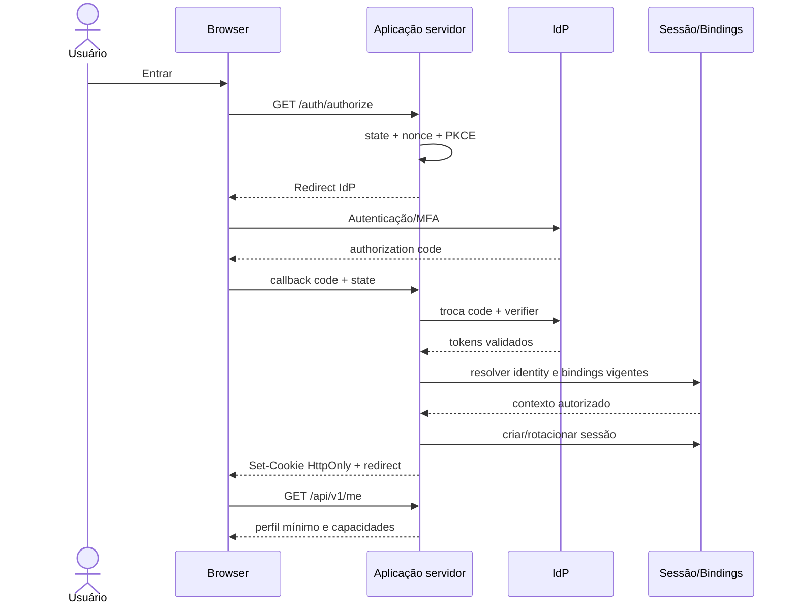

# ADR-0004 — Identidade e sessão exclusivamente no servidor

- **Status:** Aceito; implementação bloqueada até seleção/configuração do provedor
- **Data:** 28 de julho de 2026
- **Decisores por função:** Segurança, Arquitetura, Infra/TI, Produto
- **Relacionados:** `SECURITY.md`, issue #2, Dia 4, Dia 6

## Contexto

O estado anterior continha credenciais, verificação de senha e sessões no frontend/Web Storage. O Dia 1 removeu o material do snapshot corrente e bloqueou os fluxos. Reabrir o acesso sem um modelo de identidade server-side repetiria o incidente.

Existem perfis administrativos, responsáveis com vínculo temporal, chefias e operadores de galpão. A fonte institucional de identidade, requisitos de MFA e mecanismos de primeiro acesso/recuperação ainda não foram confirmados.

## Decisão

1. Preferir provedor institucional compatível com OIDC/OAuth 2.1 ou protocolo aprovado.
2. A aplicação servidor realiza callback/troca de código, valida issuer/audience/nonce/PKCE e vincula o `subject` externo a uma identidade local.
3. O browser recebe somente cookie de sessão opaco ou sessão assinada mínima, sempre `HttpOnly`, `Secure`, `SameSite` e com expiração.
4. Autorização usa bindings locais de papel/escopo/vigência; claims do IdP não concedem acesso patrimonial irrestrito por si só.
5. Sessão possui rotação, idle timeout, absolute timeout, revogação, logout e trilha segura.
6. Mutações autenticadas por cookie exigem proteção CSRF.
7. Web Storage não contém senha, token de acesso/refresh, sessão confiável, papel ou PII desnecessária.
8. Recuperação/primeiro acesso usa canal verificado, token de uso único armazenado em hash, expiração curta, rate limit e invalidação após uso.
9. Respostas de login/recuperação não enumeram identidade/vínculo.
10. Acesso privilegiado e mudança de escopo exigem reautenticação/MFA conforme política.
11. O login permanece em contenção até todos os critérios de reabertura de `SECURITY.md` e issue #2 serem atendidos.

## Modelo de sessão proposto

| Elemento | Regra inicial |
| --- | --- |
| cookie | `__Host-patrimonio_session`, Path `/`, sem Domain, HttpOnly, Secure, SameSite=Lax/Strict conforme fluxo |
| identificador | valor aleatório de alta entropia; somente hash no banco quando sessão opaca |
| idle timeout | 30 minutos proposto; atividade válida renova dentro de limites |
| absolute timeout | 8 horas proposto; privilegiado pode ser menor |
| rotação | após login, elevação/reautenticação e periodicamente |
| revogação | logout, alteração crítica de acesso, incidente, expiração de vínculo e ação administrativa |
| contexto | identidade, sessão, autenticação/MFA, bindings vigentes consultados no servidor |
| cache | respostas de sessão/PII com `Cache-Control: no-store` |
| auditoria | sucesso/falha relevante, revogação e mudança de binding sem credencial/token |

Valores finais dependem de política institucional e devem ser configuráveis no servidor com defaults seguros.

## Fluxo OIDC proposto

## Primeiro acesso/recuperação quando não houver IdP adequado

Somente como alternativa aprovada:

- convite emitido por usuário autorizado para vínculo já existente;
- token aleatório enviado por canal verificado, armazenado em hash, uso único e expiração curta;
- usuário define credencial conforme política; senha é hashada por algoritmo aprovado no servidor;
- nenhuma senha temporária previsível ou exibida em listagem;
- recuperação retorna mensagem uniforme e revoga sessões após alteração;
- MFA/recuperação adicional conforme risco;
- fluxo separado de alteração de e-mail/telefone para evitar takeover.

## Autorização

- decisão por `subject + action + resource + organization scope + validity + state + separation of duties`;
- menu/route guard no frontend é apenas experiência, não controle de segurança;
- API resolve o recurso e avalia a policy antes de retornar existência/dados;
- workers usam identidade de serviço com escopo mínimo;
- impersonação, se necessária para suporte, exige aprovação, banner, prazo e auditoria reforçada.

## Alternativas consideradas

### A. Credenciais fixas no código ou variáveis públicas do frontend

**Rejeitada criticamente.** Segredo chega ao bundle e é recuperável por qualquer usuário.

### B. JWT/token em localStorage

**Rejeitada.** Amplia impacto de XSS e mantém o browser como custodiante de token. Tokens necessários ao servidor ficam no backend/session store.

### C. Sessão serializada com papel no browser e sem validação servidor

**Rejeitada.** Permite falsificação e não reage a revogação/vigência.

### D. Autorização somente por RLS/BaaS direto

**Rejeitada como única camada.** RLS pode reforçar isolamento, mas workflows, segregação, integração e auditoria exigem aplicação servidor.

### E. Construir IdP próprio completo

**Rejeitada salvo obrigação institucional.** Aumenta superfície de risco e custo; preferir provedor mantido/aprovado.

## Consequências positivas

- remove segredo/token do JavaScript e Web Storage;
- revogação e vínculo temporal efetivos;
- autorização centralizada e testável;
- suporte a MFA/SSO e auditoria;
- recuperação segura sem contas demonstrativas.

## Consequências negativas

- depende de IdP/configuração e cookies/CSRF corretos;
- exige store de sessão/limpeza/revogação;
- testes E2E precisam de tenant/contas sintéticas;
- indisponibilidade do IdP afeta novos logins, exigindo comportamento degradado definido;
- políticas de vínculo precisam de owner e dados oficiais.

## Gate de reabertura

Login só é reaberto quando:

- issue #2 comprova rotação/revogação aplicável;
- provedor e bindings estão configurados sem segredo no frontend;
- cookies, CSRF, timeout, rotação, logout e revogação foram testados;
- login/recuperação não enumeram usuários e possuem rate limit;
- autorização negativa vertical/horizontal passa na API;
- logs/auditoria não contêm senha/token/PII desnecessária;
- Vercel/ambiente de homologação publica SHA aprovado;
- segurança registra aceite ou exceção formal com fallback seguro.
