# Modelo lógico de dados temporal

**Status:** baseline proposta — Dia 2  
**Banco-alvo:** PostgreSQL gerenciado  
**Regra:** este é um modelo lógico. Tipos, índices, particionamento e políticas de retenção serão refinados por migrações versionadas e testes de volume.

## 1. Convenções

- Chave primária interna: `uuid` gerado pelo servidor.
- Código legado: coluna `legacy_code`/tabela de identificadores, preservado sem virar chave técnica global.
- Controle concorrente: `version bigint` incrementado a cada mutação do agregado.
- Instantes: `timestamptz` em UTC.
- Vigência: intervalo `[valid_from, valid_to)`, com `valid_to null` representando vigência aberta.
- Dinheiro: `numeric(19,4)` mais `currency char(3)`.
- Quantidade: `numeric(19,6)` quando fracionária; `bigint` quando inteira.
- Soft delete não é regra universal: entidades temporais são encerradas; dados descartáveis seguem retenção explícita.
- Auditoria e outbox: append-only para a aplicação.
- PII: classificada por coluna e omitida de logs/read models quando não necessária.

## 2. ERD lógico principal

```mermaid
erDiagram
  IDENTITY ||--o{ SESSION : has
  IDENTITY ||--o{ ROLE_BINDING : receives
  ROLE ||--o{ ROLE_BINDING : grants
  ORGANIZATION_UNIT ||--o{ ORGANIZATION_UNIT : parent_of
  ORGANIZATION_UNIT ||--o{ LOCATION : contains
  ORGANIZATION_UNIT ||--o{ ROLE_BINDING : scopes

  ASSET_CATEGORY ||--o{ ASSET : classifies
  ACCOUNTING_ACCOUNT ||--o{ ASSET_CATEGORY_VERSION : maps
  ASSET_CATEGORY ||--o{ ASSET_CATEGORY_VERSION : versions
  ASSET ||--o{ ASSET_IDENTIFIER : identified_by
  LOCATION ||--o{ ASSET : currently_locates

  IDENTITY ||--o{ RESPONSIBILITY_ASSIGNMENT : assigned
  ORGANIZATION_UNIT ||--o{ RESPONSIBILITY_ASSIGNMENT : scoped_to
  LOCATION ||--o{ RESPONSIBILITY_ASSIGNMENT : optionally_scoped_to
  DOCUMENT ||--o{ RESPONSIBILITY_ASSIGNMENT : evidences

  TRANSFER ||--|{ TRANSFER_ITEM : contains
  ASSET ||--o{ TRANSFER_ITEM : moves
  ORGANIZATION_UNIT ||--o{ TRANSFER : source_scope
  ORGANIZATION_UNIT ||--o{ TRANSFER : target_scope
  TRANSFER ||--o{ TRANSFER_EVENT : records
  DOCUMENT ||--o{ TRANSFER : documents

  INVENTORY_CYCLE ||--|{ INVENTORY_SCOPE : covers
  ORGANIZATION_UNIT ||--o{ INVENTORY_SCOPE : scoped_to
  INVENTORY_SCOPE ||--|{ INVENTORY_ITEM : snapshots
  ASSET ||--o{ INVENTORY_ITEM : inspected
  INVENTORY_ITEM ||--o{ INVENTORY_OBSERVATION : observes
  INVENTORY_ITEM ||--o{ DIVERGENCE_CASE : raises

  ASSESSMENT_CASE ||--|{ ASSESSMENT_ITEM : evaluates
  ASSET ||--o{ ASSESSMENT_ITEM : subject
  ASSESSMENT_CASE ||--o{ ASSESSMENT_DECISION : decides
  DOCUMENT ||--o{ ASSESSMENT_CASE : evidences

  INBOUND_DOCUMENT ||--|{ INBOUND_DOCUMENT_ITEM : contains
  INBOUND_DOCUMENT_ITEM ||--o{ RECEIPT_ITEM : received_as
  RECEIPT ||--|{ RECEIPT_ITEM : contains
  RECEIPT_ITEM ||--o{ ASSET : may_generate
  STOCK_LEDGER_ENTRY }o--|| INBOUND_DOCUMENT_ITEM : affects
  WITHDRAWAL ||--|{ WITHDRAWAL_ITEM : contains
  WITHDRAWAL_ITEM }o--|| INBOUND_DOCUMENT_ITEM : reserves
  WITHDRAWAL ||--o{ DOCUMENT : proves

  DOCUMENT ||--|{ DOCUMENT_VERSION : versions
  DOCUMENT_VERSION ||--o{ SIGNATURE_REQUEST : signed_by

  REPORT_DEFINITION ||--o{ REPORT_JOB : executes
  IDENTITY ||--o{ REPORT_JOB : requests

  DOMAIN_OUTBOX ||--o{ DELIVERY_ATTEMPT : publishes
  NOTIFICATION ||--o{ DELIVERY_ATTEMPT : delivers
  AUDIT_EVENT }o--|| IDENTITY : attributed_to

  IDENTITY {
    uuid id PK
    string external_subject UK
    string display_name
    string email_normalized
    string status
    bigint version
    timestamptz created_at
    timestamptz updated_at
  }

  SESSION {
    uuid id PK
    uuid identity_id FK
    string token_hash UK
    timestamptz issued_at
    timestamptz expires_at
    timestamptz revoked_at
    string revoke_reason
  }

  ROLE {
    uuid id PK
    string code UK
    string name
    boolean privileged
  }

  ROLE_BINDING {
    uuid id PK
    uuid identity_id FK
    uuid role_id FK
    uuid organization_unit_id FK
    timestamptz valid_from
    timestamptz valid_to
    uuid granted_by_identity_id FK
    string grant_reason
  }

  ORGANIZATION_UNIT {
    uuid id PK
    uuid parent_id FK
    string type
    string name
    string legacy_code
    timestamptz valid_from
    timestamptz valid_to
    bigint version
  }

  LOCATION {
    uuid id PK
    uuid organization_unit_id FK
    string name
    string legacy_code
    string status
    timestamptz valid_from
    timestamptz valid_to
  }

  ASSET_CATEGORY {
    uuid id PK
    string code UK
    string name
    string status
  }

  ASSET_CATEGORY_VERSION {
    uuid id PK
    uuid category_id FK
    uuid accounting_account_id FK
    string name
    timestamptz valid_from
    timestamptz valid_to
  }

  ACCOUNTING_ACCOUNT {
    uuid id PK
    string code UK
    string name
    string status
    timestamptz valid_from
    timestamptz valid_to
  }

  ASSET {
    uuid id PK
    uuid category_id FK
    uuid current_location_id FK
    string legacy_code
    string description
    string administrative_status
    string physical_condition
    decimal acquisition_value
    string currency
    date acquisition_date
    bigint version
    timestamptz created_at
    timestamptz updated_at
  }

  ASSET_IDENTIFIER {
    uuid id PK
    uuid asset_id FK
    string type
    string value
    timestamptz valid_from
    timestamptz valid_to
  }

  RESPONSIBILITY_ASSIGNMENT {
    uuid id PK
    uuid identity_id FK
    uuid organization_unit_id FK
    uuid location_id FK
    uuid document_id FK
    string role_type
    string status
    timestamptz valid_from
    timestamptz valid_to
    bigint version
  }

  TRANSFER {
    uuid id PK
    uuid source_scope_id FK
    uuid target_scope_id FK
    string status
    string reason_code
    string reason_text
    uuid requested_by_identity_id FK
    uuid document_id FK
    string idempotency_key UK
    bigint version
    timestamptz created_at
  }

  TRANSFER_ITEM {
    uuid id PK
    uuid transfer_id FK
    uuid asset_id FK
    bigint asset_version
    string result_status
    string result_reason
  }

  TRANSFER_EVENT {
    uuid id PK
    uuid transfer_id FK
    string event_type
    uuid actor_identity_id FK
    jsonb metadata
    timestamptz occurred_at
  }

  INVENTORY_CYCLE {
    uuid id PK
    string name
    string status
    timestamptz reference_at
    timestamptz opens_at
    timestamptz closes_at
    bigint version
  }

  INVENTORY_SCOPE {
    uuid id PK
    uuid inventory_cycle_id FK
    uuid organization_unit_id FK
    string status
    bigint snapshot_count
    bigint version
  }

  INVENTORY_ITEM {
    uuid id PK
    uuid inventory_scope_id FK
    uuid asset_id FK
    bigint asset_version_at_snapshot
    uuid expected_location_id FK
    string expected_responsibility_key
    string result
    bigint version
  }

  INVENTORY_OBSERVATION {
    uuid id PK
    uuid inventory_item_id FK
    uuid actor_identity_id FK
    string observation_type
    uuid observed_location_id FK
    string idempotency_key UK
    jsonb evidence
    timestamptz observed_at
  }

  DIVERGENCE_CASE {
    uuid id PK
    uuid inventory_item_id FK
    string type
    string status
    uuid assigned_to_identity_id FK
    timestamptz due_at
    bigint version
  }

  ASSESSMENT_CASE {
    uuid id PK
    string case_type
    string status
    uuid requested_by_identity_id FK
    uuid document_id FK
    bigint version
    timestamptz created_at
  }

  ASSESSMENT_ITEM {
    uuid id PK
    uuid assessment_case_id FK
    uuid asset_id FK
    bigint asset_version
    string proposed_outcome
    decimal proposed_value
  }

  ASSESSMENT_DECISION {
    uuid id PK
    uuid assessment_case_id FK
    uuid actor_identity_id FK
    string decision
    string reason
    timestamptz decided_at
  }

  INBOUND_DOCUMENT {
    uuid id PK
    string document_type
    string external_number
    string issuer_identifier
    date issue_date
    string status
    string deduplication_key UK
    bigint version
  }

  INBOUND_DOCUMENT_ITEM {
    uuid id PK
    uuid inbound_document_id FK
    string description
    decimal ordered_quantity
    decimal received_quantity
    decimal unit_value
    string currency
    bigint version
  }

  RECEIPT {
    uuid id PK
    string status
    uuid received_by_identity_id FK
    timestamptz received_at
    string idempotency_key UK
    bigint version
  }

  RECEIPT_ITEM {
    uuid id PK
    uuid receipt_id FK
    uuid inbound_document_item_id FK
    decimal quantity
    decimal accepted_quantity
    decimal rejected_quantity
  }

  STOCK_LEDGER_ENTRY {
    uuid id PK
    uuid inbound_document_item_id FK
    string movement_type
    decimal quantity
    uuid source_aggregate_id
    string source_aggregate_type
    timestamptz occurred_at
  }

  WITHDRAWAL {
    uuid id PK
    string status
    uuid requested_by_identity_id FK
    uuid delivered_to_identity_id FK
    string idempotency_key UK
    bigint version
  }

  WITHDRAWAL_ITEM {
    uuid id PK
    uuid withdrawal_id FK
    uuid inbound_document_item_id FK
    decimal quantity
    string status
  }

  DOCUMENT {
    uuid id PK
    string type
    string status
    string retention_class
    bigint version
    timestamptz created_at
  }

  DOCUMENT_VERSION {
    uuid id PK
    uuid document_id FK
    integer version_number
    string object_key UK
    string sha256
    string media_type
    bigint size_bytes
    timestamptz created_at
  }

  SIGNATURE_REQUEST {
    uuid id PK
    uuid document_version_id FK
    uuid signer_identity_id FK
    string status
    string external_reference
    timestamptz signed_at
  }

  REPORT_DEFINITION {
    uuid id PK
    string code UK
    integer version
    string status
    jsonb parameter_schema
  }

  REPORT_JOB {
    uuid id PK
    uuid report_definition_id FK
    uuid requested_by_identity_id FK
    jsonb parameters
    timestamptz reference_at
    string status
    string result_object_key
  }

  NOTIFICATION {
    uuid id PK
    uuid recipient_identity_id FK
    string event_type
    string status
    jsonb template_data
    timestamptz created_at
  }

  DOMAIN_OUTBOX {
    uuid id PK
    string aggregate_type
    uuid aggregate_id
    string event_type
    integer event_version
    jsonb payload
    timestamptz occurred_at
    timestamptz published_at
  }

  DELIVERY_ATTEMPT {
    uuid id PK
    uuid outbox_id FK
    uuid notification_id FK
    string channel
    integer attempt_number
    string status
    string error_code
    timestamptz attempted_at
  }

  AUDIT_EVENT {
    uuid id PK
    uuid actor_identity_id FK
    string action
    string resource_type
    uuid resource_id
    string result
    string correlation_id
    jsonb redacted_diff
    timestamptz occurred_at
  }
```

## 3. Schemas lógicos por módulo

O primeiro deploy pode compartilhar uma instância física, mas cada módulo deve possuir namespace lógico e migrations próprias:

| Schema lógico | Tabelas principais |
| --- | --- |
| `iam` | identity, session, role, role_binding, recovery_challenge |
| `organization` | organization_unit, location, organizational_assignment |
| `classification` | asset_category, asset_category_version, accounting_account, legacy_mapping |
| `assets` | asset, asset_identifier, asset_attribute, asset_event |
| `responsibility` | responsibility_assignment, designation, responsibility_event |
| `transfers` | transfer, transfer_item, transfer_event |
| `inventory` | inventory_cycle, inventory_scope, inventory_item, inventory_observation, divergence_case |
| `assessment` | assessment_case, assessment_item, assessment_decision |
| `warehouse` | inbound_document, inbound_document_item, receipt, receipt_item, stock_ledger_entry, withdrawal, withdrawal_item |
| `documents` | document, document_version, signature_request |
| `notifications` | notification, task, delivery_attempt, preference |
| `reporting` | report_definition, report_job, metric_definition, reconciliation_result |
| `audit` | audit_event, access_review |
| `integration` | connector, external_message, reconciliation_run, domain_outbox, idempotency_record |

A aplicação não recebe permissão SQL ampla para todos os schemas por padrão. Módulos usam repositórios/ports próprios, e jobs recebem apenas as permissões necessárias.

## 4. Restrições temporais

### 4.1 Vigência sem sobreposição

Aplicável a `role_binding`, `organization_unit`, `location`, `asset_category_version`, `accounting_account` e `responsibility_assignment`:

- impedir dois intervalos ativos incompatíveis para a mesma chave de negócio;
- usar constraint de exclusão por range quando o critério estiver homologado;
- alteração retroativa cria nova versão e evento de correção, sem sobrescrever fatos já utilizados em relatório oficial.

### 4.2 Snapshot de inventário

O snapshot grava os identificadores e versões esperadas no instante de abertura. Alterações posteriores no cadastro não modificam o snapshot; a reconciliação compara os dois tempos explicitamente.

### 4.3 Relatórios

Todo relatório oficial registra `reference_at`, timezone, versão da definição e parâmetros normalizados. O arquivo pode ser regenerado somente se a mesma versão de definição e o mesmo snapshot lógico estiverem disponíveis.

## 5. Integridade e índices iniciais

- unicidade parcial para identificador patrimonial vigente;
- índices por `organization_unit_id`, `status`, `valid_from/valid_to` e datas operacionais;
- índice cursor composto `(created_at, id)` para listagens estáveis;
- índice GIN em JSONB somente após consulta/volume justificarem;
- foreign keys obrigatórias entre módulos quando a consistência síncrona for necessária;
- outbox indexada por `published_at null, occurred_at`;
- auditoria indexada por recurso, ator, ação e tempo, com particionamento avaliado por volume;
- ledger com índice por item e ordem temporal; saldo nunca é calculado por campo editável isolado.

## 6. Dados sensíveis e classificação

| Classe | Exemplos | Regra |
| --- | --- | --- |
| Segredo | senha, token, chave, cookie, credencial externa | nunca em tabelas de negócio/log; armazenar em secret manager ou hash apropriado |
| PII restrita | prontuário, identificador funcional, telefone, e-mail pessoal | coletar somente se necessário; criptografia/mascaramento e acesso por finalidade |
| PII operacional | nome funcional, e-mail institucional | acesso por escopo; não replicar em payload/evento sem necessidade |
| Financeiro/contábil | valores, contas, documentos fiscais | precisão decimal, trilha e retenção institucional |
| Público controlado | código patrimonial, descrição não sensível | ainda sujeito a autorização quando revela localização/estrutura |
| Técnico | correlation ID, métricas, hash | não combinar com segredo/PII desnecessária |

## 7. Estratégia de identificadores legados

- `legacy_system` + `legacy_entity` + `legacy_key` formam uma chave de mapeamento única.
- O valor original é preservado exatamente como recebido, com variante normalizada separada quando necessária para busca.
- Conflitos de chave entram em staging e não são resolvidos automaticamente.
- APIs públicas expõem `id` interno e, quando autorizado, `legacyCode` como atributo.
- Integrações usam tabela de mapeamento; não fazem suposição baseada em formato do código.

## 8. Decisões que exigem confirmação

1. Regra oficial de unicidade da chapa/código patrimonial.
2. Campos obrigatórios e enumerações do bem por categoria.
3. Estrutura e fonte mestre de secretarias, setores, unidades e locais.
4. Granularidade do responsável: unidade, local, conjunto de bens ou combinação.
5. Regras de lote parcial em transferências e recebimentos.
6. Precisão monetária e moeda permitida.
7. Retenção de documentos, auditoria e histórico de integração.
8. Volumes para particionamento, paginação e arquivamento.

Até a confirmação, constraints relacionadas permanecem parametrizadas e dados de produção não devem ser importados.
