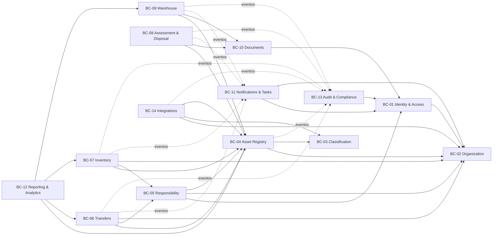

# Mapa de domínios e bounded contexts

**Status:** baseline proposta — Dia 2  
**Princípio:** cada módulo possui owner funcional por função, fronteira explícita e API/eventos públicos. O owner nominal deve ser registrado antes da implementação produtiva do módulo.

## 1. Contextos, owners e fronteiras

| ID | Bounded context | Tipo | Owner funcional por função | Owner técnico | Agregados principais | Dados que possui |
| --- | --- | --- | --- | --- | --- | --- |
| BC-01 | Identity & Access | Genérico crítico | Segurança/TI | Plataforma | Identity, Session, RoleBinding, RecoveryChallenge | identidades externas, sessões, papéis, escopos, vigências |
| BC-02 | Organization | Suporte | Administração/Recursos Humanos | Organização | OrganizationUnit, Location, OrganizationalAssignment | secretarias, setores, unidades, locais e hierarquia temporal |
| BC-03 | Classification | Suporte | Contabilidade | Classificação | AssetCategory, AccountingAccount, ClassificationMapping | categorias, contas, taxonomias e mapeamentos legados |
| BC-04 | Asset Registry | Core | Gestão Patrimonial | Bens | Asset, AssetIdentifier, AssetAttribute | cadastro mestre, identificadores, condição e estado administrativo |
| BC-05 | Responsibility | Core | Gestão Patrimonial + Chefias | Responsabilidades | ResponsibilityAssignment, Designation | responsável por escopo/bem, vigência, portaria e substituição |
| BC-06 | Transfers | Core | Gestão Patrimonial | Transferências | Transfer, TransferItem | solicitação, aceite, rejeição, efetivação e comprovante |
| BC-07 | Inventory | Core | Coordenação de Inventário | Inventário | InventoryCycle, InventoryScope, InventoryItem, DivergenceCase | ciclos, snapshots, conferências, divergências e encerramento |
| BC-08 | Assessment & Disposal | Core | Comissão de Avaliação + Contabilidade | Avaliação/Baixa | AssessmentCase, DisposalCase | laudos, pareceres, aprovações e efeitos de baixa |
| BC-09 | Warehouse | Core/Suporte | Galpão/Almoxarifado | Galpão | InboundDocument, Receipt, StockLedger, Withdrawal | empenhos/notas, recebimentos, saldo, reservas e retiradas |
| BC-10 | Documents | Genérico | Gestão Documental/Jurídico | Documentos | Document, DocumentVersion, SignatureRequest | arquivo, metadados, versões, assinatura e retenção |
| BC-11 | Notifications & Tasks | Genérico | Operação/Comunicação | Notificações | Notification, Task, DeliveryAttempt, Preference | inbox, prazos, templates, preferências e entrega |
| BC-12 | Reporting & Analytics | Suporte | Contabilidade + Gestão Patrimonial | Relatórios | ReportDefinition, ReportJob, MetricDefinition | definições, parâmetros, snapshots, arquivos e reconciliação |
| BC-13 | Audit & Compliance | Genérico crítico | Auditoria/Controladoria + Segurança | Auditoria | AuditEvent, AccessReview, RetentionPolicy | trilha imutável, revisões de acesso e retenção |
| BC-14 | Integrations | Genérico | Arquitetura de Integração | Integrações | Connector, ExternalMessage, ReconciliationRun | contratos externos, cursores, reprocessamento e reconciliação |

## 2. Dependências permitidas

### 2.1 Regras

- Setas sólidas representam consulta/comando síncrono por porta pública.
- Setas pontilhadas representam eventos assíncronos versionados.
- `Reporting` lê read models autorizados; não escreve nos domínios de origem.
- `Audit` recebe eventos; não participa da decisão transacional de negócio.
- `Notifications` reage a eventos; falha de entrega não desfaz o commit do domínio.
- `Integrations` traduz formatos externos; não expõe DTO externo como entidade interna.
- `Identity & Access` não conhece regras patrimoniais; recebe recursos/atributos para avaliar políticas.

## 3. Responsabilidades e invariantes por contexto

### BC-01 — Identity & Access

**Responsável por:** autenticação, sessão, recuperação, vínculo entre identidade externa e perfil local, papéis/escopos e revogação.

**Invariantes:**

- senha ou segredo nunca é persistido no frontend;
- uma sessão revogada não pode ser renovada;
- vínculo inativo/fora da vigência não concede escopo;
- resposta de login/recuperação não enumera identidades;
- concessão privilegiada exige ator autorizado, motivo e auditoria;
- segregação de função é avaliada antes da concessão.

### BC-02 — Organization

**Responsável por:** estrutura administrativa e locais físicos com validade temporal.

**Invariantes:**

- unidade possui ID interno imutável; código legado é atributo;
- hierarquia não pode conter ciclo;
- duas versões vigentes do mesmo vínculo não podem se sobrepor;
- inativação não apaga histórico nem bens vinculados;
- alteração retroativa exige processo e impacto explícito.

### BC-03 — Classification

**Responsável por:** categorias, contas contábeis, hierarquia e mapeamento legado.

**Invariantes:**

- conta/categoria usada não é excluída fisicamente;
- hierarquia não contém ciclo;
- vigências não se sobrepõem para a mesma chave;
- reclassificação em massa é comando auditado com prévia e resultado por item.

### BC-04 — Asset Registry

**Responsável por:** identidade e cadastro mestre do bem.

**Invariantes:**

- ID interno é imutável e único;
- identificador patrimonial ativo respeita regra de unicidade acordada;
- valor monetário usa precisão decimal e moeda explícita;
- status administrativo e condição física são conceitos distintos;
- mudanças originadas por transferência/baixa/inventário são aplicadas pelos respectivos comandos, não por PATCH genérico;
- edição usa versão/ETag e rejeita sobrescrita desatualizada.

### BC-05 — Responsibility

**Responsável por:** designações, responsáveis e escopos temporais.

**Invariantes:**

- atribuições incompatíveis não se sobrepõem na mesma vigência;
- troca de responsável possui origem, destino, aceite/regra, vigência e documento;
- encerramento preserva histórico;
- portaria/designação oficial é versionada e vinculada ao evento de ativação.

### BC-06 — Transfers

**Responsável por:** workflow de movimentação entre locais/responsáveis.

**Invariantes:**

- bem inelegível não entra no fluxo;
- origem e destino válidos e distintos;
- submissão congela itens/versões relevantes;
- aceite de versão antiga retorna conflito;
- efetivação altera todos os itens ou nenhum, exceto quando lote parcial estiver formalmente permitido;
- repetição com a mesma idempotency key não duplica transferência/evento;
- rejeição/cancelamento registra motivo estruturado.

### BC-07 — Inventory

**Responsável por:** ciclo, snapshot, conferência, divergências e fechamento.

**Invariantes:**

- snapshot de abertura é imutável;
- item pertence a um único escopo do ciclo;
- envio repetido não duplica conferência;
- conflito offline é resolvido explicitamente;
- setor não fecha com pendência não justificada;
- ciclo encerrado é imutável; reabertura cria evento aprovado e nova etapa controlada.

### BC-08 — Assessment & Disposal

**Responsável por:** avaliação, laudo, decisão e baixa.

**Invariantes:**

- solicitante não aprova o próprio caso quando a segregação exigir;
- efeito patrimonial/contábil ocorre somente após aprovação válida;
- laudo e evidências ficam versionados;
- rejeição/cancelamento não altera o bem;
- baixa efetivada não é desfeita por edição direta.

### BC-09 — Warehouse

**Responsável por:** entrada documental, recebimento, estoque e retirada.

**Invariantes:**

- documento externo não é duplicado pela chave acordada;
- recebimento não excede saldo do documento sem exceção aprovada;
- ledger é append-only e saldo deriva de movimentos reconciliáveis;
- reserva não permite saldo negativo;
- confirmação de retirada gera comprovante e evento atômico;
- valores e quantidades usam tipos com precisão adequada.

### BC-10 — Documents

**Responsável por:** arquivo privado, versões, metadados e assinatura.

**Invariantes:**

- objeto sensível não possui URL pública permanente;
- hash identifica conteúdo armazenado;
- nova versão não sobrescreve versão anterior;
- assinatura vincula conteúdo/hash e signatário;
- exclusão segue retenção/legal hold.

### BC-11 — Notifications & Tasks

**Responsável por:** eventos notificáveis, tarefas, preferências e entrega.

**Invariantes:**

- mensagem não contém senha/token/segredo;
- link exige autorização novamente no destino;
- entrega é idempotente por evento/canal/destinatário;
- preferência não desativa comunicação legalmente obrigatória;
- falha é observável e reprocessável.

### BC-12 — Reporting & Analytics

**Responsável por:** definições oficiais, parâmetros, jobs, snapshots e reconciliação.

**Invariantes:**

- relatório registra versão, parâmetros, timezone e data de corte;
- acesso respeita o mesmo escopo dos dados de origem;
- arquivo exportado mitiga formula injection;
- números oficiais possuem fórmula e amostra reconciliada;
- visualização exploratória não é rotulada como relatório oficial.

### BC-13 — Audit & Compliance

**Responsável por:** trilha imutável, revisão de acesso e retenção.

**Invariantes:**

- evento de auditoria não é atualizado/excluído pela aplicação;
- segredo e PII desnecessária são redigidos;
- evento registra ator, ação, recurso, resultado, horário, correlação e origem;
- relógio e timezone são normalizados;
- acesso à auditoria é restrito e também auditado quando sensível.

### BC-14 — Integrations

**Responsável por:** conectores, mensagens externas, cursores, retries e reconciliação.

**Invariantes:**

- mensagem recebida/publicada possui ID, versão e idempotência;
- assinatura/webhook é validado antes de processar;
- falha transiente é repetida com backoff; falha permanente vai para tratamento;
- payload original pode ser retido apenas conforme classificação/retention;
- reprocessamento não duplica efeito de domínio.

## 4. Catálogo inicial de eventos

| Evento | Produtor | Consumidores previstos | Versão inicial |
| --- | --- | --- | --- |
| `identity.session.revoked` | BC-01 | BC-13 | v1 |
| `organization.unit.changed` | BC-02 | BC-05, BC-12, BC-14 | v1 |
| `asset.created` | BC-04 | BC-12, BC-13, BC-14 | v1 |
| `asset.classification.changed` | BC-04 | BC-12, BC-13 | v1 |
| `responsibility.activated` | BC-05 | BC-11, BC-12, BC-13 | v1 |
| `transfer.submitted` | BC-06 | BC-11, BC-13 | v1 |
| `transfer.effected` | BC-06 | BC-04, BC-05, BC-11, BC-12, BC-13, BC-14 | v1 |
| `inventory.cycle.opened` | BC-07 | BC-11, BC-12, BC-13 | v1 |
| `inventory.divergence.created` | BC-07 | BC-11, BC-12, BC-13 | v1 |
| `inventory.cycle.closed` | BC-07 | BC-12, BC-13, BC-14 | v1 |
| `disposal.effected` | BC-08 | BC-04, BC-12, BC-13, BC-14 | v1 |
| `warehouse.receipt.completed` | BC-09 | BC-04, BC-12, BC-13, BC-14 | v1 |
| `warehouse.withdrawal.completed` | BC-09 | BC-11, BC-12, BC-13 | v1 |
| `document.signed` | BC-10 | contexto solicitante, BC-13 | v1 |
| `report.completed` | BC-12 | BC-11, BC-13 | v1 |

## 5. Critério de evolução para serviço separado

Um contexto só vira serviço independente após ADR adicional demonstrar: necessidade de escala/isolamento, contrato estável, observabilidade, ownership operacional, estratégia de consistência e custo aceitável. Até lá, módulos compartilham deploy e banco físico, mas mantêm schemas/ports lógicos separados.
