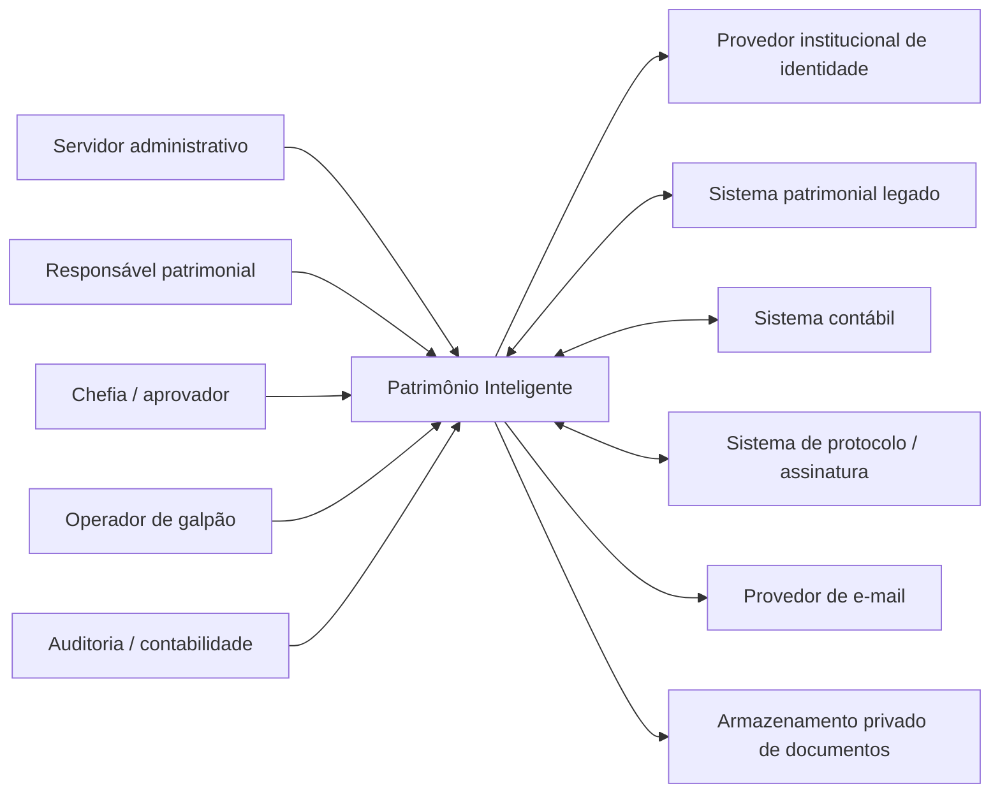
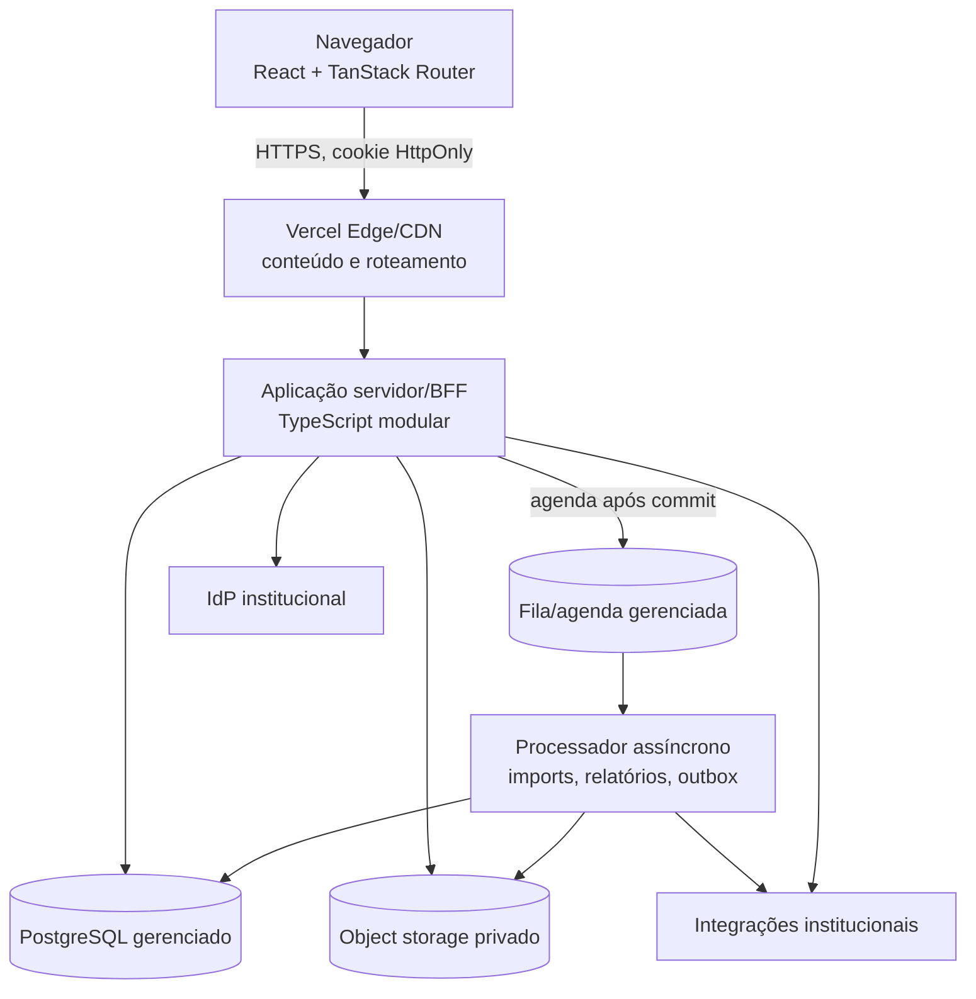
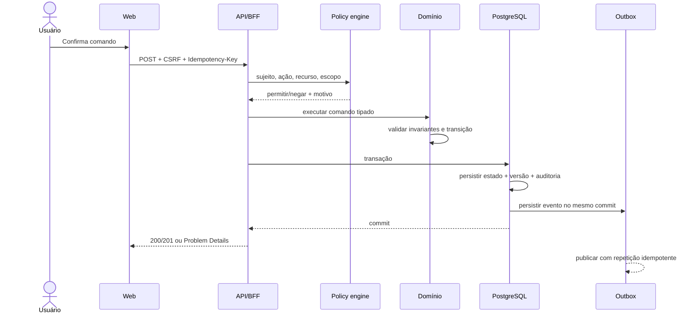

# Arquitetura-alvo — visão geral

**Status:** baseline proposta do Dia 2  
**Escopo:** sistema de gestão patrimonial  
**Decisão estrutural:** monólito modular evolutivo, contrato-first, com processos assíncronos isolados  
**Issue:** #3

> Esta arquitetura define fronteiras e contratos antes da implementação. Regras ainda não confirmadas no legado permanecem explícitas como hipóteses e não autorizam reabrir a autenticação contida no Dia 1.

## 1. Objetivos arquiteturais

1. Manter identidade, autorização, regras e persistência no servidor.
2. Organizar o domínio em módulos com owners e dependências unidirecionais.
3. Tratar transferências, inventários, baixas, recebimentos e retiradas como workflows transacionais, não como edição livre de status.
4. Preservar identificadores/códigos legados sem usá-los como chave primária interna.
5. Permitir migração em ondas com staging, reconciliação e rollback.
6. Produzir auditoria e eventos de integração no mesmo commit da alteração de negócio.
7. Sustentar Vercel no frontend atual sem criar microserviços prematuros.

## 2. Não objetivos do Dia 2

- Escolher fornecedor de identidade, banco, fila ou armazenamento sem validação institucional.
- Implementar endpoints de produção ou desbloquear login.
- Copiar dados reais para desenvolvimento.
- Declarar paridade com telas/regras ainda não percorridas no legado autenticado.
- Distribuir o domínio em serviços independentes antes de haver necessidade operacional mensurada.

## 3. Diagrama de contexto — C4 nível 1

## 4. Diagrama de containers — C4 nível 2

### 4.1 Responsabilidades dos containers

| Container | Responsabilidade | Não pode fazer |
| --- | --- | --- |
| Web React | renderização, estado de interação, validação de ergonomia, acessibilidade | autenticar localmente, autorizar, guardar segredo/senha, decidir regra crítica |
| Aplicação servidor/BFF | sessão, autorização, orquestração de casos de uso, transações, contratos HTTP | acessar tabela de outro módulo sem porta pública, executar job longo no request |
| Worker | importação, relatórios, arquivos, notificações, integração/outbox | alterar domínio sem comando idempotente e autorização de serviço |
| PostgreSQL | fonte transacional, histórico temporal, outbox, idempotência | conter segredo de aplicação em texto aberto |
| Object storage | documentos privados e derivados | servir objeto sensível por URL pública permanente |
| Fila/agenda | entrega e repetição controlada de jobs | ser fonte de verdade do estado de negócio |

## 5. Forma de implantação evolutiva

### Fase A — fundação compatível com o repositório atual

- Manter a aplicação web TanStack Start como único deploy Vercel.
- Introduzir módulos server-side dentro do mesmo repositório e processo de build.
- Usar PostgreSQL gerenciado como fonte de verdade.
- Executar tarefas curtas por funções server-side; tarefas longas entram em fila gerenciada.
- Manter autenticação bloqueada até o módulo `identity-access` possuir integração real e sessão segura.

### Fase B — isolamento operacional quando houver evidência

Separar worker ou API em deploy próprio somente quando pelo menos um critério for observado:

- tempo de execução incompatível com limites serverless;
- escala/concorrência independente;
- requisito de rede privada ou integração incompatível com Vercel;
- janela de manutenção ou disponibilidade diferente;
- equipe e ownership capazes de operar o componente separadamente.

A separação mantém os mesmos contratos e eventos, evitando reescrita do domínio.

## 6. Regras de dependência

1. UI depende de contratos públicos, nunca de estruturas de persistência.
2. Casos de uso dependem de portas do domínio; adaptadores implementam essas portas.
3. Um módulo não consulta nem altera tabelas internas de outro módulo diretamente.
4. Dependências síncronas entre módulos usam serviços de aplicação tipados.
5. Propagação assíncrona usa eventos versionados gravados em outbox na mesma transação.
6. Relatórios podem usar read models dedicados; não contornam autorização por escopo.
7. Integrações externas entram por anti-corruption layers e preservam o valor original recebido.
8. Toda escrita aceita `correlationId`; comandos repetíveis aceitam chave de idempotência.
9. Toda edição concorrente usa versão/ETag; conflito não é sobrescrito silenciosamente.
10. Segredos são injetados somente no runtime servidor e nunca usam prefixo público de bundler.

## 7. Fluxo de uma mutação crítica

## 8. Política de dados

- Chaves internas: UUID/ULID imutável.
- Códigos do legado: atributos únicos quando aplicável, nunca identidade técnica universal.
- Vigência: `valid_from` inclusivo e `valid_to` exclusivo/nulo.
- Exclusão: preferir inativação/vigência; exclusão física somente com política aprovada.
- Dinheiro: `numeric`, nunca ponto flutuante binário.
- Datas: instante UTC no banco; timezone de negócio explícito na apresentação/relatório.
- PII: minimizada, classificada e mascarada em logs/auditoria.
- Documentos: metadados no banco e objeto privado; URL assinada curta após autorização.

## 9. Segurança estrutural

- Sessão em cookie `HttpOnly`, `Secure`, `SameSite`; renovação e revogação no servidor.
- Proteção CSRF para comandos autenticados por cookie.
- Política de autorização por ação, papel, unidade organizacional, vigência e segregação de função.
- Validação de entrada no limite HTTP e novamente nas invariantes do domínio.
- Rate limit e resposta não enumerável nos fluxos de identidade.
- Auditoria imutável para mutações e leituras sensíveis definidas.
- Upload privado com validação de conteúdo, limite, quarentena e remoção de metadados.
- Logs estruturados com correlação e redação de segredo/PII.

## 10. Decisões pendentes e owners

| Decisão | Owner por função | Fallback seguro | Prazo de necessidade |
| --- | --- | --- | --- |
| IdP institucional e protocolo de autenticação | Segurança + TI | manter login bloqueado | antes do Dia 4 |
| PostgreSQL gerenciado e rede | Infra/DBA | contratos/migrações sem conexão real | antes do Dia 4 |
| Fila/agenda e limites de execução | DevOps | processar apenas jobs curtos; recursos longos desabilitados | antes do Dia 12 |
| Object storage e antimalware | Infra + segurança | uploads desabilitados | antes do Dia 11 |
| Protocolo/assinatura oficial | Jurídico + negócio + integração | documento em rascunho sem efeito oficial | antes do Dia 15 |
| Sistema contábil e formato de integração | Contabilidade + integração | exportação reconciliável sob feature flag | antes do Dia 13 |
| Retenção e descarte | Segurança + DPO + arquivo | retenção conservadora sem exclusão automática | antes do go-live |

## 11. Rastreabilidade

- Domínios e owners: `DOMAIN_MAP.md`.
- Modelo lógico: `DATA_MODEL.md`.
- Workflows: `STATE_MACHINES.md`.
- NFRs: `NON_FUNCTIONAL_REQUIREMENTS.md`.
- Ameaças: `THREAT_MODEL.md`.
- Contrato: `../../packages/contracts/openapi/patrimonio-v1.yaml`.
- Migração: `../migration/MIGRATION_STRATEGY.md`.
- Decisões: `../adr/`.
