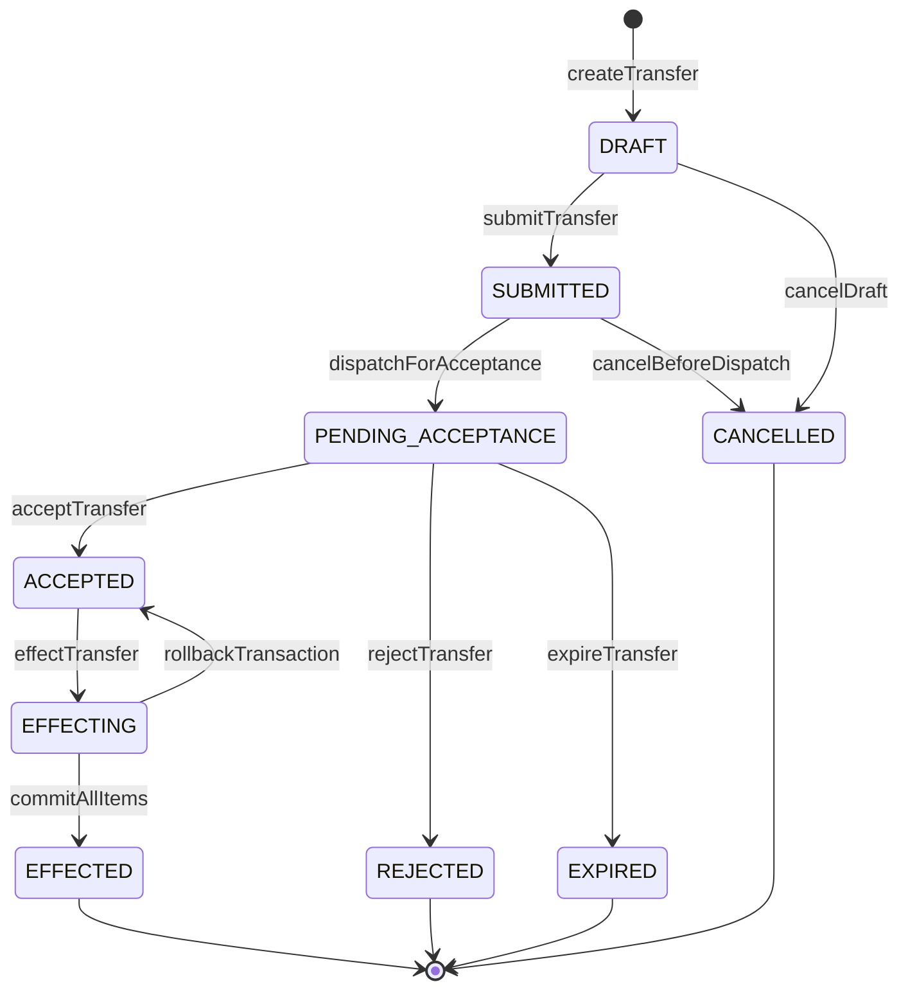
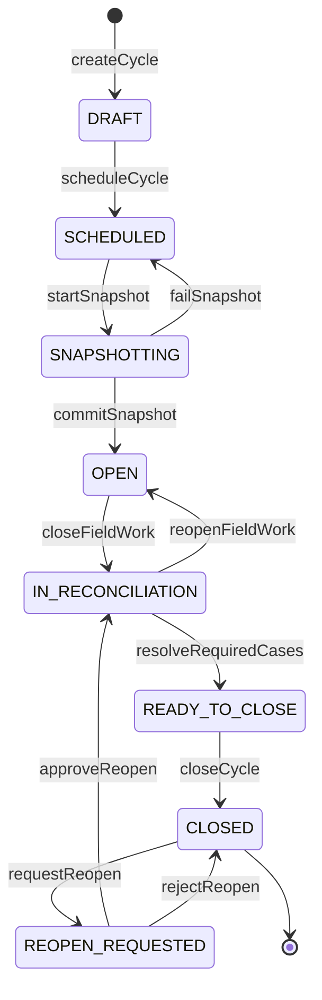
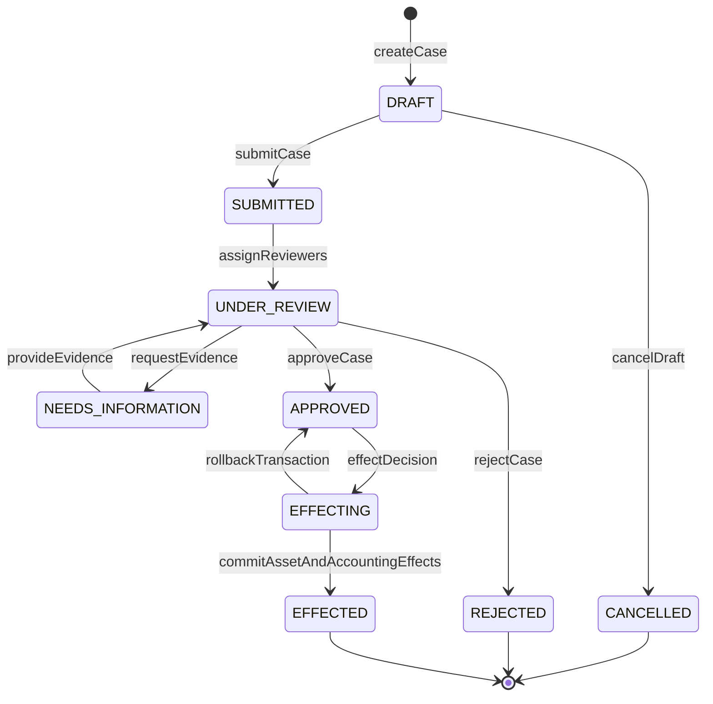
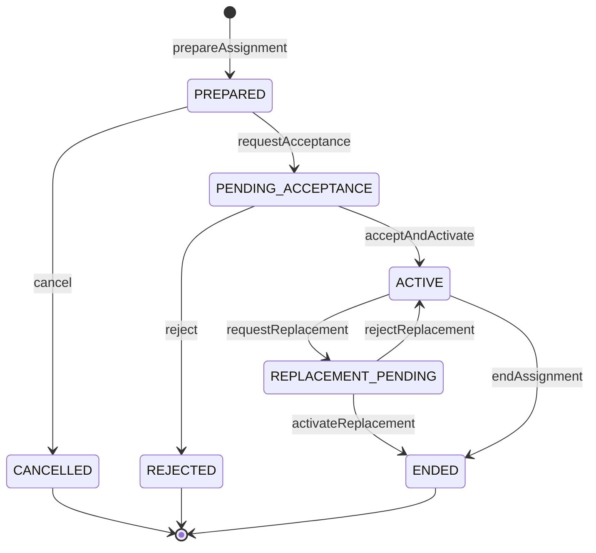
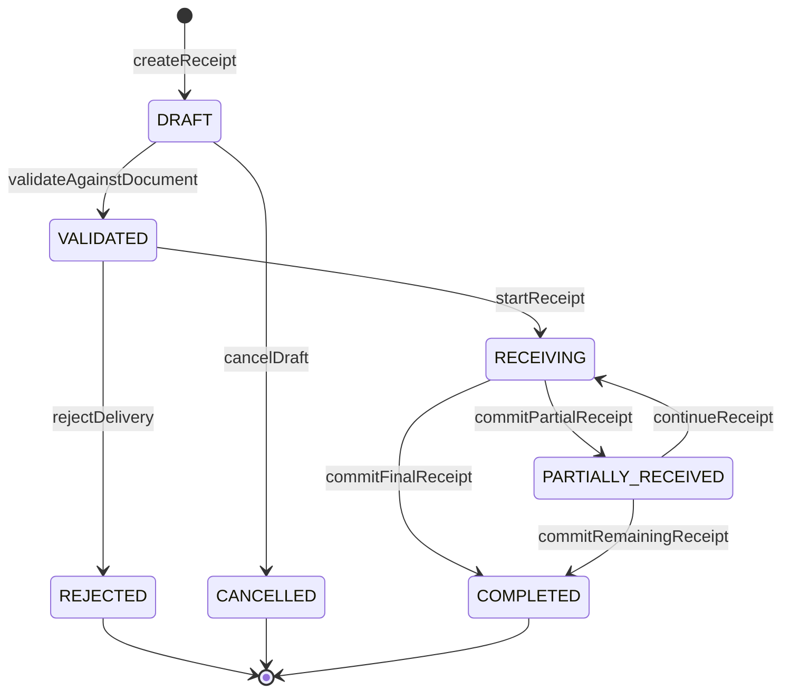
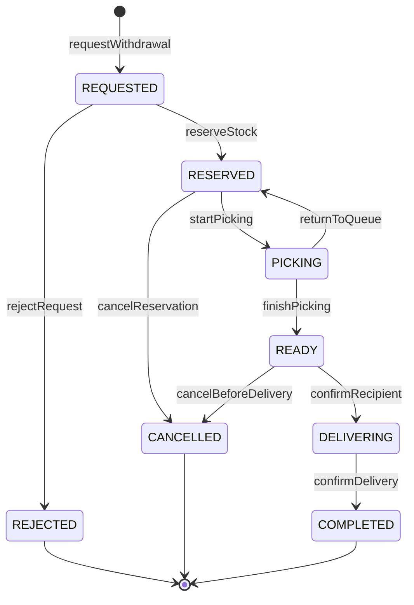

# Máquinas de estado e comandos críticos

**Status:** baseline proposta — Dia 2  
**Regra central:** estados são consequência de comandos validados e eventos persistidos. Nenhuma transição crítica pode ser realizada por `PATCH { status: ... }` genérico.

## 1. Padrão de comando

Todo comando crítico contém:

- `commandId`/`Idempotency-Key`;
- ator autenticado e escopo avaliado no servidor;
- versão esperada do agregado (`If-Match`/ETag);
- motivo estruturado e texto complementar quando aplicável;
- timestamp do servidor;
- correlation ID;
- validações de domínio;
- persistência atômica de estado, evento de auditoria e outbox.

Erros padronizados:

- `401 authentication_required`;
- `403 action_not_allowed` ou `scope_denied`;
- `404 resource_not_found` sem revelar recurso fora de escopo;
- `409 stale_version`, `invalid_state_transition` ou `duplicate_command`;
- `422 business_rule_violation` com erros de campo/regra;
- `429 rate_limited`;
- `503 dependency_unavailable`.

## 2. Transferência patrimonial

### Comandos e guardas

| Comando | De | Para | Guardas mínimas | Efeitos atômicos |
| --- | --- | --- | --- | --- |
| `createTransfer` | inexistente | DRAFT | origem/destino acessíveis; diferentes; itens não duplicados | cria agregado e itens com versão do bem |
| `submitTransfer` | DRAFT | SUBMITTED | pelo menos um item; motivo; bens elegíveis; ator pode solicitar | congela itens, grava submissão e outbox |
| `dispatchForAcceptance` | SUBMITTED | PENDING_ACCEPTANCE | destinatário/vínculo válido; documento/regra exigida pronta | cria tarefa/prazo sem expor dados fora de escopo |
| `acceptTransfer` | PENDING_ACCEPTANCE | ACCEPTED | destinatário autorizado; versão atual; dentro da vigência | registra aceite e identidade do aceitante |
| `rejectTransfer` | PENDING_ACCEPTANCE | REJECTED | destinatário autorizado; motivo obrigatório | registra rejeição, encerra tarefa e notifica |
| `effectTransfer` | ACCEPTED | EFFECTED | todos os bens continuam elegíveis e na origem esperada | transação atualiza localização/responsabilidade de todos os itens, documento, auditoria e outbox |
| `cancelTransfer` | DRAFT/SUBMITTED | CANCELLED | ator/regra autoriza; ainda não aceita | registra motivo; não altera bens |
| `expireTransfer` | PENDING_ACCEPTANCE | EXPIRED | prazo excedido; job idempotente | encerra pendência e notifica |

**Regra de lote parcial:** proibido por padrão. Caso o legado exija parcialidade, cada item terá decisão explícita e a efetivação produzirá um novo agregado/resultado reconciliável; nunca haverá sucesso parcial silencioso.

## 3. Ciclo de inventário

### Invariantes

- snapshot é criado em transação consistente ou por processo versionado com data de corte explícita;
- item do snapshot não é reescrito quando o cadastro do bem muda;
- observação usa idempotência por usuário/dispositivo/item/operação;
- resultado derivado (`FOUND`, `NOT_FOUND`, `MOVED`, `DIVERGENT`, etc.) é calculado por regras versionadas;
- divergência obrigatória cria case; observação livre não fecha case;
- fechamento verifica todas as unidades e pendências;
- ciclo `CLOSED` não recebe observação; reabertura é decisão separada, motivada e auditada.

### Estados de escopo/setor

`NOT_STARTED → IN_PROGRESS → SUBMITTED → UNDER_REVIEW → RECONCILED → CLOSED`, com `RETURNED` entre revisão e progresso. Um ciclo pode avançar para fechamento somente quando todos os escopos atendem a regra acordada.

## 4. Avaliação e baixa

### Guardas

- caso possui bens elegíveis e versões capturadas;
- evidências/laudo exigidos estão presentes e livres de bloqueio antimalware;
- aprovadores atendem segregação de função;
- decisão de valor usa precisão decimal e regra versionada;
- efeito só ocorre após todas as aprovações obrigatórias;
- baixa efetivada altera estado administrativo e emite integração/relatório na mesma unidade transacional/outbox;
- reversão, se legalmente permitida, é novo processo — nunca edição do caso final.

## 5. Responsabilidade e troca de responsável

A ativação de substituto e o encerramento do vínculo anterior ocorrem na mesma transação para impedir lacuna ou sobreposição incompatível. Portaria/documento oficial é requisito configurável, não upload decorativo.

## 6. Recebimento de entrada no galpão

### Efeitos

- cada lote recebido gera movimentos append-only no ledger;
- quantidade aceita + rejeitada é consistente com o evento físico;
- saldo recebido não excede o documento sem exceção formal;
- geração de bens ocorre por job idempotente com prévia, vínculo ao item e relatório por registro;
- falha na geração não altera o recebimento concluído; cria pendência observável e reprocessável.

## 7. Retirada do galpão

Reserva e liberação são movimentos de ledger; o saldo disponível é derivado de movimentos confirmados e reservas vigentes. Confirmação de entrega exige recebedor autorizado e gera comprovante versionado.

## 8. Documentos e assinatura

`DRAFT → GENERATED → UNDER_REVIEW → READY_FOR_SIGNATURE → SIGNING → SIGNED`, com `REJECTED` e `CANCELLED` antes da assinatura. Alterar conteúdo após `READY_FOR_SIGNATURE` cria nova versão e invalida solicitações anteriores.

## 9. Job assíncrono

Estados comuns: `QUEUED → RUNNING → SUCCEEDED`, `RUNNING → RETRY_SCHEDULED → RUNNING`, `RUNNING → FAILED_PERMANENT`, `QUEUED/RUNNING → CANCELLED` quando suportado.

Regras:

- lease/heartbeat impede processamento concorrente do mesmo job;
- repetição usa idempotência por tipo e chave de negócio;
- retry só para falhas classificadas como transitórias;
- payload não carrega segredo/PII desnecessária;
- resultado registra contagens, erros por item e correlation ID;
- falha permanente cria tarefa operacional, não loop infinito.

## 10. Contrato de concorrência

- GET de agregado devolve `ETag: "<version>"`.
- PATCH/comando que depende da versão recebe `If-Match`.
- ausência de `If-Match` em edição concorrente retorna `428 precondition_required`.
- versão divergente retorna `409 stale_version`, versão atual e link para recarregar quando autorizado.
- comandos idempotentes repetidos com mesmo corpo retornam o resultado anterior; mesma chave com corpo diferente retorna `409 idempotency_key_reused`.

## 11. Evidência exigida antes de implementar transições não confirmadas

Para cada transição do legado ainda desconhecida, registrar:

1. tela/ação e perfil que a executa;
2. pré-condições e campos obrigatórios;
3. estado anterior/posterior;
4. efeitos em bens, responsáveis, documentos, estoque e contabilidade;
5. possibilidade de cancelamento/reabertura;
6. mensagens de erro e regras por secretaria;
7. relatório/auditoria produzidos;
8. aceite do owner funcional.

Até essa evidência existir, a transição permanece desabilitada ou sob feature flag segura.
