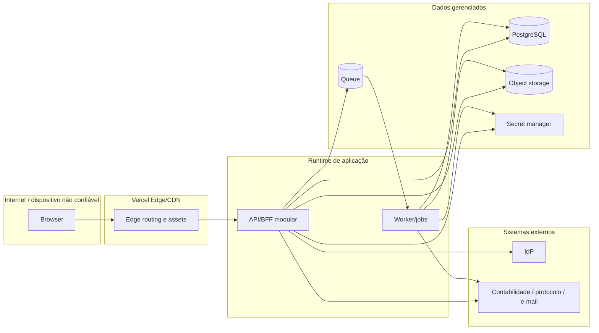

# Threat model — Patrimônio Inteligente

**Método:** STRIDE + abuso de negócio  
**Status:** baseline do Dia 2; revisão obrigatória a cada nova integração, arquivo, papel privilegiado ou mudança de trust boundary  
**Classificação:** não contém segredos, credenciais ou dados pessoais reais

## 1. Ativos de segurança

1. credenciais, sessões, desafios de recuperação e concessões de acesso;
2. dados pessoais de servidores/responsáveis;
3. cadastro e localização de bens;
4. valores, classificações e efeitos contábeis;
5. decisões, aprovações, portarias, laudos e documentos assinados;
6. ledger de estoque e comprovantes;
7. evidências de inventário, fotos e anexos;
8. relatórios oficiais e arquivos exportados;
9. trilha de auditoria e evidências de investigação;
10. segredos de integração, chaves de assinatura e configuração de produção;
11. disponibilidade do serviço em períodos de inventário/cutover;
12. integridade da migração e dos mapeamentos legados.

## 2. Atores

| Ator | Intenção esperada | Risco relevante |
| --- | --- | --- |
| Usuário público não autenticado | acessar entrada/ajuda | enumeração, abuso de login, exploração de frontend/API |
| Servidor administrativo | operar bens/processos no escopo | elevação de privilégio, erro, fraude interna |
| Responsável patrimonial | conferir/aceitar no próprio escopo | acesso horizontal e manipulação de evidência |
| Chefia/aprovador | decidir pendências | conflito de interesse, aprovação indevida |
| Operador de galpão | receber/entregar estoque | fraude de quantidade/recebedor, saldo inconsistente |
| Auditor/contabilidade | consultar dados amplos | extração massiva e exposição de PII |
| Administrador técnico | operar plataforma | abuso de privilégio e acesso a segredos |
| Integração externa | trocar mensagens | payload malicioso, replay, indisponibilidade |
| Atacante externo | obter acesso/dados ou indisponibilizar | credenciais expostas, credential stuffing, injeção, DDoS |
| Código/dependência comprometida | executar na cadeia | exfiltração, backdoor, supply-chain |

## 3. Trust boundaries

Cada seta cruza autenticação, autorização, validação, timeout e observabilidade adequados à fronteira. O browser nunca é fonte de verdade de identidade, permissão, preço, saldo, estado ou aprovação.

## 4. Ameaças priorizadas

| ID | STRIDE/abuso | Cenário | Impacto | Prioridade | Controles preventivos | Verificação |
| --- | --- | --- | --- | --- | --- | --- |
| TM-001 | Spoofing | uso de credencial que esteve no bundle/histórico | acesso indevido e PII | Crítica | contenção, rotação/revogação, IdP, MFA conforme política | issue #2, logs e teste pós-rotação |
| TM-002 | Spoofing | credential stuffing/brute force | tomada de conta | Alta | rate limit, backoff, MFA, detecção, senha não local | teste 429 e métricas |
| TM-003 | Information disclosure | enumeração por login/recuperação | descoberta de servidores/vínculos | Alta | resposta uniforme, timing controlado, canal verificado | testes com conta existente/inexistente |
| TM-004 | Tampering | forjar sessão em localStorage/cookie legível | acesso por papel falso | Crítica | cookie HttpOnly assinado/opaco, sessão server-side e revogação | alteração de storage não concede acesso |
| TM-005 | Elevation | alterar role/scope no request/JWT | privilégio administrativo | Crítica | claims mínimos, policy server-side, vínculo temporal | testes vertical/horizontal |
| TM-006 | Elevation/IDOR | acessar bem, transferência ou relatório de outro setor por ID | exposição/alteração horizontal | Crítica | autorização por recurso e escopo em toda API | matriz de testes BOLA |
| TM-007 | CSRF | comando com cookie de sessão disparado por site externo | transferência/alteração indevida | Alta | SameSite, token CSRF, Origin/Referer quando aplicável | teste sem token/origem |
| TM-008 | XSS | descrição/observação/anexo renderiza script | roubo de ação/dados | Alta | escaping, sanitização apenas quando HTML permitido, CSP | payloads XSS em campos |
| TM-009 | Tampering | mass assignment altera campos protegidos/status | burla de workflow | Crítica | DTO allowlist e comandos específicos | PATCH com campos extras |
| TM-010 | Repudiation | aprovação/baixa sem ator/motivo/evidência | fraude e não conformidade | Alta | auditoria append-only, assinatura/correlation ID | cobertura do catálogo de ações |
| TM-011 | Tampering | aceite/edição sobre versão antiga | perda de atualização/efeito incorreto | Alta | ETag/If-Match, transação e conflito 409 | testes concorrentes |
| TM-012 | Tampering | repetição de comando/webhook duplica efeito | bem/estoque/evento duplicado | Alta | idempotency key, dedup, event ID | repetição e replay |
| TM-013 | Denial of service | exportação/filtro sem limite | custo, timeout, indisponibilidade | Alta | paginação, budgets, jobs, quotas e cancelamento | carga e limites |
| TM-014 | Injection | SQL/NoSQL/template injection | leitura/escrita arbitrária | Crítica | queries parametrizadas, schemas, sem SQL livre | SAST/testes de payload |
| TM-015 | Formula injection | valor controlado inicia fórmula em CSV/XLSX | execução no computador do usuário | Alta | neutralização/escape e aviso de formato | abrir arquivo de teste seguro |
| TM-016 | File attack | upload com malware/polyglot/MIME falso | comprometimento/propagação | Alta | limite, magic bytes, quarentena, antimalware, storage privado | corpus de arquivos inválidos |
| TM-017 | Information disclosure | EXIF de foto expõe localização/dispositivo | PII/segurança física | Média/Alta | remover EXIF, validar metadados necessários | inspeção de arquivo derivado |
| TM-018 | Information disclosure | URL pública permanente de documento | vazamento por compartilhamento/cache | Crítica | autorização antes de URL assinada curta, no-store | acesso sem sessão/expirado |
| TM-019 | Tampering | documento alterado após assinatura | invalidade jurídica | Crítica | hash/versionamento, assinatura sobre versão imutável | alterar conteúdo invalida fluxo |
| TM-020 | Repudiation | auditoria editável ou incompleta | investigação inviável | Alta | append-only, acesso restrito, retenção, exportação assinada | tentativa de update/delete negada |
| TM-021 | Information disclosure | segredo/PII em log, trace, erro ou analytics | exposição secundária | Crítica | redaction, schemas, allowlist, testes | scan de logs e exceções |
| TM-022 | Spoofing/Tampering | webhook externo falso ou repetido | comando/evento indevido | Alta | assinatura, timestamp, nonce/event ID, replay window | assinatura inválida/replay |
| TM-023 | SSRF | integração/preview busca URL controlada | acesso a rede/metadata | Alta | allowlist, egress control, bloquear IPs privados/redirects | testes SSRF |
| TM-024 | Denial of service | dependência externa lenta bloqueia requests | cascata de falhas | Alta | timeout, circuit breaker, bulkhead, assíncrono | simulação de timeout |
| TM-025 | Tampering | falha entre commit e publicação perde evento | integração/auditoria divergente | Alta | transactional outbox e retry idempotente | teste de queda pós-commit |
| TM-026 | Tampering | saldo de estoque mantido por campo editável | saldo negativo/inconsistente | Crítica | ledger append-only, transação, reconciliação | concorrência de reservas/retiradas |
| TM-027 | Elevation/abuso | mesmo usuário solicita e aprova processo incompatível | fraude interna | Alta | segregação de função e policy por estado | teste com ator conflitante |
| TM-028 | Information disclosure | busca global indexa PII/segredo | extração em massa | Alta | índice allowlist, escopo, rate limit e audit | consulta por perfil e campo |
| TM-029 | Tampering | migração associa códigos duplicados ao bem errado | corrupção sistêmica | Crítica | staging, regras de match, quarentena, reconciliação | dry-run e amostra assinada |
| TM-030 | Repudiation | correção manual direta no banco | estado sem trilha | Alta | acesso break-glass, change ticket, script versionado e auditoria | revisão de acessos/log DB |
| TM-031 | Supply chain | dependência/action comprometida | execução maliciosa no build/runtime | Alta | lockfile, actions por SHA, SCA, SBOM, permissões mínimas | pipeline e revisão de atualização |
| TM-032 | Information disclosure | source map público revela código/rotas/dados embutidos | acelera exploração | Média/Alta | não embutir segredo; source map privado/controlado | inspeção de artefato |
| TM-033 | Abuse | IA gera consulta/ação fora do escopo | vazamento ou alteração | Crítica se habilitada | somente leitura inicial, ferramentas allowlist, policy antes/depois, fontes e kill switch | conjunto adversarial e logs redigidos |
| TM-034 | Abuse | notificação contém link que contorna autorização | acesso por encaminhamento | Alta | deep link reautoriza recurso; token de uso único quando necessário | abrir link em outro perfil |
| TM-035 | Denial of service | fila recebe tempestade de retries | custo e atraso | Alta | retry budget, DLQ, jitter, circuit breaker, quota | teste de falha prolongada |

## 5. Abuso de negócio por workflow

### Transferência

- transferir bem que já está em outro fluxo incompatível;
- trocar destino após aceite;
- aceitar em nome de outro responsável;
- efetivar parte do lote sem evidência;
- reutilizar comprovante de outro processo.

**Controles:** lock/versionamento do bem, snapshot dos itens, policy por estado, transação atômica, documento vinculado ao ID/hash do processo.

### Inventário

- marcar bem como encontrado sem estar no escopo;
- enviar observações duplicadas/offline em ordem conflitante;
- fechar setor com pendências ocultas;
- editar snapshot histórico;
- reabrir ciclo sem aprovação.

**Controles:** snapshot imutável, escopo server-side, idempotência, casos de divergência, regras de fechamento e reabertura auditada.

### Avaliação/baixa

- solicitante aprovar o próprio caso;
- substituir laudo após decisão;
- baixar bem com transferência/inventário incompatível;
- alterar valor/resultado depois do efeito.

**Controles:** segregação, documentos versionados, elegibilidade, máquina de estado, efeito atômico e reversão por processo separado.

### Galpão

- receber além do documento;
- duplicar nota/empenho;
- reservar saldo inexistente por concorrência;
- confirmar entrega para recebedor não autorizado;
- apagar movimento para ajustar saldo.

**Controles:** dedup, precisão decimal, ledger append-only, lock/transação, recebedor validado e reconciliação.

## 6. Controles por camada

### Browser

- sem segredo, senha ou sessão confiável em Web Storage;
- CSP e escaping;
- não apresentar dado fora do escopo recebido;
- não confiar em hidden/disabled como controle de autorização;
- limpar dados sensíveis ao encerrar sessão/trocar contexto;
- evitar cache offline de PII sem desenho específico.

### Edge/API

- TLS/HSTS e headers;
- autenticação, CSRF, rate limit e limits de payload;
- schema validation e allowlist;
- policy por ação/recurso/escopo;
- correlation ID, timeout e resposta Problem Details;
- cache key inclui identidade/escopo ou `no-store`.

### Domínio/dados

- invariantes e máquina de estado;
- transação, ETag, idempotência e outbox;
- constraints e menor privilégio SQL;
- criptografia em trânsito/repouso fornecida pelo serviço;
- backup/PITR e restore testado;
- auditoria append-only e retenção.

### Jobs/integrações

- identidade de serviço e secret manager;
- payload mínimo, assinatura, dedup e replay protection;
- retry classificado, DLQ e reprocessamento controlado;
- circuit breaker e egress allowlist;
- métricas de atraso, erro e reconciliação.

## 7. Riscos residuais/bloqueios

| ID | Bloqueio | Risco enquanto aberto | Fallback seguro | Owner sugerido |
| --- | --- | --- | --- | --- |
| TH-BLK-01 | credenciais históricas ainda não comprovadamente rotacionadas | conta comprometida | login permanece bloqueado | Segurança/TI |
| TH-BLK-02 | IdP não selecionado | sessão insegura/improvisada | não implementar login local | Segurança/Arquitetura |
| TH-BLK-03 | walkthrough autenticado incompleto | regra/permissão omitida | feature flag e contrato como proposta | Produto/Negócio |
| TH-BLK-04 | storage/antimalware não definidos | upload malicioso/vazamento | upload desabilitado | Infra/Segurança |
| TH-BLK-05 | integrações sem sandbox/contrato | corrupção/indisponibilidade | mock e conector desligado | Integração/Owner externo |
| TH-BLK-06 | retenção/LGPD não aprovada | retenção excessiva ou descarte indevido | sem exclusão automática | DPO/Arquivo |

## 8. Checklist de revisão por PR

- a mudança cria nova entrada, papel, dado sensível, arquivo ou integração?
- qual trust boundary é cruzada?
- autorização foi testada por API/deep link e escopo diferente?
- há idempotência, concorrência e falha de dependência?
- logs/auditoria estão redigidos?
- resposta/cache pode vazar entre usuários/escopos?
- há limite de volume e timeout?
- rollback/feature flag mantém estado consistente?
- contrato e threat model precisam de nova ameaça/controle?

## 9. Critério de aceite de segurança do Dia 2

O threat model é considerado utilizável quando cada ameaça crítica/alta possui: owner por função, controle preventivo, método de verificação e fallback seguro. Aprovação nominal de segurança/negócio permanece pendente e deve ser registrada no PR/issue antes de habilitar capacidades afetadas.
