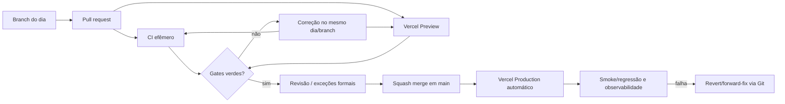

# Estratégia de ambientes e configuração

**Status:** baseline do Dia 3  
**Princípio:** código promovido por Git; configuração sensível injetada pelo provedor; nenhum ambiente usa dados reais fora da finalidade e autorização aprovadas.

## 1. Ambientes

| Ambiente | Origem | Finalidade | Dados permitidos | Deploy | Critério de promoção |
| --- | --- | --- | --- | --- | --- |
| CI efêmero | commit/PR | instalação, políticas, testes, tipos, lint, contrato e build | somente sintético e arquivos do repositório | GitHub Actions | todos os gates verdes |
| Preview/Homologação | PR | validar bundle e jornadas alteradas em URL Vercel isolada | sintético ou dataset anonimizado aprovado; sem credencial real no browser | automático pela integração Vercel | CI verde, preview Ready e roteiro do dia executado |
| Produção | `main` | serviço oficial quando os gates de segurança permitirem | dados oficiais conforme escopo/retention | automático após merge na `main` | aprovação, squash e checks exigidos |
| Legado somente leitura | sistema atual, durante migração/cutover | fonte oficial até a onda aprovada | dados oficiais sob controles existentes | fora deste repositório | reconciliação e decisão de cutover |

A URL principal permanece `https://patrimonio-react.vercel.app/`. Enquanto a identidade não for implantada, produção exibe a contenção preventiva do Dia 1.

## 2. Fluxo de promoção

Não há deploy manual de código. Preview e produção são derivados do SHA do GitHub.

## 3. Classificação de configuração

### Pública

Pode chegar ao browser somente quando não concede acesso nem revela dado sensível. Exemplo: versão pública do app ou URL pública sem credencial. Prefixos de bundler tornam o valor recuperável e não podem conter `SECRET`, `TOKEN`, `PASSWORD`, `PRIVATE_KEY`, `SERVICE_ROLE` ou equivalente.

### Server-only

IdP, banco, sessão, storage, observabilidade autenticada, integração e rate limits. Esses valores são lidos somente no runtime servidor/worker e fornecidos pelo secret manager/configuração criptografada do ambiente.

### Build-time

Somente valores não sensíveis necessários para compilar. Segredo build-time também pode aparecer em logs/camadas/artefatos e é proibido salvo mecanismo explicitamente aprovado e sem incorporação no bundle.

## 4. Contrato `.env.example`

O arquivo documenta nomes, não valores. O gate `check:env` exige:

- sintaxe `KEY=VALUE` e nomes em maiúsculas;
- ausência de duplicidade;
- conjunto mínimo documentado;
- material secreto sem valor;
- nenhum nome de segredo com prefixo público;
- `AUTH_LOCKDOWN_ENABLED=true` como único default aprovado nesta fase.

Um valor de exemplo plausível é tratado como risco, mesmo quando declarado “teste”.

## 5. Matriz inicial de variáveis

| Variável | Classe | Obrigatória agora | Owner por função | Comportamento ausente |
| --- | --- | --- | --- | --- |
| `APP_ENV` | server/build não sensível | não | DevOps | ambiente inferido pelo runtime; sem liberar recurso |
| `APP_BASE_URL` | server não sensível | antes de callbacks | DevOps | auth/callback indisponível |
| `AUTH_PROVIDER` | server | antes do Dia 4 | Segurança/Arquitetura | login bloqueado |
| `AUTH_ISSUER_URL` | server | antes do Dia 4 | Segurança/IdP | login bloqueado |
| `AUTH_CLIENT_ID` | server/config | antes do Dia 4 | Segurança/IdP | login bloqueado |
| `AUTH_CLIENT_SECRET` | segredo server | quando o fluxo exigir | Segurança/IdP | login bloqueado |
| `AUTH_CALLBACK_URL` | server | antes do Dia 4 | DevOps/Segurança | login bloqueado |
| `SESSION_SECRET` | segredo server | antes de sessão própria | Segurança | sessão não criada |
| `DATABASE_URL` | segredo server | antes de persistência | DBA/DevOps | endpoints dependentes retornam indisponível |
| `SUPABASE_URL` | server/config | somente se fornecedor aprovado | DBA/Arquitetura | integração desabilitada |
| `SUPABASE_ANON_KEY` | pública restrita por policy, se usada | somente se desenho aprovado | Segurança/DBA | cliente direto desabilitado |
| `SUPABASE_SERVICE_ROLE_KEY` | segredo server crítico | somente em worker/API autorizados | Segurança/DBA | operação privilegiada desabilitada |
| `SENTRY_DSN` | server/build conforme produto | quando observabilidade aprovada | DevOps/Privacidade | erro local estruturado sem envio externo |
| `OTEL_EXPORTER_OTLP_ENDPOINT` | server | quando collector aprovado | DevOps | traces externos desabilitados |
| `AUTH_LOCKDOWN_ENABLED` | server/build safe flag | sim nesta fase | Segurança | deve permanecer `true` |
| `AUTH_RATE_LIMIT_WINDOW_SECONDS` | server | antes do login | Segurança | login bloqueado |
| `AUTH_RATE_LIMIT_MAX_ATTEMPTS` | server | antes do login | Segurança | login bloqueado |

A presença de pacote Supabase no repositório não aprova o fornecedor nem acesso direto do browser.

## 6. Validação no runtime futuro

Cada entrada server-side terá schema tipado e validação no startup/primeiro uso controlado:

- valor ausente em capacidade opcional mantém a feature flag desligada;
- valor ausente em capacidade habilitada falha de forma segura, sem imprimir o valor;
- URL, inteiro, enum e duração recebem validação explícita;
- configuração inválida não cai para credencial default;
- produção rejeita `localhost`, issuer inseguro e callback fora da allowlist;
- logs registram apenas nome da chave/erro, nunca o conteúdo;
- rotação ocorre no provedor sem rebuild do frontend.

## 7. Dados por ambiente

- CI usa fixtures sintéticas versionadas e pequenas.
- Preview não recebe dump de produção; amostras reais exigem autorização, minimização e mascaramento irreversível quando possível.
- Migração real ocorre em ambiente protegido separado, com staging, linhagem e acesso temporário.
- URLs de documentos são privadas e curtas, inclusive em homologação.
- e-mail, protocolo, assinatura e integrações usam sandbox/recipient allowlist antes de produção.
- jobs de preview não publicam efeitos oficiais.

## 8. Proteções operacionais

- variáveis de Preview e Production são separadas no provedor;
- segredo não é copiado para comentário, issue, screenshot, log ou arquivo de suporte;
- acesso a configuração segue menor privilégio e revisão periódica;
- mudança de variável crítica possui ticket/owner/rollback;
- deploy registra SHA e ambiente;
- cache de resposta sensível usa `no-store`;
- apagar variável crítica desabilita a capacidade, não ativa fallback inseguro.

## 9. Checklist de ambiente

### Preview

- CI do mesmo SHA verde;
- build Vercel Ready;
- contenção de autenticação preservada quando aplicável;
- nenhuma variável de produção disponível desnecessariamente;
- dados sintéticos/anonimizados;
- rotas alteradas validadas por teclado/viewport/API conforme o dia.

### Produção

- merge por squash na `main`;
- Vercel status success para o SHA;
- variáveis obrigatórias validadas server-side;
- logs/telemetria sem PII/segredo;
- smoke tests e métricas observados;
- rollback por Git preparado;
- mudança de dado possui migration/cutover compatível.

## 10. Bloqueios atuais

| ID | Bloqueio | Fallback seguro | Owner sugerido |
| --- | --- | --- | --- |
| ENV-BLK-01 | IdP e variáveis não configurados | autenticação permanece bloqueada | Segurança/TI |
| ENV-BLK-02 | PostgreSQL e pooling não aprovados | nenhuma persistência real | DBA/DevOps |
| ENV-BLK-03 | storage/fila/telemetria não aprovados | uploads/jobs/envio externo desabilitados | Infra/Segurança |
| ENV-BLK-04 | política de dados de homologação não aprovada | somente sintético | DPO/Produto |
| ENV-BLK-05 | branch protection não configurada no GitHub | não declarar M2 encerrado; aplicar configuração administrativa | Admin GitHub |
