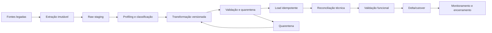

# Estratégia de migração, staging e reconciliação

**Status:** baseline proposta — Dia 2  
**Objetivo:** migrar em ondas reproduzíveis, sem copiar PII para ambientes inadequados, preservando códigos legados e produzindo evidência quantitativa/funcional antes do cutover.

## 1. Princípios

1. O legado permanece fonte oficial até o cutover aprovado do respectivo domínio.
2. Toda extração é imutável, identificada por `migration_run_id`, data de corte, origem e hash.
3. Dados entram primeiro em staging; nenhuma carga direta em tabelas de domínio.
4. Transformações são determinísticas, versionadas e repetíveis.
5. Registros ambíguos entram em quarentena, nunca em correspondência “mais provável” silenciosa.
6. IDs internos novos são imutáveis; chaves/códigos legados são preservados em tabela de mapeamento.
7. Reconciliação combina contagem, integridade, totais, agrupamentos e amostra funcional.
8. Dry-run usa dados mascarados/sintéticos quando não houver ambiente protegido autorizado.
9. Escrita dupla não é adotada por padrão; delta/cutover será preferido para reduzir inconsistência.
10. Rollback considera dados e tráfego; não basta redeploy do frontend.

## 2. Pipeline

## 3. Estrutura de staging

### 3.1 Schemas

- `migration_raw`: cópia fiel da origem, acesso restrito, sem regra de negócio.
- `migration_stage`: dados tipados/normalizados com colunas de erro e linhagem.
- `migration_quarantine`: registros bloqueados e motivos estruturados.
- `migration_control`: runs, checkpoints, hashes, métricas, regras e aprovações.
- `migration_reconciliation`: resultados técnicos/funcionais por run e entidade.

### 3.2 Colunas técnicas mínimas

| Coluna | Finalidade |
| --- | --- |
| `migration_run_id` | identifica execução |
| `source_system` | origem |
| `source_entity` | tabela/arquivo/endpoint |
| `source_key` | chave original textual |
| `source_row_number` | rastreabilidade em arquivo |
| `source_hash` | detectar alteração/duplicidade |
| `extracted_at` | instante da extração |
| `transformation_version` | versão da regra |
| `validation_status` | valid/quarantined/skipped |
| `validation_errors` | códigos estruturados, sem segredo |
| `target_id` | ID interno após carga |
| `loaded_at` | instante de carga |

## 4. Inventário de fontes obrigatório

Antes de cada onda, registrar:

- owner da fonte e contato operacional;
- tecnologia e modo de extração;
- tabelas/arquivos/endpoints e relacionamentos;
- volumes total/diário/pico;
- charset, timezone, precisão e formatos;
- campos PII/segredo/financeiro;
- chaves naturais, duplicidades e nulos;
- histórico disponível e retenção;
- operações manuais fora do sistema;
- janela de congelamento/delta;
- relatório oficial usado para reconciliar.

Enquanto o walkthrough e acesso ao banco legado não existirem, esse inventário permanece bloqueado e nenhuma carga real deve ser executada.

## 5. Ondas propostas

| Onda | Conteúdo | Dependências | Critério de entrada | Critério de saída |
| --- | --- | --- | --- | --- |
| W0 | infraestrutura de migração, catálogo, regras e dados sintéticos | banco-alvo e acesso segregado | arquitetura/segurança aprovadas | pipeline repetível sem dados reais |
| W1 | estrutura organizacional, locais, categorias e contas | owners das fontes mestres | chaves e vigências mapeadas | zero ciclo/órfão crítico; amostra aprovada |
| W2 | identidades locais mínimas, vínculos, papéis e escopos | IdP e W1 | subject externo e política de PII definidos | 100% dos vínculos críticos reconciliados; sem senha importada |
| W3 | bens, identificadores, valores, localização e classificação | W1 | dicionário do bem e unicidade homologados | contagens/totais/agrupamentos dentro da tolerância |
| W4 | responsabilidades, portarias e histórico vigente | W2 + W3 | granularidade/vigência homologadas | sem sobreposição inválida; responsáveis vigentes aprovados |
| W5 | workflows abertos: transferências, inventários, avaliações/baixas e galpão | W3 + W4 | máquinas de estado e mapeamento de status aprovados | todos os casos abertos classificados ou em quarentena com owner |
| W6 | documentos/anexos e referências externas | storage/antimalware/retention | formatos e direitos autorizados | hashes/contagens e acesso testados |
| W7 | históricos, auditoria e eventos necessários | política de retenção | escopo temporal aprovado | amostra e totais por período reconciliados |
| W8 | read models, relatórios e indicadores | ondas anteriores | fórmulas oficiais versionadas | relatórios prioritários reconciliados e assinados |
| W9 | delta final e cutover | dois dry-runs aprovados | go/no-go, backup e janela | smoke tests, reconciliação final e ata |

## 6. Mapeamento e transformação

Cada regra possui:

- ID (`MAP-<domínio>-NNN`);
- campo/origem e campo/destino;
- normalização sem destruir o valor original;
- enumeração e tratamento de desconhecido;
- regra de nulo/default;
- precisão/arredondamento;
- timezone/data de corte;
- dependência de lookup;
- severidade de falha (`block`, `quarantine`, `warn`);
- exemplos exclusivamente sintéticos;
- owner e versão.

### 6.1 Regras proibidas

- usar senha do legado como senha do novo sistema;
- deduzir pessoa somente por nome sem revisão;
- truncar identificador/valor silenciosamente;
- substituir nulo por valor semanticamente falso;
- mapear status crítico desconhecido para “ativo/concluído”;
- ajustar total financeiro para “bater” sem explicar diferenças;
- remover duplicidade sem manter linhagem e decisão;
- copiar arquivos sem hash, tipo e política de acesso.

## 7. Matching e chaves

Ordem de preferência:

1. chave institucional estável confirmada;
2. código legado único dentro do sistema/entidade;
3. chave composta homologada;
4. matching assistido com revisão humana;
5. quarentena.

A tabela `legacy_mapping` registra sistema, entidade, chave, ID interno, confiança/método, run de origem e histórico de correção. Alterar mapping após uso exige análise de impacto e reconciliação.

## 8. Validações pré-carga

- schema, encoding, tamanho e hash;
- nulidade/obrigatoriedade;
- enumerações conhecidas;
- formato e intervalo de datas/valores;
- unicidade e duplicidades;
- referências disponíveis;
- intervalos de vigência não sobrepostos;
- hierarquia sem ciclo;
- precisão monetária e soma de componentes;
- status/workflow mapeável;
- conteúdo de arquivo e malware quando aplicável;
- ausência de segredo em campos/arquivos não esperados.

## 9. Carga idempotente

- cada registro usa `migration_run_id + source_system + source_entity + source_key` como identidade de importação;
- reexecutar a mesma versão não cria duplicidade;
- alteração de regra gera nova versão/run e diff explícito;
- commits por lote limitado, com checkpoint e relatório;
- falha de um lote não deixa referências incompletas;
- criação de domínio emite auditoria de migração, mas notificações externas permanecem suprimidas no dry-run;
- jobs e integrações ficam em modo migração/feature flag para não produzir efeitos oficiais indevidos.

## 10. Reconciliação

### 10.1 Métricas técnicas mínimas

| Classe | Exemplos | Tolerância inicial |
| --- | --- | --- |
| contagem | total por entidade, status, ano, unidade | 0 diferença para escopo obrigatório; exceção assinada para descartes |
| integridade | órfãos, FK, duplicidades, ciclos, sobreposição | zero crítico |
| monetário | soma aquisição, depreciação/valor quando aplicável | 0 na unidade monetária após regra de arredondamento homologada |
| quantidade | estoque, itens de documento, bens por lote | zero para posição de corte |
| temporal | vigentes por data, casos abertos, datas mín/máx | 0 diferença não explicada |
| mapping | origem sem destino, destino múltiplo, baixa confiança | 100% dos críticos resolvidos; demais com owner/quarentena |
| arquivo | contagem, tamanho, hash e referência | 100% dos arquivos no escopo ou exceção explícita |

Tolerâncias finais são definidas pelo owner; a ferramenta nunca oculta diferença abaixo da tolerância.

### 10.2 Reconciliação funcional

Para cada módulo prioritário:

1. selecionar amostra por risco e aleatória;
2. comparar ficha completa no legado e destino na mesma data de corte;
3. executar uma jornada somente leitura e uma mutação sintética no ambiente apropriado;
4. gerar relatório oficial equivalente com os mesmos filtros;
5. registrar diferença, causa e decisão;
6. obter assinatura do owner funcional.

### 10.3 Assinatura

O relatório registra: run, commits de ETL/schema/app, origem, data de corte, regras, métricas, diferenças, exceções, owners e decisão go/no-go.

## 11. Dry-runs

- **DR0 — sintético:** valida pipeline, idempotência, rollback e observabilidade.
- **DR1 — amostra protegida:** valida formatos/regras e produz primeiro perfil de qualidade.
- **DR2 — volume integral:** mede duração, capacidade, reconciliação e janela.
- **DR3 — ensaio de cutover:** executa snapshot + delta + smoke + rollback dentro da janela.

Go-live exige pelo menos dois dry-runs consecutivos do volume relevante dentro das tolerâncias e da janela aprovada.

## 12. Estratégia de delta e cutover

### 12.1 Preferência

1. snapshot consistente em `T0`;
2. extrair mudanças posteriores por timestamp/CDC/log confiável;
3. aplicar deltas em ordem idempotente;
4. congelar escrita legado na janela curta;
5. aplicar delta final;
6. reconciliar e executar smoke tests;
7. trocar tráfego/feature flags;
8. manter legado em somente leitura pelo período acordado.

Se a origem não oferecer delta confiável, usar janela de congelamento maior ou captura operacional formal; não improvisar dual-write sem desenho de conflito.

### 12.2 Go/no-go

Go somente se:

- backup/PITR e rollback testados;
- todos os bloqueios críticos possuem decisão;
- duração está dentro da janela;
- reconciliação atende tolerâncias;
- autenticação/autorização e jornadas críticas passam;
- observabilidade/plantão/owners estão ativos;
- sponsor, negócio, segurança, DBA e DevOps registraram decisão.

## 13. Rollback

### Antes do tráfego novo

- descartar carga por `migration_run_id` em ordem segura;
- restaurar schema/dados do backup quando necessário;
- corrigir regra e reexecutar.

### Após abertura com escrita no novo sistema

Rollback simples para o legado pode perder novas transações. Portanto, antes do go-live deve existir uma das opções aprovadas:

- janela sem escrita no novo durante validação final;
- exportação reversa reconciliada dos novos eventos;
- decisão de forward-fix com sistema novo como fonte oficial;
- operação manual controlada para volume muito baixo.

A opção e o limite temporal ficam no runbook de cutover. Nenhum botão de rollback deve ser apresentado como seguro sem essa decisão de dados.

## 14. Segurança e privacidade

- extrações criptografadas em trânsito e repouso;
- acesso just-in-time e menor privilégio;
- arquivos temporários com expiração e deleção verificada;
- PII mascarada/tokenizada fora do ambiente autorizado;
- logs de ETL sem conteúdo de linha sensível;
- credenciais via secret manager, nunca em script/CSV;
- relatório de acesso e descarte ao final da migração;
- notificação de incidentes conforme `SECURITY.md`.

## 15. Observabilidade

Por run e etapa:

- início/fim/duração;
- linhas lidas, válidas, quarentenadas, carregadas e ignoradas;
- bytes/arquivos;
- throughput e backlog;
- erros por código/regra, nunca payload sensível;
- retries e checkpoints;
- recursos do banco/worker;
- métricas de reconciliação;
- correlation ID e commit/version.

## 16. Artefatos por onda

- source inventory;
- data dictionary/mapping versionado;
- scripts/migrations e hashes;
- perfil de qualidade;
- relatório de carga;
- relatório de reconciliação;
- amostras redigidas;
- ata do owner;
- plano/resultado de rollback;
- atualização da matriz de paridade e riscos.

## 17. Bloqueios atuais

| ID | Bloqueio | Consequência | Fallback/ação |
| --- | --- | --- | --- |
| MIG-BLK-01 | acesso e schema do legado não disponíveis | não é possível inventariar fonte nem executar extração | manter modelo/contratos; escalar produto/DBA |
| MIG-BLK-02 | regras/fórmulas oficiais não homologadas | reconciliação funcional incompleta | catálogo do Dia 1; owner por relatório |
| MIG-BLK-03 | banco-alvo não selecionado/configurado | não é possível criar staging | migrations/modelo sem conexão real |
| MIG-BLK-04 | política de PII/retention pendente | risco de copiar/reter indevidamente | usar somente sintético; sem carga real |
| MIG-BLK-05 | janela e estratégia de delta desconhecidas | cutover não estimável | medir após acesso; não adotar dual-write |
| MIG-BLK-06 | volumes desconhecidos | budgets de duração/particionamento provisórios | profiling na primeira extração autorizada |

## 18. Definition of Done da migração

Uma entidade/onda somente é migrada quando carga, reconciliação técnica, validação funcional, segurança, rollback e owner estão documentados. “Tabela carregada” não equivale a migração concluída.
